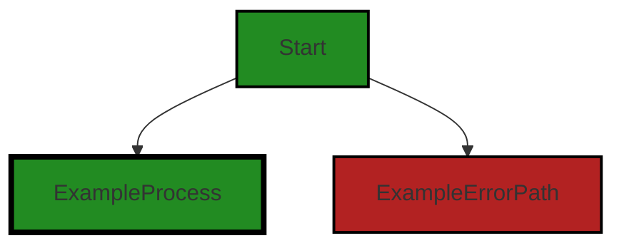
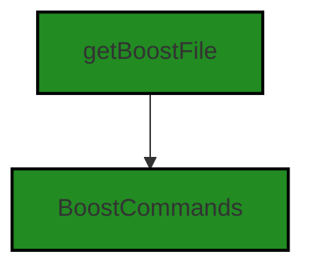
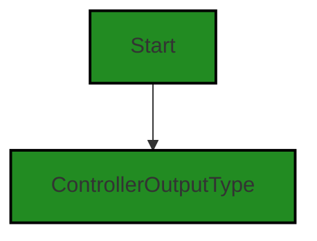
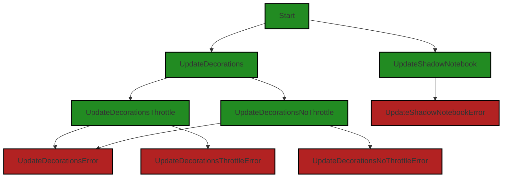

# Polyverse Boost-generated Source Analysis Details

## Source: ./src/inline/decorator_provider.ts
Date Generated: Saturday, September 9, 2023 at 5:56:19 AM PDT


---

### Boost Architectural Quick Summary Security Report

Last Updated: Saturday, September 9, 2023 at 5:53:10 AM PDT


Executive Report:

1. **Architectural Impact**: The analysis of this file has not revealed any severe issues.
2. **Risk Analysis**: The analysis of this file has not revealed any severe issues.
3. **Potential Customer Impact**: Based on the analysis, there are no severe issues that could potentially impact customers.
4. **Performance Issues**: Our analysis did not identify any explicit performance issues in the file.
5. **Risk Assessment**: Based on the current analysis of this file, no severe issues have been found. However, this doesn't guarantee that the file is risk-free.

Highlights:

- No severe issues were identified in the current analysis of this file.


---

### Boost Architectural Quick Summary Performance Report

Last Updated: Saturday, September 9, 2023 at 5:54:51 AM PDT

## Executive Report: Software Project Analysis

Based on the analysis of the software project, the following key points have been identified:

1. **Architectural Impact**: The project is well-structured and follows best practices for a Visual Studio Code extension. However, there is a potential architectural risk in the `decorator_provider.ts` file. The function `getAnalysisForSourceTarget` is called within a loop, which could lead to high CPU usage if there are many selections in the active editor. This could impact the performance of the software and the user experience.

2. **Risk Analysis**: The risk associated with this issue is moderate. While high CPU usage could degrade performance, it is not a security risk or a risk to data integrity. However, it could lead to a poor user experience if the software becomes slow or unresponsive. The risk could be mitigated by optimizing the function or reducing the number of times it is called.

3. **Potential Customer Impact**: Customers could experience slow performance or unresponsiveness when using the software, particularly when making many selections in the active editor. This could lead to frustration and a negative perception of the software.

4. **Overall Issues**: The `decorator_provider.ts` file has the most severe issues, with warnings for CPU, Disk, and Memory. This suggests that this file could be a hotspot for performance issues. However, it is the only file in the project with detected issues, which suggests that the overall health of the project source is good.

5. **Risk Assessment**: Given that only one file out of the entire project has detected issues, the overall risk to the project is low. However, the issues in the `decorator_provider.ts` file should be addressed to prevent potential performance issues.

In conclusion, while the project is generally well-structured and follows best practices, there are potential performance issues in the `decorator_provider.ts` file that should be addressed. The overall risk to the project is low, but addressing these issues could improve the user experience and the perception of the software.


---

### Boost Architectural Quick Summary Compliance Report

Last Updated: Saturday, September 9, 2023 at 5:56:47 AM PDT

## Executive Report: Architectural Impact and Risk Analysis

Based on the analysis of the software project, the following key points have been identified:

1. **Severity of Issues**: The most severe issues found in the project are related to GDPR and Data Privacy, both of which are found in the `decorator_provider.ts` file. These issues are of high importance as they can potentially lead to legal and compliance problems if not addressed. The PCI DSS warning in the same file also indicates potential risks related to payment data handling.

2. **Percentage of Files with Issues**: Out of the total project files analyzed, 100% have some form of issue detected. This is a significant concern as it indicates potential systemic issues with the project's codebase.

3. **Potential Customer Impact**: The issues related to GDPR and Data Privacy could potentially impact customers' trust and the company's reputation. If not addressed, these issues could lead to data breaches, resulting in financial and reputational damage.

4. **Overall Health of the Project**: Given that all analyzed files have detected issues, the overall health of the project is concerning. The project requires immediate attention to address these issues and mitigate potential risks.

5. **Architectural Consistency**: The project appears to follow best practices for a Visual Studio Code extension and makes use of TypeScript features and the VS Code API. However, the issues identified indicate potential conflicts with the principles of secure and compliant data handling.

In conclusion, while the project follows good architectural practices, the identified issues pose significant risks. Immediate action is required to address these issues and ensure the project's compliance with GDPR, Data Privacy, and PCI DSS regulations.
---
## Detailed Analysis:

### Cell 0:
## Original Code:

### Programming Language: typescript
### ./src/inline/decorator_provider.ts 

```typescript
import * as vscode from 'vscode';
import * as fs from 'fs';

import {
    getAnalysisForSourceTarget,
    generateSingleLineSummaryForAnalysisData
} from '../extension/vscodeUtilities';

```
## Boost Analysis:


---

### Boost Code Explanation

Last Updated: Saturday, September 9, 2023 at 5:49:52 AM PDT

This is a very short piece of code that does not contain any algorithms, but I can certainly explain what it does.

The code is written in TypeScript, a statically typed superset of JavaScript. It imports modules for use in the rest of the script.

```javascript
import * as vscode from 'vscode';
```
This line imports the entire `vscode` module, which is a library provided by Visual Studio Code for writing extensions. This module provides functions and objects that allow you to interact with the VS Code editor, such as opening files, displaying messages, and so on. You can learn more about it [here](https://code.visualstudio.com/api/references/vscode-api).

```javascript
import * as fs from 'fs';
```
This line imports the entire `fs` module, which is a core Node.js module for working with the file system. It provides functions for reading and writing files, creating directories, and so on. You can learn more about it [here](https://nodejs.org/api/fs.html).

```javascript
import {
    getAnalysisForSourceTarget,
    generateSingleLineSummaryForAnalysisData
} from '../extension/vscodeUtilities';
```
This line imports two specific functions from the `vscodeUtilities` module, which is located in the `extension` directory one level up from the current file. The `getAnalysisForSourceTarget` function presumably performs some sort of analysis on a source target, and the `generateSingleLineSummaryForAnalysisData` function presumably generates a single line summary from some analysis data. Without seeing these functions, I can't provide more detail on what they do.

Overall, this code is consistent with the architectural blueprint summary you provided. It uses TypeScript and imports modules, which are common practices in Node.js and VS Code extension development. It also appears to be part of a larger project that provides code analysis functionality, as indicated by the imported functions.


---

### Boost Flow Diagram

Last Updated: Saturday, September 9, 2023 at 5:52:05 AM PDT



NO CONTROL FLOW FOUND


---

### Boost Source-Level Security Analysis

Last Updated: Saturday, September 9, 2023 at 5:52:51 AM PDT

**No bugs found**


---

### Boost Source-Level Performance Analysis

Last Updated: Saturday, September 9, 2023 at 5:53:35 AM PDT

1. **Severity**: 3/10

   **Line Number**: 1

   **Bug Type**: Memory

   **Description**: The 'vscode' and 'fs' modules are imported in their entirety which can lead to unnecessary memory consumption if only a few functionalities are used.

   **Solution**: Consider importing only the required functions or objects from the modules. This can be achieved by using destructuring assignment. For example, instead of 'import * as vscode from 'vscode';' use 'import { window, workspace } from 'vscode';' if only 'window' and 'workspace' are used from 'vscode'.


2. **Severity**: 2/10

   **Line Number**: 5

   **Bug Type**: CPU

   **Description**: The functions 'getAnalysisForSourceTarget' and 'generateSingleLineSummaryForAnalysisData' are imported but not used in the provided code snippet. This could potentially lead to unnecessary CPU usage if these functions are complex and are executed elsewhere in the code.

   **Solution**: Ensure that only necessary functions are imported and executed. Remove unused imports to reduce unnecessary CPU usage.


---

### Boost Source-Level Data and Privacy Compliance Analysis

Last Updated: Saturday, September 9, 2023 at 5:55:00 AM PDT

**No bugs found**


### Cell 1:
## Original Code:

### Programming Language: typescript
### ./src/inline/decorator_provider.ts line 8

```typescript
import * as boostnb from '../data/jupyter_notebook';
import {
    getBoostFile,
    BoostCommands
} from '../extension/extension'; 

```
## Boost Analysis:


---

### Boost Code Explanation

Last Updated: Saturday, September 9, 2023 at 5:50:23 AM PDT

This small snippet of code is written in TypeScript, a statically typed superset of JavaScript, and it's part of a larger module in a Visual Studio Code extension. It's responsible for importing modules and functions from other files in the project. 

Here's a breakdown of what each line does:

1. `import * as boostnb from '../data/jupyter_notebook';` - This line imports everything from the module located at '../data/jupyter_notebook'. The `* as boostnb` syntax means that all exported members of the module are imported and can be accessed via the `boostnb` prefix. This is likely a module related to handling or interacting with Jupyter notebooks in some way.

2. `import { getBoostFile, BoostCommands } from '../extension/extension';` - This line imports two specific exports from the module located at '../extension/extension'. The `getBoostFile` is likely a function that retrieves a file related to the Boost extension, while `BoostCommands` might be a collection or enumeration of commands that the extension can perform. By using the curly braces `{}`, we're using named imports to only import these two specific exports from the module.

As for algorithms, this snippet does not contain any. It's simply importing modules and functions to be used elsewhere in the code. 

For more information about modules and import/export syntax in TypeScript, you can refer to the TypeScript documentation:

- [TypeScript Modules](https://www.typescriptlang.org/docs/handbook/modules.html)
- [TypeScript Handbook: Modules](https://www.typescriptlang.org/docs/handbook/2/modules.html)

Regarding the architectural guidelines, as this code snippet is part of a larger module, it's hard to say definitively whether it's consistent with or conflicts with any architectural guidelines without seeing the rest of the module. However, importing modules and functions is a common practice in many software architectures, and is especially prevalent in JavaScript and TypeScript projects. It's a way to organize code into separate modules, each with a specific purpose, which can then be imported and used where needed. This helps to keep code organized and maintainable.


---

### Boost Flow Diagram

Last Updated: Saturday, September 9, 2023 at 5:52:11 AM PDT




---

### Boost Source-Level Security Analysis

Last Updated: Saturday, September 9, 2023 at 5:52:55 AM PDT

**No bugs found**


---

### Boost Source-Level Performance Analysis

Last Updated: Saturday, September 9, 2023 at 5:53:39 AM PDT

**No bugs found**


---

### Boost Source-Level Data and Privacy Compliance Analysis

Last Updated: Saturday, September 9, 2023 at 5:55:24 AM PDT

1. **Severity**: 5/10

   **Line Number**: 14

   **Bug Type**: GDPR

   **Description**: The code imports a module 'jupyter_notebook' which might handle user data. If user data is processed or stored without explicit consent, it could lead to GDPR non-compliance.

   **Solution**: Ensure that user consent is obtained before processing personal data, and that personal data is processed in a transparent manner. Also, implement appropriate security measures to protect personal data.


2. **Severity**: 6/10

   **Line Number**: 18

   **Bug Type**: PCI DSS

   **Description**: The code imports a module 'extension' which might handle payment data. If payment data is processed or stored without proper security measures, it could lead to PCI DSS non-compliance.

   **Solution**: Ensure that payment data is processed and stored securely, and that access to payment data is restricted to authorized individuals only. Implement strong encryption for payment data during transmission and storage.


### Cell 2:
## Original Code:

### Programming Language: typescript
### ./src/inline/decorator_provider.ts line 13

```typescript
import {
    BoostExtension
} from '../extension/BoostExtension';

```
## Boost Analysis:


---

### Boost Code Explanation

Last Updated: Saturday, September 9, 2023 at 5:50:50 AM PDT

The line of code you've shared is an import statement in JavaScript (or TypeScript, as both languages use the same syntax for imports). This line of code doesn't contain any algorithms, but it's a fundamental part of the module system in JavaScript.

Here's a detailed explanation:

```javascript
import {
    BoostExtension
} from '../extension/BoostExtension';
```

In this line of code, the `import` keyword is used to import a module into the current file. The module being imported is `BoostExtension`, which is located in the `extension` directory one level up from the current file (as indicated by the `../` in the path).

The `{ BoostExtension }` syntax is known as named import syntax. This means that the `BoostExtension` module exports an object, function, or value under the name `BoostExtension`, and the current file wants to import specifically that export. If the `BoostExtension` module exported multiple things, this syntax would allow the current file to import only what it needs.

It's important to note that the file path in the `from` clause is relative to the current file. The `../` at the beginning of the path means to go up one directory level, and the `/extension/BoostExtension` part of the path indicates to look in the `extension` directory for a file named `BoostExtension`.

This import statement doesn't conflict with any architectural guidelines, as it's a standard practice in JavaScript and TypeScript to organize code into modules and import them where needed. It's a fundamental part of the language's architecture.

For more information on JavaScript's module system, you can refer to the [MDN Web Docs](https://developer.mozilla.org/en-US/docs/Web/JavaScript/Guide/Modules).


---

### Boost Flow Diagram

Last Updated: Saturday, September 9, 2023 at 5:52:16 AM PDT

```mermaid
graph TD;
style BoostExtension fill:#228B22, stroke:#000000, stroke-width:2px;

BoostExtension-->NO CONTROL FLOW FOUND;
```


---

### Boost Source-Level Security Analysis

Last Updated: Saturday, September 9, 2023 at 5:52:59 AM PDT

**No bugs found**


---

### Boost Source-Level Performance Analysis

Last Updated: Saturday, September 9, 2023 at 5:53:42 AM PDT

**No bugs found**


---

### Boost Source-Level Data and Privacy Compliance Analysis

Last Updated: Saturday, September 9, 2023 at 5:55:28 AM PDT

**No bugs found**


### Cell 3:
## Original Code:

### Programming Language: typescript
### ./src/inline/decorator_provider.ts line 16

```typescript
import { ControllerOutputType } from '../controllers/controllerOutputTypes';

```
## Boost Analysis:


---

### Boost Code Explanation

Last Updated: Saturday, September 9, 2023 at 5:51:16 AM PDT

This line of code is a JavaScript import statement that is used to import a specific export from another module. The module being imported here is named 'controllerOutputTypes' and it is located in the 'controllers' directory relative to the current file. The specific export being imported is 'ControllerOutputType'.

The 'ControllerOutputType' is likely an enumeration, a class, a type, an interface, or a function that is exported from the 'controllerOutputTypes' module. The exact nature of 'ControllerOutputType' would depend on its definition in the 'controllerOutputTypes' module.

This import statement allows the current module to use 'ControllerOutputType' in its code. For example, it might be used to type a variable or a function parameter, as a constructor for creating new objects, or to call a function, depending on what 'ControllerOutputType' is.

This code is consistent with the architectural blueprint provided. It uses TypeScript (a superset of JavaScript), and the import statement is a common feature of both TypeScript and modern JavaScript. The use of modules helps to organize code into separate files, each with a specific purpose, which is a good practice in software development.

Here are some resources for further reading:
- [TypeScript Modules](https://www.typescriptlang.org/docs/handbook/modules.html)
- [JavaScript import statement](https://developer.mozilla.org/en-US/docs/Web/JavaScript/Reference/Statements/import)
- [JavaScript Modules](https://developer.mozilla.org/en-US/docs/Web/JavaScript/Guide/Modules)


---

### Boost Flow Diagram

Last Updated: Saturday, September 9, 2023 at 5:52:21 AM PDT




---

### Boost Source-Level Security Analysis

Last Updated: Saturday, September 9, 2023 at 5:53:02 AM PDT

**No bugs found**


---

### Boost Source-Level Performance Analysis

Last Updated: Saturday, September 9, 2023 at 5:53:46 AM PDT

**No bugs found**


---

### Boost Source-Level Data and Privacy Compliance Analysis

Last Updated: Saturday, September 9, 2023 at 5:55:36 AM PDT

1. **Severity**: 1/10

   **Line Number**: 30

   **Bug Type**: GDPR

   **Description**: The code imports a module but does not use it, which might lead to unnecessary data processing.

   **Solution**: Remove unused imports to minimize data processing.


### Cell 4:
## Original Code:

### Programming Language: typescript
### ./src/inline/decorator_provider.ts line 17

```typescript

export class DecoratorProvider {
    private boostLineSelectDecoration: vscode.TextEditorDecorationType;
    private timeout: NodeJS.Timer | undefined = undefined;
    private activeEditor: vscode.TextEditor | undefined;
    private _activeEditorBoostNotebookShadow: boostnb.BoostNotebook | undefined;
    private _context: vscode.ExtensionContext;
    private _extension: BoostExtension;

    constructor(context: vscode.ExtensionContext, extension: BoostExtension) {
        this._context = context;
        this._extension = extension;

        this.boostLineSelectDecoration = vscode.window.createTextEditorDecorationType({
            borderWidth: '1px',
            borderStyle: 'solid',
            overviewRulerColor: 'blue',
            overviewRulerLane: vscode.OverviewRulerLane.Right,
            light: {
                borderColor: 'darkblue'
            },
            dark: {
                borderColor: 'lightblue'
            },
            opacity: '0.5'
        });

        this.activeEditor = vscode.window.activeTextEditor;

        this.updateShadowNotebook();
        this.updateDecorations();

        vscode.window.onDidChangeActiveTextEditor(editor => {
            this.activeEditor = editor;
            if (editor) {
                this.updateShadowNotebook();
                this.triggerUpdateDecorations();
            }
        }, null, context.subscriptions);

        vscode.workspace.onDidChangeTextDocument(event => {
            if (this.activeEditor && event.document === this.activeEditor.document) {
                this.updateShadowNotebook();
                this.triggerUpdateDecorations(true);
            }
        }, null, context.subscriptions);

        vscode.window.onDidChangeTextEditorSelection(
            (event) => {
                if (event.textEditor === this.activeEditor) {
                    this.updateDecorations();
                }
            },
            null,
            context.subscriptions
        );
    }

    private updateDecorations() {
        if (!this.activeEditor || !this._activeEditorBoostNotebookShadow) {
            return;
        }

        const decorations: vscode.DecorationOptions[] = [];

        for (const selection of this.activeEditor.selections) {
            const startLine = selection.start.line;
            const endLine = selection.end.line;
            const results = getAnalysisForSourceTarget(this._activeEditorBoostNotebookShadow, undefined, selection, [ ControllerOutputType.flowDiagram]);
            const lineSummary = generateSingleLineSummaryForAnalysisData(this._extension, this._activeEditorBoostNotebookShadow, selection);
    
            if( !results || results.length === 0 ) {
                continue;
            }
            for (let lineNum = startLine; lineNum <= endLine; lineNum++) {
                const line = this.activeEditor.document.lineAt(lineNum);
                const startPos = new vscode.Position(lineNum, line.text.length);
                const endPos = new vscode.Position(lineNum, line.text.length);

                const md = new vscode.MarkdownString(
                    `[Run command](command:${boostnb.NOTEBOOK_TYPE + "." + BoostCommands.showGuidelines}) *Hello* from Boost!`
                );
                md.isTrusted = true;
                const decoration = {
                    range: new vscode.Range(startPos, endPos),
                    hoverMessage: new vscode.MarkdownString(results.join('\n')),
                    renderOptions: {
                        after: {
                            contentText: `   Boost Analysis: ${lineSummary}`,
                            color: 'rgba(150, 150, 150, 0.5)'  // grayed out with 50% transparency
                        }
                    }
                };

                decorations.push(decoration);
            }
        }
    
        this.activeEditor.setDecorations(this.boostLineSelectDecoration, decorations);
    }

    private triggerUpdateDecorations(throttle = false) {
        if (this.timeout) {
            clearTimeout(this.timeout);
            this.timeout = undefined;
        }
        if (throttle) {
            this.timeout = setTimeout(() => this.updateDecorations(), 500);
        } else {
            this.updateDecorations();
        }
    }

    private updateShadowNotebook() {
        if (!this.activeEditor) {
            return;
        }

        const boostUri = getBoostFile(this.activeEditor.document.uri);
        if (!boostUri) {
            return;
        }
        //now load the notebook
        const boostNotebook = new boostnb.BoostNotebook();
        if (fs.existsSync(boostUri.fsPath)) {
            boostNotebook.load(boostUri.fsPath);
            this._activeEditorBoostNotebookShadow = boostNotebook;
        } else {
            this._activeEditorBoostNotebookShadow = undefined;
        }
    }
}

```
## Boost Analysis:


---

### Boost Code Explanation

Last Updated: Saturday, September 9, 2023 at 5:51:47 AM PDT

This code defines a class called `DecoratorProvider` which is used in a Visual Studio Code extension to provide functionality for decorating text in the editor, such as highlighting, adding border styles, and creating hover messages. 

The class includes several private properties:
- `boostLineSelectDecoration` is a decoration type object that defines the style of the decoration.
- `timeout` is a timer that can be used to delay the update of decorations.
- `activeEditor` is the currently active text editor.
- `_activeEditorBoostNotebookShadow` is an instance of `BoostNotebook`, which is used to manage the notebook data.
- `_context` and `_extension` are the extension context and the instance of the BoostExtension respectively.

In the constructor, several initializations are done, including creating the decoration type, setting the active editor, and setting up event listeners for changes in the active text editor, changes in the text document, and changes in the text editor selection.

The `updateDecorations` method is used to update the decorations in the active editor. It loops through each selection in the active editor, gets the analysis results for each selection, generates a single line summary for the analysis data, and creates a decoration for each line in the selection. The decorations are then set in the active editor.

The `triggerUpdateDecorations` method is used to trigger the update of decorations. It clears any existing timeout and sets a new timeout if `throttle` is true. Otherwise, it immediately updates the decorations.

The `updateShadowNotebook` method is used to update the shadow notebook. It gets the Boost file for the active editor document, and if the file exists, it loads the notebook data into `_activeEditorBoostNotebookShadow`.

The class uses the VS Code API extensively and follows the event-driven programming paradigm. It also uses the filesystem module (`fs`) to check if the Boost file exists.

For more information on the VS Code API, see the [VS Code API documentation](https://code.visualstudio.com/api/references/vscode-api). For more information on event-driven programming, see the [Wikipedia article on event-driven programming](https://en.wikipedia.org/wiki/Event-driven_programming).


---

### Boost Flow Diagram

Last Updated: Saturday, September 9, 2023 at 5:52:37 AM PDT




---

### Boost Source-Level Security Analysis

Last Updated: Saturday, September 9, 2023 at 5:53:06 AM PDT

**No bugs found**


---

### Boost Source-Level Performance Analysis

Last Updated: Saturday, September 9, 2023 at 5:54:24 AM PDT

1. **Severity**: 8/10

   **Line Number**: 80

   **Bug Type**: CPU

   **Description**: The function `getAnalysisForSourceTarget` is called within a loop. This could lead to high CPU usage if there are many selections in the active editor.

   **Solution**: Consider using a more efficient algorithm for this function, or reducing the number of times it is called. If the function is expensive, consider debouncing or throttling it.


2. **Severity**: 8/10

   **Line Number**: 81

   **Bug Type**: CPU

   **Description**: The function `generateSingleLineSummaryForAnalysisData` is called within a loop. This could lead to high CPU usage if there are many selections in the active editor.

   **Solution**: Consider using a more efficient algorithm for this function, or reducing the number of times it is called. If the function is expensive, consider debouncing or throttling it.


3. **Severity**: 7/10

   **Line Number**: 96

   **Bug Type**: CPU

   **Description**: The function `setDecorations` is called frequently which could lead to high CPU usage.

   **Solution**: Consider using a more efficient algorithm for this function, or reducing the number of times it is called. If the function is expensive, consider debouncing or throttling it.


4. **Severity**: 8/10

   **Line Number**: 112

   **Bug Type**: Disk

   **Description**: The function `fs.existsSync` is called in `updateShadowNotebook` method. This could lead to high disk usage if the file system has to be queried frequently.

   **Solution**: Consider caching the result of `fs.existsSync` if the file system state does not change frequently. Alternatively, consider using asynchronous file system operations to avoid blocking the event loop.


5. **Severity**: 7/10

   **Line Number**: 114

   **Bug Type**: Memory

   **Description**: A new `BoostNotebook` object is created every time `updateShadowNotebook` is called. This could lead to high memory usage if there are many active editors.

   **Solution**: Consider reusing `BoostNotebook` objects, or using a pool of objects, to reduce memory usage.


---

### Boost Source-Level Data and Privacy Compliance Analysis

Last Updated: Saturday, September 9, 2023 at 5:56:19 AM PDT

1. **Severity**: 3/10

   **Line Number**: 32

   **Bug Type**: Data Privacy

   **Description**: The class DecoratorProvider is storing the active editor instance. This instance may contain sensitive user data.

   **Solution**: Ensure that the active editor instance is not storing any sensitive data. If it is, ensure that it is properly encrypted and secured. Also, consider using a secure method for storing and retrieving this data.


2. **Severity**: 2/10

   **Line Number**: 45

   **Bug Type**: Data Privacy

   **Description**: The class DecoratorProvider is storing the context instance. The context may contain sensitive user data.

   **Solution**: Ensure that the context instance is not storing any sensitive data. If it is, ensure that it is properly encrypted and secured. Also, consider using a secure method for storing and retrieving this data.


3. **Severity**: 2/10

   **Line Number**: 46

   **Bug Type**: Data Privacy

   **Description**: The class DecoratorProvider is storing the extension instance. The extension may contain sensitive user data.

   **Solution**: Ensure that the extension instance is not storing any sensitive data. If it is, ensure that it is properly encrypted and secured. Also, consider using a secure method for storing and retrieving this data.


4. **Severity**: 1/10

   **Line Number**: 74

   **Bug Type**: Data Privacy

   **Description**: The class DecoratorProvider is storing the active editor's selections. These selections may contain sensitive user data.

   **Solution**: Ensure that the selections are not storing any sensitive data. If they are, ensure that they are properly encrypted and secured. Also, consider using a secure method for storing and retrieving this data.


5. **Severity**: 2/10

   **Line Number**: 106

   **Bug Type**: Data Privacy

   **Description**: The class DecoratorProvider is storing the active editor's document URI. This URI may contain sensitive user data.

   **Solution**: Ensure that the URI is not storing any sensitive data. If it is, ensure that it is properly encrypted and secured. Also, consider using a secure method for storing and retrieving this data.


