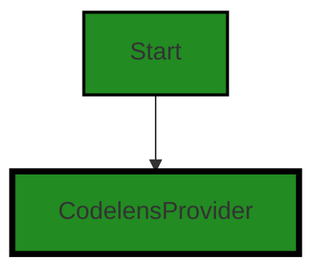
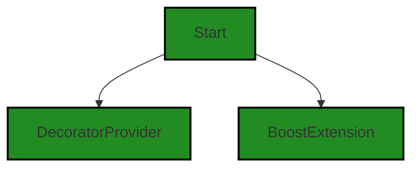

# Polyverse Boost-generated Source Analysis Details

## Source: ./src/inline/inline.ts
Date Generated: Saturday, September 9, 2023 at 5:34:43 AM PDT


---

### Boost Architectural Quick Summary Security Report

Last Updated: Saturday, September 9, 2023 at 5:33:58 AM PDT


Executive Report:

1. **Architectural Impact**: The analysis of this file has not revealed any severe issues.
2. **Risk Analysis**: The analysis of this file has not revealed any severe issues.
3. **Potential Customer Impact**: Based on the analysis, there are no severe issues that could potentially impact customers.
4. **Performance Issues**: Our analysis did not identify any explicit performance issues in the file.
5. **Risk Assessment**: Based on the current analysis of this file, no severe issues have been found. However, this doesn't guarantee that the file is risk-free.

Highlights:

- No severe issues were identified in the current analysis of this file.


---

### Boost Architectural Quick Summary Performance Report

Last Updated: Saturday, September 9, 2023 at 5:34:23 AM PDT


Executive Report:

1. **Architectural Impact**: The analysis of this file has not revealed any severe issues.
2. **Risk Analysis**: The analysis of this file has not revealed any severe issues.
3. **Potential Customer Impact**: Based on the analysis, there are no severe issues that could potentially impact customers.
4. **Performance Issues**: Our analysis did not identify any explicit performance issues in the file.
5. **Risk Assessment**: Based on the current analysis of this file, no severe issues have been found. However, this doesn't guarantee that the file is risk-free.

Highlights:

- No severe issues were identified in the current analysis of this file.


---

### Boost Architectural Quick Summary Compliance Report

Last Updated: Saturday, September 9, 2023 at 5:34:47 AM PDT


Executive Report:

1. **Architectural Impact**: The analysis of this file has not revealed any severe issues.
2. **Risk Analysis**: The analysis of this file has not revealed any severe issues.
3. **Potential Customer Impact**: Based on the analysis, there are no severe issues that could potentially impact customers.
4. **Performance Issues**: Our analysis did not identify any explicit performance issues in the file.
5. **Risk Assessment**: Based on the current analysis of this file, no severe issues have been found. However, this doesn't guarantee that the file is risk-free.

Highlights:

- No severe issues were identified in the current analysis of this file.

---
## Detailed Analysis:

### Cell 0:
## Original Code:

### Programming Language: typescript
### ./src/inline/inline.ts 

```typescript
import * as vscode from 'vscode';
import { CodelensProvider } from './codelens_provider';

```
## Boost Analysis:


---

### Boost Code Explanation

Last Updated: Saturday, September 9, 2023 at 5:31:25 AM PDT

The provided code snippet is very short, but it's a part of a larger project that is a Visual Studio Code extension. This file appears to be written in TypeScript, a statically typed superset of JavaScript that adds types and other features to the language. 

The code is importing two modules:

1. `vscode`: This is the API for interacting with Visual Studio Code. It allows extensions to interact with the editor, providing functionality like showing messages, opening files, creating webviews, and more. The `*` in the import statement means that all exported members of the module are imported and can be accessed via the `vscode` object.

2. `CodelensProvider`: This is a custom class defined in another file in the same project, `codelens_provider`. CodeLens is a feature of Visual Studio Code that adds inline commands and information directly in the source code. A CodeLens provider is an object that provides the information and commands to display. This class is likely defined to provide custom CodeLens functionality for this extension.

The code doesn't contain any algorithms, but it sets up the necessary modules for further development. 

The architectural guidelines mentioned seem to be general good practices, and this code doesn't conflict with them. However, without more context, it's impossible to say whether this code is consistent with the guidelines. For example, if the `CodelensProvider` class is well-designed and properly encapsulates its functionality, then it would be consistent with good object-oriented design principles. 

For more information, you can refer to:

- [VSCode API](https://code.visualstudio.com/api/references/vscode-api)
- [VSCode CodeLens](https://code.visualstudio.com/api/language-extensions/programmatic-language-features#codelens-show-commands-and-information-inline) 
- [TypeScript Modules](https://www.typescriptlang.org/docs/handbook/modules.html)


---

### Boost Flow Diagram

Last Updated: Saturday, September 9, 2023 at 5:33:09 AM PDT




---

### Boost Source-Level Security Analysis

Last Updated: Saturday, September 9, 2023 at 5:33:43 AM PDT

**No bugs found**


---

### Boost Source-Level Performance Analysis

Last Updated: Saturday, September 9, 2023 at 5:34:07 AM PDT

**No bugs found**


---

### Boost Source-Level Data and Privacy Compliance Analysis

Last Updated: Saturday, September 9, 2023 at 5:34:31 AM PDT

**No bugs found**


### Cell 1:
## Original Code:

### Programming Language: typescript
### ./src/inline/inline.ts line 3

```typescript
import { DecoratorProvider } from './decorator_provider';

```
## Boost Analysis:


---

### Boost Code Explanation

Last Updated: Saturday, September 9, 2023 at 5:31:54 AM PDT

The code you have provided is a single line of JavaScript (or TypeScript) that imports a module named `DecoratorProvider` from a local file named `decorator_provider`.

Here's a breakdown of what the code does:

- `import`: This is a keyword in JavaScript and TypeScript that is used to import functions, objects, or values from other modules or files. This is part of the ES6 (ECMAScript 2015) module system, which is a standard for structuring and loading JavaScript programs.

- `{ DecoratorProvider }`: This is the name of the module or object being imported. The curly braces `{}` are used for destructuring assignment, which is a JavaScript expression that allows us to unpack values from arrays or properties from objects into distinct variables.

- `from './decorator_provider'`: This specifies the path to the module or file that contains the `DecoratorProvider` module. The `./` at the beginning of the path indicates that the file is in the same directory as the current file.

The `DecoratorProvider` is likely a class or a function that is being imported for use in the current file. Without more context, it's hard to say exactly what it does, but the name suggests that it may be related to the Decorator design pattern, which is a design pattern that allows behavior to be added to an object dynamically.

Here are some resources for further reading:

- [JavaScript Modules](https://developer.mozilla.org/en-US/docs/Web/JavaScript/Guide/Modules)
- [Destructuring assignment](https://developer.mozilla.org/en-US/docs/Web/JavaScript/Reference/Operators/Destructuring_assignment)
- [Decorator design pattern](https://en.wikipedia.org/wiki/Decorator_pattern)

In terms of architectural guidelines, this import statement follows standard JavaScript/TypeScript practices for importing modules. It's a common practice to organize code into modules and import them where needed, which can help to keep code organized and reduce redundancy.


---

### Boost Flow Diagram

Last Updated: Saturday, September 9, 2023 at 5:33:14 AM PDT

```mermaid
graph TD;
style DecoratorProvider fill:#228B22, stroke:#000000, stroke-width:2px;

DecoratorProvider-->NO CONTROL FLOW FOUND;
```


---

### Boost Source-Level Security Analysis

Last Updated: Saturday, September 9, 2023 at 5:33:47 AM PDT

**No bugs found**


---

### Boost Source-Level Performance Analysis

Last Updated: Saturday, September 9, 2023 at 5:34:11 AM PDT

**No bugs found**


---

### Boost Source-Level Data and Privacy Compliance Analysis

Last Updated: Saturday, September 9, 2023 at 5:34:35 AM PDT

**No bugs found**


### Cell 2:
## Original Code:

### Programming Language: typescript
### ./src/inline/inline.ts line 4

```typescript
import { BoostExtension } from '../extension/BoostExtension';

```
## Boost Analysis:


---

### Boost Code Explanation

Last Updated: Saturday, September 9, 2023 at 5:32:20 AM PDT

This line of code is a single import statement in JavaScript (or TypeScript, which is a superset of JavaScript with static types). It's importing a module named `BoostExtension` from a relative path `../extension/BoostExtension`.

Here's a breakdown of what this line of code does:

- `import`: This is a keyword in JavaScript that is used to import functions, objects or values from another module or file.

- `{ BoostExtension }`: This is using destructuring to import a specific export from the module. In this case, it's importing `BoostExtension`. The curly braces are used when you want to import a specific export from a module, rather than the default export.

- `from '../extension/BoostExtension'`: This is the relative path to the module that's being imported. The `..` means to go up one directory level, and `/extension/BoostExtension` is the path from there to the module. The `.js` or `.ts` extension is typically omitted in import statements.

This code doesn't really involve any algorithms. It's just a way of organizing code into separate modules, which can make the code more manageable and easier to understand.

As for the architectural guidelines, this line of code seems to be in line with the principles of object-oriented design and modular programming. It's importing a module, which could be a class or some other kind of object, and this module could be used elsewhere in the code to provide some functionality.

For more information about `import` and modules in JavaScript, you can refer to the [MDN Web Docs](https://developer.mozilla.org/en-US/docs/Web/JavaScript/Reference/Statements/import).


---

### Boost Flow Diagram

Last Updated: Saturday, September 9, 2023 at 5:33:18 AM PDT

```mermaid
graph TD;
style BoostExtension fill:#228B22, stroke:#000000, stroke-width:2px;

BoostExtension-->NO CONTROL FLOW FOUND;
```


---

### Boost Source-Level Security Analysis

Last Updated: Saturday, September 9, 2023 at 5:33:50 AM PDT

**No bugs found**


---

### Boost Source-Level Performance Analysis

Last Updated: Saturday, September 9, 2023 at 5:34:15 AM PDT

**No bugs found**


---

### Boost Source-Level Data and Privacy Compliance Analysis

Last Updated: Saturday, September 9, 2023 at 5:34:39 AM PDT

**No bugs found**


### Cell 3:
## Original Code:

### Programming Language: typescript
### ./src/inline/inline.ts line 5

```typescript

export class InlineBoostAnnotations {
    //public codeLensProvider: CodelensProvider;
    public decoratorProvider: DecoratorProvider;
    public context: vscode.ExtensionContext;
    public extension: BoostExtension;

    constructor(context: vscode.ExtensionContext, extension: BoostExtension) {
        /*
         unused for now

        this.codeLensProvider = new CodelensProvider();
        vscode.languages.registerCodeLensProvider("*", this.codeLensProvider);
        vscode.commands.registerCommand("polyverse-boost-notebook.codelensAction", (args: any) => {
            vscode.window.showInformationMessage(`CodeLens action clicked with args=${args}`);
        });
        */

        this.decoratorProvider = new DecoratorProvider(context, extension);
        this.context = context;
        this.extension = extension;
    }
}

```
## Boost Analysis:


---

### Boost Code Explanation

Last Updated: Saturday, September 9, 2023 at 5:32:52 AM PDT

This code is written in TypeScript, a statically typed superset of JavaScript that adds optional types to the language. It defines a class named `InlineBoostAnnotations` which is exported for use in other modules. 

The `InlineBoostAnnotations` class has three properties: 

- `decoratorProvider` of type `DecoratorProvider`
- `context` of type `vscode.ExtensionContext`
- `extension` of type `BoostExtension`

These properties are public, meaning they can be accessed and modified from outside the class.

The constructor of the class `InlineBoostAnnotations` takes two parameters, `context` and `extension`. These parameters are instances of `vscode.ExtensionContext` and `BoostExtension` respectively. `vscode.ExtensionContext` is a data collection that is provided to the extension by Visual Studio Code at activation time, and `BoostExtension` is likely a custom class defined elsewhere in the application.

Within the constructor, there is a commented-out block of code that seems to be related to the creation and registration of a `CodeLensProvider`. CodeLens is a feature provided by Visual Studio Code that adds inline commands and information directly within your source code. This block of code is not currently in use, as indicated by the comment "unused for now".

The `decoratorProvider` property is initialized with a new instance of `DecoratorProvider`, which is passed the `context` and `extension` parameters. Then, the `context` and `extension` properties of the `InlineBoostAnnotations` class are set to the corresponding parameters passed to the constructor.

The `DecoratorProvider` class is not defined in this snippet, but it is likely responsible for providing decorators, which are a design pattern used to add new behavior to objects dynamically. In the context of VS Code extensions, decorators are typically used to change the appearance of text in the editor.

For more information, you can refer to the following links:

- [TypeScript Documentation](https://www.typescriptlang.org/docs/)
- [VS Code Extension API](https://code.visualstudio.com/api/references/vscode-api)
- [Decorator Pattern](https://en.wikipedia.org/wiki/Decorator_pattern)


---

### Boost Flow Diagram

Last Updated: Saturday, September 9, 2023 at 5:33:27 AM PDT



The control flow graph for the provided source code is as follows:

- The start of the graph is the `InlineBoostAnnotations` class constructor.
- The constructor initializes the `context` and `extension` properties.
- The constructor also creates an instance of the `DecoratorProvider` class and assigns it to the `decoratorProvider` property.
- The control flow ends after the assignment of the `decoratorProvider` property.

Note: There is no control flow to external libraries or non-standard functions in this code.


---

### Boost Source-Level Security Analysis

Last Updated: Saturday, September 9, 2023 at 5:33:54 AM PDT

**No bugs found**


---

### Boost Source-Level Performance Analysis

Last Updated: Saturday, September 9, 2023 at 5:34:19 AM PDT

**No bugs found**


---

### Boost Source-Level Data and Privacy Compliance Analysis

Last Updated: Saturday, September 9, 2023 at 5:34:43 AM PDT

**No bugs found**

