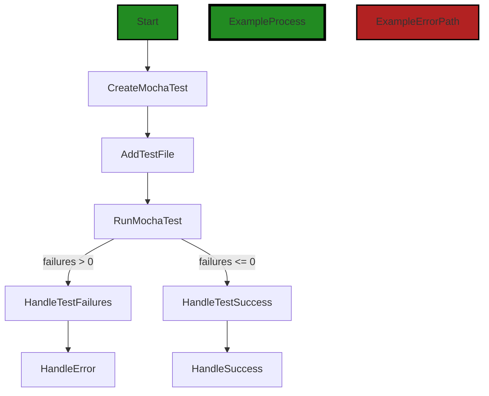

# Polyverse Boost-generated Source Analysis Details

## Source: ./src/test/commandRunner.ts
Date Generated: Friday, September 8, 2023 at 6:44:28 PM PDT


---

### Boost Architectural Quick Summary Security Report

Last Updated: Friday, September 8, 2023 at 6:43:48 PM PDT


Executive Report:

1. **Architectural Impact**: The analysis of this file has not revealed any severe issues.
2. **Risk Analysis**: The analysis of this file has not revealed any severe issues.
3. **Potential Customer Impact**: Based on the analysis, there are no severe issues that could potentially impact customers.
4. **Performance Issues**: Our analysis did not identify any explicit performance issues in the file.
5. **Risk Assessment**: Based on the current analysis of this file, no severe issues have been found. However, this doesn't guarantee that the file is risk-free.

Highlights:

- No severe issues were identified in the current analysis of this file.


---

### Boost Architectural Quick Summary Performance Report

Last Updated: Friday, September 8, 2023 at 6:44:20 PM PDT


Executive Report:

1. **Architectural Impact**: The analysis of this file has not revealed any severe issues.
2. **Risk Analysis**: The analysis of this file has not revealed any severe issues.
3. **Potential Customer Impact**: Based on the analysis, there are no severe issues that could potentially impact customers.
4. **Performance Issues**: Our analysis did not identify any explicit performance issues in the file.
5. **Risk Assessment**: Based on the current analysis of this file, no severe issues have been found. However, this doesn't guarantee that the file is risk-free.

Highlights:

- No severe issues were identified in the current analysis of this file.


---

### Boost Architectural Quick Summary Compliance Report

Last Updated: Friday, September 8, 2023 at 6:44:31 PM PDT


Executive Report:

1. **Architectural Impact**: The analysis of this file has not revealed any severe issues.
2. **Risk Analysis**: The analysis of this file has not revealed any severe issues.
3. **Potential Customer Impact**: Based on the analysis, there are no severe issues that could potentially impact customers.
4. **Performance Issues**: Our analysis did not identify any explicit performance issues in the file.
5. **Risk Assessment**: Based on the current analysis of this file, no severe issues have been found. However, this doesn't guarantee that the file is risk-free.

Highlights:

- No severe issues were identified in the current analysis of this file.

---
## Detailed Analysis:

### Cell 0:
## Original Code:

### Programming Language: typescript
### ./src/test/commandRunner.ts 

```typescript
import * as vscode from "vscode";
import * as fs from "fs";
import * as path from "path";
import Mocha = require('mocha'); // Corrected import of Mocha

export function run(): Promise<void> {
  // Create the mocha test
  const mocha = new Mocha({
    ui: 'bdd',
    color: true,
  });

  const testsRoot = path.resolve(__dirname, '.');

  return new Promise((c, e) => {
    mocha.addFile(path.resolve(testsRoot, 'yourActualCommand.js'));

    try {
      // Run the mocha test
      mocha.run((failures: number) => {
        if (failures > 0) {
          e(new Error(`${failures} tests failed.`));
        } else {
          c();
        }
      });
    } catch (err) {
      console.error(err);
      e(err);
    }
  });
}

```
## Boost Analysis:


---

### Boost Code Explanation

Last Updated: Friday, September 8, 2023 at 6:43:10 PM PDT

This code is written in TypeScript and is used to run a set of tests using the Mocha testing framework. Here's a detailed explanation:

1. The code begins by importing necessary modules. 'vscode' module is used for integrating with Visual Studio Code's API, 'fs' is used for file system operations, and 'path' is used for handling file and directory paths. 'Mocha' is a JavaScript test framework running on Node.js, making asynchronous testing simple and fun.

2. A function named 'run' is exported. This function returns a Promise that resolves when the tests are complete. If any tests fail, the Promise is rejected with an error indicating the number of failed tests.

3. Inside the 'run' function, a new Mocha instance is created with some options. The 'ui' option is set to 'bdd' (behavior-driven development), and 'color' is set to true, which means the output will be colorized.

4. The 'testsRoot' variable is set to the current directory. This is where the test files are expected to be located.

5. A Promise is returned, which is resolved or rejected based on the results of the tests. The 'addFile' method is used to add a test file to the Mocha instance.

6. The 'run' method of the Mocha instance is called to run the tests. The number of failed tests is passed to the callback function. If there are any failures, the Promise is rejected with an error. Otherwise, it is resolved.

7. If there is an error while running the tests (for example, if a test file cannot be found), the error is logged to the console and the Promise is rejected with the error.

This code does not appear to have any conflicts with the architectural guidelines provided.

Here are some links for further reading:

- [Mocha - the fun, simple, flexible JavaScript test framework](https://mochajs.org/)
- [Promise - JavaScript | MDN](https://developer.mozilla.org/en-US/docs/Web/JavaScript/Reference/Global_Objects/Promise)
- [Behavior-Driven Development (BDD)](https://en.wikipedia.org/wiki/Behavior-driven_development)
- [Node.js path module](https://nodejs.org/api/path.html)
- [Node.js fs module](https://nodejs.org/api/fs.html)
- [Visual Studio Code API](https://code.visualstudio.com/api)


---

### Boost Flow Diagram

Last Updated: Friday, September 8, 2023 at 6:43:30 PM PDT


The control flow starts at the `run` function. It then creates a new instance of the Mocha test runner (`CreateMochaTest`). The test file is added to the Mocha instance (`AddTestFile`). The Mocha test is then run (`RunMochaTest`). If there are failures in the test (`failures > 0`), the control flow goes to the `HandleTestFailures` block, where an error is thrown. If there are no failures (`failures <= 0`), the control flow goes to the `HandleTestSuccess` block, where the promise is resolved.


---

### Boost Source-Level Security Analysis

Last Updated: Friday, September 8, 2023 at 6:43:44 PM PDT

**No bugs found**


---

### Boost Source-Level Performance Analysis

Last Updated: Friday, September 8, 2023 at 6:44:16 PM PDT

1. **Severity**: 3/10

   **Line Number**: 10

   **Bug Type**: Disk

   **Description**: The use of path.resolve can be slow if the path is deeply nested or if there are many symbolic links.

   **Solution**: If the path is known and does not contain symbolic links, consider replacing path.resolve with a direct reference to the path.


2. **Severity**: 2/10

   **Line Number**: 12

   **Bug Type**: Disk

   **Description**: The use of mocha.addFile can be slow if the file is large.

   **Solution**: If the file is large, consider splitting it into smaller test files.


3. **Severity**: 5/10

   **Line Number**: 16

   **Bug Type**: CPU

   **Description**: Running mocha tests can be CPU-intensive, especially if there are many tests or if the tests are complex.

   **Solution**: Consider running tests in parallel or optimizing the tests to reduce CPU usage.


4. **Severity**: 1/10

   **Line Number**: 20

   **Bug Type**: Memory

   **Description**: The use of console.error can increase memory usage if the error object is large.

   **Solution**: If the error object is large, consider logging only the necessary information.


---

### Boost Source-Level Data and Privacy Compliance Analysis

Last Updated: Friday, September 8, 2023 at 6:44:28 PM PDT

**No bugs found**

