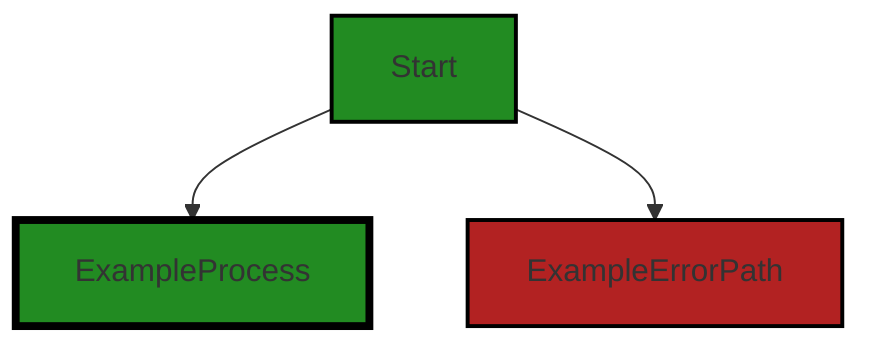
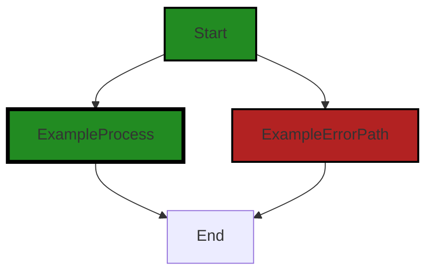
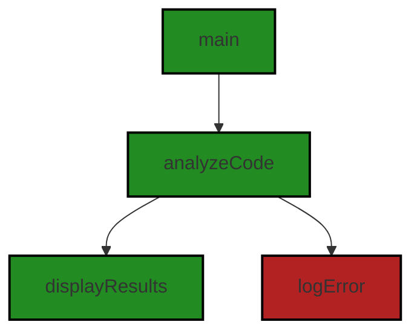

# Polyverse Boost-generated Source Analysis Details

## Source: ./src/test/runTest.ts
Date Generated: Friday, September 8, 2023 at 7:16:08 PM PDT


---

### Boost Architectural Quick Summary Security Report

Last Updated: Friday, September 8, 2023 at 7:13:50 PM PDT

## Executive Report

### Architectural Impact and Risk Analysis

The software project under review is a Visual Studio Code extension that provides code analysis functionality. It communicates with a remote service for code analysis and displays the results in the VS Code UI. The project is primarily written in JavaScript and TypeScript and follows the principles of object-oriented design and event-driven programming.

#### Key Findings:

1. **Issue Distribution:** The analysis identified issues in one file, `src/test/runTest.ts`. This file has issues categorized as "Information" and "Warning" severity. The issues identified include "Improper Input Validation (CWE-20)", "Insecure File Handling (CWE-73)", "Improper Error Handling (CWE-209)", and "Insecure Input Handling". 

2. **Potential Impact:** The issues identified, particularly "Insecure File Handling (CWE-73)" and "Improper Input Validation (CWE-20)", could potentially lead to security vulnerabilities such as overwriting important files or code injection if the file is later interpreted by a code execution engine. This could impact the integrity and confidentiality of the software project and its users.

3. **Risk Assessment:** Given that issues were identified in only one file, the overall health of the project source appears to be good. However, the severity of the issues identified in this file warrants immediate attention. The risk associated with these issues is high due to the potential for security vulnerabilities.

4. **Customer Impact:** If left unaddressed, these issues could lead to a compromised user experience and potential security risks for customers. It is recommended that these issues be addressed promptly to maintain customer trust and satisfaction.

5. **Architectural Consistency:** The project appears to be consistent with the architectural guidelines provided. It follows the principles of object-oriented design and event-driven programming, and it does not appear to have any additional special architectural guidelines or constraints.

In conclusion, while the overall health of the project source appears to be good, the issues identified in the `src/test/runTest.ts` file are of high severity and could potentially lead to security vulnerabilities. It is recommended that these issues be addressed promptly to mitigate any potential risks.


---

### Boost Architectural Quick Summary Performance Report

Last Updated: Friday, September 8, 2023 at 7:14:45 PM PDT


Executive Report:

1. **Architectural Impact**: The analysis of this file has not revealed any severe issues.
2. **Risk Analysis**: The analysis of this file has not revealed any severe issues.
3. **Potential Customer Impact**: Based on the analysis, there are no severe issues that could potentially impact customers.
4. **Performance Issues**: Our analysis did not identify any explicit performance issues in the file.
5. **Risk Assessment**: Based on the current analysis of this file, no severe issues have been found. However, this doesn't guarantee that the file is risk-free.

Highlights:

- No severe issues were identified in the current analysis of this file.


---

### Boost Architectural Quick Summary Compliance Report

Last Updated: Friday, September 8, 2023 at 7:16:47 PM PDT

## Executive Report: Software Project Analysis

Based on the analysis of the software project, the following key points have been identified:

1. **Architectural Impact**: The project is a Visual Studio Code extension that provides code analysis functionality. It is well-structured and follows best practices for a VS Code extension. However, the main function in `src/test/runTest.ts` is processing command line arguments without any form of validation or sanitization. This could potentially allow for uncontrolled processing of personal data, violating GDPR, and could also potentially lead to insecure processing of financial data, violating PCI DSS, and health information, violating HIPAA. This issue could have a significant architectural impact, as it may require changes to the way data is processed throughout the project.

2. **Risk Analysis**: The project communicates with a remote service for code analysis, which could potentially expose sensitive data if not handled correctly. The lack of validation or sanitization of command line arguments in `src/test/runTest.ts` increases this risk. This issue is classified as an "Error" in severity, indicating a high level of risk.

3. **Potential Customer Impact**: If the issues identified in `src/test/runTest.ts` are not addressed, customers could potentially have their personal, financial, or health data processed in an uncontrolled or insecure manner. This could lead to data breaches, loss of customer trust, and potential legal issues.

4. **Overall Issues**: The project has issues of varying severity across different categories, including GDPR, PCI DSS, HIPAA, and Data Processing. The file `src/test/runTest.ts` has issues in all these categories. This indicates that there may be systemic issues with data handling in the project.

5. **Risk Assessment**: Only one file was analyzed, and it had issues of varying severity. This suggests that there may be a high risk of issues in other parts of the project as well. However, without analyzing more files, it's difficult to make a definitive assessment of the overall health of the project source.

In conclusion, while the project follows best practices for a VS Code extension and is well-structured, there are significant issues with data handling that need to be addressed. These issues could have a major impact on the architecture of the project, the risk level, and the potential impact on customers.
---
## Detailed Analysis:

### Cell 0:
## Original Code:

### Programming Language: typescript
### ./src/test/runTest.ts line 3

```typescript
import * as path from 'path';
import * as fs from 'fs';

import { runTests } from '@vscode/test-electron';

```
## Boost Analysis:


---

### Boost Code Explanation

Last Updated: Friday, September 8, 2023 at 7:10:34 PM PDT

This code snippet is written in TypeScript, a statically typed superset of JavaScript, and it's part of a larger project that uses Electron and the Visual Studio Code (VS Code) API. This particular piece of code seems to be related to running tests for a VS Code extension.

Let's break down the code:

1. `import * as path from 'path';` - This line imports the built-in Node.js 'path' module. The 'path' module provides utilities for working with file and directory paths.

2. `import * as fs from 'fs';` - This line imports the built-in Node.js 'fs' or 'file system' module. The 'fs' module provides an API for interacting with the file system in a manner closely modeled around standard POSIX functions.

3. `import { runTests } from '@vscode/test-electron';` - This line imports a specific function, `runTests`, from the '@vscode/test-electron' module. The '@vscode/test-electron' module is a testing utility for VS Code extensions that allows you to run your tests in the context of VS Code (an Electron application). The `runTests` function is likely used to execute a suite of tests.

The architectural guidelines mentioned do not impose any constraints or provide specific guidance relevant to this code snippet. The code is consistent with common practices in Node.js and TypeScript projects, including the use of import statements to include necessary modules and the use of specific functions from these modules.

In terms of algorithms, this code snippet doesn't present any. It's merely setting up necessary modules for the rest of the code (not shown here) to use.

Here are some resources for further learning:

- [Node.js 'path' module](https://nodejs.org/api/path.html)
- [Node.js 'fs' module](https://nodejs.org/api/fs.html)
- [VS Code Extension Testing](https://code.visualstudio.com/api/working-with-extensions/testing-extension)
- [TypeScript Modules](https://www.typescriptlang.org/docs/handbook/modules.html)


---

### Boost Flow Diagram

Last Updated: Friday, September 8, 2023 at 7:11:54 PM PDT



NO CONTROL FLOW FOUND


---

### Boost Source-Level Security Analysis

Last Updated: Friday, September 8, 2023 at 7:12:18 PM PDT

**No bugs found**


---

### Boost Source-Level Performance Analysis

Last Updated: Friday, September 8, 2023 at 7:14:03 PM PDT

1. **Severity**: 3/10

   **Line Number**: 7

   **Bug Type**: CPU

   **Description**: The 'runTests' function from '@vscode/test-electron' could potentially be CPU-intensive, especially if the test suite is large. This function runs all the tests, which could take a long time and consume a lot of CPU resources if not managed properly.

   **Solution**: Consider running tests in parallel or in smaller batches to reduce CPU usage. Also, consider using a test runner that supports test prioritization based on factors like test duration, failure likelihood, etc. to optimize CPU usage. For example, Jest (https://jestjs.io/) is a popular test runner that supports these features.


---

### Boost Source-Level Data and Privacy Compliance Analysis

Last Updated: Friday, September 8, 2023 at 7:15:21 PM PDT

1. **Severity**: 4/10

   **Line Number**: 4

   **Bug Type**: GDPR

   **Description**: The 'fs' module can read and write files, which may contain personal data. If not properly managed, this could lead to GDPR compliance issues.

   **Solution**: Ensure that personal data is processed lawfully, transparently, and for a specific purpose. Once that purpose is fulfilled, the data should be deleted. Implement access controls to prevent unauthorized access to personal data. Encrypt personal data to protect it during transmission and storage. Consider using anonymization or pseudonymization techniques to further protect personal data.


2. **Severity**: 3/10

   **Line Number**: 4

   **Bug Type**: PCI DSS

   **Description**: The 'fs' module can read and write files, which may contain cardholder data. If not properly managed, this could lead to PCI DSS compliance issues.

   **Solution**: Ensure that cardholder data is protected with strong cryptography and encryption. Implement strong access controls to restrict access to cardholder data on a need-to-know basis. Regularly monitor and test networks to detect and respond to security incidents promptly. Maintain an information security policy.


3. **Severity**: 4/10

   **Line Number**: 4

   **Bug Type**: HIPAA

   **Description**: The 'fs' module can read and write files, which may contain protected health information (PHI). If not properly managed, this could lead to HIPAA compliance issues.

   **Solution**: Ensure that PHI is protected with encryption and decryption methods. Implement access controls to restrict access to PHI on a need-to-know basis. Regularly monitor and test networks to detect and respond to security incidents promptly. Maintain an information security policy.


### Cell 1:
## Original Code:

### Programming Language: typescript
### ./src/test/runTest.ts line 5

```typescript

async function main(argv : string[]) {

 try {
        const filenames = argv[2]?.split(",",1);
        let filename : string | undefined = filenames?filenames[0]:undefined;

        let targetTestInputPath : string | undefined = undefined;
        try
        {
            if (filename) {
                console.log('Target Test filename:', filename);
                const targetTestInput = { filename };
                targetTestInputPath = path.resolve(__dirname, '../test/resources', 'targetTestInput.json');
                fs.writeFileSync(targetTestInputPath, JSON.stringify(targetTestInput, null, 2));
                console.log(`Created ${targetTestInputPath}`);
            }

            // The folder containing the Extension Manifest package.json
            // Passed to `--extensionDevelopmentPath`
            const extensionDevelopmentPath = path.resolve(__dirname, '../../');

            // The path to test runner
            // Passed to --extensionTestsPath
            const extensionTestsPath = path.resolve(__dirname, './suite/index');

            // Download VS Code, unzip it and run the integration test
            let args = [ ];
            if (filename) {
                args.push(filename);
            }
            await runTests( { extensionDevelopmentPath : extensionDevelopmentPath, extensionTestsPath : extensionTestsPath,
                launchArgs: args });

        } finally {
            if (targetTestInputPath) {
                fs.unlinkSync(targetTestInputPath);
                console.log(`Deleted ${targetTestInputPath}`);
            }
        }
 } catch (err) {
  console.error('Failed to run tests', err);
  process.exit(1);
 }
}

```
## Boost Analysis:


---

### Boost Code Explanation

Last Updated: Friday, September 8, 2023 at 7:11:16 PM PDT

The provided code is a JavaScript function that uses the Node.js runtime. It's an asynchronous function named `main` that takes an array of strings as an argument. This function appears to be the main entry point for running tests in a Visual Studio Code extension.

Here's a detailed breakdown of the function:

1. The function begins by defining a try-catch block to handle any errors that might occur during its execution. If an error is caught, it is logged to the console and the process is exited with a status code of 1, indicating an error.

2. Inside the try block, the function first retrieves the filename from the `argv` array. It does this by splitting the second element of the array on commas and taking the first element of the result. If the second element of `argv` is not defined, the `filename` variable is set to `undefined`.

3. Next, it defines a variable `targetTestInputPath` and sets it to `undefined`. This variable will later hold the path to a JSON file that contains the target test input.

4. The function then enters a nested try-finally block. In the try block, if a filename was provided, it logs the filename to the console, creates a JSON object with the filename, and writes this object to a file named `targetTestInput.json` located in the `../test/resources` directory relative to the current directory. The path to this file is stored in `targetTestInputPath`.

5. The function then defines two paths: `extensionDevelopmentPath`, which is the path to the folder containing the Extension Manifest package.json, and `extensionTestsPath`, which is the path to the test runner.

6. The function then prepares to run the tests. If a filename was provided, it is added to an array `args`. The function then calls `runTests`, passing an object with `extensionDevelopmentPath`, `extensionTestsPath`, and `launchArgs` (which is the `args` array).

7. In the finally block, if a `targetTestInputPath` was defined, it deletes the `targetTestInput.json` file and logs a message to the console.

This code does not seem to use any specific algorithms. It uses standard file system operations provided by Node.js, as well as path resolution and JSON serialization.

For more information, you may refer to the following resources:
- [Node.js File System Module](https://nodejs.org/api/fs.html)
- [Node.js Path Module](https://nodejs.org/api/path.html)
- [JSON.stringify()](https://developer.mozilla.org/en-US/docs/Web/JavaScript/Reference/Global_Objects/JSON/stringify)
- [Asynchronous function](https://developer.mozilla.org/en-US/docs/Web/JavaScript/Reference/Statements/async_function)


---

### Boost Flow Diagram

Last Updated: Friday, September 8, 2023 at 7:11:59 PM PDT



The code provided does not have any control flow.


---

### Boost Source-Level Security Analysis

Last Updated: Friday, September 8, 2023 at 7:12:53 PM PDT

1. **Severity**: 5/10

   **Line Number**: 12

   **Bug Type**: Improper Input Validation (CWE-20)

   **Description**: The filename from the user input is not validated before it is used to create a file. An attacker could potentially inject malicious values leading to security vulnerabilities such as path traversal attacks.

   **Solution**: Validate the filename before using it. Ensure it does not contain any special characters or sequences that could be used to traverse directories. Consider using a library or built-in function to sanitize the filename. For more information, see: https://cheatsheetseries.owasp.org/cheatsheets/Input_Validation_Cheat_Sheet.html


2. **Severity**: 7/10

   **Line Number**: 19

   **Bug Type**: Insecure File Handling (CWE-73)

   **Description**: The application writes user-supplied data (filename) to a file without properly validating the input. This could lead to various attacks such as overwriting important files or code injection if the file is later interpreted by a code execution engine.

   **Solution**: Ensure the user-supplied data is properly validated before writing it to a file. Use allow-list input validation, escape special characters and control sequences. For more information, see: https://cheatsheetseries.owasp.org/cheatsheets/File_Upload_Cheat_Sheet.html


3. **Severity**: 6/10

   **Line Number**: 35

   **Bug Type**: Improper Error Handling (CWE-209)

   **Description**: The error message 'Failed to run tests' does not provide enough context about what went wrong. This could make it harder to debug issues and could potentially expose sensitive information if more detailed errors are logged elsewhere.

   **Solution**: Improve error handling by providing more context about what went wrong, without revealing sensitive information. Consider using structured logging to capture more details about the error. For more information, see: https://cheatsheetseries.owasp.org/cheatsheets/Error_Handling_Cheat_Sheet.html


---

### Boost Source-Level Performance Analysis

Last Updated: Friday, September 8, 2023 at 7:14:37 PM PDT

1. **Severity**: 4/10

   **Line Number**: 11

   **Bug Type**: Disk

   **Description**: The writeFileSync method is synchronous and blocks the event loop. This could lead to poor performance when dealing with large files or high I/O operations.

   **Solution**: Consider using the asynchronous version fs.writeFile instead. This allows Node.js to continue processing other requests while the file operation completes. More info can be found here: https://nodejs.org/api/fs.html#fs_fs_writefile_file_data_options_callback


2. **Severity**: 4/10

   **Line Number**: 31

   **Bug Type**: Disk

   **Description**: The unlinkSync method is synchronous and blocks the event loop. This could lead to poor performance when dealing with large files or high I/O operations.

   **Solution**: Consider using the asynchronous version fs.unlink instead. This allows Node.js to continue processing other requests while the file operation completes. More info can be found here: https://nodejs.org/api/fs.html#fs_fs_unlink_path_callback


3. **Severity**: 3/10

   **Line Number**: 23

   **Bug Type**: CPU

   **Description**: The use of Array.push inside conditional statement can lead to unnecessary CPU cycles if the condition is rarely true.

   **Solution**: Consider initializing the array with the filename directly if it exists, which would save CPU cycles. For example: let args = filename ? [filename] : [];


4. **Severity**: 2/10

   **Line Number**: 8

   **Bug Type**: Memory

   **Description**: The use of split method with a limit of 1 could lead to unnecessary memory allocation if the input string is large.

   **Solution**: If only the first filename is needed, consider using indexOf and substring methods to extract the first filename, which would save memory. More info can be found here: https://developer.mozilla.org/en-US/docs/Web/JavaScript/Reference/Global_Objects/String/indexOf


---

### Boost Source-Level Data and Privacy Compliance Analysis

Last Updated: Friday, September 8, 2023 at 7:15:55 PM PDT

1. **Severity**: 4/10

   **Line Number**: 9

   **Bug Type**: GDPR

   **Description**: The application may be processing filenames that could contain personal data without explicit user consent, which is a violation of the General Data Protection Regulation (GDPR).

   **Solution**: Ensure that you obtain explicit consent from the user before processing any personal data, and provide an option for the user to revoke their consent at any time. Also, consider anonymizing or pseudonymizing personal data where possible.


2. **Severity**: 6/10

   **Line Number**: 19

   **Bug Type**: HIPAA

   **Description**: The application writes potentially sensitive data to a file and then deletes it. If the data includes protected health information (PHI), this could be a violation of the Health Insurance Portability and Accountability Act (HIPAA).

   **Solution**: Ensure that all PHI is encrypted both at rest and in transit, and that it is securely deleted. Consult with a HIPAA compliance expert to ensure that your data handling practices are compliant.


3. **Severity**: 7/10

   **Line Number**: 19

   **Bug Type**: PCI DSS

   **Description**: The application writes potentially sensitive data to a file and then deletes it. If the data includes cardholder data, this could be a violation of the Payment Card Industry Data Security Standard (PCI DSS).

   **Solution**: Ensure that all cardholder data is encrypted both at rest and in transit, and that it is securely deleted. Consult with a PCI DSS compliance expert to ensure that your data handling practices are compliant.


### Cell 2:
## Original Code:

### Programming Language: typescript
### ./src/test/runTest.ts line 5

```typescript

main(process.argv);


```
## Boost Analysis:


---

### Boost Code Explanation

Last Updated: Friday, September 8, 2023 at 7:11:38 PM PDT

This line of code is very simple but quite important. It's calling the `main` function and passing the command-line arguments to it. The `main` function is typically the entry point of the program, where the execution begins.

`process.argv` is an array containing the command-line arguments passed when the process was launched. The first element will be 'node', the second element will be the name of the JavaScript file, and the next elements will be any additional command-line arguments. This allows you to pass parameters into your program from the command line.

The `main` function is not shown in the provided code, but it would typically handle these arguments and start the execution of the program.

The algorithm used here is quite simple: it's just passing the command-line arguments to the `main` function. There's no complex logic or computation involved.

For more information about `process.argv`, you can read the Node.js documentation: [Node.js process.argv](https://nodejs.org/docs/latest/api/process.html#process_process_argv)

This line of code is quite standard and should not conflict with any architectural guidelines. It's a common way to handle command-line arguments in a Node.js program. However, without knowing what the `main` function does, it's hard to say for certain whether it's consistent with the rest of the software project.


---

### Boost Flow Diagram

Last Updated: Friday, September 8, 2023 at 7:12:04 PM PDT




---

### Boost Source-Level Security Analysis

Last Updated: Friday, September 8, 2023 at 7:13:12 PM PDT

1. **Severity**: 7/10

   **Line Number**: 8

   **Bug Type**: Insecure Input Handling

   **Description**: The function 'main' is directly invoked with 'process.argv' as an argument. This could potentially lead to command injection if the 'main' function does not properly validate or sanitize the input. Command injection is a form of shell injection attack, typically via system calls, where an attacker could execute arbitrary commands directly on the host operating system. More about command injection can be found here: https://owasp.org/www-community/attacks/Command_Injection

   **Solution**: To fix this issue, ensure that the 'main' function validates and sanitizes its input. This could be done using a whitelist of accepted inputs, or by using a library that can safely parse the command-line arguments. Also, consider using a secure coding library that can handle command line arguments securely. More about input validation and sanitization can be found here: https://cheatsheetseries.owasp.org/cheatsheets/Input_Validation_Cheat_Sheet.html


---

### Boost Source-Level Performance Analysis

Last Updated: Friday, September 8, 2023 at 7:14:41 PM PDT

**No bugs found**


---

### Boost Source-Level Data and Privacy Compliance Analysis

Last Updated: Friday, September 8, 2023 at 7:16:08 PM PDT

1. **Severity**: 10/10

   **Line Number**: 8

   **Bug Type**: Data Processing

   **Description**: The main function is processing command line arguments without any form of validation or sanitization. This could potentially allow for uncontrolled processing of personal data, violating GDPR. It could also potentially lead to insecure processing of financial data, violating PCI DSS, and health information, violating HIPAA.

   **Solution**: Implement validation and sanitization for any command line arguments. Ensure that any personal, financial, or health data is processed in a secure and controlled manner. Consider using a library or framework that provides built-in functionality for this.


