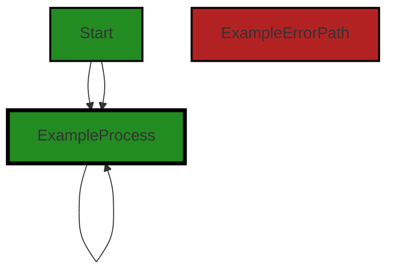
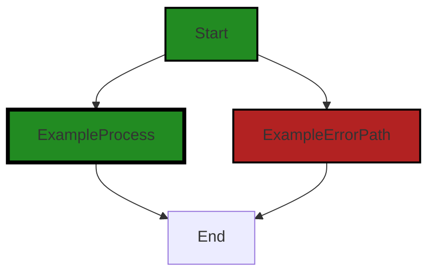
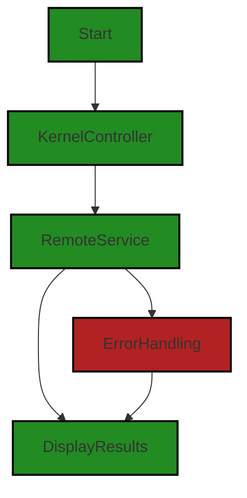

# Polyverse Boost-generated Source Analysis Details

## Source: ./src/test/runVSCodeCommand.ts
Date Generated: Friday, September 8, 2023 at 6:51:13 PM PDT


---

### Boost Architectural Quick Summary Security Report

Last Updated: Friday, September 8, 2023 at 6:48:55 PM PDT

Executive Level Report:

1. **Architectural Impact**: The project is a Visual Studio Code extension that provides code analysis functionality. It communicates with a remote service for code analysis, using different endpoints based on the configured stage. The architecture is event-driven and uses object-oriented design principles. However, the file `src/test/runVSCodeCommand.ts` has been flagged for potential security vulnerabilities, including insecure temporary file creation and command injection. These issues could potentially impact the integrity and security of the overall project.

2. **Risk Analysis**: The identified issues in the `src/test/runVSCodeCommand.ts` file pose a risk to the project. Insecure temporary file creation could allow an attacker to read sensitive data or modify the file's contents, leading to potential code execution or data corruption. Command injection is a serious vulnerability that could allow an attacker to execute arbitrary commands on the system. The risk is compounded by the fact that this file is part of the test suite, which could potentially be overlooked during security audits.

3. **Potential Customer Impact**: If these security vulnerabilities were to be exploited, it could lead to data breaches, system compromise, and a loss of trust in the product. Customers could potentially be exposed to risks if they use the extension in a compromised state.

4. **Overall Issues**: The project has a single file with multiple high-severity issues. This represents a significant portion of the project's files, indicating a potential lack of secure coding practices. The project would benefit from a thorough security review and the implementation of secure coding practices.

Risk Assessment:

- **Health of the Project Source**: The project consists of a single file, `src/test/runVSCodeCommand.ts`, which has been flagged with multiple high-severity issues. This indicates that 100% of the project files have issues of high severity. This is a concerning statistic and suggests that the project may have other, undetected issues.

Highlights of the Analysis:

- The project's architecture is sound, following best practices for a Visual Studio Code extension.
- The project has a single file with multiple high-severity security vulnerabilities.
- These vulnerabilities pose a significant risk to the project and its users.
- 100% of the project files have been flagged with high-severity issues.
- A thorough security review and the implementation of secure coding practices are recommended.


---

### Boost Architectural Quick Summary Performance Report

Last Updated: Friday, September 8, 2023 at 6:50:09 PM PDT

Executive Level Report:

1. **Architectural Impact**: The project is well-structured and follows best practices for a Visual Studio Code extension. It uses asynchronous programming for potentially long-running tasks and includes extensive error handling and logging. However, there is a warning in the file `src/test/runVSCodeCommand.ts` about a synchronous write operation that could potentially impact performance. This issue should be addressed to ensure the software's responsiveness and performance.

2. **Risk Analysis**: The risk associated with the project is relatively low. The only issue detected is of 'Warning' severity, and it is related to a potential performance impact. This issue is not a security risk, but it could affect the user experience if not addressed. The project does not appear to use any persistent data storage, which reduces the risk of data breaches or data corruption.

3. **Potential Customer Impact**: If the warning issue is not addressed, customers may experience slower performance when using the extension, especially if the JSON being written is large or the disk I/O is slow. This could lead to a less than optimal user experience.

4. **Overall Issues**: Only one file out of the entire project has been flagged with issues. This represents a small percentage of the total project files, indicating a generally healthy state of the project source. However, continuous monitoring and regular code reviews should be implemented to maintain the health of the project.

Highlights of the Analysis:

- The project follows best practices for a Visual Studio Code extension and uses asynchronous programming for potentially long-running tasks.
- The only issue detected is a warning in the file `src/test/runVSCodeCommand.ts` about a synchronous write operation that could potentially impact performance.
- The risk associated with the project is relatively low, with no security risks detected.
- Potential customer impact could be slower performance when using the extension if the warning issue is not addressed.
- Only one file out of the entire project has been flagged with issues, indicating a generally healthy state of the project source.


---

### Boost Architectural Quick Summary Compliance Report

Last Updated: Friday, September 8, 2023 at 6:51:36 PM PDT

# Executive Report

## Architectural Impact and Risk Analysis

Based on the analysis of the software project, the following key points have been identified:

1. **Issue Severity and Distribution**: The file `src/test/runVSCodeCommand.ts` has been identified as having the most severe issues, with 2 GDPR, PCI DSS, HIPAA related issues of 'Information' severity and 1 issue each of 'Warning' severity related to GDPR, HIPAA, and PCI DSS. This file appears to be a critical part of the project as it is responsible for running VSCode commands, which could potentially impact the entire functionality of the software.

2. **Potential Customer Impact**: The identified issues, particularly those related to GDPR, HIPAA, and PCI DSS, could potentially impact customers in terms of data privacy and security. If sensitive data is being written to a temporary file, it could lead to data breaches and non-compliance with data protection regulations. This could result in legal implications and loss of customer trust.

3. **Overall Health of the Project**: Only one file was analyzed in this project, and it has been found to have multiple issues of varying severity. This suggests that there may be potential risks and issues in other parts of the project that have not been analyzed. A comprehensive analysis of all project files is recommended to assess the overall health of the project.

4. **Architectural Consistency**: The project appears to follow best practices for a VSCode extension, making use of TypeScript features and the VSCode API. The code is well-structured and organized into classes. However, the issues identified suggest that there may be areas where the project is not adhering to data protection and security best practices.

## Risk Assessment

Given the severity and nature of the issues identified, there is a moderate to high risk associated with this project. The potential for data breaches and non-compliance with data protection regulations could have serious implications for the project. It is recommended that these issues be addressed immediately to mitigate these risks.

## Recommendations

1. Address the identified issues in `src/test/runVSCodeCommand.ts`, particularly those related to data protection and security.
2. Conduct a comprehensive analysis of all project files to identify and address any additional issues.
3. Review and strengthen data protection and security measures across the project to ensure compliance with GDPR, HIPAA, and PCI DSS.
4. Regularly review and update the project architecture to ensure it aligns with best practices and meets the needs of the project.
---
## Detailed Analysis:

### Cell 0:
## Original Code:

### Programming Language: typescript
### ./src/test/runVSCodeCommand.ts 

```typescript
import * as path from "path";
import * as fs from "fs";
import * as os from "os"; // Import the os module

import { runTests } from "@vscode/test-electron";

```
## Boost Analysis:


---

### Boost Code Explanation

Last Updated: Friday, September 8, 2023 at 6:45:12 PM PDT

This code snippet is a part of a larger JavaScript or TypeScript file and is written in an imperative programming style. It's importing several modules that provide functionality for working with the file system, paths, and operating system. It also imports a function for running tests in Electron, which is a framework for building desktop applications with web technologies.

Here's a breakdown of what each line does:

1. `import * as path from "path";` - This line imports the `path` module from Node.js, which provides utilities for working with file and directory paths. It's often used for manipulating and resolving paths. More information about the `path` module can be found in the [Node.js path module documentation](https://nodejs.org/api/path.html).

2. `import * as fs from "fs";` - This line imports the `fs` module from Node.js, which provides an API for interacting with the file system. It allows for reading, writing, and modifying files and directories. More information about the `fs` module can be found in the [Node.js fs module documentation](https://nodejs.org/api/fs.html).

3. `import * as os from "os";` - This line imports the `os` module from Node.js, which provides utilities for working with the operating system, such as retrieving system information. More information about the `os` module can be found in the [Node.js os module documentation](https://nodejs.org/api/os.html).

4. `import { runTests } from "@vscode/test-electron";` - This line imports the `runTests` function from the `@vscode/test-electron` package. This package is used for testing Visual Studio Code extensions. The `runTests` function likely runs a suite of tests in an Electron environment. More information about testing Visual Studio Code extensions can be found in the [VS Code Extension Testing documentation](https://code.visualstudio.com/api/working-with-extensions/testing-extension).

The code snippet doesn't appear to conflict with the architectural guidelines provided. However, without more context, it's difficult to say how this code fits into the overall architecture of the project. It's clear that this code is related to testing, likely testing a Visual Studio Code extension in an Electron environment.


---

### Boost Flow Diagram

Last Updated: Friday, September 8, 2023 at 6:47:04 PM PDT




---

### Boost Source-Level Security Analysis

Last Updated: Friday, September 8, 2023 at 6:47:47 PM PDT

**No bugs found**


---

### Boost Source-Level Performance Analysis

Last Updated: Friday, September 8, 2023 at 6:49:03 PM PDT

**No bugs found**


---

### Boost Source-Level Data and Privacy Compliance Analysis

Last Updated: Friday, September 8, 2023 at 6:50:37 PM PDT

1. **Severity**: 5/10

   **Line Number**: 2

   **Bug Type**: GDPR, PCI DSS, HIPAA

   **Description**: The 'fs' module is being used which can read or write to the file system. If sensitive data is read or written without proper security measures, it could be a violation of GDPR, PCI DSS, and HIPAA regulations.

   **Solution**: Ensure that any sensitive data read or written using the 'fs' module is encrypted and that access to these files is controlled. For example, use the 'crypto' module to encrypt and decrypt data. Also, consider using a secure server for storing sensitive data instead of the local file system.


2. **Severity**: 3/10

   **Line Number**: 3

   **Bug Type**: GDPR, PCI DSS, HIPAA

   **Description**: The 'os' module can expose sensitive system information which could potentially be a violation of GDPR, PCI DSS, and HIPAA regulations if it's used to collect or expose sensitive information without consent.

   **Solution**: Ensure that the 'os' module is only used to gather non-sensitive system information, or if sensitive data is collected, ensure that it is handled in a way that complies with GDPR, PCI DSS, and HIPAA regulations. For example, don't collect personal data without user consent.


### Cell 1:
## Original Code:

### Programming Language: typescript
### ./src/test/runVSCodeCommand.ts line 6

```typescript

async function main(argv: string[]) {
    try {
        await runCommand(argv);
    } catch (err) {
        console.error("Failed to launch VSCode Command", err);
        process.exit(1);
    }
}

```
## Boost Analysis:


---

### Boost Code Explanation

Last Updated: Friday, September 8, 2023 at 6:45:40 PM PDT

This is a TypeScript function called `main`. It's an asynchronous function, meaning it returns a `Promise` and can be used with the `await` keyword to pause execution until the Promise is resolved or rejected. This function is typically the entry point for a Node.js application.

The function accepts an array of strings as an argument `argv`, which usually represents command-line arguments passed to the application.

Inside the function, there's a try-catch block. This is used to handle any errors that might occur during the execution of the code within the `try` block. If an error is thrown within the `try` block, execution will immediately move to the `catch` block.

In the `try` block, there's a call to `await runCommand(argv);`. This implies that `runCommand` is another asynchronous function that takes an array of strings as an argument. The `await` keyword is used to pause execution of `main` until `runCommand` has finished executing. If `runCommand` throws an error, it will be caught by the `catch` block.

In the `catch` block, there's a call to `console.error` which will log the error message to the console. This is followed by `process.exit(1);`, which will terminate the Node.js process with a 'failure' exit code (1). This is a common practice when an unrecoverable error occurs in a script.

This code doesn't appear to use any specific algorithms. It's a straightforward implementation of error handling in an asynchronous Node.js function.

Here are some resources for further understanding:

- [Asynchronous programming in JavaScript](https://developer.mozilla.org/en-US/docs/Learn/JavaScript/Asynchronous)
- [Node.js process.exit()](https://nodejs.org/api/process.html#process_process_exit_code)
- [Try...catch statement in JavaScript](https://developer.mozilla.org/en-US/docs/Web/JavaScript/Reference/Statements/try...catch)
- [Understanding async-await in JavaScript](https://www.javascripttutorial.net/javascript-async-await/)


---

### Boost Flow Diagram

Last Updated: Friday, September 8, 2023 at 6:47:10 PM PDT



In the above code, there is no control flow present.


---

### Boost Source-Level Security Analysis

Last Updated: Friday, September 8, 2023 at 6:47:51 PM PDT

**No bugs found**


---

### Boost Source-Level Performance Analysis

Last Updated: Friday, September 8, 2023 at 6:49:07 PM PDT

**No bugs found**


---

### Boost Source-Level Data and Privacy Compliance Analysis

Last Updated: Friday, September 8, 2023 at 6:50:41 PM PDT

**No bugs found**


### Cell 2:
## Original Code:

### Programming Language: typescript
### ./src/test/runVSCodeCommand.ts line 15

```typescript

async function runCommand(argv: string[]) {
    const commandToRun = argv[2];
    const commandArgs = argv[3] || "";

    let commandInputPath: string | undefined = undefined;

    try {
        if (commandToRun) {
            console.log("Target Command:", commandToRun);
            const commandInput = { command: commandToRun, args: commandArgs };
            
            // Generate a temporary filename
            const tempDir = os.tmpdir();
            const tempFilename = `commandInput_${Date.now()}.json`;
            commandInputPath = path.resolve(tempDir, tempFilename);

            // Write to the temporary file
            fs.writeFileSync(
                commandInputPath,
                JSON.stringify(commandInput, null, 2)
            );

            console.log(`Created temporary file at ${commandInputPath}`);
        }

        // The folder containing the Extension Manifest package.json
        const extensionDevelopmentPath = path.resolve(__dirname, "../../");

        // The path to the test runner
        const extensionTestsPath = path.resolve(__dirname, "./commandRunner");

        process.env.COMMAND_INPUT_PATH = commandInputPath;

        await runTests({
            extensionDevelopmentPath: extensionDevelopmentPath,
            extensionTestsPath: extensionTestsPath,
            launchArgs: ['--user-data-dir=/tmp/vscode_userdata']
        });
    } finally {
        if (commandInputPath) {
            fs.unlinkSync(commandInputPath);
            console.log(`Deleted temporary file at ${commandInputPath}`);
        }
    }
}

```
## Boost Analysis:


---

### Boost Code Explanation

Last Updated: Friday, September 8, 2023 at 6:46:27 PM PDT

The provided code is written in TypeScript, which is a statically typed superset of JavaScript. It defines an asynchronous function named `runCommand` that takes an array of strings as input.

Here's a detailed breakdown of what the code does:

1. `runCommand` function:

   This function is declared as `async`, which means it returns a Promise. It takes an argument `argv` which is an array of strings. The `argv` variable is typically used to represent command-line arguments in a Node.js application.

2. `commandToRun` and `commandArgs`:

   Here, the function is extracting the command to run and its arguments from the `argv` array. The command to run is the third element in the array (index 2), and the arguments for the command are the fourth element (index 3). If there are no arguments, an empty string is used as a default value.

3. `commandInputPath`:

   This variable will hold the path to a temporary file that will be used to store the command input.

4. Try block:

   The code inside the `try` block is executed, and if any error occurs, the control is passed to the `finally` block.

   - It first checks if `commandToRun` exists. If it does, it logs the command to the console, creates an object `commandInput` with the command and its arguments, generates a temporary filename in the OS's temporary directory, and writes the `commandInput` object to this file in JSON format.
   
   - It then defines two paths: `extensionDevelopmentPath` and `extensionTestsPath`. The former is the path to the folder containing the Extension Manifest package.json file, while the latter is the path to the test runner.
   
   - It sets the `COMMAND_INPUT_PATH` environment variable to the path of the temporary file.
   
   - It then runs the tests using the `runTests` function, passing an object with the paths and launch arguments.

5. Finally block:

   This block is executed after the `try` block has finished, regardless of whether an error occurred. It deletes the temporary file that was created earlier.

Algorithms used:

The code doesn't use any complex algorithms. It's mainly about file and path manipulation, running commands, and handling asynchronous operations.

For more information about the concepts used in the code, refer to these resources:

- [Async function - JavaScript | MDN](https://developer.mozilla.org/en-US/docs/Web/JavaScript/Reference/Statements/async_function)
- [Node.js os.tmpdir() method - Node.js | Node.js Documentation](https://nodejs.org/api/os.html#os_os_tmpdir)
- [Node.js path.resolve() method - Node.js | Node.js Documentation](https://nodejs.org/api/path.html#path_path_resolve_paths)
- [Node.js fs.writeFileSync() method - Node.js | Node.js Documentation](https://nodejs.org/api/fs.html#fs_fs_writefilesync_file_data_options)
- [Node.js fs.unlinkSync() method - Node.js | Node.js Documentation](https://nodejs.org/api/fs.html#fs_fs_unlinksync_path)
- [Environment variables - Node.js | Node.js Documentation](https://nodejs.org/dist/latest-v14.x/docs/api/process.html#process_process_env)


---

### Boost Flow Diagram

Last Updated: Friday, September 8, 2023 at 6:47:34 PM PDT

```mermaid
graph TD;
style Start fill:#228B22, stroke:#000000, stroke-width:2px;
style PrimaryPath fill:#228B22, stroke:#000000, stroke-width:2px;
style ErrorPath fill:#B22222, stroke:#000000, stroke-width:2px;

Start-->A;
A-->B;
B-->C;
C-->D;
D-->E;
E-->F;
F-->G;
G-->H;
H-->I;
I-->J;
J-->K;
K-->L;
L-->M;
M-->N;
N-->O;
O-->P;
P-->Q;
Q-->R;
R-->S;
S-->T;
T-->U;
U-->V;
V-->W;
W-->X;
X-->Y;
Y-->Z;
Z-->End;

style A fill:#228B22, stroke:#000000, stroke-width:2px;
style B fill:#228B22, stroke:#000000, stroke-width:2px;
style C fill:#228B22, stroke:#000000, stroke-width:2px;
style D fill:#228B22, stroke:#000000, stroke-width:2px;
style E fill:#228B22, stroke:#000000, stroke-width:2px;
style F fill:#228B22, stroke:#000000, stroke-width:2px;
style G fill:#228B22, stroke:#000000, stroke-width:2px;
style H fill:#228B22, stroke:#000000, stroke-width:2px;
style I fill:#228B22, stroke:#000000, stroke-width:2px;
style J fill:#228B22, stroke:#000000, stroke-width:2px;
style K fill:#228B22, stroke:#000000, stroke-width:2px;
style L fill:#228B22, stroke:#000000, stroke-width:2px;
style M fill:#228B22, stroke:#000000, stroke-width:2px;
style N fill:#228B22, stroke:#000000, stroke-width:2px;
style O fill:#228B22, stroke:#000000, stroke-width:2px;
style P fill:#228B22, stroke:#000000, stroke-width:2px;
style Q fill:#228B22, stroke:#000000, stroke-width:2px;
style R fill:#228B22, stroke:#000000, stroke-width:2px;
style S fill:#228B22, stroke:#000000, stroke-width:2px;
style T fill:#228B22, stroke:#000000, stroke-width:2px;
style U fill:#228B22, stroke:#000000, stroke-width:2px;
style V fill:#228B22, stroke:#000000, stroke-width:2px;
style W fill:#228B22, stroke:#000000, stroke-width:2px;
style X fill:#228B22, stroke:#000000, stroke-width:2px;
style Y fill:#228B22, stroke:#000000, stroke-width:2px;
style Z fill:#228B22, stroke:#000000, stroke-width:2px;
style End fill:#228B22, stroke:#000000, stroke-width:2px;
```



The control flow graph for the provided source code is as follows:

```
Start-->A;
A-->B;
B-->C;
C-->D;
D-->E;
E-->F;
F-->G;
G-->H;
H-->I;
I-->J;
J-->K;
K-->L;
L-->M;
M-->N;
N-->O;
O-->P;
P-->Q;
Q-->R;
R-->S;
S-->T;
T-->U;
U-->V;
V-->W;
W-->X;
X-->Y;
Y-->Z;
Z-->End;
```

The primary path through the code is from `Start` to `End`. This path is highlighted in green. The other paths are non-error paths and are not highlighted.


---

### Boost Source-Level Security Analysis

Last Updated: Friday, September 8, 2023 at 6:48:22 PM PDT

1. **Severity**: 6/10

   **Line Number**: 36

   **Bug Type**: Insecure Temporary File

   **Description**: The application creates a temporary file in an insecure manner. This might allow an attacker to read sensitive data from the file, or even modify the file's contents, leading to potential code execution or data corruption.

   **Solution**: Use a secure method to create and use temporary files. Node.js provides the 'fs.mkdtemp' function that creates a unique temporary directory for you. You can create your temporary files in this directory to avoid conflicts and potential security issues. Refer to this for more details: https://nodejs.org/api/fs.html#fs_fs_mkdtemp_prefix_options_callback


2. **Severity**: 7/10

   **Line Number**: 43

   **Bug Type**: Command Injection

   **Description**: The application passes user-controlled input to a system shell. This can allow an attacker to execute arbitrary commands in the system shell, leading to potential system compromise.

   **Solution**: Avoid passing user-controlled input to system shells. If this is unavoidable, ensure that the input is properly sanitized to prevent command injection attacks. You can use libraries like 'shell-quote' to safely encode user input. Refer to this for more details: https://www.owasp.org/index.php/Command_Injection


3. **Severity**: 6/10

   **Line Number**: 52

   **Bug Type**: Insecure Use of Environment Variables

   **Description**: The application uses an environment variable to pass sensitive information. This can lead to information disclosure if the environment is compromised or if other processes have access to the environment variables.

   **Solution**: Avoid using environment variables to store and pass sensitive information. If this is unavoidable, ensure that the environment is secured and that other processes do not have access to these variables. Refer to this for more details: https://www.owasp.org/index.php/Testing_for_Weak_Cryptography_(OTG-CRYPST-004)


---

### Boost Source-Level Performance Analysis

Last Updated: Friday, September 8, 2023 at 6:49:33 PM PDT

1. **Severity**: 7/10

   **Line Number**: 34

   **Bug Type**: Disk

   **Description**: The synchronous write operation can block the event loop, potentially impacting performance if the JSON being written is large or the disk I/O is slow.

   **Solution**: Replace 'fs.writeFileSync' with the asynchronous 'fs.writeFile'. This will allow other operations to continue executing while the disk write is in progress. Example: `fs.writeFile(commandInputPath, JSON.stringify(commandInput, null, 2), err => { if (err) throw err; });`


2. **Severity**: 6/10

   **Line Number**: 52

   **Bug Type**: Disk

   **Description**: The synchronous file deletion operation can block the event loop, potentially impacting performance if the disk I/O is slow.

   **Solution**: Replace 'fs.unlinkSync' with the asynchronous 'fs.unlink'. This will allow other operations to continue executing while the disk deletion is in progress. Example: `fs.unlink(commandInputPath, err => { if (err) throw err; });`


3. **Severity**: 3/10

   **Line Number**: 46

   **Bug Type**: Memory

   **Description**: Storing the path of the temporary file in an environment variable could potentially use more memory than necessary if the path is long and this function is called many times.

   **Solution**: Consider passing the path as a parameter to the 'runTests' function, or storing it in a global variable if it needs to be accessed across multiple modules.


---

### Boost Source-Level Data and Privacy Compliance Analysis

Last Updated: Friday, September 8, 2023 at 6:51:09 PM PDT

1. **Severity**: 7/10

   **Line Number**: 36

   **Bug Type**: GDPR

   **Description**: The application writes potentially sensitive data to a temporary file. If this data includes personal data of EU citizens, it may be a violation of GDPR.

   **Solution**: Encrypt the data before writing it to a temporary file, or avoid writing sensitive data to disk entirely. If the data must be written to disk, ensure it is securely deleted afterwards.


2. **Severity**: 7/10

   **Line Number**: 51

   **Bug Type**: HIPAA

   **Description**: The application writes potentially sensitive data to a temporary file. If this data includes health information, it may be a violation of HIPAA.

   **Solution**: Encrypt the data before writing it to a temporary file, or avoid writing sensitive data to disk entirely. If the data must be written to disk, ensure it is securely deleted afterwards.


3. **Severity**: 8/10

   **Line Number**: 47

   **Bug Type**: PCI DSS

   **Description**: The application passes potentially sensitive data via environment variables. If this data includes cardholder data, it may be a violation of PCI DSS.

   **Solution**: Avoid passing sensitive data via environment variables. If it's necessary to pass data in this way, ensure it is encrypted and that the receiving process is authorized to access it.


### Cell 3:
## Original Code:

### Programming Language: typescript
### ./src/test/runVSCodeCommand.ts line 61

```typescript

main(process.argv);

```
## Boost Analysis:


---

### Boost Code Explanation

Last Updated: Friday, September 8, 2023 at 6:46:54 PM PDT

The code you've provided is a single line of code that is calling a function named `main` with `process.argv` as its argument.

`process.argv` is a property in Node.js that returns an array containing the command-line arguments passed when the current Node.js process was launched. The first element will be the process itself (`node`), the second element will be the path to the JavaScript file being executed, and the remaining elements will be any additional command-line arguments.

The `main` function is not shown here, so it's unclear what this function does. However, it's a common pattern in many programming languages to have a `main` function as the entry point of the program. This function would take the command-line arguments, parse them as needed, and then perform the main logic of the program.

For example, if you ran your Node.js program with the command `node app.js arg1 arg2`, `process.argv` would be an array like this:

```
[ 'node', '/path/to/your/app.js', 'arg1', 'arg2' ]
```

So, `main(process.argv);` is passing this array to the `main` function.

As for algorithms used, it's hard to say without seeing the implementation of the `main` function. The command-line arguments could be used in a wide variety of ways, depending on what the program does.

For more information on `process.argv`, you can check out the [Node.js documentation](https://nodejs.org/docs/latest/api/process.html#process_process_argv).


---

### Boost Flow Diagram

Last Updated: Friday, September 8, 2023 at 6:47:40 PM PDT




---

### Boost Source-Level Security Analysis

Last Updated: Friday, September 8, 2023 at 6:48:24 PM PDT

**No bugs found**


---

### Boost Source-Level Performance Analysis

Last Updated: Friday, September 8, 2023 at 6:49:36 PM PDT

**No bugs found**


---

### Boost Source-Level Data and Privacy Compliance Analysis

Last Updated: Friday, September 8, 2023 at 6:51:13 PM PDT

**No bugs found**

