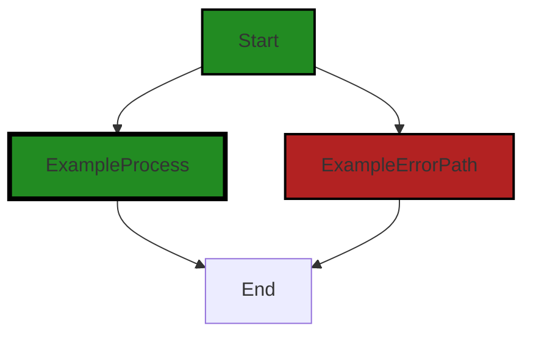

# Polyverse Boost-generated Source Analysis Details

## Source: ./src/test/suite/analyze_command.test.ts
Date Generated: Saturday, September 9, 2023 at 12:29:00 AM PDT


---

### Boost Architectural Quick Summary Security Report

Last Updated: Saturday, September 9, 2023 at 12:28:33 AM PDT


Executive Report:

1. **Architectural Impact**: The analysis of this file has not revealed any severe issues.
2. **Risk Analysis**: The analysis of this file has not revealed any severe issues.
3. **Potential Customer Impact**: Based on the analysis, there are no severe issues that could potentially impact customers.
4. **Performance Issues**: Our analysis did not identify any explicit performance issues in the file.
5. **Risk Assessment**: Based on the current analysis of this file, no severe issues have been found. However, this doesn't guarantee that the file is risk-free.

Highlights:

- No severe issues were identified in the current analysis of this file.


---

### Boost Architectural Quick Summary Performance Report

Last Updated: Saturday, September 9, 2023 at 12:28:52 AM PDT


Executive Report:

1. **Architectural Impact**: The analysis of this file has not revealed any severe issues.
2. **Risk Analysis**: The analysis of this file has not revealed any severe issues.
3. **Potential Customer Impact**: Based on the analysis, there are no severe issues that could potentially impact customers.
4. **Performance Issues**: Our analysis did not identify any explicit performance issues in the file.
5. **Risk Assessment**: Based on the current analysis of this file, no severe issues have been found. However, this doesn't guarantee that the file is risk-free.

Highlights:

- No severe issues were identified in the current analysis of this file.


---

### Boost Architectural Quick Summary Compliance Report

Last Updated: Saturday, September 9, 2023 at 12:29:04 AM PDT


Executive Report:

1. **Architectural Impact**: The analysis of this file has not revealed any severe issues.
2. **Risk Analysis**: The analysis of this file has not revealed any severe issues.
3. **Potential Customer Impact**: Based on the analysis, there are no severe issues that could potentially impact customers.
4. **Performance Issues**: Our analysis did not identify any explicit performance issues in the file.
5. **Risk Assessment**: Based on the current analysis of this file, no severe issues have been found. However, this doesn't guarantee that the file is risk-free.

Highlights:

- No severe issues were identified in the current analysis of this file.

---
## Detailed Analysis:

### Cell 0:
## Original Code:

### Programming Language: typescript
### ./src/test/suite/analyze_command.test.ts line 0

```typescript
suite('Analyze Code Command', function() {

    this.timeout(20000); // set test timeout to be 20 seconds
  
    test('Analyze Code Command Test', async function() {
  
      console.warn('Simulating Analyze Code Command Test');
    });
  });

```
## Boost Analysis:


---

### Boost Code Explanation

Last Updated: Wednesday, July 12, 2023 at 1:20:06 PM PDT

The code you provided is written in JavaScript and uses the Mocha testing framework. Mocha is a feature-rich JavaScript test framework running on Node.js and in the browser, making asynchronous testing simple and fun. 

Here's a breakdown of the code:

1. `suite('Analyze Code Command', function() {...});`: This line is declaring a test suite using Mocha's `suite` function. A test suite is a collection of tests that are intended to be run together. Here, a suite named 'Analyze Code Command' is created. Everything inside the function passed as the second argument to `suite` is part of this test suite.

2. `this.timeout(20000);`: This line is setting a timeout for the tests in this suite. The timeout is set to 20,000 milliseconds, or 20 seconds. If any test in this suite takes longer than 20 seconds to run, Mocha will automatically fail it.

3. `test('Analyze Code Command Test', async function() {...});`: This line is declaring a single test within the suite using Mocha's `test` function. This test is named 'Analyze Code Command Test'. The function passed as the second argument to `test` is the function that will be run when the test is executed.

4. `console.warn('Simulating Analyze Code Command Test');`: This line is inside the test function. It's using `console.warn` to print a message to the console. This message will be displayed when the test is run. 

Since this is a simple test, there aren't any specific algorithms used in the code. It's just a basic structure of a Mocha test suite.

For more information about Mocha, you can check out the official Mocha documentation here: https://mochajs.org/

In terms of architectural guidelines, the code appears to be a simple test and doesn't seem to conflict with any general software architecture principles. However, without additional context or specific guidelines, it's hard to say definitively.


---

### Boost Flow Diagram

Last Updated: Saturday, September 9, 2023 at 12:28:15 AM PDT



The code provided does not have any control flow.


---

### Boost Source-Level Security Analysis

Last Updated: Saturday, September 9, 2023 at 12:28:29 AM PDT

**No bugs found**


---

### Boost Source-Level Performance Analysis

Last Updated: Saturday, September 9, 2023 at 12:28:48 AM PDT

**No bugs found**


---

### Boost Source-Level Data and Privacy Compliance Analysis

Last Updated: Saturday, September 9, 2023 at 12:29:00 AM PDT

**No bugs found**

