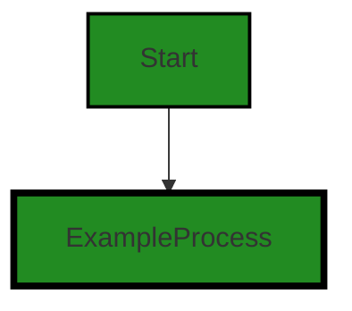

# Polyverse Boost-generated Source Analysis Details

## Source: ./src/test/suite/blueprint_command.test.ts
Date Generated: Friday, September 8, 2023 at 7:33:44 PM PDT


---

### Boost Architectural Quick Summary Security Report

Last Updated: Friday, September 8, 2023 at 7:33:18 PM PDT


Executive Report:

1. **Architectural Impact**: The analysis of this file has not revealed any severe issues.
2. **Risk Analysis**: The analysis of this file has not revealed any severe issues.
3. **Potential Customer Impact**: Based on the analysis, there are no severe issues that could potentially impact customers.
4. **Performance Issues**: Our analysis did not identify any explicit performance issues in the file.
5. **Risk Assessment**: Based on the current analysis of this file, no severe issues have been found. However, this doesn't guarantee that the file is risk-free.

Highlights:

- No severe issues were identified in the current analysis of this file.


---

### Boost Architectural Quick Summary Performance Report

Last Updated: Friday, September 8, 2023 at 7:33:29 PM PDT


Executive Report:

1. **Architectural Impact**: The analysis of this file has not revealed any severe issues.
2. **Risk Analysis**: The analysis of this file has not revealed any severe issues.
3. **Potential Customer Impact**: Based on the analysis, there are no severe issues that could potentially impact customers.
4. **Performance Issues**: Our analysis did not identify any explicit performance issues in the file.
5. **Risk Assessment**: Based on the current analysis of this file, no severe issues have been found. However, this doesn't guarantee that the file is risk-free.

Highlights:

- No severe issues were identified in the current analysis of this file.


---

### Boost Architectural Quick Summary Compliance Report

Last Updated: Friday, September 8, 2023 at 7:33:48 PM PDT


Executive Report:

1. **Architectural Impact**: The analysis of this file has not revealed any severe issues.
2. **Risk Analysis**: The analysis of this file has not revealed any severe issues.
3. **Potential Customer Impact**: Based on the analysis, there are no severe issues that could potentially impact customers.
4. **Performance Issues**: Our analysis did not identify any explicit performance issues in the file.
5. **Risk Assessment**: Based on the current analysis of this file, no severe issues have been found. However, this doesn't guarantee that the file is risk-free.

Highlights:

- No severe issues were identified in the current analysis of this file.

---
## Detailed Analysis:

### Cell 0:
## Original Code:

### Programming Language: typescript
### ./src/test/suite/blueprint_command.test.ts line 0

```typescript
suite('Blueprint Code Command', function() {

    this.timeout(20000); // set test timeout to be 20 seconds
  
    test('Blueprint Code Command Test', async function() {
  
      console.warn('Simulating Blueprint Code Command Test');
    });
  });

```
## Boost Analysis:


---

### Boost Code Explanation

Last Updated: Wednesday, July 12, 2023 at 1:20:33 PM PDT

This code is written in JavaScript and it's using Mocha, a feature-rich JavaScript test framework running on Node.js, for creating tests. 

Here's a breakdown of what the code is doing:

1. `suite('Blueprint Code Command', function() {...});`: This is a Mocha function that is used to define a test suite (a collection of test cases). The name of this test suite is 'Blueprint Code Command'.

2. `this.timeout(20000);`: This is a Mocha function that sets the timeout for each test in the suite to 20 seconds (20000 milliseconds). If a test takes longer than this to execute, Mocha will automatically fail it.

3. `test('Blueprint Code Command Test', async function() {...});`: This is another Mocha function that is used to define an individual test case. The name of this test case is 'Blueprint Code Command Test'. It's an asynchronous function, meaning it will return a Promise that Mocha will wait to resolve before marking the test as completed.

4. `console.warn('Simulating Blueprint Code Command Test');`: This is a simple console warning message that will be displayed in the console when the test is run. It's simulating the 'Blueprint Code Command Test'.

There are no specific algorithms used in this code. It's mainly for structuring and running tests in a JavaScript/Node.js application.

This code does not conflict with any architectural guidelines, as no specific guidelines were provided. It's a common practice to write tests for your code in most software projects, and this code is doing exactly that.

For more information on Mocha and how to use it for testing your JavaScript applications, you can check out the official Mocha documentation here: https://mochajs.org/


---

### Boost Flow Diagram

Last Updated: Friday, September 8, 2023 at 7:33:00 PM PDT




---

### Boost Source-Level Security Analysis

Last Updated: Friday, September 8, 2023 at 7:33:14 PM PDT

**No bugs found**


---

### Boost Source-Level Performance Analysis

Last Updated: Friday, September 8, 2023 at 7:33:25 PM PDT

**No bugs found**


---

### Boost Source-Level Data and Privacy Compliance Analysis

Last Updated: Friday, September 8, 2023 at 7:33:44 PM PDT

1. **Severity**: 3/10

   **Line Number**: 4

   **Bug Type**: GDPR

   **Description**: The use of 'console.warn' could potentially lead to the logging of sensitive data. GDPR requires that personal data is handled with care and not unnecessarily exposed.

   **Solution**: Ensure that no sensitive data is being logged. If data must be logged, ensure it is anonymized or pseudonymized to protect the identity of individuals. Also, consider using a logging library that supports redaction of sensitive information.


