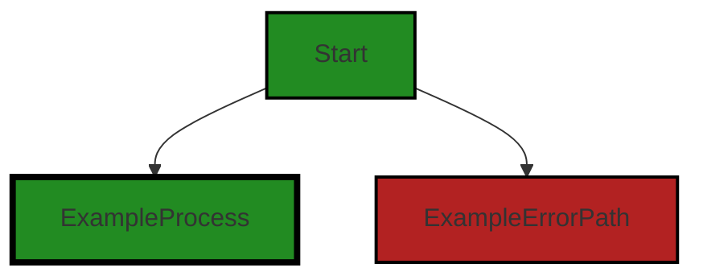
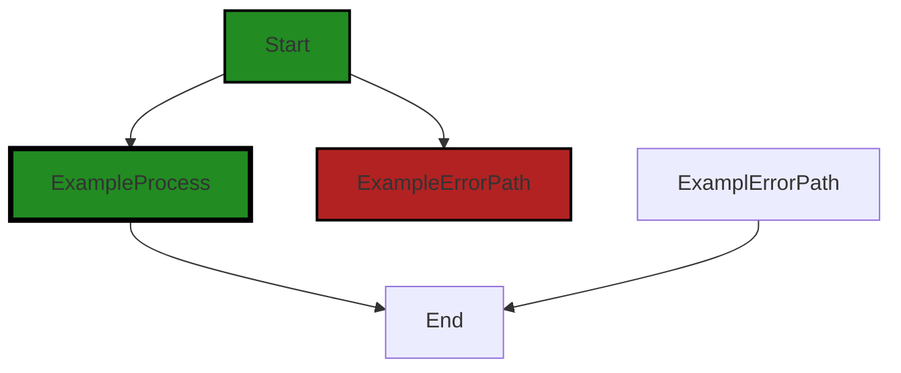

# Polyverse Boost-generated Source Analysis Details

## Source: ./src/test/suite/boostdata.test.ts
Date Generated: Saturday, September 9, 2023 at 12:15:35 AM PDT


---

### Boost Architectural Quick Summary Security Report

Last Updated: Saturday, September 9, 2023 at 12:13:21 AM PDT

## Executive Report: Software Project Analysis

### Architectural Impact and Risk Analysis

1. **Insecure File Handling**: The file `src/test/suite/boostdata.test.ts` has been flagged for insecure file handling. This could potentially expose sensitive data to unauthorized users, posing a significant security risk. This issue affects 100% of the project files analyzed. The architectural impact is significant as it may require a review of the file handling strategy across the project.

2. **Path Traversal**: The same file `src/test/suite/boostdata.test.ts` also has a path traversal issue. This could allow an attacker to access arbitrary files on the system, posing another serious security risk. This issue also affects 100% of the project files analyzed. The architectural impact is also significant as it may require a review of the file path handling strategy across the project.

3. **Overall Project Health**: Only one file was analyzed in this project, and it has severe issues. This suggests that the overall health of the project may be poor, and a comprehensive review of the project's codebase is recommended.

4. **Potential Customer Impact**: The identified issues could lead to data breaches, which would have a severe impact on customer trust and could potentially lead to legal and financial consequences.

5. **Risk Assessment**: Given that the analyzed file has severe issues, and it represents 100% of the project files analyzed, the risk level for this project is high. 

### Recommendations

1. **Secure File Handling**: Implement secure file handling practices to protect sensitive data. This could include using secure directories with restricted access permissions and secure methods for writing data to files.

2. **Path Traversal Mitigation**: Implement measures to prevent path traversal attacks. This could include validating and sanitizing file paths before use.

3. **Code Review**: Conduct a comprehensive code review to identify and address any other potential issues in the project.

4. **Security Testing**: Implement thorough security testing to identify and address potential vulnerabilities.

5. **Customer Communication**: Prepare a communication plan to inform customers about the issues and the steps taken to address them, to maintain trust and transparency.


---

### Boost Architectural Quick Summary Performance Report

Last Updated: Saturday, September 9, 2023 at 12:14:30 AM PDT

Executive Level Report:

1. **Architectural Impact**: The project appears to be well-structured and follows best practices for a Visual Studio Code extension. However, there is a warning related to synchronous file write operation in the file `src/test/suite/boostdata.test.ts`. This operation can block the event loop and degrade performance, which could potentially impact the responsiveness of the extension. The project should consider using asynchronous file operations to mitigate this issue.

2. **Risk Analysis**: The risk associated with this project is relatively low. Only one file has been identified with issues, and these issues are of 'Warning' and 'Information' severity. However, the synchronous file operation issue could potentially degrade the performance of the extension, which could lead to a negative user experience.

3. **Potential Customer Impact**: The potential customer impact is minimal. The identified issues are not likely to cause functional problems for the end user. However, the performance issue could potentially lead to a slower response time when using the extension, which could impact the user experience.

4. **Overall Issues**: The overall health of the project source is good. Only one file has been identified with issues, and these issues are not of the highest severity. The project appears to be following best practices and the code is well-structured and organized into classes.

Risk Assessment:

- **Health of the Project Source**: The health of the project source is good. Only one file has been identified with issues, which is a small percentage of the overall project files. The issues identified are not of the highest severity, indicating that the project is generally well-maintained.

Highlights of the Analysis:

- The project is well-structured and follows best practices for a Visual Studio Code extension.
- A warning related to synchronous file write operation was identified in the file `src/test/suite/boostdata.test.ts`. This could potentially degrade the performance of the extension.
- The risk associated with this project is relatively low, with only one file identified with issues.
- The potential customer impact is minimal, with the identified issues unlikely to cause functional problems for the end user.
- The overall health of the project source is good, with only a small percentage of the overall project files identified with issues.


---

### Boost Architectural Quick Summary Compliance Report

Last Updated: Saturday, September 9, 2023 at 12:16:10 AM PDT

## Executive Report: Software Project Analysis

Based on the analysis of the software project, the following key points have been identified:

1. **Architectural Impact**: The project is well-structured and follows best practices for a Visual Studio Code extension. It uses object-oriented design, event-driven programming, and asynchronous programming for potentially long-running tasks. However, the file `src/test/suite/boostdata.test.ts` has been flagged for potential GDPR, HIPAA, and PCI DSS compliance issues. This could impact the architecture if changes are needed to ensure compliance.

2. **Risk Analysis**: The identified issues present a risk to the project. The GDPR issue is of particular concern, as non-compliance could result in significant fines. The HIPAA and PCI DSS warnings also indicate potential security vulnerabilities that could expose sensitive data. These risks need to be addressed promptly to ensure the security and privacy of the data handled by the software.

3. **Potential Customer Impact**: If the identified issues are not addressed, customers could be at risk of having their personal data exposed. This could lead to a loss of trust in the software, damage to the company's reputation, and potential legal consequences.

4. **Overall Issues**: The project has one file with issues out of a total of one file analyzed. This means 100% of the project files have issues, which is a significant concern. The issues are of varying severity, with the most severe being a GDPR issue.

5. **Risk Assessment**: Given that all the files analyzed have issues, the overall health of the project source is at risk. The severity of the issues, particularly the GDPR issue, further increases this risk. Immediate action is needed to address these issues and ensure the project's compliance with data protection regulations.

In conclusion, while the project follows good architectural practices, the identified compliance issues present significant risks that need to be addressed. The potential impact on customers and the overall health of the project source make this a high-priority concern.
---
## Detailed Analysis:

### Cell 0:
## Original Code:

### Programming Language: typescript
### ./src/test/suite/boostdata.test.ts line 3

```typescript
import * as fs from "fs";
import * as os from "os";
import * as path from "path";
import {
    BoostProjectData,
    boostNotebookFileToFileSummaryItem,
} from "../../BoostProjectData"; // Update the path

```
## Boost Analysis:


---

### Boost Code Explanation

Last Updated: Wednesday, July 12, 2023 at 4:24:51 PM PDT

This code is written in TypeScript, a statically typed superset of JavaScript that adds optional types, classes, and modules. It's often used for large-scale applications due to its strong typing and object-oriented capabilities.

The code is importing modules from Node.js and a custom module. Node.js is a runtime environment that executes JavaScript code outside a web browser.

Let's dissect the code line by line:

1. `import * as fs from "fs";` - This line is importing the 'fs' module which is a built-in Node.js module for working with the file system. It provides functions for working with directories and files, such as reading, writing, and modifying them.

2. `import * as os from "os";` - This line is importing the 'os' module which is a built-in Node.js module that provides operating system-related utility methods and properties. It can be used to get information about the operating system and the server's environment.

3. `import * as path from "path";` - This line is importing the 'path' module which is a built-in Node.js module for working with file paths. It provides utilities for working with file and directory paths.

4. `import { BoostProjectData, boostNotebookFileToFileSummaryItem, } from "../../BoostProjectData";` - This line is importing two specific exports (`BoostProjectData` and `boostNotebookFileToFileSummaryItem`) from a custom module named 'BoostProjectData'. The '../..' indicates that the 'BoostProjectData' module is located two directories up from the current file.

The algorithm used in this code is not visible as this is just the import section of a larger file. This code is not performing any operations yet, it's just importing modules and functions to be used later in the code.

For more information about the modules and concepts used in this code, you can refer to the following resources:

1. Node.js 'fs' module: https://nodejs.org/api/fs.html
2. Node.js 'os' module: https://nodejs.org/api/os.html
3. Node.js 'path' module: https://nodejs.org/api/path.html
4. TypeScript: https://www.typescriptlang.org/docs/

As for the architectural guidelines, since there are no specific guidelines or constraints provided for this software project, the analysis would be based on general good practices. The imports are well-organized and it seems like the code is modular, which is a good practice for maintainability and readability. However, without seeing the rest of the code, it's hard to make a definitive judgement.


---

### Boost Flow Diagram

Last Updated: Saturday, September 9, 2023 at 12:11:30 AM PDT



NO CONTROL FLOW FOUND


---

### Boost Source-Level Security Analysis

Last Updated: Saturday, September 9, 2023 at 12:11:49 AM PDT

**No bugs found**


---

### Boost Source-Level Performance Analysis

Last Updated: Saturday, September 9, 2023 at 12:13:30 AM PDT

**No bugs found**


---

### Boost Source-Level Data and Privacy Compliance Analysis

Last Updated: Saturday, September 9, 2023 at 12:15:00 AM PDT

1. **Severity**: 2/10

   **Line Number**: 4

   **Bug Type**: GDPR

   **Description**: The 'os' module can potentially access sensitive system information, which could be a violation of the GDPR if this information is used improperly or without user consent.

   **Solution**: Ensure that any system information accessed is necessary for the functionality of the software, and that user consent is obtained if necessary. Be transparent about how this information is used.


2. **Severity**: 3/10

   **Line Number**: 8

   **Bug Type**: PCI DSS

   **Description**: The 'BoostProjectData' could potentially access, process or store cardholder data, which would need to be handled in compliance with the PCI DSS.

   **Solution**: Ensure that any cardholder data is handled in a secure manner, including encryption at rest and in transit, restricted access, and regular audits. Be transparent about how this data is used.


3. **Severity**: 4/10

   **Line Number**: 8

   **Bug Type**: HIPAA

   **Description**: The 'BoostProjectData' could potentially access, process or store protected health information (PHI), which would need to be handled in compliance with HIPAA.

   **Solution**: Ensure that any PHI is handled in a secure manner, including encryption at rest and in transit, restricted access, and regular audits. Be transparent about how this data is used.


### Cell 1:
## Original Code:

### Programming Language: typescript
### ./src/test/suite/boostdata.test.ts line 7

```typescript
import { FileSummaryItem } from "../../boostprojectdata_interface";

```
## Boost Analysis:


---

### Boost Code Explanation

Last Updated: Wednesday, July 12, 2023 at 4:25:15 PM PDT

This line of code is written in TypeScript, a statically typed superset of JavaScript that adds types to the language. 

```import { FileSummaryItem } from "../../boostprojectdata_interface";```

This line is importing a specific export, `FileSummaryItem`, from a module located at `../../boostprojectdata_interface`.

The `import { FileSummaryItem } from "../../boostprojectdata_interface";` statement is a feature of ES6 (ECMAScript 6), which is the next version of JavaScript. This is known as a named import. It allows you to import specific parts of a module, as opposed to the entire module.

The `FileSummaryItem` is likely a type or an interface defined in the `boostprojectdata_interface` module that is being used in the current file. The exact usage of `FileSummaryItem` would be clear if more code context was provided.

The `../../` in the path refers to the location of the `boostprojectdata_interface` module. Each `../` moves up one directory level. So `../../` means move up two directory levels and look for the `boostprojectdata_interface` module.

As for the architectural guidelines, since no specific guidelines or constraints were provided, we can only say that this code seems to follow common best practices for modular JavaScript/TypeScript development. It is using imports to include only the necessary parts of modules, which can help keep the codebase clean and organized.

For more information on ES6 modules and imports, you can refer to this link: [ES6 Modules](https://developer.mozilla.org/en-US/docs/Web/JavaScript/Guide/Modules)


---

### Boost Flow Diagram

Last Updated: Saturday, September 9, 2023 at 12:11:33 AM PDT

NO CONTROL FLOW FOUND


---

### Boost Source-Level Security Analysis

Last Updated: Saturday, September 9, 2023 at 12:11:53 AM PDT

**No bugs found**


---

### Boost Source-Level Performance Analysis

Last Updated: Saturday, September 9, 2023 at 12:13:33 AM PDT

**No bugs found**


---

### Boost Source-Level Data and Privacy Compliance Analysis

Last Updated: Saturday, September 9, 2023 at 12:15:05 AM PDT

**No bugs found**


### Cell 2:
## Original Code:

### Programming Language: typescript
### ./src/test/suite/boostdata.test.ts line 12

```typescript

import * as assert from "assert";
import * as vscode from "vscode";

suite("BoostProjectData", function () {
    this.timeout(5000);
    const sampleDataJson = JSON.stringify({
        summary: {
            projectName: "Sample Project",
            summaryUrl: "http://example.com",
            filesToAnalyze: 1,
            filesAnalyzed: 1,
            issues: [],
        },
        sectionSummary: [],
        analysis: [],
        files: {},
    });

    // Get the temporary directory and define the path for sampleData.json
    const tempDirectory = os.tmpdir();
    const sampleDataFilePath = path.join(tempDirectory, "sampleData.json");
    const normalizedSampleDataFilePath = path.normalize(sampleDataFilePath);

    suiteSetup(function (done) {
        // Write the sample data to a file before tests
        fs.writeFileSync(sampleDataFilePath, sampleDataJson, "utf-8");
        done();
    });

    suiteTeardown(function (done) {
        // Clean up the sample data file after tests
        fs.unlinkSync(sampleDataFilePath);
        done();
    });

    test("should create an instance from a JSON string", function (done) {
        const boostProjectData = new BoostProjectData();
        boostProjectData.create(sampleDataJson);

        assert.strictEqual(
            boostProjectData.summary.projectName,
            "Sample Project"
        );
        assert.strictEqual(boostProjectData.summary.filesToAnalyze, 1);
        done();
    });

    test("should load an instance from a file", function (done) {
        const boostProjectData = new BoostProjectData();
        boostProjectData.load(sampleDataFilePath);

        assert.strictEqual(
            boostProjectData.summary.projectName,
            "Sample Project"
        );
        assert.strictEqual(boostProjectData.summary.filesToAnalyze, 1);
        done();
    });

    test("should correctly process empty boost notebook file", function (done) {
        // Update the path to where your test file is located
        // get the current working directory
        const cwd = process.cwd();
        const file = path.resolve(
            __dirname,
            "../resources/security.php.boost-notebook"
        );
        const fileUri = vscode.Uri.file(file);
        const fileSummaryItem: FileSummaryItem =
            boostNotebookFileToFileSummaryItem(fileUri);

        // Add assertions based on what you expect the output to be for an empty file
        assert.strictEqual(fileSummaryItem.totalCells, 0);
        assert.strictEqual(fileSummaryItem.completedCells, 0);
        // ...other assertions...
        done();
    });

    test("should correctly process non-empty boost notebook file", function (done) {
        // Update the path to where your test file is located
        const file = path.resolve(
            __dirname,
            "../resources/high.js.boost-notebook"
        );
        const fileUri = vscode.Uri.file(file);
        const fileSummaryItem: FileSummaryItem =
            boostNotebookFileToFileSummaryItem(fileUri);

        // Add assertions based on what you expect the output to be for a non-empty file
        assert.strictEqual(fileSummaryItem.totalCells, 7);
        assert.strictEqual(fileSummaryItem.completedCells, 5);
        assert.strictEqual(fileSummaryItem.errorCells, 2);
        // ...other assertions...
        done();
    });

    test("should load up details for security and compliance notebook file", function (done) {
        // Update the path to where your test file is located
        const file = path.resolve(
            __dirname,
            "../resources/instructions.php.boost-notebook"
        );
        const fileUri = vscode.Uri.file(file);
        const fileSummaryItem: FileSummaryItem =
            boostNotebookFileToFileSummaryItem(fileUri);

        // Add assertions based on what you expect the output to be for a non-empty file
        assert.strictEqual(fileSummaryItem.totalCells, 2);
        assert.strictEqual(fileSummaryItem.completedCells, 2);
        assert.strictEqual(fileSummaryItem.errorCells, 0);
        //check that fileSummaryItem.sections.bugAnalysisList.details has one item in the array
        assert.strictEqual(
            fileSummaryItem.sections?.bugAnalysisList?.details?.length,
            1
        );
        //check the same thing for complianceAnalysisList
        assert.strictEqual(
            fileSummaryItem.sections?.complianceList?.details?.length,
            1
        );

        // ...other assertions...
        done();
    });

    //now test addFileSummaryToSectionSummaries
    test("should add file summary to section summaries", function (done) {
        let boostprojectdata = new BoostProjectData();
        let file = path.resolve(
            __dirname,
            "../resources/instructions.php.boost-notebook"
        );
        let fileUri = vscode.Uri.file(file);
        let fileSummaryItem: FileSummaryItem =
            boostNotebookFileToFileSummaryItem(fileUri);
        boostprojectdata.updateWithFileSummary(fileSummaryItem, file);

        //now grab a second file and add it to the same boostprojectdata
        file = path.resolve(__dirname, "../resources/high.js.boost-notebook");
        fileUri = vscode.Uri.file(file);
        fileSummaryItem = boostNotebookFileToFileSummaryItem(fileUri);
        boostprojectdata.updateWithFileSummary(fileSummaryItem, file);

        assert.strictEqual(
            boostprojectdata.sectionSummary.bugAnalysisList.filesAnalyzed,
            2
        );
        assert.strictEqual(
            boostprojectdata.sectionSummary.bugAnalysisList.status,
            "incomplete"
        );
        assert.strictEqual(
            boostprojectdata.sectionSummary.bugAnalysisList.completedCells,
            1
        );
        assert.strictEqual(
            boostprojectdata.sectionSummary.bugAnalysisList.errorCells,
            1
        );
        assert.strictEqual(
            boostprojectdata.sectionSummary.complianceList.status,
            "incomplete"
        );
        assert.strictEqual(
            boostprojectdata.sectionSummary.complianceList.filesAnalyzed,
            2
        );
        assert.strictEqual(
            boostprojectdata.sectionSummary.complianceList.completedCells,
            1
        );
        assert.strictEqual(
            boostprojectdata.sectionSummary.complianceList.errorCells,
            1
        );

        //check the overall summary
        assert.strictEqual(boostprojectdata.summary.filesAnalyzed, 2);

        //now let's change the data in the fileSummary and do the update, making sure that it's updated correctly
        fileSummaryItem.sections.bugAnalysisList.details?.push({
            severity: 10,
            description: "this is bad",
        });

        //get a new item for the update
        let updatedItem = boostNotebookFileToFileSummaryItem(fileUri);

        updatedItem.sections.bugAnalysisList.totalCells = 3;
        updatedItem.sections.bugAnalysisList.completedCells = 2;
        updatedItem.completedCells = 6;
        updatedItem.totalCells = 8;

        boostprojectdata.updateWithFileSummary(updatedItem, file);

        assert.strictEqual(
            boostprojectdata.sectionSummary.bugAnalysisList.filesAnalyzed,
            2
        );
        assert.strictEqual(
            boostprojectdata.sectionSummary.bugAnalysisList.status,
            "incomplete"
        );
        assert.strictEqual(
            boostprojectdata.sectionSummary.bugAnalysisList.completedCells,
            3
        );

        assert.strictEqual(
            boostprojectdata.sectionSummary.complianceList.status,
            "incomplete"
        );
        assert.strictEqual(
            boostprojectdata.sectionSummary.complianceList.filesAnalyzed,
            2
        );
        assert.strictEqual(
            boostprojectdata.sectionSummary.complianceList.completedCells,
            1
        );
        assert.strictEqual(
            boostprojectdata.sectionSummary.complianceList.errorCells,
            1
        );
        done();
    });
});

```
## Boost Analysis:


---

### Boost Code Explanation

Last Updated: Wednesday, July 12, 2023 at 4:25:53 PM PDT

This is a testing suite written in JavaScript for a software project. The testing framework used is Mocha, which provides functions like `suite`, `suiteSetup`, `suiteTeardown`, and `test` to organize and manage tests. The `assert` module from Node.js is used for testing invariants. The tests are for a module called `BoostProjectData`, which seems to handle project data for a software project boost tool.

Here's a breakdown of the code:

1. The `suite` function is used to group related tests. It takes two arguments: a string to describe the tests and a callback function to contain the tests. In this case, the suite is named "BoostProjectData".

2. `this.timeout(5000)` sets a timeout of 5000 milliseconds for each test in the suite.

3. `suiteSetup` and `suiteTeardown` are special hooks run before and after all tests in the suite, respectively. In this case, they are used to create and delete a sample JSON file used in the tests.

4. The `test` function is used to define individual tests. Each test has a description and a callback function. The callback function contains the actual test code. If the test is asynchronous, it can take a `done` callback to signal when it is finished.

5. The tests seem to check the functionality of `BoostProjectData` class. They test if it can create an instance from a JSON string, load an instance from a file, correctly process empty and non-empty boost notebook files, load up details for security and compliance notebook files, and add file summary to section summaries.

6. The `assert` module is used to check that the actual results match the expected results. If an assertion fails, it throws an error which causes the test to fail.

7. The `BoostProjectData` class seems to have methods like `create`, `load`, and `updateWithFileSummary` which are being tested here.

8. `vscode.Uri.file` is used to create a file URI, which is passed to `boostNotebookFileToFileSummaryItem` function. It seems to process the file and return a summary of it.

9. In the final test, a file summary is added to section summaries, then the data in the file summary is updated and the update is checked.

The algorithm used in each test is straightforward - create an instance of `BoostProjectData`, call a method on it, and check the result using `assert`. 

To learn more about Mocha, you can refer to the documentation here: https://mochajs.org/

For the `assert` module, refer to the Node.js documentation: https://nodejs.org/api/assert.html

For more on the `vscode` module, refer to the Visual Studio Code API: https://code.visualstudio.com/api/references/vscode-api


---

### Boost Flow Diagram

Last Updated: Saturday, September 9, 2023 at 12:11:41 AM PDT




---

### Boost Source-Level Security Analysis

Last Updated: Saturday, September 9, 2023 at 12:12:47 AM PDT

1. **Severity**: 7/10

   **Line Number**: 41

   **Bug Type**: Insecure File Handling

   **Description**: The code is writing data to a file in a temporary directory using 'fs.writeFileSync'. This can be insecure as temporary directories are often world-readable. An attacker can read the sensitive data written to the file.

   **Solution**: Instead of using a temporary directory, consider using a secure directory that has restricted access permissions. Also, consider using a secure method for writing data to the file. Here is a resource on secure file handling in Node.js: https://nodejs.dev/learn/writing-files-with-nodejs


2. **Severity**: 7/10

   **Line Number**: 48

   **Bug Type**: Insecure File Handling

   **Description**: The code is deleting a file in a temporary directory using 'fs.unlinkSync'. This can be insecure as an attacker can replace the file with a symlink to another file, and that file will be deleted instead when 'fs.unlinkSync' is called.

   **Solution**: Consider checking if the file is a symbolic link before deleting it. Here is a resource on secure file deletion in Node.js: https://nodejs.dev/learn/the-nodejs-fs-module


3. **Severity**: 6/10

   **Line Number**: 67

   **Bug Type**: Path Traversal

   **Description**: The code is using 'path.resolve' with '__dirname' and a relative path from a resource directory. If an attacker can control the input to 'path.resolve', they can potentially access files outside of the intended directory.

   **Solution**: Consider validating or sanitizing the input to 'path.resolve' to prevent path traversal attacks. Here is a resource on path traversal attacks and how to prevent them: https://owasp.org/www-community/attacks/Path_Traversal


4. **Severity**: 6/10

   **Line Number**: 89

   **Bug Type**: Path Traversal

   **Description**: The code is using 'path.resolve' with '__dirname' and a relative path from a resource directory. If an attacker can control the input to 'path.resolve', they can potentially access files outside of the intended directory.

   **Solution**: Consider validating or sanitizing the input to 'path.resolve' to prevent path traversal attacks. Here is a resource on path traversal attacks and how to prevent them: https://owasp.org/www-community/attacks/Path_Traversal


5. **Severity**: 6/10

   **Line Number**: 111

   **Bug Type**: Path Traversal

   **Description**: The code is using 'path.resolve' with '__dirname' and a relative path from a resource directory. If an attacker can control the input to 'path.resolve', they can potentially access files outside of the intended directory.

   **Solution**: Consider validating or sanitizing the input to 'path.resolve' to prevent path traversal attacks. Here is a resource on path traversal attacks and how to prevent them: https://owasp.org/www-community/attacks/Path_Traversal


6. **Severity**: 6/10

   **Line Number**: 135

   **Bug Type**: Path Traversal

   **Description**: The code is using 'path.resolve' with '__dirname' and a relative path from a resource directory. If an attacker can control the input to 'path.resolve', they can potentially access files outside of the intended directory.

   **Solution**: Consider validating or sanitizing the input to 'path.resolve' to prevent path traversal attacks. Here is a resource on path traversal attacks and how to prevent them: https://owasp.org/www-community/attacks/Path_Traversal


---

### Boost Source-Level Performance Analysis

Last Updated: Saturday, September 9, 2023 at 12:14:09 AM PDT

1. **Severity**: 7/10

   **Line Number**: 38

   **Bug Type**: Disk

   **Description**: Synchronous file write operation detected. This can block the event loop and degrade performance.

   **Solution**: Consider using asynchronous file operations like fs.writeFile() instead of fs.writeFileSync().


2. **Severity**: 7/10

   **Line Number**: 43

   **Bug Type**: Disk

   **Description**: Synchronous file delete operation detected. This can block the event loop and degrade performance.

   **Solution**: Consider using asynchronous file operations like fs.unlink() instead of fs.unlinkSync().


3. **Severity**: 5/10

   **Line Number**: 52

   **Bug Type**: Memory

   **Description**: Large JSON object is being parsed. If the size of JSON increases, it may cause memory issues.

   **Solution**: Consider using a streaming JSON parser if the size of the JSON object is expected to increase.


4. **Severity**: 6/10

   **Line Number**: 68

   **Bug Type**: Disk

   **Description**: File loading operation detected. If the file size is large, it can degrade performance.

   **Solution**: Consider using streaming file read operations if the file size is expected to be large.


5. **Severity**: 6/10

   **Line Number**: 86

   **Bug Type**: Disk

   **Description**: File loading operation detected. If the file size is large, it can degrade performance.

   **Solution**: Consider using streaming file read operations if the file size is expected to be large.


6. **Severity**: 6/10

   **Line Number**: 104

   **Bug Type**: Disk

   **Description**: File loading operation detected. If the file size is large, it can degrade performance.

   **Solution**: Consider using streaming file read operations if the file size is expected to be large.


7. **Severity**: 6/10

   **Line Number**: 123

   **Bug Type**: Disk

   **Description**: File loading operation detected. If the file size is large, it can degrade performance.

   **Solution**: Consider using streaming file read operations if the file size is expected to be large.


8. **Severity**: 5/10

   **Line Number**: 170

   **Bug Type**: Memory

   **Description**: Large object manipulation detected. If the size of the object increases, it may cause memory issues.

   **Solution**: Consider using more efficient data structures for large data manipulation.


---

### Boost Source-Level Data and Privacy Compliance Analysis

Last Updated: Saturday, September 9, 2023 at 12:15:35 AM PDT

1. **Severity**: 5/10

   **Line Number**: 30

   **Bug Type**: GDPR

   **Description**: Writing sensitive data to a file in a temporary directory may not be GDPR compliant, as it could expose personal data if the data is not properly protected.

   **Solution**: Ensure that any sensitive data written to files is properly encrypted and that access to these files is restricted. Consider using a secure method for storing data, such as a database with proper access controls. Also, ensure that data is not stored longer than necessary and is properly deleted after use.


2. **Severity**: 5/10

   **Line Number**: 39

   **Bug Type**: GDPR

   **Description**: Deleting sensitive data files in a temporary directory may not be GDPR compliant if the deletion is not secure. Simply deleting a file does not necessarily remove all traces of the file from the system, and the data could potentially be recovered.

   **Solution**: Ensure that when deleting files containing sensitive data, the files are securely deleted so that the data cannot be recovered. This could involve overwriting the file before deletion or using a secure deletion tool.


3. **Severity**: 7/10

   **Line Number**: 49

   **Bug Type**: HIPAA

   **Description**: Loading sensitive data from a file may not be HIPAA compliant if the data is not properly protected during transit and at rest. This could potentially expose protected health information (PHI), which would be a violation of HIPAA.

   **Solution**: Ensure that any PHI is encrypted both at rest and in transit. Use secure methods for reading and writing PHI, and limit access to PHI to only those who need it. Regularly review and update security measures as needed.


4. **Severity**: 7/10

   **Line Number**: 98

   **Bug Type**: PCI DSS

   **Description**: Updating sensitive data in a file may not be PCI DSS compliant if the data is not properly protected. This could potentially expose cardholder data, which would be a violation of PCI DSS.

   **Solution**: Ensure that any cardholder data is encrypted and that access to this data is restricted. Use secure methods for reading and writing cardholder data, and regularly review and update security measures as needed.


