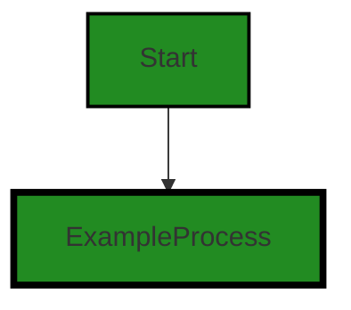

# Polyverse Boost-generated Source Analysis Details

## Source: ./src/test/suite/code_conversion_command.test.ts
Date Generated: Friday, September 8, 2023 at 10:27:38 PM PDT


---

### Boost Architectural Quick Summary Security Report

Last Updated: Friday, September 8, 2023 at 10:27:09 PM PDT


Executive Report:

1. **Architectural Impact**: The analysis of this file has not revealed any severe issues.
2. **Risk Analysis**: The analysis of this file has not revealed any severe issues.
3. **Potential Customer Impact**: Based on the analysis, there are no severe issues that could potentially impact customers.
4. **Performance Issues**: Our analysis did not identify any explicit performance issues in the file.
5. **Risk Assessment**: Based on the current analysis of this file, no severe issues have been found. However, this doesn't guarantee that the file is risk-free.

Highlights:

- No severe issues were identified in the current analysis of this file.


---

### Boost Architectural Quick Summary Performance Report

Last Updated: Friday, September 8, 2023 at 10:27:31 PM PDT


Executive Report:

1. **Architectural Impact**: The analysis of this file has not revealed any severe issues.
2. **Risk Analysis**: The analysis of this file has not revealed any severe issues.
3. **Potential Customer Impact**: Based on the analysis, there are no severe issues that could potentially impact customers.
4. **Performance Issues**: Our analysis did not identify any explicit performance issues in the file.
5. **Risk Assessment**: Based on the current analysis of this file, no severe issues have been found. However, this doesn't guarantee that the file is risk-free.

Highlights:

- No severe issues were identified in the current analysis of this file.


---

### Boost Architectural Quick Summary Compliance Report

Last Updated: Friday, September 8, 2023 at 10:27:41 PM PDT


Executive Report:

1. **Architectural Impact**: The analysis of this file has not revealed any severe issues.
2. **Risk Analysis**: The analysis of this file has not revealed any severe issues.
3. **Potential Customer Impact**: Based on the analysis, there are no severe issues that could potentially impact customers.
4. **Performance Issues**: Our analysis did not identify any explicit performance issues in the file.
5. **Risk Assessment**: Based on the current analysis of this file, no severe issues have been found. However, this doesn't guarantee that the file is risk-free.

Highlights:

- No severe issues were identified in the current analysis of this file.

---
## Detailed Analysis:

### Cell 0:
## Original Code:

### Programming Language: typescript
### ./src/test/suite/code_conversion_command.test.ts line 0

```typescript
suite('Convert Code Command', function() {

  this.timeout(20000); // set test timeout to be 20 seconds

  test('Convert Code Command Test', async function() {

    console.warn('Simulating Convert Code Command Test');

  });
});

```
## Boost Analysis:


---

### Boost Code Explanation

Last Updated: Wednesday, July 12, 2023 at 1:17:50 PM PDT

The given code is a simple test suite written in JavaScript, using the Mocha testing framework. Let's break it down:

1. `suite('Convert Code Command', function() {...});` - This is a Mocha function that is used to define a suite of tests. The string 'Convert Code Command' is used as the description for this test suite.

2. `this.timeout(20000);` - This line of code sets the timeout for each test in the suite to 20,000 milliseconds (or 20 seconds). If a test takes longer than this amount of time, Mocha will automatically fail it.

3. `test('Convert Code Command Test', async function() {...});` - This is another Mocha function that defines an individual test. The string 'Convert Code Command Test' is used as the description for this test.

4. `console.warn('Simulating Convert Code Command Test');` - This line of code is inside the test function. It's using the console.warn function to print a warning message to the console. This message is 'Simulating Convert Code Command Test'. It's important to note that this doesn't actually perform any tests - it just prints a message.

5. The `async` keyword before the function indicates that the function returns a Promise. This is useful in testing scenarios where you might be dealing with asynchronous operations - for example, if you were testing a function that makes a network request, you would want to wait for that request to complete before running your assertions.

This code does not seem to have any specific algorithm as it is more of a configuration for testing rather than implementing any specific logic.

For more information about Mocha and how to write tests with it, you can visit the official Mocha website: https://mochajs.org/

Regarding the architectural guidelines, since there were no special architectural guidelines or constraints provided, it's hard to say whether this code conflicts with any. However, it is good practice to write tests for your code, and this code does follow that principle.


---

### Boost Flow Diagram

Last Updated: Friday, September 8, 2023 at 10:26:58 PM PDT




---

### Boost Source-Level Security Analysis

Last Updated: Friday, September 8, 2023 at 10:27:05 PM PDT

**No bugs found**


---

### Boost Source-Level Performance Analysis

Last Updated: Friday, September 8, 2023 at 10:27:26 PM PDT

1. **Severity**: 3/10

   **Line Number**: 2

   **Bug Type**: CPU

   **Description**: The test timeout is set to be 20 seconds. This could potentially slow down the entire test suite if each test is allowed to run for this long.

   **Solution**: Consider reducing the test timeout or use a more efficient test design to ensure tests complete within a reasonable time frame.


2. **Severity**: 2/10

   **Line Number**: 5

   **Bug Type**: CPU

   **Description**: The use of `console.warn` could potentially slow down the execution of the test, especially if the output is large or if the console output is redirected to a slow device.

   **Solution**: Consider using a logging framework that can handle large amounts of data more efficiently, or only log necessary information.


---

### Boost Source-Level Data and Privacy Compliance Analysis

Last Updated: Friday, September 8, 2023 at 10:27:38 PM PDT

**No bugs found**

