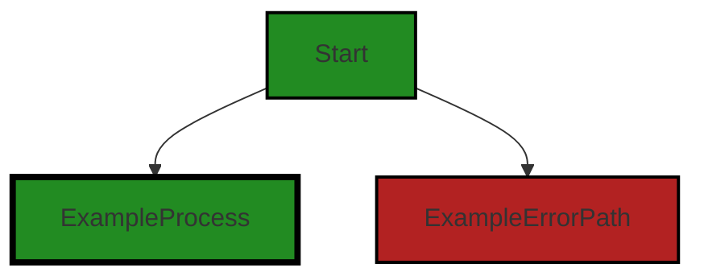
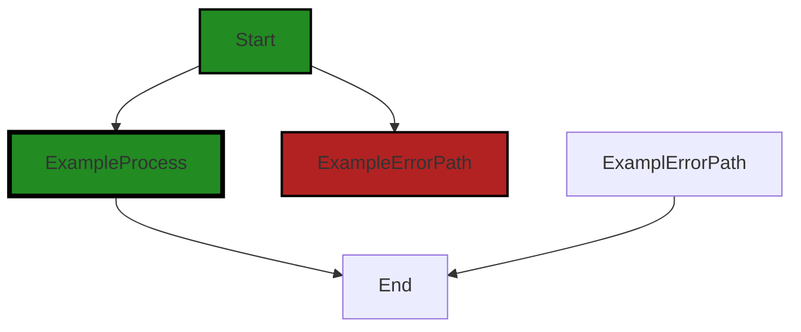

# Polyverse Boost-generated Source Analysis Details

## Source: ./src/test/suite/commands_exist.test.ts
Date Generated: Friday, September 8, 2023 at 11:51:51 PM PDT


---

### Boost Architectural Quick Summary Security Report

Last Updated: Friday, September 8, 2023 at 11:50:36 PM PDT


Executive Report:

1. **Architectural Impact**: The analysis of this file has not revealed any severe issues.
2. **Risk Analysis**: The analysis of this file has not revealed any severe issues.
3. **Potential Customer Impact**: Based on the analysis, there are no severe issues that could potentially impact customers.
4. **Performance Issues**: Our analysis did not identify any explicit performance issues in the file.
5. **Risk Assessment**: Based on the current analysis of this file, no severe issues have been found. However, this doesn't guarantee that the file is risk-free.

Highlights:

- No severe issues were identified in the current analysis of this file.


---

### Boost Architectural Quick Summary Performance Report

Last Updated: Friday, September 8, 2023 at 11:51:32 PM PDT

Executive Level Report:

1. **Architectural Impact**: The software project is a Visual Studio Code extension that provides code analysis functionality. It is well-structured and follows best practices for a VS Code extension. However, there is a CPU-intensive function call in the `commands_exist.test.ts` file that could potentially impact the performance of the extension. This issue needs to be addressed to ensure optimal performance.

2. **Risk Analysis**: The risk associated with this project is relatively low. Only one file has been identified with issues, and these issues are of 'Warning' severity, not 'Error'. However, the CPU-intensive function call could potentially slow down the extension, especially if the number of commands increases significantly. This could lead to a poor user experience.

3. **Potential Customer Impact**: If the CPU-intensive function call is not addressed, customers may experience slower performance when using the extension. This could potentially impact the user experience and satisfaction. 

4. **Overall Issues**: The overall health of the project source is good, with only one file having detected issues. However, the issue identified is of 'Warning' severity and could impact the performance of the extension. 

Risk Assessment:

- **Health of the Project Source**: The project source appears to be in good health, with only one file out of the total having detected issues. This represents a small percentage of the total project files. 

Highlights of the Analysis:

- The project follows best practices for a VS Code extension and makes good use of TypeScript features and the VS Code API.
- Only one file, `commands_exist.test.ts`, has been identified with issues. These issues are of 'Warning' severity and relate to CPU-intensive function calls.
- If not addressed, the CPU-intensive function call could potentially slow down the extension, impacting the user experience.
- Despite the issue identified, the overall health of the project source is good. 

This analysis is based on the current state of the project and could change as more files are added or existing files are modified. Regular code reviews and performance testing are recommended to maintain the health of the project source.


---

### Boost Architectural Quick Summary Compliance Report

Last Updated: Friday, September 8, 2023 at 11:51:54 PM PDT


Executive Report:

1. **Architectural Impact**: The analysis of this file has not revealed any severe issues.
2. **Risk Analysis**: The analysis of this file has not revealed any severe issues.
3. **Potential Customer Impact**: Based on the analysis, there are no severe issues that could potentially impact customers.
4. **Performance Issues**: Our analysis did not identify any explicit performance issues in the file.
5. **Risk Assessment**: Based on the current analysis of this file, no severe issues have been found. However, this doesn't guarantee that the file is risk-free.

Highlights:

- No severe issues were identified in the current analysis of this file.

---
## Detailed Analysis:

### Cell 0:
## Original Code:

### Programming Language: typescript
### ./src/test/suite/commands_exist.test.ts line 2

```typescript
import * as assert from 'assert';
import * as vscode from 'vscode';
import { NOTEBOOK_TYPE } from '../../jupyter_notebook';

```
## Boost Analysis:


---

### Boost Code Explanation

Last Updated: Friday, September 8, 2023 at 11:49:09 PM PDT

The provided code snippet is written in JavaScript and it is importing modules in a Node.js environment. It's a very small part of a larger codebase, likely for a Visual Studio Code (VS Code) extension related to Jupyter notebooks. Here's a detailed explanation:

1. `import * as assert from 'assert';` - This line is importing the built-in Node.js module 'assert'. The 'assert' module provides a set of assertion functions for verifying invariants in your code. In other words, it's used for writing tests. The `import * as` syntax means that all exported functions from the 'assert' module are imported and can be accessed through the 'assert' object.

2. `import * as vscode from 'vscode';` - This line is importing the 'vscode' module. This module provides the VS Code extensibility API, and it's how your extension interacts with the VS Code editor. Again, the `import * as` syntax is used, so all exported functions from the 'vscode' module can be accessed through the 'vscode' object.

3. `import { NOTEBOOK_TYPE } from '../../jupyter_notebook';` - This line is importing a specific export, `NOTEBOOK_TYPE`, from the module at the relative path `../../jupyter_notebook`. This suggests that `NOTEBOOK_TYPE` is a constant that's being used elsewhere in this file. The exact purpose of `NOTEBOOK_TYPE` would depend on its definition in the `jupyter_notebook` module.

This code doesn't contain any algorithms, it's just importing modules for use elsewhere in the code. The `assert` module might be used for writing tests, the `vscode` module will be used for interacting with the VS Code API, and `NOTEBOOK_TYPE` is likely a constant related to the handling of Jupyter notebooks.

For more information on these topics, you can refer to the following links:

- [Node.js assert module](https://nodejs.org/api/assert.html)
- [VS Code Extension API](https://code.visualstudio.com/api/references/vscode-api)
- [JavaScript Modules](https://developer.mozilla.org/en-US/docs/Web/JavaScript/Guide/Modules)


---

### Boost Flow Diagram

Last Updated: Friday, September 8, 2023 at 11:50:08 PM PDT




---

### Boost Source-Level Security Analysis

Last Updated: Friday, September 8, 2023 at 11:50:28 PM PDT

**No bugs found**


---

### Boost Source-Level Performance Analysis

Last Updated: Friday, September 8, 2023 at 11:50:44 PM PDT

**No bugs found**


---

### Boost Source-Level Data and Privacy Compliance Analysis

Last Updated: Friday, September 8, 2023 at 11:51:47 PM PDT

1. **Severity**: 5/10

   **Line Number**: 4

   **Bug Type**: GDPR

   **Description**: The import of 'NOTEBOOK_TYPE' from 'jupyter_notebook' may potentially involve processing of personal data. This could be a GDPR issue if personal data is being processed without proper consent or security measures.

   **Solution**: Ensure that any processing of personal data complies with GDPR principles. This includes obtaining proper consent, implementing appropriate security measures, and providing a way for users to request deletion of their data.


### Cell 1:
## Original Code:

### Programming Language: typescript
### ./src/test/suite/commands_exist.test.ts line 4

```typescript

suite('Extension Commands', () => {
  vscode.window.showInformationMessage('Start Command verification tests.');

  test('createJsonNotebook command should be present', () => {
    assert.ok(vscode.commands.getCommands().then(cmds => {
      return cmds.indexOf(NOTEBOOK_TYPE + '.createJsonNotebook') !== -1;
    }));
  });

  test('loadCodeFile command should be present', () => {
    assert.ok(vscode.commands.getCommands().then(cmds => {
      return cmds.indexOf(NOTEBOOK_TYPE + '.loadCodeFile') !== -1;
    }));
  });

  test('selectOutputLanguage command should be present', () => {
    assert.ok(vscode.commands.getCommands().then(cmds => {
      return cmds.indexOf(NOTEBOOK_TYPE + '.selectOutputLanguage') !== -1;
    }));
  });

  test('selectTestFramework command should be present', () => {
    assert.ok(vscode.commands.getCommands().then(cmds => {
      return cmds.indexOf(NOTEBOOK_TYPE + '.selectTestFramework') !== -1;
    }));
  });

  test('customerPortal command should be present', () => {
    assert.ok(vscode.commands.getCommands().then(cmds => {
      return cmds.indexOf(NOTEBOOK_TYPE + '.customerPortal') !== -1;
    }));
  });

  test('boostStatus command should be present', () => {
    assert.ok(vscode.commands.getCommands().then(cmds => {
      return cmds.indexOf(NOTEBOOK_TYPE + '.boostStatus') !== -1;
    }));
  });

  test('loadCurrentFile command should be present', () => {
    assert.ok(vscode.commands.getCommands().then(cmds => {
      return cmds.indexOf(NOTEBOOK_TYPE + '.loadCurrentFile') !== -1;
    }));
  });

  test('loadCurrentFolder command should be present', () => {
    assert.ok(vscode.commands.getCommands().then(cmds => {
      return cmds.indexOf(NOTEBOOK_TYPE + '.loadCurrentFolder') !== -1;
    }));
  });

  test('processCurrentFile command should be present', () => {
    assert.ok(vscode.commands.getCommands().then(cmds => {
      return cmds.indexOf(NOTEBOOK_TYPE + '.processCurrentFile') !== -1;
    }));
  });

  test('processCurrentFolder command should be present', () => {
    assert.ok(vscode.commands.getCommands().then(cmds => {
      return cmds.indexOf(NOTEBOOK_TYPE + '.processCurrentFolder') !== -1;
    }));
  });

});

```
## Boost Analysis:


---

### Boost Code Explanation

Last Updated: Friday, September 8, 2023 at 11:49:51 PM PDT

This code is a test suite for a Visual Studio Code (VSCode) extension. It is written in JavaScript and uses Mocha, a JavaScript test framework, and the assert module from Node.js for assertions. The purpose of this test suite is to verify that certain commands are present in the VSCode extension. 

The suite contains several test cases, each of which checks for the presence of a specific command. The commands are part of the VSCode extension's functionality and are registered with VSCode's command palette. The test suite is ensuring that these commands are correctly registered and available for use.

Here is a breakdown of the code:

1. `suite('Extension Commands', () => {...});` - This line declares a test suite named "Extension Commands". A test suite is a collection of test cases that are logically related.

2. `vscode.window.showInformationMessage('Start Command verification tests.');` - This line displays an information message in the VSCode window indicating that the command verification tests are starting.

3. Each test case uses the `test` function to define a test. The first argument to the `test` function is a string that describes what the test is checking. The second argument is a function that contains the code to execute the test.

4. Inside each test function, the code uses `assert.ok` to assert that a certain condition is true. If the condition is false, the test will fail.

5. The condition being checked in each test is whether a specific command is present in the list of commands returned by `vscode.commands.getCommands()`. This is done by calling `cmds.indexOf(NOTEBOOK_TYPE + '.commandName') !== -1`, which checks if the index of the command in the array is not -1. If the command is not in the array, `indexOf` will return -1.

The algorithm used in this code is a linear search algorithm, which is used by the `indexOf` function to find the specified command in the array of commands. This algorithm checks each element of the array one by one until it finds the element it is searching for or it has checked all elements.

For more information about Mocha, Node.js assert module, and VSCode extension testing, you can check the following links:

- Mocha: https://mochajs.org/
- Node.js assert module: https://nodejs.org/api/assert.html
- VSCode Extension Testing: https://code.visualstudio.com/api/working-with-extensions/testing-extension

As per the architectural guidelines provided, this code does not seem to conflict with any of them, as it's a test suite ensuring the commands of the VSCode extension are present and correctly registered, which is a standard practice in software development.


---

### Boost Flow Diagram

Last Updated: Friday, September 8, 2023 at 11:50:14 PM PDT



The code provided does not have any control flow.


---

### Boost Source-Level Security Analysis

Last Updated: Friday, September 8, 2023 at 11:50:32 PM PDT

**No bugs found**


---

### Boost Source-Level Performance Analysis

Last Updated: Friday, September 8, 2023 at 11:50:59 PM PDT

1. **Severity**: 7/10

   **Line Number**: 8

   **Bug Type**: CPU

   **Description**: The vscode.commands.getCommands() function is called multiple times, which is CPU intensive as it fetches all the commands every time.

   **Solution**: Store the result of vscode.commands.getCommands() in a variable outside the tests and use that variable inside the tests. This will reduce the number of calls to the function.


2. **Severity**: 6/10

   **Line Number**: 8

   **Bug Type**: Memory

   **Description**: The use of the `indexOf` function can be inefficient for large arrays, leading to increased memory usage.

   **Solution**: Use a Set for storing the commands. Checking the existence of an element in a Set is faster and less memory-intensive than using `indexOf` on an array. Convert the array to a Set using new Set(array).


---

### Boost Source-Level Data and Privacy Compliance Analysis

Last Updated: Friday, September 8, 2023 at 11:51:51 PM PDT

**No bugs found**

