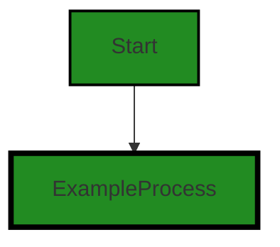

# Polyverse Boost-generated Source Analysis Details

## Source: ./src/test/suite/compliance_command.test.ts
Date Generated: Friday, September 8, 2023 at 9:37:21 PM PDT


---

### Boost Architectural Quick Summary Security Report

Last Updated: Friday, September 8, 2023 at 9:37:02 PM PDT


Executive Report:

1. **Architectural Impact**: The analysis of this file has not revealed any severe issues.
2. **Risk Analysis**: The analysis of this file has not revealed any severe issues.
3. **Potential Customer Impact**: Based on the analysis, there are no severe issues that could potentially impact customers.
4. **Performance Issues**: Our analysis did not identify any explicit performance issues in the file.
5. **Risk Assessment**: Based on the current analysis of this file, no severe issues have been found. However, this doesn't guarantee that the file is risk-free.

Highlights:

- No severe issues were identified in the current analysis of this file.


---

### Boost Architectural Quick Summary Performance Report

Last Updated: Friday, September 8, 2023 at 9:37:14 PM PDT


Executive Report:

1. **Architectural Impact**: The analysis of this file has not revealed any severe issues.
2. **Risk Analysis**: The analysis of this file has not revealed any severe issues.
3. **Potential Customer Impact**: Based on the analysis, there are no severe issues that could potentially impact customers.
4. **Performance Issues**: Our analysis did not identify any explicit performance issues in the file.
5. **Risk Assessment**: Based on the current analysis of this file, no severe issues have been found. However, this doesn't guarantee that the file is risk-free.

Highlights:

- No severe issues were identified in the current analysis of this file.


---

### Boost Architectural Quick Summary Compliance Report

Last Updated: Friday, September 8, 2023 at 9:37:24 PM PDT


Executive Report:

1. **Architectural Impact**: The analysis of this file has not revealed any severe issues.
2. **Risk Analysis**: The analysis of this file has not revealed any severe issues.
3. **Potential Customer Impact**: Based on the analysis, there are no severe issues that could potentially impact customers.
4. **Performance Issues**: Our analysis did not identify any explicit performance issues in the file.
5. **Risk Assessment**: Based on the current analysis of this file, no severe issues have been found. However, this doesn't guarantee that the file is risk-free.

Highlights:

- No severe issues were identified in the current analysis of this file.

---
## Detailed Analysis:

### Cell 0:
## Original Code:

### Programming Language: typescript
### ./src/test/suite/compliance_command.test.ts line 0

```typescript
suite('Compliance Code Command', function() {

    this.timeout(20000); // set test timeout to be 20 seconds
  
    test('Compliance Code Command Test', async function() {
  
      console.warn('Simulating Compliance Code Command Test');
    });
  });

```
## Boost Analysis:


---

### Boost Code Explanation

Last Updated: Wednesday, July 12, 2023 at 1:22:05 PM PDT

This code is written in JavaScript, using Mocha, a JavaScript test framework running on Node.js. Mocha tests run serially, allowing for flexible and accurate reporting, while mapping uncaught exceptions to the correct test cases.

Here's a breakdown of the code:

1. `suite('Compliance Code Command', function() {...}`: This is a test suite defined by Mocha. It's a way of grouping related tests together. In this case, the test suite is named 'Compliance Code Command'. 

2. `this.timeout(20000);`: This line of code sets the timeout for the tests in this suite to be 20 seconds (20000 milliseconds). If a test takes longer than this to run, Mocha will assume it has failed due to a timeout.

3. `test('Compliance Code Command Test', async function() {...});`: This is an individual test case, named 'Compliance Code Command Test'. The `async` keyword means that this function returns a Promise, which is a way of handling asynchronous operations in JavaScript. Mocha natively supports Promises, so if this function were to return a Promise, Mocha would wait for that Promise to resolve before ending the test.

4. `console.warn('Simulating Compliance Code Command Test');`: This line of code is the actual test. It's using `console.warn` to print a message to the console. In a real-world scenario, you would replace this with an actual test, such as an assertion.

In terms of architectural guidelines, this code is fairly standard for a Mocha test suite. There are no apparent conflicts with common architectural guidelines or principles.

For more information on Mocha, you can visit the official website: [https://mochajs.org/](https://mochajs.org/).


---

### Boost Flow Diagram

Last Updated: Friday, September 8, 2023 at 9:36:46 PM PDT




---

### Boost Source-Level Security Analysis

Last Updated: Friday, September 8, 2023 at 9:36:59 PM PDT

**No bugs found**


---

### Boost Source-Level Performance Analysis

Last Updated: Friday, September 8, 2023 at 9:37:10 PM PDT

**No bugs found**


---

### Boost Source-Level Data and Privacy Compliance Analysis

Last Updated: Friday, September 8, 2023 at 9:37:21 PM PDT

**No bugs found**

