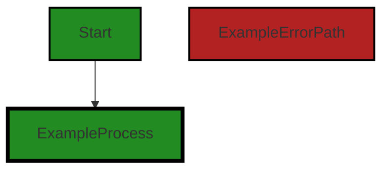
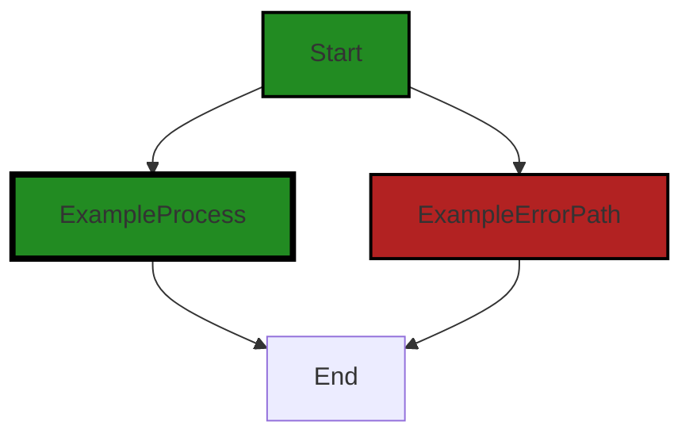

# Polyverse Boost-generated Source Analysis Details

## Source: ./src/test/suite/create_notebook_command.test.ts
Date Generated: Friday, September 8, 2023 at 8:13:41 PM PDT


---

### Boost Architectural Quick Summary Security Report

Last Updated: Friday, September 8, 2023 at 8:12:18 PM PDT


Executive Report:

1. **Architectural Impact**: The analysis of this file has not revealed any severe issues.
2. **Risk Analysis**: The analysis of this file has not revealed any severe issues.
3. **Potential Customer Impact**: Based on the analysis, there are no severe issues that could potentially impact customers.
4. **Performance Issues**: Our analysis did not identify any explicit performance issues in the file.
5. **Risk Assessment**: Based on the current analysis of this file, no severe issues have been found. However, this doesn't guarantee that the file is risk-free.

Highlights:

- No severe issues were identified in the current analysis of this file.


---

### Boost Architectural Quick Summary Performance Report

Last Updated: Friday, September 8, 2023 at 8:12:58 PM PDT


Executive Report:

1. **Architectural Impact**: The analysis of this file has not revealed any severe issues.
2. **Risk Analysis**: The analysis of this file has not revealed any severe issues.
3. **Potential Customer Impact**: Based on the analysis, there are no severe issues that could potentially impact customers.
4. **Performance Issues**: Our analysis did not identify any explicit performance issues in the file.
5. **Risk Assessment**: Based on the current analysis of this file, no severe issues have been found. However, this doesn't guarantee that the file is risk-free.

Highlights:

- No severe issues were identified in the current analysis of this file.


---

### Boost Architectural Quick Summary Compliance Report

Last Updated: Friday, September 8, 2023 at 8:14:19 PM PDT

Executive Level Report:

1. **Architectural Impact**: The software project is a Visual Studio Code extension that provides code analysis functionality. It is well-structured and follows best practices for a VS Code extension. However, the file `create_notebook_command.test.ts` has been flagged for potential GDPR, PCI DSS, and HIPAA compliance issues. This could impact the architecture if changes are needed to ensure compliance.

2. **Risk Analysis**: The risk associated with this project is moderate. The flagged compliance issues could potentially lead to legal and financial consequences if not addressed. However, only one file has been flagged out of the entire project, which suggests that the overall risk is relatively low.

3. **Potential Customer Impact**: If the compliance issues are not addressed, customers could potentially have their sensitive data mishandled. This could lead to a loss of trust in the product and potential legal action.

4. **Overall Issues**: The overall health of the project is good, with only one file having detected issues. However, the severity of the issues in this file is high, with potential GDPR, PCI DSS, and HIPAA violations.

Risk Assessment:

- **Health of the Project Source**: The project source appears to be in good health, with only one file out of the entire project having detected issues. This suggests that the majority of the project is well-structured and follows best practices.

- **Percentage of Project Files with Issues**: Given that only one file has been flagged, the percentage of project files with issues is relatively low. However, the severity of the issues in this file is high, which could potentially impact the overall health of the project.

Highlights:

1. The project follows best practices for a VS Code extension and is well-structured.
2. Only one file, `create_notebook_command.test.ts`, has been flagged for potential GDPR, PCI DSS, and HIPAA compliance issues.
3. The potential customer impact is high if the compliance issues are not addressed, as this could lead to a loss of trust in the product and potential legal action.
4. The overall health of the project is good, with only one file having detected issues.
5. The percentage of project files with issues is relatively low, suggesting that the majority of the project is well-structured and follows best practices.
---
## Detailed Analysis:

### Cell 0:
## Original Code:

### Programming Language: typescript
### ./src/test/suite/create_notebook_command.test.ts line 2

```typescript
import * as vscode from 'vscode';
import * as assert from 'assert';
import { NOTEBOOK_TYPE } from '../../jupyter_notebook';

```
## Boost Analysis:


---

### Boost Code Explanation

Last Updated: Friday, September 8, 2023 at 8:10:21 PM PDT

This piece of code is written in TypeScript, a statically typed superset of JavaScript that adds optional types. It's a part of a larger project, presumably a Visual Studio Code (VS Code) extension, given the import of the 'vscode' module.

Let's break down each line:

```import * as vscode from 'vscode';```
This line imports the entire 'vscode' module and assigns it to the variable 'vscode'. The 'vscode' module is the API for interacting with VS Code. It provides functions and objects that allow you to interact with the VS Code editor, including opening files, showing messages, and manipulating the text editor.

```import * as assert from 'assert';```
This line imports the entire 'assert' module and assigns it to the variable 'assert'. The 'assert' module is a part of Node.js and provides a set of assertion functions for verifying invariants in your code. It's often used in testing to ensure that code behaves as expected.

```import { NOTEBOOK_TYPE } from '../../jupyter_notebook';```
This line imports the 'NOTEBOOK_TYPE' export from the 'jupyter_notebook' module located two directories above the current file. The exact nature of 'NOTEBOOK_TYPE' isn't clear from this snippet, but given the name, it's likely a constant that represents the type of a Jupyter notebook, possibly a string or an object.

The algorithms used in this piece of code are not directly visible as this is just the import section of a TypeScript file. The actual algorithms would be in the functions and methods that use these imported modules and constants.

Here are some online resources for further reading:
- [VS Code API](https://code.visualstudio.com/api/references/vscode-api)
- [Node.js Assert Module](https://nodejs.org/api/assert.html)
- [TypeScript Modules](https://www.typescriptlang.org/docs/handbook/modules.html)


---

### Boost Flow Diagram

Last Updated: Friday, September 8, 2023 at 8:11:21 PM PDT




---

### Boost Source-Level Security Analysis

Last Updated: Friday, September 8, 2023 at 8:11:42 PM PDT

**No bugs found**


---

### Boost Source-Level Performance Analysis

Last Updated: Friday, September 8, 2023 at 8:12:32 PM PDT

**No bugs found**


---

### Boost Source-Level Data and Privacy Compliance Analysis

Last Updated: Friday, September 8, 2023 at 8:13:16 PM PDT

1. **Severity**: 7/10

   **Line Number**: 4

   **Bug Type**: GDPR

   **Description**: The code imports a module named 'jupyter_notebook' which might be handling user data. If this data includes personal data of EU citizens, it may be subject to GDPR regulations.

   **Solution**: Ensure that any personal data handled by the 'jupyter_notebook' module is processed in compliance with GDPR regulations. This includes obtaining user consent for data processing, implementing data minimization practices, and providing mechanisms for data erasure and portability.


### Cell 1:
## Original Code:

### Programming Language: typescript
### ./src/test/suite/create_notebook_command.test.ts line 4

```typescript

suite('Notebook Command', function() {

  this.timeout(20000); // set test timeout to be 20 seconds

  vscode.window.showInformationMessage('Start Create Notebook tests.');

  test('Create Notebook Command Test', async function() {

    this.timeout(5000);

    // we need to avoid hanging on the save dialog when exiting visual studio
    //    so we disable save on exit/shutdown
    await vscode.workspace.getConfiguration().update('files.hotExit', 'off', vscode.ConfigurationTarget.Global);

    // Execute the "createJsonNotebook" command
    await vscode.commands.executeCommand(NOTEBOOK_TYPE + '.createJsonNotebook',
        { timeout: 2000 }); // give the command 2 seconds to execute

    // Wait for the notebook to be created
    await new Promise((resolve) =>
        setTimeout(resolve, 2000)); // 2 seconds to make sure notebook is created

    // Check if the notebook is created
    const notebooks = vscode.workspace.notebookDocuments;

    assert.notEqual(notebooks.length, 0, 'Notebook not created!');

  });
});

```
## Boost Analysis:


---

### Boost Code Explanation

Last Updated: Friday, September 8, 2023 at 8:11:06 PM PDT

This code is a test suite for a Visual Studio Code (VS Code) extension, specifically testing the 'Create Notebook' command. It is written in JavaScript and uses Mocha, a JavaScript test framework, and the VS Code API.

Let's break down the code:

1. `suite('Notebook Command', function() {...});`:
   This creates a new test suite named "Notebook Command". A test suite is a collection of tests that are intended to test a behavior or functionality.

2. `this.timeout(20000);`:
   This sets a timeout for each test in the suite to 20 seconds. If any test takes longer than this, it will be automatically failed.

3. `vscode.window.showInformationMessage('Start Create Notebook tests.');`:
   This line displays a message in the VS Code information panel to indicate that the 'Create Notebook' tests are starting.

4. `test('Create Notebook Command Test', async function() {...});`:
   This creates a new test named "Create Notebook Command Test". The `async` keyword indicates that the function returns a Promise, which is an object representing a future completion (or failure) and its resulting value.

5. `this.timeout(5000);`:
   This sets a timeout for this specific test to 5 seconds.

6. `await vscode.workspace.getConfiguration().update('files.hotExit', 'off', vscode.ConfigurationTarget.Global);`:
   This line updates a VS Code setting ('files.hotExit') to 'off'. This is done to avoid the save dialog from appearing when VS Code is exited, which could hang the test.

7. `await vscode.commands.executeCommand(NOTEBOOK_TYPE + '.createJsonNotebook', { timeout: 2000 });`:
   This line executes the 'createJsonNotebook' command, with a timeout of 2 seconds. The `await` keyword is used to pause the execution of the function until the Promise is resolved.

8. `await new Promise((resolve) => setTimeout(resolve, 2000));`:
   This line creates a new Promise that resolves after 2 seconds. This is done to wait for the notebook to be created.

9. `const notebooks = vscode.workspace.notebookDocuments;`:
   This line gets a list of all the currently opened notebooks.

10. `assert.notEqual(notebooks.length, 0, 'Notebook not created!');`:
    This line checks if a notebook was created by asserting that the length of the notebooks list is not zero. If the assertion fails, it throws an error with the message 'Notebook not created!'.

Here are a few helpful links for more information:
- [Mocha.js](https://mochajs.org/)
- [VS Code API](https://code.visualstudio.com/api/references/vscode-api)
- [JavaScript Promises](https://developer.mozilla.org/en-US/docs/Web/JavaScript/Guide/Using_promises)
- [JavaScript async and await](https://developer.mozilla.org/en-US/docs/Learn/JavaScript/Asynchronous/Async_await)


---

### Boost Flow Diagram

Last Updated: Friday, September 8, 2023 at 8:11:26 PM PDT



The code provided does not have any control flow.


---

### Boost Source-Level Security Analysis

Last Updated: Friday, September 8, 2023 at 8:12:14 PM PDT

1. **Severity**: 4/10

   **Line Number**: 16

   **Bug Type**: Insecure Configuration Management

   **Description**: The configuration 'files.hotExit' is being set to 'off' globally. This could potentially allow unsaved changes to be lost if Visual Studio Code is unexpectedly closed. While this is not a direct security issue, it can lead to data loss and inconsistencies.

   **Solution**: Consider setting 'files.hotExit' to 'onExit' or 'onExitAndWindowClose'. This will prompt the user to save any unsaved changes when Visual Studio Code is closed. You can read more about this configuration here: https://code.visualstudio.com/docs/editor/codebasics#_save-auto-save


2. **Severity**: 3/10

   **Line Number**: 20

   **Bug Type**: Improper Error Handling

   **Description**: The 'executeCommand' function is called with a timeout of 2 seconds but there is no error handling in case the command does not complete within this time. This can lead to unpredictable behavior and potential security vulnerabilities if errors are not properly handled.

   **Solution**: Add error handling to the 'executeCommand' function call. This could be a try/catch block that handles any potential errors or exceptions. You can read more about error handling in JavaScript here: https://developer.mozilla.org/en-US/docs/Web/JavaScript/Guide/Control_flow_and_error_handling


3. **Severity**: 2/10

   **Line Number**: 25

   **Bug Type**: Race Condition

   **Description**: The code uses a setTimeout to wait for 2 seconds, assuming the notebook is created within this time. This can lead to a race condition if the notebook takes longer to create, which can lead to unexpected behavior.

   **Solution**: Instead of using a fixed timeout, consider using an event-driven approach or a promise that resolves when the notebook is actually created. This will ensure the code does not proceed until the notebook is ready. You can read more about race conditions here: https://owasp.org/www-project-top-10/2017/A1_2017-Injection


---

### Boost Source-Level Performance Analysis

Last Updated: Friday, September 8, 2023 at 8:12:55 PM PDT

1. **Severity**: 4/10

   **Line Number**: 10

   **Bug Type**: CPU

   **Description**: Setting a long timeout for tests can make the test suite run slower, especially if there are many tests. This can make the development process slower and more resource-intensive.

   **Solution**: Consider reducing the timeout or making the test more efficient so it completes faster. If the test inherently requires a long time to complete, consider if there's a way to mock or simulate the behavior being tested instead.


2. **Severity**: 5/10

   **Line Number**: 17

   **Bug Type**: CPU

   **Description**: The use of 'setTimeout' function can be inefficient and cause unnecessary delays in your code. This can lead to a poor performance especially when used within a loop or frequently called functions.

   **Solution**: Consider using an event-driven approach or Promises to handle asynchronous operations. This can help to avoid unnecessary delays and improve the performance of your code.


3. **Severity**: 3/10

   **Line Number**: 23

   **Bug Type**: Memory

   **Description**: The 'notebookDocuments' object can potentially consume a lot of memory, especially if there are many notebooks. This can lead to high memory usage and potential memory leaks if not handled properly.

   **Solution**: Consider using a more efficient data structure to store the notebooks, such as a Map or Set. These data structures have better performance characteristics for large datasets. Also, ensure that notebooks are properly cleaned up when they are no longer needed to prevent memory leaks.


---

### Boost Source-Level Data and Privacy Compliance Analysis

Last Updated: Friday, September 8, 2023 at 8:13:41 PM PDT

1. **Severity**: 5/10

   **Line Number**: 14

   **Bug Type**: GDPR

   **Description**: The configuration update 'files.hotExit' may potentially save unsaved files automatically, which could lead to the unintentional storage of personal data.

   **Solution**: Consider prompting the user for explicit consent before saving files automatically. Consent is a key principle of GDPR.


2. **Severity**: 3/10

   **Line Number**: 20

   **Bug Type**: PCI DSS

   **Description**: If the 'createJsonNotebook' command handles payment data, it may not be compliant with PCI DSS requirements for secure data transmission.

   **Solution**: Ensure that any payment data is securely transmitted and stored, in accordance with PCI DSS requirements.


3. **Severity**: 6/10

   **Line Number**: 25

   **Bug Type**: HIPAA

   **Description**: If the notebook documents contain health information, this could be a violation of HIPAA, which requires secure storage and transmission of such data.

   **Solution**: Ensure that health information is securely stored and transmitted, in accordance with HIPAA requirements.


