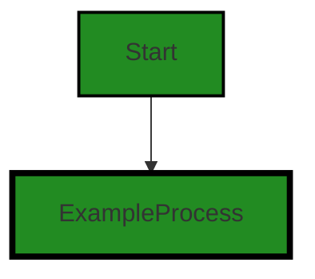

# Polyverse Boost-generated Source Analysis Details

## Source: ./src/test/suite/explain_command.test.ts
Date Generated: Friday, September 8, 2023 at 9:08:23 PM PDT


---

### Boost Architectural Quick Summary Security Report

Last Updated: Friday, September 8, 2023 at 9:08:06 PM PDT


Executive Report:

1. **Architectural Impact**: The analysis of this file has not revealed any severe issues.
2. **Risk Analysis**: The analysis of this file has not revealed any severe issues.
3. **Potential Customer Impact**: Based on the analysis, there are no severe issues that could potentially impact customers.
4. **Performance Issues**: Our analysis did not identify any explicit performance issues in the file.
5. **Risk Assessment**: Based on the current analysis of this file, no severe issues have been found. However, this doesn't guarantee that the file is risk-free.

Highlights:

- No severe issues were identified in the current analysis of this file.


---

### Boost Architectural Quick Summary Performance Report

Last Updated: Friday, September 8, 2023 at 9:08:16 PM PDT


Executive Report:

1. **Architectural Impact**: The analysis of this file has not revealed any severe issues.
2. **Risk Analysis**: The analysis of this file has not revealed any severe issues.
3. **Potential Customer Impact**: Based on the analysis, there are no severe issues that could potentially impact customers.
4. **Performance Issues**: Our analysis did not identify any explicit performance issues in the file.
5. **Risk Assessment**: Based on the current analysis of this file, no severe issues have been found. However, this doesn't guarantee that the file is risk-free.

Highlights:

- No severe issues were identified in the current analysis of this file.


---

### Boost Architectural Quick Summary Compliance Report

Last Updated: Friday, September 8, 2023 at 9:08:27 PM PDT


Executive Report:

1. **Architectural Impact**: The analysis of this file has not revealed any severe issues.
2. **Risk Analysis**: The analysis of this file has not revealed any severe issues.
3. **Potential Customer Impact**: Based on the analysis, there are no severe issues that could potentially impact customers.
4. **Performance Issues**: Our analysis did not identify any explicit performance issues in the file.
5. **Risk Assessment**: Based on the current analysis of this file, no severe issues have been found. However, this doesn't guarantee that the file is risk-free.

Highlights:

- No severe issues were identified in the current analysis of this file.

---
## Detailed Analysis:

### Cell 0:
## Original Code:

### Programming Language: typescript
### ./src/test/suite/explain_command.test.ts line 0

```typescript
suite('Explain Code Command', function() {

    this.timeout(20000); // set test timeout to be 20 seconds
  
    test('Explain Code Command Test', async function() {
  
      console.warn('Simulating Explain Code Command Test');
    });
  });

```
## Boost Analysis:


---

### Boost Code Explanation

Last Updated: Wednesday, July 12, 2023 at 1:21:39 PM PDT

The code snippet you have provided is a simple test suite written in JavaScript, specifically using the Mocha.js testing framework. Mocha is a feature-rich JavaScript test framework running on Node.js and in the browser, making asynchronous testing simple and fun.

Here is a breakdown of the code:

```javascript
suite('Explain Code Command', function() {
```
This line of code declares a test suite. `suite` is a Mocha function used to group related tests together. The string 'Explain Code Command' is a descriptive label for the suite.

```javascript
    this.timeout(20000); // set test timeout to be 20 seconds
```
This line of code sets the timeout for the tests in this suite to be 20 seconds. If a test takes longer than this, Mocha will automatically fail it.

```javascript
    test('Explain Code Command Test', async function() {
```
This line of code declares a test. `test` is another Mocha function and 'Explain Code Command Test' is a descriptive label for this test. The `async` keyword is used because the test function will return a Promise. If the Promise is rejected, the test will automatically fail.

```javascript
      console.warn('Simulating Explain Code Command Test');
```
This line of code outputs a warning message to the console. In this case, the message is 'Simulating Explain Code Command Test'. This could be used for debugging or informational purposes.

```javascript
    });
  });
```
These lines of code close the test and the suite.

There are no complex algorithms used in this code snippet. It's simply a basic usage of Mocha's suite and test functions.

For more information on Mocha.js, you can visit their official website: [Mocha - the fun, simple, flexible JavaScript test framework](https://mochajs.org/)


---

### Boost Flow Diagram

Last Updated: Friday, September 8, 2023 at 9:07:56 PM PDT




---

### Boost Source-Level Security Analysis

Last Updated: Friday, September 8, 2023 at 9:08:03 PM PDT

**No bugs found**


---

### Boost Source-Level Performance Analysis

Last Updated: Friday, September 8, 2023 at 9:08:13 PM PDT

**No bugs found**


---

### Boost Source-Level Data and Privacy Compliance Analysis

Last Updated: Friday, September 8, 2023 at 9:08:23 PM PDT

**No bugs found**

