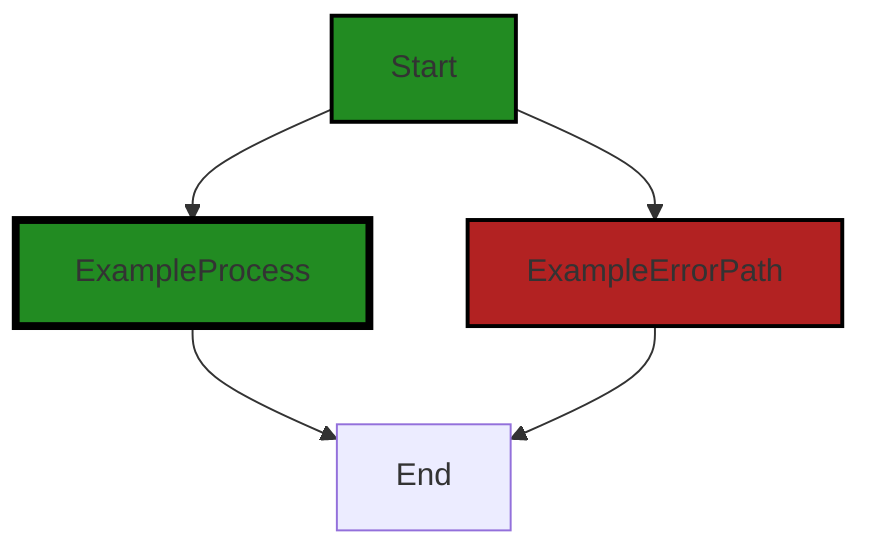

# Polyverse Boost-generated Source Analysis Details

## Source: ./src/test/suite/extension.test.ts
Date Generated: Friday, September 8, 2023 at 10:15:32 PM PDT


---

### Boost Architectural Quick Summary Security Report

Last Updated: Friday, September 8, 2023 at 10:15:14 PM PDT


Executive Report:

1. **Architectural Impact**: The analysis of this file has not revealed any severe issues.
2. **Risk Analysis**: The analysis of this file has not revealed any severe issues.
3. **Potential Customer Impact**: Based on the analysis, there are no severe issues that could potentially impact customers.
4. **Performance Issues**: Our analysis did not identify any explicit performance issues in the file.
5. **Risk Assessment**: Based on the current analysis of this file, no severe issues have been found. However, this doesn't guarantee that the file is risk-free.

Highlights:

- No severe issues were identified in the current analysis of this file.


---

### Boost Architectural Quick Summary Performance Report

Last Updated: Friday, September 8, 2023 at 10:15:25 PM PDT


Executive Report:

1. **Architectural Impact**: The analysis of this file has not revealed any severe issues.
2. **Risk Analysis**: The analysis of this file has not revealed any severe issues.
3. **Potential Customer Impact**: Based on the analysis, there are no severe issues that could potentially impact customers.
4. **Performance Issues**: Our analysis did not identify any explicit performance issues in the file.
5. **Risk Assessment**: Based on the current analysis of this file, no severe issues have been found. However, this doesn't guarantee that the file is risk-free.

Highlights:

- No severe issues were identified in the current analysis of this file.


---

### Boost Architectural Quick Summary Compliance Report

Last Updated: Friday, September 8, 2023 at 10:15:35 PM PDT


Executive Report:

1. **Architectural Impact**: The analysis of this file has not revealed any severe issues.
2. **Risk Analysis**: The analysis of this file has not revealed any severe issues.
3. **Potential Customer Impact**: Based on the analysis, there are no severe issues that could potentially impact customers.
4. **Performance Issues**: Our analysis did not identify any explicit performance issues in the file.
5. **Risk Assessment**: Based on the current analysis of this file, no severe issues have been found. However, this doesn't guarantee that the file is risk-free.

Highlights:

- No severe issues were identified in the current analysis of this file.

---
## Detailed Analysis:

### Cell 0:
## Original Code:

### Programming Language: typescript
### ./src/test/suite/extension.test.ts line 7

```typescript
import * as assert from 'assert';

// You can import and use all API from the 'vscode' module
// as well as import your extension to test it
import * as vscode from 'vscode';
// import * as myExtension from '../../extension';

suite('Extension Test Suite', () => {
 vscode.window.showInformationMessage('Start all tests.');

 test('Test Enironment Sanity Test test', () => {

  // we're doing a simple assert just to make sure 
  // the test environment is working
  assert.strictEqual(0,0);
 });
});

```
## Boost Analysis:


---

### Boost Code Explanation

Last Updated: Wednesday, July 12, 2023 at 1:43:07 PM PDT

This is a simple test suite written for Visual Studio Code (VSCode) extensions using Mocha testing framework and the assert module from Node.js. The purpose of this code is to test the functionality of a VSCode extension. 

Let's break down the code:

1. `import * as assert from 'assert';`: This line imports the 'assert' module from Node.js, which provides a set of assertion functions for verifying invariants. In other words, it's used for writing tests.

2. `import * as vscode from 'vscode';`: This line imports the 'vscode' module, which provides the VSCode API that enables the interaction with the VSCode editor.

3. `suite('Extension Test Suite', () => {...});`: This line declares a test suite using Mocha's `suite` function. A test suite is a collection of tests that are intended to be used together. In this case, the test suite is named 'Extension Test Suite'.

4. `vscode.window.showInformationMessage('Start all tests.');`: This line shows an information message in the VSCode editor's window that says 'Start all tests.' This is to inform the user that the test suite is starting.

5. `test('Test Enironment Sanity Test test', () => {...});`: This line declares a test using Mocha's `test` function. The test is named 'Test Environment Sanity Test test'. 

6. `assert.strictEqual(0,0);`: This is the test itself. It uses the `strictEqual` function from the 'assert' module to check that the two arguments (0 and 0) are strictly equal. If they are not, the test will fail. This is a simple sanity check to ensure the testing environment is working correctly.

This code doesn't use any special algorithms, it's just a simple sanity test that checks if the testing environment is properly set up.

For more information about VSCode Extension testing, you can visit the official VSCode Extension Testing documentation [here](https://code.visualstudio.com/api/working-with-extensions/testing-extension).

For more information about the 'assert' module, you can visit the Node.js 'assert' documentation [here](https://nodejs.org/api/assert.html).

For more information about Mocha, you can visit the Mocha documentation [here](https://mochajs.org/).


---

### Boost Flow Diagram

Last Updated: Friday, September 8, 2023 at 10:14:57 PM PDT



The code provided does not have any control flow.


---

### Boost Source-Level Security Analysis

Last Updated: Friday, September 8, 2023 at 10:15:10 PM PDT

**No bugs found**


---

### Boost Source-Level Performance Analysis

Last Updated: Friday, September 8, 2023 at 10:15:21 PM PDT

**No bugs found**


---

### Boost Source-Level Data and Privacy Compliance Analysis

Last Updated: Friday, September 8, 2023 at 10:15:32 PM PDT

**No bugs found**

