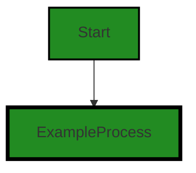

# Polyverse Boost-generated Source Analysis Details

## Source: ./src/test/suite/guidelines_command.test.ts
Date Generated: Friday, September 8, 2023 at 7:45:37 PM PDT


---

### Boost Architectural Quick Summary Security Report

Last Updated: Friday, September 8, 2023 at 7:45:19 PM PDT


Executive Report:

1. **Architectural Impact**: The analysis of this file has not revealed any severe issues.
2. **Risk Analysis**: The analysis of this file has not revealed any severe issues.
3. **Potential Customer Impact**: Based on the analysis, there are no severe issues that could potentially impact customers.
4. **Performance Issues**: Our analysis did not identify any explicit performance issues in the file.
5. **Risk Assessment**: Based on the current analysis of this file, no severe issues have been found. However, this doesn't guarantee that the file is risk-free.

Highlights:

- No severe issues were identified in the current analysis of this file.


---

### Boost Architectural Quick Summary Performance Report

Last Updated: Friday, September 8, 2023 at 7:45:30 PM PDT


Executive Report:

1. **Architectural Impact**: The analysis of this file has not revealed any severe issues.
2. **Risk Analysis**: The analysis of this file has not revealed any severe issues.
3. **Potential Customer Impact**: Based on the analysis, there are no severe issues that could potentially impact customers.
4. **Performance Issues**: Our analysis did not identify any explicit performance issues in the file.
5. **Risk Assessment**: Based on the current analysis of this file, no severe issues have been found. However, this doesn't guarantee that the file is risk-free.

Highlights:

- No severe issues were identified in the current analysis of this file.


---

### Boost Architectural Quick Summary Compliance Report

Last Updated: Friday, September 8, 2023 at 7:45:41 PM PDT


Executive Report:

1. **Architectural Impact**: The analysis of this file has not revealed any severe issues.
2. **Risk Analysis**: The analysis of this file has not revealed any severe issues.
3. **Potential Customer Impact**: Based on the analysis, there are no severe issues that could potentially impact customers.
4. **Performance Issues**: Our analysis did not identify any explicit performance issues in the file.
5. **Risk Assessment**: Based on the current analysis of this file, no severe issues have been found. However, this doesn't guarantee that the file is risk-free.

Highlights:

- No severe issues were identified in the current analysis of this file.

---
## Detailed Analysis:

### Cell 0:
## Original Code:

### Programming Language: typescript
### ./src/test/suite/guidelines_command.test.ts line 0

```typescript
suite('Guidelines Code Command', function() {

    this.timeout(20000); // set test timeout to be 20 seconds
  
    test('Guidelines Code Command Test', async function() {
  
      console.warn('Simulating Guidelines Code Command Test');
    });
  });

```
## Boost Analysis:


---

### Boost Code Explanation

Last Updated: Wednesday, July 12, 2023 at 1:21:09 PM PDT

This code is written in JavaScript using Mocha, a popular JavaScript test framework running on Node.js. The code is defining a test suite and a single test within that suite.

Here's a breakdown of the code:

1. `suite('Guidelines Code Command', function() {...});`: This is the declaration of a test suite. A test suite is a collection of tests that are intended to be run together. The name of this test suite is 'Guidelines Code Command'.

2. `this.timeout(20000);`: This line of code sets the maximum time that each test in this suite is allowed to run before it is considered failed due to timeout. The time is specified in milliseconds, so `20000` milliseconds is equivalent to 20 seconds.

3. `test('Guidelines Code Command Test', async function() {...});`: This is the declaration of a test. The test is named 'Guidelines Code Command Test'. The `async` keyword is used because the test function may contain asynchronous operations, such as promises or callbacks.

4. `console.warn('Simulating Guidelines Code Command Test');`: This line of code outputs a warning message to the console. In this case, the message is 'Simulating Guidelines Code Command Test'. This could be used as a placeholder for the actual test code, indicating that the test is currently being simulated or mocked rather than actually run.

Regarding the architectural guidelines, as there are no specific guidelines or constraints provided, the code appears to be consistent with general good practices for writing tests in JavaScript. It's simple, clear, and well-structured. However, the actual test ('Guidelines Code Command Test') currently doesn't perform any real testing, it just logs a warning message to the console.

For more information on Mocha and writing tests in JavaScript, you can check out the official Mocha documentation: https://mochajs.org/


---

### Boost Flow Diagram

Last Updated: Friday, September 8, 2023 at 7:45:08 PM PDT




---

### Boost Source-Level Security Analysis

Last Updated: Friday, September 8, 2023 at 7:45:16 PM PDT

**No bugs found**


---

### Boost Source-Level Performance Analysis

Last Updated: Friday, September 8, 2023 at 7:45:27 PM PDT

**No bugs found**


---

### Boost Source-Level Data and Privacy Compliance Analysis

Last Updated: Friday, September 8, 2023 at 7:45:37 PM PDT

**No bugs found**

