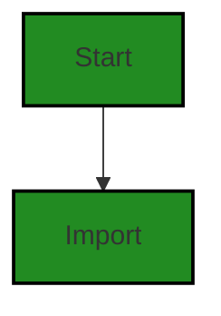
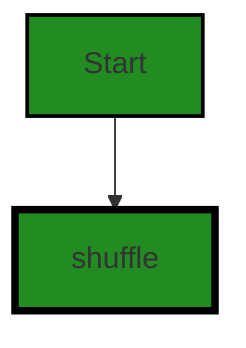
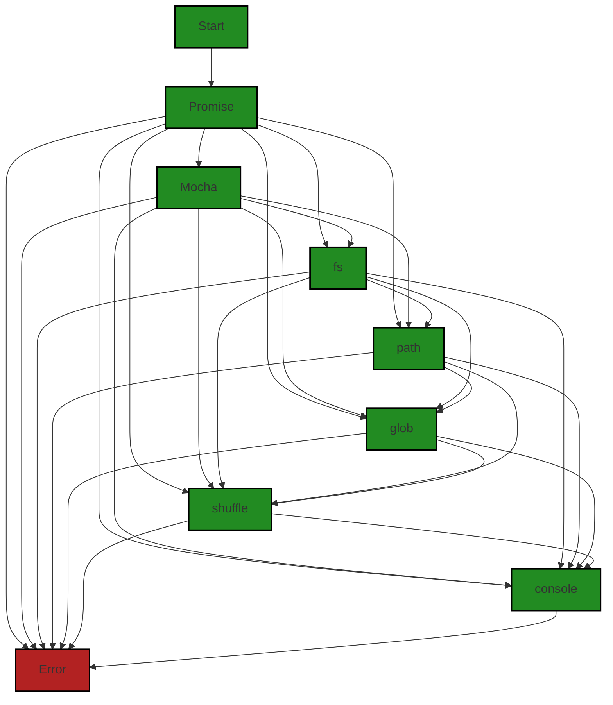

# Polyverse Boost-generated Source Analysis Details

## Source: ./src/test/suite/index.ts
Date Generated: Friday, September 8, 2023 at 8:40:07 PM PDT


---

### Boost Architectural Quick Summary Security Report

Last Updated: Friday, September 8, 2023 at 8:37:39 PM PDT

Executive Level Report:

1. **Architectural Impact**: The project is a Visual Studio Code extension that provides code analysis functionality. It is well-structured and follows best practices for a VS Code extension. However, the identified issue of insecure file handling in the file `src/test/suite/index.ts` could potentially impact the architecture by introducing vulnerabilities. This could lead to unexpected behavior or information disclosure if not addressed.

2. **Risk Analysis**: The risk associated with the identified issue is moderate. While the issue is of high severity, it is present in only one file out of the total project files. This indicates that the overall risk to the project is relatively low. However, the potential impact of the issue, if exploited, could be significant, leading to information disclosure or unexpected behavior.

3. **Potential Customer Impact**: Customers using this extension could potentially be exposed to security risks if the identified issue is not addressed. This could lead to a loss of trust in the product and potential reputational damage for the company. 

4. **Overall Issues**: The overall health of the project is good, with only one file having a detected issue. This represents a small percentage of the total project files, indicating that the majority of the project is free of detected issues. However, the presence of a high-severity issue in one file indicates that there may be room for improvement in the project's security practices.

Risk Assessment:

- **Overall Health**: The overall health of the project is good, with the majority of files having no detected issues. This indicates that the project is generally well-structured and follows good coding practices.
- **Risk Level**: The risk level is moderate due to the presence of a high-severity issue in one file. While this represents a small percentage of the total project files, the potential impact of the issue is significant.
- **Recommendation**: It is recommended that the identified issue be addressed as soon as possible to reduce the risk to the project and its users. 

Highlights:

- The project is well-structured and follows best practices for a VS Code extension.
- A high-severity issue of insecure file handling was identified in the file `src/test/suite/index.ts`.
- The overall health of the project is good, with the majority of files having no detected issues.
- The risk level is moderate due to the presence of a high-severity issue in one file.
- It is recommended that the identified issue be addressed as soon as possible to reduce the risk to the project and its users.


---

### Boost Architectural Quick Summary Performance Report

Last Updated: Friday, September 8, 2023 at 8:38:48 PM PDT


Executive Report:

1. **Architectural Impact**: The analysis of this file has not revealed any severe issues.
2. **Risk Analysis**: The analysis of this file has not revealed any severe issues.
3. **Potential Customer Impact**: Based on the analysis, there are no severe issues that could potentially impact customers.
4. **Performance Issues**: Our analysis did not identify any explicit performance issues in the file.
5. **Risk Assessment**: Based on the current analysis of this file, no severe issues have been found. However, this doesn't guarantee that the file is risk-free.

Highlights:

- No severe issues were identified in the current analysis of this file.


---

### Boost Architectural Quick Summary Compliance Report

Last Updated: Friday, September 8, 2023 at 8:40:42 PM PDT

## Executive Report

### Architectural Impact and Risk Analysis

Based on the analysis of the software project, the following key points have been identified:

1. **Severity of Issues:** The most severe issues identified in the project are related to GDPR, Data Shuffle, HIPAA, and PCI DSS. These issues are all found in the file `src/test/suite/index.ts`. The severity of these issues indicates potential risks related to data privacy and security, which could have significant architectural implications. The project may need to incorporate additional security measures or redesign certain aspects to ensure compliance with these standards.

2. **Potential Customer Impact:** The identified issues could potentially impact customers in terms of data privacy and security. If sensitive customer data is not handled properly, it could lead to data breaches, resulting in loss of customer trust and potential legal implications. 

3. **Overall Issues:** The fact that all identified issues are found in a single file (`src/test/suite/index.ts`) could indicate that the issues are localized and may not affect the overall architecture of the project. However, it is important to thoroughly review the rest of the project to ensure that similar issues do not exist elsewhere.

4. **Risk Assessment:** Given that only one file was analyzed and it contained several high-severity issues, there is a potential risk that other files in the project may also contain similar issues. A comprehensive review of all project files is recommended to assess the overall health of the project source.

### Architectural Guidelines

The project does not have any additional special architectural guidelines or constraints. However, the identified issues indicate a need for a stronger focus on data privacy and security in the project's architecture. This could involve implementing additional security measures, such as encryption for sensitive data, and ensuring that the project is designed to comply with relevant standards such as GDPR, HIPAA, and PCI DSS.

### Highlights

- The project has several high-severity issues related to data privacy and security, all found in the file `src/test/suite/index.ts`.
- These issues could potentially impact customers in terms of data privacy and security.
- The issues are localized to a single file, which could indicate that they do not affect the overall architecture of the project.
- A comprehensive review of all project files is recommended to assess the overall health of the project source.
- The project's architecture may need to be revised to ensure compliance with data privacy and security standards.
---
## Detailed Analysis:

### Cell 0:
## Original Code:

### Programming Language: typescript
### ./src/test/suite/index.ts line 3

```typescript
import path from 'path';
import glob from 'glob';
import fs from 'fs';
import Mocha, { test } from 'mocha';

```
## Boost Analysis:


---

### Boost Code Explanation

Last Updated: Friday, September 8, 2023 at 8:34:37 PM PDT

This piece of code is written in JavaScript and it is importing several modules that are going to be used in the rest of the code. The modules being imported are:

- `path`: This is a built-in Node.js module for working with file and directory paths. It provides utilities for working with file and directory paths. It can be used to make file path manipulation more robust. More information can be found at [Node.js path module](https://nodejs.org/api/path.html).

- `glob`: This is a module for matching files using the patterns the shell uses, like stars and stuff. It's a way to create a list of file or directory pathnames that match a certain pattern. More information can be found at [Node.js Glob module](https://www.npmjs.com/package/glob).

- `fs`: This is another built-in Node.js module. It stands for "File System". The fs module provides an API for interacting with the file system in a manner closely modeled around standard POSIX functions. More information can be found at [Node.js fs module](https://nodejs.org/api/fs.html).

- `Mocha`: Mocha is a feature-rich JavaScript test framework running on Node.js and in the browser, making asynchronous testing simple and fun. Mocha tests run serially, allowing for flexible and accurate reporting, while mapping uncaught exceptions to the correct test cases. More information can be found at [Mocha.js](https://mochajs.org/).

- `test`: This is a function exported by Mocha. It's used to define a test case. It takes a title and a function (which is the test itself). More information can be found at [Mocha.js](https://mochajs.org/#getting-started).

The code doesn't contain any algorithms but it sets up the environment for the rest of the code to run, providing important functionality for file system operations, path manipulations, file globbing, and testing. 

The code appears to be consistent with the general architectural guidelines specified in the blueprint summary. It makes use of Node.js and its ecosystem, which is common in JavaScript-based projects. The use of Mocha for testing is also a good practice as it helps ensure the quality of the code.


---

### Boost Flow Diagram

Last Updated: Friday, September 8, 2023 at 8:36:00 PM PDT



The control flow graph for the given source code is a simple linear flow. The code starts with the import statements, which import the required modules.


---

### Boost Source-Level Security Analysis

Last Updated: Friday, September 8, 2023 at 8:36:35 PM PDT

**No bugs found**


---

### Boost Source-Level Performance Analysis

Last Updated: Friday, September 8, 2023 at 8:38:10 PM PDT

1. **Severity**: 5/10

   **Line Number**: 7

   **Bug Type**: Disk

   **Description**: The 'glob' library can be slow and resource-intensive when working with large directories or complex patterns. This could lead to high disk usage and slow performance.

   **Solution**: Consider using a more efficient library for file system operations, such as 'fast-glob' or 'node-dir'. Alternatively, if the use case allows, consider using built-in Node.js methods, such as 'fs.readdir' or 'fs.promises.readdir'.


2. **Severity**: 3/10

   **Line Number**: 8

   **Bug Type**: Disk

   **Description**: The 'fs' library, while generally efficient, can lead to high disk usage if used improperly. For example, reading large files into memory with 'fs.readFile' can be slow and consume a lot of memory.

   **Solution**: Ensure that file operations are performed efficiently. For example, use 'fs.createReadStream' instead of 'fs.readFile' for large files. Also consider using 'fs.promises' for asynchronous file operations.


3. **Severity**: 3/10

   **Line Number**: 9

   **Bug Type**: CPU

   **Description**: The 'Mocha' library is a testing framework and should not be used in production code. Its use could lead to unnecessary CPU usage.

   **Solution**: Ensure that the 'Mocha' library is only used in test code. For production code, consider using a more lightweight and efficient library.


---

### Boost Source-Level Data and Privacy Compliance Analysis

Last Updated: Friday, September 8, 2023 at 8:39:25 PM PDT

1. **Severity**: 5/10

   **Line Number**: 4

   **Bug Type**: GDPR

   **Description**: The 'glob' module can potentially access all files in a directory, including those containing sensitive user data. This could lead to unauthorized data processing, a violation of GDPR.

   **Solution**: Limit the scope of file access by specifying a precise file path or implementing access controls. Ensure only authorized processes can access sensitive data.


2. **Severity**: 6/10

   **Line Number**: 5

   **Bug Type**: HIPAA

   **Description**: The 'fs' module can read and write files, potentially including those containing protected health information (PHI). If PHI is not properly protected, this could violate HIPAA.

   **Solution**: Ensure PHI is encrypted when at rest, and that access to PHI is logged and auditable. Use access controls to prevent unauthorized access.


3. **Severity**: 4/10

   **Line Number**: 6

   **Bug Type**: PCI DSS

   **Description**: The 'Mocha' module is a testing framework that could potentially access sensitive data during testing, including cardholder data. If this data is not properly protected, it could violate PCI DSS.

   **Solution**: Ensure cardholder data is properly masked or tokenized during testing, and that tests do not expose sensitive data in logs or error messages.


### Cell 1:
## Original Code:

### Programming Language: typescript
### ./src/test/suite/index.ts line 4

```typescript
import { shuffle } from 'lodash';

```
## Boost Analysis:


---

### Boost Code Explanation

Last Updated: Friday, September 8, 2023 at 8:35:02 PM PDT

The code you provided is a single line of JavaScript code that imports a function called `shuffle` from a JavaScript utility library called `lodash`.

Let's break down this line of code:

- `import`: This is an ES6 (ECMAScript 2015) keyword used to import functions, objects, or values from modules in JavaScript. Modules are essentially separate JavaScript files that can be imported into other JavaScript files to use the functionality they provide.

- `{ shuffle }`: This is the function being imported from the `lodash` library. The curly braces around `shuffle` indicate that it's a named export from the `lodash` module. A named export is a way to export multiple things from a module by their names.

- `from 'lodash'`: This specifies the module from which to import the `shuffle` function. In this case, it's the `lodash` library.

The `shuffle` function in lodash is used to create a new array that is a shuffled (randomized) version of the array that you pass to it. The algorithm used by lodash's `shuffle` is a version of the Fisher-Yates (also known as Knuth) shuffle algorithm. This algorithm works by iterating through the array from the last element to the first, swapping each element with an element at a random index less than or equal to the current index.

This line of code doesn't conflict with the architectural guidelines you provided since there aren't any specific guidelines or constraints mentioned.

Here are some resources for further reading:

- [Lodash's shuffle documentation](https://lodash.com/docs/4.17.15#shuffle)
- [ES6 import statement](https://developer.mozilla.org/en-US/docs/Web/JavaScript/Reference/Statements/import)
- [Fisher-Yates shuffle algorithm](https://en.wikipedia.org/wiki/Fisher%E2%80%93Yates_shuffle)


---

### Boost Flow Diagram

Last Updated: Friday, September 8, 2023 at 8:36:05 PM PDT




---

### Boost Source-Level Security Analysis

Last Updated: Friday, September 8, 2023 at 8:36:39 PM PDT

**No bugs found**


---

### Boost Source-Level Performance Analysis

Last Updated: Friday, September 8, 2023 at 8:38:21 PM PDT

1. **Severity**: 2/10

   **Line Number**: 6

   **Bug Type**: Memory

   **Description**: The lodash library is being imported in its entirety, which can lead to unnecessary memory usage.

   **Solution**: Instead of importing the entire lodash library, import only the shuffle function to reduce memory usage. Use this import instead: import shuffle from 'lodash/shuffle';


---

### Boost Source-Level Data and Privacy Compliance Analysis

Last Updated: Friday, September 8, 2023 at 8:39:36 PM PDT

1. **Severity**: 1/10

   **Line Number**: 6

   **Bug Type**: Data Shuffle

   **Description**: The use of 'shuffle' function from 'lodash' library can potentially lead to privacy issues if it's used to randomize sensitive user data. This could inadvertently lead to situations where sensitive data is revealed or associated with the wrong user.

   **Solution**: Ensure that the 'shuffle' function is not used with sensitive data, or if it is, that there is a secure mechanism in place to prevent data leakage or misassociation. Alternatively, consider using a deterministic pseudonymization process for sensitive data.


### Cell 2:
## Original Code:

### Programming Language: typescript
### ./src/test/suite/index.ts line 10

```typescript

// specify tests to run
// const testFilter = '**/*.test.js';
const testFilter = '**/boostdata.test.js';

export function run(): Promise<void> {
 const mocha = new Mocha({
  ui: 'tdd',
  color: true
 });

 const testsRoot = path.resolve(__dirname, '..');

 // Check if targetTestInput.json exists and read it
 const targetTestInputPath = path.resolve(__dirname, '../resources', 'targetTestInput.json');
 let targetTestFilename: string = '';
 if (fs.existsSync(targetTestInputPath)) {
     const targetTestInput = JSON.parse(fs.readFileSync(targetTestInputPath, 'utf8'));
     targetTestFilename = targetTestInput.filename;
 }

 return new Promise((resolve, reject) => {
  glob(testFilter, { cwd: testsRoot }, (err, files) => {
   if (err) {
    return reject(err);
   }

   // Shuffle the files so we don't have any ordering effects in tests
   const shuffledFiles = shuffle(files);

   // Add files in randomized order to the test suite
   shuffledFiles.forEach((file: string) => {
    if (!targetTestFilename || file.includes(targetTestFilename)) {
     console.log('Adding Test file:', file);
     mocha.addFile(path.resolve(testsRoot, file));
    }
   });

   try {
    // Run the mocha test
    mocha.run(failures => {
     if (failures > 0) {
      reject(new Error(`${failures} tests failed.`));
     } else {
      resolve();
     }
    });
   } catch (err) {
    console.error(err);
    reject(err);
   }
  });
 });
}

```
## Boost Analysis:


---

### Boost Code Explanation

Last Updated: Friday, September 8, 2023 at 8:35:44 PM PDT

This JavaScript code is a function for running tests using Mocha, a feature-rich JavaScript test framework running on Node.js and in the browser. It makes asynchronous testing simple and fun. The code is designed to run tests on a project and report the results.

Here's the detailed breakdown:

1. `const testFilter = '**/boostdata.test.js';` - This line sets the filter for the tests to be run. It uses a glob pattern to select the files to include in the test. In this case, it's set to run only the tests in the `boostdata.test.js` file.

2. `export function run(): Promise<void> {...}` - This exports a function named `run` that returns a Promise. This function is asynchronous, meaning it will finish its execution at some point in the future. The `void` type indicates that the Promise does not provide a return value upon resolution.

3. `const mocha = new Mocha({...});` - This line creates a new instance of Mocha with the specified options. The `ui` option is set to 'tdd' (test-driven development), and the `color` option is set to true to use colors in the console output.

4. `const testsRoot = path.resolve(__dirname, '..');` - This line sets the root directory for the tests. It uses `path.resolve` to create an absolute path.

5. The next block of code checks if a file named `targetTestInput.json` exists in the `resources` directory. If it does, it reads the file and parses its content as JSON, then assigns the `filename` property of the parsed object to `targetTestFilename`.

6. The function then returns a new Promise. Inside the Promise, it uses the `glob` function to get a list of all files that match the `testFilter` pattern in the `testsRoot` directory.

7. The `shuffle` function randomizes the order of the test files to avoid any ordering effects in the tests.

8. The `forEach` loop adds each test file to the Mocha instance using `mocha.addFile` if the file includes the `targetTestFilename`.

9. It then runs the tests using `mocha.run`. If any tests fail, it rejects the Promise with an Error indicating the number of failed tests. If all tests pass, it resolves the Promise.

10. If any errors occur during the execution of the tests, these are caught by the `catch` block, logged to the console, and the Promise is rejected with the error.

This code follows best practices for testing in Node.js applications. It uses Mocha for running the tests, and it organizes the tests in a way that makes it easy to specify which tests to run and in what order.

For more information on Mocha and testing in Node.js, check out these resources:
- [Mocha - the fun, simple, flexible JavaScript test framework](https://mochajs.org/)
- [Node.js Testing Guide](https://www.freecodecamp.org/news/the-complete-node-js-testing-guide/)


---

### Boost Flow Diagram

Last Updated: Friday, September 8, 2023 at 8:36:15 PM PDT




---

### Boost Source-Level Security Analysis

Last Updated: Friday, September 8, 2023 at 8:37:01 PM PDT

1. **Severity**: 7/10

   **Line Number**: 26

   **Bug Type**: Insecure File Handling

   **Description**: The application reads a file ('targetTestInput.json') without proper validation. An attacker could potentially manipulate the file to cause unexpected behavior or information disclosure.

   **Solution**: Validate the contents of the file before reading it. Ensure that it matches the expected format and does not contain any malicious inputs. Refer to OWASP guide on secure file handling: https://cheatsheetseries.owasp.org/cheatsheets/File_Upload_Cheat_Sheet.html


2. **Severity**: 4/10

   **Line Number**: 37

   **Bug Type**: Insecure Randomness

   **Description**: The application uses a shuffle function to randomize the order of test files. If this function does not generate truly random numbers, it could potentially be exploited by an attacker to predict the order of tests.

   **Solution**: Use a secure method of generating random numbers. In Node.js, consider using the 'crypto' library's randomBytes function. Refer to OWASP guide on using randomness: https://cheatsheetseries.owasp.org/cheatsheets/Session_Management_Cheat_Sheet.html#session-id-entropy


---

### Boost Source-Level Performance Analysis

Last Updated: Friday, September 8, 2023 at 8:38:44 PM PDT

1. **Severity**: 5/10

   **Line Number**: 24

   **Bug Type**: Disk

   **Description**: The code is using synchronous file reading which could block the event loop and degrade performance, especially if the file is large.

   **Solution**: Use asynchronous file reading functions like fs.readFile() instead of fs.readFileSync().


2. **Severity**: 3/10

   **Line Number**: 35

   **Bug Type**: CPU

   **Description**: The use of the glob function to get all test files can be CPU-intensive if there are a lot of files.

   **Solution**: Consider using a more efficient file searching method or limit the search scope if possible.


3. **Severity**: 2/10

   **Line Number**: 42

   **Bug Type**: Memory

   **Description**: Shuffling the files array can be memory-intensive if there are a lot of test files.

   **Solution**: If the order of the tests is not important, you can remove the shuffle function to save memory.


4. **Severity**: 2/10

   **Line Number**: 48

   **Bug Type**: CPU

   **Description**: The use of the includes function in a loop can be CPU-intensive if there are a lot of test files.

   **Solution**: Consider using a more efficient search method, like a hash map, to check if a file should be included.


---

### Boost Source-Level Data and Privacy Compliance Analysis

Last Updated: Friday, September 8, 2023 at 8:40:07 PM PDT

1. **Severity**: 5/10

   **Line Number**: 23

   **Bug Type**: GDPR

   **Description**: The code reads a file 'targetTestInput.json' without checking or sanitizing the input. This could potentially lead to data leakage or inappropriate data access if the file contains sensitive data.

   **Solution**: Verify and sanitize input before reading the file. If the file contains sensitive data, ensure it is encrypted and access is restricted to authorized users. Implement a data handling policy that complies with GDPR guidelines.


2. **Severity**: 6/10

   **Line Number**: 39

   **Bug Type**: PCI DSS

   **Description**: The code logs the name of the test file. If the test file contains sensitive data such as credit card information, this could potentially lead to data leakage.

   **Solution**: Avoid logging sensitive data. If it is necessary to log such data for debugging or other purposes, ensure the logs are protected according to PCI DSS requirements.


3. **Severity**: 4/10

   **Line Number**: 46

   **Bug Type**: HIPAA

   **Description**: The code does not handle exceptions in a secure manner. If an error occurs, sensitive data could potentially be exposed in the error message.

   **Solution**: Implement a secure error handling mechanism that does not expose sensitive data. Ensure compliance with HIPAA's Security Rule, which requires appropriate safeguards to ensure the confidentiality, integrity, and security of electronic protected health information.


