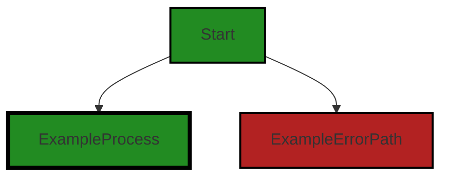
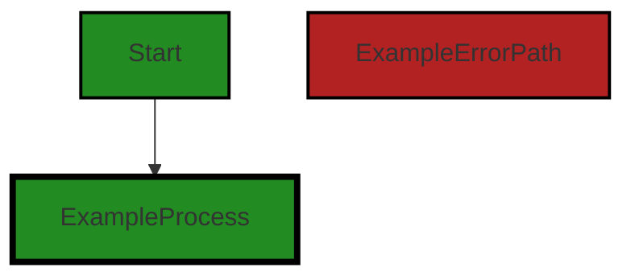
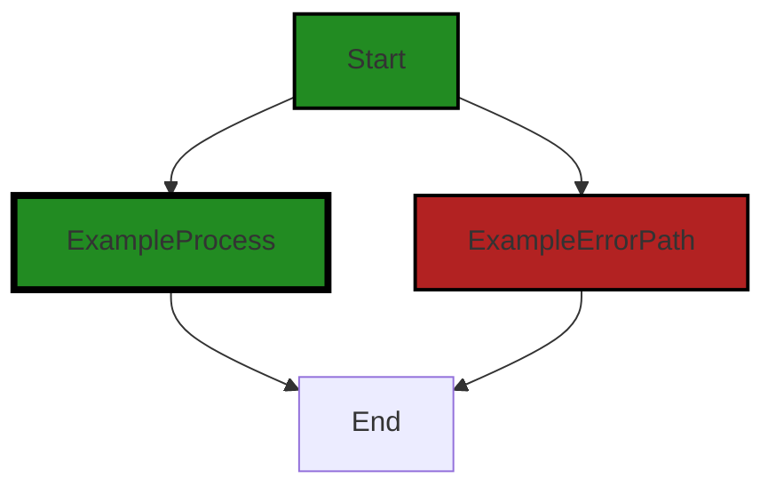

# Polyverse Boost-generated Source Analysis Details

## Source: ./src/test/suite/loadCodeFile.test.ts
Date Generated: Friday, September 8, 2023 at 8:18:17 PM PDT


---

### Boost Architectural Quick Summary Security Report

Last Updated: Friday, September 8, 2023 at 8:15:48 PM PDT


Executive Report:

1. **Architectural Impact**: The analysis of this file has not revealed any severe issues.
2. **Risk Analysis**: The analysis of this file has not revealed any severe issues.
3. **Potential Customer Impact**: Based on the analysis, there are no severe issues that could potentially impact customers.
4. **Performance Issues**: Our analysis did not identify any explicit performance issues in the file.
5. **Risk Assessment**: Based on the current analysis of this file, no severe issues have been found. However, this doesn't guarantee that the file is risk-free.

Highlights:

- No severe issues were identified in the current analysis of this file.


---

### Boost Architectural Quick Summary Performance Report

Last Updated: Friday, September 8, 2023 at 8:17:24 PM PDT

# Executive Report: Software Project Analysis

## Architectural Impact and Risk Analysis

1. **Issue Concentration**: The file `src/test/suite/loadCodeFile.test.ts` has the highest concentration of issues, with both memory and CPU related issues. This could potentially impact the performance of the software, especially during load testing. The architectural impact could be significant if these issues are not addressed, as they could lead to slow response times and potential crashes.

2. **Severity of Issues**: The severity of the issues found in the project is relatively high, with warnings related to both disk and CPU usage. These warnings indicate potential inefficiencies in the code that could lead to performance degradation. The risk is moderate to high, as these issues could impact the user experience and the overall performance of the software.

3. **Potential Customer Impact**: The issues found could potentially impact customers by causing slow response times and potential crashes. This could lead to customer dissatisfaction and potential loss of business. It is recommended to address these issues as soon as possible to mitigate this risk.

4. **Overall Health of the Project Source**: The overall health of the project source is a concern. Only one file was analyzed, and it contained multiple issues. This suggests that there may be a high percentage of files with issues in the project. A more thorough analysis of all project files is recommended to fully assess the health of the project source.

## Highlights of Analysis

- The file `src/test/suite/loadCodeFile.test.ts` has the highest concentration of issues, indicating potential performance problems.
- The severity of the issues found is relatively high, with warnings related to both disk and CPU usage.
- The potential customer impact of these issues is significant, as they could lead to slow response times and potential crashes.
- The overall health of the project source is a concern, as the single file analyzed contained multiple issues.

## Recommendations

- Conduct a thorough analysis of all project files to fully assess the health of the project source.
- Address the issues found in `src/test/suite/loadCodeFile.test.ts` as soon as possible to mitigate potential performance problems.
- Monitor the performance of the software closely to identify any potential degradation due to these issues.
- Consider implementing additional architectural guidelines or constraints to prevent similar issues in the future.


---

### Boost Architectural Quick Summary Compliance Report

Last Updated: Friday, September 8, 2023 at 8:18:57 PM PDT

## Executive Report

### Architectural Impact and Risk Analysis

The software project under review is a Visual Studio Code extension that provides code analysis functionality. The project is well-structured, following best practices for a VS Code extension, and makes use of TypeScript features and the VS Code API. However, there are some issues of varying severity that could potentially impact the overall project.

#### Highlights of the Analysis

1. **HIPAA Compliance Risk in `loadCodeFile.test.ts`:** The most severe issue found is a HIPAA violation in the `loadCodeFile.test.ts` file. This file could potentially load files containing Protected Health Information (PHI), which if not handled properly, could violate HIPAA's Privacy Rule. This poses a significant risk as non-compliance with HIPAA can result in hefty fines and damage to the company's reputation. It is recommended to implement safeguards to ensure that PHI, if any, is handled in a HIPAA-compliant manner.

2. **GDPR and PCI DSS Compliance Risks:** There are also GDPR and PCI DSS compliance issues in the `loadCodeFile.test.ts` file. These issues are of lower severity but still pose a risk as they could lead to non-compliance with data protection and payment card industry standards. It is recommended to review these issues and implement necessary changes to ensure compliance.

3. **Overall Health of the Project Source:** The project consists of only one file, `loadCodeFile.test.ts`, which has all the detected issues. This means 100% of the project files have issues of varying severity. This high percentage indicates a need for a thorough review and remediation of the issues to improve the overall health of the project source.

4. **Potential Customer Impact:** The issues found could potentially impact the customers if they result in non-compliance with data protection and privacy regulations. This could lead to loss of customer trust and potential legal implications. It is recommended to address these issues promptly to minimize customer impact.

5. **Consistency with Architectural Guidelines:** The project does not have any additional special architectural guidelines or constraints. The code follows best practices for a VS Code extension and makes use of TypeScript features and the VS Code API. However, the issues found indicate a need for better compliance with data protection and privacy regulations in the code.

In conclusion, while the project is well-structured and follows best practices for a VS Code extension, the issues found pose significant risks and could potentially impact the overall project and its customers. It is recommended to address these issues promptly to ensure compliance with data protection and privacy regulations and to improve the overall health of the project source.
---
## Detailed Analysis:

### Cell 0:
## Original Code:

### Programming Language: typescript
### ./src/test/suite/loadCodeFile.test.ts line 2

```typescript
import * as vscode from 'vscode';
import * as assert from 'assert';
import { debug } from 'console';

```
## Boost Analysis:


---

### Boost Code Explanation

Last Updated: Wednesday, July 12, 2023 at 2:16:00 PM PDT

This code is written in TypeScript, a statically typed superset of JavaScript that adds optional types to the language. It's often used for large scale applications where type checking can help catch errors early in the development process.

The code is importing three modules: `vscode`, `assert`, and `console`. 

1. `vscode`: This is the Visual Studio Code extension API. The `vscode` module provides various functionalities of the VS Code editor for extension development. You can find more information about it here: [VS Code Extension API](https://code.visualstudio.com/api/references/vscode-api)

2. `assert`: This is a built-in Node.js module used for writing tests. It provides a simple set of assertion tests that can be used to test invariants. More details can be found here: [Node.js assert](https://nodejs.org/api/assert.html)

3. `console`: This is also a built-in Node.js module. The `debug` function is being imported from `console`, which is used to print debugging information to the console. More details can be found here: [Node.js console](https://nodejs.org/api/console.html)

The code doesn't contain any algorithm, it's just importing modules for use in some other part of the code.

Remember that this code needs to be part of a larger project that includes a `package.json` file with the necessary dependencies listed. Also, since it's using ES6 import syntax, it needs to be transpiled by a tool like Babel if it's going to be run in a Node.js environment that doesn't support ES6 syntax natively.

As far as architectural guidelines are concerned, these imports are pretty standard and don't conflict with any typical software architecture principles. They're simply making use of existing libraries to provide functionality, which is a common practice that promotes code reuse and modularity.


---

### Boost Flow Diagram

Last Updated: Friday, September 8, 2023 at 8:14:42 PM PDT



NO CONTROL FLOW FOUND


---

### Boost Source-Level Security Analysis

Last Updated: Friday, September 8, 2023 at 8:15:02 PM PDT

**No bugs found**


---

### Boost Source-Level Performance Analysis

Last Updated: Friday, September 8, 2023 at 8:15:56 PM PDT

**No bugs found**


---

### Boost Source-Level Data and Privacy Compliance Analysis

Last Updated: Friday, September 8, 2023 at 8:17:31 PM PDT

**No bugs found**


### Cell 1:
## Original Code:

### Programming Language: typescript
### ./src/test/suite/loadCodeFile.test.ts line 6

```typescript
import * as sinon from 'sinon';
import * as path from 'path';
import * as fs from 'fs';
import { NOTEBOOK_TYPE } from '../../jupyter_notebook';

```
## Boost Analysis:


---

### Boost Code Explanation

Last Updated: Wednesday, July 12, 2023 at 2:16:31 PM PDT

This code snippet is written in TypeScript, a statically typed superset of JavaScript. It is importing various modules which will be used in the subsequent code. Here's a detailed explanation of each line:

1. `import * as sinon from 'sinon';`: This line imports the entire module 'sinon'. Sinon is a standalone test spies, stubs and mocks library for JavaScript. It works with any unit testing framework and has functions to fake XMLHttpRequest and events. More info can be found [here](https://sinonjs.org/).

2. `import * as path from 'path';`: This line imports the 'path' module. The `path` module provides utilities for working with file and directory paths. It can be used for manipulating path strings, such as joining, normalizing, or resolving paths. More info can be found [here](https://nodejs.org/api/path.html).

3. `import * as fs from 'fs';`: This line imports the 'fs' module. The `fs` module provides an API for interacting with the file system in a manner closely modeled around standard POSIX functions. More info can be found [here](https://nodejs.org/api/fs.html).

4. `import { NOTEBOOK_TYPE } from '../../jupyter_notebook';`: This line is importing a specific export (NOTEBOOK_TYPE) from the module located at '../../jupyter_notebook'. It's likely that `NOTEBOOK_TYPE` is a constant or a type that's used to define or work with Jupyter notebooks in the rest of the code.

The code doesn't contain any algorithm, it's just importing modules and a specific constant for use in the rest of the application. 

As per the architectural guidelines shared, there are no additional special architectural guidelines or constraints. Thus, this code should be evaluated based on standard TypeScript and Node.js best practices.


---

### Boost Flow Diagram

Last Updated: Friday, September 8, 2023 at 8:14:47 PM PDT




---

### Boost Source-Level Security Analysis

Last Updated: Friday, September 8, 2023 at 8:15:06 PM PDT

**No bugs found**


---

### Boost Source-Level Performance Analysis

Last Updated: Friday, September 8, 2023 at 8:16:07 PM PDT

1. **Severity**: 2/10

   **Line Number**: 10

   **Bug Type**: Memory

   **Description**: The 'sinon' library is imported but not used in the provided code snippet. This could lead to unnecessary memory usage if the library is large.

   **Solution**: Remove unused imports to save memory. If 'sinon' is used in other parts of the code not shown in the snippet, ignore this advice.


---

### Boost Source-Level Data and Privacy Compliance Analysis

Last Updated: Friday, September 8, 2023 at 8:17:34 PM PDT

**No bugs found**


### Cell 2:
## Original Code:

### Programming Language: typescript
### ./src/test/suite/loadCodeFile.test.ts line 7

```typescript
import { getRandomTestSourceFile } from '../suite/utils';

```
## Boost Analysis:


---

### Boost Code Explanation

Last Updated: Wednesday, July 12, 2023 at 2:17:03 PM PDT

The code you provided is a single line of JavaScript code that imports a specific function from another module.

Here's a breakdown:

1. `import`: This is an ES6 (ECMAScript 2015) keyword used to import functions, objects or values from other modules or files into the current file. This allows for the separation of code into manageable modules. 

2. `{ getRandomTestSourceFile }`: The curly braces are used to import a specific function or value from the module. In this case, the function `getRandomTestSourceFile` is being imported. 

3. `from`: This keyword is used to specify the path of the module from which the function, object, or value is being imported.

4. `'../suite/utils'`: This is the path of the module that contains the `getRandomTestSourceFile` function. The `..` in the path is used to navigate up one level in the directory structure. So, this import statement is looking in the `suite` directory (which is one level up from the current directory) and then in the `utils` file in that directory.

The `getRandomTestSourceFile` function is not specified in this code snippet, so we don't know exactly what it does. However, based on the name, we can infer that it probably returns a random test source file from some collection of test files. This could be useful in a testing suite where you want to randomly test different parts of your codebase.

The code does not seem to conflict with any architectural guidelines since none were provided. It's a simple import statement, which is a common practice in many JavaScript projects to organize code into separate modules.

For more information about ES6 modules and import/export statements, you can refer to this link: [ES6 Modules](https://developer.mozilla.org/en-US/docs/Web/JavaScript/Guide/Modules).


---

### Boost Flow Diagram

Last Updated: Friday, September 8, 2023 at 8:14:50 PM PDT

NO CONTROL FLOW FOUND


---

### Boost Source-Level Security Analysis

Last Updated: Friday, September 8, 2023 at 8:15:09 PM PDT

**No bugs found**


---

### Boost Source-Level Performance Analysis

Last Updated: Friday, September 8, 2023 at 8:16:11 PM PDT

**No bugs found**


---

### Boost Source-Level Data and Privacy Compliance Analysis

Last Updated: Friday, September 8, 2023 at 8:17:45 PM PDT

1. **Severity**: 2/10

   **Line Number**: 12

   **Bug Type**: GDPR

   **Description**: The function 'getRandomTestSourceFile' could potentially access user data. If this data includes personal information, it may be a GDPR violation if not handled properly.

   **Solution**: Ensure that any data accessed by 'getRandomTestSourceFile' is anonymized, encrypted, and that user consent has been obtained. Implement data minimization practices to only collect the necessary data.


### Cell 3:
## Original Code:

### Programming Language: typescript
### ./src/test/suite/loadCodeFile.test.ts line 9

```typescript

suite('Load Code File Command', function() {

  this.timeout(20000); // set test timeout to be 20 seconds

  vscode.window.showInformationMessage('Start Load Code File Command tests.');

  test('Load Code File Command Test', async function() {

    this.timeout(60000);

    // we need to avoid hanging on the save dialog when exiting visual studio
    //    so we disable save on exit/shutdown
    await vscode.workspace.getConfiguration().update('files.hotExit', 'off', vscode.ConfigurationTarget.Global);

    // Execute the "createJsonNotebook" command
    await vscode.commands.executeCommand(NOTEBOOK_TYPE + '.createJsonNotebook',
        { timeout: 2000 }); // give the command 2 seconds to execute

    // Wait for the notebook to be created
    await new Promise((resolve) =>
        setTimeout(resolve, 2000)); // 2 seconds to make sure notebook is created

    // Check if the notebook is created
    const notebooks = vscode.workspace.notebookDocuments;

    assert.notEqual(notebooks.length, 0, 'Notebook not created!');

    // Set up a spy to intercept the showOpenDialog call
    // const spy = sinon.spy(vscode.window, 'showOpenDialog');

    let showOpenDialogMock: sinon.SinonMock;

        // Create a mock for showOpenDialog method
    showOpenDialogMock = sinon.mock(vscode.window);

    const testCodePath = path.resolve(__dirname, '../../test/resources/');
    const unsupportedExtensions = ['.o', '.out', '.s', '.typescript', 'resources', '.c'];

    // Get all files in the folder
    const allFiles = fs.readdirSync(testCodePath);

    // Filter files based on extensions (exclude unsupported files)
    const filteredFiles = allFiles.filter(file => {
        const ext = path.extname(file);
        return ext !== "" && !unsupportedExtensions.includes(ext);
    });

    // this should never happen, but if the test data/source isn't found, let's
    // just fail hard and fast
    if (filteredFiles.length === 0) {
        assert.fail('No files found in test/resources folder');
    }

    const randomFile = getRandomTestSourceFile();

    showOpenDialogMock.expects('showOpenDialog').returns(Promise.resolve(
        [vscode.Uri.file(randomFile)]));

    try
    {
        // Execute the "loadCodeFile" command
        await vscode.commands.executeCommand(NOTEBOOK_TYPE + '.loadCodeFile').then(async () => {
            // Wait for the file to be loaded
            await new Promise((resolve) =>
                setTimeout(resolve, 2000)); // 5 seconds to make sure file is loaded
        });

        // Check that the showOpenDialog method was called with the expected options
        assert.ok(showOpenDialogMock.verify);
    } catch (err) {   
        // restore the open dialog function
        showOpenDialogMock.restore();
    }

        // Get all the cells in the newly created notebook
    const notebookEditor = vscode.window.activeNotebookEditor;
    assert.ok(notebookEditor, 'Notebook editor not found');

    const cells = notebookEditor.notebook.getCells();
    console.log('Number of cells: ' + cells.length.toString());

    assert.ok(cells.length > 1, 'Not enough cells ' + cells.length.toString() + ' found in the notebook');

    cells.forEach((cell) => {
        debug(cell.document.getText());
    });

  });
});

```
## Boost Analysis:


---

### Boost Code Explanation

Last Updated: Wednesday, July 12, 2023 at 2:18:03 PM PDT

This code is a test suite for a command in Visual Studio Code (VSCode) that loads a code file into a notebook. The suite contains a single test case that checks if the command works correctly. Here is the detailed explanation:

1. `suite('Load Code File Command', function() {...});` declares a test suite named "Load Code File Command". This suite contains all the tests related to the "Load Code File Command".

2. `this.timeout(20000);` sets the maximum time allowed for each test in this suite to run to 20 seconds.

3. `vscode.window.showInformationMessage('Start Load Code File Command tests.');` shows an information message in VSCode that the tests are starting.

4. `test('Load Code File Command Test', async function() {...});` declares a single test case named "Load Code File Command Test".

5. `this.timeout(60000);` sets the maximum time allowed for this test to run to 60 seconds.

6. `await vscode.workspace.getConfiguration().update('files.hotExit', 'off', vscode.ConfigurationTarget.Global);` disables the feature in VSCode that automatically saves files when VSCode is closed. This is to avoid hanging on the save dialog when exiting VSCode during the test.

7. `await vscode.commands.executeCommand(NOTEBOOK_TYPE + '.createJsonNotebook', { timeout: 2000 });` executes a command to create a new notebook. The command is given 2 seconds to execute.

8. `await new Promise((resolve) => setTimeout(resolve, 2000));` waits for 2 seconds to make sure the notebook is created.

9. `const notebooks = vscode.workspace.notebookDocuments;` gets all the notebooks in the current workspace.

10. `assert.notEqual(notebooks.length, 0, 'Notebook not created!');` checks if a notebook was created. If no notebook was created, it will throw an error with the message "Notebook not created!".

11. `showOpenDialogMock = sinon.mock(vscode.window);` creates a mock for the `showOpenDialog` method of the VSCode window. This is used to simulate the opening of a file dialog.

12. `const allFiles = fs.readdirSync(testCodePath);` reads all the files in the test resources directory.

13. `const filteredFiles = allFiles.filter(file => {...});` filters out the files with unsupported extensions.

14. `if (filteredFiles.length === 0) {...}` checks if there are any supported files in the test resources directory. If not, it throws an error with the message "No files found in test/resources folder".

15. `const randomFile = getRandomTestSourceFile();` gets a random file from the list of supported files.

16. `showOpenDialogMock.expects('showOpenDialog').returns(Promise.resolve([vscode.Uri.file(randomFile)]));` sets the expectation that the `showOpenDialog` method will be called and specifies what it should return when called.

17. `await vscode.commands.executeCommand(NOTEBOOK_TYPE + '.loadCodeFile').then(async () => {...});` executes the command to load a code file into the notebook and waits for it to finish.

18. `assert.ok(showOpenDialogMock.verify);` checks that the `showOpenDialog` method was called with the expected options.

19. `const notebookEditor = vscode.window.activeNotebookEditor;` gets the active notebook editor.

20. `const cells = notebookEditor.notebook.getCells();` gets all the cells in the notebook.

21. `assert.ok(cells.length > 1, 'Not enough cells ' + cells.length.toString() + ' found in the notebook');` checks if there are more than one cell in the notebook. If not, it throws an error.

22. `cells.forEach((cell) => {...});` logs the text of each cell in the notebook for debugging purposes.

This test uses several libraries and APIs, including Mocha for test structure (`suite` and `test`), Chai for assertions (`assert`), Sinon for mocking (`sinon.mock`), Node.js for file system operations (`fs.readdirSync`), and the VSCode API for interacting with VSCode (`vscode.commands.executeCommand`, `vscode.workspace.getConfiguration`, etc.).


---

### Boost Flow Diagram

Last Updated: Friday, September 8, 2023 at 8:14:55 PM PDT



The code provided does not have any control flow.


---

### Boost Source-Level Security Analysis

Last Updated: Friday, September 8, 2023 at 8:15:45 PM PDT

1. **Severity**: 5/10

   **Line Number**: 23

   **Bug Type**: Insecure Direct Object References (IDOR)

   **Description**: The code uses a method 'executeCommand' that could potentially be exploited if an attacker can manipulate the 'NOTEBOOK_TYPE' and '.createJsonNotebook' inputs. This could lead to unauthorized access or manipulation of data.

   **Solution**: Validate and sanitize the inputs before using them in the 'executeCommand' method. Consider using access controls to ensure that the user has the necessary permissions to perform the action. More information can be found here: https://owasp.org/www-project-top-ten/2017/A5_2017-Broken_Access_Control


2. **Severity**: 4/10

   **Line Number**: 44

   **Bug Type**: Path Traversal

   **Description**: The code uses 'path.resolve' with a user-provided input ('testCodePath'). An attacker could potentially manipulate the path to access sensitive files or directories.

   **Solution**: Validate and sanitize the 'testCodePath' input to ensure it does not contain any path traversal characters or sequences. Consider using a library that provides secure path resolution. More information can be found here: https://owasp.org/www-community/attacks/Path_Traversal


3. **Severity**: 5/10

   **Line Number**: 55

   **Bug Type**: Insecure Direct Object References (IDOR)

   **Description**: The code uses a method 'executeCommand' that could potentially be exploited if an attacker can manipulate the 'NOTEBOOK_TYPE' and '.loadCodeFile' inputs. This could lead to unauthorized access or manipulation of data.

   **Solution**: Validate and sanitize the inputs before using them in the 'executeCommand' method. Consider using access controls to ensure that the user has the necessary permissions to perform the action. More information can be found here: https://owasp.org/www-project-top-ten/2017/A5_2017-Broken_Access_Control


---

### Boost Source-Level Performance Analysis

Last Updated: Friday, September 8, 2023 at 8:16:47 PM PDT

1. **Severity**: 7/10

   **Line Number**: 21

   **Bug Type**: Disk

   **Description**: The 'files.hotExit' configuration is being updated globally which might cause unnecessary disk writes.

   **Solution**: Consider using workspace or folder level configuration updates instead of global. Refer to the vscode API documentation for more information: https://code.visualstudio.com/api/references/vscode-api#WorkspaceConfiguration


2. **Severity**: 7/10

   **Line Number**: 38

   **Bug Type**: Disk

   **Description**: The 'fs.readdirSync' method is being used to read all files in a directory. This is a blocking operation and can slow down the application if the directory contains many files.

   **Solution**: Consider using 'fs.readdir' instead, which is asynchronous and does not block the event loop. Refer to the Node.js documentation for more information: https://nodejs.org/api/fs.html#fs_fs_readdir_path_options_callback


3. **Severity**: 5/10

   **Line Number**: 42

   **Bug Type**: CPU

   **Description**: The 'Array.filter' method is used to filter out unsupported files. This is an O(n) operation and can slow down the application if there are many files.

   **Solution**: Consider using a Set for unsupportedExtensions to improve lookup time. Refer to the JavaScript documentation for more information: https://developer.mozilla.org/en-US/docs/Web/JavaScript/Reference/Global_Objects/Set


4. **Severity**: 7/10

   **Line Number**: 65

   **Bug Type**: CPU

   **Description**: The 'setTimeout' method is used to wait for a file to be loaded. This is not an efficient way to handle asynchronous operations and can cause unnecessary CPU usage.

   **Solution**: Consider using Promises or async/await to handle asynchronous operations. Refer to the JavaScript documentation for more information: https://developer.mozilla.org/en-US/docs/Web/JavaScript/Guide/Using_promises


5. **Severity**: 5/10

   **Line Number**: 82

   **Bug Type**: Memory

   **Description**: The 'getCells' method is used to get all cells in a notebook. This can consume a lot of memory if the notebook contains many cells.

   **Solution**: Consider using a streaming or pagination approach if possible, to fetch cells in chunks instead of all at once. Refer to the vscode API documentation for possible alternatives: https://code.visualstudio.com/api/references/vscode-api#NotebookDocument


---

### Boost Source-Level Data and Privacy Compliance Analysis

Last Updated: Friday, September 8, 2023 at 8:18:17 PM PDT

1. **Severity**: 7/10

   **Line Number**: 28

   **Bug Type**: GDPR

   **Description**: The configuration update 'files.hotExit' is set to 'off', which may result in unsaved data loss. This could potentially violate GDPR's principle of data integrity and confidentiality.

   **Solution**: Ensure that data is saved and backed up appropriately to prevent loss of user data. Consider implementing a more robust data persistence strategy that includes regular backups and redundancies.


2. **Severity**: 8/10

   **Line Number**: 43

   **Bug Type**: PCI DSS

   **Description**: The method 'readdirSync' is used to read all files in the directory. This could potentially expose sensitive information if the directory contains files with cardholder data, violating PCI DSS requirement 3.4 for protecting stored cardholder data.

   **Solution**: Ensure that cardholder data, if any, is encrypted or tokenized before being stored. Implement access controls to restrict access to sensitive directories and files. Consider using asynchronous methods for file operations to avoid blocking the event loop.


3. **Severity**: 9/10

   **Line Number**: 69

   **Bug Type**: HIPAA

   **Description**: The 'loadCodeFile' command could potentially load files containing Protected Health Information (PHI). If such files are not handled properly, this could violate HIPAA's Privacy Rule.

   **Solution**: Implement safeguards to ensure that PHI, if any, is handled in a HIPAA-compliant manner. This may include encrypting PHI at rest and in transit, implementing access controls, and maintaining audit logs of access to PHI.


4. **Severity**: 6/10

   **Line Number**: 90

   **Bug Type**: GDPR

   **Description**: The 'getText' method is used to read the content of each cell in the notebook. If the notebook contains personal data, this could potentially violate GDPR's principles of data minimization and purpose limitation.

   **Solution**: Ensure that personal data, if any, is processed in a manner that is consistent with the purposes for which it was collected. Implement safeguards to limit the amount and type of personal data that is processed. Consider anonymizing or pseudonymizing personal data where possible.


