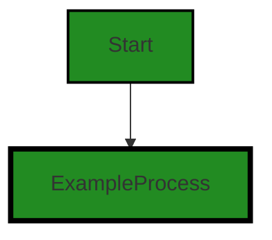

# Polyverse Boost-generated Source Analysis Details

## Source: ./src/test/suite/rightClick_LoadFolder_command.test.ts
Date Generated: Friday, September 8, 2023 at 10:31:43 PM PDT


---

### Boost Architectural Quick Summary Security Report

Last Updated: Friday, September 8, 2023 at 10:31:25 PM PDT


Executive Report:

1. **Architectural Impact**: The analysis of this file has not revealed any severe issues.
2. **Risk Analysis**: The analysis of this file has not revealed any severe issues.
3. **Potential Customer Impact**: Based on the analysis, there are no severe issues that could potentially impact customers.
4. **Performance Issues**: Our analysis did not identify any explicit performance issues in the file.
5. **Risk Assessment**: Based on the current analysis of this file, no severe issues have been found. However, this doesn't guarantee that the file is risk-free.

Highlights:

- No severe issues were identified in the current analysis of this file.


---

### Boost Architectural Quick Summary Performance Report

Last Updated: Friday, September 8, 2023 at 10:31:36 PM PDT


Executive Report:

1. **Architectural Impact**: The analysis of this file has not revealed any severe issues.
2. **Risk Analysis**: The analysis of this file has not revealed any severe issues.
3. **Potential Customer Impact**: Based on the analysis, there are no severe issues that could potentially impact customers.
4. **Performance Issues**: Our analysis did not identify any explicit performance issues in the file.
5. **Risk Assessment**: Based on the current analysis of this file, no severe issues have been found. However, this doesn't guarantee that the file is risk-free.

Highlights:

- No severe issues were identified in the current analysis of this file.


---

### Boost Architectural Quick Summary Compliance Report

Last Updated: Friday, September 8, 2023 at 10:31:47 PM PDT


Executive Report:

1. **Architectural Impact**: The analysis of this file has not revealed any severe issues.
2. **Risk Analysis**: The analysis of this file has not revealed any severe issues.
3. **Potential Customer Impact**: Based on the analysis, there are no severe issues that could potentially impact customers.
4. **Performance Issues**: Our analysis did not identify any explicit performance issues in the file.
5. **Risk Assessment**: Based on the current analysis of this file, no severe issues have been found. However, this doesn't guarantee that the file is risk-free.

Highlights:

- No severe issues were identified in the current analysis of this file.

---
## Detailed Analysis:

### Cell 0:
## Original Code:

### Programming Language: typescript
### ./src/test/suite/rightClick_LoadFolder_command.test.ts line 0

```typescript
suite('Convert Code Command', function() {

    this.timeout(20000); // set test timeout to be 20 seconds
  
    test('Right Click Folder Command Test', async function() {
  
      console.warn('Simulating Right Click Folder Command Test');
    });
  });

```
## Boost Analysis:


---

### Boost Code Explanation

Last Updated: Wednesday, July 12, 2023 at 1:19:35 PM PDT

This code is written in JavaScript and it is using Mocha, a JavaScript test framework running on Node.js, which makes asynchronous testing simple and fun. 

Here is a detailed explanation of the code:

1. `suite('Convert Code Command', function() {...});`: This line is defining a test suite. A test suite is a collection of tests that are intended to be used to test a specific behavior of a software program. The string 'Convert Code Command' is the name or title of the test suite.

2. `this.timeout(20000);`: This line is setting a timeout for the test suite. The timeout is set to 20000 milliseconds, or 20 seconds. This means that if any test within this suite takes longer than 20 seconds to run, Mocha will automatically fail that test.

3. `test('Right Click Folder Command Test', async function() {...});`: This line is defining a single test within the test suite. The string 'Right Click Folder Command Test' is the name or title of the test. The `async` keyword indicates that the test function will return a Promise. This is useful for testing asynchronous code.

4. `console.warn('Simulating Right Click Folder Command Test');`: This line is writing a warning message to the console. The string 'Simulating Right Click Folder Command Test' is the message that will be displayed.

The algorithm used in this code is quite simple: it defines a test suite, sets a timeout for the test suite, defines a single test, and writes a message to the console.

For more information on Mocha and asynchronous testing in JavaScript, you can visit the following links:
- [Mocha - Official Website](https://mochajs.org/)
- [Asynchronous Testing - Mocha Docs](https://mochajs.org/#asynchronous-code)
- [JavaScript Async Function - MDN Web Docs](https://developer.mozilla.org/en-US/docs/Web/JavaScript/Reference/Statements/async_function)


---

### Boost Flow Diagram

Last Updated: Friday, September 8, 2023 at 10:31:15 PM PDT




---

### Boost Source-Level Security Analysis

Last Updated: Friday, September 8, 2023 at 10:31:22 PM PDT

**No bugs found**


---

### Boost Source-Level Performance Analysis

Last Updated: Friday, September 8, 2023 at 10:31:33 PM PDT

**No bugs found**


---

### Boost Source-Level Data and Privacy Compliance Analysis

Last Updated: Friday, September 8, 2023 at 10:31:43 PM PDT

**No bugs found**

