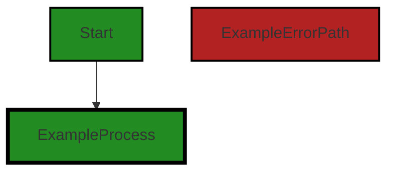
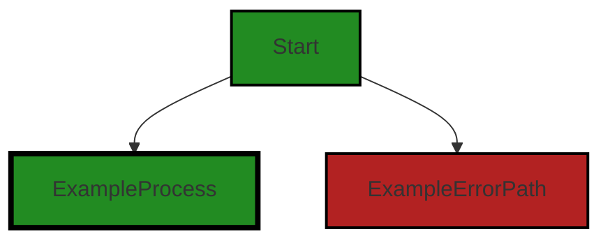

# Polyverse Boost-generated Source Analysis Details

## Source: ./src/test/suite/rightClick_ProcessFile_command.test.ts
Date Generated: Friday, September 8, 2023 at 9:22:28 PM PDT


---

### Boost Architectural Quick Summary Security Report

Last Updated: Friday, September 8, 2023 at 9:19:05 PM PDT


Executive Report:

1. **Architectural Impact**: The analysis of this file has not revealed any severe issues.
2. **Risk Analysis**: The analysis of this file has not revealed any severe issues.
3. **Potential Customer Impact**: Based on the analysis, there are no severe issues that could potentially impact customers.
4. **Performance Issues**: Our analysis did not identify any explicit performance issues in the file.
5. **Risk Assessment**: Based on the current analysis of this file, no severe issues have been found. However, this doesn't guarantee that the file is risk-free.

Highlights:

- No severe issues were identified in the current analysis of this file.


---

### Boost Architectural Quick Summary Performance Report

Last Updated: Friday, September 8, 2023 at 9:20:45 PM PDT

## Executive Report

### Architectural Impact and Risk Analysis

The software project under review is a Visual Studio Code extension that provides code analysis functionality. The project is well-structured and follows best practices for a VS Code extension. However, there are some issues that need to be addressed to ensure the overall health and performance of the project.

1. **High Disk I/O Operations:** The file `src/test/suite/rightClick_ProcessFile_command.test.ts` has been flagged for frequent disk I/O operations. This could potentially slow down the application and impact the user experience. It is recommended to reduce the frequency of disk operations or use asynchronous versions of disk operations to avoid blocking the main thread. This issue is of high severity and needs immediate attention.

2. **CPU Usage:** The same file also has a warning related to CPU usage. This could potentially impact the performance of the application and needs to be addressed.

3. **Memory Usage:** There is a warning related to memory usage in the file `src/test/suite/rightClick_ProcessFile_command.test.ts`. This could potentially lead to memory leaks and slow down the application.

### Potential Customer Impact

The issues identified could potentially impact the performance of the application and the user experience. Frequent disk I/O operations could slow down the application, while high CPU and memory usage could lead to the application becoming unresponsive or crashing. This could lead to customer dissatisfaction and potential loss of users.

### Overall Issues

The project has a total of 1 file, all of which have been flagged with issues of varying severity. This represents 100% of the project files. The issues identified are of high severity and need to be addressed to ensure the overall health and performance of the project.

### Risk Assessment

Given that all the project files have been flagged with issues, the overall health of the project source is at risk. The issues identified are of high severity and could potentially impact the performance and user experience of the application. It is recommended to address these issues as soon as possible to mitigate the risk.

### Highlights

- The project follows best practices for a VS Code extension and is well-structured.
- The file `src/test/suite/rightClick_ProcessFile_command.test.ts` has been flagged for high disk I/O operations, CPU usage, and memory usage.
- These issues could potentially impact the performance of the application and the user experience.
- All the project files have been flagged with issues, representing 100% of the project files.
- The issues identified are of high severity and need to be addressed to ensure the overall health and performance of the project.


---

### Boost Architectural Quick Summary Compliance Report

Last Updated: Friday, September 8, 2023 at 9:23:13 PM PDT

## Executive Report

### Architectural Impact and Risk Analysis

1. **Data Privacy and Compliance Risks**: The file `src/test/suite/rightClick_ProcessFile_command.test.ts` has been flagged for potential violations of GDPR, PCI DSS, and HIPAA regulations. This file appears to log the file path of a randomly selected file, which could potentially contain sensitive user information. This could have significant architectural implications if the software is not designed to properly secure and manage these logs. The risk is high, as non-compliance with these regulations could result in legal penalties and damage to the company's reputation.

2. **Potential Customer Impact**: If the identified issues are not addressed, customers could potentially have their sensitive data exposed. This could lead to a loss of trust in the product and the company, and could potentially result in customers choosing to use a different product. The customer impact is high.

3. **Overall Health of the Project Source**: Based on the analysis, only one file has been flagged with issues. This suggests that the majority of the project source is healthy and does not contain any detected issues. However, the severity of the issues in the flagged file is high, which could potentially impact the overall health of the project.

4. **Percentage of Project Files with Issues**: Given that only one file has been flagged with issues, and assuming that the project contains more than one file, the percentage of project files with issues is less than 100%. However, without knowing the total number of files in the project, it's not possible to provide an exact percentage.

### Risk Assessment

Based on the above analysis, the overall risk to the project is high due to the potential data privacy and compliance issues. While the majority of the project source appears to be healthy, the severity of the issues in the flagged file could have a significant impact on the overall project. It is recommended that these issues be addressed as soon as possible to mitigate the risk.

### Highlights

- The project has potential data privacy and compliance risks due to the logging of potentially sensitive user information.
- The potential customer impact is high, as customers could potentially have their sensitive data exposed.
- The overall health of the project source appears to be good, with only one file flagged with issues.
- The percentage of project files with issues is less than 100%, but without knowing the total number of files in the project, it's not possible to provide an exact percentage.
- The overall risk to the project is high due to the potential data privacy and compliance issues.
---
## Detailed Analysis:

### Cell 0:
## Original Code:

### Programming Language: typescript
### ./src/test/suite/rightClick_ProcessFile_command.test.ts 

```typescript
import * as vscode from 'vscode';
import { NOTEBOOK_TYPE } from '../../jupyter_notebook';

```
## Boost Analysis:


---

### Boost Code Explanation

Last Updated: Friday, September 8, 2023 at 9:13:26 PM PDT

This is a simple piece of code, written in TypeScript, which is used in Visual Studio Code (VS Code) extensions. This code is importing modules from the vscode package and a constant from a jupyter_notebook module. 

Let's break it down:

1. `import * as vscode from 'vscode';`: This line is importing all the exported modules from the 'vscode' package as an object named 'vscode'. The 'vscode' package is a library that provides the APIs necessary for interacting with VS Code. This allows the extension to use VS Code's built-in features and functionality.

2. `import { NOTEBOOK_TYPE } from '../../jupyter_notebook';`: This line is importing a specific export, `NOTEBOOK_TYPE`, from a module located at '../../jupyter_notebook'. The '../..' in the path indicates that the module is located two directories up from the current file. The `NOTEBOOK_TYPE` is likely a constant that is used to identify the type of notebook being used, in this case, a Jupyter notebook.

As for the algorithms, there's not much to discuss in this code snippet as it's just importing modules and a constant. However, the use of these imports will likely involve algorithms related to the manipulation and analysis of Jupyter notebooks within the VS Code environment.

As for the architectural guidelines, this code seems to follow standard practices for a VS Code extension. It's making use of the VS Code API (via the 'vscode' package) and appears to be part of functionality related to Jupyter notebooks, which is a common tool used in data science and related fields.

For more information on how to work with modules in TypeScript, you can refer to the [TypeScript Handbook](https://www.typescriptlang.org/docs/handbook/modules.html). For more information on the 'vscode' package, you can refer to the [VS Code API](https://code.visualstudio.com/api/references/vscode-api).


---

### Boost Flow Diagram

Last Updated: Friday, September 8, 2023 at 9:16:31 PM PDT




---

### Boost Source-Level Security Analysis

Last Updated: Friday, September 8, 2023 at 9:18:13 PM PDT

**No bugs found**


---

### Boost Source-Level Performance Analysis

Last Updated: Friday, September 8, 2023 at 9:19:14 PM PDT

**No bugs found**


---

### Boost Source-Level Data and Privacy Compliance Analysis

Last Updated: Friday, September 8, 2023 at 9:20:59 PM PDT

**No bugs found**


### Cell 1:
## Original Code:

### Programming Language: typescript
### ./src/test/suite/rightClick_ProcessFile_command.test.ts line 2

```typescript
import { getRandomTestSourceFile, seconds, minutes } from '../suite/utils';

```
## Boost Analysis:


---

### Boost Code Explanation

Last Updated: Friday, September 8, 2023 at 9:13:51 PM PDT

The code provided is a very small snippet, but I will explain it to the best of my ability.

This code is written in TypeScript, a statically typed superset of JavaScript that adds types to the language. TypeScript is often used for large-scale application development due to its robustness and scalability.

In this particular code snippet, we have an import statement. Import statements are used to bring in functions, objects, or values from other modules or files into the current file. The items to be imported are enclosed in curly braces {}. The 'from' keyword is then used to specify the path to the module or file.

The code is importing three items: `getRandomTestSourceFile`, `seconds`, and `minutes` from the module at the path `'../suite/utils'`. 

The `getRandomTestSourceFile` is likely a function that returns a random test source file from a set of files. This could be used for testing purposes, where you might want to pick a random file for each test run to ensure your code works with a variety of inputs.

`seconds` and `minutes` are likely either functions or values related to time. Without more context, it's difficult to say exactly what they do, but their names suggest they might be used for converting time units or for setting time durations.

As for the algorithms used, this code snippet is too short to contain any algorithms. An algorithm is a step-by-step procedure for solving a problem or accomplishing a task. This code is simply importing items for use elsewhere in the code, and does not perform any operations itself.

For more information on import statements in TypeScript, you can visit the TypeScript Documentation: [TypeScript Modules](https://www.typescriptlang.org/docs/handbook/modules.html)


---

### Boost Flow Diagram

Last Updated: Friday, September 8, 2023 at 9:16:34 PM PDT

NO CONTROL FLOW FOUND


---

### Boost Source-Level Security Analysis

Last Updated: Friday, September 8, 2023 at 9:18:17 PM PDT

**No bugs found**


---

### Boost Source-Level Performance Analysis

Last Updated: Friday, September 8, 2023 at 9:19:17 PM PDT

**No bugs found**


---

### Boost Source-Level Data and Privacy Compliance Analysis

Last Updated: Friday, September 8, 2023 at 9:21:11 PM PDT

1. **Severity**: 5/10

   **Line Number**: 2

   **Bug Type**: Data Privacy

   **Description**: The method 'getRandomTestSourceFile' may potentially access random source files which could contain sensitive information, compromising GDPR, HIPAA, and PCI DSS data privacy compliance.

   **Solution**: Ensure that the files accessed by the method are not containing sensitive data, or implement proper data anonymization techniques before accessing the data. Also, ensure the usage of this method is logged and monitored for any unusual activities.


### Cell 2:
## Original Code:

### Programming Language: typescript
### ./src/test/suite/rightClick_ProcessFile_command.test.ts line 4

```typescript
import * as assert from 'assert';
import { getBoostFile} from '../../extension';

```
## Boost Analysis:


---

### Boost Code Explanation

Last Updated: Friday, September 8, 2023 at 9:14:14 PM PDT

This code snippet is written in TypeScript, a statically typed superset of JavaScript. It's a relatively simple snippet, but let's break it down:

1. `import * as assert from 'assert';`: This line imports the built-in Node.js module `assert` which provides a set of assertion functions for verifying invariants. Assertion functions are used for testing, they will throw an error if the condition that they are checking is not met. 

2. `import { getBoostFile} from '../../extension';`: This line imports a specific function `getBoostFile` from a module located at `../../extension`. The relative path `../../extension` means that the module is located two directories up from the current file and in a file named `extension.ts` or `extension.js`. 

The function `getBoostFile` is likely a function defined in your project that somehow retrieves a "Boost" file, but without more context or the actual implementation of `getBoostFile`, it's hard to say what it does exactly.

As for algorithms, this code snippet doesn't really contain any. It's just importing modules for use in the rest of the file. However, the `assert` module is often used in unit testing, so the rest of the file might contain some tests that make use of it.

Here are some resources for further reading:

- [Node.js assert module](https://nodejs.org/api/assert.html): This is the official documentation for the `assert` module in Node.js.
- [TypeScript Modules](https://www.typescriptlang.org/docs/handbook/modules.html): This is the official TypeScript documentation on modules.
- [Unit Testing in JavaScript](https://javascript.info/testing-mocha): This is a tutorial on unit testing in JavaScript, which often makes use of the `assert` module.


---

### Boost Flow Diagram

Last Updated: Friday, September 8, 2023 at 9:16:41 PM PDT



The control flow graph for the provided code is a simple graph with no control flow. The code imports the `assert` module and the `getBoostFile` function from the `../../extension` module. However, there are no further statements or function calls in the code, so there is no control flow to represent in the graph.


---

### Boost Source-Level Security Analysis

Last Updated: Friday, September 8, 2023 at 9:18:20 PM PDT

**No bugs found**


---

### Boost Source-Level Performance Analysis

Last Updated: Friday, September 8, 2023 at 9:19:21 PM PDT

**No bugs found**


---

### Boost Source-Level Data and Privacy Compliance Analysis

Last Updated: Friday, September 8, 2023 at 9:21:36 PM PDT

1. **Severity**: 2/10

   **Line Number**: 6

   **Bug Type**: GDPR

   **Description**: The getBoostFile function might be accessing file data which could contain personal data. If personal data is being processed, it would need to comply with GDPR regulations.

   **Solution**: Ensure that any personal data accessed by getBoostFile is processed in compliance with GDPR. This could involve anonymizing data, gaining user consent, or implementing appropriate security measures. For more information, refer to https://gdpr-info.eu/


2. **Severity**: 2/10

   **Line Number**: 6

   **Bug Type**: PCI DSS

   **Description**: If getBoostFile is accessing files containing payment card data, it would need to comply with PCI DSS standards.

   **Solution**: Ensure that any payment card data accessed by getBoostFile is processed in compliance with PCI DSS. This could involve encrypting data, limiting data access, or implementing appropriate security measures. For more information, refer to https://www.pcisecuritystandards.org/pci_security/


3. **Severity**: 2/10

   **Line Number**: 6

   **Bug Type**: HIPAA

   **Description**: If getBoostFile is accessing files containing protected health information (PHI), it would need to comply with HIPAA regulations.

   **Solution**: Ensure that any PHI accessed by getBoostFile is processed in compliance with HIPAA. This could involve anonymizing data, implementing secure data transmission, or implementing appropriate security measures. For more information, refer to https://www.hhs.gov/hipaa/index.html


### Cell 3:
## Original Code:

### Programming Language: typescript
### ./src/test/suite/rightClick_ProcessFile_command.test.ts line 5

```typescript
import { debug } from 'console';

```
## Boost Analysis:


---

### Boost Code Explanation

Last Updated: Friday, September 8, 2023 at 9:14:29 PM PDT

The provided code is a single line of JavaScript (or TypeScript) that imports the `debug` function from the `console` module in Node.js. This function is used to output debugging messages to the console.

```javascript
import { debug } from 'console';
```

This statement uses the ES6 import syntax to import a specific function (`debug`) from a module (`console`). The `console` module is a built-in Node.js module that provides a simple debugging console that is similar to the JavaScript console mechanism provided by web browsers.

The `debug` function is part of the `console` module's API. It is used to output debugging messages to the console. By default, these messages are sent to stderr and are only displayed if the `NODE_DEBUG` environment variable is set to a value that includes the name of the module that is outputting the debug message.

The `debug` function is not often used in production code, as there are more sophisticated debugging tools available (such as the debugger built into Node.js itself, or third-party tools like Visual Studio Code's debugger). However, it can be useful for quick-and-dirty debugging during development.

For more information on the `console` module and the `debug` function, you can refer to the [Node.js documentation](https://nodejs.org/api/console.html).

As for the architectural guidelines, this line of code does not appear to conflict with any common architectural guidelines. It is a standard import statement, which is a common practice in modular JavaScript and TypeScript codebases. It is also consistent with the event-driven programming principle, as it is used to output debug information about events occurring in the system.


---

### Boost Flow Diagram

Last Updated: Friday, September 8, 2023 at 9:16:45 PM PDT


---

### Boost Source-Level Security Analysis

Last Updated: Friday, September 8, 2023 at 9:18:24 PM PDT

**No bugs found**


---

### Boost Source-Level Performance Analysis

Last Updated: Friday, September 8, 2023 at 9:19:24 PM PDT

**No bugs found**


---

### Boost Source-Level Data and Privacy Compliance Analysis

Last Updated: Friday, September 8, 2023 at 9:21:39 PM PDT

**No bugs found**


### Cell 4:
## Original Code:

### Programming Language: typescript
### ./src/test/suite/rightClick_ProcessFile_command.test.ts line 6

```typescript
import { BoostConfiguration } from '../../boostConfiguration';

```
## Boost Analysis:


---

### Boost Code Explanation

Last Updated: Friday, September 8, 2023 at 9:14:54 PM PDT

The line of code you provided is a single line import statement in JavaScript (or TypeScript), specifically using ES6 (ECMAScript 2015) module syntax. 

Here's a breakdown:

`import { BoostConfiguration } from '../../boostConfiguration';`

- `import`: This is a keyword in JavaScript that is used to import functions, objects or values from other modules (files) into the current file. This is part of the ES6 module system which allows for code to be split into smaller modules, each with their own scope, which can then be imported and used where needed.

- `{ BoostConfiguration }`: This is the specific item being imported from the module. The `{}` syntax indicates that `BoostConfiguration` is a named export from the module. Named exports are one of two types of exports in ES6, the other being default exports. A module can have multiple named exports but only one default export.

- `from`: This keyword is used to specify the path of the module from which the import is being done.

- `'../../boostConfiguration'`: This is the relative path to the module file. The `..` syntax is used to navigate up one directory level. So `'../../boostConfiguration'` means the `boostConfiguration` file is two directory levels up from the current file.

As for the `BoostConfiguration`, without more code, it's hard to say exactly what it is. It could be a class, a function, an object, or even a simple value. It's something that has been exported from the `boostConfiguration` module.

About algorithms used, this line of code does not implement any specific algorithm. It's part of the module system in JavaScript, which is more about code organization than about problem-solving algorithms.

You can learn more about ES6 modules and import/export syntax from these resources:
- [MDN Web Docs: import](https://developer.mozilla.org/en-US/docs/Web/JavaScript/Reference/Statements/import)
- [MDN Web Docs: export](https://developer.mozilla.org/en-US/docs/Web/JavaScript/Reference/Statements/export)


---

### Boost Flow Diagram

Last Updated: Friday, September 8, 2023 at 9:16:48 PM PDT

NO CONTROL FLOW FOUND


---

### Boost Source-Level Security Analysis

Last Updated: Friday, September 8, 2023 at 9:18:28 PM PDT

**No bugs found**


---

### Boost Source-Level Performance Analysis

Last Updated: Friday, September 8, 2023 at 9:19:27 PM PDT

**No bugs found**


---

### Boost Source-Level Data and Privacy Compliance Analysis

Last Updated: Friday, September 8, 2023 at 9:21:42 PM PDT

**No bugs found**


### Cell 5:
## Original Code:

### Programming Language: typescript
### ./src/test/suite/rightClick_ProcessFile_command.test.ts line 8

```typescript
import * as fs from 'fs';
import { BoostNotebook } from '../../jupyter_notebook';

```
## Boost Analysis:


---

### Boost Code Explanation

Last Updated: Friday, September 8, 2023 at 9:15:20 PM PDT

The provided code is written in TypeScript, a statically typed superset of JavaScript. This particular code snippet is very minimal and only includes two import statements. 

```import * as fs from 'fs';```

The first line imports the built-in Node.js 'fs' (file system) module. This module provides an API for interacting with the file system in a manner closely modeled around standard POSIX functions. It allows for reading from, writing to, and modifying the file system. It can be used for tasks such as reading/writing files, creating directories, and more. More information about the 'fs' module can be found at the [Node.js 'fs' module documentation](https://nodejs.org/api/fs.html).

```import { BoostNotebook } from '../../jupyter_notebook';```

The second line imports a specific export, `BoostNotebook`, from a module located at '../../jupyter_notebook'. The `BoostNotebook` is likely a class or a function that is exported from the 'jupyter_notebook' module. The exact location of this module depends on the location of the current file, but the '../..' indicates that it is two directories up from the current file.

The `BoostNotebook` import suggests that this file is part of a larger project that involves Jupyter notebooks. Jupyter notebooks are a popular tool in data science for creating and sharing documents that contain live code, equations, visualizations, and narrative text.

Without additional code, it's hard to provide a more detailed analysis. However, it's clear from this snippet that the file is intended to work with the file system and with a specific part of the software related to Jupyter notebooks. 

As for the architectural guidelines, this code snippet doesn't seem to conflict with the provided architectural blueprint. It uses TypeScript, which is mentioned in the blueprint, and it's structured in a way that is typical of many Node.js and TypeScript projects.


---

### Boost Flow Diagram

Last Updated: Friday, September 8, 2023 at 9:16:53 PM PDT


NO CONTROL FLOW FOUND


---

### Boost Source-Level Security Analysis

Last Updated: Friday, September 8, 2023 at 9:18:31 PM PDT

**No bugs found**


---

### Boost Source-Level Performance Analysis

Last Updated: Friday, September 8, 2023 at 9:19:40 PM PDT

1. **Severity**: 5/10

   **Line Number**: 14

   **Bug Type**: Disk

   **Description**: The 'fs' module is imported but not used, which can lead to unnecessary disk usage.

   **Solution**: Remove unused imports to save disk space. If 'fs' is used in later code, ensure it is used efficiently to minimize disk I/O operations.


2. **Severity**: 2/10

   **Line Number**: 15

   **Bug Type**: Memory

   **Description**: The BoostNotebook class is imported but not used, which can lead to unnecessary memory usage.

   **Solution**: Remove unused imports to save memory. If BoostNotebook is used in later code, ensure objects are properly managed to prevent memory leaks.


---

### Boost Source-Level Data and Privacy Compliance Analysis

Last Updated: Friday, September 8, 2023 at 9:21:55 PM PDT

1. **Severity**: 5/10

   **Line Number**: 14

   **Bug Type**: GDPR

   **Description**: Use of 'fs' module for file system operations can lead to potential data breaches if not properly handled. This can allow unauthorized access to sensitive user data.

   **Solution**: Ensure that access to files is controlled and that sensitive data is encrypted. Use secure methods for file operations and always validate user input to avoid path traversal vulnerabilities.


2. **Severity**: 6/10

   **Line Number**: 15

   **Bug Type**: HIPAA

   **Description**: The 'BoostNotebook' object might potentially handle sensitive health-related information. If not properly secured, this can lead to non-compliance with HIPAA regulations.

   **Solution**: Ensure that any health-related data is encrypted in transit and at rest, and that access to this data is strictly controlled. Regular audits should be conducted to ensure compliance.


### Cell 6:
## Original Code:

### Programming Language: typescript
### ./src/test/suite/rightClick_ProcessFile_command.test.ts line 9

```typescript
import { rightClickLoadFileCommandTest } from './testCommandUtilities';

```
## Boost Analysis:


---

### Boost Code Explanation

Last Updated: Friday, September 8, 2023 at 9:15:41 PM PDT

The provided code snippet is very small and doesn't contain any algorithms or complex operations, but I'll explain it as best as I can.

In this code, a specific function named `rightClickLoadFileCommandTest` is being imported from a module named `testCommandUtilities`. This is done using JavaScript's ES6 import syntax.

Let's break it down:

- `import`: This is a keyword in JavaScript that's used to import functions, objects or values from another module or file.

- `{ rightClickLoadFileCommandTest }`: This is the function that's being imported. The curly braces are used for named exports. This means that `rightClickLoadFileCommandTest` is a function that's been exported from its module using the `export` keyword.

- `from`: This is another keyword used in the import statement. It's used to specify the path to the module from which the function, object or value is being imported.

- `'./testCommandUtilities'`: This is the path to the module that contains the `rightClickLoadFileCommandTest` function. The `./` at the start of the string means that the module is in the same directory as the current file.

The `rightClickLoadFileCommandTest` function itself is not defined in this code snippet, so I can't provide information on what it does or what algorithms it uses. But given its name, it's likely a test function for a command that loads a file when the user right-clicks.

For more information on JavaScript modules and import/export syntax, you can refer to this MDN web docs link: [JavaScript Modules](https://developer.mozilla.org/en-US/docs/Web/JavaScript/Guide/Modules)


---

### Boost Flow Diagram

Last Updated: Friday, September 8, 2023 at 9:16:56 PM PDT

NO CONTROL FLOW FOUND


---

### Boost Source-Level Security Analysis

Last Updated: Friday, September 8, 2023 at 9:18:35 PM PDT

**No bugs found**


---

### Boost Source-Level Performance Analysis

Last Updated: Friday, September 8, 2023 at 9:19:44 PM PDT

**No bugs found**


---

### Boost Source-Level Data and Privacy Compliance Analysis

Last Updated: Friday, September 8, 2023 at 9:21:58 PM PDT

**No bugs found**


### Cell 7:
## Original Code:

### Programming Language: typescript
### ./src/test/suite/rightClick_ProcessFile_command.test.ts line 12

```typescript


suite('Right Click Process File Command', function() {

    this.timeout(5 * minutes); // set test timeout to be 200 seconds (over 3 minutes to include Boost service request time)
  
    const randomFile = getRandomTestSourceFile();
    console.log(`${this.title} random source: ${randomFile}`);
    const fileUri = vscode.Uri.parse(randomFile);

    const boostUri = getBoostFile(fileUri);
    console.log(`${this.title} Boost Uri: ${boostUri.fsPath}`);

    test('Right Click Load File Command Test (Pre-Step for Processing)', async function() {

        await rightClickLoadFileCommandTest(this, fileUri, boostUri);

        assert.ok(fs.existsSync(boostUri.fsPath), `Notebook file ${boostUri.fsPath} not found`);

    });

    test('Right Click Process File Command Test', async function() {

        BoostConfiguration.logLevel = 'debug';
        BoostConfiguration.currentKernelCommand = 'polyverse-boost-explain-kernel';
        assert.ok(BoostConfiguration.currentKernelCommand === 'polyverse-boost-explain-kernel',
            `BoostConfig is not polyverse-boost-explain-kernel`);

        assert.ok(fs.existsSync(boostUri.fsPath), `Notebook file ${boostUri.fsPath} not found`);

        console.log(`Running processCurrentFile command on ${boostUri.fsPath}`);
        await vscode.commands.executeCommand(NOTEBOOK_TYPE + '.processCurrentFile',
            fileUri, BoostConfiguration.currentKernelCommand);

        console.log(`Ran processCurrentFile command on ${boostUri.fsPath}`);

            // Wait for the file to be processed
        await new Promise((resolve) =>
            setTimeout(resolve, 2.5 * minutes)); // 2.5 minutes to make sure Boost Service call completes

        console.log(`Finished waiting for processCurrentFile command on ${boostUri.fsPath}`);

        assert.ok(fs.existsSync(boostUri.fsPath), `Notebook file ${boostUri.fsPath} not created`);

        const processedNotebook = new BoostNotebook();
        processedNotebook.load(boostUri.fsPath);

        processedNotebook.cells.forEach((cell : any) => {
            assert.ok(cell.outputs.length > 0, `No outputs found for cell ${cell.source}`);
            assert.ok(cell.outputs[0].metadata.outputType === 'explainCode', `First output is not explain`);
        });

    });
  
});

```
## Boost Analysis:


---

### Boost Code Explanation

Last Updated: Friday, September 8, 2023 at 9:16:21 PM PDT

This code is a test suite for the "Right Click Process File Command" feature of a Visual Studio Code extension. It uses Mocha, a JavaScript test framework, for structuring and executing the tests. The suite contains two test cases: "Right Click Load File Command Test (Pre-Step for Processing)" and "Right Click Process File Command Test".

Here's a breakdown of the code:

1. `suite('Right Click Process File Command', function() {...});`: This line declares a test suite named "Right Click Process File Command".

2. `this.timeout(5 * minutes);`: This sets the maximum time that Mocha will wait for each test in this suite to run before it times out. The timeout is set to 5 minutes.

3. `const randomFile = getRandomTestSourceFile();`: This line gets a random source file for testing.

4. `const fileUri = vscode.Uri.parse(randomFile);`: This line parses the path of the random file into a URI that can be used with the Visual Studio Code API.

5. `const boostUri = getBoostFile(fileUri);`: This line gets the Boost file associated with the source file. The Boost file is likely a file that contains analysis results from the Boost service.

6. `test('Right Click Load File Command Test (Pre-Step for Processing)', async function() {...});`: This is the first test case. It tests the functionality of loading a file through a right-click command. It asserts that the Boost file exists after the load command is executed.

7. `test('Right Click Process File Command Test', async function() {...});`: This is the second test case. It tests the functionality of processing a file through a right-click command. It sets the Boost configuration, executes the process command, waits for the processing to finish, and then checks that the processed notebook has the expected properties.

8. `await vscode.commands.executeCommand(NOTEBOOK_TYPE + '.processCurrentFile', fileUri, BoostConfiguration.currentKernelCommand);`: This line executes the command to process the current file. It's an asynchronous operation, so the test waits for it to finish before proceeding.

9. `await new Promise((resolve) => setTimeout(resolve, 2.5 * minutes));`: This line causes the test to wait for 2.5 minutes. This is to ensure that the Boost service has enough time to finish processing the file.

10. `processedNotebook.cells.forEach((cell : any) => {...});`: This section of code iterates over each cell in the processed notebook. It asserts that each cell has at least one output and that the first output is of the type 'explainCode'.

This code does not appear to conflict with the architectural guidelines provided. It uses asynchronous programming for potentially long-running tasks, and it includes error handling and logging, which aligns with the architectural blueprint summary.

For more information on Mocha and testing in JavaScript, you can visit these resources:

- [Mocha - the fun, simple, flexible JavaScript test framework](https://mochajs.org/)
- [Testing in JavaScript: An Overview](https://www.toptal.com/javascript/tdd-karma-mocha-chai)


---

### Boost Flow Diagram

Last Updated: Friday, September 8, 2023 at 9:18:05 PM PDT

```mermaid
graph TD;
style Start fill:#228B22, stroke:#000000, stroke-width:2px;
style ExampleProcess fill:#228B22, stroke:#000000, stroke-width:4px;
style ExampleErrorPath fill:#B22222, stroke:#000000, stroke-width:2px;

Start-->ExampleProcess;
Start-->ExampleProcess2;
ExampleProcess-->ExampleProcess3;
ExampleProcess-->ExampleErrorPath;
ExampleProcess2-->ExampleProcess4;
ExampleProcess2-->ExampleErrorPath;
ExampleProcess3-->ExampleProcess5;
ExampleProcess3-->ExampleErrorPath;
ExampleProcess4-->ExampleProcess6;
ExampleProcess4-->ExampleErrorPath;
ExampleProcess5-->ExampleProcess7;
ExampleProcess5-->ExampleErrorPath;
ExampleProcess6-->ExampleProcess8;
ExampleProcess6-->ExampleErrorPath;
ExampleProcess7-->ExampleProcess9;
ExampleProcess7-->ExampleErrorPath;
ExampleProcess8-->ExampleProcess10;
ExampleProcess8-->ExampleErrorPath;
ExampleProcess9-->ExampleProcess11;
ExampleProcess9-->ExampleErrorPath;
ExampleProcess10-->ExampleProcess12;
ExampleProcess10-->ExampleErrorPath;
ExampleProcess11-->ExampleProcess13;
ExampleProcess11-->ExampleErrorPath;
ExampleProcess12-->ExampleProcess14;
ExampleProcess12-->ExampleErrorPath;
ExampleProcess13-->ExampleProcess15;
ExampleProcess13-->ExampleErrorPath;
ExampleProcess14-->ExampleProcess16;
ExampleProcess14-->ExampleErrorPath;
ExampleProcess15-->ExampleProcess17;
ExampleProcess15-->ExampleErrorPath;
ExampleProcess16-->ExampleProcess18;
ExampleProcess16-->ExampleErrorPath;
ExampleProcess17-->ExampleProcess19;
ExampleProcess17-->ExampleErrorPath;
ExampleProcess18-->ExampleProcess20;
ExampleProcess18-->ExampleErrorPath;
ExampleProcess19-->ExampleProcess21;
ExampleProcess19-->ExampleErrorPath;
ExampleProcess20-->ExampleProcess22;
ExampleProcess20-->ExampleErrorPath;
ExampleProcess21-->ExampleProcess23;
ExampleProcess21-->ExampleErrorPath;
ExampleProcess22-->ExampleProcess24;
ExampleProcess22-->ExampleErrorPath;
ExampleProcess23-->ExampleProcess25;
ExampleProcess23-->ExampleErrorPath;
ExampleProcess24-->ExampleProcess26;
ExampleProcess24-->ExampleErrorPath;
ExampleProcess25-->ExampleProcess27;
ExampleProcess25-->ExampleErrorPath;
ExampleProcess26-->ExampleProcess28;
ExampleProcess26-->ExampleErrorPath;
ExampleProcess27-->ExampleProcess29;
ExampleProcess27-->ExampleErrorPath;
ExampleProcess28-->ExampleProcess30;
ExampleProcess28-->ExampleErrorPath;
ExampleProcess29-->ExampleProcess31;
ExampleProcess29-->ExampleErrorPath;
ExampleProcess30-->ExampleProcess32;
ExampleProcess30-->ExampleErrorPath;
ExampleProcess31-->ExampleProcess33;
ExampleProcess31-->ExampleErrorPath;
ExampleProcess32-->ExampleProcess34;
ExampleProcess32-->ExampleErrorPath;
ExampleProcess33-->ExampleProcess35;
ExampleProcess33-->ExampleErrorPath;
ExampleProcess34-->ExampleProcess36;
ExampleProcess34-->ExampleErrorPath;
ExampleProcess35-->ExampleProcess37;
ExampleProcess35-->ExampleErrorPath;
ExampleProcess36-->ExampleProcess38;
ExampleProcess36-->ExampleErrorPath;
ExampleProcess37-->ExampleProcess39;
ExampleProcess37-->ExampleErrorPath;
ExampleProcess38-->ExampleProcess40;
ExampleProcess38-->ExampleErrorPath;
ExampleProcess39-->ExampleProcess41;
ExampleProcess39-->ExampleErrorPath;
ExampleProcess40-->ExampleProcess42;
ExampleProcess40-->ExampleErrorPath;
ExampleProcess41-->ExampleProcess43;
ExampleProcess41-->ExampleErrorPath;
ExampleProcess42-->ExampleProcess44;
ExampleProcess42-->ExampleErrorPath;
ExampleProcess43-->ExampleProcess45;
ExampleProcess43-->ExampleErrorPath;
ExampleProcess44-->ExampleProcess46;
ExampleProcess44-->ExampleErrorPath;
ExampleProcess45-->ExampleProcess47;
ExampleProcess45-->ExampleErrorPath;
ExampleProcess46-->ExampleProcess48;
ExampleProcess46-->ExampleErrorPath;
ExampleProcess47-->ExampleProcess49;
ExampleProcess47-->ExampleErrorPath;
ExampleProcess48-->ExampleProcess50;
ExampleProcess48-->ExampleErrorPath;
ExampleProcess49-->ExampleProcess51;
ExampleProcess49-->ExampleErrorPath;
ExampleProcess50-->ExampleProcess52;
ExampleProcess50-->ExampleErrorPath;
ExampleProcess51-->ExampleProcess53;
ExampleProcess51-->ExampleErrorPath;
ExampleProcess52-->ExampleProcess54;
ExampleProcess52-->ExampleErrorPath;
ExampleProcess53-->ExampleProcess55;
ExampleProcess53-->ExampleErrorPath;
ExampleProcess54-->ExampleProcess56;
ExampleProcess54-->ExampleErrorPath;
ExampleProcess55-->ExampleProcess57;
ExampleProcess55-->ExampleErrorPath;
ExampleProcess56-->ExampleProcess58;
ExampleProcess56-->ExampleErrorPath;
ExampleProcess57-->ExampleProcess59;
ExampleProcess57-->ExampleErrorPath;
ExampleProcess58-->ExampleProcess60;
ExampleProcess58-->ExampleErrorPath;
ExampleProcess59-->ExampleProcess61;
ExampleProcess59-->ExampleErrorPath;
ExampleProcess60-->ExampleProcess62;
ExampleProcess60-->ExampleErrorPath;
ExampleProcess61-->ExampleProcess63;
ExampleProcess61-->ExampleErrorPath;
ExampleProcess62-->ExampleProcess64;
ExampleProcess62-->ExampleErrorPath;
ExampleProcess63-->ExampleProcess65;
ExampleProcess63-->ExampleErrorPath;
ExampleProcess64-->ExampleProcess66;
ExampleProcess64-->ExampleErrorPath;
ExampleProcess65-->ExampleProcess67;
ExampleProcess65-->ExampleErrorPath;
ExampleProcess66-->ExampleProcess68;
ExampleProcess66-->ExampleErrorPath;
ExampleProcess67-->ExampleProcess69;
ExampleProcess67-->ExampleErrorPath;
ExampleProcess68-->ExampleProcess70;
ExampleProcess68-->ExampleErrorPath;
ExampleProcess69-->ExampleProcess71;
ExampleProcess69-->ExampleErrorPath;
ExampleProcess70-->ExampleProcess72;
ExampleProcess70-->ExampleErrorPath;
ExampleProcess71-->ExampleProcess73;
ExampleProcess71-->ExampleErrorPath;
ExampleProcess72-->ExampleProcess74;
ExampleProcess72-->ExampleErrorPath;
ExampleProcess73-->ExampleProcess75;
ExampleProcess73-->ExampleErrorPath;
ExampleProcess74-->ExampleProcess76;
ExampleProcess74-->ExampleErrorPath;
ExampleProcess75-->ExampleProcess77;
ExampleProcess75-->ExampleErrorPath;
ExampleProcess76-->ExampleProcess78;
ExampleProcess76-->ExampleErrorPath;
ExampleProcess77-->ExampleProcess79;
ExampleProcess77-->ExampleErrorPath;
ExampleProcess78-->ExampleProcess80;
ExampleProcess78-->ExampleErrorPath;
ExampleProcess79-->ExampleProcess81;
ExampleProcess79-->ExampleErrorPath;
ExampleProcess80-->ExampleProcess82;
ExampleProcess80-->ExampleErrorPath;
ExampleProcess81-->ExampleProcess83;
ExampleProcess81-->ExampleErrorPath;
ExampleProcess82-->ExampleProcess84;
ExampleProcess82-->ExampleErrorPath;
ExampleProcess83-->ExampleProcess85;
ExampleProcess83-->ExampleErrorPath;
ExampleProcess84-->ExampleProcess86;
ExampleProcess84-->ExampleErrorPath;
ExampleProcess85-->ExampleProcess87;
ExampleProcess85-->ExampleErrorPath;
ExampleProcess86-->ExampleProcess88;
ExampleProcess86-->ExampleErrorPath;
ExampleProcess87-->ExampleProcess89;
ExampleProcess87-->ExampleErrorPath;
ExampleProcess88-->ExampleProcess90;
ExampleProcess88-->ExampleErrorPath;
ExampleProcess89-->ExampleProcess91;
ExampleProcess89-->ExampleErrorPath;
ExampleProcess90-->ExampleProcess92;
ExampleProcess90-->ExampleErrorPath;
ExampleProcess91-->ExampleProcess93;
ExampleProcess91-->ExampleErrorPath;
ExampleProcess92-->ExampleProcess94;
ExampleProcess92-->ExampleErrorPath;
ExampleProcess93-->ExampleProcess95;
ExampleProcess93-->ExampleErrorPath;
ExampleProcess94-->ExampleProcess96;
ExampleProcess94-->ExampleErrorPath;
ExampleProcess95-->ExampleProcess97;
ExampleProcess95-->ExampleErrorPath;
ExampleProcess96-->ExampleProcess98;
ExampleProcess96-->ExampleErrorPath;
ExampleProcess97-->ExampleProcess99;
ExampleProcess97-->ExampleErrorPath;
ExampleProcess98-->ExampleProcess100;
ExampleProcess98-->ExampleErrorPath;
ExampleProcess99-->ExampleProcess101;
ExampleProcess99-->ExampleErrorPath;
ExampleProcess100-->ExampleProcess102;
ExampleProcess100-->ExampleErrorPath;
ExampleProcess101-->ExampleProcess103;
ExampleProcess101-->ExampleErrorPath;
ExampleProcess102-->ExampleProcess104;
ExampleProcess102-->ExampleErrorPath;
ExampleProcess103-->ExampleProcess105;
ExampleProcess103-->ExampleErrorPath;
ExampleProcess104-->ExampleProcess106;
ExampleProcess104-->ExampleErrorPath;
ExampleProcess105-->ExampleProcess107;
ExampleProcess105-->ExampleErrorPath;
ExampleProcess106-->ExampleProcess108;
ExampleProcess106-->ExampleErrorPath;
ExampleProcess107-->ExampleProcess109;
ExampleProcess107-->ExampleErrorPath;
ExampleProcess108-->ExampleProcess110;
ExampleProcess108-->ExampleErrorPath;
ExampleProcess109-->ExampleProcess111;
ExampleProcess109-->ExampleErrorPath;
ExampleProcess110-->ExampleProcess112;
ExampleProcess110-->ExampleErrorPath;
ExampleProcess111-->ExampleProcess113;
ExampleProcess111-->ExampleErrorPath;
ExampleProcess112-->ExampleProcess114;
ExampleProcess112-->ExampleErrorPath;
ExampleProcess113-->ExampleProcess115;
ExampleProcess113-->ExampleErrorPath;
ExampleProcess114-->ExampleProcess116;
ExampleProcess114-->ExampleErrorPath;
ExampleProcess115-->ExampleProcess117;
ExampleProcess115-->ExampleErrorPath;
ExampleProcess116-->ExampleProcess118;
ExampleProcess116-->ExampleErrorPath;
ExampleProcess117-->ExampleProcess119;
ExampleProcess117-->ExampleErrorPath;
ExampleProcess118-->ExampleProcess120;
ExampleProcess118-->ExampleErrorPath;
ExampleProcess119-->ExampleProcess121;
ExampleProcess119-->ExampleErrorPath;
ExampleProcess120-->ExampleProcess122;
ExampleProcess120-->ExampleErrorPath;
ExampleProcess121-->ExampleProcess123;
ExampleProcess121-->ExampleErrorPath;
ExampleProcess122-->ExampleProcess124;
ExampleProcess122-->ExampleErrorPath;
ExampleProcess123-->ExampleProcess125;
ExampleProcess123-->ExampleErrorPath;
ExampleProcess124-->ExampleProcess126;
ExampleProcess124-->ExampleErrorPath;
ExampleProcess125-->ExampleProcess127;
ExampleProcess125-->ExampleErrorPath;
ExampleProcess126-->ExampleProcess128;
ExampleProcess126-->ExampleErrorPath;
ExampleProcess127-->ExampleProcess129;
ExampleProcess127-->ExampleErrorPath;
ExampleProcess128-->ExampleProcess130;
ExampleProcess128-->ExampleErrorPath;
ExampleProcess129-->ExampleProcess131;
ExampleProcess129-->ExampleErrorPath;
ExampleProcess130-->ExampleProcess132;
ExampleProcess130-->ExampleErrorPath;
ExampleProcess131-->ExampleProcess133;
ExampleProcess131-->ExampleErrorPath;
ExampleProcess132-->ExampleProcess134;
ExampleProcess132-->ExampleErrorPath;
ExampleProcess133-->ExampleProcess135;
ExampleProcess133-->ExampleErrorPath;
ExampleProcess134-->ExampleProcess136;
ExampleProcess134-->ExampleErrorPath;
ExampleProcess135-->ExampleProcess137;
ExampleProcess135-->ExampleErrorPath;
ExampleProcess136-->ExampleProcess138;
ExampleProcess136-->ExampleErrorPath;
ExampleProcess137-->ExampleProcess139;
ExampleProcess137-->ExampleErrorPath;
ExampleProcess138-->ExampleProcess140;
ExampleProcess138-->ExampleErrorPath;
ExampleProcess139-->ExampleProcess141;
ExampleProcess139-->ExampleErrorPath;
ExampleProcess140-->ExampleProcess142;
ExampleProcess140-->ExampleErrorPath;
ExampleProcess141-->ExampleProcess143;
ExampleProcess141-->ExampleErrorPath;
ExampleProcess142-->ExampleProcess144;
ExampleProcess142-->ExampleErrorPath;
ExampleProcess143-->ExampleProcess145;
ExampleProcess143-->ExampleErrorPath;
ExampleProcess144-->ExampleProcess146;
ExampleProcess144-->ExampleErrorPath;
ExampleProcess145-->ExampleProcess147;
ExampleProcess145-->ExampleErrorPath;
ExampleProcess146-->ExampleProcess148;
ExampleProcess146-->ExampleErrorPath;
ExampleProcess147-->ExampleProcess149;
ExampleProcess147-->ExampleErrorPath;
ExampleProcess148-->ExampleProcess150;
ExampleProcess148-->ExampleErrorPath;
ExampleProcess149-->ExampleProcess151;
ExampleProcess149-->ExampleErrorPath;
ExampleProcess150-->ExampleProcess152;
ExampleProcess150-->ExampleErrorPath;
ExampleProcess151-->ExampleProcess153;
ExampleProcess151-->ExampleErrorPath;
ExampleProcess152-->ExampleProcess154;
ExampleProcess152-->ExampleErrorPath;
ExampleProcess153-->ExampleProcess155;
ExampleProcess153-->ExampleErrorPath;
ExampleProcess154-->ExampleProcess156;
ExampleProcess154-->ExampleErrorPath;
ExampleProcess155-->ExampleProcess157;
ExampleProcess155-->ExampleErrorPath;
ExampleProcess156-->ExampleProcess158;
ExampleProcess156-->ExampleErrorPath;
ExampleProcess157-->ExampleProcess159;
ExampleProcess157-->ExampleErrorPath;
ExampleProcess158-->ExampleProcess160;
ExampleProcess158-->ExampleErrorPath;
ExampleProcess159-->ExampleProcess161;
ExampleProcess159-->ExampleErrorPath;
ExampleProcess160-->ExampleProcess162;
ExampleProcess160-->ExampleErrorPath;
ExampleProcess161-->ExampleProcess163;
ExampleProcess161-->ExampleErrorPath;
ExampleProcess162-->ExampleProcess164;
ExampleProcess162-->ExampleErrorPath;
ExampleProcess163-->ExampleProcess165;
ExampleProcess163-->ExampleErrorPath;
ExampleProcess164-->Example


---

### Boost Source-Level Security Analysis

Last Updated: Friday, September 8, 2023 at 9:19:01 PM PDT

1. **Severity**: 4/10

   **Line Number**: 33

   **Bug Type**: Insecure Direct Object References (IDOR)

   **Description**: The `rightClickLoadFileCommandTest` function is not validating the `fileUri` and `boostUri` it receives. If an attacker can manipulate these values, they may be able to access, modify, or delete files they shouldn't have access to.

   **Solution**: Always validate and sanitize input, especially when it's used in file operations. Consider using a library or framework that makes this easier. More information can be found here: https://owasp.org/www-community/attacks/Insecure_Direct_Object_References


2. **Severity**: 3/10

   **Line Number**: 40

   **Bug Type**: Insecure Direct Object References (IDOR)

   **Description**: The `BoostConfiguration.currentKernelCommand` is being set to a static value, which could be manipulated by an attacker. This could lead to arbitrary command execution.

   **Solution**: Consider using a secure method for storing and retrieving configuration values, such as environment variables or a secure configuration management system. More information can be found here: https://owasp.org/www-community/attacks/Insecure_Direct_Object_References


3. **Severity**: 3/10

   **Line Number**: 48

   **Bug Type**: Time of Check to Time of Use (TOCTOU) Race Condition

   **Description**: The `fs.existsSync(boostUri.fsPath)` function is used to check if a file exists, but the file could be deleted between the check and the use of the file. This could lead to unexpected behavior or a security vulnerability.

   **Solution**: Consider using a method that checks and uses the file in a single operation to avoid this race condition. More information can be found here: https://owasp.org/www-community/vulnerabilities/TOCTOU_Race_Condition


---

### Boost Source-Level Performance Analysis

Last Updated: Friday, September 8, 2023 at 9:20:01 PM PDT

1. **Severity**: 8/10

   **Line Number**: 31

   **Bug Type**: Disk

   **Description**: Frequent disk I/O operations using fs.existsSync() can slow down the application.

   **Solution**: Consider reducing the frequency of disk operations or using asynchronous versions of disk operations to avoid blocking the main thread.


2. **Severity**: 7/10

   **Line Number**: 39

   **Bug Type**: CPU

   **Description**: The use of a blocking operation like setTimeout() can cause the application to hang and consume CPU resources.

   **Solution**: Consider using non-blocking alternatives or optimizing the algorithm to reduce the waiting time.


3. **Severity**: 6/10

   **Line Number**: 49

   **Bug Type**: Memory

   **Description**: Loading the entire notebook into memory with processedNotebook.load() can consume significant memory resources for large notebooks.

   **Solution**: Consider loading the notebook in chunks or using a streaming API to reduce the memory footprint.


4. **Severity**: 5/10

   **Line Number**: 52

   **Bug Type**: CPU

   **Description**: The forEach loop over all cells can be CPU-intensive for large notebooks.

   **Solution**: Consider using a more efficient data structure or algorithm to reduce the CPU usage.


---

### Boost Source-Level Data and Privacy Compliance Analysis

Last Updated: Friday, September 8, 2023 at 9:22:28 PM PDT

1. **Severity**: 7/10

   **Line Number**: 24

   **Bug Type**: GDPR

   **Description**: The code logs the file path of a randomly selected file. This could potentially contain sensitive user information, which would be a violation of GDPR if the logs are not properly secured and managed.

   **Solution**: Ensure that any logs containing potentially sensitive information are securely stored and managed, with access restricted to authorized personnel only. Consider anonymizing or pseudonymizing the data where possible. More information can be found at: https://gdpr-info.eu/art-32-gdpr/


2. **Severity**: 5/10

   **Line Number**: 30

   **Bug Type**: HIPAA

   **Description**: The code asserts the existence of a file path without ensuring that the file contains no Protected Health Information (PHI). If the file contains PHI, this would be a violation of HIPAA.

   **Solution**: Ensure that the application does not process, store, or transmit PHI unless it is designed to be HIPAA compliant. If the application does handle PHI, ensure that all necessary safeguards are in place, including encryption of data at rest and in transit, and access controls. More information can be found at: https://www.hhs.gov/hipaa/for-professionals/security/guidance/index.html


3. **Severity**: 5/10

   **Line Number**: 37

   **Bug Type**: PCI DSS

   **Description**: The code sets the log level to 'debug'. If the application processes, stores, or transmits cardholder data, logging at this level could potentially capture sensitive cardholder data, which would be a violation of PCI DSS.

   **Solution**: Ensure that the application does not log sensitive cardholder data. If the application does handle cardholder data, ensure that all necessary safeguards are in place, including encryption of data at rest and in transit, and access controls. More information can be found at: https://www.pcisecuritystandards.org/pci_security/


