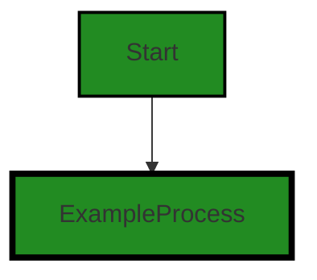

# Polyverse Boost-generated Source Analysis Details

## Source: ./src/test/suite/rightClick_ProcessFolder_command.test.ts
Date Generated: Friday, September 8, 2023 at 9:40:57 PM PDT


---

### Boost Architectural Quick Summary Security Report

Last Updated: Friday, September 8, 2023 at 9:40:40 PM PDT


Executive Report:

1. **Architectural Impact**: The analysis of this file has not revealed any severe issues.
2. **Risk Analysis**: The analysis of this file has not revealed any severe issues.
3. **Potential Customer Impact**: Based on the analysis, there are no severe issues that could potentially impact customers.
4. **Performance Issues**: Our analysis did not identify any explicit performance issues in the file.
5. **Risk Assessment**: Based on the current analysis of this file, no severe issues have been found. However, this doesn't guarantee that the file is risk-free.

Highlights:

- No severe issues were identified in the current analysis of this file.


---

### Boost Architectural Quick Summary Performance Report

Last Updated: Friday, September 8, 2023 at 9:40:50 PM PDT


Executive Report:

1. **Architectural Impact**: The analysis of this file has not revealed any severe issues.
2. **Risk Analysis**: The analysis of this file has not revealed any severe issues.
3. **Potential Customer Impact**: Based on the analysis, there are no severe issues that could potentially impact customers.
4. **Performance Issues**: Our analysis did not identify any explicit performance issues in the file.
5. **Risk Assessment**: Based on the current analysis of this file, no severe issues have been found. However, this doesn't guarantee that the file is risk-free.

Highlights:

- No severe issues were identified in the current analysis of this file.


---

### Boost Architectural Quick Summary Compliance Report

Last Updated: Friday, September 8, 2023 at 9:41:00 PM PDT


Executive Report:

1. **Architectural Impact**: The analysis of this file has not revealed any severe issues.
2. **Risk Analysis**: The analysis of this file has not revealed any severe issues.
3. **Potential Customer Impact**: Based on the analysis, there are no severe issues that could potentially impact customers.
4. **Performance Issues**: Our analysis did not identify any explicit performance issues in the file.
5. **Risk Assessment**: Based on the current analysis of this file, no severe issues have been found. However, this doesn't guarantee that the file is risk-free.

Highlights:

- No severe issues were identified in the current analysis of this file.

---
## Detailed Analysis:

### Cell 0:
## Original Code:

### Programming Language: typescript
### ./src/test/suite/rightClick_ProcessFolder_command.test.ts line 0

```typescript
suite('Right Click Process Folder Command', function() {

    this.timeout(20000); // set test timeout to be 20 seconds
  
    test('Right Click Process Folder Command Test', async function() {
  
      console.warn('Simulating Right Click Process Folder Command Test');
    });
  });

```
## Boost Analysis:


---

### Boost Code Explanation

Last Updated: Wednesday, July 12, 2023 at 1:23:01 PM PDT

This code is written in JavaScript and it uses Mocha.js, a JavaScript test framework running on Node.js, for unit testing. 

Let's break down the code:

1. `suite('Right Click Process Folder Command', function() {...});`: This line defines a test suite. A test suite is a collection of tests that are intended to be used to test a specific behavior of a software program. In this case, the test suite is for 'Right Click Process Folder Command'.

2. `this.timeout(20000);`: This line sets the maximum time that each test in the suite is allowed to run before it is considered a failure. The time is specified in milliseconds, so this line sets the timeout to be 20 seconds. This is a feature of Mocha.js to prevent tests from running indefinitely.

3. `test('Right Click Process Folder Command Test', async function() {...});`: This line defines a test case. A test case is a specific condition to check against the program to determine if the feature is working as expected. In this case, the test case is for 'Right Click Process Folder Command Test'.

4. `console.warn('Simulating Right Click Process Folder Command Test');`: This line logs a warning message to the console. This is typically used for debugging purposes to track the execution of the code.

As for the algorithm used, it's a simple linear execution. The test suite is defined, the timeout is set, and then the test case is defined and executed.

With regards to architectural guidelines, since no special architectural guidelines or constraints were provided for the software project, the code seems to follow standard practices for writing unit tests in Mocha.js.

For more information about Mocha.js, you can visit the official website: [Mocha.js](https://mochajs.org/)


---

### Boost Flow Diagram

Last Updated: Friday, September 8, 2023 at 9:40:29 PM PDT




---

### Boost Source-Level Security Analysis

Last Updated: Friday, September 8, 2023 at 9:40:36 PM PDT

**No bugs found**


---

### Boost Source-Level Performance Analysis

Last Updated: Friday, September 8, 2023 at 9:40:46 PM PDT

**No bugs found**


---

### Boost Source-Level Data and Privacy Compliance Analysis

Last Updated: Friday, September 8, 2023 at 9:40:57 PM PDT

**No bugs found**

