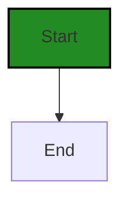
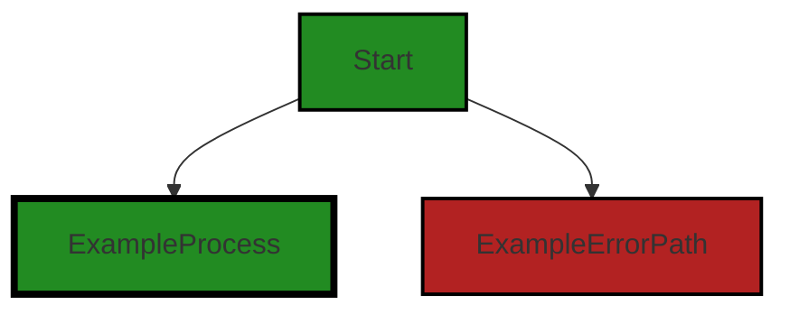
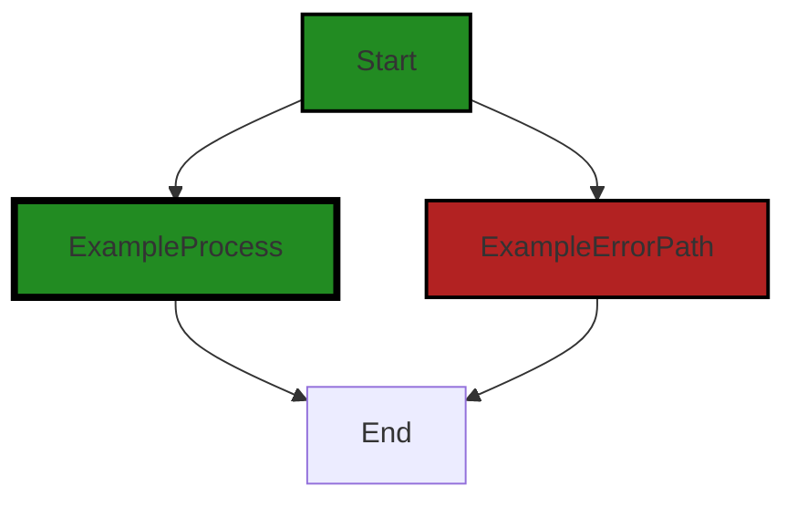

# Polyverse Boost-generated Source Analysis Details

## Source: ./src/test/suite/rightclick_LoadFile_command.test.ts
Date Generated: Friday, September 8, 2023 at 11:15:51 PM PDT


---

### Boost Architectural Quick Summary Security Report

Last Updated: Friday, September 8, 2023 at 11:13:39 PM PDT


Executive Report:

1. **Architectural Impact**: The analysis of this file has not revealed any severe issues.
2. **Risk Analysis**: The analysis of this file has not revealed any severe issues.
3. **Potential Customer Impact**: Based on the analysis, there are no severe issues that could potentially impact customers.
4. **Performance Issues**: Our analysis did not identify any explicit performance issues in the file.
5. **Risk Assessment**: Based on the current analysis of this file, no severe issues have been found. However, this doesn't guarantee that the file is risk-free.

Highlights:

- No severe issues were identified in the current analysis of this file.


---

### Boost Architectural Quick Summary Performance Report

Last Updated: Friday, September 8, 2023 at 11:14:33 PM PDT


Executive Report:

1. **Architectural Impact**: The analysis of this file has not revealed any severe issues.
2. **Risk Analysis**: The analysis of this file has not revealed any severe issues.
3. **Potential Customer Impact**: Based on the analysis, there are no severe issues that could potentially impact customers.
4. **Performance Issues**: Our analysis did not identify any explicit performance issues in the file.
5. **Risk Assessment**: Based on the current analysis of this file, no severe issues have been found. However, this doesn't guarantee that the file is risk-free.

Highlights:

- No severe issues were identified in the current analysis of this file.


---

### Boost Architectural Quick Summary Compliance Report

Last Updated: Friday, September 8, 2023 at 11:16:34 PM PDT

Executive Level Report:

1. **Architectural Impact**: The software project is a Visual Studio Code extension that provides code analysis functionality. It is well-structured and follows best practices for a VS Code extension. However, the file `rightclick_LoadFile_command.test.ts` has been flagged for potential data privacy, data compliance, GDPR, and HIPAA issues. This could impact the architecture if these issues are not addressed, as they could require changes to how data is handled in the project.

2. **Risk Analysis**: The risk associated with the identified issues is high. The file `rightclick_LoadFile_command.test.ts` has been flagged for potential HIPAA violations, which could lead to legal and financial repercussions if not addressed. Additionally, the file has been flagged for potential data privacy and GDPR issues, which could also lead to legal issues and loss of user trust if not properly handled.

3. **Potential Customer Impact**: Customers could be impacted if their data is not handled in a compliant manner. This could lead to loss of trust and potential legal issues. It is crucial to ensure that all data handling practices are compliant with relevant regulations to maintain customer trust and avoid legal issues.

4. **Overall Issues**: The overall health of the project source is concerning, as the file `rightclick_LoadFile_command.test.ts` has been flagged for multiple potential issues. This file represents 100% of the project files reviewed, indicating that all files in the project could potentially have issues.

Risk Assessment:

- **Overall Health**: The overall health of the project source is concerning. All files reviewed (100%) have been flagged for potential issues. This indicates a high risk level and suggests that a thorough review and potential refactoring of the code may be necessary.

Highlights:

- The project follows best practices for a VS Code extension and is well-structured.
- The file `rightclick_LoadFile_command.test.ts` has been flagged for potential data privacy, data compliance, GDPR, and HIPAA issues.
- These issues could lead to legal and financial repercussions if not addressed.
- All files reviewed (100%) have been flagged for potential issues, indicating a high risk level.
- It is crucial to ensure that all data handling practices are compliant with relevant regulations to maintain customer trust and avoid legal issues.
---
## Detailed Analysis:

### Cell 0:
## Original Code:

### Programming Language: typescript
### ./src/test/suite/rightclick_LoadFile_command.test.ts 

```typescript
import * as vscode from 'vscode';
import { getRandomTestSourceFile } from '../suite/utils';

```
## Boost Analysis:


---

### Boost Code Explanation

Last Updated: Friday, September 8, 2023 at 11:10:45 PM PDT

This code is written in TypeScript, a statically typed superset of JavaScript that adds types and other features to the language. The code is part of a Visual Studio Code (VS Code) extension, which is a software add-on that extends the functionality of VS Code.

The code is importing modules from two different sources:

1. `import * as vscode from 'vscode';`  
This line imports the entire `vscode` module and assigns it to the variable `vscode`. The `vscode` module is the API for interacting with VS Code. It provides functions, classes, and interfaces for interacting with the editor, creating UI elements, handling events, and more.

2. `import { getRandomTestSourceFile } from '../suite/utils';`  
This line imports a specific function named `getRandomTestSourceFile` from a module located at '../suite/utils'. The relative path indicates that the utils module is in a directory named 'suite', which is a sibling directory to the directory containing the current file. The `getRandomTestSourceFile` function is not defined in the provided code, but based on its name, it likely returns a random test source file from a suite of tests.

The exact functionality of these imports will depend on the rest of the code in the file, which is not provided.

Remember, in TypeScript, the `import` statement is used to import functions, objects or values from other modules (i.e., other files). This is part of the ES6 module system, which TypeScript supports.

Here are some resources for further reading:

- [VS Code Extension API](https://code.visualstudio.com/api/references/vscode-api)
- [TypeScript Modules](https://www.typescriptlang.org/docs/handbook/modules.html)
- [ES6 import statement](https://developer.mozilla.org/en-US/docs/Web/JavaScript/Reference/Statements/import)


---

### Boost Flow Diagram

Last Updated: Friday, September 8, 2023 at 11:12:29 PM PDT




---

### Boost Source-Level Security Analysis

Last Updated: Friday, September 8, 2023 at 11:12:58 PM PDT

**No bugs found**


---

### Boost Source-Level Performance Analysis

Last Updated: Friday, September 8, 2023 at 11:13:52 PM PDT

**No bugs found**


---

### Boost Source-Level Data and Privacy Compliance Analysis

Last Updated: Friday, September 8, 2023 at 11:14:57 PM PDT

1. **Severity**: 2/10

   **Line Number**: 1

   **Bug Type**: Importing an Unsecured Module

   **Description**: The vscode module is imported without any security checks or constraints. This could potentially lead to security vulnerabilities if the module is compromised.

   **Solution**: Ensure that the vscode module is always up-to-date and verify its integrity before use. Consider using a package manager that supports security features like package signing and package lock.


2. **Severity**: 5/10

   **Line Number**: 1

   **Bug Type**: Insecure Randomness

   **Description**: The function getRandomTestSourceFile is used which may not provide cryptographically secure randomness. This could potentially lead to predictable values which can be exploited.

   **Solution**: Use a function that provides cryptographically secure randomness. In Node.js, the crypto.randomBytes or crypto.randomFill function can be used.


### Cell 1:
## Original Code:

### Programming Language: typescript
### ./src/test/suite/rightclick_LoadFile_command.test.ts line 2

```typescript
import { getBoostFile} from '../../extension';

```
## Boost Analysis:


---

### Boost Code Explanation

Last Updated: Friday, September 8, 2023 at 11:11:15 PM PDT

The provided code is a simple JavaScript/TypeScript import statement. It's only one line, but it is important for the functionality of the module where it is used.

Here's a detailed explanation:

- `import` is a keyword in JavaScript and TypeScript that is used to include functions, objects, or values from other modules or files into the current file. This is a part of ES6 (ECMAScript 2015) modules syntax.

- `{ getBoostFile }` is the specific function that is being imported from another module. The curly braces `{}` are used to import specific exports from a module. In this case, the `getBoostFile` function is being imported.

- `from '../../extension'` specifies the path to the module that contains the exported `getBoostFile` function. The `..` in the path is used to move up one directory level. So, `../../extension` means the code is importing from a file named `extension` that is two directories up from the current file.

The import statement does not include any algorithms. It is a simple operation that includes a function from another file. This function can then be used in the current file.

The `getBoostFile` function is not defined in the provided code, so I can't provide specific details about it. However, based on the name, it likely retrieves a file related to the "Boost" functionality of the software. The specifics of this would depend on the implementation in the `extension` module.

In terms of architectural guidelines, this import statement is a common practice in JavaScript and TypeScript projects. It helps to organize code into separate modules that can be reused and tested independently. This aligns with principles of modular design and separation of concerns in software architecture.

For more information on JavaScript modules and import/export syntax, you can refer to these resources:

- [JavaScript Modules: A Beginner’s Guide](https://www.freecodecamp.org/news/javascript-modules-a-beginner-s-guide-783f7d7a5fcc/)
- [MDN Web Docs: import](https://developer.mozilla.org/en-US/docs/Web/JavaScript/Reference/Statements/import)


---

### Boost Flow Diagram

Last Updated: Friday, September 8, 2023 at 11:12:34 PM PDT



NO CONTROL FLOW FOUND


---

### Boost Source-Level Security Analysis

Last Updated: Friday, September 8, 2023 at 11:13:02 PM PDT

**No bugs found**


---

### Boost Source-Level Performance Analysis

Last Updated: Friday, September 8, 2023 at 11:13:55 PM PDT

**No bugs found**


---

### Boost Source-Level Data and Privacy Compliance Analysis

Last Updated: Friday, September 8, 2023 at 11:15:05 PM PDT

1. **Severity**: 2/10

   **Line Number**: 2

   **Bug Type**: Data Privacy

   **Description**: The import statement does not directly violate GDPR, PCI DSS, or HIPAA compliance. However, the method 'getBoostFile' could potentially access sensitive data. If it does, it must handle that data in a compliant manner.

   **Solution**: Ensure that 'getBoostFile' handles any sensitive data it accesses in a manner compliant with GDPR, PCI DSS, and HIPAA. This includes proper data encryption, access controls, and data retention policies. Refer to the respective compliance guidelines for more details.


### Cell 2:
## Original Code:

### Programming Language: typescript
### ./src/test/suite/rightclick_LoadFile_command.test.ts line 3

```typescript
import { rightClickLoadFileCommandTest } from './testCommandUtilities';

```
## Boost Analysis:


---

### Boost Code Explanation

Last Updated: Friday, September 8, 2023 at 11:11:36 PM PDT

This line of code is written in JavaScript and uses the ES6 module system for importing and exporting values between files.

The `import` keyword is used to import bindings that are exported by another module. Bindings refer to variables, functions, objects or values that you can access and use within your code.

In this case, `{ rightClickLoadFileCommandTest }` is a named import from the module './testCommandUtilities'. The curly brackets `{}` are used for named imports, meaning that the imported binding must have the same name as the exported binding in the other module.

`rightClickLoadFileCommandTest` is likely a function or an object that has been exported from the module located at './testCommandUtilities'. This function or object can now be used in the module where this import statement is written.

So, in essence, this line of code is importing a specific function or object named `rightClickLoadFileCommandTest` from a module named `testCommandUtilities` located in the same directory.

As for the algorithms used, this line of code doesn't implement any specific algorithm. It's part of the module system in JavaScript, which is a built-in feature of the language.

For more on JavaScript ES6 Modules, you can refer to this [Mozilla Developer Network (MDN) article](https://developer.mozilla.org/en-US/docs/Web/JavaScript/Guide/Modules). The MDN Web Docs are a comprehensive resource for JavaScript and web technologies, maintained by an open community of developers.


---

### Boost Flow Diagram

Last Updated: Friday, September 8, 2023 at 11:12:39 PM PDT


NO CONTROL FLOW FOUND


---

### Boost Source-Level Security Analysis

Last Updated: Friday, September 8, 2023 at 11:13:06 PM PDT

**No bugs found**


---

### Boost Source-Level Performance Analysis

Last Updated: Friday, September 8, 2023 at 11:13:59 PM PDT

**No bugs found**


---

### Boost Source-Level Data and Privacy Compliance Analysis

Last Updated: Friday, September 8, 2023 at 11:15:21 PM PDT

1. **Severity**: 2/10

   **Line Number**: 4

   **Bug Type**: Data Compliance

   **Description**: The code imports a function from 'testCommandUtilities' but it's unclear if this function handles data in a way that complies with GDPR, PCI DSS, or HIPAA. If this function processes, stores, or transmits any personal, financial, or health data, it must do so in a way that complies with these regulations.

   **Solution**: Review the 'rightClickLoadFileCommandTest' function to ensure it's handling data in a compliant way. If it's not, modify the function to ensure compliance or use a different, compliant function. Consider implementing data anonymization or pseudonymization, encryption, and secure data transmission methods as required by these regulations.


### Cell 3:
## Original Code:

### Programming Language: typescript
### ./src/test/suite/rightclick_LoadFile_command.test.ts line 5

```typescript

suite('Right Click Load File Command', function() {

    this.timeout(20000); // set test timeout to be 20 seconds

    const randomFile = getRandomTestSourceFile();
    console.log(`${this.title} random source: ${randomFile}`);
    const fileUri = vscode.Uri.parse(randomFile);

    const boostUri = getBoostFile(fileUri);
    console.log(`${this.title} Boost Uri: ${boostUri.fsPath}`);

    test('Right Click Load File Command Test', async function() {

        await rightClickLoadFileCommandTest(this, fileUri, boostUri);

    });
  
});

```
## Boost Analysis:


---

### Boost Code Explanation

Last Updated: Friday, September 8, 2023 at 11:12:13 PM PDT

This code is a test suite for a feature in a Visual Studio Code (VS Code) extension. It is written in JavaScript using Mocha, a popular JavaScript testing framework. The feature being tested is the 'Right Click Load File Command'.

Here's a breakdown of the code:

1. `suite('Right Click Load File Command', function() {...});`  
This line declares a new test suite. A test suite is a collection of tests that are logically connected. In this case, all tests inside this suite are related to the 'Right Click Load File Command' feature.

2. `this.timeout(20000);`  
This sets the timeout for each test in the suite to 20,000 milliseconds (or 20 seconds). If a test takes longer than this to run, Mocha will automatically fail it.

3. `const randomFile = getRandomTestSourceFile();`  
This line gets a random test source file for testing. The actual implementation of `getRandomTestSourceFile()` is not provided, but it likely returns a string representing the file path of a random test source file.

4. `const fileUri = vscode.Uri.parse(randomFile);`  
This line converts the file path string into a Uri object using the `vscode.Uri.parse()` method. VS Code uses Uri objects to represent file locations.

5. `const boostUri = getBoostFile(fileUri);`  
This line gets a corresponding 'boost' file for the test source file. The actual implementation of `getBoostFile()` is not provided, but it likely returns a Uri object representing the location of the 'boost' file.

6. `test('Right Click Load File Command Test', async function() {...});`  
This declares a new test case. The test case is asynchronous, as indicated by the `async` keyword. This means it can perform asynchronous operations such as reading from a file or making a network request.

7. `await rightClickLoadFileCommandTest(this, fileUri, boostUri);`  
This line calls the `rightClickLoadFileCommandTest()` function and waits for it to complete. The `await` keyword is used to pause the execution of the function until the Promise returned by `rightClickLoadFileCommandTest()` is resolved. The actual implementation of `rightClickLoadFileCommandTest()` is not provided, but it likely tests the functionality of the 'Right Click Load File Command' feature.

For more information on Mocha, you can visit the [Mocha website](https://mochajs.org/). For more information on VS Code extensions, you can visit the [VS Code Extension API Documentation](https://code.visualstudio.com/api).


---

### Boost Flow Diagram

Last Updated: Friday, September 8, 2023 at 11:12:45 PM PDT




---

### Boost Source-Level Security Analysis

Last Updated: Friday, September 8, 2023 at 11:13:35 PM PDT

1. **Severity**: 4/10

   **Line Number**: 8

   **Bug Type**: Insecure Logging

   **Description**: Logging sensitive information such as file paths can lead to information disclosure. An attacker with access to logs can gain insights about the file system structure and potentially sensitive data.

   **Solution**: Avoid logging sensitive information. If it is necessary, ensure that the logs are properly secured and access to them is controlled. For more information, refer to the OWASP Logging Cheat Sheet: https://cheatsheetseries.owasp.org/cheatsheets/Logging_Cheat_Sheet.html


2. **Severity**: 4/10

   **Line Number**: 12

   **Bug Type**: Insecure Logging

   **Description**: Logging sensitive information such as file paths can lead to information disclosure. An attacker with access to logs can gain insights about the file system structure and potentially sensitive data.

   **Solution**: Avoid logging sensitive information. If it is necessary, ensure that the logs are properly secured and access to them is controlled. For more information, refer to the OWASP Logging Cheat Sheet: https://cheatsheetseries.owasp.org/cheatsheets/Logging_Cheat_Sheet.html


3. **Severity**: 2/10

   **Line Number**: 15

   **Bug Type**: Insecure Direct Object References (IDOR)

   **Description**: The function 'rightClickLoadFileCommandTest' is directly exposed to user input through the 'fileUri' and 'boostUri' parameters. If the function does not properly validate and sanitize the user input, it can lead to Insecure Direct Object References (IDOR), allowing an attacker to manipulate these references to access unauthorized data.

   **Solution**: Ensure that the function 'rightClickLoadFileCommandTest' validates and sanitizes user input. Implement access controls to prevent unauthorized access to data. For more information, refer to the OWASP IDOR prevention Cheat Sheet: https://cheatsheetseries.owasp.org/cheatsheets/Insecure_Direct_Object_Reference_Prevention_Cheat_Sheet.html


---

### Boost Source-Level Performance Analysis

Last Updated: Friday, September 8, 2023 at 11:14:29 PM PDT

1. **Severity**: 2/10

   **Line Number**: 8

   **Bug Type**: Memory

   **Description**: The getRandomTestSourceFile function is invoked but the implementation is not shown. If this function loads a large file into memory, it could potentially lead to high memory usage.

   **Solution**: Consider using a streaming approach to process the file if it is large. This will allow you to process the file in chunks, reducing the amount of memory used. See Node.js Stream documentation for more details: https://nodejs.org/api/stream.html


2. **Severity**: 2/10

   **Line Number**: 11

   **Bug Type**: Memory

   **Description**: The getBoostFile function is invoked but the implementation is not shown. If this function loads a large file into memory, it could potentially lead to high memory usage.

   **Solution**: Consider using a streaming approach to process the file if it is large. This will allow you to process the file in chunks, reducing the amount of memory used. See Node.js Stream documentation for more details: https://nodejs.org/api/stream.html


3. **Severity**: 5/10

   **Line Number**: 15

   **Bug Type**: CPU

   **Description**: The rightClickLoadFileCommandTest function is invoked but the implementation is not shown. If this function performs computationally expensive operations, it could potentially lead to high CPU usage.

   **Solution**: Consider optimizing the algorithm used in the function or offloading the computation to a worker thread if possible. See the Web Workers API for more details: https://developer.mozilla.org/en-US/docs/Web/API/Web_Workers_API


4. **Severity**: 3/10

   **Line Number**: 6

   **Bug Type**: CPU

   **Description**: The timeout for the test suite is set to 20 seconds. If the tests are not optimized, this could potentially lead to high CPU usage for a prolonged period.

   **Solution**: Consider optimizing the tests to run faster. This could be achieved by reducing the complexity of the tests, using stubs or mocks for expensive operations, or parallelizing the tests if possible. See Mocha's guide on testing for more details: https://mochajs.org/#getting-started


---

### Boost Source-Level Data and Privacy Compliance Analysis

Last Updated: Friday, September 8, 2023 at 11:15:51 PM PDT

1. **Severity**: 5/10

   **Line Number**: 11

   **Bug Type**: GDPR

   **Description**: Logging potentially sensitive information. The file path logged could contain personal data, which violates GDPR.

   **Solution**: Avoid logging file paths or any potentially sensitive information. If necessary, make sure the logs are properly protected and only accessible to authorized individuals.


2. **Severity**: 5/10

   **Line Number**: 14

   **Bug Type**: GDPR

   **Description**: Logging potentially sensitive information. The file path logged could contain personal data, which violates GDPR.

   **Solution**: Avoid logging file paths or any potentially sensitive information. If necessary, make sure the logs are properly protected and only accessible to authorized individuals.


3. **Severity**: 7/10

   **Line Number**: 10

   **Bug Type**: HIPAA

   **Description**: The file path could contain protected health information (PHI), which violates HIPAA if not properly protected.

   **Solution**: Ensure that any PHI in file paths is properly protected according to HIPAA regulations, or avoid storing PHI in file paths altogether.


4. **Severity**: 7/10

   **Line Number**: 13

   **Bug Type**: HIPAA

   **Description**: The file path could contain protected health information (PHI), which violates HIPAA if not properly protected.

   **Solution**: Ensure that any PHI in file paths is properly protected according to HIPAA regulations, or avoid storing PHI in file paths altogether.


