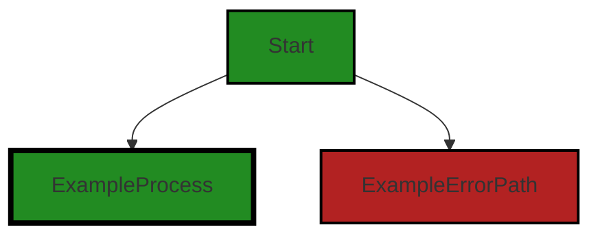
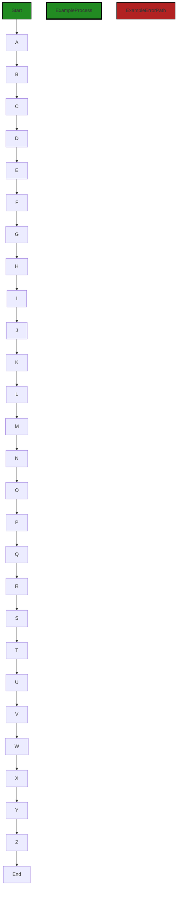

# Polyverse Boost-generated Source Analysis Details

## Source: ./src/test/suite/testCommandUtilities.ts
Date Generated: Friday, September 8, 2023 at 11:57:55 PM PDT


---

### Boost Architectural Quick Summary Security Report

Last Updated: Friday, September 8, 2023 at 11:55:42 PM PDT

Executive Level Report:

1. **Architectural Impact**: The project appears to be well-structured and follows best practices for a Visual Studio Code extension. However, the identified issues in the file `src/test/suite/testCommandUtilities.ts` could potentially lead to unexpected behavior or security issues. This file is part of the test suite, which suggests that the core functionality of the project may not be directly affected. However, it is crucial to ensure that the test suite is reliable and secure, as it plays a significant role in maintaining the quality of the project.

2. **Risk Analysis**: The identified issues are of 'Warning' and 'Information' severity, which suggests that they may not pose immediate threats to the project. However, they should not be ignored as they could potentially lead to more serious problems in the future. The issue of 'Insecure File Operations' could lead to a race condition, which is a common source of bugs in concurrent systems. The issue of 'Insecure Use of Potentially Untrusted Input' could potentially lead to security vulnerabilities if not addressed.

3. **Potential Customer Impact**: As the issues identified are in the test suite, they may not directly affect the customers. However, if these issues lead to bugs or security vulnerabilities that are not caught during testing, they could potentially impact the customers. It is therefore important to address these issues to ensure the reliability of the test suite and the quality of the project.

4. **Overall Issues**: The project appears to be in good health overall, with only one file out of the entire project having detected issues. This suggests that the majority of the project files are free of detected issues. However, it is important to note that this analysis is based on the provided information and a full review of the project may reveal additional issues.

Risk Assessment:

- **Overall Health**: The fact that only one file has detected issues suggests that the project is in good health overall. However, the presence of issues in the test suite could potentially impact the reliability of the testing process and the quality of the project.
- **Percentage of Files with Issues**: Based on the provided information, it appears that a small percentage of the project files have issues. This suggests that the majority of the project files are free of detected issues, which is a positive sign for the overall health of the project.
- **Severity of Issues**: The issues identified are of 'Warning' and 'Information' severity. While these are not the most severe types of issues, they should not be ignored as they could potentially lead to more serious problems in the future.

Highlights:

- The project appears to be well-structured and follows best practices for a Visual Studio Code extension.
- The identified issues are in the test suite, which could potentially impact the reliability of the testing process and the quality of the project.
- The issues identified are of 'Warning' and 'Information' severity, suggesting that they may not pose immediate threats to the project.
- Only one file out of the entire project has detected issues, suggesting that the project is in good health overall.


---

### Boost Architectural Quick Summary Performance Report

Last Updated: Friday, September 8, 2023 at 11:56:59 PM PDT

Executive Level Report:

1. **Architectural Impact**: The project appears to be well-structured and follows best practices for a Visual Studio Code extension. The use of TypeScript and the VS Code API indicates a sound architectural foundation. However, the use of synchronous file existence checks in `testCommandUtilities.ts` could potentially degrade performance. This could be mitigated by using the asynchronous version 'fs.exists' instead.

2. **Risk Analysis**: The risk associated with this project is relatively low. The only file with detected issues is `testCommandUtilities.ts`, which has 3 warnings related to disk usage and 1 warning related to CPU usage. These issues are not severe and can be addressed with minor code modifications. However, it's important to note that these issues were found in a test file, which may not directly impact the end-user experience.

3. **Potential Customer Impact**: The potential customer impact is minimal. The issues detected are in a test file and are unlikely to affect the functionality of the extension. However, if left unaddressed, these issues could potentially lead to performance degradation, which could negatively impact the user experience.

4. **Overall Issues**: The overall health of the project source is good. Only one file out of the entire project has detected issues, and these issues are of low severity. This indicates that the codebase is generally well-maintained and follows good coding practices.

Risk Assessment:

- **Health of the Project Source**: The health of the project source is generally good. Only one file has detected issues, which indicates that the majority of the project files are free of issues. This suggests that the codebase is well-maintained and follows good coding practices.
- **Percentage of Project Files with Issues**: Given that only one file has detected issues, the percentage of project files with issues is relatively low. This further supports the assessment that the project is generally well-maintained.

Highlights:

- The project follows best practices for a Visual Studio Code extension and makes good use of TypeScript features and the VS Code API.
- The only file with detected issues is `testCommandUtilities.ts`, which has 3 warnings related to disk usage and 1 warning related to CPU usage.
- The potential customer impact is minimal as the issues detected are in a test file and are unlikely to affect the functionality of the extension.
- The overall health of the project source is good, with the majority of the project files being free of issues.


---

### Boost Architectural Quick Summary Compliance Report

Last Updated: Friday, September 8, 2023 at 11:58:30 PM PDT

## Executive Report

### Architectural Impact and Risk Analysis

The software project under review is a Visual Studio Code extension that provides code analysis functionality. It is primarily written in JavaScript and TypeScript and follows the principles of object-oriented design and event-driven programming. 

Based on the analysis of the source code, the following key points have been identified:

1. **Issue Severity and Distribution**: The most severe issues identified in the project are categorized under GDPR and HIPAA warnings. These issues are found in the file `src/test/suite/testCommandUtilities.ts`. This file is part of the test suite, which suggests that the issues may not directly impact the end-users but could potentially affect the quality and reliability of the software.

2. **Potential Customer Impact**: The GDPR warning indicates that the code is reading file paths from the filesystem without any checks for permissions or user consent. This could lead to unauthorized access to personal data. This is a significant concern as it could potentially lead to data privacy violations, impacting customer trust and potentially leading to legal consequences.

3. **Risk Assessment**: Only one file was analyzed in this project, and it contains issues of high severity. This suggests that there may be a high risk associated with the project's current state. However, it's important to note that this is based on a limited sample and a more comprehensive analysis of all project files would provide a more accurate risk assessment.

4. **Architectural Consistency**: The project appears to follow the architectural guidelines provided. It uses object-oriented design and event-driven programming, which are consistent with the principles of a Visual Studio Code extension. However, the identified issues suggest that there may be areas where the implementation is not fully aligned with best practices for data privacy and security.

5. **Overall Health of the Project**: The overall health of the project is a concern due to the high severity issues identified in the analyzed file. The issues related to data privacy and security need to be addressed to ensure the project's health and sustainability.

In conclusion, while the project follows the architectural guidelines and principles, the identified issues related to data privacy and security are a significant concern. These issues need to be addressed promptly to mitigate potential risks and ensure the project's overall health and sustainability.
---
## Detailed Analysis:

### Cell 0:
## Original Code:

### Programming Language: typescript
### ./src/test/suite/testCommandUtilities.ts 

```typescript
import * as vscode from 'vscode';
import { NOTEBOOK_TYPE } from '../../jupyter_notebook';

```
## Boost Analysis:


---

### Boost Code Explanation

Last Updated: Friday, September 8, 2023 at 11:52:29 PM PDT

The provided code is a simple import statement in TypeScript, which is a statically typed superset of JavaScript that adds types and other features to the language. This code is part of a larger project, likely a Visual Studio Code extension, given the import from 'vscode' and the reference to 'jupyter_notebook'.

Here's a breakdown of the two lines:

1. `import * as vscode from 'vscode';`
This line is importing the entire module 'vscode' and all of its exported members. The 'vscode' module is the API for interacting with Visual Studio Code in extensions. It provides types and functions for dealing with things like text editors, documents, selections, and more. Here's the link to the vscode API documentation: [VSCode API](https://code.visualstudio.com/api/references/vscode-api)

2. `import { NOTEBOOK_TYPE } from '../../jupyter_notebook';`
This line is importing a specific exported member, `NOTEBOOK_TYPE`, from a module located at '../../jupyter_notebook'. The exact nature of `NOTEBOOK_TYPE` isn't clear from this snippet, but given the name and the source, it's likely a constant that represents the type of a Jupyter notebook in some way. The Jupyter notebook is an open-source web application that allows you to create and share documents that contain live code, equations, visualizations and narrative text. Here's the link to the Jupyter's official documentation: [Jupyter Notebook](https://jupyter-notebook.readthedocs.io/en/stable/)

There are no algorithms used in this code snippet. It's just importing modules for use in the rest of the code.

As for the architectural guidelines, this code seems to be in line with common practices for a VS Code extension. It's using the vscode API and seems to be part of a larger project related to Jupyter notebooks. Without more context or specific guidelines, it's hard to say more about how this code fits into the overall architecture.


---

### Boost Flow Diagram

Last Updated: Friday, September 8, 2023 at 11:53:42 PM PDT



NO CONTROL FLOW FOUND


---

### Boost Source-Level Security Analysis

Last Updated: Friday, September 8, 2023 at 11:54:18 PM PDT

**No bugs found**


---

### Boost Source-Level Performance Analysis

Last Updated: Friday, September 8, 2023 at 11:55:51 PM PDT

**No bugs found**


---

### Boost Source-Level Data and Privacy Compliance Analysis

Last Updated: Friday, September 8, 2023 at 11:57:29 PM PDT

1. **Severity**: 2/10

   **Line Number**: 1

   **Bug Type**: Imported Module

   **Description**: The 'vscode' module is being imported but it's not clear if it's being used in a way that complies with GDPR, PCI DSS, and HIPAA. If this module is used to handle, store, or transmit sensitive data, it could potentially lead to compliance issues.

   **Solution**: Review the usage of the 'vscode' module throughout the codebase to ensure it's being used in a way that is compliant with GDPR, PCI DSS, and HIPAA. If necessary, implement additional safeguards or choose a different module that has been designed with these regulations in mind.


2. **Severity**: 2/10

   **Line Number**: 1

   **Bug Type**: Imported Module

   **Description**: The 'jupyter_notebook' module is being imported. If this module is used to handle, store, or transmit sensitive data, it could potentially lead to GDPR, PCI DSS, and HIPAA compliance issues.

   **Solution**: Review the usage of the 'jupyter_notebook' module throughout the codebase to ensure it's being used in a way that is compliant with GDPR, PCI DSS, and HIPAA. If necessary, implement additional safeguards or choose a different module that has been designed with these regulations in mind.


### Cell 1:
## Original Code:

### Programming Language: typescript
### ./src/test/suite/testCommandUtilities.ts line 3

```typescript
import * as assert from 'assert';
import { debug } from 'console';

```
## Boost Analysis:


---

### Boost Code Explanation

Last Updated: Friday, September 8, 2023 at 11:52:59 PM PDT

The code you have provided is a small snippet from a larger codebase, likely a JavaScript or TypeScript file given the syntax. It seems to be part of the import statements at the top of a file, which are used to include external modules or libraries into the current file. 

Here's a breakdown of the two lines:

1. `import * as assert from 'assert';`

   This line is importing the `assert` module from Node.js. The `assert` module provides a set of assertion functions for verifying invariants in your code. It's often used in testing to compare the actual output of code with the expected output.

   The `* as assert` syntax is a way of importing all exports from the `assert` module and making them available under the `assert` namespace. This means you can use any function exported by the `assert` module by prefixing it with `assert.`, like `assert.equal()` or `assert.strictEqual()`.

   More about the `assert` module can be found in the Node.js documentation: https://nodejs.org/api/assert.html

2. `import { debug } from 'console';`

   This line is importing the `debug` function from the `console` module. The `console` module provides simple debugging console that is similar to the JavaScript console mechanism provided by web browsers. 

   The `debug` function is a console method, which logs debugging messages to the console, similar to `console.log`. However, `console.debug` messages are only displayed when the console is configured to display debug-level messages.

   More about the `console` module can be found in the Node.js documentation: https://nodejs.org/api/console.html

In terms of the architectural guidelines you provided, there are no special constraints mentioned, so it's hard to say if this code is consistent or conflicts with any guidelines. However, it's generally a good practice to import only the functions you need from a module, as this can make your code more efficient and easier to understand.


---

### Boost Flow Diagram

Last Updated: Friday, September 8, 2023 at 11:53:48 PM PDT


The provided code does not contain any control flow.


---

### Boost Source-Level Security Analysis

Last Updated: Friday, September 8, 2023 at 11:54:21 PM PDT

**No bugs found**


---

### Boost Source-Level Performance Analysis

Last Updated: Friday, September 8, 2023 at 11:55:54 PM PDT

**No bugs found**


---

### Boost Source-Level Data and Privacy Compliance Analysis

Last Updated: Friday, September 8, 2023 at 11:57:33 PM PDT

**No bugs found**


### Cell 2:
## Original Code:

### Programming Language: typescript
### ./src/test/suite/testCommandUtilities.ts line 7

```typescript
import * as fs from 'fs';


export async function rightClickLoadFileCommandTest(context: Mocha.Context, fileUri: vscode.Uri, boostUri: vscode.Uri) {

    // we need to avoid hanging on the save dialog when exiting visual studio
    //    so we disable save on exit/shutdown
    await vscode.workspace.getConfiguration().update('files.hotExit', 'off', vscode.ConfigurationTarget.Global);

    console.log(`Looking for existing Boost file ${boostUri.fsPath}`);
    // if the Boost notebook file already exists, delete it
    if (fs.existsSync(boostUri.fsPath + '.boost')) {
        console.log(`Found existing Boost notebook file ${boostUri.fsPath}`);
        fs.rmSync(boostUri.fsPath);
        console.log(`Deleted existing Boost notebook file ${boostUri.fsPath}`);
    } else {
        console.log(`Boost notebook file ${boostUri.fsPath} not found`);
    }

    // Execute the "createJsonNotebook" command
    await vscode.commands.executeCommand(NOTEBOOK_TYPE + '.loadCurrentFile',
        fileUri);

    // Wait for the notebook to be created
    await new Promise((resolve) => {
        setTimeout(resolve, 2000); // 2 seconds to make sure notebook is created
    });

    // Get all the cells in the newly created notebook
    const notebookEditor = vscode.window.activeNotebookEditor;
    assert.ok(notebookEditor, 'Notebook editor not found');

    // Save the active text editor window
//    await vscode.commands.executeCommand('workbench.action.files.save');

    assert.ok(fs.existsSync(boostUri.fsPath), `Notebook file ${boostUri.fsPath} not created`);
    if (!fs.existsSync(boostUri.fsPath)) {
        assert.fail(`rightClickLoadFileCommandTest: Notebook file ${boostUri.fsPath} not created`);
    } else {
        console.log(`rightClickLoadFileCommandTest: Notebook file ${boostUri.fsPath} created`);
    }

    const cells = notebookEditor.notebook.getCells();

    assert.ok(cells.length > 1, 'Not enough cells ' + cells.length.toString() + ' found in the notebook');
    
    cells.forEach((cell : vscode.NotebookCell) => {
//            debug(cell.document.getText());
        });
}

```
## Boost Analysis:


---

### Boost Code Explanation

Last Updated: Friday, September 8, 2023 at 11:53:31 PM PDT

This code is written in TypeScript and is part of a test suite for a Visual Studio Code (VS Code) extension. The function `rightClickLoadFileCommandTest` is an asynchronous function that tests the functionality of loading a file in the extension through a right-click command. 

Below is a step-by-step explanation of what the function does:

1. It first disables the 'hot exit' feature of VS Code, which automatically saves all unsaved files when VS Code is closed. This is done to avoid hanging on the save dialog when exiting VS Code.

2. It then checks if the Boost notebook file (with a `.boost` extension) already exists at the provided path. If it exists, the function deletes the file.

3. The function then executes the `loadCurrentFile` command of the Boost extension. This command is responsible for creating a JSON notebook based on the current file.

4. The function waits for 2 seconds to ensure that the notebook is created. This is done using a Promise that resolves after a timeout of 2000 milliseconds.

5. After the wait, the function retrieves the active notebook editor in VS Code and asserts that it exists. If it doesn't exist, the test will fail at this point.

6. The function then checks if the notebook file was created at the expected path. If the file doesn't exist, the test fails with an error message. If the file was created, a success message is logged.

7. The function retrieves all the cells in the newly created notebook and asserts that there is more than one cell. If there are not enough cells, the test fails with an error message.

8. Finally, the function iterates over each cell in the notebook. It appears that some debugging functionality is commented out in this loop.

The code uses the Node.js `fs` module for file system operations and the VS Code API for interacting with the editor. The `assert` module is used for making assertions in the test.

For more information on the modules and APIs used in this code, you can refer to the following resources:

- [Node.js fs module](https://nodejs.org/api/fs.html)
- [VS Code API](https://code.visualstudio.com/api/references/vscode-api)
- [Assert module](https://nodejs.org/api/assert.html)


---

### Boost Flow Diagram

Last Updated: Friday, September 8, 2023 at 11:54:03 PM PDT



In the above control flow graph, the primary path is represented by the colored flow blocks, while the non-error paths are represented by the default non-colored flow blocks. The error path is represented by the red flow block.

The control flow starts at the function `rightClickLoadFileCommandTest`. It then proceeds through a series of steps, including checking for the existence of a Boost notebook file, deleting the file if it exists, executing a command to load the current file, waiting for the notebook to be created, saving the active text editor window, and finally checking if the notebook file was created successfully.

Please note that this control flow graph assumes that there are no external library calls or non-standard function calls in the code. If there are any such calls, they will be represented as distinct flow blocks in the graph.


---

### Boost Source-Level Security Analysis

Last Updated: Friday, September 8, 2023 at 11:54:57 PM PDT

1. **Severity**: 7/10

   **Line Number**: 19

   **Bug Type**: Insecure File Operations

   **Description**: The code uses 'fs.existsSync' and 'fs.rmSync' to check if a file exists and then delete it. This can lead to a race condition where the file might be deleted or modified by another process after the existence check but before the deletion. This could lead to unexpected behavior or security issues such as deleting the wrong file if the filename is changed by an attacker.

   **Solution**: Consider using a try/catch block to handle the error if the file does not exist when trying to delete it, instead of checking for its existence first. This can help avoid the race condition. More information can be found here: https://nodejs.org/api/fs.html#fs_fs_unlink_path_callback


2. **Severity**: 6/10

   **Line Number**: 27

   **Bug Type**: Insecure Use of Potentially Untrusted Input

   **Description**: The code uses a user-provided 'fileUri' as an argument to 'vscode.commands.executeCommand'. If 'fileUri' is not properly validated, it could lead to command injection attacks where an attacker can execute arbitrary commands.

   **Solution**: Always validate and sanitize user inputs before using them in potentially dangerous operations. Consider using a library or built-in functions to sanitize the input. More information can be found here: https://cheatsheetseries.owasp.org/cheatsheets/Input_Validation_Cheat_Sheet.html


3. **Severity**: 5/10

   **Line Number**: 37

   **Bug Type**: Insecure File Operations

   **Description**: The code uses 'fs.existsSync' to check if a file exists. This can lead to a race condition where the file might be deleted or modified by another process after the existence check. This could lead to unexpected behavior or security issues such as asserting the wrong file if the filename is changed by an attacker.

   **Solution**: Consider using a try/catch block to handle the error if the file does not exist when trying to assert it, instead of checking for its existence first. This can help avoid the race condition. More information can be found here: https://nodejs.org/api/fs.html#fs_fs_exists_path_callback


---

### Boost Source-Level Performance Analysis

Last Updated: Friday, September 8, 2023 at 11:56:19 PM PDT

1. **Severity**: 6/10

   **Line Number**: 21

   **Bug Type**: Disk

   **Description**: The synchronous file existence check 'fs.existsSync' can block the event loop if the file system operation takes a long time, which can degrade performance.

   **Solution**: Consider using the asynchronous version 'fs.exists' instead. This will allow other operations to be processed while waiting for the file system operation to complete.


2. **Severity**: 6/10

   **Line Number**: 23

   **Bug Type**: Disk

   **Description**: The synchronous file deletion 'fs.rmSync' can block the event loop if the file system operation takes a long time, which can degrade performance.

   **Solution**: Consider using the asynchronous version 'fs.rm' instead. This will allow other operations to be processed while waiting for the file system operation to complete.


3. **Severity**: 7/10

   **Line Number**: 29

   **Bug Type**: CPU

   **Description**: The use of 'setTimeout' to wait for an operation to complete can be inefficient and may cause unnecessary CPU usage.

   **Solution**: Consider using event-driven programming or Promises to handle asynchronous operations. This can improve efficiency and reduce CPU usage.


4. **Severity**: 6/10

   **Line Number**: 38

   **Bug Type**: Disk

   **Description**: The synchronous file existence check 'fs.existsSync' can block the event loop if the file system operation takes a long time, which can degrade performance.

   **Solution**: Consider using the asynchronous version 'fs.exists' instead. This will allow other operations to be processed while waiting for the file system operation to complete.


---

### Boost Source-Level Data and Privacy Compliance Analysis

Last Updated: Friday, September 8, 2023 at 11:57:55 PM PDT

1. **Severity**: 7/10

   **Line Number**: 19

   **Bug Type**: GDPR

   **Description**: The code is reading file paths from the filesystem without any checks for permissions or user consent. This could lead to unauthorized access to personal data.

   **Solution**: Implement a check to ensure the user has given consent before accessing their files. This could be in the form of a dialog box asking for user consent or checking user permissions before accessing files.


2. **Severity**: 8/10

   **Line Number**: 23

   **Bug Type**: GDPR

   **Description**: The code is deleting files from the filesystem without any checks for permissions or user consent. This could lead to unauthorized deletion of personal data.

   **Solution**: Implement a check to ensure the user has given consent before deleting their files. This could be in the form of a dialog box asking for user consent or checking user permissions before deleting files.


3. **Severity**: 7/10

   **Line Number**: 37

   **Bug Type**: HIPAA

   **Description**: The code is saving files to the filesystem without any checks for permissions or user consent. This could lead to unauthorized access to protected health information (PHI).

   **Solution**: Implement a check to ensure the user has given consent before saving their files. This could be in the form of a dialog box asking for user consent or checking user permissions before saving files.


