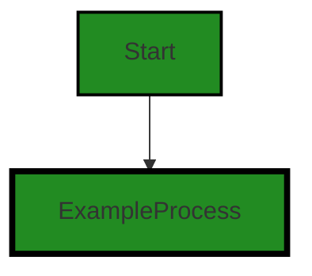

# Polyverse Boost-generated Source Analysis Details

## Source: ./src/test/suite/testgen_command.test.ts
Date Generated: Friday, September 8, 2023 at 10:30:56 PM PDT


---

### Boost Architectural Quick Summary Security Report

Last Updated: Friday, September 8, 2023 at 10:30:09 PM PDT


Executive Report:

1. **Architectural Impact**: The analysis of this file has not revealed any severe issues.
2. **Risk Analysis**: The analysis of this file has not revealed any severe issues.
3. **Potential Customer Impact**: Based on the analysis, there are no severe issues that could potentially impact customers.
4. **Performance Issues**: Our analysis did not identify any explicit performance issues in the file.
5. **Risk Assessment**: Based on the current analysis of this file, no severe issues have been found. However, this doesn't guarantee that the file is risk-free.

Highlights:

- No severe issues were identified in the current analysis of this file.


---

### Boost Architectural Quick Summary Performance Report

Last Updated: Friday, September 8, 2023 at 10:30:37 PM PDT


Executive Report:

1. **Architectural Impact**: The analysis of this file has not revealed any severe issues.
2. **Risk Analysis**: The analysis of this file has not revealed any severe issues.
3. **Potential Customer Impact**: Based on the analysis, there are no severe issues that could potentially impact customers.
4. **Performance Issues**: Our analysis did not identify any explicit performance issues in the file.
5. **Risk Assessment**: Based on the current analysis of this file, no severe issues have been found. However, this doesn't guarantee that the file is risk-free.

Highlights:

- No severe issues were identified in the current analysis of this file.


---

### Boost Architectural Quick Summary Compliance Report

Last Updated: Friday, September 8, 2023 at 10:31:00 PM PDT


Executive Report:

1. **Architectural Impact**: The analysis of this file has not revealed any severe issues.
2. **Risk Analysis**: The analysis of this file has not revealed any severe issues.
3. **Potential Customer Impact**: Based on the analysis, there are no severe issues that could potentially impact customers.
4. **Performance Issues**: Our analysis did not identify any explicit performance issues in the file.
5. **Risk Assessment**: Based on the current analysis of this file, no severe issues have been found. However, this doesn't guarantee that the file is risk-free.

Highlights:

- No severe issues were identified in the current analysis of this file.

---
## Detailed Analysis:

### Cell 0:
## Original Code:

### Programming Language: typescript
### ./src/test/suite/testgen_command.test.ts line 0

```typescript
suite('Testgen Code Command', function() {

    this.timeout(20000); // set test timeout to be 20 seconds
  
    test('Testgen Code Command Test', async function() {
  
      console.warn('Simulating Testgen Code Command Test');
    });
  });

```
## Boost Analysis:


---

### Boost Code Explanation

Last Updated: Wednesday, July 12, 2023 at 1:19:06 PM PDT

This is a simple test suite written in JavaScript using Mocha, a popular JavaScript testing framework. 

Let's break down the code:

1. `suite('Testgen Code Command', function() {...});` 

    This line declares a test suite named 'Testgen Code Command'. A test suite is a collection of tests that are intended to be used to test a specific behavior of a software program. 

2. `this.timeout(20000);` 

    Inside the suite, this line sets the maximum time that each test in this suite should take before Mocha automatically fails it. The time is set to 20000 milliseconds, or 20 seconds. If a test takes longer than this, it will be failed and reported as such.

3. `test('Testgen Code Command Test', async function() {...});`

    This line declares a test named 'Testgen Code Command Test'. This is where you would put your actual test code.

4. `console.warn('Simulating Testgen Code Command Test');` 

    Inside the test, this line outputs a warning message to the console, stating 'Simulating Testgen Code Command Test'. This is likely a placeholder for the actual test code.

As for the architectural guidelines, since there were no special instructions or constraints given, this code should be compatible with most JavaScript projects, as long as they are set up to use Mocha for testing.

For more information on Mocha and how to write tests using it, you can refer to the official Mocha documentation: https://mochajs.org/


---

### Boost Flow Diagram

Last Updated: Friday, September 8, 2023 at 10:29:58 PM PDT




---

### Boost Source-Level Security Analysis

Last Updated: Friday, September 8, 2023 at 10:30:06 PM PDT

**No bugs found**


---

### Boost Source-Level Performance Analysis

Last Updated: Friday, September 8, 2023 at 10:30:34 PM PDT

1. **Severity**: 2/10

   **Line Number**: 1

   **Bug Type**: CPU

   **Description**: The timeout for the test suite is set to 20 seconds. This might cause unnecessary waiting time if the tests complete in less time, thus leading to inefficient CPU usage.

   **Solution**: Consider reducing the timeout or make it dynamically adjust based on the complexity of the tests. You can use adaptive timeouts or implement a mechanism to terminate the test as soon as all assertions pass. Reference: https://mochajs.org/#timeouts


2. **Severity**: 1/10

   **Line Number**: 5

   **Bug Type**: CPU

   **Description**: The test case 'Testgen Code Command Test' does not perform any actual testing but just logs a warning message. This could lead to wastage of CPU resources if many such test cases are present.

   **Solution**: Ensure that your test cases are meaningful and test actual functionality. Avoid writing test cases that do not perform any useful testing. Reference: https://martinfowler.com/bliki/TestCoverage.html


---

### Boost Source-Level Data and Privacy Compliance Analysis

Last Updated: Friday, September 8, 2023 at 10:30:56 PM PDT

1. **Severity**: 4/10

   **Line Number**: 3

   **Bug Type**: Logging Sensitive Information

   **Description**: The console.warn() function is used to log information. However, this can potentially lead to sensitive information being logged and exposed, which violates GDPR, PCI DSS, and HIPAA compliance if the logged information includes personal data, payment card data, or protected health information respectively.

   **Solution**: Remove the console.warn() function or replace it with a logging function that masks or omits sensitive data. Use a secure logging library that supports log sanitization. Also, ensure that all logs are properly protected and monitored. Implement a log retention policy in compliance with GDPR, PCI DSS, and HIPAA regulations.


