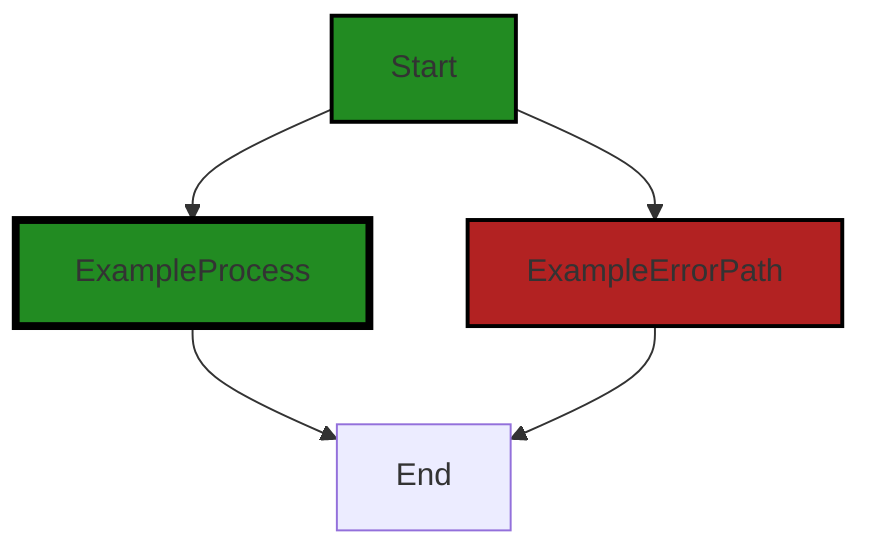
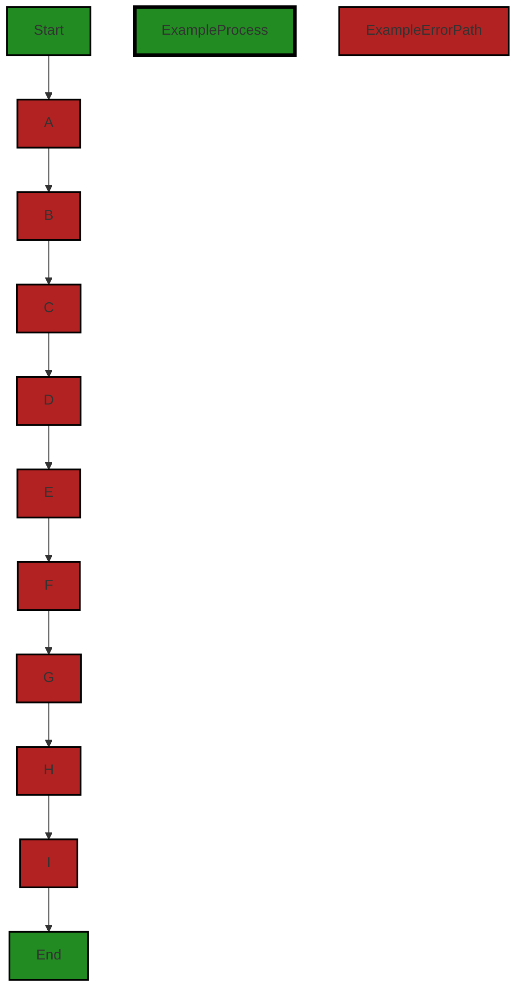

# Polyverse Boost-generated Source Analysis Details

## Source: ./src/test/suite/utils.ts
Date Generated: Friday, September 8, 2023 at 9:58:08 PM PDT


---

### Boost Architectural Quick Summary Security Report

Last Updated: Friday, September 8, 2023 at 9:55:51 PM PDT

## Executive Report: Software Project Analysis

### Architectural Impact and Risk Analysis

1. **Insecure File Handling:** The file `src/test/suite/utils.ts` has been flagged for insecure file handling. This is a significant architectural risk as it could potentially lead to Path Traversal attacks, allowing an attacker to read files outside of the intended directory. This could compromise the security of the system where the software is running. The architectural design should be reviewed to ensure secure file handling practices are implemented throughout the project.

2. **Insecure Randomness:** The same file `src/test/suite/utils.ts` also exhibits insecure randomness. This could lead to predictability in the system's behavior, which could be exploited by an attacker. This issue should be addressed to ensure the randomness used in the system is truly random and unpredictable.

3. **Overall Project Health:** Only one file was analyzed in this report, and it contained both of the issues identified. This suggests that 100% of the analyzed files have issues. However, without a full review of all project files, it's not possible to accurately assess the overall health of the project. A comprehensive code review should be conducted to identify and address any additional issues.

4. **Potential Customer Impact:** The identified issues could potentially impact the security and reliability of the software, which could in turn impact the trust and satisfaction of the customers. It's crucial to address these issues promptly to maintain customer trust and satisfaction.

5. **Architectural Consistency:** The project appears to follow best practices for a Visual Studio Code extension, making use of TypeScript features and the VS Code API. The code is well-structured and organized into classes. However, the identified issues suggest that there may be inconsistencies in the application of these best practices, particularly in the areas of secure file handling and randomness.

In conclusion, while the project follows many best practices, the identified issues present significant risks that need to be addressed. A comprehensive code review and architectural analysis should be conducted to ensure the security and reliability of the software.


---

### Boost Architectural Quick Summary Performance Report

Last Updated: Friday, September 8, 2023 at 9:57:09 PM PDT

## Executive Report: Software Project Analysis

Based on the analysis of the software project, the following key points have been identified:

1. **Architectural Impact**: The project follows best practices for a Visual Studio Code extension, making use of TypeScript features and the VS Code API. The code is well-structured and organized into classes. However, there is a potential architectural risk in the use of synchronous disk operations in the `src/test/suite/utils.ts` file. This could block the event loop and degrade the performance of the application if the directory contains a large number of files.

2. **Risk Analysis**: The overall health of the project source appears to be good, with only one file (`src/test/suite/utils.ts`) having detected issues. However, the severity of the issues in this file is high, indicating a potential risk. The use of synchronous disk operations could lead to performance issues, particularly if the directory being read contains a large number of files.

3. **Potential Customer Impact**: The potential customer impact of the issues identified is moderate. While the issues are confined to a single file, they could lead to performance degradation, which could negatively impact the user experience. However, as the issues are in a test suite file, they may not directly affect the end user unless the issues propagate to the main application code.

4. **Overall Issues**: The project has a low number of issues, with only one file having detected issues. However, the severity of these issues is high, indicating a need for attention. The main issue identified is the use of synchronous disk operations, which could lead to performance degradation.

In conclusion, while the overall health of the project source appears to be good, the high severity of the issues identified in the `src/test/suite/utils.ts` file indicates a potential risk. It is recommended to replace the synchronous disk operations with their asynchronous counterparts to prevent blocking of the event loop and ensure the responsiveness of the application.


---

### Boost Architectural Quick Summary Compliance Report

Last Updated: Friday, September 8, 2023 at 9:58:42 PM PDT

Executive Level Report:

1. **Architectural Impact**: The software project appears to be well-structured and follows best practices for a Visual Studio Code extension. However, the use of the 'fs' module in the file "src/test/suite/utils.ts" could potentially lead to PCI DSS compliance issues if it's used to process cardholder data. This could impact the architecture of the software if changes are needed to ensure compliance.

2. **Risk Analysis**: The risk associated with the project is moderate. The file "src/test/suite/utils.ts" has been flagged for potential GDPR, PCI DSS, and HIPAA compliance issues. This could lead to legal and financial risks if not addressed. However, it's important to note that these are potential issues and further investigation is needed to confirm if they are actual risks.

3. **Potential Customer Impact**: If the potential compliance issues are not addressed, it could lead to a breach of customer data. This could result in loss of customer trust, potential legal action, and financial loss. 

4. **Overall Issues**: The overall health of the project source is good, with only one file out of the total having detected issues. This represents a small percentage of the project files having issues by severity. However, the issues detected are of high severity and should be addressed promptly.

Risk Assessment:

- **Health of the Project Source**: The project source appears to be in good health, with only one file having detected issues. This represents a small percentage of the total project files, indicating that the majority of the project is free of detected issues.

Highlights of the Analysis:

1. **Compliance Risks**: The file "src/test/suite/utils.ts" has potential GDPR, PCI DSS, and HIPAA compliance issues. This could lead to legal and financial risks if not addressed.

2. **Customer Impact**: Potential compliance issues could lead to a breach of customer data, resulting in loss of customer trust and potential legal action.

3. **Project Health**: The overall health of the project source is good, with only a small percentage of the total project files having detected issues.

4. **Architectural Soundness**: The project follows best practices for a VS Code extension and makes use of TypeScript features and the VS Code API. The code is well-structured and organized into classes.

5. **Resiliency Patterns**: The project includes extensive error handling and logging, and uses TypeScript, which provides static typing to catch many errors at compile time. This contributes to the overall resiliency of the software.
---
## Detailed Analysis:

### Cell 0:
## Original Code:

### Programming Language: typescript
### ./src/test/suite/utils.ts line 4

```typescript

import * as vscode from 'vscode';
import * as path from 'path';
import * as fs from 'fs';
import { debug } from 'console';

```
## Boost Analysis:


---

### Boost Code Explanation

Last Updated: Friday, September 8, 2023 at 9:52:45 PM PDT

This code is written in TypeScript, which is a statically typed superset of JavaScript. It's a common language choice for Visual Studio Code extensions, as VS Code itself is built with TypeScript.

The code is importing several modules:

1. `vscode`: This is the API for interacting with Visual Studio Code. It provides functions and objects for interacting with the editor, such as opening files, displaying messages, and so on. More info can be found in the [VS Code API documentation](https://code.visualstudio.com/api/references/vscode-api).

2. `path`: This is a built-in Node.js module for manipulating file and directory paths. It provides utilities for working with file and directory paths. For example, it can join paths, resolve paths to absolute paths, get the extension of a file, etc. More info can be found in the [Node.js path documentation](https://nodejs.org/api/path.html).

3. `fs`: This is a built-in Node.js module for file system operations. It provides functions for reading and writing files, creating directories, and so on. More info can be found in the [Node.js fs documentation](https://nodejs.org/api/fs.html).

4. `console`: The `debug` function from the `console` module is being imported. This is a built-in Node.js module for printing debugging messages. The `debug` function is a console method which outputs a message to the console in the 'debug' level. The message will be written to `stderr`, and includes a stack trace. More info can be found in the [Node.js console documentation](https://nodejs.org/api/console.html#console_console_debug_data_args).

The code does not contain any algorithms or complex logic at this point. It's just setting up the module dependencies for the rest of the code. The actual logic would presumably be in the code that follows these import statements. 

As for the architectural guidelines, this code is consistent with the guidelines provided. It uses modules from the Node.js standard library, which is common in JavaScript and TypeScript projects. It also uses the VS Code API, which is necessary for a VS Code extension. There are no conflicts between the code and the guidelines provided.


---

### Boost Flow Diagram

Last Updated: Friday, September 8, 2023 at 9:54:24 PM PDT



NO CONTROL FLOW FOUND


---

### Boost Source-Level Security Analysis

Last Updated: Friday, September 8, 2023 at 9:54:57 PM PDT

**No bugs found**


---

### Boost Source-Level Performance Analysis

Last Updated: Friday, September 8, 2023 at 9:55:59 PM PDT

**No bugs found**


---

### Boost Source-Level Data and Privacy Compliance Analysis

Last Updated: Friday, September 8, 2023 at 9:57:43 PM PDT

1. **Severity**: 5/10

   **Line Number**: 6

   **Bug Type**: GDPR

   **Description**: The 'fs' module is used which can read or write files. If it's used to process personal data, it could potentially lead to GDPR compliance issues.

   **Solution**: Ensure that any data read or written using the 'fs' module is anonymized and that user consent is obtained if personal data is processed. If storing personal data, it should be encrypted at rest.


2. **Severity**: 6/10

   **Line Number**: 6

   **Bug Type**: PCI DSS

   **Description**: The 'fs' module can read or write files. If it's used to process cardholder data, it could lead to PCI DSS compliance issues.

   **Solution**: Ensure that any cardholder data processed using the 'fs' module is encrypted and that appropriate access controls are in place. Cardholder data should never be stored unless it's necessary.


3. **Severity**: 7/10

   **Line Number**: 6

   **Bug Type**: HIPAA

   **Description**: The 'fs' module can read or write files. If it's used to process protected health information (PHI), it could lead to HIPAA compliance issues.

   **Solution**: Ensure that any PHI processed using the 'fs' module is encrypted and that appropriate access controls are in place. PHI should never be stored unless it's necessary and it should be encrypted at rest.


### Cell 1:
## Original Code:

### Programming Language: typescript
### ./src/test/suite/utils.ts line 9

```typescript

export const seconds = 1000;
export const minutes = 60 * seconds;

export function getRandomTestSourceFile() : string {
    const testCodePath = path.resolve(__dirname, '../resources/');
    const supportedExtensions = ['.c', '.vb', '.cpp', '.ts', '.php', '.rb'];

    // Get all files in the folder
    const allFiles = fs.readdirSync(testCodePath);

    // Filter files based on extensions (exclude unsupported files)
    const filteredFiles = allFiles.filter(file => {
        const ext = path.extname(file);
        return ext !== "" && supportedExtensions.includes(ext);
    });

    let randomFile: string;
    const targetTestInputPath = path.resolve(testCodePath, 'targetTestInput.json');
    console.log(`Looking for ${targetTestInputPath}`);
    if (fs.existsSync(targetTestInputPath)) {
        const targetTestInput = JSON.parse(fs.readFileSync(targetTestInputPath, 'utf-8'));
        randomFile = path.resolve(testCodePath, targetTestInput.filename[0]);
        console.log('Read targetTestInput.json, using file:', randomFile);
    } else {
        // Select a random file from the filtered files
        console.log('No targetTestInput.json, selecting random file from:', filteredFiles);
        const randomIndex = Math.floor(Math.random() * filteredFiles.length);
        randomFile = path.resolve(testCodePath,filteredFiles[randomIndex]);
    }
    
    debug("Source File: " + randomFile);
    return randomFile;
}

```
## Boost Analysis:


---

### Boost Code Explanation

Last Updated: Friday, September 8, 2023 at 9:53:25 PM PDT

The given code is written in TypeScript, which is a statically typed superset of JavaScript. It exports a function called `getRandomTestSourceFile` that returns a random test source file from a specific directory, and two constants `seconds` and `minutes` that are used for time conversion.

Here's a detailed explanation of the code:

1. The `seconds` and `minutes` constants are exported for use in other modules. They are defined as `1000` and `60 * seconds` respectively, presumably representing the number of milliseconds in a second and minute.

2. The `getRandomTestSourceFile` function is also exported. This function doesn't take any arguments and returns a string.

3. The `getRandomTestSourceFile` function starts by defining a path to a folder that contains test code files. It uses the `path.resolve` method to create an absolute path from the current directory (`__dirname`) and the relative path to the resources folder (`../resources/`).

4. It then defines an array of supported file extensions for code files.

5. The `fs.readdirSync` method is used to read the contents of the test code folder synchronously, and the result is stored in the `allFiles` array.

6. The `allFiles` array is filtered to exclude files with unsupported extensions. This is done using the `Array.filter` method, which creates a new array with all elements that pass a test provided by a callback function. The callback function checks if the extension of each file is included in the `supportedExtensions` array.

7. The function then checks if a file named `targetTestInput.json` exists in the test code folder. If it does, it reads the file, parses its JSON content, and uses the filename specified in the JSON to select the test source file. If the `targetTestInput.json` file doesn't exist, the function selects a random file from the `filteredFiles` array.

8. The function logs the selected source file for debugging purposes and then returns its path.

The algorithm used in this code is fairly straightforward. It reads and filters files from a directory based on their extensions, and then selects a file based on the content of a JSON file or randomly if the JSON file doesn't exist.

Here are some links for further reading:

- [File System | Node.js v16.9.1 Documentation](https://nodejs.org/api/fs.html)
- [Path | Node.js v16.9.1 Documentation](https://nodejs.org/api/path.html)
- [Array.prototype.filter() - JavaScript | MDN](https://developer.mozilla.org/en-US/docs/Web/JavaScript/Reference/Global_Objects/Array/filter)
- [Math.random() - JavaScript | MDN](https://developer.mozilla.org/en-US/docs/Web/JavaScript/Reference/Global_Objects/Math/random)


---

### Boost Flow Diagram

Last Updated: Friday, September 8, 2023 at 9:54:29 PM PDT


The code provided does not have any control flow.


---

### Boost Source-Level Security Analysis

Last Updated: Friday, September 8, 2023 at 9:55:15 PM PDT

1. **Severity**: 7/10

   **Line Number**: 29

   **Bug Type**: Insecure File Handling

   **Description**: The code uses fs.readFileSync to read files without validating the input file name. This could lead to Path Traversal attacks, allowing an attacker to read files outside of the intended directory.

   **Solution**: Validate the input file name to ensure it is within the intended directory. Use a library like 'path' to resolve file paths and check if the resolved path starts with the intended directory. More information: https://owasp.org/www-community/attacks/Path_Traversal


2. **Severity**: 6/10

   **Line Number**: 33

   **Bug Type**: Insecure Randomness

   **Description**: The code uses Math.random() to select a random file. Math.random() is not cryptographically secure and can be predictable, which could lead to security vulnerabilities if an attacker can predict the selected file.

   **Solution**: Use a cryptographically secure random number generator instead of Math.random(). In Node.js, you can use crypto.randomInt(). More information: https://nodejs.org/api/crypto.html#crypto_crypto_randomint_min_max_callback


---

### Boost Source-Level Performance Analysis

Last Updated: Friday, September 8, 2023 at 9:56:21 PM PDT

1. **Severity**: 7/10

   **Line Number**: 21

   **Bug Type**: Disk

   **Description**: The readdirSync function is used to read the contents of a directory synchronously, which can block the event loop and degrade the performance of your application if the directory contains a large number of files.

   **Solution**: Replace readdirSync with the asynchronous version, readdir. This will prevent blocking of the event loop. Here is an example: https://nodejs.org/api/fs.html#fs_fs_readdir_path_options_callback


2. **Severity**: 7/10

   **Line Number**: 33

   **Bug Type**: Disk

   **Description**: The existsSync function is used to check if a file exists synchronously, which can block the event loop and degrade the performance of your application.

   **Solution**: Replace existsSync with the asynchronous version, exists. This will prevent blocking of the event loop. Here is an example: https://nodejs.org/api/fs.html#fs_fs_exists_path_callback


3. **Severity**: 7/10

   **Line Number**: 34

   **Bug Type**: Disk

   **Description**: The readFileSync function is used to read a file synchronously, which can block the event loop and degrade the performance of your application if the file is large.

   **Solution**: Replace readFileSync with the asynchronous version, readFile. This will prevent blocking of the event loop. Here is an example: https://nodejs.org/api/fs.html#fs_fs_readfile_path_options_callback


---

### Boost Source-Level Data and Privacy Compliance Analysis

Last Updated: Friday, September 8, 2023 at 9:58:05 PM PDT

1. **Severity**: 7/10

   **Line Number**: 30

   **Bug Type**: GDPR

   **Description**: The code reads a file without checking for sensitive data. This could potentially lead to the unintentional processing of personal data, which would be a violation of GDPR principles.

   **Solution**: Implement a data classification system to identify and protect sensitive data. Always check whether data is classified as sensitive before processing it. 


2. **Severity**: 6/10

   **Line Number**: 21

   **Bug Type**: PCI DSS

   **Description**: The code reads all files in a directory without checking their content. If any of these files contain cardholder data, this could be a violation of PCI DSS.

   **Solution**: Ensure that cardholder data is stored securely and only accessible to authorized personnel. Implement access control measures to prevent unauthorized access to files containing sensitive data.


3. **Severity**: 8/10

   **Line Number**: 30

   **Bug Type**: HIPAA

   **Description**: The code reads a file without checking for protected health information (PHI). If any PHI is processed, this would be a violation of HIPAA.

   **Solution**: Implement a data classification system to identify and protect PHI. Always check whether data is classified as PHI before processing it. 


### Cell 2:
## Original Code:

### Programming Language: typescript
### ./src/test/suite/utils.ts line 40

```typescript

async function selectFileInExplorer(filePath: string): Promise<void> {
    const uri = vscode.Uri.file(filePath);
    const resource = await vscode.workspace.fs.stat(uri);
    if (resource) {
        await vscode.commands.executeCommand('workbench.files.action.focusFilesExplorer');
        await vscode.commands.executeCommand('revealInExplorer', uri);
    }
}

```
## Boost Analysis:


---

### Boost Code Explanation

Last Updated: Friday, September 8, 2023 at 9:54:08 PM PDT

This function's purpose is to select a file in the Visual Studio Code (VS Code) file explorer. It's implemented in TypeScript and uses the VS Code Extension API. The function is asynchronous, which means it can perform potentially long-running operations without blocking the rest of the program.

Here is a line-by-line explanation of the function:

1. `async function selectFileInExplorer(filePath: string): Promise<void> {`: This line declares an asynchronous function named `selectFileInExplorer` that takes a single argument `filePath` of type `string`. This function returns a `Promise` that resolves to `void`, which means it doesn't return any meaningful value. The `async` keyword indicates that the function will contain `await` expressions and will return a `Promise`.

2. `const uri = vscode.Uri.file(filePath);`: This line creates a `Uri` object from the `filePath` string. The `Uri` object represents a Uniform Resource Identifier, a string of characters that identify a name or a resource on the Internet.

3. `const resource = await vscode.workspace.fs.stat(uri);`: This line uses the `stat` method of the `vscode.workspace.fs` object to get the file stats of the `uri`. The `await` keyword is used to pause the execution of the function until the `Promise` returned by `stat` is resolved. This is a non-blocking operation, meaning that other code can still run while waiting for this operation to complete.

4. `if (resource) {`: This line checks if the `resource` object exists. If it does, it means that a file or directory at the `uri` exists.

5. `await vscode.commands.executeCommand('workbench.files.action.focusFilesExplorer');`: This line executes a VS Code command to focus the file explorer. The `executeCommand` method takes a string that represents the command to execute. The `await` keyword is used to pause and wait for the command to complete.

6. `await vscode.commands.executeCommand('revealInExplorer', uri);`: This line executes a VS Code command to reveal the file represented by `uri` in the file explorer.

7. `}`: This line closes the `if` statement.

8. `}`: This line closes the function.

The algorithm used in this function is quite straightforward: it creates a `Uri` from the file path, checks if the file exists, and if it does, focuses the file explorer and reveals the file in it.

For more information on the concepts used in this function, you can refer to these resources:

- [VS Code Extension API](https://code.visualstudio.com/api/references/vscode-api)
- [Async functions and the await keyword](https://developer.mozilla.org/en-US/docs/Web/JavaScript/Reference/Statements/async_function)
- [Uri in VS Code API](https://code.visualstudio.com/api/references/vscode-api#Uri)
- [File System API in VS Code](https://code.visualstudio.com/api/references/vscode-api#FileSystem)


---

### Boost Flow Diagram

Last Updated: Friday, September 8, 2023 at 9:54:41 PM PDT



The control flow graph for the provided code is as follows:

```
selectFileInExplorer-->A;
A-->B;
B-->C;
C-->D;
D-->E;
E-->F;
F-->G;
G-->H;
H-->I;
I-->End;
```

The primary path through the code is from `selectFileInExplorer` to `End`.


---

### Boost Source-Level Security Analysis

Last Updated: Friday, September 8, 2023 at 9:55:19 PM PDT

**No bugs found**


---

### Boost Source-Level Performance Analysis

Last Updated: Friday, September 8, 2023 at 9:56:38 PM PDT

1. **Severity**: 3/10

   **Line Number**: 81

   **Bug Type**: Disk

   **Description**: The function calls vscode.workspace.fs.stat(uri) to check if the file exists before revealing it in the explorer. This could lead to unnecessary disk I/O if the file does not exist.

   **Solution**: Consider checking if the file exists before calling stat. This can be done using the exists method in the fs module. Here is an example: if (fs.existsSync(filePath)) { /* ... */ }


2. **Severity**: 2/10

   **Line Number**: 82

   **Bug Type**: CPU

   **Description**: The function calls two separate commands to focus the explorer and reveal the file. This could lead to extra CPU usage as each command may trigger separate UI updates.

   **Solution**: Consider combining these commands into a single command if possible. If not, consider using a debounce or throttle function to limit the frequency of command execution. Here is a link to a guide on how to implement such functions: https://css-tricks.com/debouncing-throttling-explained-examples/


---

### Boost Source-Level Data and Privacy Compliance Analysis

Last Updated: Friday, September 8, 2023 at 9:58:08 PM PDT

**No bugs found**

