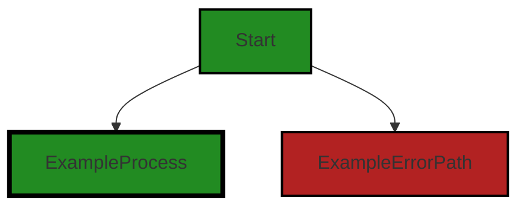
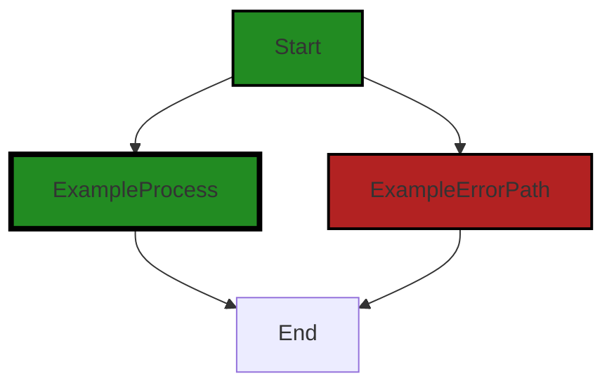

# Polyverse Boost-generated Source Analysis Details

## Source: ./src/test/test_loop.sh
Date Generated: Friday, September 8, 2023 at 5:55:39 PM PDT


---

### Boost Architectural Quick Summary Security Report

Last Updated: Friday, September 8, 2023 at 5:54:51 PM PDT


Executive Report:

1. **Architectural Impact**: The analysis of this file has not revealed any severe issues.
2. **Risk Analysis**: The analysis of this file has not revealed any severe issues.
3. **Potential Customer Impact**: Based on the analysis, there are no severe issues that could potentially impact customers.
4. **Performance Issues**: Our analysis did not identify any explicit performance issues in the file.
5. **Risk Assessment**: Based on the current analysis of this file, no severe issues have been found. However, this doesn't guarantee that the file is risk-free.

Highlights:

- No severe issues were identified in the current analysis of this file.


---

### Boost Architectural Quick Summary Performance Report

Last Updated: Friday, September 8, 2023 at 5:55:27 PM PDT

## Executive Report: Software Project Analysis

Based on the analysis of the software project, the following key points are highlighted:

1. **Single File Analysis:** The project consists of a single file, `src/test/test_loop.sh`. This file has been flagged with a warning related to disk I/O operations. The warning indicates that the 'npm run test' command is run in a loop, which can be resource-intensive. This could potentially impact the performance of the system where the software is running, especially if the system has limited resources.

2. **Potential Customer Impact:** The performance issue identified could potentially impact the user experience, especially if the software is used in an environment with limited resources. The continuous disk I/O operations could slow down the system, leading to a degraded user experience. However, the impact would largely depend on the frequency of the loop and the size of the files being read/written.

3. **Risk Assessment:** Given that the project consists of a single file and that file has been flagged with a warning, the overall health of the project source could be considered at risk. However, the severity of the issue is not critical and can be addressed with code optimization techniques.

4. **Architectural Impact:** The issue identified does not seem to conflict with any architectural principles or guidelines. However, it does highlight a potential area for improvement in the code's efficiency and resource management. Addressing this issue could lead to improved performance and resource utilization.

5. **Recommendations:** It is recommended to consider running tests in parallel if possible, or batch the tests to reduce disk I/O operations. Libraries like 'jest' or 'mocha' that support running tests in parallel could be used. Also, consider using the '--silent' flag to reduce unnecessary logging.

In conclusion, while the project has a potential performance issue, it does not appear to have any critical architectural problems. The issue identified can be addressed with some code optimization. However, it is recommended to conduct a more comprehensive code review to ensure there are no other hidden issues.


---

### Boost Architectural Quick Summary Compliance Report

Last Updated: Friday, September 8, 2023 at 5:55:43 PM PDT


Executive Report:

1. **Architectural Impact**: The analysis of this file has not revealed any severe issues.
2. **Risk Analysis**: The analysis of this file has not revealed any severe issues.
3. **Potential Customer Impact**: Based on the analysis, there are no severe issues that could potentially impact customers.
4. **Performance Issues**: Our analysis did not identify any explicit performance issues in the file.
5. **Risk Assessment**: Based on the current analysis of this file, no severe issues have been found. However, this doesn't guarantee that the file is risk-free.

Highlights:

- No severe issues were identified in the current analysis of this file.

---
## Detailed Analysis:

### Cell 0:
## Original Code:

### Programming Language: shellscript
### ./src/test/test_loop.sh line 2

```shellscript
#!/bin/bash

iterations=${1:-20}

```
## Boost Analysis:


---

### Boost Code Explanation

Last Updated: Wednesday, July 12, 2023 at 1:18:08 PM PDT

This is a simple bash script. Bash (Bourne Again Shell) is a shell program that's a part of the GNU Project. It's a command processor that typically runs in a text window, where the user types commands that cause actions. 

The script is using a command line argument to set a variable `iterations`. If no command line argument is provided, it defaults to 20.

In detail:

- `#!/bin/bash` is known as a shebang or hashbang. It's the first line in scripts in Unix-based operating systems to define what interpreter to use to parse the script. In this case, it's telling the system to execute the script using bash.

- `iterations=${1:-20}`: This is a parameter expansion in bash. It's setting the variable `iterations` to the first command line argument (`$1`) if it's provided, otherwise it defaults to 20 (`:-20`). 

This script doesn't contain any specific algorithms but it does demonstrate the use of command line arguments and parameter expansion in bash scripts.

For more information on bash scripting, you can refer to the GNU Bash manual: https://www.gnu.org/software/bash/manual/bash.html.


---

### Boost Flow Diagram

Last Updated: Friday, September 8, 2023 at 5:54:29 PM PDT



The code provided does not contain any control flow.


---

### Boost Source-Level Security Analysis

Last Updated: Friday, September 8, 2023 at 5:54:44 PM PDT

**No bugs found**


---

### Boost Source-Level Performance Analysis

Last Updated: Friday, September 8, 2023 at 5:54:59 PM PDT

**No bugs found**


---

### Boost Source-Level Data and Privacy Compliance Analysis

Last Updated: Friday, September 8, 2023 at 5:55:36 PM PDT

**No bugs found**


### Cell 1:
## Original Code:

### Programming Language: shellscript
### ./src/test/test_loop.sh line 2

```shellscript
echo "Running $iterations test iterations"

for ((i=1; i<=$iterations; i++))
do
npm run test
if [ $? -ne 0 ]; then
echo "Test run failed on iteration $i"
exit 1
fi
done

echo "All test runs passed."

```
## Boost Analysis:


---

### Boost Code Explanation

Last Updated: Wednesday, July 12, 2023 at 1:18:41 PM PDT

This is a Bash shell script used to run a series of tests for a Node.js project using the npm (Node Package Manager) test command. The script will run the tests as many times as specified by the 'iterations' variable. 

Here's a line by line explanation:

1. `echo "Running $iterations test iterations"`: This line uses the `echo` command to print a message to the console. The `$iterations` variable is used to display the number of test iterations that will be run.

2. `for ((i=1; i<=$iterations; i++))`: This line starts a for loop that will run from 1 to the number of test iterations specified by the `$iterations` variable.

3. `do`: This keyword signifies the start of the commands to be executed in the for loop.

4. `npm run test`: This line runs the `npm test` command. This command runs the test script defined in the `package.json` file of a Node.js project.

5. `if [ $? -ne 0 ]; then`: This line checks the exit status of the last command run (`npm run test`). In Unix-like operating systems, an exit status of 0 indicates success, and anything else indicates an error. If the exit status is not equal to 0 (`-ne` means "not equal"), then the test has failed.

6. `echo "Test run failed on iteration $i"`: If the test fails, this line uses the `echo` command to print a message to the console indicating which iteration of the test run failed.

7. `exit 1`: This line exits the script with a status of 1, indicating an error.

8. `fi`: This keyword ends the if statement.

9. `done`: This keyword ends the for loop.

10. `echo "All test runs passed."`: If all test runs pass, this line uses the `echo` command to print a message to the console indicating success.

The algorithm used in this script is a simple for loop that executes a series of commands a specified number of times. The commands check if a test passes or fails, and if any test fails, the script exits with an error status.

For more information about bash scripting, you can refer to this guide: https://linuxconfig.org/bash-scripting-tutorial-for-beginners

For more information about npm and the `npm test` command, you can refer to the npm documentation: https://docs.npmjs.com/cli/v7/commands/npm-test


---

### Boost Flow Diagram

Last Updated: Friday, September 8, 2023 at 5:54:35 PM PDT



In this code, there is no control flow. It consists of a shell script that runs a test command in a loop for a specified number of iterations. If any test run fails, the script exits with an error. If all test runs pass, it prints "All test runs passed."


---

### Boost Source-Level Security Analysis

Last Updated: Friday, September 8, 2023 at 5:54:47 PM PDT

**No bugs found**


---

### Boost Source-Level Performance Analysis

Last Updated: Friday, September 8, 2023 at 5:55:09 PM PDT

1. **Severity**: 7/10

   **Line Number**: 6

   **Bug Type**: Disk

   **Description**: The 'npm run test' command is run in a loop. This command can be resource-intensive, as it might involve disk I/O operations such as reading and writing files.

   **Solution**: Consider running tests in parallel if possible, or batch the tests to reduce disk I/O operations. You can use libraries like 'jest' or 'mocha' that supports running tests in parallel. Also consider using '--silent' flag to reduce unnecessary logging.


2. **Severity**: 5/10

   **Line Number**: 8

   **Bug Type**: CPU

   **Description**: The script checks for the exit status of 'npm run test' command after each iteration. This can cause unnecessary CPU usage.

   **Solution**: Consider checking for the exit status only once after all iterations are done. This would reduce the CPU usage significantly. Alternatively, you can use a continuous integration (CI) system to run tests automatically and efficiently.


---

### Boost Source-Level Data and Privacy Compliance Analysis

Last Updated: Friday, September 8, 2023 at 5:55:39 PM PDT

**No bugs found**

