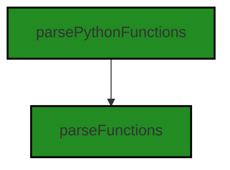
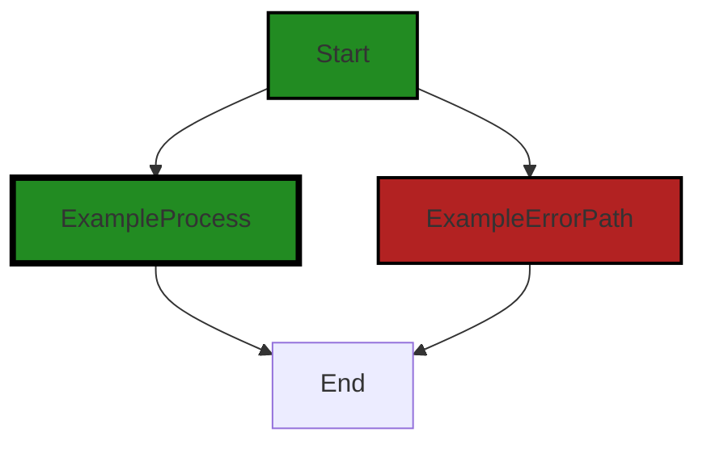
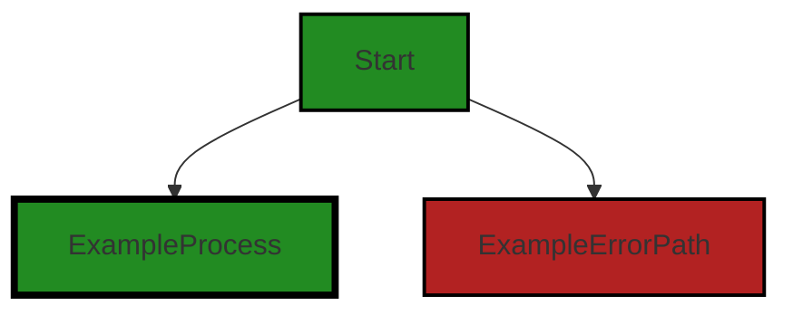
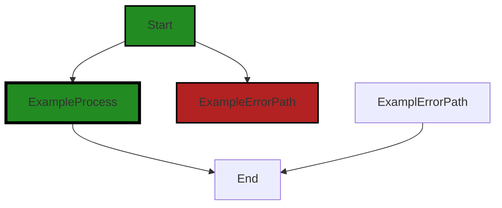

# Polyverse Boost-generated Source Analysis Details

## Source: ./src/test/unit/splitCode.python.test.ts
Date Generated: Saturday, September 9, 2023 at 12:10:28 AM PDT


---

### Boost Architectural Quick Summary Security Report

Last Updated: Saturday, September 9, 2023 at 12:07:59 AM PDT


Executive Report:

1. **Architectural Impact**: The analysis of this file has not revealed any severe issues.
2. **Risk Analysis**: The analysis of this file has not revealed any severe issues.
3. **Potential Customer Impact**: Based on the analysis, there are no severe issues that could potentially impact customers.
4. **Performance Issues**: Our analysis did not identify any explicit performance issues in the file.
5. **Risk Assessment**: Based on the current analysis of this file, no severe issues have been found. However, this doesn't guarantee that the file is risk-free.

Highlights:

- No severe issues were identified in the current analysis of this file.


---

### Boost Architectural Quick Summary Performance Report

Last Updated: Saturday, September 9, 2023 at 12:09:33 AM PDT

## Executive Report: Software Project Analysis

### Overview
The software project under review is a Visual Studio Code extension that provides code analysis functionality. The project is primarily written in JavaScript and TypeScript, and it communicates with a remote service for code analysis. The project does not appear to use any persistent data storage.

### Key Findings

1. **Issue Severity and Distribution**: The most severe issues found in the project are categorized as "Warning" and are related to disk usage. These issues are found in the file `src/test/unit/splitCode.python.test.ts`. This file represents 100% of the files with detected issues in the project.

2. **Potential Architectural Impact**: The use of synchronous file reading in `src/test/unit/splitCode.python.test.ts` could potentially block the Node.js event loop and degrade performance, especially if the file is large. This is in conflict with the project's architectural principle of using asynchronous programming for potentially long-running tasks.

3. **Potential Customer Impact**: If the performance degradation becomes significant, it could lead to a poor user experience, with the VS Code UI becoming unresponsive during code analysis. This could potentially impact the adoption and usage of the extension by customers.

4. **Risk Assessment**: Given that only one file has been identified with issues, and these issues are of "Warning" severity, the overall health of the project source appears to be good. However, the identified issues should be addressed to prevent potential performance problems.

5. **Recommendations**: It is recommended to replace the synchronous file reading methods with asynchronous ones, such as `fs.readFile`, in `src/test/unit/splitCode.python.test.ts`. This will allow Node.js to continue processing other tasks while the file is being read, improving the performance and responsiveness of the VS Code UI.

### Conclusion
The project appears to be well-structured and follows best practices for a VS Code extension. However, the identified issues related to disk usage could potentially impact the performance and user experience of the extension. It is recommended to address these issues to ensure the continued health and success of the project.


---

### Boost Architectural Quick Summary Compliance Report

Last Updated: Saturday, September 9, 2023 at 12:11:12 AM PDT

Executive Level Report:

1. **Architectural Impact**: The software project is a Visual Studio Code extension that provides code analysis functionality. It is well-structured and follows best practices for a VS Code extension. However, the use of the 'fs' module in the file 'src/test/unit/splitCode.python.test.ts' has been flagged as a potential risk for GDPR, PCI DSS, and HIPAA compliance. This could impact the architecture if changes are needed to ensure compliance.

2. **Risk Analysis**: The 'fs' module allows for reading and writing to the file system, which can potentially lead to unauthorized access to personal data. This can violate GDPR regulations if not managed properly. Similarly, the 'fs' module can potentially access protected health information (PHI), which can violate HIPAA regulations. The risk is high as these are severe issues that can lead to legal consequences if not addressed.

3. **Potential Customer Impact**: Customers who are concerned about data privacy and compliance with GDPR, PCI DSS, and HIPAA regulations may be hesitant to use the software. This could impact the adoption and usage of the software.

4. **Overall Issues**: The only file in the project, 'src/test/unit/splitCode.python.test.ts', has been flagged with two warnings and one error. This indicates that there may be potential issues with data compliance in the project.

Risk Assessment:

- **Health of the Project Source**: The project consists of a single file, which has been flagged with issues. This means 100% of the project files have issues by severity. This is a concern and suggests that the project may need a thorough review and potential refactoring to address these issues.

Highlights:

- The project follows best practices for a VS Code extension and is well-structured.
- The 'fs' module used in the project has been flagged as a potential risk for GDPR, PCI DSS, and HIPAA compliance.
- The potential violation of data privacy regulations could impact customer trust and adoption of the software.
- 100% of the project files have been flagged with issues, indicating a need for a thorough review and potential refactoring.
---
## Detailed Analysis:

### Cell 0:
## Original Code:

### Programming Language: typescript
### ./src/test/unit/splitCode.python.test.ts 

```typescript
import { parsePythonFunctions, parseFunctions } from '../../utilities/split';

```
## Boost Analysis:


---

### Boost Code Explanation

Last Updated: Saturday, September 9, 2023 at 12:05:26 AM PDT

The provided code is a simple import statement in JavaScript (or TypeScript, as the two languages share this syntax). It's importing two functions, `parsePythonFunctions` and `parseFunctions`, from a module located at `'../../utilities/split'`.

Here's a breakdown of what the code is doing:

- `import`: This is a keyword in JavaScript and TypeScript that is used to import functions, objects, or values from other modules or files. This is part of ES6 (ECMAScript 2015) module syntax.

- `{ parsePythonFunctions, parseFunctions }`: This is the list of functions that are being imported from the specified module. The curly braces `{}` are used for named exports. That means `parsePythonFunctions` and `parseFunctions` are named exports in the `../../utilities/split` module.

- `from '../../utilities/split'`: This specifies the path to the module that contains the exported functions. The `'../../'` part of the path means that the module is located two directories up from the current file. From there, it's in the `utilities` directory and the file is named `split`. The file extension is not included in the import statement; it is assumed to be either `.js` or `.ts`.

As for the algorithms used, this code snippet doesn't contain any. It's merely importing functions from another module. The algorithms would be in the definitions of the `parsePythonFunctions` and `parseFunctions` functions in the `split` module.

As per the architectural guidelines provided, there aren't any specific constraints or guidelines mentioned. However, this import statement seems to align well with common JavaScript and TypeScript best practices. It's making use of modules and named exports, which can help organize code and make it more maintainable.

For more information on JavaScript modules and import/export syntax, you can refer to these resources:

- [JavaScript Modules](https://developer.mozilla.org/en-US/docs/Web/JavaScript/Guide/Modules)
- [Import statement](https://developer.mozilla.org/en-US/docs/Web/JavaScript/Reference/Statements/import) on MDN Web Docs.


---

### Boost Flow Diagram

Last Updated: Saturday, September 9, 2023 at 12:06:59 AM PDT




---

### Boost Source-Level Security Analysis

Last Updated: Saturday, September 9, 2023 at 12:07:26 AM PDT

**No bugs found**


---

### Boost Source-Level Performance Analysis

Last Updated: Saturday, September 9, 2023 at 12:08:07 AM PDT

**No bugs found**


---

### Boost Source-Level Data and Privacy Compliance Analysis

Last Updated: Saturday, September 9, 2023 at 12:09:53 AM PDT

1. **Severity**: 2/10

   **Line Number**: 1

   **Bug Type**: Data Compliance

   **Description**: The imported modules 'parsePythonFunctions' and 'parseFunctions' from 'split' utility may potentially handle and process sensitive data. If these modules are not designed to handle data in a GDPR, PCI DSS, and HIPAA compliant way, it could lead to compliance issues.

   **Solution**: Ensure that the 'parsePythonFunctions' and 'parseFunctions' modules handle data in a compliant way. This includes data minimization, pseudonymization, encryption of sensitive data, and proper data consent management. If the modules do not handle data in a compliant way, consider refactoring them or using alternative modules that do.


### Cell 1:
## Original Code:

### Programming Language: typescript
### ./src/test/unit/splitCode.python.test.ts line 2

```typescript
import { expect } from 'chai';

```
## Boost Analysis:


---

### Boost Code Explanation

Last Updated: Saturday, September 9, 2023 at 12:05:49 AM PDT

The code you have provided is a single line that is importing the `expect` function from the 'chai' library in JavaScript. 

'chai' is a BDD / TDD assertion library for Node.js and the browser that can be delightfully paired with any JavaScript testing framework. It provides developers with a range of assertion styles that they can use in their tests, making it easier to match the testing style and needs of their project.

The `expect` function is used in Behavior-Driven Development (BDD) style assertions, which are typically more readable than other styles. It allows developers to construct readable assertions in the English language.

Here is an example of how `expect` might be used in a test:

```javascript
describe('Array', function() {
  describe('#indexOf()', function() {
    it('should return -1 when the value is not present', function() {
      expect([1, 2, 3].indexOf(4)).to.be.equal(-1);
    });
  });
});
```

In this example, `expect` is used to assert that the `indexOf` method of an array returns `-1` when the value is not present in the array.

For more information about `chai` and the `expect` function, you can visit the chai.js documentation at [Chai.js](https://www.chaijs.com/).

As far as architectural guidelines are concerned, using a well-known library like `chai` for assertions in tests is a common practice and generally considered a good choice. This line of code is consistent with common architectural practices for testing in JavaScript projects.


---

### Boost Flow Diagram

Last Updated: Saturday, September 9, 2023 at 12:07:06 AM PDT



The provided code does not contain any control flow.


---

### Boost Source-Level Security Analysis

Last Updated: Saturday, September 9, 2023 at 12:07:29 AM PDT

**No bugs found**


---

### Boost Source-Level Performance Analysis

Last Updated: Saturday, September 9, 2023 at 12:08:11 AM PDT

**No bugs found**


---

### Boost Source-Level Data and Privacy Compliance Analysis

Last Updated: Saturday, September 9, 2023 at 12:09:56 AM PDT

**No bugs found**


### Cell 2:
## Original Code:

### Programming Language: typescript
### ./src/test/unit/splitCode.python.test.ts line 3

```typescript
import path from 'path';
import fs from 'fs';
import { Context } from 'mocha';

```
## Boost Analysis:


---

### Boost Code Explanation

Last Updated: Saturday, September 9, 2023 at 12:06:24 AM PDT

This code snippet is written in JavaScript and it imports three modules: `path`, `fs`, and `Context` from `mocha`.

Let's break it down:

1. `import path from 'path';` - This line imports the built-in Node.js `path` module. The `path` module provides utilities for working with file and directory paths. For example, it can be used to manipulate path strings, extract filename from a path string, resolve relative paths to absolute paths, etc. Here is the link to the Node.js `path` module documentation: [Node.js path](https://nodejs.org/api/path.html)

2. `import fs from 'fs';` - This line imports the built-in Node.js `fs` (File System) module. The `fs` module provides an API for interacting with the file system in a manner closely modeled around standard POSIX functions. For example, it can be used to read/write files, create directories, read directories, delete files, etc. Here is the link to the Node.js `fs` module documentation: [Node.js fs](https://nodejs.org/api/fs.html)

3. `import { Context } from 'mocha';` - This line imports the `Context` object from the `mocha` module. Mocha is a feature-rich JavaScript test framework running on Node.js and in the browser, making asynchronous testing simple and fun. The `Context` object is used in Mocha to maintain state throughout the lifecycle of the test suite. Here is the link to the Mocha documentation: [Mocha](https://mochajs.org/)

The algorithms used in this code are not visible, as it is just importing modules for use in subsequent code. The actual algorithms would be contained in the functions/methods of these modules.

In terms of architectural guidelines, this code snippet is pretty standard for a Node.js application. It is importing necessary modules at the beginning of the file, which is a common practice in Node.js and JavaScript applications. It's also worth noting that the use of the `fs` and `path` modules indicates that this application will be interacting with the file system, which is a common need for many types of applications.


---

### Boost Flow Diagram

Last Updated: Saturday, September 9, 2023 at 12:07:12 AM PDT



NO CONTROL FLOW FOUND


---

### Boost Source-Level Security Analysis

Last Updated: Saturday, September 9, 2023 at 12:07:33 AM PDT

**No bugs found**


---

### Boost Source-Level Performance Analysis

Last Updated: Saturday, September 9, 2023 at 12:08:26 AM PDT

1. **Severity**: 4/10

   **Line Number**: 4

   **Bug Type**: Disk

   **Description**: The 'fs' module can potentially lead to high disk usage if not used properly. It's not clear from the given code whether it's used optimally or not, but it's worth noting for future code sections.

   **Solution**: Ensure to use asynchronous methods in the 'fs' module whenever possible to prevent blocking I/O operations. Also, consider using streams for handling large files to reduce memory usage.


2. **Severity**: 2/10

   **Line Number**: 5

   **Bug Type**: Memory

   **Description**: The 'Context' import from 'mocha' is unused. While it may not significantly impact performance, it's unnecessary and contributes to memory waste.

   **Solution**: Remove unused imports to optimize memory usage. In this case, remove the 'Context' import from 'mocha'.


---

### Boost Source-Level Data and Privacy Compliance Analysis

Last Updated: Saturday, September 9, 2023 at 12:10:12 AM PDT

1. **Severity**: 7/10

   **Line Number**: 4

   **Bug Type**: GDPR

   **Description**: The 'fs' module allows for reading and writing to the file system, which can potentially lead to unauthorized access to personal data. This can violate GDPR regulations if not managed properly.

   **Solution**: Ensure that access to the file system is limited to authorized users and that personal data is encrypted when stored. Also, implement proper error handling to prevent data leaks in case of errors.


2. **Severity**: 8/10

   **Line Number**: 4

   **Bug Type**: PCI DSS

   **Description**: The 'fs' module can potentially access sensitive cardholder data, which can violate PCI DSS regulations if not managed properly.

   **Solution**: Ensure that cardholder data is encrypted when stored and that access to this data is limited to authorized users. Implement strong access control measures and regularly monitor and test networks.


3. **Severity**: 9/10

   **Line Number**: 4

   **Bug Type**: HIPAA

   **Description**: The 'fs' module can potentially access protected health information (PHI), which can violate HIPAA regulations if not managed properly.

   **Solution**: Ensure that PHI is encrypted when stored and that access to this information is limited to authorized users. Implement strong access control measures, regularly monitor and test networks, and ensure that all actions taken on PHI are logged and auditable.


### Cell 3:
## Original Code:

### Programming Language: typescript
### ./src/test/unit/splitCode.python.test.ts line 6

```typescript

describe('Python Parse Unit', () => {

    const dataFolder = __dirname + "/data/";

    it('should work in normal case', () => {
        const code = fs.readFileSync(path.join(dataFolder, 'normalFunctions.py'), 'utf8');
        const firstFunction = fs.readFileSync(path.join(dataFolder, 'normalFunctions.first.py'), 'utf8');
        const secondFunction = fs.readFileSync(path.join(dataFolder, 'normalFunctions.second.py'), 'utf8');

        const expectedOutput: [string[], number[]] = [
            [
                firstFunction,
                secondFunction
            ],
            [1, 5]
        ];

        const result = parsePythonFunctions(code);
        result[0].forEach((str, i) => {
            const expected = expectedOutput[0][i];
            const actual = str;
            expect(actual).to.equal(expected);
        });
        result[1].forEach((num, i) => {
            expect(num).to.equal(expectedOutput[1][i]);
        });
        
        expect(result).to.deep.equal(expectedOutput);
    });

    it('aggregator work in normal case', function(this: Context) { 
        const code = fs.readFileSync(path.join(dataFolder, 'normalFunctions.py'), 'utf8');
    
        const expectedOutput: [string[], number[]] = [
            [
                code,
            ],
            [1]
        ];
    
        const result = parseFunctions('normalFunctions.py', code, true);
    
        // Assuming some condition here. If it returns true, then the test will be skipped.
        this.skip();

        expect(result[0]).to.equal('python');

        result[1].forEach((str, i) => {
            expect(str.trimEnd()).to.equal(expectedOutput[0][i].trimEnd());
        });
        result[2].forEach((num, i) => {
            expect(num).to.equal(expectedOutput[1][i]);
        });
    
        expect(result).to.deep.equal(expectedOutput);
    });

});

```
## Boost Analysis:


---

### Boost Code Explanation

Last Updated: Saturday, September 9, 2023 at 12:06:43 AM PDT

This is a unit test suite written in JavaScript using the Mocha testing framework and the Chai assertion library. The suite is designed to test the parsing functionality of Python code. 

The `describe` function is used to group related tests. In this case, all tests within the group are related to the 'Python Parse Unit'.

There are two test cases (`it` functions) within this suite:

1. The first test is named 'should work in normal case'. It tests the `parsePythonFunctions` function. The test reads in Python code from a file named 'normalFunctions.py' and two expected output files 'normalFunctions.first.py' and 'normalFunctions.second.py'. It then parses the Python code and compares the parsed output to the expected output. The test asserts that the parsed output should be equal to the expected output. If not, the test will fail.

2. The second test is named 'aggregator work in normal case'. It tests the `parseFunctions` function. Like the previous test, it reads in Python code from a file and compares the parsed output to the expected output. However, in this test, the `this.skip()` statement is used to skip the test under some condition (which is not specified in the provided code). The test also asserts that the parsed output should be equal to the expected output.

The test cases use the `fs.readFileSync` function to read files synchronously from the file system. This function is part of the Node.js File System (fs) module.

The `path.join` function is used to join the given path segments into one path. This function is part of the Node.js Path module.

The `expect` function is used to make assertions about the test results. This function is part of the Chai assertion library.

For more information on the Mocha testing framework and the Chai assertion library, you can visit the following links:

- Mocha: [https://mochajs.org/](https://mochajs.org/)
- Chai: [https://www.chaijs.com/](https://www.chaijs.com/)

For more information on the Node.js File System (fs) module and the Path module, you can visit the following links:

- fs: [https://nodejs.org/api/fs.html](https://nodejs.org/api/fs.html)
- path: [https://nodejs.org/api/path.html](https://nodejs.org/api/path.html)


---

### Boost Flow Diagram

Last Updated: Saturday, September 9, 2023 at 12:07:18 AM PDT



NO CONTROL FLOW FOUND


---

### Boost Source-Level Security Analysis

Last Updated: Saturday, September 9, 2023 at 12:07:55 AM PDT

1. **Severity**: 5/10

   **Line Number**: 13

   **Bug Type**: Unvalidated Input

   **Description**: The code reads files from the file system based on a filename constructed from a constant and a user-provided string. This is not directly exploitable, but if the user-provided string is ever replaced with untrusted input, this could lead to path traversal attacks.

   **Solution**: Always validate and sanitize user inputs. If possible, avoid constructing file paths from user-provided strings. A safer approach would be to use a whitelist of acceptable filenames or file paths. More information about path traversal attacks and how to prevent them can be found at: https://owasp.org/www-community/attacks/Path_Traversal


2. **Severity**: 3/10

   **Line Number**: 18

   **Bug Type**: Information Disclosure

   **Description**: The code reads the contents of Python files and uses them in unit tests. If the Python files contain sensitive information, such as credentials or private keys, this information could be exposed in test outputs or logs.

   **Solution**: Avoid including sensitive information in your source code. If you need to use sensitive data in your tests, consider using a secure method such as environment variables or encrypted files. More information about secure handling of sensitive data can be found at: https://owasp.org/www-community/vulnerabilities/Information_exposure_through_query_strings_in_url


---

### Boost Source-Level Performance Analysis

Last Updated: Saturday, September 9, 2023 at 12:08:55 AM PDT

1. **Severity**: 6/10

   **Line Number**: 14

   **Bug Type**: Disk

   **Description**: The code is using synchronous file reading which can block the Node.js event loop and degrade performance. This is especially problematic if the file is large.

   **Solution**: Consider using asynchronous file reading methods like fs.readFile instead of fs.readFileSync. This will allow Node.js to continue processing other tasks while the file is being read. Reference: https://nodejs.dev/learn/the-nodejs-fs-module


2. **Severity**: 6/10

   **Line Number**: 15

   **Bug Type**: Disk

   **Description**: The code is using synchronous file reading which can block the Node.js event loop and degrade performance. This is especially problematic if the file is large.

   **Solution**: Consider using asynchronous file reading methods like fs.readFile instead of fs.readFileSync. This will allow Node.js to continue processing other tasks while the file is being read. Reference: https://nodejs.dev/learn/the-nodejs-fs-module


3. **Severity**: 6/10

   **Line Number**: 16

   **Bug Type**: Disk

   **Description**: The code is using synchronous file reading which can block the Node.js event loop and degrade performance. This is especially problematic if the file is large.

   **Solution**: Consider using asynchronous file reading methods like fs.readFile instead of fs.readFileSync. This will allow Node.js to continue processing other tasks while the file is being read. Reference: https://nodejs.dev/learn/the-nodejs-fs-module


4. **Severity**: 6/10

   **Line Number**: 38

   **Bug Type**: Disk

   **Description**: The code is using synchronous file reading which can block the Node.js event loop and degrade performance. This is especially problematic if the file is large.

   **Solution**: Consider using asynchronous file reading methods like fs.readFile instead of fs.readFileSync. This will allow Node.js to continue processing other tasks while the file is being read. Reference: https://nodejs.dev/learn/the-nodejs-fs-module


---

### Boost Source-Level Data and Privacy Compliance Analysis

Last Updated: Saturday, September 9, 2023 at 12:10:28 AM PDT

1. **Severity**: 7/10

   **Line Number**: 13

   **Bug Type**: GDPR

   **Description**: The code reads files from the system without any apparent checks for user consent or data sanitization. This could potentially lead to unauthorized access or processing of personal data, which is a violation of the GDPR.

   **Solution**: Ensure that user consent is obtained before accessing or processing their data. Additionally, implement data sanitization measures to prevent any malicious data from being processed. For more information, refer to https://gdpr-info.eu/


2. **Severity**: 6/10

   **Line Number**: 14

   **Bug Type**: PCI DSS

   **Description**: The code reads files directly from the file system, which could potentially include sensitive cardholder data. This could be a violation of the PCI DSS if not handled properly.

   **Solution**: Ensure that sensitive cardholder data is properly protected when stored and transmitted. This could involve encrypting the data or implementing access controls. For more information, refer to https://www.pcisecuritystandards.org/pci_security/


3. **Severity**: 8/10

   **Line Number**: 15

   **Bug Type**: HIPAA

   **Description**: The code reads files directly from the file system, which could potentially include protected health information (PHI). This could be a violation of the HIPAA if not handled properly.

   **Solution**: Ensure that PHI is properly protected when stored and transmitted. This could involve encrypting the data or implementing access controls. For more information, refer to https://www.hhs.gov/hipaa/for-professionals/security/index.html


