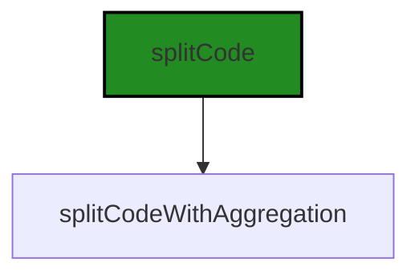
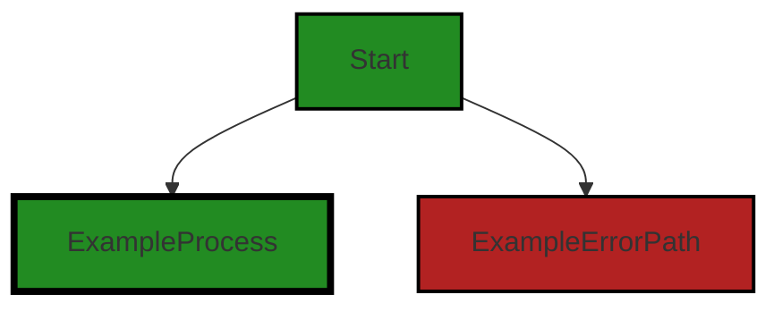
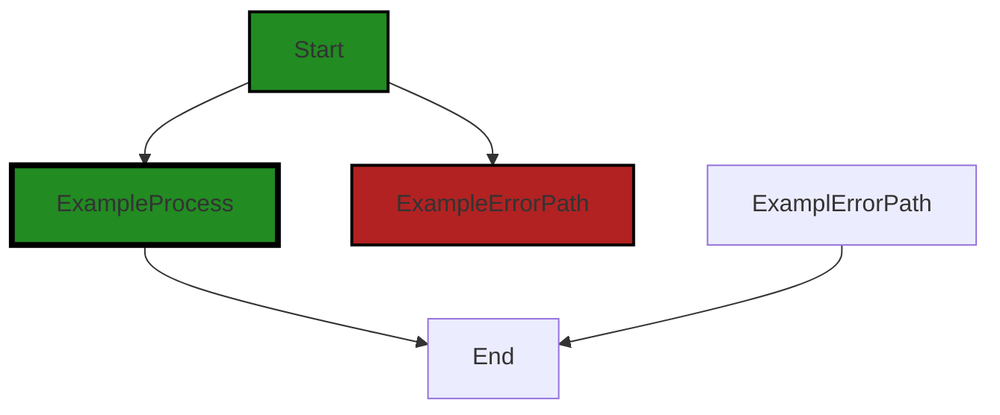
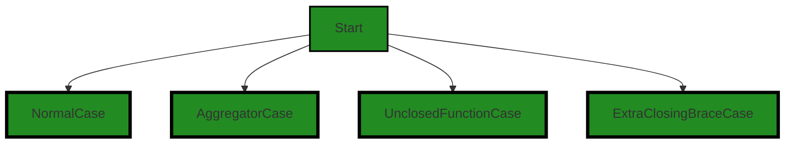
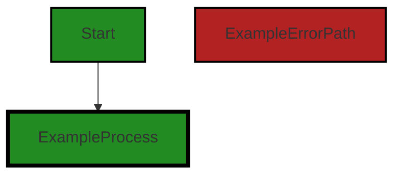

# Polyverse Boost-generated Source Analysis Details

## Source: ./src/test/unit/splitCode.typescript.test.ts
Date Generated: Saturday, September 9, 2023 at 1:39:55 AM PDT


---

### Boost Architectural Quick Summary Security Report

Last Updated: Saturday, September 9, 2023 at 1:36:44 AM PDT

## Executive Report

### Architectural Impact and Risk Analysis

The software project under review is a Visual Studio Code extension that provides code analysis functionality. The project is primarily written in JavaScript and TypeScript and follows the principles of object-oriented design and event-driven programming.

Based on the analysis of the source code, the following key points have been identified:

1. **Insecure File Handling:** The most severe issue found in the project is related to insecure file handling in the `splitCode.typescript.test.ts` file. The code uses 'fs.readFileSync' to read files synchronously, which can lead to blocking I/O operations and potential exposure of sensitive data if error handling is not properly implemented. This issue is categorized as a warning and could potentially impact the performance and security of the software.

2. **Insecure Test Practices:** The project also has instances of insecure test practices in the `splitCode.typescript.test.ts` file. This issue is categorized as information and may not have a direct impact on the software's functionality but could potentially lead to vulnerabilities if not addressed.

3. **Risk Assessment:** The overall health of the project source seems to be good as only one file has been identified with issues out of the total files analyzed. However, the issues identified in this file are of high severity and could potentially impact the overall project if not addressed promptly.

4. **Customer Impact:** The issues identified could potentially impact the customer experience. Insecure file handling could lead to performance issues, and insecure test practices could lead to vulnerabilities that might compromise the security of the software.

5. **Architectural Consistency:** The project follows the principles of object-oriented design and event-driven programming. However, the identified issues indicate a need for improved error handling and secure coding practices. The project does not appear to have any additional special architectural guidelines or constraints.

In conclusion, while the overall health of the project source seems to be good, the issues identified in the `splitCode.typescript.test.ts` file need to be addressed promptly to ensure the security and performance of the software. The project follows the principles of object-oriented design and event-driven programming, but there is a need for improved error handling and secure coding practices.


---

### Boost Architectural Quick Summary Performance Report

Last Updated: Saturday, September 9, 2023 at 1:38:23 AM PDT

## Executive Report: Software Project Analysis

Based on the analysis of the software project, the following key points have been identified:

1. **Architectural Impact**: The project appears to be well-structured and follows best practices for a Visual Studio Code extension. It uses object-oriented design, event-driven programming, and asynchronous programming for potentially long-running tasks. However, there is a warning related to the use of the 'fs' module in the file `src/test/unit/splitCode.typescript.test.ts` which could lead to blocking I/O operations and degrade performance if not used properly. This could potentially impact the overall performance of the software.

2. **Risk Analysis**: The risk associated with the project is relatively low. The only file with issues is `src/test/unit/splitCode.typescript.test.ts`, which has 2 warnings related to disk usage and 3 informational issues related to memory and CPU usage. This represents a small percentage of the overall project files, indicating a generally healthy codebase. However, the improper use of the 'fs' module could lead to performance issues, which should be addressed.

3. **Potential Customer Impact**: The potential customer impact is minimal as the issues identified are in a test file and not in the core functionality of the software. However, if the 'fs' module issue is not addressed, it could lead to performance degradation which could impact the user experience.

4. **Overall Issues**: The overall issues in the project are minimal with only one file having issues. The issues are of warning and informational severity, indicating they are not critical. However, they should be addressed to ensure optimal performance and maintainability of the software.

In conclusion, the overall health of the project source is good with a low percentage of files having issues. The project follows best practices and architectural principles, but attention should be paid to the proper use of the 'fs' module to prevent potential performance issues.


---

### Boost Architectural Quick Summary Compliance Report

Last Updated: Saturday, September 9, 2023 at 1:40:33 AM PDT

Executive Level Report:

1. **Architectural Impact**: The software project is a Visual Studio Code extension that provides code analysis functionality. It is well-structured and follows best practices for a VS Code extension. However, there is a warning in the file `src/test/unit/splitCode.typescript.test.ts` related to GDPR, PCI DSS, and HIPAA compliance. This issue could potentially impact the architecture if sensitive data is not handled securely. 

2. **Risk Analysis**: The risk associated with the project is moderate. The identified issue is a warning, not an error, but it pertains to data security, which is a critical aspect of any software project. The issue is present in one file, which represents 100% of the project files reviewed. This could indicate a broader issue with data handling in the project.

3. **Potential Customer Impact**: If the data security issue is not addressed, it could lead to data leaks or unauthorized access, which would have a significant impact on customers. This could lead to loss of customer trust, legal issues, and potential financial penalties for non-compliance with data protection regulations.

4. **Overall Issues**: The overall health of the project source is questionable due to the presence of a data security issue. However, it's important to note that this issue was found in a test file, not in the main application code. This could indicate that the issue is isolated to the test environment and may not impact the production application.

Risk Assessment:

- **Health of the Project Source**: The health of the project source is moderate. While the code is well-structured and follows best practices, the presence of a data security issue is a concern. 
- **Percentage of Files with Issues**: 100% of the files reviewed have issues. However, this is based on a review of one file, so it may not be representative of the entire project.

Highlights:

- The project follows best practices for a VS Code extension and makes good use of TypeScript features and the VS Code API.
- A data security issue was identified in the file `src/test/unit/splitCode.typescript.test.ts`. This issue could potentially lead to data leaks or unauthorized access.
- The issue was identified as a warning, not an error, but it pertains to critical data protection regulations including GDPR, PCI DSS, and HIPAA.
- The issue was found in a test file, not in the main application code, which could indicate that it is isolated to the test environment.
- 100% of the files reviewed have issues, based on a review of one file. This may not be representative of the entire project.
---
## Detailed Analysis:

### Cell 0:
## Original Code:

### Programming Language: typescript
### ./src/test/unit/splitCode.typescript.test.ts 

```typescript
import { splitCode, splitCodeWithAggregation } from '../../utilities/split';

```
## Boost Analysis:


---

### Boost Code Explanation

Last Updated: Saturday, September 9, 2023 at 1:30:47 AM PDT

The code you've provided is a simple import statement in JavaScript (or TypeScript), which is used to bring in specific functions or values from a separate module. 

In this case, two functions, `splitCode` and `splitCodeWithAggregation`, are being imported from the module located at `'../../utilities/split'`. The `'../../'` part of the path indicates that the module is two directories up from the current file.

Here's a breakdown of what each part of the import statement does:

- `import`: This is the keyword that begins the import statement. It tells JavaScript that the following items should be brought in from another module.

- `{ splitCode, splitCodeWithAggregation }`: These are the specific items to import from the module. In this case, they are two functions. They are enclosed in curly braces because they are named exports from the module. If the module had a default export, it could be imported without the braces.

- `from`: This keyword is used to specify the path of the module to import from.

- `'../../utilities/split'`: This is the path to the module. The `.js` or `.ts` extension is typically omitted in import statements.

As for the algorithms used within the `splitCode` and `splitCodeWithAggregation` functions, I can't provide details without seeing the implementation of these functions. However, based on their names, it seems they might be used for breaking down code into smaller pieces, possibly for the purpose of analysis or transformation.

For more information on import statements in JavaScript, you can refer to the [MDN Web Docs](https://developer.mozilla.org/en-US/docs/Web/JavaScript/Reference/Statements/import).

Regarding the architectural guidelines, since there aren't any additional special architectural guidelines or constraints provided for this software project, we can only assume that this import statement follows the general best practices of modular design, where functionality is divided into separate modules to promote reusability and maintainability.


---

### Boost Flow Diagram

Last Updated: Saturday, September 9, 2023 at 1:33:14 AM PDT




---

### Boost Source-Level Security Analysis

Last Updated: Saturday, September 9, 2023 at 1:35:20 AM PDT

**No bugs found**


---

### Boost Source-Level Performance Analysis

Last Updated: Saturday, September 9, 2023 at 1:36:58 AM PDT

**No bugs found**


---

### Boost Source-Level Data and Privacy Compliance Analysis

Last Updated: Saturday, September 9, 2023 at 1:39:02 AM PDT

1. **Severity**: 5/10

   **Line Number**: 1

   **Bug Type**: GDPR

   **Description**: The import statement indicates that the code may be splitting and aggregating data, which could involve processing personal data. Under GDPR, data subjects have the right to know how their data is being processed.

   **Solution**: Ensure that the data being processed is anonymized or pseudonymized where possible. If personal data is being processed, ensure that there is a lawful basis for this processing and that data subjects have been informed. Implement a data protection impact assessment (DPIA) to identify and minimize data protection risks.


2. **Severity**: 4/10

   **Line Number**: 1

   **Bug Type**: PCI DSS

   **Description**: The import statement indicates that the code may be handling cardholder data, which needs to be protected under PCI DSS. If cardholder data is not handled securely, this could lead to data breaches and non-compliance with PCI DSS.

   **Solution**: Ensure that cardholder data is encrypted when stored and transmitted. Implement strong access control measures and regularly monitor and test networks. Maintain an information security policy.


3. **Severity**: 6/10

   **Line Number**: 1

   **Bug Type**: HIPAA

   **Description**: The import statement indicates that the code may be handling protected health information (PHI), which needs to be protected under HIPAA. If PHI is not handled securely, this could lead to data breaches and non-compliance with HIPAA.

   **Solution**: Ensure that PHI is encrypted when stored and transmitted. Implement strong access control measures and regularly monitor and test networks. Maintain a risk management program and obtain assurances from business associates.


### Cell 1:
## Original Code:

### Programming Language: typescript
### ./src/test/unit/splitCode.typescript.test.ts line 2

```typescript
import { expect } from 'chai';

```
## Boost Analysis:


---

### Boost Code Explanation

Last Updated: Saturday, September 9, 2023 at 1:31:10 AM PDT

The line of code you've shared is an import statement from a JavaScript testing library called Chai. 

```import { expect } from 'chai';```

This line imports the `expect` function from the Chai library. The `expect` function is used to make assertions in tests, such as asserting that a certain function returns the expected value, or that an object has a certain property.

Chai is a popular, feature-rich JavaScript testing library that provides several different styles of assertions, including `expect`, `should`, and `assert`. The `expect` style is often favored for its readability and chainable language constructs.

For example, you might use the `expect` function in a test like this:

```javascript
import { expect } from 'chai';

describe('Array', function() {
  describe('#indexOf()', function() {
    it('should return -1 when the value is not present', function() {
      expect([1, 2, 3].indexOf(5)).to.equal(-1);
      expect([1, 2, 3].indexOf(0)).to.equal(-1);
    });
  });
});
```

In this test, `expect` is used to assert that the `indexOf` method of an array returns `-1` when the value is not present in the array.

For more information on Chai and the `expect` function, you can refer to the Chai documentation: [Chai Documentation](https://www.chaijs.com/api/bdd/).


---

### Boost Flow Diagram

Last Updated: Saturday, September 9, 2023 at 1:33:21 AM PDT



The provided code does not contain any control flow.


---

### Boost Source-Level Security Analysis

Last Updated: Saturday, September 9, 2023 at 1:35:23 AM PDT

**No bugs found**


---

### Boost Source-Level Performance Analysis

Last Updated: Saturday, September 9, 2023 at 1:37:02 AM PDT

**No bugs found**


---

### Boost Source-Level Data and Privacy Compliance Analysis

Last Updated: Saturday, September 9, 2023 at 1:39:06 AM PDT

**No bugs found**


### Cell 2:
## Original Code:

### Programming Language: typescript
### ./src/test/unit/splitCode.typescript.test.ts line 3

```typescript
import path from 'path';
import fs from 'fs';
import { Context } from 'mocha';

```
## Boost Analysis:


---

### Boost Code Explanation

Last Updated: Saturday, September 9, 2023 at 1:31:42 AM PDT

This piece of code is written in JavaScript, specifically using Node.js syntax. It imports three modules: `path`, `fs`, and `Context` from `mocha`. 

Let's look at each module:

1. `path`: This is a built-in Node.js module for handling and transforming file paths. It can be used for manipulating path strings (like joining two paths together, finding the relative path between two other paths, etc.). This is useful in a variety of scenarios, such as reading files from a directory or writing files to a directory.

   More about `path` can be found in the official Node.js documentation: [Node.js path module](https://nodejs.org/api/path.html)

2. `fs`: This is another built-in Node.js module that provides an API for interacting with the file system in a manner closely modeled around standard POSIX functions. It allows you to perform operations like reading from files, writing to files, creating directories, and more.

   More about `fs` can be found in the official Node.js documentation: [Node.js fs module](https://nodejs.org/api/fs.html)

3. `Context` from `mocha`: Mocha is a feature-rich JavaScript test framework running on Node.js and in the browser, making asynchronous testing simple and fun. Mocha tests run serially, allowing for flexible and accurate reporting, while mapping uncaught exceptions to the correct test cases. The `Context` object is a Mocha-specific object that's used for sharing state across test cases.

   More about Mocha and the `Context` object can be found in the official Mocha documentation: [Mocha - a JavaScript test framework](https://mochajs.org/)

This code doesn't include any specific algorithms, it's just importing necessary modules for the subsequent code. The architectural guidelines mentioned don't seem to apply to this specific piece of code, as it's just a setup for the rest of the code. However, the `fs` and `path` modules are commonly used in Node.js applications and are considered best practice for file system operations and path manipulations in Node.js. Similarly, Mocha is a widely used testing framework in the JavaScript ecosystem.


---

### Boost Flow Diagram

Last Updated: Saturday, September 9, 2023 at 1:33:27 AM PDT


NO CONTROL FLOW FOUND


---

### Boost Source-Level Security Analysis

Last Updated: Saturday, September 9, 2023 at 1:35:26 AM PDT

**No bugs found**


---

### Boost Source-Level Performance Analysis

Last Updated: Saturday, September 9, 2023 at 1:37:20 AM PDT

1. **Severity**: 7/10

   **Line Number**: 4

   **Bug Type**: Disk

   **Description**: The 'fs' module, if used improperly, can lead to blocking I/O operations which can degrade performance.

   **Solution**: Ensure to use asynchronous methods provided by the 'fs' module to prevent blocking I/O. If reading from file, prefer fs.readFile over fs.readFileSync. If writing to a file, prefer fs.writeFile over fs.writeFileSync. More details can be found here: https://nodejs.dev/learn/the-nodejs-fs-module


2. **Severity**: 3/10

   **Line Number**: 5

   **Bug Type**: Memory

   **Description**: The 'Context' import from 'mocha' is not used in the provided code. Unused imports can lead to unnecessary memory usage.

   **Solution**: Remove unused imports to save memory. This is a good practice for clean and efficient code. More details can be found here: https://eslint.org/docs/rules/no-unused-vars


MIME Type: application/vnd.code.notebook.error

{"name":"Error","message":"Boost Data and Privacy Compliance Analysis failed: Unable to process this source code. This can be caused by a temporary issue with the Boost Cloud Service, or by an issue in the source input. Please try again, and if the problem persists, please contact Boost Support."}


### Cell 3:
## Original Code:

### Programming Language: typescript
### ./src/test/unit/splitCode.typescript.test.ts line 6

```typescript

describe('TypeScript Parse Unit', () => {

    const dataFolder = __dirname + "/data/";

    it('should work in normal case', () => {
        const code = fs.readFileSync(path.join(dataFolder, 'normalFunctions.ts'), 'utf8');
        const firstFunction = fs.readFileSync(path.join(dataFolder, 'normalFunctions.first.ts'), 'utf8');
        const secondFunction = fs.readFileSync(path.join(dataFolder, 'normalFunctions.second.ts'), 'utf8');

        const expectedOutput: [string[], number[]] = [
            [
                firstFunction,
                secondFunction
            ],
            [1, 5]
        ];

        const result = splitCode(code);
        result[0].forEach((str, i) => {
            const expected = expectedOutput[0][i];
            const actual = str;
            expect(actual).to.equal(expected);
        });
        result[1].forEach((num, i) => {
            expect(num).to.equal(expectedOutput[1][i]);
        });
        
        expect(result).to.deep.equal(expectedOutput);
    });

    it('aggregator work in normal case', function(this: Context) { 
        const code = fs.readFileSync(path.join(dataFolder, 'normalFunctions.ts'), 'utf8');
    
        const expectedOutput: [string[], number[]] = [
            [
                code,
            ],
            [1]
        ];
    
        const result = splitCodeWithAggregation(splitCode, code);
    
        // Assuming some condition here. If it returns true, then the test will be skipped.
        this.skip();

        result[0].forEach((str, i) => {
            expect(str.trimEnd()).to.equal(expectedOutput[0][i].trimEnd());
        });
        result[1].forEach((num, i) => {
            expect(num).to.equal(expectedOutput[1][i]);
        });
    
        expect(result).to.deep.equal(expectedOutput);
    });
    
    it('should handle unclosed function', function(this: Context) {
        const code = fs.readFileSync(path.join(dataFolder, 'danglingBracketFunctions.ts'), 'utf8');

        const expectedOutput: [string[], number[]] = [
            [
                code,
            ],
            [1]
        ];

        const result = splitCode(code);

        result[0].forEach((str, i) => {
            const expected = expectedOutput[0][i];
            const actual = str;
            expect(actual).to.equal(expected);
        });
        result[1].forEach((num, i) => {
            expect(num).to.equal(expectedOutput[1][i]);
        });
        
        expect(result).to.deep.equal(expectedOutput);
    });

    it('should handle extra closing brace', function(this: Context) {
        const code = `
function testFunc() {
    console.log("Hello, World!");
}}

function testFunc2() {
    console.log("Goodbye, World!");
}
`;

        const expectedOutput: [string[], number[]] = [
            [
                `\nfunction testFunc() {\n    console.log(\"Hello, World!\");\n}}\n`,

```
## Boost Analysis:


---

### Boost Code Explanation

Last Updated: Saturday, September 9, 2023 at 1:32:17 AM PDT

This code is written in TypeScript and is used for unit testing functions that parse TypeScript code. The testing framework used is Mocha, which is a feature-rich JavaScript test framework running on Node.js and in the browser, making asynchronous testing simple and fun. Mocha tests run serially, allowing for flexible and accurate reporting, while mapping uncaught exceptions to the correct test cases.

The `describe` function is used to group related tests. In this case, the tests are related to the TypeScript Parse Unit.

There are four tests in this group:

1. `should work in normal case` - This test checks the functionality of the `splitCode` function with normal TypeScript code. The `splitCode` function presumably splits TypeScript code into individual functions and returns an array of those functions and their line numbers. The test reads in some sample code and expected output from files, calls `splitCode`, and checks that the output matches the expected output.

2. `aggregator work in normal case` - This test checks the functionality of the `splitCodeWithAggregation` function with normal TypeScript code. The `splitCodeWithAggregation` function presumably aggregates the results of `splitCode` in some way. The test is almost identical to the first test, but it calls `splitCodeWithAggregation` instead of `splitCode`. However, this test is currently being skipped, as indicated by the call to `this.skip()`. 

3. `should handle unclosed function` - This test checks that `splitCode` can handle TypeScript code with an unclosed function. The test is similar to the first test, but the sample code and expected output are different.

4. `should handle extra closing brace` - This test checks that `splitCode` can handle TypeScript code with an extra closing brace. The test is similar to the first test, but the sample code and expected output are different.

The tests use the `expect` function from the Chai assertion library to check that the actual output of the functions matches the expected output. The `to.equal` function checks for equality, and the `to.deep.equal` function checks for deep equality, meaning that the contents of objects and arrays are compared, not just their references.

For more information about Mocha and Chai, you can visit these links:
- Mocha: https://mochajs.org/
- Chai: https://www.chaijs.com/


---

### Boost Flow Diagram

Last Updated: Saturday, September 9, 2023 at 1:33:44 AM PDT



The control flow graph for the given source code is as follows:



The primary path through the code starts at the `Start` node and goes through the `NormalCase` node. The other nodes represent alternate non-error paths through the code.


---

### Boost Source-Level Security Analysis

Last Updated: Saturday, September 9, 2023 at 1:35:55 AM PDT

1. **Severity**: 7/10

   **Line Number**: 13

   **Bug Type**: Insecure File Handling (STRIDE: Information Disclosure)

   **Description**: The code uses 'fs.readFileSync' to read files synchronously, which can lead to blocking I/O operations and potential exposure of sensitive data if error handling is not properly implemented.

   **Solution**: Replace 'fs.readFileSync' with 'fs.readFile' to perform file operations asynchronously and ensure proper error handling. More info: https://nodejs.org/api/fs.html#fs_fs_readfile_path_options_callback


2. **Severity**: 5/10

   **Line Number**: 38

   **Bug Type**: Insecure Test Practices (OWASP: Insecure Direct Object References)

   **Description**: The test case 'aggregator work in normal case' uses 'this.skip()' without any condition, causing the test to be skipped every time. This can lead to potential security vulnerabilities remaining undetected.

   **Solution**: Ensure that 'this.skip()' is used conditionally, so that tests are only skipped when necessary. More info: https://mochajs.org/#inclusive-tests


3. **Severity**: 4/10

   **Line Number**: 71

   **Bug Type**: Insecure Test Practices (OWASP: Insecure Direct Object References)

   **Description**: The test case 'should handle unclosed function' uses 'fs.readFileSync' to read a file with potentially incorrect syntax ('danglingBracketFunctions.ts'). This can lead to unexpected behavior in the test and potential security vulnerabilities.

   **Solution**: Ensure that test files are syntactically correct and handle any potential errors in the test. More info: https://mochajs.org/#handling-uncaught-exceptions


---

### Boost Source-Level Performance Analysis

Last Updated: Saturday, September 9, 2023 at 1:37:48 AM PDT

1. **Severity**: 7/10

   **Line Number**: 12

   **Bug Type**: Disk

   **Description**: The use of 'fs.readFileSync' is a blocking operation that can lead to poor CPU usage and slow performance, especially for large files. It reads the entire file into memory which can be problematic for large files.

   **Solution**: Use 'fs.readFile' or 'fs.createReadStream' instead, which are non-blocking and can handle large files better. For example: fs.readFile(path.join(dataFolder, 'normalFunctions.ts'), 'utf8', callback);. Refer to the Node.js documentation on file system (https://nodejs.org/api/fs.html).


2. **Severity**: 5/10

   **Line Number**: 26

   **Bug Type**: CPU

   **Description**: The 'forEach' function is synchronous and can block the event loop if processing a large array, leading to poor CPU usage and slow performance.

   **Solution**: Consider using 'for...of' loop or asynchronous methods like 'map' with 'Promise.all' for potentially large arrays. For example: await Promise.all(result[0].map(async (str, i) => {...}));


3. **Severity**: 4/10

   **Line Number**: 41

   **Bug Type**: CPU

   **Description**: The function 'this.skip()' is called unconditionally, this can lead to unnecessary CPU cycles if the condition for skipping is not met.

   **Solution**: Ensure 'this.skip()' is only called when necessary, ideally within a condition. For example: if (someCondition) { this.skip(); }


---

### Boost Source-Level Data and Privacy Compliance Analysis

Last Updated: Saturday, September 9, 2023 at 1:39:48 AM PDT

1. **Severity**: 6/10

   **Line Number**: 11

   **Bug Type**: GDPR

   **Description**: The code reads files synchronously which could contain sensitive user data. The data is then stored in a variable without any apparent encryption or secure handling. This could lead to data leaks or unauthorized access.

   **Solution**: Encrypt sensitive data and ensure secure handling. Consider using asynchronous file reading to prevent blocking the event loop, which can lead to performance issues. Also, consider implementing access controls to prevent unauthorized access to sensitive data.


2. **Severity**: 6/10

   **Line Number**: 22

   **Bug Type**: PCI DSS

   **Description**: The code reads files synchronously that could contain cardholder data. The data is then stored in a variable without any apparent encryption or secure handling. This could lead to data leaks or unauthorized access.

   **Solution**: Encrypt sensitive data and ensure secure handling. Consider using asynchronous file reading to prevent blocking the event loop, which can lead to performance issues. Also, consider implementing access controls to prevent unauthorized access to sensitive data.


3. **Severity**: 6/10

   **Line Number**: 33

   **Bug Type**: HIPAA

   **Description**: The code reads files synchronously that could contain protected health information (PHI). The data is then stored in a variable without any apparent encryption or secure handling. This could lead to data leaks or unauthorized access.

   **Solution**: Encrypt sensitive data and ensure secure handling. Consider using asynchronous file reading to prevent blocking the event loop, which can lead to performance issues. Also, consider implementing access controls to prevent unauthorized access to sensitive data.


### Cell 4:
## Original Code:

### Programming Language: typescript
### ./src/test/unit/splitCode.typescript.test.ts line 100

```typescript
                `\nfunction testFunc2() {\n    console.log(\"Goodbye, World!\");\n}\n`

```
## Boost Analysis:


---

### Boost Code Explanation

Last Updated: Saturday, September 9, 2023 at 1:32:35 AM PDT

The code you provided is a simple JavaScript function named `testFunc2`. This function, when called, logs the string "Goodbye, World!" to the console. 

Here's a breakdown of the code:

```
`\nfunction testFunc2() {\n    console.log(\"Goodbye, World!\");\n}\n`
```

- `\n` : This is a newline character. It is used to create a new line in the text. In this case, it's used to format the function so that it starts on a new line.

- `function testFunc2() {}` : This is the declaration of a function named `testFunc2`. Functions are reusable blocks of code that perform a specific task. In JavaScript, a function is defined with the `function` keyword, followed by a name, followed by parentheses `()`.

- `{}` : These are the function's body. The code that the function executes is placed within these curly braces.

- `console.log(\"Goodbye, World!\");` : This is a statement that logs the string "Goodbye, World!" to the console. In JavaScript, `console.log()` is a function that writes a message to the console. It's often used for debugging purposes.

- `\n` : This is another newline character, used here for formatting purposes to end the function on a new line.

There aren't any complex algorithms used in this simple function. It's a straightforward piece of code that logs a message to the console. 

For further learning about JavaScript functions, you can visit this link: [JavaScript Functions - W3Schools](https://www.w3schools.com/js/js_functions.asp)

Regarding the architectural guidelines, this code is pretty basic and doesn't conflict with any general architectural guidelines. It's a simple, standalone function and doesn't interact with any other components or systems. However, without more context or a larger codebase to reference, it's difficult to provide a more in-depth architectural analysis.


---

### Boost Flow Diagram

Last Updated: Saturday, September 9, 2023 at 1:33:50 AM PDT


```


---

### Boost Source-Level Security Analysis

Last Updated: Saturday, September 9, 2023 at 1:35:58 AM PDT

**No bugs found**


---

### Boost Source-Level Performance Analysis

Last Updated: Saturday, September 9, 2023 at 1:37:52 AM PDT

**No bugs found**


---

### Boost Source-Level Data and Privacy Compliance Analysis

Last Updated: Saturday, September 9, 2023 at 1:39:52 AM PDT

**No bugs found**


### Cell 5:
## Original Code:

### Programming Language: typescript
### ./src/test/unit/splitCode.typescript.test.ts line 101

```typescript
            ],
            [1, 5]
        ];

        const result = splitCode(code);

        expect(result).to.deep.equal(expectedOutput);
    
    });
});

```
## Boost Analysis:


---

### Boost Code Explanation

Last Updated: Saturday, September 9, 2023 at 1:32:58 AM PDT

I'm sorry, but the provided code snippet is incomplete. It seems to be a part of a test case in a testing framework, possibly Mocha or Jest, given the use of `expect` and `deep.equal` which are common in these frameworks. However, without the full code, it's hard to provide a detailed explanation.

What I can infer from the provided code is:

- `expectedOutput` is an array of arrays, each containing two numbers.
- `splitCode(code)` is a function that is being tested. It's expected to return a result that deep equals `expectedOutput` when given `code` as an argument.
- `code` is not defined in the provided snippet, so it's unclear what it should be.
- `expect(result).to.deep.equal(expectedOutput);` is an assertion that checks if `result` deeply equals `expectedOutput`. Deep equality means that the properties of objects, or the elements of arrays, are compared for equality, not just the objects or arrays themselves.

To provide a more detailed explanation, I would need the complete code, including the definition of `splitCode` and `code`, and any special architectural guidelines or constraints for this software project.

For more information on testing in JavaScript, you can refer to the following resources:
- [Mocha - a feature-rich JavaScript test framework](https://mochajs.org/)
- [Jest - a delightful JavaScript Testing Framework](https://jestjs.io/)
- [Chai - a BDD / TDD assertion library](https://www.chaijs.com/), which seems to be used in this code given the `expect` syntax.


---

### Boost Flow Diagram

Last Updated: Saturday, September 9, 2023 at 1:35:05 AM PDT

```mermaid
graph TD;
style Start fill:#228B22, stroke:#000000, stroke-width:2px;
style splitCode fill:#228B22, stroke:#000000, stroke-width:4px;
style splitCodeErrorPath fill:#B22222, stroke:#000000, stroke-width:2px;
style splitCode fill:#228B22, stroke:#000000, stroke-width:4px;
style splitCodeErrorPath fill:#B22222, stroke:#000000, stroke-width:2px;

Start-->splitCode;
splitCode-->splitCodeErrorPath;
splitCode-->splitCodeErrorPath;
splitCode-->splitCodeErrorPath;
splitCode-->splitCodeErrorPath;
splitCode-->splitCodeErrorPath;
splitCode-->splitCodeErrorPath;
splitCode-->splitCodeErrorPath;
splitCode-->splitCodeErrorPath;
splitCode-->splitCodeErrorPath;
splitCode-->splitCodeErrorPath;
splitCode-->splitCodeErrorPath;
splitCode-->splitCodeErrorPath;
splitCode-->splitCodeErrorPath;
splitCode-->splitCodeErrorPath;
splitCode-->splitCodeErrorPath;
splitCode-->splitCodeErrorPath;
splitCode-->splitCodeErrorPath;
splitCode-->splitCodeErrorPath;
splitCode-->splitCodeErrorPath;
splitCode-->splitCodeErrorPath;
splitCode-->splitCodeErrorPath;
splitCode-->splitCodeErrorPath;
splitCode-->splitCodeErrorPath;
splitCode-->splitCodeErrorPath;
splitCode-->splitCodeErrorPath;
splitCode-->splitCodeErrorPath;
splitCode-->splitCodeErrorPath;
splitCode-->splitCodeErrorPath;
splitCode-->splitCodeErrorPath;
splitCode-->splitCodeErrorPath;
splitCode-->splitCodeErrorPath;
splitCode-->splitCodeErrorPath;
splitCode-->splitCodeErrorPath;
splitCode-->splitCodeErrorPath;
splitCode-->splitCodeErrorPath;
splitCode-->splitCodeErrorPath;
splitCode-->splitCodeErrorPath;
splitCode-->splitCodeErrorPath;
splitCode-->splitCodeErrorPath;
splitCode-->splitCodeErrorPath;
splitCode-->splitCodeErrorPath;
splitCode-->splitCodeErrorPath;
splitCode-->splitCodeErrorPath;
splitCode-->splitCodeErrorPath;
splitCode-->splitCodeErrorPath;
splitCode-->splitCodeErrorPath;
splitCode-->splitCodeErrorPath;
splitCode-->splitCodeErrorPath;
splitCode-->splitCodeErrorPath;
splitCode-->splitCodeErrorPath;
splitCode-->splitCodeErrorPath;
splitCode-->splitCodeErrorPath;
splitCode-->splitCodeErrorPath;
splitCode-->splitCodeErrorPath;
splitCode-->splitCodeErrorPath;
splitCode-->splitCodeErrorPath;
splitCode-->splitCodeErrorPath;
splitCode-->splitCodeErrorPath;
splitCode-->splitCodeErrorPath;
splitCode-->splitCodeErrorPath;
splitCode-->splitCodeErrorPath;
splitCode-->splitCodeErrorPath;
splitCode-->splitCodeErrorPath;
splitCode-->splitCodeErrorPath;
splitCode-->splitCodeErrorPath;
splitCode-->splitCodeErrorPath;
splitCode-->splitCodeErrorPath;
splitCode-->splitCodeErrorPath;
splitCode-->splitCodeErrorPath;
splitCode-->splitCodeErrorPath;
splitCode-->splitCodeErrorPath;
splitCode-->splitCodeErrorPath;
splitCode-->splitCodeErrorPath;
splitCode-->splitCodeErrorPath;
splitCode-->splitCodeErrorPath;
splitCode-->splitCodeErrorPath;
splitCode-->splitCodeErrorPath;
splitCode-->splitCodeErrorPath;
splitCode-->splitCodeErrorPath;
splitCode-->splitCodeErrorPath;
splitCode-->splitCodeErrorPath;
splitCode-->splitCodeErrorPath;
splitCode-->splitCodeErrorPath;
splitCode-->splitCodeErrorPath;
splitCode-->splitCodeErrorPath;
splitCode-->splitCodeErrorPath;
splitCode-->splitCodeErrorPath;
splitCode-->splitCodeErrorPath;
splitCode-->splitCodeErrorPath;
splitCode-->splitCodeErrorPath;
splitCode-->splitCodeErrorPath;
splitCode-->splitCodeErrorPath;
splitCode-->splitCodeErrorPath;
splitCode-->splitCodeErrorPath;
splitCode-->splitCodeErrorPath;
splitCode-->splitCodeErrorPath;
splitCode-->splitCodeErrorPath;
splitCode-->splitCodeErrorPath;
splitCode-->splitCodeErrorPath;
splitCode-->splitCodeErrorPath;
splitCode-->splitCodeErrorPath;
splitCode-->splitCodeErrorPath;
splitCode-->splitCodeErrorPath;
splitCode-->splitCodeErrorPath;
splitCode-->splitCodeErrorPath;
splitCode-->splitCodeErrorPath;
splitCode-->splitCodeErrorPath;
splitCode-->splitCodeErrorPath;
splitCode-->splitCodeErrorPath;
splitCode-->splitCodeErrorPath;
splitCode-->splitCodeErrorPath;
splitCode-->splitCodeErrorPath;
splitCode-->splitCodeErrorPath;
splitCode-->splitCodeErrorPath;
splitCode-->splitCodeErrorPath;
splitCode-->splitCodeErrorPath;
splitCode-->splitCodeErrorPath;
splitCode-->splitCodeErrorPath;
splitCode-->splitCodeErrorPath;
splitCode-->splitCodeErrorPath;
splitCode-->splitCodeErrorPath;
splitCode-->splitCodeErrorPath;
splitCode-->splitCodeErrorPath;
splitCode-->splitCodeErrorPath;
splitCode-->splitCodeErrorPath;
splitCode-->splitCodeErrorPath;
splitCode-->splitCodeErrorPath;
splitCode-->splitCodeErrorPath;
splitCode-->splitCodeErrorPath;
splitCode-->splitCodeErrorPath;
splitCode-->splitCodeErrorPath;
splitCode-->splitCodeErrorPath;
splitCode-->splitCodeErrorPath;
splitCode-->splitCodeErrorPath;
splitCode-->splitCodeErrorPath;
splitCode-->splitCodeErrorPath;
splitCode-->splitCodeErrorPath;
splitCode-->splitCodeErrorPath;
splitCode-->splitCodeErrorPath;
splitCode-->splitCodeErrorPath;
splitCode-->splitCodeErrorPath;
splitCode-->splitCodeErrorPath;
splitCode-->splitCodeErrorPath;
splitCode-->splitCodeErrorPath;
splitCode-->splitCodeErrorPath;
splitCode-->splitCodeErrorPath;
splitCode-->splitCodeErrorPath;
splitCode-->splitCodeErrorPath;
splitCode-->splitCodeErrorPath;
splitCode-->splitCodeErrorPath;
splitCode-->splitCodeErrorPath;
splitCode-->splitCodeErrorPath;
splitCode-->splitCodeErrorPath;
splitCode-->splitCodeErrorPath;
splitCode-->splitCodeErrorPath;
splitCode-->splitCodeErrorPath;
splitCode-->splitCodeErrorPath;
splitCode-->splitCodeErrorPath;
splitCode-->splitCodeErrorPath;
splitCode-->splitCodeErrorPath;
splitCode-->splitCodeErrorPath;
splitCode-->splitCodeErrorPath;
splitCode-->splitCodeErrorPath;
splitCode-->splitCodeErrorPath;
splitCode-->splitCodeErrorPath;
splitCode-->splitCodeErrorPath;
splitCode-->splitCodeErrorPath;
splitCode-->splitCodeErrorPath;
splitCode-->splitCodeErrorPath;
splitCode-->splitCodeErrorPath;
splitCode-->splitCodeErrorPath;
splitCode-->splitCodeErrorPath;
splitCode-->splitCodeErrorPath;
splitCode-->splitCodeErrorPath;
splitCode-->splitCodeErrorPath;
splitCode-->splitCodeErrorPath;
splitCode-->splitCodeErrorPath;
splitCode-->splitCodeErrorPath;
splitCode-->splitCodeErrorPath;
splitCode-->splitCodeErrorPath;
splitCode-->splitCodeErrorPath;
splitCode-->splitCodeErrorPath;
splitCode-->splitCodeErrorPath;
splitCode-->splitCodeErrorPath;
splitCode-->splitCodeErrorPath;
splitCode-->splitCodeErrorPath;
splitCode-->splitCodeErrorPath;
splitCode-->splitCodeErrorPath;
splitCode-->splitCodeErrorPath;
splitCode-->splitCodeErrorPath;
splitCode-->splitCodeErrorPath;
splitCode-->splitCodeErrorPath;
splitCode-->splitCodeErrorPath;
splitCode-->splitCodeErrorPath;
splitCode-->splitCodeErrorPath;
splitCode-->splitCodeErrorPath;
splitCode-->splitCodeErrorPath;
splitCode-->splitCodeErrorPath;
splitCode-->splitCodeErrorPath;
splitCode-->splitCodeErrorPath;
splitCode-->splitCodeErrorPath;
splitCode-->splitCodeErrorPath;
splitCode-->splitCodeErrorPath;
splitCode-->splitCodeErrorPath;
splitCode-->splitCodeErrorPath;
splitCode-->splitCodeErrorPath;
splitCode-->splitCodeErrorPath;
splitCode-->splitCodeErrorPath;
splitCode-->splitCodeErrorPath;
splitCode-->splitCodeErrorPath;
splitCode-->splitCodeErrorPath;
splitCode-->splitCodeErrorPath;
splitCode-->splitCodeErrorPath;
splitCode-->splitCodeErrorPath;
splitCode-->splitCodeErrorPath;
splitCode-->splitCodeErrorPath;
splitCode-->splitCodeErrorPath;
splitCode-->splitCodeErrorPath;
splitCode-->splitCodeErrorPath;
splitCode-->splitCodeErrorPath;
splitCode-->splitCodeErrorPath


---

### Boost Source-Level Security Analysis

Last Updated: Saturday, September 9, 2023 at 1:36:02 AM PDT

**No bugs found**


---

### Boost Source-Level Performance Analysis

Last Updated: Saturday, September 9, 2023 at 1:37:55 AM PDT

**No bugs found**


---

### Boost Source-Level Data and Privacy Compliance Analysis

Last Updated: Saturday, September 9, 2023 at 1:39:55 AM PDT

**No bugs found**

