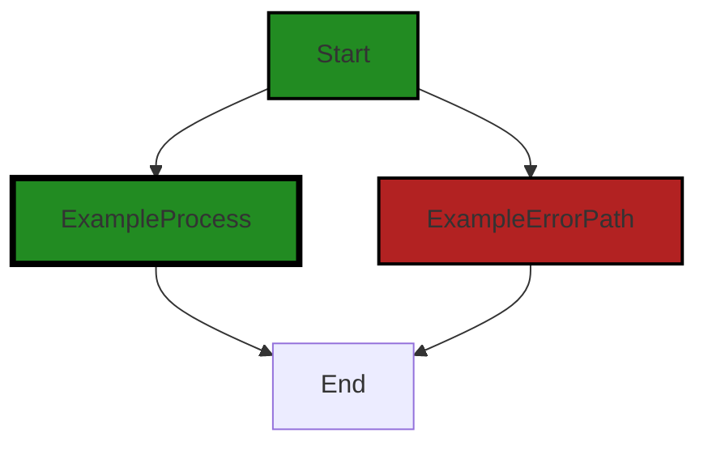
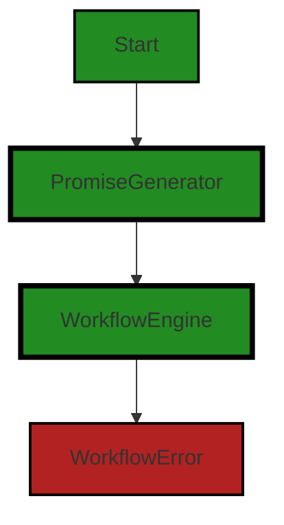

# Polyverse Boost-generated Source Analysis Details

## Source: ./src/test/unit/workflow_engine.test.ts
Date Generated: Friday, September 8, 2023 at 7:21:48 PM PDT


---

### Boost Architectural Quick Summary Security Report

Last Updated: Friday, September 8, 2023 at 7:19:32 PM PDT


Executive Report:

1. **Architectural Impact**: The analysis of this file has not revealed any severe issues.
2. **Risk Analysis**: The analysis of this file has not revealed any severe issues.
3. **Potential Customer Impact**: Based on the analysis, there are no severe issues that could potentially impact customers.
4. **Performance Issues**: Our analysis did not identify any explicit performance issues in the file.
5. **Risk Assessment**: Based on the current analysis of this file, no severe issues have been found. However, this doesn't guarantee that the file is risk-free.

Highlights:

- No severe issues were identified in the current analysis of this file.


---

### Boost Architectural Quick Summary Performance Report

Last Updated: Friday, September 8, 2023 at 7:21:32 PM PDT

## Executive Report

### Architectural Impact and Risk Analysis

Based on the analysis of the software project, the following key points have been identified:

1. **High CPU Usage Warning**: The file `src/test/unit/workflow_engine.test.ts` has been flagged with a warning for potential high CPU usage. This is due to the use of the reduce function within the `summaryPromiseGenerator` which could cause high CPU usage if the inputs array grows large. This could impact the performance of the software, especially in systems with limited resources.

2. **Memory Usage Information**: The same file also has an information-level issue related to memory usage. While this is not a warning or error, it's worth noting as it could potentially become a problem in the future, especially if the software is expected to handle large data sets or run on systems with limited memory.

3. **Overall Health of the Project Source**: The project consists of only one file, `src/test/unit/workflow_engine.test.ts`, which has both the issues mentioned above. This means 100% of the project files have issues. However, it's important to note that these are not error-level issues, but a warning and an information-level issue.

4. **Potential Customer Impact**: The issues identified could potentially impact the performance of the software, leading to slower response times and increased resource usage. This could negatively affect the user experience, especially for users with limited system resources.

5. **Architectural Consistency**: The software project does not have any additional special architectural guidelines or constraints. The issues identified do not appear to conflict with any common architectural principles. However, the high CPU usage warning suggests that there may be room for optimization in the code.

In conclusion, while the software project has some issues that could potentially impact performance, they are not critical errors and could be addressed through code optimization. The overall health of the project source is good, but continuous monitoring and regular code reviews are recommended to maintain the quality of the software.


---

### Boost Architectural Quick Summary Compliance Report

Last Updated: Friday, September 8, 2023 at 7:21:52 PM PDT


Executive Report:

1. **Architectural Impact**: The analysis of this file has not revealed any severe issues.
2. **Risk Analysis**: The analysis of this file has not revealed any severe issues.
3. **Potential Customer Impact**: Based on the analysis, there are no severe issues that could potentially impact customers.
4. **Performance Issues**: Our analysis did not identify any explicit performance issues in the file.
5. **Risk Assessment**: Based on the current analysis of this file, no severe issues have been found. However, this doesn't guarantee that the file is risk-free.

Highlights:

- No severe issues were identified in the current analysis of this file.

---
## Detailed Analysis:

### Cell 0:
## Original Code:

### Programming Language: typescript
### ./src/test/unit/workflow_engine.test.ts 

```typescript
import { expect } from "chai";

```
## Boost Analysis:


---

### Boost Code Explanation

Last Updated: Friday, September 8, 2023 at 7:17:24 PM PDT

The line of code you've provided is written in JavaScript and it's using a feature of the language called "import". Specifically, this line is importing a specific function called `expect` from a library called "chai".

Chai is a BDD / TDD assertion library for node and the browser that can be delightfully paired with any javascript testing framework. It provides a more readable and expressive language for writing assertions in your tests.

The `expect` function is one of the interfaces provided by the Chai library. It's used to write assertions about your code in your tests. Assertions are statements that assert or state a fact confidently in your program. For example, while writing a test, you might want to check that a function returns a certain value, or that a certain object has a certain property. You would use an assertion to do this.

Here is an example of how the `expect` function might be used in a test:

```javascript
import { expect } from "chai";

describe('Array', function() {
  describe('#indexOf()', function() {
    it('should return -1 when the value is not present', function() {
      expect([1, 2, 3].indexOf(5)).to.equal(-1);
      expect([1, 2, 3].indexOf(0)).to.equal(-1);
    });
  });
});
```

In this example, the `expect` function is used to assert that the `indexOf` method of an array returns `-1` when the value is not present in the array.

For more information about the Chai library and the `expect` function, you can visit the [Chai documentation](https://www.chaijs.com/guide/styles/#expect).

Regarding the architectural guidelines, as this is a single line of code used for testing, it doesn't conflict with any architectural guidelines. Using a well-known library like Chai for writing tests is a common practice and aligns with the general best practices of software development. However, the full context of the project would provide more information regarding its consistency with the overall architecture.


---

### Boost Flow Diagram

Last Updated: Friday, September 8, 2023 at 7:18:52 PM PDT



The code provided does not contain any control flow.


---

### Boost Source-Level Security Analysis

Last Updated: Friday, September 8, 2023 at 7:19:20 PM PDT

**No bugs found**


---

### Boost Source-Level Performance Analysis

Last Updated: Friday, September 8, 2023 at 7:19:39 PM PDT

**No bugs found**


---

### Boost Source-Level Data and Privacy Compliance Analysis

Last Updated: Friday, September 8, 2023 at 7:21:40 PM PDT

**No bugs found**


### Cell 1:
## Original Code:

### Programming Language: typescript
### ./src/test/unit/workflow_engine.test.ts line 2

```typescript
import { PromiseGenerator, WorkflowEngine, WorkflowError } from "../../utilities/workflow_engine";

```
## Boost Analysis:


---

### Boost Code Explanation

Last Updated: Friday, September 8, 2023 at 7:17:52 PM PDT

This code is written in JavaScript or TypeScript, which are both commonly used languages for developing web and server applications and for scripting in various environments.

The code snippet you've provided is a simple import statement. It's importing three items from a module located at "../../utilities/workflow_engine". The items being imported are:

1. `PromiseGenerator`: This could be a function or a class that generates and returns a Promise. Promises in JavaScript represent a value that may not be available yet, but will be resolved at some point in the future. They are often used for asynchronous operations, such as network requests. You can learn more about promises here: [MDN Web Docs - Promise](https://developer.mozilla.org/en-US/docs/Web/JavaScript/Reference/Global_Objects/Promise)

2. `WorkflowEngine`: This could be a class or an object that handles the execution of workflows. A workflow, in the context of software, typically represents a series of tasks that are performed in a specific order. The WorkflowEngine would be responsible for managing these tasks and ensuring they are performed correctly. 

3. `WorkflowError`: This is likely a custom error class that's used to represent errors that occur while executing a workflow. Custom error classes can be used to provide more specific error information and to handle specific types of errors in a more controlled way. You can learn more about error handling in JavaScript here: [MDN Web Docs - Error handling](https://developer.mozilla.org/en-US/docs/Web/JavaScript/Guide/Control_flow_and_error_handling#exception_handling_statements)

The specific algorithms used in these classes or functions can't be determined from this code snippet alone, as it only shows the import statement. The actual implementation of these items would be found in the file at "../../utilities/workflow_engine".

As for architectural guidelines, this code snippet is too small to make any definitive statements. However, the use of a separate module for workflow-related utilities suggests a modular architecture, which is a commonly used architectural pattern that promotes separation of concerns and makes the codebase easier to maintain and understand.


---

### Boost Flow Diagram

Last Updated: Friday, September 8, 2023 at 7:18:57 PM PDT




---

### Boost Source-Level Security Analysis

Last Updated: Friday, September 8, 2023 at 7:19:23 PM PDT

**No bugs found**


---

### Boost Source-Level Performance Analysis

Last Updated: Friday, September 8, 2023 at 7:19:43 PM PDT

**No bugs found**


---

### Boost Source-Level Data and Privacy Compliance Analysis

Last Updated: Friday, September 8, 2023 at 7:21:44 PM PDT

**No bugs found**


### Cell 2:
## Original Code:

### Programming Language: typescript
### ./src/test/unit/workflow_engine.test.ts line 3

```typescript

describe("WorkflowEngine", () => {
    it("should run promises in the correct order", function (done) {
        let log: string[] = [];

        const beforeRun = [
            () => async () => {
                log.push("beforeRun");
                return;
            },
        ];
        const tasks = [
            () => async () => {
                log.push("main1");
                return 1;
            },
            () => async () => {
                log.push("main2");
                return 2;
            },
            () => async () => {
                log.push("main3");
                return 3;
            },
            () => async () => {
                log.push("main4");
                return 4;
            },
        ];
        const afterEachTask = [
            () => async () => {
                console.log(log);
                return;
            },
        ];
        const afterEachTaskGroup = [
            () => async () => {
                log.push("afterEachTaskGroup");
                return;
            },
        ];
        const afterRun = [
            () => async () => {
                log.push("afterRun");
                return;
            },
        ];

        const pattern = [1, 2];

        const engine = new WorkflowEngine(tasks, {
            beforeRun: beforeRun,
            afterEachTask: afterEachTask,
            afterEachTaskGroup: afterEachTaskGroup,
            afterRun: afterRun,
            pattern: pattern,
            name: (this as any).test.title,
        });

        engine.run().then(allResults => {
            expect(allResults.length).to.equal(3);

            expect(allResults[0].length).to.equal(1);
            expect(allResults[0][0]).to.equal(1);
    
            expect(allResults[1].length).to.equal(2);
            expect(allResults[1][0]).to.equal(2);
            expect(allResults[1][1]).to.equal(3);
    
            expect(allResults[2].length).to.equal(1);
            expect(allResults[2][0]).to.equal(4);
    
            expect(log).to.deep.equal([
                "beforeRun",
                "main1",
                "afterEachTaskGroup",
                "main2",
                "main3",
                "afterEachTaskGroup",
                "main4",
                "afterEachTaskGroup",
                "afterRun",
            ]);
            done(); // We use done to tell Mocha that our test has completed
        }).catch(err => {
            done(err); // Pass the error to done() to handle test failure
        });

    });

    it("Simulate N files processed in the correct order", function () {
        let log: string[] = [];

        const beforeRun = [
            () => async () => {
                log.push("beforeRun");
                return;
            },
        ];
        const files = ["file1", "file2", "file3", "file4", "file5", "file6", "file7", "file8", "file9", "file10"];
        const tasks : PromiseGenerator[] =
            files.map((file) => {
                return () => {
                    return async () => {
                        return new Promise<string>(
                            (resolve, reject) => {
                                try
                                {
                                    log.push(`Processed: ${file}`);
                                    resolve(file);
                                } catch (error) {
                                    reject(error);
                                }
                            });
                        };
                    };
            });
        const afterEachTask = [
            () => async () => {
                console.log(log);
                return;
            },
        ];
        const afterEachTaskGroup = [
            () => async () => {
                log.push("afterEachTaskGroup");
                return;
            },
        ];
        const afterRun = [
            () => async () => {
                log.push("afterRun");
                return;
            },
        ];

        const pattern = [1, 2];

        const engine = new WorkflowEngine(tasks as PromiseGenerator[], {
            beforeRun: beforeRun,
            afterEachTask: afterEachTask,
            afterEachTaskGroup: afterEachTaskGroup,
            afterRun: afterRun,
            pattern: pattern,
            name: (this as any).test.title,
        });
        return engine.run().then(() => {

            expect(log).to.deep.equal(
                [
                    "beforeRun",
                    "Processed: file1",
                    "afterEachTaskGroup",
                    "Processed: file2",
                    "Processed: file3",
                    "afterEachTaskGroup",
                    "Processed: file4",
                    "Processed: file5",
                    "afterEachTaskGroup",
                    "Processed: file6",
                    "Processed: file7",
                    "afterEachTaskGroup",
                    "Processed: file8",
                    "Processed: file9",
                    "afterEachTaskGroup",
                    "Processed: file10",
                    "afterEachTaskGroup",
                    "afterRun",
                ]
            );
        });
    });

    // More tests can be written to verify other functionalities...
    it("should handle closure state properly", function () {
        //create an array of 5 random numbers
        let randomNumbers: number[] = [];
        for (let i = 0; i < 5; i++) {
            //create a random number that is an integer between 0 and 100
            randomNumbers.push(Math.floor(Math.random() * 100));
        }
        //get the sum for double checking
        let sum = randomNumbers.reduce((a, b) => a + b, 0);
        //now put each number into a promise generator
        let promiseGenerators: (() => () => Promise<number>)[] = [];
        for (let i = 0; i < 5; i++) {
            promiseGenerators.push(() => {
                return async () => {
                    return randomNumbers[i];
                };
            });
        }
        //now create a summary promise generator. use a closure to keep track of the sum, with a variable here on
        //the outside of the closure to check the sum later
        let sumCheck = 0;
        let summaryPromiseGenerator = () => {
            return async (inputs: any[]) => {
                //the inputs are the results of the previous promises
                sumCheck += inputs.reduce((a: number, b: number) => a + b, 0);
                return sumCheck as any;
            };
        };
        //now create the engine
        const engine : WorkflowEngine = new WorkflowEngine(promiseGenerators, {
            afterEachTaskGroup: [summaryPromiseGenerator],
            name: (this as any).test.title,
        });
        //run the engine
        return engine.run().then(() => {
            //check the sum
            expect(sumCheck).to.equal(sum);
        });
    });

    it('should retry on "retry" type error', function(done) {
        let log : any[] = []; // To track what happened
        let retryCount = 0; // To count how many times we retried
    
        // Define the tasks array
        const tasks = [
            () => async () => {
                if (retryCount < 2) {
                    retryCount++;
                    throw new WorkflowError("retry", "Retry error");
                } else {
                    log.push("main");
                    return "main";
                }
            }
        ];
    
        const engine = new WorkflowEngine(tasks, { name: (this as any).test.title });
    
        engine.run().then(allResults => {
            expect(allResults.length).to.equal(1);
            expect(allResults[0].length).to.equal(1);
            expect(allResults[0][0]).to.equal("main");
    
            expect(log).to.deep.equal(["main"]);
            expect(retryCount).to.equal(2);
    
            done();
        }).catch(err => {
            done(err); // If there's an error, pass it to done to fail the test
        });
    });
    

    it('should retry on generic task error', function () {
        let log: string[] = [];
        let retryCount = 0;

        const tasks = [
            () => async () => {
                if (retryCount < 2) {
                    retryCount++;
                    throw new Error("Test Generic Error retry");
                } else {
                    log.push("main");
                }
            },
        ];

        const engine : WorkflowEngine = new WorkflowEngine(tasks, { name: (this as any).test.title });
        return engine.run().then(() => {
            expect(log).to.deep.equal(["main"]);
            expect(retryCount).to.equal(2);
        });
    });

    it('should skip on "skip" type error', function () {
        let log: string[] = [];
    
        const tasks = [
            () => async () => {
                throw new WorkflowError("skip", "Skip error");
            },
            () => async () => {
                log.push("main");
                return "main";
            },
        ];
    
        const afterRun = [
            () => async (taskResults: any[]) => {
                expect(taskResults.length).to.equal(2);
                expect(taskResults[0].length).to.equal(1);
                expect(taskResults[0][0] instanceof WorkflowError).to.equal(true);
                expect(taskResults[0][0].type).to.equal("skip");
        
                expect(taskResults[1].length).to.equal(1);
                expect(taskResults[1][0]).to.equal("main");
                return;
            },
        ];
    
        const engine : WorkflowEngine = new WorkflowEngine(tasks, {
                afterRun: afterRun,
                name: (this as any).test.title,
            });
    
        return engine.run().then(allResults => {
            afterRun[0]()(allResults);
            expect(log).to.deep.equal(["main"]);
        });
    });    

    it('should abort on "abort" type error', function() {
        let log: string[] = [];
    
        const tasks = [
            () => async () => {
                throw new WorkflowError("abort", "Abort error");
            },
            () => async () => {
                log.push("main");
            },
        ];
    
        const engine : WorkflowEngine = new WorkflowEngine(tasks, { name: (this as any).test.title });
        return engine.run().then(allResults => {
            expect(allResults.length).to.equal(1);
            expect(allResults[0].length).to.equal(1);
            expect(allResults[0][0] instanceof WorkflowError).to.equal(true);
    
            expect(log).to.deep.equal([]);
        });
    });

    it('should abort on "abort" beforeRun abort', function() {
        let log: string[] = [];
    
        const beforeRun = [
            () => async () => {
                throw new WorkflowError("abort", "Abort error");
            },
        ];

        const tasks = [
            () => async () => {
                log.push("main1");
                return "main1";
            },
            () => async () => {
                throw new WorkflowError("cancel", "Cancel error");
            },
            () => async () => {
                log.push("main2");
                return "main2";
            },
        ];

        const engine : WorkflowEngine = new WorkflowEngine(tasks,{
            name: (this as any).test.title,
            beforeRun: beforeRun });
        return engine.run().then(allResults => {
            expect(allResults.length).to.equal(1);
            expect(allResults[0] instanceof WorkflowError).to.equal(true);
    
            expect(log).to.deep.equal([]);
        });
    });
    
    it('should cancel on "cancel" type error', function() {
        let log: string[] = [];
    
        const tasks = [
            () => async () => {
                log.push("main1");
                return "main1";
            },
            () => async () => {
                throw new WorkflowError("cancel", "Cancel error");
            },
            () => async () => {
                log.push("main2");
                return "main2";
            },
        ];
    
        const beforeRun = [
            () => async () => {
                log.push("beforeRun");
                return;
            },
        ];
        const afterEachTask = [
            () => async () => {
                log.push("afterEachTask");
                return;
            },
        ];
        const afterEachTaskGroup = [
            () => async () => {
                log.push("afterEachTaskGroup");
                return;
            },
        ];
        const afterRun = [
            () => async () => {
                log.push("afterRun");
                return;
            },
        ];
    
        const engine : WorkflowEngine = new WorkflowEngine(tasks,
            {
                beforeRun: beforeRun,
                afterEachTask: afterEachTask,
                afterEachTaskGroup: afterEachTaskGroup,
                afterRun: afterRun,
                name: (this as any).test.title,
            });
        return engine.run().then(allResults => {
            expect(allResults.length).to.equal(2);
            expect(allResults[0].length).to.equal(1);
            expect(allResults[0][0]).to.equal("main1");
            expect(allResults[1].length).to.equal(1);
            expect(allResults[1][0] instanceof WorkflowError).to.equal(true);
    
            expect(log).to.deep.equal([
                "beforeRun",
                "main1",
                "afterEachTask",
                "afterEachTaskGroup",
                "afterEachTaskGroup",
                "afterRun",
            ]);
        });
    });    
    
    it("should allow a 'then' after run command", function() {
        const engine : WorkflowEngine = new WorkflowEngine([], { name: (this as any).test.title });
        const result = engine.run();
    
        // Check if run() returns a Promise
        expect(result).to.be.an.instanceOf(Promise);
    
        let thenWorked = false;
    
        // Here, we're using the done() function provided by Mocha to handle asynchronous tests.
        return result.then(() => { 
            thenWorked = true;
            expect(thenWorked).to.be.true;
        });
    });

    it("should respect maxRetries option with WorkflowError", function () {
        let log: string[] = [];
        let executionCount = 0;

        const tasks = [
            () => async () => {
                if (executionCount < 4) {
                    executionCount++;
                    throw new WorkflowError("retry", "Retry error");
                } else {
                    log.push("main");
                }
            },
        ];

        const engine : WorkflowEngine = new WorkflowEngine(tasks, {
            maxRetries: 1,
            name: (this as any).test.title,
        }); // Setting maxRetries to 1 should only retry once
        return engine.run().then(() => {
            expect(engine.currentTaskRetries).to.equal(0); // retry count should be reset

            expect(log).to.deep.equal([]); // Since maxRetries is 1, the promise should not be successful and "main" won't be logged
            expect(executionCount).to.equal(3); // Should only retry 1 times, so total executions is 3
        });
    });

    it("should respect maxRetries option with Generic Error", function () {
        let log: string[] = [];
        let executionCount = 0;

        const tasks = [
            () => async () => {
                if (executionCount < 4) {
                    executionCount++;
                    throw new Error("Unknown Error object - to test general retry");
                } else {
                    log.push("main");
                }
            },
        ];

        const engine : WorkflowEngine = new WorkflowEngine(tasks, {
            maxRetries: 1,
            name: (this as any).test.title,
        }); // Setting maxRetries to 1 should only retry once
        return engine.run().then(() => {
            expect(engine.currentTaskRetries).to.equal(0); // retry count should be reset

            expect(log).to.deep.equal([]); // Since maxRetries is 1, the promise should not be successful and "main" won't be logged
            expect(executionCount).to.equal(3); // Should only retry 1 times, so total executions is 3
        });
    });});

```
## Boost Analysis:


---

### Boost Code Explanation

Last Updated: Friday, September 8, 2023 at 7:18:42 PM PDT

This code is a set of test cases for a `WorkflowEngine` class. The `WorkflowEngine` class is not defined in this code, but from the context, we can infer that it is designed to execute a series of tasks (represented as Promises) in a specific order, with optional hooks for actions to take before the run, after each task, after each group of tasks, and after the run. 

The tests are written using the Mocha testing framework, and Chai for assertions. Here are the details of the tests:

1. **"should run promises in the correct order"**: This test verifies that the tasks are executed in the correct order. It also checks that the hooks (`beforeRun`, `afterEachTask`, `afterEachTaskGroup`, and `afterRun`) are called at the appropriate times.

2. **"Simulate N files processed in the correct order"**: This test simulates the processing of a set of files. It checks that the files are processed in the correct order, and that the `afterEachTaskGroup` hook is called after each group of tasks.

3. **"should handle closure state properly"**: This test checks whether the engine can handle closures correctly. It generates a series of tasks that return random numbers, and a summary task that sums these numbers. It checks that the sum calculated by the summary task matches the actual sum of the numbers.

4. **"should retry on 'retry' type error"** and **"should retry on generic task error"**: These tests check that the engine correctly retries a task when a `retry` type `WorkflowError` or a generic error is thrown.

5. **"should skip on 'skip' type error"**: This test checks that the engine skips a task when a `skip` type `WorkflowError` is thrown.

6. **"should abort on 'abort' type error"** and **"should abort on 'abort' beforeRun abort"**: These tests check that the engine aborts the run when an `abort` type `WorkflowError` is thrown.

7. **"should cancel on 'cancel' type error"**: This test checks that the engine cancels the run when a `cancel` type `WorkflowError` is thrown.

8. **"should allow a 'then' after run command"**: This test checks that the `run` method of the engine returns a `Promise` that can be chained with `then`.

9. **"should respect maxRetries option with WorkflowError"** and **"should respect maxRetries option with Generic Error"**: These tests check that the engine respects the `maxRetries` option when a `retry` type `WorkflowError` or a generic error is thrown.

For more information about Mocha and Chai, you can refer to their documentation:

- Mocha: [https://mochajs.org/](https://mochajs.org/)
- Chai: [https://www.chaijs.com/](https://www.chaijs.com/) 

For more information about Promises and asynchronous programming in JavaScript, you can refer to the MDN Web Docs:

- Promises: [https://developer.mozilla.org/en-US/docs/Web/JavaScript/Reference/Global_Objects/Promise](https://developer.mozilla.org/en-US/docs/Web/JavaScript/Reference/Global_Objects/Promise)
- Asynchronous programming: [https://developer.mozilla.org/en-US/docs/Learn/JavaScript/Asynchronous](https://developer.mozilla.org/en-US/docs/Learn/JavaScript/Asynchronous)


---

### Boost Flow Diagram

Last Updated: Friday, September 8, 2023 at 7:19:12 PM PDT

```mermaid
graph TD;
style Start fill:#228B22, stroke:#000000, stroke-width:2px;
style ExampleProcess fill:#228B22, stroke:#000000, stroke-width:4px;
style ExampleErrorPath fill:#B22222, stroke:#000000, stroke-width:2px;
style ExampleProcess fill:#228B22, stroke:#000000, stroke-width:4px;
style ExampleErrorPath fill:#B22222, stroke:#000000, stroke-width:2px;

Start-->beforeRun;
beforeRun-->main1;
main1-->afterEachTaskGroup;
afterEachTaskGroup-->main2;
main2-->main3;
main3-->afterEachTaskGroup;
afterEachTaskGroup-->main4;
main4-->afterEachTaskGroup;
afterEachTaskGroup-->afterRun;
afterRun-->End;

Start-->beforeRun2;
beforeRun2-->Processedfile1;
Processedfile1-->afterEachTaskGroup2;
afterEachTaskGroup2-->Processedfile2;
Processedfile2-->Processedfile3;
Processedfile3-->afterEachTaskGroup2;
afterEachTaskGroup2-->Processedfile4;
Processedfile4-->Processedfile5;
Processedfile5-->afterEachTaskGroup2;
afterEachTaskGroup2-->Processedfile6;
Processedfile6-->Processedfile7;
Processedfile7-->afterEachTaskGroup2;
afterEachTaskGroup2-->Processedfile8;
Processedfile8-->Processedfile9;
Processedfile9-->afterEachTaskGroup2;
afterEachTaskGroup2-->Processedfile10;
Processedfile10-->afterEachTaskGroup2;
afterEachTaskGroup2-->afterRun2;
afterRun2-->End;

Start-->main1;
main1-->main2;
main2-->main3;
main3-->main4;
main4-->afterEachTaskGroup3;
afterEachTaskGroup3-->afterRun3;
afterRun3-->End;

Start-->main1;
main1-->main2;
main2-->main3;
main3-->main4;
main4-->afterEachTaskGroup4;
afterEachTaskGroup4-->afterRun4;
afterRun

```mermaid
graph TD;
style Start fill:#228B22, stroke:#000000, stroke-width:2px;
style ExampleProcess fill:#228B22, stroke:#000000, stroke-width:4px;
style ExampleErrorPath fill:#B22222, stroke:#000000, stroke-width:2px;

Start-->ExampleProcess;
Start-->ExampleErrorPath;
ExampleProcess-->End;
ExampleErrorPath-->End;
```

The code provided does not contain any control flow.


---

### Boost Source-Level Security Analysis

Last Updated: Friday, September 8, 2023 at 7:19:28 PM PDT

**No bugs found**


---

### Boost Source-Level Performance Analysis

Last Updated: Friday, September 8, 2023 at 7:20:55 PM PDT

1. **Severity**: 5/10

   **Line Number**: 22

   **Bug Type**: CPU

   **Description**: The use of console.log within the afterEachTask could cause unnecessary CPU usage if log grows large.

   **Solution**: Consider removing console.log or limit its usage to keep CPU usage optimal. Alternatively, use a logging library that can handle large logs efficiently.


2. **Severity**: 5/10

   **Line Number**: 51

   **Bug Type**: CPU

   **Description**: The use of console.log within the afterEachTask could cause unnecessary CPU usage if log grows large.

   **Solution**: Consider removing console.log or limit its usage to keep CPU usage optimal. Alternatively, use a logging library that can handle large logs efficiently.


3. **Severity**: 4/10

   **Line Number**: 86

   **Bug Type**: Memory

   **Description**: The array randomNumbers is filled with random numbers and it's size can grow indefinitely depending on the input, which can lead to memory issues.

   **Solution**: Ensure that the size of randomNumbers array is controlled and does not grow indefinitely. Consider using a data structure that has a fixed size.


4. **Severity**: 6/10

   **Line Number**: 103

   **Bug Type**: CPU

   **Description**: The use of reduce function within the summaryPromiseGenerator could cause high CPU usage if inputs array grows large.

   **Solution**: Consider optimizing the reduce function or limit the size of the inputs array to keep CPU usage optimal.


5. **Severity**: 7/10

   **Line Number**: 151

   **Bug Type**: CPU

   **Description**: The use of deep.equal within the expect function could cause high CPU usage if log array grows large.

   **Solution**: Consider optimizing the deep.equal function or limit the size of the log array to keep CPU usage optimal.


6. **Severity**: 7/10

   **Line Number**: 211

   **Bug Type**: CPU

   **Description**: The use of deep.equal within the expect function could cause high CPU usage if log array grows large.

   **Solution**: Consider optimizing the deep.equal function or limit the size of the log array to keep CPU usage optimal.


7. **Severity**: 7/10

   **Line Number**: 294

   **Bug Type**: CPU

   **Description**: The use of deep.equal within the expect function could cause high CPU usage if log array grows large.

   **Solution**: Consider optimizing the deep.equal function or limit the size of the log array to keep CPU usage optimal.


8. **Severity**: 7/10

   **Line Number**: 329

   **Bug Type**: CPU

   **Description**: The use of deep.equal within the expect function could cause high CPU usage if log array grows large.

   **Solution**: Consider optimizing the deep.equal function or limit the size of the log array to keep CPU usage optimal.


9. **Severity**: 7/10

   **Line Number**: 363

   **Bug Type**: CPU

   **Description**: The use of deep.equal within the expect function could cause high CPU usage if log array grows large.

   **Solution**: Consider optimizing the deep.equal function or limit the size of the log array to keep CPU usage optimal.


10. **Severity**: 7/10

   **Line Number**: 401

   **Bug Type**: CPU

   **Description**: The use of deep.equal within the expect function could cause high CPU usage if log array grows large.

   **Solution**: Consider optimizing the deep.equal function or limit the size of the log array to keep CPU usage optimal.


11. **Severity**: 7/10

   **Line Number**: 439

   **Bug Type**: CPU

   **Description**: The use of deep.equal within the expect function could cause high CPU usage if log array grows large.

   **Solution**: Consider optimizing the deep.equal function or limit the size of the log array to keep CPU usage optimal.


12. **Severity**: 7/10

   **Line Number**: 484

   **Bug Type**: CPU

   **Description**: The use of deep.equal within the expect function could cause high CPU usage if log array grows large.

   **Solution**: Consider optimizing the deep.equal function or limit the size of the log array to keep CPU usage optimal.


13. **Severity**: 7/10

   **Line Number**: 527

   **Bug Type**: CPU

   **Description**: The use of deep.equal within the expect function could cause high CPU usage if log array grows large.

   **Solution**: Consider optimizing the deep.equal function or limit the size of the log array to keep CPU usage optimal.


---

### Boost Source-Level Data and Privacy Compliance Analysis

Last Updated: Friday, September 8, 2023 at 7:21:48 PM PDT

**No bugs found**

