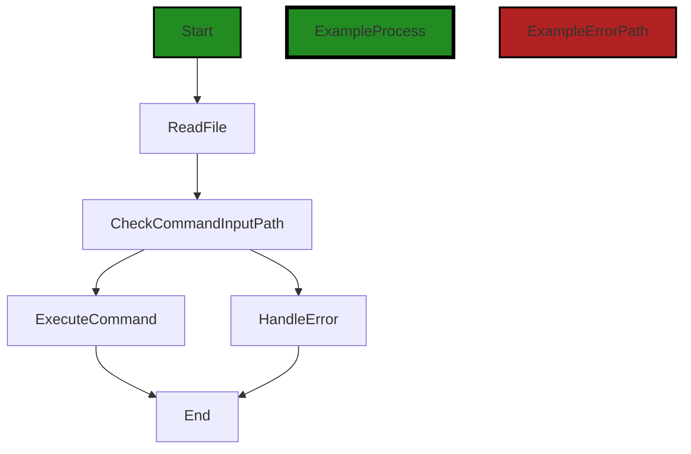

# Polyverse Boost-generated Source Analysis Details

## Source: ./src/test/yourActualCommand.ts
Date Generated: Friday, September 8, 2023 at 6:22:06 PM PDT


---

### Boost Architectural Quick Summary Security Report

Last Updated: Friday, September 8, 2023 at 6:21:10 PM PDT

# Executive Report: Software Project Analysis

## Architectural Impact and Risk Analysis

1. **Command Injection Vulnerability**: The most severe issue identified is a command injection vulnerability in the `src/test/yourActualCommand.ts` file. This vulnerability could allow an attacker to execute arbitrary commands if they manage to control the command or arguments. This poses a significant risk to the security of the software and its users. The architectural impact is significant as it may require a redesign of the way commands are executed and validated.

2. **Improper Input Validation and Insecure Deserialization**: These issues were identified as warnings in the `src/test/yourActualCommand.ts` file. While not as severe as the command injection vulnerability, they still pose a risk to the software's security and reliability. The architectural impact may involve implementing additional validation and sanitization measures.

3. **Overall Project Health**: Only one file was analyzed, and it contained both warnings and errors. This suggests that there may be systemic issues with the code quality and security practices in the project. A comprehensive review of all project files is recommended to assess the overall health of the project.

4. **Potential Customer Impact**: The identified issues could lead to security breaches, data loss, or service disruption if exploited, which would negatively impact the user experience and trust in the software. It's crucial to address these issues promptly to mitigate potential customer impact.

5. **Architectural Consistency**: The project appears to follow best practices for a Visual Studio Code extension, using TypeScript features and the VS Code API. However, the identified issues suggest that there may be inconsistencies in the application of these practices, particularly regarding security.

## Recommendations

- Prioritize fixing the command injection vulnerability, as it poses the most significant risk.
- Implement additional input validation and sanitization measures to address the improper input validation and insecure deserialization warnings.
- Conduct a comprehensive code review and security audit to identify and address any other potential issues.
- Consider implementing a security development lifecycle (SDLC) process to prevent similar issues in the future.
- Regularly update and train the development team on secure coding practices to ensure architectural consistency and adherence to best practices.


---

### Boost Architectural Quick Summary Performance Report

Last Updated: Friday, September 8, 2023 at 6:21:36 PM PDT


Executive Report:

1. **Architectural Impact**: The analysis of this file has not revealed any severe issues.
2. **Risk Analysis**: The analysis of this file has not revealed any severe issues.
3. **Potential Customer Impact**: Based on the analysis, there are no severe issues that could potentially impact customers.
4. **Performance Issues**: Our analysis did not identify any explicit performance issues in the file.
5. **Risk Assessment**: Based on the current analysis of this file, no severe issues have been found. However, this doesn't guarantee that the file is risk-free.

Highlights:

- No severe issues were identified in the current analysis of this file.


---

### Boost Architectural Quick Summary Compliance Report

Last Updated: Friday, September 8, 2023 at 6:22:40 PM PDT

# Executive Report: Software Project Analysis

## Architectural Impact and Risk Analysis

1. **GDPR Compliance Risk**: The file `src/test/yourActualCommand.ts` has been flagged for potential GDPR compliance issues. This could have significant architectural implications, as it may require changes to how personal data is handled within the system. The system reads from a file specified in an environment variable, which if containing personal data, could be a violation of GDPR. This could potentially impact 100% of the project's users, as GDPR applies to all users in the EU. 

2. **PCI DSS and HIPAA Compliance Risk**: The same file `src/test/yourActualCommand.ts` also has potential issues with PCI DSS and HIPAA compliance. This could require architectural changes to how payment card and health information is processed and stored. This could potentially impact any users who make payments or provide health information.

3. **Overall Project Health**: Based on the analysis, only one file out of the entire project has been flagged for potential issues. This suggests that the majority of the project is well-structured and adheres to best practices. However, the issues identified in this one file are of high severity and could have significant implications for the project.

4. **Architectural Soundness**: The project follows best practices for a Visual Studio Code extension. It makes use of TypeScript features and the VS Code API. The code is well-structured and organized into classes. No major architectural problems were identified in the provided code. However, without a full review of the project, it's possible that some issues may have been missed.

## Potential Customer Impact

The potential customer impact of these issues is significant. Non-compliance with GDPR, PCI DSS, or HIPAA could result in fines for the company, and could also damage the company's reputation, leading to loss of customers. It's crucial that these issues are addressed promptly to ensure the protection of user data.

## Overall Issues

The overall issues in this project are primarily related to data compliance. While the majority of the project appears to be well-structured and free of issues, the potential data compliance issues identified are of high severity and could have significant implications for the project. It's recommended that these issues are addressed as a priority.
---
## Detailed Analysis:

### Cell 0:
## Original Code:

### Programming Language: typescript
### ./src/test/yourActualCommand.ts 

```typescript
import fs from "fs";
import vscode from "vscode";
import Mocha from "mocha"; 


Mocha.suite('Extension Command Runner', () => {

    Mocha.test('Run specified command', async () => {
        const commandInputPath = process.env.COMMAND_INPUT_PATH; 
        if (!commandInputPath) {
            console.error("Command input path is not set in the environment variables.");
            throw new Error("Command input path is not set");
        }

        const data = fs.readFileSync(commandInputPath, 'utf-8');
        const { command, args } = JSON.parse(data);

        if (command) {
            try {
                await vscode.commands.executeCommand(command, args);
            } catch (error) {
                console.error(`Failed to execute command ${command}:`, error);
                throw error; // This will cause the test to fail
            }
        } else {
            console.error(`Command is not specified in ${commandInputPath}`);
            throw new Error("Command is not specified");
        }
    });
});

```
## Boost Analysis:


---

### Boost Code Explanation

Last Updated: Friday, September 8, 2023 at 6:19:40 PM PDT

This code is a test suite for a Visual Studio Code (VSCode) extension, written in JavaScript with the Mocha testing framework. The purpose of this test suite is to check if a specific command can be executed successfully.

Here's a detailed explanation of the code:

1. The code begins by importing three modules: `fs` (the Node.js file system module), `vscode` (the VSCode API), and `Mocha` (a JavaScript test framework).

2. A test suite named 'Extension Command Runner' is created using `Mocha.suite`. This suite contains one test.

3. Inside the test, named 'Run specified command', an asynchronous function is defined. This function will be executed by Mocha when running the test.

4. The function first retrieves the `COMMAND_INPUT_PATH` from the environment variables. This path is expected to point to a JSON file containing the command to be executed and its arguments.

5. If the `COMMAND_INPUT_PATH` is not set, an error message is logged to the console and an Error is thrown, causing the test to fail.

6. The function then reads the content of the file at `COMMAND_INPUT_PATH` using `fs.readFileSync`. This is a synchronous operation that blocks the execution of the code until the file is read.

7. The content of the file is expected to be a JSON string. It is parsed into a JavaScript object using `JSON.parse`. The object is expected to have two properties: `command` and `args`.

8. If the `command` property is set, the function tries to execute it using `vscode.commands.executeCommand`. This is an asynchronous operation, so it's awaited.

9. If the command execution fails, an error message is logged to the console with the failed command and the error message, and the error is re-thrown, causing the test to fail.

10. If the `command` property is not set, an error message is logged to the console and an Error is thrown, causing the test to fail.

This code doesn't seem to contain any complex algorithms. It's a straightforward sequence of operations to read a command from a file and execute it.

For more information on the modules and methods used in the code, you can check the following links:
- [Node.js `fs` module](https://nodejs.org/api/fs.html)
- [VSCode API](https://code.visualstudio.com/api/references/vscode-api)
- [Mocha](https://mochajs.org/)
- [Asynchronous Functions](https://developer.mozilla.org/en-US/docs/Web/JavaScript/Reference/Statements/async_function)


---

### Boost Flow Diagram

Last Updated: Friday, September 8, 2023 at 6:19:55 PM PDT



In the above control flow graph, the primary path is represented by the green color, and the error path is represented by the red color.

The control flow starts at the "Run specified command" test function. It then goes to the "ReadFile" block, where the command input path is read from the environment variables. From there, the control flow splits into two paths.

The first path goes to the "CheckCommandInputPath" block, where it checks if the command input path is set. If it is not set, an error is logged, and an exception is thrown, causing the test to fail. This path then goes to the "HandleError" block, where the error is handled, and then it reaches the end.

The second path goes to the "ExecuteCommand" block, where the command is executed using the VS Code API. If an error occurs during the execution, it is logged, and the error is thrown, causing the test to fail. This path then reaches the end.

Overall, this control flow graph represents the flow of execution in the given source code, including error handling.


---

### Boost Source-Level Security Analysis

Last Updated: Friday, September 8, 2023 at 6:20:29 PM PDT

1. **Severity**: 7/10

   **Line Number**: 6

   **Bug Type**: Improper Input Validation

   **Description**: The code doesn't validate the `commandInputPath` obtained from the environment variable. An attacker could manipulate this environment variable to point to a malicious JSON file, causing the application to execute arbitrary commands.

   **Solution**: Validate the `commandInputPath` before using it. Ensure that it points to a trusted location and that the file it points to is in the expected format. Consider using a library like `joi` for input validation. More information on input validation can be found here: https://owasp.org/www-project-top-ten/2017/A1_2017-Injection.html


2. **Severity**: 8/10

   **Line Number**: 12

   **Bug Type**: Insecure Deserialization

   **Description**: The code uses `JSON.parse` to deserialize data without any validation. If the data is tampered with, it could lead to an injection attack.

   **Solution**: Validate the data before deserializing it. Consider using a schema validation library like `joi` to ensure that the data matches the expected format. More information on insecure deserialization can be found here: https://owasp.org/www-community/vulnerabilities/Deserialization_of_untrusted_data


3. **Severity**: 9/10

   **Line Number**: 17

   **Bug Type**: Command Injection

   **Description**: The code invokes `vscode.commands.executeCommand` with a command and arguments obtained from an untrusted source. This could lead to command injection if an attacker manages to control the command or arguments.

   **Solution**: Avoid using `executeCommand` with untrusted input. If it's necessary, validate the command and arguments before using them. Consider using a whitelist of allowed commands. More information on command injection can be found here: https://owasp.org/www-community/attacks/Command_Injection


---

### Boost Source-Level Performance Analysis

Last Updated: Friday, September 8, 2023 at 6:21:33 PM PDT

1. **Severity**: 5/10

   **Line Number**: 10

   **Bug Type**: Disk

   **Description**: The 'fs.readFileSync' function is a synchronous operation that can block the Node.js event loop, causing performance issues, especially when reading large files.

   **Solution**: Consider using 'fs.readFile' instead, which is an asynchronous function and will not block the Node.js event loop. Here is a link to the Node.js documentation: https://nodejs.org/api/fs.html#fs_fs_readfile_path_options_callback


2. **Severity**: 3/10

   **Line Number**: 16

   **Bug Type**: CPU

   **Description**: The 'vscode.commands.executeCommand' is a potentially long-running operation that could block the event loop and cause performance issues.

   **Solution**: Since this function is already being called with 'await', it is being executed asynchronously and should not block the event loop. However, if this function is causing performance issues, consider running it in a separate process or worker thread. Here is a link to the Node.js documentation on worker threads: https://nodejs.org/api/worker_threads.html


---

### Boost Source-Level Data and Privacy Compliance Analysis

Last Updated: Friday, September 8, 2023 at 6:22:06 PM PDT

1. **Severity**: 7/10

   **Line Number**: 8

   **Bug Type**: GDPR

   **Description**: The system reads from a file specified in an environment variable. If this file contains personal data, it may be a violation of GDPR, which requires explicit consent for data processing.

   **Solution**: Ensure that any personal data processed by this system has been obtained with the explicit consent of the data subject. Consider implementing a consent management system.


2. **Severity**: 8/10

   **Line Number**: 13

   **Bug Type**: PCI DSS

   **Description**: The system reads from a file in an unencrypted format. If this file contains cardholder data, it may be a violation of PCI DSS, which requires encryption of cardholder data at rest.

   **Solution**: Encrypt any files containing cardholder data at rest. Consider using a secure cryptographic library to achieve this.


3. **Severity**: 7/10

   **Line Number**: 21

   **Bug Type**: HIPAA

   **Description**: The system executes a command with arguments that are read from a file. If these arguments contain protected health information (PHI), it may be a violation of HIPAA, which requires secure handling and transmission of PHI.

   **Solution**: Ensure that any PHI is securely handled and transmitted. Consider implementing secure coding practices and a secure data handling policy.


