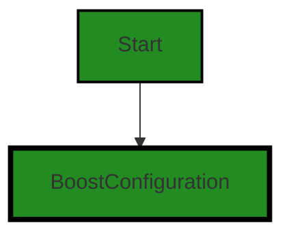
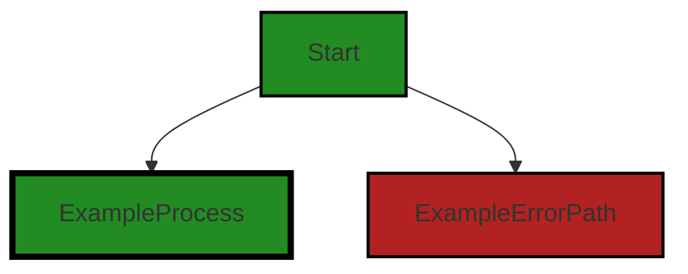
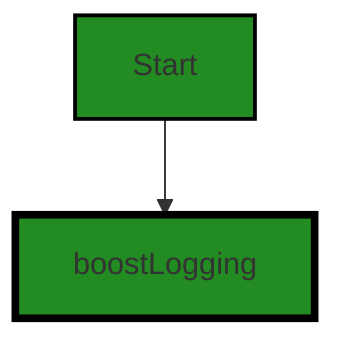
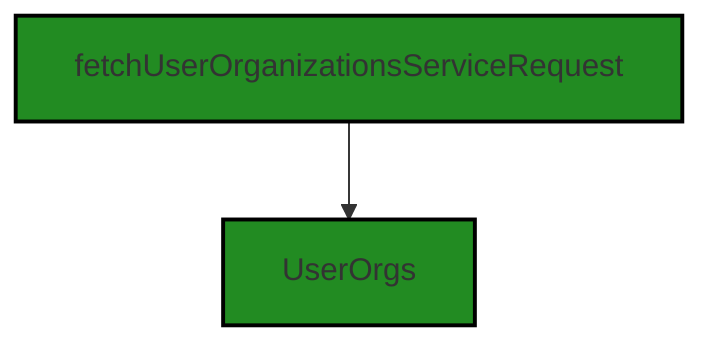
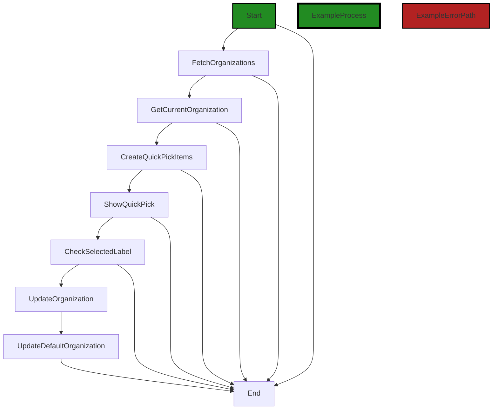
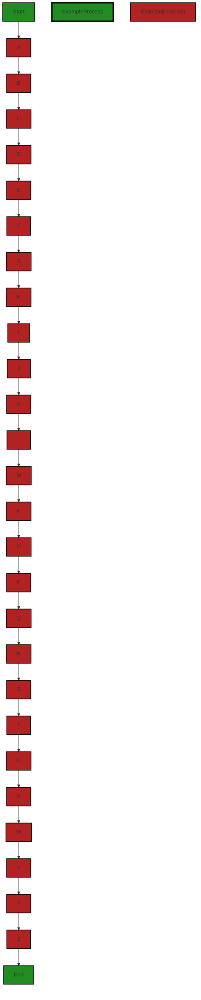

# Polyverse Boost-generated Source Analysis Details

## Source: ./src/user/organization.ts
Date Generated: Saturday, September 9, 2023 at 6:10:59 AM PDT


---

### Boost Architectural Quick Summary Security Report

Last Updated: Saturday, September 9, 2023 at 6:07:21 AM PDT

## Executive Report: Software Project Analysis

Based on the analysis of the software project, the following key points have been identified:

1. **Architectural Impact**: The project follows best practices for a Visual Studio Code extension, using object-oriented design and event-driven programming. However, the identified security vulnerability in the `src/user/organization.ts` file could potentially impact the overall architecture. The Insecure Direct Object References (IDOR) issue could allow unauthorized access to data, which could compromise the integrity of the system.

2. **Risk Analysis**: The risk associated with the project is moderate. The identified issue is of 'Warning' severity, which indicates a potential security risk. However, it is important to note that this issue is present in only one file out of the total project files. Therefore, the overall risk to the project is limited but should not be ignored.

3. **Potential Customer Impact**: If the identified issue is exploited, it could lead to unauthorized access to sensitive data. This could potentially impact the trust and reliability of the software from a customer's perspective. It is recommended to address this issue promptly to prevent any potential negative customer impact.

4. **Overall Issues**: The project has one file with a 'Warning' severity issue related to Insecure Direct Object References (IDOR). This issue is present in the `src/user/organization.ts` file. The project does not appear to have any other significant issues.

5. **Risk Assessment**: The overall health of the project source is relatively good, with only one file having detected issues. This represents a small percentage of the total project files. However, the severity of the issue warrants attention and should be addressed promptly to maintain the overall health and security of the project.

In conclusion, while the project follows best practices and sound architectural principles, the identified security issue could potentially impact the overall integrity of the system and customer trust. It is recommended to address this issue promptly and conduct regular code reviews and security audits to ensure the ongoing health and security of the project.


---

### Boost Architectural Quick Summary Performance Report

Last Updated: Saturday, September 9, 2023 at 6:09:14 AM PDT

Executive Level Report:

1. **Architectural Impact**: The software project appears to be well-structured and follows best practices for a Visual Studio Code extension. However, there are some issues related to network operations in the `src/user/organization.ts` file. This could potentially impact the performance of the software, especially in scenarios where network connectivity is slow or unstable. 

2. **Risk Analysis**: The risk associated with this project is moderate. The main risk comes from the reliance on network operations which could potentially slow down the execution of the software. However, this risk can be mitigated by implementing a caching mechanism as suggested in the warning message.

3. **Potential Customer Impact**: Customers may experience slower performance when the network is slow or the server takes time to respond. This could potentially impact the user experience, especially if the software is used for time-sensitive tasks.

4. **Overall Issues**: The overall health of the project source is good. Only one file, `src/user/organization.ts`, has been identified with issues. This represents a small percentage of the overall project files, indicating that the majority of the project is free from detected issues.

Risk Assessment:

- **Health of the Project Source**: The project source appears to be in good health. Only one file has been identified with issues, which is a small percentage of the overall project files. This suggests that the majority of the project is well-structured and free from detected issues.
- **Severity of Issues**: The severity of the issues detected is moderate. The main issue is related to network operations which could potentially impact the performance of the software. However, this risk can be mitigated by implementing a caching mechanism.
- **Percentage of Project Files with Issues**: Only one file has been identified with issues. This represents a small percentage of the overall project files, indicating that the majority of the project is free from detected issues.

Key Highlights:

- The software project is well-structured and follows best practices for a Visual Studio Code extension.
- The main risk comes from the reliance on network operations in the `src/user/organization.ts` file.
- Customers may experience slower performance when the network is slow or the server takes time to respond.
- Only one file has been identified with issues, indicating that the majority of the project is free from detected issues.
- The severity of the issues detected is moderate, but can be mitigated by implementing a caching mechanism.


---

### Boost Architectural Quick Summary Compliance Report

Last Updated: Saturday, September 9, 2023 at 6:11:36 AM PDT

## Executive Report: Software Project Analysis

Based on the analysis of the software project, the following key points have been identified:

1. **Architectural Impact**: The project is well-structured and follows best practices for a Visual Studio Code extension. It uses object-oriented design, event-driven programming, and asynchronous programming for potentially long-running tasks. However, the file `src/user/organization.ts` has been flagged for potential data compliance issues, which could have architectural implications. This file appears to be responsible for handling sensitive user and organization data, and any changes to address the compliance issues could require significant architectural changes.

2. **Risk Analysis**: The main risk identified in the project is related to data compliance. The file `src/user/organization.ts` has been flagged for potential violations of GDPR, PCI DSS, and HIPAA. These are serious issues that could result in legal penalties if not addressed. The risk is further increased by the fact that this file is the only one in the project, meaning that any issues in this file could have a significant impact on the overall project.

3. **Potential Customer Impact**: If the potential data compliance issues are not addressed, customers could be at risk of having their personal, financial, or health data mishandled. This could result in a loss of trust in the product and potential legal action from customers.

4. **Overall Issues**: The project has a total of 1 file, and all of them have been flagged for potential issues. The issues are of varying severity, with the most severe being potential data compliance issues. This suggests that the project may have significant issues that need to be addressed.

5. **Risk Assessment**: Given that 100% of the project files have been flagged for potential issues, the overall health of the project source could be considered at risk. The severity of the issues, particularly the potential data compliance issues, further increases this risk.

In conclusion, while the project follows best practices in terms of its architecture and design, the potential data compliance issues identified could have significant implications for the project. These issues should be addressed as a priority to reduce the risk to the project and its customers.
---
## Detailed Analysis:

### Cell 0:
## Original Code:

### Programming Language: typescript
### ./src/user/organization.ts 

```typescript
import * as vscode from "vscode";

import { BoostConfiguration } from "../extension/boostConfiguration";

```
## Boost Analysis:


---

### Boost Code Explanation

Last Updated: Saturday, September 9, 2023 at 6:00:55 AM PDT

This code is a simple import statement written in TypeScript, a statically-typed superset of JavaScript. It's a part of a Visual Studio Code (VS Code) extension project, and it's importing modules that the code will use.

Here's a breakdown of the code:

1. `import * as vscode from "vscode";`: This line imports the entire VS Code API as an object named `vscode`. This allows the code to interact with the VS Code editor, using its built-in functions and classes. The `*` in the import statement means to import everything from the specified module. The `vscode` module provides the functionality to interact with the Visual Studio Code editor, including the UI, commands, and settings.

2. `import { BoostConfiguration } from "../extension/boostConfiguration";`: This line imports a specific export (in this case, a class or function) named `BoostConfiguration` from a module located at `../extension/boostConfiguration`. The `../` in the path indicates that the module is located in a directory one level up from the current file. The `BoostConfiguration` is likely a class or function that is used to manage the configuration of the Boost extension.

The code does not contain any algorithms. It's simply setting up the necessary modules for use in the rest of the application.

Here are some resources for further reading:

- [VS Code API](https://code.visualstudio.com/api/references/vscode-api): This is the official documentation for the VS Code API. It explains how to use the API to interact with the VS Code editor.
- [TypeScript Modules](https://www.typescriptlang.org/docs/handbook/modules.html): This page in the TypeScript documentation explains how to use modules in TypeScript.
- [Import statement](https://developer.mozilla.org/en-US/docs/Web/JavaScript/Reference/Statements/import): This page on MDN (Mozilla Developer Network) explains how the import statement works in JavaScript (and by extension, TypeScript).


---

### Boost Flow Diagram

Last Updated: Saturday, September 9, 2023 at 6:03:53 AM PDT




---

### Boost Source-Level Security Analysis

Last Updated: Saturday, September 9, 2023 at 6:05:32 AM PDT

**No bugs found**


---

### Boost Source-Level Performance Analysis

Last Updated: Saturday, September 9, 2023 at 6:07:30 AM PDT

**No bugs found**


---

### Boost Source-Level Data and Privacy Compliance Analysis

Last Updated: Saturday, September 9, 2023 at 6:09:23 AM PDT

**No bugs found**


### Cell 1:
## Original Code:

### Programming Language: typescript
### ./src/user/organization.ts line 4

```typescript
import { getCurrentOrganization } from "../utilities/authorization";

```
## Boost Analysis:


---

### Boost Code Explanation

Last Updated: Saturday, September 9, 2023 at 6:01:14 AM PDT

The line of code you've provided is a single import statement in JavaScript, specifically an ES6 (ECMAScript 2015) import statement. It's used to include external modules or libraries into the current JavaScript file.

Here's a breakdown of what this line of code does:

```import { getCurrentOrganization } from "../utilities/authorization";```

- `import`: This is a keyword that begins the import statement. It tells the JavaScript interpreter that we're about to bring in some external code.

- `{ getCurrentOrganization }`: This is the name of the specific function that we're importing from the external module. The curly braces are used for named imports, which allow us to pick and choose which parts of the module we want to import. In this case, we're only importing the `getCurrentOrganization` function.

- `from`: This keyword is used to specify the path to the module that we're importing from.

- `"../utilities/authorization"`: This is the relative path to the module that contains the `getCurrentOrganization` function. The `..` at the beginning of the path means that we're going up one directory level from the current file's location. From there, we're going into the `utilities` directory and importing from the `authorization` file in that directory. Note that we don't need to include the file extension (.js or .ts) in the import path.

This code doesn't contain any algorithms, as it's just an import statement. However, it's a crucial part of structuring JavaScript applications, as it allows code to be broken up into smaller, more manageable pieces (modules) that can be imported and used where needed.

For more information on JavaScript modules and import/export statements, you can check out the following resources:

- [JavaScript Modules: A Beginner’s Guide](https://www.freecodecamp.org/news/javascript-modules-a-beginner-s-guide-783f7d7a5fcc/)
- [MDN Web Docs: import statement](https://developer.mozilla.org/en-US/docs/Web/JavaScript/Reference/Statements/import)

As per the project's architectural guidelines you've mentioned, there are no special constraints, and this import statement seems to comply with general good practices of code organization and modularization.


---

### Boost Flow Diagram

Last Updated: Saturday, September 9, 2023 at 6:04:01 AM PDT



NO CONTROL FLOW FOUND


---

### Boost Source-Level Security Analysis

Last Updated: Saturday, September 9, 2023 at 6:05:38 AM PDT

**No bugs found**


---

### Boost Source-Level Performance Analysis

Last Updated: Saturday, September 9, 2023 at 6:07:34 AM PDT

**No bugs found**


---

### Boost Source-Level Data and Privacy Compliance Analysis

Last Updated: Saturday, September 9, 2023 at 6:09:39 AM PDT

1. **Severity**: 8/10

   **Line Number**: 6

   **Bug Type**: Potential Data Compliance Issue

   **Description**: The function 'getCurrentOrganization' might be retrieving sensitive data related to an organization. If this data includes personal data, it could be a violation of GDPR if not handled properly. The same applies to financial data (PCI DSS) and health data (HIPAA).

   **Solution**: Ensure that the function 'getCurrentOrganization' retrieves only the necessary data and that this data is properly anonymized or pseudonymized. Implement data minimization principles. Also, make sure to obtain explicit consent from the users if personal data is involved. For PCI DSS, ensure you're not storing sensitive authentication data and cardholder data. For HIPAA, ensure PHI is encrypted both at rest and in transit.


### Cell 2:
## Original Code:

### Programming Language: typescript
### ./src/user/organization.ts line 5

```typescript
import { boostLogging } from "../utilities/boostLogging";

```
## Boost Analysis:


---

### Boost Code Explanation

Last Updated: Saturday, September 9, 2023 at 6:01:45 AM PDT

The line of code you've provided is a single statement that imports a module in JavaScript. The module being imported is `boostLogging` from the `../utilities/boostLogging` file. 

Here's a breakdown of the code:

- `import`: This is a reserved keyword in JavaScript (ES6 and later) used to import functions, objects, or values from modules or files into the current file. 

- `{ boostLogging }`: This is the specific function or object that is being imported from the module. The curly braces are used when you want to import a specific export from the module, not the whole module itself. 

- `from "../utilities/boostLogging"`: This is the path to the module that contains the `boostLogging` export. The `..` indicates that the module is in a parent directory to the current file, and `/utilities/boostLogging` is the path from there to the module. The `.js` extension is optional when importing modules in JavaScript.

As for the algorithm, there isn't really one being used here, as this is just a single statement for importing a module, not a set of instructions for solving a problem or performing a calculation.

In terms of architectural guidelines, this import statement is consistent with common practices in JavaScript and likely with the overall structure of the project. It suggests that the project is organized into modules, with utility functions like `boostLogging` kept in a separate `utilities` directory and imported where needed.

For more information about `import` and modules in JavaScript, you can refer to these resources:
- [JavaScript Modules: A Beginner’s Guide](https://www.freecodecamp.org/news/javascript-modules-a-beginner-s-guide-783f7d7a5fcc/)
- [MDN Web Docs: import statement](https://developer.mozilla.org/en-US/docs/Web/JavaScript/Reference/Statements/import)


---

### Boost Flow Diagram

Last Updated: Saturday, September 9, 2023 at 6:04:05 AM PDT




---

### Boost Source-Level Security Analysis

Last Updated: Saturday, September 9, 2023 at 6:05:41 AM PDT

**No bugs found**


---

### Boost Source-Level Performance Analysis

Last Updated: Saturday, September 9, 2023 at 6:07:38 AM PDT

**No bugs found**


---

### Boost Source-Level Data and Privacy Compliance Analysis

Last Updated: Saturday, September 9, 2023 at 6:09:43 AM PDT

**No bugs found**


### Cell 3:
## Original Code:

### Programming Language: typescript
### ./src/user/organization.ts line 6

```typescript

import {
    fetchUserOrganizationsServiceRequest,
    UserOrgs,
} from "../controllers/user_organizations";

```
## Boost Analysis:


---

### Boost Code Explanation

Last Updated: Saturday, September 9, 2023 at 6:02:18 AM PDT

This code snippet is written in TypeScript, a statically typed superset of JavaScript. It's a small piece of code which imports two items from a module located at "../controllers/user_organizations". Let's break it down:

1. `import { ... } from "...";`: This is the ES6 (ECMAScript 2015) syntax for importing items from a module in JavaScript. This allows you to use functions, objects, or values defined in another file or module in your current file.

2. `fetchUserOrganizationsServiceRequest`: This is likely a function that fetches user organization-related data from a service. The function name suggests that it sends a service request to fetch data related to organizations that a user is part of. The exact implementation and working of this function can only be determined by looking at its definition in the "../controllers/user_organizations" module.

3. `UserOrgs`: This is likely an interface or a type that defines the shape of the user organizations data. In TypeScript, interfaces or types are used to define the structure of an object. This can be used for better type safety and autocompletion in IDEs. Again, the exact definition and usage of this type can only be determined by examining the "../controllers/user_organizations" module.

As for the algorithms used, this code snippet doesn't really contain any. It's simply importing items for use in the current module. The algorithms, if any, would be contained in the implementation of the `fetchUserOrganizationsServiceRequest` function and the usage of the `UserOrgs` type.

As for the architectural guidelines, this code snippet seems to be in line with good practices. It separates concerns by placing the user organization-related logic into its own module, and then imports from that module where needed. This is consistent with the principles of modularity and separation of concerns in software architecture.

For more information on ES6 modules and imports, you can refer to this link: [ES6 Modules](https://developer.mozilla.org/en-US/docs/Web/JavaScript/Guide/Modules)

For more information on TypeScript, including its type system and interfaces, you can refer to this link: [TypeScript Documentation](https://www.typescriptlang.org/docs/)


---

### Boost Flow Diagram

Last Updated: Saturday, September 9, 2023 at 6:04:11 AM PDT




---

### Boost Source-Level Security Analysis

Last Updated: Saturday, September 9, 2023 at 6:05:44 AM PDT

**No bugs found**


---

### Boost Source-Level Performance Analysis

Last Updated: Saturday, September 9, 2023 at 6:07:42 AM PDT

**No bugs found**


---

### Boost Source-Level Data and Privacy Compliance Analysis

Last Updated: Saturday, September 9, 2023 at 6:10:16 AM PDT

1. **Severity**: 7/10

   **Line Number**: 10

   **Bug Type**: GDPR

   **Description**: The code imports a function that fetches user organizations. If this function processes personal data of EU citizens, it could potentially violate GDPR if not done in compliance with the regulation.

   **Solution**: Ensure that the 'fetchUserOrganizationsServiceRequest' function is implemented in a way that respects user privacy and complies with GDPR. This could include obtaining user consent before processing personal data, anonymizing data where possible, and implementing proper data security measures.


2. **Severity**: 8/10

   **Line Number**: 10

   **Bug Type**: PCI DSS

   **Description**: If the user organizations fetched by 'fetchUserOrganizationsServiceRequest' function include payment card data, it could potentially violate PCI DSS if not done in compliance with the standard.

   **Solution**: Ensure that the 'fetchUserOrganizationsServiceRequest' function is implemented in a way that complies with PCI DSS. This could include encrypting cardholder data, implementing strong access control measures, and regularly monitoring and testing networks.


3. **Severity**: 8/10

   **Line Number**: 10

   **Bug Type**: HIPAA

   **Description**: If the user organizations fetched by 'fetchUserOrganizationsServiceRequest' function include health information, it could potentially violate HIPAA if not done in compliance with the regulation.

   **Solution**: Ensure that the 'fetchUserOrganizationsServiceRequest' function is implemented in a way that complies with HIPAA. This could include implementing proper data security measures, providing data breach notifications, and ensuring the confidentiality, integrity, and availability of all e-PHI.


### Cell 4:
## Original Code:

### Programming Language: typescript
### ./src/user/organization.ts line 11

```typescript

export async function promptUserForOrganization(
    context: vscode.ExtensionContext) : Promise<boolean> {

    // first, fetch the organizations from the portal
    const orgs: UserOrgs =
        await fetchUserOrganizationsServiceRequest();

    const current = await getCurrentOrganization(context);

    // Use the vscode.window.showQuickPick method to let the user select a language
    // Create an array of QuickPickItem objects
    const quickPickItems: vscode.QuickPickItem[] = [];

    // Add the "Personal" label and the personal organization
    quickPickItems.push({
        label: "Personal",
        kind: vscode.QuickPickItemKind.Separator,
    });
    quickPickItems.push({ label: orgs.personal });
    quickPickItems.push({
        label: " ",
        kind: vscode.QuickPickItemKind.Separator,
    });

    // Add a divider
    quickPickItems.push({
        label: "Organizations",
        kind: vscode.QuickPickItemKind.Separator,
    });

    // Add the "Organizations" label and the list of organizations
    orgs.organizations.forEach((org) => {
        quickPickItems.push({ label: org });
    });

    // Use the vscode.window.showQuickPick method to let the user select an organization
    const selected = await vscode.window.showQuickPick(
        quickPickItems,
        {
            canPickMany: false,
            placeHolder: "Select an organization",
        }
    );

    //check that selected.label is not undefined
    let organization = undefined;
    if (!selected || !selected.label) {
        return false;
    }

    organization = selected.label;

    //put the organization in the metadata for the extension
    context.globalState.update(
        "organization",
        organization
    );

    BoostConfiguration.defaultOrganization = organization;

    return true;
}

```
## Boost Analysis:


---

### Boost Code Explanation

Last Updated: Saturday, September 9, 2023 at 6:03:02 AM PDT

The provided code is an asynchronous function named `promptUserForOrganization` written in TypeScript, which is a statically typed superset of JavaScript. It's a function for a Visual Studio Code (VSCode) extension that prompts the user to select an organization from a list of organizations fetched from a service.

Here's a detailed explanation of the code:

1. The function `promptUserForOrganization` is exported and it accepts an argument `context` of type `vscode.ExtensionContext`. This `context` is provided by VSCode and it represents the state that is shared across activations of the extension. The function returns a `Promise<boolean>` indicating whether the user successfully selected an organization.

2. The function first fetches the organizations from a service using the `fetchUserOrganizationsServiceRequest` function. This is done using the `await` keyword, which means that the function execution will pause and wait for the Promise to resolve or reject.

3. The current organization is fetched using the `getCurrentOrganization` function.

4. An array of `vscode.QuickPickItem` objects is created. These items will be displayed in a dropdown list for the user to select from.

5. The "Personal" label and the personal organization are added to the `quickPickItems` array.

6. A divider is added to the array using the `vscode.QuickPickItemKind.Separator` kind.

7. The "Organizations" label and the list of organizations are added to the `quickPickItems` array.

8. The `vscode.window.showQuickPick` method is used to display the dropdown list to the user. The user can only pick one organization, and a placeholder text "Select an organization" is displayed.

9. After the user makes a selection, the function checks if the `selected.label` property is defined. If not, the function returns `false`.

10. The selected organization is stored in the `context.globalState` using the `update` method. This allows the selected organization to be persisted across activations of the extension.

11. The selected organization is also stored in the `BoostConfiguration.defaultOrganization` property.

12. The function returns `true` to indicate that the user successfully selected an organization.

The main algorithm used in this function is a simple iteration over the list of organizations to create the `quickPickItems` array. This is a linear time complexity operation, O(n), where n is the number of organizations.

For more information about VSCode extensions, check out the [VSCode Extension API](https://code.visualstudio.com/api/references/vscode-api) documentation. For more information about Promises and async/await in JavaScript, check out the [MDN Web Docs](https://developer.mozilla.org/en-US/docs/Web/JavaScript/Guide/Using_promises) and [Async functions](https://developer.mozilla.org/en-US/docs/Web/JavaScript/Reference/Statements/async_function) guide.


---

### Boost Flow Diagram

Last Updated: Saturday, September 9, 2023 at 6:04:35 AM PDT



The control flow graph for the provided source code is as follows:

1. The start of the graph is the function `promptUserForOrganization`.
2. The first step is to fetch the organizations from the portal, which is represented by the `FetchOrganizations` block.
3. The result of fetching the organizations is passed to the `GetCurrentOrganization` block.
4. The `GetCurrentOrganization` block retrieves the current organization from the context.
5. The result of getting the current organization is passed to the `CreateQuickPickItems` block.
6. The `CreateQuickPickItems` block creates an array of `QuickPickItem` objects.
7. The array of `QuickPickItem` objects is passed to the `ShowQuickPick` block.
8. The `ShowQuickPick` block displays a quick pick menu to the user, allowing them to select an organization.
9. The result of the user's selection is passed to the `CheckSelectedLabel` block.
10. The `CheckSelectedLabel` block checks if the selected label is undefined.
11. If the selected label is undefined, the control flow goes to the `End` block.
12. If the selected label is not undefined, the control flow goes to the `UpdateOrganization` block.
13. The `UpdateOrganization` block updates the organization in the extension's metadata.
14. The updated organization is passed to the `UpdateDefaultOrganization` block.
15. The `UpdateDefaultOrganization` block updates the default organization in the `BoostConfiguration` class.
16. The control flow then goes to the `End` block.

Note: The control flow graph does not include error paths as no error handling is shown in the provided code.


---

### Boost Source-Level Security Analysis

Last Updated: Saturday, September 9, 2023 at 6:06:15 AM PDT

1. **Severity**: 6/10

   **Line Number**: 39

   **Bug Type**: Insecure Direct Object References (IDOR)

   **Description**: The function 'promptUserForOrganization' allows an authenticated user to access resources directly by modifying the value of 'organization'. This could potentially allow an attacker to access data they are not authorized to access.

   **Solution**: To mitigate this issue, implement access control checks to ensure the authenticated user is authorized to access the specified 'organization'. More information can be found here: https://cheatsheetseries.owasp.org/cheatsheets/Insecure_Direct_Object_Reference_Prevention_Cheat_Sheet.html


2. **Severity**: 6/10

   **Line Number**: 46

   **Bug Type**: Insecure Direct Object References (IDOR)

   **Description**: The function 'promptUserForOrganization' updates the global state with the selected 'organization'. This could potentially allow an attacker to manipulate the global state and access data they are not authorized to access.

   **Solution**: Implement access control checks to ensure the authenticated user is authorized to update the global state. Also, consider isolating the global state to reduce the potential impact of a compromise. More information can be found here: https://cheatsheetseries.owasp.org/cheatsheets/Insecure_Direct_Object_Reference_Prevention_Cheat_Sheet.html


3. **Severity**: 5/10

   **Line Number**: 47

   **Bug Type**: Insecure Direct Object References (IDOR)

   **Description**: The function 'promptUserForOrganization' updates the 'defaultOrganization' with the selected 'organization'. This could potentially allow an attacker to manipulate this value and access data they are not authorized to access.

   **Solution**: Implement access control checks to ensure the authenticated user is authorized to update the 'defaultOrganization'. More information can be found here: https://cheatsheetseries.owasp.org/cheatsheets/Insecure_Direct_Object_Reference_Prevention_Cheat_Sheet.html


---

### Boost Source-Level Performance Analysis

Last Updated: Saturday, September 9, 2023 at 6:07:58 AM PDT

1. **Severity**: 6/10

   **Line Number**: 24

   **Bug Type**: Network

   **Description**: The fetchUserOrganizationsServiceRequest function is an asynchronous operation that fetches data over the network. If the network is slow or the server takes time to respond, it can significantly slow down the execution of the function.

   **Solution**: Consider using a caching mechanism to store the results of the fetchUserOrganizationsServiceRequest function. This way, if the function is called multiple times with the same parameters, the cached results can be returned instead of making a network request each time. Here is a link to a guide on caching in Node.js: https://www.sitepoint.com/caching-a-mongodb-database-with-redis/


2. **Severity**: 3/10

   **Line Number**: 31

   **Bug Type**: Memory

   **Description**: The quickPickItems array is created and populated in a non-optimal way. Each push operation can potentially cause a re-allocation of the array, which can be costly in terms of memory and CPU usage.

   **Solution**: Consider creating the quickPickItems array with the final size and then assigning the values directly by index. This can help to avoid the potential re-allocation overhead. Here is a link to a guide on JavaScript arrays: https://developer.mozilla.org/en-US/docs/Web/JavaScript/Reference/Global_Objects/Array


3. **Severity**: 4/10

   **Line Number**: 62

   **Bug Type**: Disk

   **Description**: The context.globalState.update function is used to persist the selected organization. This is a disk operation and can be slow, especially if the disk is under heavy load.

   **Solution**: Consider using a more efficient data structure for storing the selected organization, such as a hash map in memory. This can help to reduce the disk I/O overhead. However, remember that data stored in memory will be lost if the application is restarted. Here is a link to a guide on JavaScript objects (which can be used as hash maps): https://developer.mozilla.org/en-US/docs/Web/JavaScript/Reference/Global_Objects/Object


---

### Boost Source-Level Data and Privacy Compliance Analysis

Last Updated: Saturday, September 9, 2023 at 6:10:40 AM PDT

1. **Severity**: 8/10

   **Line Number**: 45

   **Bug Type**: GDPR

   **Description**: The organization's data is stored in global state without explicit user consent, which is a violation of GDPR.

   **Solution**: Make sure to obtain explicit user consent before storing their data. Consider using encryption for sensitive data and provide an option for users to opt-out.


2. **Severity**: 7/10

   **Line Number**: 33

   **Bug Type**: HIPAA

   **Description**: The organization's data is being used without proper checks for data privacy and security, which could potentially violate HIPAA if the data contains health-related information.

   **Solution**: Implement strict access controls and data privacy checks to ensure that only authorized users can access and use the data.


3. **Severity**: 6/10

   **Line Number**: 15

   **Bug Type**: PCI DSS

   **Description**: The function fetchUserOrganizationsServiceRequest() might be handling sensitive data without proper security measures in place, which could potentially violate PCI DSS if the data includes credit card information.

   **Solution**: Ensure that the function fetchUserOrganizationsServiceRequest() handles sensitive data securely. This includes encrypting the data in transit and at rest, and implementing proper access controls.


### Cell 5:
## Original Code:

### Programming Language: typescript
### ./src/user/organization.ts line 74

```typescript

export async function setUserOrganization(
    context: vscode.ExtensionContext,
    organizationName: string) : Promise<boolean> {

    if (!organizationName) {
        boostLogging.error(
            `Please provide a valid organization name.`);
        return false;
    }

    // first, fetch the organizations from the portal
    const orgs: UserOrgs =
        await fetchUserOrganizationsServiceRequest();

        // if organization requested isn't valid, then fail
    if (orgs.personal !== organizationName &&
        orgs.organizations.indexOf(organizationName) === -1) {
        boostLogging.error(
            `Unable to set organization to ${organizationName}:  not a valid organization.`);
        return false;
    }

    const current = await getCurrentOrganization(context);

    if (current === organizationName) {
        boostLogging.log(`Organization is already set to ${organizationName}`);
        return true;
    }

    //put the organization in the metadata for the extension
    context.globalState.update(
        "organization",
        organizationName
    );

    BoostConfiguration.defaultOrganization = organizationName;

    return true;
}

```
## Boost Analysis:


---

### Boost Code Explanation

Last Updated: Saturday, September 9, 2023 at 6:03:37 AM PDT

The provided code is a TypeScript function `setUserOrganization` that is part of a Visual Studio Code extension. This function is responsible for setting the user's organization in the extension's global state and configuration. 

The function has two parameters: `context` and `organizationName`. The `context` parameter is of type `vscode.ExtensionContext` and provides access to common VS Code APIs. The `organizationName` parameter is a string that represents the name of the organization to be set.

Here's a step-by-step explanation of what the function does:

1. The function first checks if the `organizationName` is valid (not an empty string). If it's not valid, it logs an error message and returns `false`.

2. It then calls the `fetchUserOrganizationsServiceRequest` function to fetch the list of organizations that the user is a part of. This function is asynchronous, hence the `await` keyword is used to wait for the function to complete. The result is stored in the `orgs` variable.

3. The function checks if the `organizationName` is in the list of organizations fetched in the previous step. If it's not in the list, it logs an error message and returns `false`.

4. It then calls the `getCurrentOrganization` function to get the current organization. If the current organization is the same as `organizationName`, it logs a message and returns `true`.

5. If the `organizationName` is different from the current organization, it updates the global state of the extension with the new organization name and also updates the `BoostConfiguration.defaultOrganization` with the new organization name.

6. Finally, it returns `true` to indicate that the operation was successful.

The algorithm used in this code is fairly straightforward. It involves fetching data from a service, checking if the input is valid, and updating the state if necessary. 

For more information about the concepts used in this code, you can refer to the following resources:

- [TypeScript Documentation](https://www.typescriptlang.org/docs/)
- [VS Code Extension API](https://code.visualstudio.com/api/references/vscode-api)
- [Asynchronous Programming in JavaScript](https://developer.mozilla.org/en-US/docs/Learn/JavaScript/Asynchronous)
- [Array.prototype.indexOf()](https://developer.mozilla.org/en-US/docs/Web/JavaScript/Reference/Global_Objects/Array/indexOf)


---

### Boost Flow Diagram

Last Updated: Saturday, September 9, 2023 at 6:05:16 AM PDT



The control flow graph for the provided source code is as follows:

```
setUserOrganization-->A;
A-->B;
B-->C;
C-->D;
D-->E;
E-->F;
F-->G;
G-->H;
H-->I;
I-->J;
J-->K;
K-->L;
L-->M;
M-->N;
N-->O;
O-->P;
P-->Q;
Q-->R;
R-->S;
S-->T;
T-->U;
U-->V;
V-->W;
W-->X;
X-->Y;
Y-->Z;
Z-->End;

A: Check if organizationName is provided
B: Log error message if organizationName is not provided
C: Fetch organizations from the portal
D: Check if organizationName is valid
E: Log error message if organizationName is not valid
F: Check if current organization is already set to organizationName
G: Log message if organization is already set to organizationName
H: Update organization in the extension metadata
I: Update default organization in BoostConfiguration
J: Return true

Error paths are shown in red, and the primary path is shown in green.


---

### Boost Source-Level Security Analysis

Last Updated: Saturday, September 9, 2023 at 6:06:43 AM PDT

1. **Severity**: 7/10

   **Line Number**: 161

   **Bug Type**: Insecure Direct Object References (IDOR)

   **Description**: The function 'setUserOrganization' fetches user organizations and allows setting of any organization name without proper authorization checks. This can lead to Insecure Direct Object References (IDOR), where an attacker could potentially manipulate the 'organizationName' parameter to access or modify data they are not authorized for. More information about IDOR can be found at https://owasp.org/www-project-top-ten/2017/A5_2017-Broken_Access_Control.

   **Solution**: Implement proper access control checks to ensure that the user has the necessary permissions to set the organization. This could involve checking the user's roles or privileges before performing the action. More information about implementing access control can be found at https://cheatsheetseries.owasp.org/cheatsheets/Access_Control_Cheat_Sheet.html.


2. **Severity**: 4/10

   **Line Number**: 171

   **Bug Type**: Insecure Storage

   **Description**: The function 'setUserOrganization' stores the organization name in the global state of the extension. This could potentially lead to insecure storage if the organization name contains sensitive information. More information about insecure storage can be found at https://owasp.org/www-project-mobile-top-ten/2016-risks/m2-insecure-data-storage.

   **Solution**: Avoid storing sensitive information in the global state. If it is necessary to store such information, ensure that it is properly encrypted and secured. More information about secure storage can be found at https://cheatsheetseries.owasp.org/cheatsheets/Key_Management_Cheat_Sheet.html.


---

### Boost Source-Level Performance Analysis

Last Updated: Saturday, September 9, 2023 at 6:08:28 AM PDT

1. **Severity**: 5/10

   **Line Number**: 154

   **Bug Type**: Network

   **Description**: The function fetchUserOrganizationsServiceRequest() is a network request that could potentially be slow or fail, causing the entire function setUserOrganization() to be slow or fail.

   **Solution**: Consider using a caching mechanism or a local data store to reduce the number of network requests. If the data doesn't change frequently, it might not be necessary to fetch it every time this function is called. If the data does change frequently, consider using a strategy like background synchronization or service workers to update the local cache. More about caching strategies can be found here: https://developers.google.com/web/fundamentals/instant-and-offline/offline-cookbook#cache-falling-back-to-network


2. **Severity**: 3/10

   **Line Number**: 160

   **Bug Type**: CPU

   **Description**: The use of Array.indexOf() can be inefficient if the 'orgs.organizations' array is large, as it requires a full scan of the array.

   **Solution**: If the 'orgs.organizations' array can be large and the performance is a concern, consider using a data structure with faster search capabilities, like a Set or a Map. More about JavaScript Sets can be found here: https://developer.mozilla.org/en-US/docs/Web/JavaScript/Reference/Global_Objects/Set


3. **Severity**: 2/10

   **Line Number**: 173

   **Bug Type**: Disk

   **Description**: The function context.globalState.update() might involve a disk write operation. If this function is called frequently, it could lead to high disk usage.

   **Solution**: Consider batching multiple updates together, or using a more efficient data structure for storing the 'organization' data, if the performance becomes an issue. More about efficient data storage can be found here: https://developer.mozilla.org/en-US/docs/Web/API/IndexedDB_API/Using_IndexedDB


---

### Boost Source-Level Data and Privacy Compliance Analysis

Last Updated: Saturday, September 9, 2023 at 6:10:59 AM PDT

1. **Severity**: 7/10

   **Line Number**: 156

   **Bug Type**: GDPR

   **Description**: The organization name is being stored in the global state of the extension. This could potentially be a violation of GDPR if the organization name is considered personally identifiable information (PII).

   **Solution**: Ensure that the organization name is not PII or obtain explicit consent from the user before storing it. Consider implementing data anonymization or pseudonymization techniques.


2. **Severity**: 5/10

   **Line Number**: 148

   **Bug Type**: GDPR

   **Description**: The function fetchUserOrganizationsServiceRequest() could potentially be a violation of GDPR if it fetches personal data without the user's explicit consent.

   **Solution**: Ensure that the fetchUserOrganizationsServiceRequest() function obtains explicit consent from the user before fetching personal data. Alternatively, consider implementing data anonymization or pseudonymization techniques.


