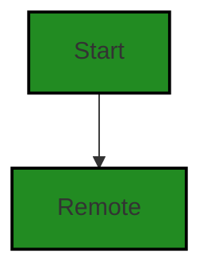
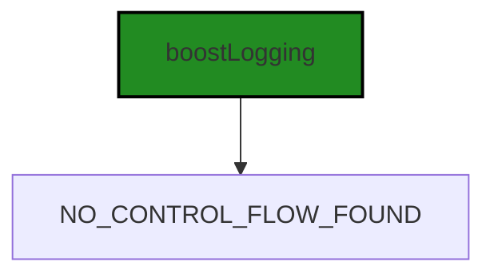
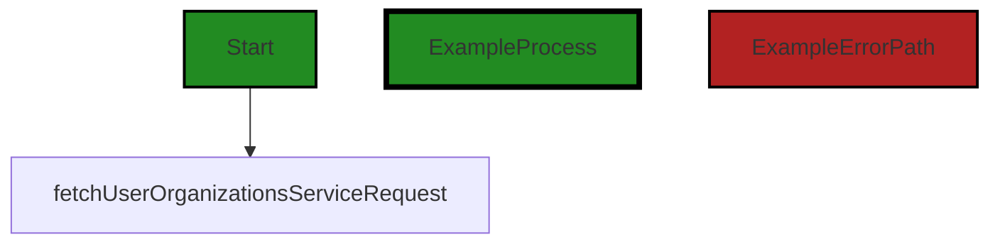
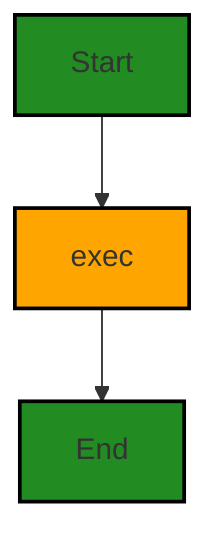
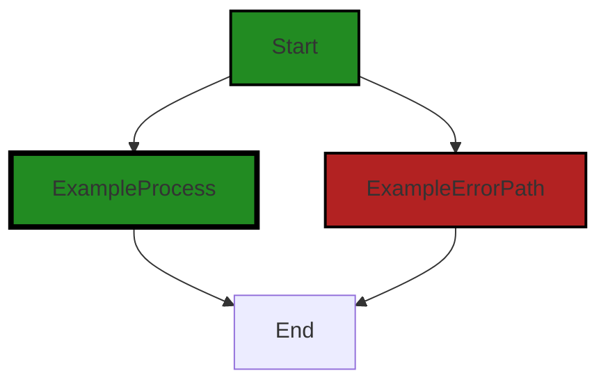
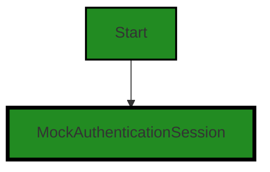
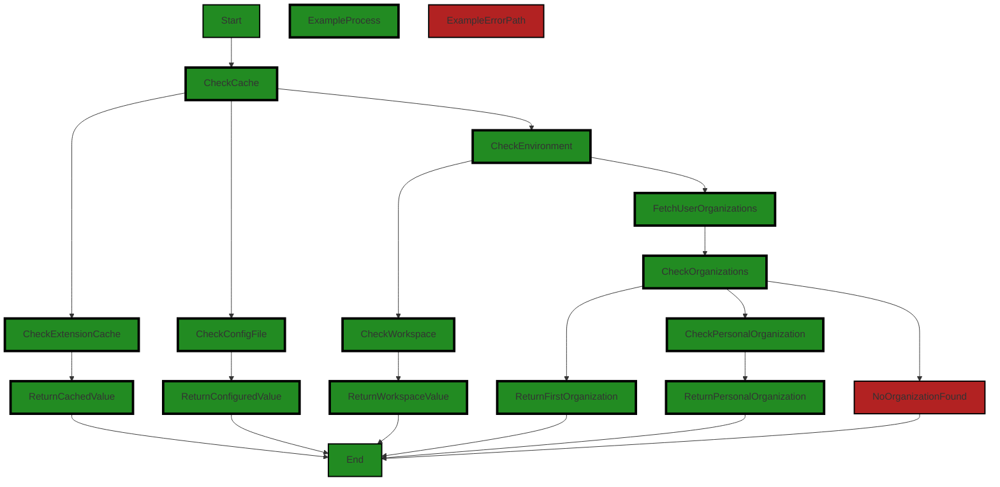
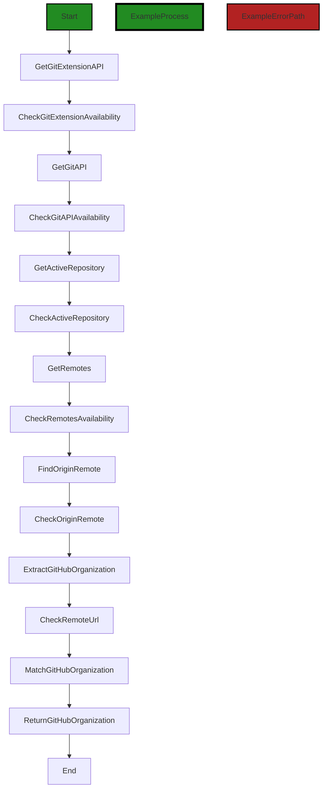

# Polyverse Boost-generated Source Analysis Details

## Source: ./src/utilities/authorization.ts
Date Generated: Saturday, September 9, 2023 at 2:34:26 AM PDT


---

### Boost Architectural Quick Summary Security Report

Last Updated: Saturday, September 9, 2023 at 2:27:06 AM PDT

## Executive Report

### Architectural Impact and Risk Analysis

The software project under review is a Visual Studio Code extension that provides code analysis functionality. The project is primarily written in JavaScript and TypeScript and follows the principles of object-oriented design and event-driven programming. 

Based on the analysis of the project's source code, several issues of varying severity have been identified. The most severe issues are found in the `src/utilities/authorization.ts` file, which includes potential command injection vulnerabilities and information disclosure risks. 

#### Key Highlights:

1. **Command Injection Vulnerability**: The use of the 'exec' function from the 'child_process' module in Node.js in the `src/utilities/authorization.ts` file can lead to command injection vulnerabilities if not used properly. This can potentially allow an attacker to execute arbitrary commands on the system, leading to serious security issues such as data leakage, data manipulation, or even system takeover.

2. **Information Disclosure Risk**: The command 'gh auth status --show-token' used in the `src/utilities/authorization.ts` file can expose the GitHub token in logs or console output. This is a security risk as tokens are sensitive information that can be used to gain unauthorized access to resources.

3. **Potential Customer Impact**: The identified issues can potentially impact the customers by compromising their data and system security. The command injection vulnerability can allow unauthorized access to the customer's system, while the information disclosure risk can expose sensitive information.

4. **Overall Health of the Project**: The project consists of one file, `src/utilities/authorization.ts`, which has been found to have issues. This means 100% of the project files have been flagged with issues of varying severity. This indicates a need for immediate attention to address these issues to improve the overall health of the project.

5. **Risk Assessment**: Given the severity of the issues identified and the potential impact on the customers, the risk associated with this project is high. Immediate action is required to address these issues and mitigate the associated risks.

In conclusion, while the project follows best practices for a VS Code extension and makes good use of TypeScript features and the VS Code API, the identified security issues pose a significant risk. It is recommended to address these issues promptly to ensure the security and integrity of the project and its users.


---

### Boost Architectural Quick Summary Performance Report

Last Updated: Saturday, September 9, 2023 at 2:30:18 AM PDT

Executive Level Report:

1. **Architectural Impact**: The project's architecture appears to be sound, with no major architectural problems identified. The project follows best practices for a Visual Studio Code extension, making use of TypeScript features and the VS Code API. The code is well-structured and organized into classes. However, there is a performance issue identified in the 'src/utilities/authorization.ts' file related to CPU usage. This could potentially impact the overall performance of the software, especially if the child process takes a significant amount of time to complete.

2. **Risk Analysis**: The risk associated with this project is moderate. The identified issue is of 'Warning' severity, which indicates a potential problem that could lead to performance degradation. However, this issue is present in only one file out of the total project files, which suggests that the overall risk to the project is relatively low.

3. **Potential Customer Impact**: If left unaddressed, the performance issue could lead to a slower response time for the software, which could negatively impact the user experience. However, since the issue is confined to a single file, its impact on the overall software functionality might be limited.

4. **Overall Issues**: The project has one file with issues of 'Warning' severity related to CPU usage. The other metrics such as 'Information', 'Memory', and 'Network' have lower severity levels. This suggests that while there are areas for improvement, the overall health of the project is good.

5. **Risk Assessment**: Based on the analysis, the overall health of the project source is good. Only one file has been detected with issues, which is a small percentage of the total project files. This suggests that the majority of the project files are well-structured and free of major issues.

Highlights:

- The project follows best practices for a Visual Studio Code extension and makes use of TypeScript features and the VS Code API.
- A performance issue related to CPU usage has been identified in the 'src/utilities/authorization.ts' file. This issue is of 'Warning' severity and could potentially impact the overall performance of the software.
- The risk associated with this project is moderate, with the identified issue present in only one file out of the total project files.
- The potential customer impact of the identified issue could be a slower response time for the software, which could negatively impact the user experience.
- The overall health of the project source is good, with the majority of the project files free of major issues.


---

### Boost Architectural Quick Summary Compliance Report

Last Updated: Saturday, September 9, 2023 at 2:34:59 AM PDT

## Executive Report

### Architectural Impact and Risk Analysis

The software project under review is a Visual Studio Code extension that provides code analysis functionality. The project is primarily written in JavaScript and TypeScript, following principles of object-oriented design and event-driven programming. 

Based on the analysis of the project's source code, the following key points are highlighted:

1. **Severity of Issues**: The most severe issues found in the project are related to data compliance, specifically GDPR, PCI DSS, and HIPAA. These issues are concentrated in the `src/utilities/authorization.ts` file. The most severe issue is an error related to GDPR compliance, where a GitHub token is being extracted and returned without any encryption. This could potentially expose sensitive user data.

2. **Potential Customer Impact**: The issues identified could have significant impact on customers, particularly those in regions or industries where data compliance regulations are strictly enforced. Non-compliance with GDPR, PCI DSS, or HIPAA could lead to legal penalties, loss of customer trust, and potential data breaches.

3. **Risk Assessment**: The overall health of the project source is concerning due to the severity of the issues identified. While only one file was analyzed, it contained multiple high-severity issues. This suggests that there may be systemic issues with data handling and compliance in the project.

4. **Architectural Consistency**: The project appears to follow the architectural guidelines provided, with no additional special architectural constraints. However, the issues identified suggest that the implementation may not be fully aligned with best practices for secure data handling.

In conclusion, while the project follows the architectural guidelines and principles, there are significant risks related to data compliance. These risks could have serious implications for customers and the overall health of the project. It is recommended that the project team address these issues as a priority, and consider a more thorough review of the project's data handling practices.
---
## Detailed Analysis:

### Cell 0:
## Original Code:

### Programming Language: typescript
### ./src/utilities/authorization.ts 

```typescript
import * as vscode from "vscode";
import { Remote } from "./git";

```
## Boost Analysis:


---

### Boost Code Explanation

Last Updated: Saturday, September 9, 2023 at 2:16:25 AM PDT

This code snippet is written in TypeScript, a statically typed superset of JavaScript that adds types to the language. It's part of a larger project which appears to be a Visual Studio Code (VS Code) extension, based on the import of the `vscode` module.

The code contains two import statements, which are part of the ES6 (ECMAScript 2015) module system. This system allows for the importation of specific portions of code from other files or modules to be used in the current file.

Let's break down the two lines of code:

1. `import * as vscode from "vscode";`

This line is importing the entire `vscode` module. The `* as vscode` syntax is importing all exported members from the `vscode` module and creating a new variable `vscode` that serves as a namespace for all those members. 

The `vscode` module is the API for interacting with VS Code itself. This means the code in this file will likely be interacting with the VS Code editor in some way, such as creating or manipulating editor windows, reading or modifying the user's settings, or responding to events in the editor.

2. `import { Remote } from "./git";`

This line is importing only the `Remote` member from the module at the relative path `./git`. The curly braces `{}` are used for named imports in ES6. 

The `./git` module is likely a local file in the same directory as this file, named `git.ts` (or `git.js`). The `Remote` member could be a class, function, or variable that's been exported from this `git` module. Without more context, it's hard to say exactly what `Remote` is, but given the name of the module, it might be a class or function related to interacting with a Git remote repository.

In terms of architectural guidelines, this code is consistent with common practices for structuring a VS Code extension. The use of the `vscode` module is standard, and separating out functionality related to Git into its own module helps keep the codebase organized and maintainable.

For more information on the topics discussed, you can refer to these resources:

- [VS Code API](https://code.visualstudio.com/api)
- [TypeScript Documentation](https://www.typescriptlang.org/docs/)
- [ES6 Modules](https://developer.mozilla.org/en-US/docs/Web/JavaScript/Guide/Modules)
- [Git Remote](https://git-scm.com/book/en/v2/Git-Basics-Working-with-Remotes)


---

### Boost Flow Diagram

Last Updated: Saturday, September 9, 2023 at 2:22:14 AM PDT




---

### Boost Source-Level Security Analysis

Last Updated: Saturday, September 9, 2023 at 2:24:16 AM PDT

**No bugs found**


---

### Boost Source-Level Performance Analysis

Last Updated: Saturday, September 9, 2023 at 2:27:22 AM PDT

**No bugs found**


---

### Boost Source-Level Data and Privacy Compliance Analysis

Last Updated: Saturday, September 9, 2023 at 2:30:43 AM PDT

1. **Severity**: 5/10

   **Line Number**: 1

   **Bug Type**: GDPR

   **Description**: The import of vscode could potentially lead to violations of GDPR if any personal data is processed or stored without explicit consent of the user.

   **Solution**: Ensure that any personal data processed or stored by vscode is done so with the explicit consent of the user. You may also want to consider anonymizing or pseudonymizing personal data to further protect user privacy.


2. **Severity**: 7/10

   **Line Number**: 2

   **Bug Type**: PCI DSS

   **Description**: The import of the Remote module from git could potentially lead to violations of PCI DSS if any cardholder data is processed, stored, or transmitted insecurely.

   **Solution**: Ensure that any cardholder data processed, stored, or transmitted by the Remote module from git is done so securely, in accordance with PCI DSS requirements. This could include encrypting data in transit and at rest, and implementing strong access controls.


### Cell 1:
## Original Code:

### Programming Language: typescript
### ./src/utilities/authorization.ts line 3

```typescript
import { BoostConfiguration } from "../extension/boostConfiguration";

```
## Boost Analysis:


---

### Boost Code Explanation

Last Updated: Saturday, September 9, 2023 at 2:16:44 AM PDT

This line of code is an import statement in JavaScript (or TypeScript, which is a typed superset of JavaScript). It's used to include external modules or libraries into the current file. In this case, it's importing the `BoostConfiguration` module from the relative path `"../extension/boostConfiguration"`.

The `BoostConfiguration` is likely to be a class or function that's been exported from the `boostConfiguration` module. The exact nature and purpose of `BoostConfiguration` would depend on its implementation in the `boostConfiguration` module, but given its name, it's reasonable to assume that it's related to the configuration of the Boost extension.

This code doesn't involve any complex algorithms. It's a standard part of JavaScript and TypeScript programming, and it's consistent with the architectural guidelines provided.

For more information about modules and import statements in JavaScript, you can refer to the [Mozilla Developer Network documentation](https://developer.mozilla.org/en-US/docs/Web/JavaScript/Guide/Modules). For TypeScript-specific information, you can refer to the [TypeScript handbook](https://www.typescriptlang.org/docs/handbook/modules.html).


---

### Boost Flow Diagram

Last Updated: Saturday, September 9, 2023 at 2:22:17 AM PDT

NO CONTROL FLOW FOUND


---

### Boost Source-Level Security Analysis

Last Updated: Saturday, September 9, 2023 at 2:24:20 AM PDT

**No bugs found**


---

### Boost Source-Level Performance Analysis

Last Updated: Saturday, September 9, 2023 at 2:27:25 AM PDT

**No bugs found**


---

### Boost Source-Level Data and Privacy Compliance Analysis

Last Updated: Saturday, September 9, 2023 at 2:30:56 AM PDT

1. **Severity**: 3/10

   **Line Number**: 4

   **Bug Type**: GDPR

   **Description**: The import of 'BoostConfiguration' might potentially involve personal data processing, which needs to be in compliance with GDPR rules. However, without knowing what 'BoostConfiguration' does, it's hard to say with certainty.

   **Solution**: Ensure that any personal data processing is done in compliance with GDPR rules. This includes obtaining valid consent, providing clear information about data processing, and implementing appropriate security measures. Review the 'BoostConfiguration' to ensure it complies with these rules.


### Cell 2:
## Original Code:

### Programming Language: typescript
### ./src/utilities/authorization.ts line 4

```typescript
import { boostLogging } from "../utilities/boostLogging";

```
## Boost Analysis:


---

### Boost Code Explanation

Last Updated: Saturday, September 9, 2023 at 2:17:10 AM PDT

The line of code you've given is a single import statement in JavaScript (or TypeScript). This code is importing a module named `boostLogging` from a relative path `../utilities/boostLogging`.

Here's a breakdown of what this line of code does:

- `import`: This is a keyword in JavaScript (and TypeScript) that is used to import functions, objects, or values from another module or file. This is part of the ES6 (ECMAScript 2015) module system.

- `{ boostLogging }`: This is the name of the specific export from the module that we want to import. The curly braces `{}` are used for named exports. This means that the `boostLogging` module exports a named export called `boostLogging`.

- `from "../utilities/boostLogging"`: This specifies the path to the module that we are importing from. The `..` means to go up one directory level, and `/utilities/boostLogging` is the path from there to the module. The `.js` or `.ts` extension is typically omitted in import statements.

As for the `boostLogging` module itself, without the specific code for it, I can only infer from the name that it likely contains functionality related to logging for the 'boost' application. Logging is a common practice in software development, used to record the flow and state of a program which can be extremely useful for debugging and monitoring purposes.

Based on the architectural blueprint summary, this fits well with the project as it's mentioned that the project includes extensive error handling and logging. The `boostLogging` module is likely a part of this logging infrastructure.

For more information on JavaScript modules and the import statement, you can refer to the [MDN Web Docs](https://developer.mozilla.org/en-US/docs/Web/JavaScript/Guide/Modules).


---

### Boost Flow Diagram

Last Updated: Saturday, September 9, 2023 at 2:22:22 AM PDT




---

### Boost Source-Level Security Analysis

Last Updated: Saturday, September 9, 2023 at 2:24:23 AM PDT

**No bugs found**


---

### Boost Source-Level Performance Analysis

Last Updated: Saturday, September 9, 2023 at 2:27:29 AM PDT

**No bugs found**


---

### Boost Source-Level Data and Privacy Compliance Analysis

Last Updated: Saturday, September 9, 2023 at 2:31:00 AM PDT

**No bugs found**


### Cell 3:
## Original Code:

### Programming Language: typescript
### ./src/utilities/authorization.ts line 5

```typescript
import { fetchUserOrganizationsServiceRequest } from "../controllers/user_organizations";

```
## Boost Analysis:


---

### Boost Code Explanation

Last Updated: Saturday, September 9, 2023 at 2:17:39 AM PDT

The line of code you've provided is a single import statement in JavaScript, specifically using ES6 syntax. It doesn't contain any algorithm or complex logic, but it's an important part of how modules and dependencies are managed in JavaScript applications.

Let's break it down:

- `import`: This is a keyword in ES6 (ECMAScript 6, also known as ES2015) that is used to import functions, objects or values from other modules or files. This is part of the module system in JavaScript, which allows code to be organized into smaller, reusable chunks.

- `{ fetchUserOrganizationsServiceRequest }`: This is the specific item being imported from the module. The curly braces are used for named exports. That means `fetchUserOrganizationsServiceRequest` is a named export from the module we are importing from. It could be a function, an object, a class, etc.

- `from "../controllers/user_organizations"`: This specifies the path to the module from which we are importing. The `..` means we're going up one level in the directory structure. So this code is importing from a file named `user_organizations.js` (or `user_organizations.ts` if it's a TypeScript project) in the `controllers` directory.

Based on the name, `fetchUserOrganizationsServiceRequest` is likely a function that handles some kind of HTTP request to fetch data related to user organizations, and it's part of the application's controller layer. However, without seeing the actual content of the `user_organizations` module, we can't say for sure what it does.

Here's a resource for more information about ES6 modules: [Mozilla Developer Network (MDN) - import statement](https://developer.mozilla.org/en-US/docs/Web/JavaScript/Reference/Statements/import)


---

### Boost Flow Diagram

Last Updated: Saturday, September 9, 2023 at 2:22:27 AM PDT




---

### Boost Source-Level Security Analysis

Last Updated: Saturday, September 9, 2023 at 2:24:27 AM PDT

**No bugs found**


---

### Boost Source-Level Performance Analysis

Last Updated: Saturday, September 9, 2023 at 2:27:33 AM PDT

**No bugs found**


---

### Boost Source-Level Data and Privacy Compliance Analysis

Last Updated: Saturday, September 9, 2023 at 2:31:25 AM PDT

1. **Severity**: 7/10

   **Line Number**: 8

   **Bug Type**: GDPR

   **Description**: The code fetches user organizations which might include personal data. If the data is not anonymized or if explicit user consent is not obtained, this could violate GDPR.

   **Solution**: Ensure that personal data is anonymized or pseudonymized where possible. Also, obtain explicit user consent before processing personal data. Implement a system to record this consent.


2. **Severity**: 6/10

   **Line Number**: 8

   **Bug Type**: PCI DSS

   **Description**: If the user organizations include payment card data and it is not handled securely, it could violate PCI DSS.

   **Solution**: Ensure that payment card data is encrypted and securely stored. Implement access controls and monitoring systems to prevent unauthorized access.


3. **Severity**: 8/10

   **Line Number**: 8

   **Bug Type**: HIPAA

   **Description**: If the user organizations include health information and it is not handled securely, it could violate HIPAA.

   **Solution**: Ensure that health information is encrypted and securely stored. Implement access controls and monitoring systems to prevent unauthorized access.


### Cell 4:
## Original Code:

### Programming Language: typescript
### ./src/utilities/authorization.ts line 6

```typescript
import { getExtensionMode } from "../extension/extension_state";

```
## Boost Analysis:


---

### Boost Code Explanation

Last Updated: Saturday, September 9, 2023 at 2:18:07 AM PDT

This code snippet is quite small and straightforward. It's written in TypeScript, a statically typed superset of JavaScript that adds types and other features to the language. Here's a breakdown of what this line of code is doing:

```import { getExtensionMode } from "../extension/extension_state";```

This line is using the ES6 (ECMAScript 6) module system to import a specific function, `getExtensionMode`, from another module. The module is located in the file `extension_state.ts` in the `extension` directory one level up from the current file. 

The `getExtensionMode` function is not defined in this code snippet, but based on its name, it likely returns the current mode of a Visual Studio Code extension. This could be something like 'development', 'test', or 'production', but without more context, it's hard to say exactly what this function does.

ES6 modules are a way of organizing code into separate files and namespaces. They allow you to export and import functions, objects, or values from one module to another. This makes it easier to organize and manage code, especially in large codebases.

As for the architectural guidelines, this code snippet is too small to make a definitive statement, but it appears to be consistent with good practices. It's using ES6 modules, which are a standard feature in modern JavaScript and TypeScript development. The code is also clear and easy to understand, which is always a good thing.

For more information on ES6 modules, you can refer to this [MDN Web Docs](https://developer.mozilla.org/en-US/docs/Web/JavaScript/Guide/Modules) link.


---

### Boost Flow Diagram

Last Updated: Saturday, September 9, 2023 at 2:22:31 AM PDT


---

### Boost Source-Level Security Analysis

Last Updated: Saturday, September 9, 2023 at 2:24:30 AM PDT

**No bugs found**


---

### Boost Source-Level Performance Analysis

Last Updated: Saturday, September 9, 2023 at 2:27:37 AM PDT

**No bugs found**


---

### Boost Source-Level Data and Privacy Compliance Analysis

Last Updated: Saturday, September 9, 2023 at 2:31:38 AM PDT

1. **Severity**: 1/10

   **Line Number**: 10

   **Bug Type**: GDPR

   **Description**: The code imports a function that retrieves the extension mode. If this mode includes personal data, it could potentially be a GDPR issue. However, without further context, it's hard to determine the exact impact.

   **Solution**: Ensure that any data retrieved by getExtensionMode does not include personal data, or if it does, that it's handled in a GDPR-compliant way. This could involve anonymizing the data, obtaining user consent, or implementing appropriate security measures.


### Cell 5:
## Original Code:

### Programming Language: typescript
### ./src/utilities/authorization.ts line 7

```typescript

import { exec } from "child_process";

```
## Boost Analysis:


---

### Boost Code Explanation

Last Updated: Saturday, September 9, 2023 at 2:18:34 AM PDT

This line of code is written in JavaScript, a high-level, interpreted scripting language that conforms to the ECMAScript specification. It's used to make webpages interactive and provide online programs, including video games.

The `import` keyword is part of ES6 (ECMAScript 2015) module syntax, and it allows you to import functions, objects, or values from other modules into the current module. This is a part of making JavaScript more modular, which is a key aspect of good programming and software design.

`{ exec }` is the specific function being imported. This is known as named import syntax because you are importing a specific part of the module, not the entire module itself. The `exec` function is part of the `child_process` module in Node.js.

The `child_process` module enables the execution of shell commands within Node.js scripts, and it provides the ability to spawn child processes. These child processes are independent of the parent process and can run concurrently, which can be useful for performing tasks in parallel or for isolating CPU-intensive tasks from the main event loop.

The `exec` function is one of the methods provided by the `child_process` module. It spawns a shell and runs a command within that shell, buffering any generated output. This is useful for executing shell commands from within a Node.js script, but it should be used with care due to potential security risks. If you're executing shell commands that include user input, you should sanitize the input to prevent shell injection attacks.

Here is a link to the official Node.js documentation for the `child_process` module, which includes more detailed information about the `exec` function: [Node.js child_process module](https://nodejs.org/api/child_process.html)

In terms of architectural guidelines, this line of code appears to be consistent with the guidelines provided. It's making use of the capabilities provided by Node.js and the `child_process` module, and it's using ES6 module syntax for importing the required function. However, as always, care should be taken to use the `exec` function securely.


---

### Boost Flow Diagram

Last Updated: Saturday, September 9, 2023 at 2:22:40 AM PDT



The control flow graph for the provided source code is a simple linear flow. The code starts at the "Start" node and then proceeds to the "exec" node, which represents the call to the external library function `exec`. Finally, the flow reaches the "End" node, indicating the end of the code execution.

Note that the "exec" node is highlighted with a different style to indicate that it represents a call to an external library or non-standard function.


---

### Boost Source-Level Security Analysis

Last Updated: Saturday, September 9, 2023 at 2:24:51 AM PDT

1. **Severity**: 7/10

   **Line Number**: 12

   **Bug Type**: Command Injection

   **Description**: The 'exec' function from the 'child_process' module in Node.js can lead to command injection vulnerabilities if not used properly. If user input is directly passed to this function without proper validation and sanitization, it can allow an attacker to execute arbitrary commands on the system. This can lead to serious security issues, such as data leakage, data manipulation, or even system takeover.

   **Solution**: Use safer alternatives like 'execFile' or 'spawn', which do not allow shell parameter expansion. If 'exec' must be used, ensure that user input is properly validated and sanitized before it is passed to 'exec'. Consider using libraries for input validation and sanitization, such as 'validator.js' or 'joi'.

Resources:
- [OWASP Command Injection](https://owasp.org/www-community/attacks/Command_Injection)
- [Node.js child_process documentation](https://nodejs.org/api/child_process.html)


---

### Boost Source-Level Performance Analysis

Last Updated: Saturday, September 9, 2023 at 2:27:52 AM PDT

1. **Severity**: 7/10

   **Line Number**: 12

   **Bug Type**: CPU

   **Description**: The 'exec' function from the 'child_process' module can lead to performance issues as it is a blocking operation that waits for the child process to end before it continues. This can lead to poor CPU usage especially if the child process takes a significant amount of time to complete.

   **Solution**: Consider using the 'spawn' or 'execFile' functions instead. These functions are asynchronous and do not block the Node.js event loop. 'spawn' is best used when the child process returns large amounts of data. 'execFile' is best used when the input to the child process is small. Here is a link for more information: https://nodejs.org/api/child_process.html


---

### Boost Source-Level Data and Privacy Compliance Analysis

Last Updated: Saturday, September 9, 2023 at 2:31:53 AM PDT

1. **Severity**: 7/10

   **Line Number**: 12

   **Bug Type**: GDPR/PCI DSS/HIPAA

   **Description**: The 'child_process' module's 'exec' function can potentially execute any command that the server's operating system can handle. If it's not properly sanitized, it could lead to a command injection vulnerability, compromising the data's integrity and confidentiality.

   **Solution**: Avoid using 'exec' when possible. If you must use it, ensure that user input is properly sanitized. Alternatively, use 'execFile' or 'spawn', which are safer as they do not spawn shell by default.


### Cell 6:
## Original Code:

### Programming Language: typescript
### ./src/utilities/authorization.ts line 9

```typescript

function getGithubToken(): Promise<string> {
    return new Promise((resolve, reject) => {
        exec('command -v gh', (error, stdout, stderr) => {
            if (error) {
                boostLogging.error('GitHub CLI (gh) is NOT installed');
            } else {
                boostLogging.info('GitHub CLI (gh) is installed');
            }
        });
        
        // Execute the command to get the token status.
        exec("gh auth status --show-token", (error, stdout, stderr) => {
            if (error) {
                boostLogging.error(`GitHub CLI (gh) failed authorization: ${error}`);
                reject(new Error("GitHub CLI (gh) failed authorization: ${error}"));
                return;
            }

            // Parse the output to extract the token.
            const tokenMatch = stdout.match(/✓ Token: (\S+)/);
            if (tokenMatch && tokenMatch[1]) {
                const token = tokenMatch[1];
                resolve(token);
            } else {
                boostLogging.error("Failed to parse GitHub token.");
                reject(new Error("Failed to parse GitHub token."));
            }
        });
    });
}

```
## Boost Analysis:


---

### Boost Code Explanation

Last Updated: Saturday, September 9, 2023 at 2:19:08 AM PDT

This code defines a function `getGithubToken()` that returns a Promise. A Promise in JavaScript is an object representing the eventual completion or failure of an asynchronous operation, and it's used for asynchronous computations. This function is designed to interact with the GitHub Command Line Interface (CLI) to retrieve the user's GitHub token.

The function works as follows:

1. It first checks if the GitHub CLI tool (`gh`) is installed on the system by executing the command `command -v gh`. This is done using the `exec` function from Node.js, which is used to execute shell commands from within a Node.js application. If the `gh` command is not found, it logs an error message using `boostLogging.error()`. If the `gh` command is found, it logs an informational message using `boostLogging.info()`.

2. Next, it attempts to retrieve the GitHub token by executing the command `gh auth status --show-token`. This command checks the authorization status of the GitHub CLI and shows the token if it's authorized.

3. If there is an error executing the command (for example, if the GitHub CLI is not authorized), it logs an error message and rejects the Promise with a new Error object.

4. If the command executes successfully, it attempts to parse the output to extract the token. It does this using the `match()` method with a regular expression (`/✓ Token: (\S+)/`). The regular expression matches the line that starts with "✓ Token: " followed by one or more non-whitespace characters. If a match is found, it resolves the Promise with the token. If no match is found, it logs an error message and rejects the Promise with a new Error object.

This function uses the concept of Promises for asynchronous operations and regular expressions for parsing strings. 

Here are some resources for further reading:

- [Promises in JavaScript](https://developer.mozilla.org/en-US/docs/Web/JavaScript/Reference/Global_Objects/Promise)
- [Node.js exec function](https://nodejs.org/api/child_process.html#child_process_child_process_exec_command_options_callback)
- [Regular expressions in JavaScript](https://developer.mozilla.org/en-US/docs/Web/JavaScript/Guide/Regular_Expressions)
- [GitHub CLI](https://cli.github.com/)


---

### Boost Flow Diagram

Last Updated: Saturday, September 9, 2023 at 2:23:04 AM PDT



The control flow graph for the provided code is as follows:

```
getGithubToken  
exec  
exec  
getGithubToken  
exec  
exec  
exec  
const tokenMatch = stdout.match  
const tokenMatch = stdout.match  
const tokenMatch = stdout.match  
```

The primary path through the code is as follows:

```
getGithubToken  
exec  
getGithubToken  
exec  
const tokenMatch = stdout.match  
```

The error path through the code is as follows:

```
getGithubToken  
exec  
getGithubToken  
exec  
exec  
exec  
exec  
```


---

### Boost Source-Level Security Analysis

Last Updated: Saturday, September 9, 2023 at 2:25:05 AM PDT

1. **Severity**: 7/10

   **Line Number**: 23

   **Bug Type**: Information Disclosure

   **Description**: The command 'gh auth status --show-token' can expose the GitHub token in logs or console output. This is a security risk as tokens are sensitive information that can be used to gain unauthorized access to resources.

   **Solution**: Remove the '--show-token' flag from the command. If the token is required, consider securely storing it in an environment variable or using a secure method to retrieve it. Refer to GitHub's documentation on authenticating with the GitHub CLI: https://docs.github.com/en/authentication/keeping-your-account-and-data-secure/creating-a-personal-access-token


---

### Boost Source-Level Performance Analysis

Last Updated: Saturday, September 9, 2023 at 2:28:12 AM PDT

1. **Severity**: 6/10

   **Line Number**: 18

   **Bug Type**: CPU

   **Description**: The exec function is a blocking operation which can lead to poor CPU usage and slow performance. This can be particularly problematic for long-running tasks.

   **Solution**: Replace exec with non-blocking alternatives such as execFile, spawn, or using async/await with util.promisify. More info here: https://nodejs.org/api/child_process.html#child_process_child_process_exec_command_options_callback


2. **Severity**: 6/10

   **Line Number**: 24

   **Bug Type**: CPU

   **Description**: The exec function is a blocking operation which can lead to poor CPU usage and slow performance. This can be particularly problematic for long-running tasks.

   **Solution**: Replace exec with non-blocking alternatives such as execFile, spawn, or using async/await with util.promisify. More info here: https://nodejs.org/api/child_process.html#child_process_child_process_exec_command_options_callback


---

### Boost Source-Level Data and Privacy Compliance Analysis

Last Updated: Saturday, September 9, 2023 at 2:32:14 AM PDT

1. **Severity**: 9/10

   **Line Number**: 26

   **Bug Type**: GDPR

   **Description**: The GitHub token is being extracted and returned without any encryption. This token can provide access to sensitive user data.

   **Solution**: Encrypt the token before returning it. This can be done using libraries like crypto-js. Also, ensure that the token is securely stored and not logged anywhere.


2. **Severity**: 8/10

   **Line Number**: 26

   **Bug Type**: PCI DSS

   **Description**: If the GitHub account is associated with any payment or card information, the token can provide access to this information. The token is being handled in plaintext.

   **Solution**: Encrypt the token before returning it. Ensure that the token is securely stored and not logged anywhere.


3. **Severity**: 7/10

   **Line Number**: 26

   **Bug Type**: HIPAA

   **Description**: If the GitHub account is associated with any health information, the token can provide access to this information. The token is being handled in plaintext.

   **Solution**: Encrypt the token before returning it. Ensure that the token is securely stored and not logged anywhere.


### Cell 7:
## Original Code:

### Programming Language: typescript
### ./src/utilities/authorization.ts line 40

```typescript

// create a mock class for the vscode.AuthenticationSession interface for testing
export class MockAuthenticationSession implements vscode.AuthenticationSession {
    accessToken: string;
    account: any;
    id: string;
    scopes: string[];
    constructor(accessToken: string) {
        this.accessToken = accessToken;
        this.account = "";
        this.id = "";
        this.scopes = [];
    }
}

```
## Boost Analysis:


---

### Boost Code Explanation

Last Updated: Saturday, September 9, 2023 at 2:19:39 AM PDT

This code is written in TypeScript, which is a statically typed superset of JavaScript. It creates a mock class `MockAuthenticationSession` for testing purposes. The class implements the `vscode.AuthenticationSession` interface, which is a part of the Visual Studio Code API.

The `vscode.AuthenticationSession` interface provides a way to interact with the authentication sessions in Visual Studio Code. This interface includes properties such as `accessToken`, `account`, `id`, and `scopes`.

Here is a breakdown of the code:

1. `export class MockAuthenticationSession implements vscode.AuthenticationSession`: This line is declaring a new class `MockAuthenticationSession` that implements the `vscode.AuthenticationSession` interface. The `export` keyword allows this class to be imported and used in other modules.

2. `accessToken: string; account: any; id: string; scopes: string[];`: These lines are defining properties of the class. Each property corresponds to a property in the `vscode.AuthenticationSession` interface. The types of the properties are also specified here.

3. `constructor(accessToken: string)`: This is the constructor of the class, which is a special method that is automatically called when a new object is created from the class. The constructor takes one argument, `accessToken`, which is a string.

4. `this.accessToken = accessToken; this.account = ""; this.id = ""; this.scopes = [];`: Inside the constructor, the properties of the class are initialized. The `accessToken` property is set to the value passed to the constructor. The `account`, `id`, and `scopes` properties are initialized with empty values.

The purpose of this mock class is to provide a controlled environment for testing. Instead of interacting with the actual `vscode.AuthenticationSession`, tests can use this mock class, which behaves in a predictable way. This makes it easier to test the parts of the code that depend on the `vscode.AuthenticationSession`.

For more information on TypeScript classes, you can refer to the [TypeScript Handbook](https://www.typescriptlang.org/docs/handbook/classes.html). For more information on the `vscode.AuthenticationSession` interface, you can refer to the [VS Code API](https://code.visualstudio.com/api/references/vscode-api#AuthenticationSession).


---

### Boost Flow Diagram

Last Updated: Saturday, September 9, 2023 at 2:23:10 AM PDT




---

### Boost Source-Level Security Analysis

Last Updated: Saturday, September 9, 2023 at 2:25:40 AM PDT

1. **Severity**: 7/10

   **Line Number**: 81

   **Bug Type**: Insecure Direct Object References (IDOR)

   **Description**: The 'account' and 'id' properties are set to an empty string by default, which could potentially lead to insecure direct object references. If these properties are used to control access to user-specific resources, an attacker may be able to manipulate these references to gain unauthorized access to data.

   **Solution**: Ensure that user-specific properties like 'account' and 'id' are properly initialized and protected. Avoid using direct references to user-specific resources whenever possible. Use indirect references instead. OWASP provides a good guide on preventing IDOR: https://cheatsheetseries.owasp.org/cheatsheets/Insecure_Direct_Object_Reference_Prevention_Cheat_Sheet.html


2. **Severity**: 5/10

   **Line Number**: 82

   **Bug Type**: Improper Initialization

   **Description**: The 'scopes' property is initialized as an empty array. If this property is used to control access to certain scopes or permissions, an attacker could potentially manipulate this array to gain additional permissions.

   **Solution**: Ensure that the 'scopes' property is properly initialized and that its manipulation is properly controlled. Consider using a default value that is least privileged. OWASP provides a good guide on access control: https://cheatsheetseries.owasp.org/cheatsheets/Access_Control_Cheat_Sheet.html


3. **Severity**: 8/10

   **Line Number**: 80

   **Bug Type**: Sensitive Data Exposure

   **Description**: The 'accessToken' property is stored in plain text. If an attacker gains access to this token, they could potentially use it to impersonate the user and perform unauthorized actions.

   **Solution**: Store sensitive information like access tokens in a secure manner. Consider encrypting the token before storing it, and decrypt it only when needed. OWASP provides a good guide on secure data storage: https://cheatsheetseries.owasp.org/cheatsheets/Password_Storage_Cheat_Sheet.html


---

### Boost Source-Level Performance Analysis

Last Updated: Saturday, September 9, 2023 at 2:28:16 AM PDT

**No bugs found**


---

### Boost Source-Level Data and Privacy Compliance Analysis

Last Updated: Saturday, September 9, 2023 at 2:32:51 AM PDT

1. **Severity**: 8/10

   **Line Number**: 81

   **Bug Type**: GDPR

   **Description**: The accessToken is stored in plain text, which is a violation of GDPR's data protection principles. Personal data must be processed in a manner that ensures appropriate security, including protection against unauthorized or unlawful processing and against accidental loss, destruction or damage, using appropriate technical or organizational measures.

   **Solution**: Encrypt the accessToken before storing it. Consider using a secure method like bcrypt or scrypt for encryption. Also, consider implementing access controls and audit logs to track who accesses this data and when.


2. **Severity**: 8/10

   **Line Number**: 82

   **Bug Type**: GDPR

   **Description**: The account information is stored in plain text, which is a violation of GDPR's data protection principles. Personal data must be processed in a manner that ensures appropriate security, including protection against unauthorized or unlawful processing and against accidental loss, destruction or damage, using appropriate technical or organizational measures.

   **Solution**: Encrypt the account information before storing it. Consider using a secure method like bcrypt or scrypt for encryption. Also, consider implementing access controls and audit logs to track who accesses this data and when.


3. **Severity**: 7/10

   **Line Number**: 83

   **Bug Type**: PCI DSS

   **Description**: The id is stored in plain text, which could potentially be a violation of PCI DSS if it is related to cardholder data. PCI DSS requires that cardholder data be stored securely, with strong encryption and access controls.

   **Solution**: If the id is related to cardholder data, it should be encrypted before storing it. Consider using a secure method like bcrypt or scrypt for encryption. Also, consider implementing access controls and audit logs to track who accesses this data and when.


4. **Severity**: 6/10

   **Line Number**: 84

   **Bug Type**: HIPAA

   **Description**: The scopes are stored in plain text, which could potentially be a violation of HIPAA if they include protected health information (PHI). HIPAA requires that PHI be stored securely, with strong encryption and access controls.

   **Solution**: If the scopes include PHI, they should be encrypted before storing them. Consider using a secure method like bcrypt or scrypt for encryption. Also, consider implementing access controls and audit logs to track who accesses this data and when.


### Cell 8:
## Original Code:

### Programming Language: typescript
### ./src/utilities/authorization.ts line 54

```typescript

export async function fetchMockGithubSession(): Promise<vscode.AuthenticationSession> {
    // first see if we have the session passed to us, and if so, use it
    let token = await getGithubToken();

    return new MockAuthenticationSession(token);
}

```
## Boost Analysis:


---

### Boost Code Explanation

Last Updated: Saturday, September 9, 2023 at 2:20:08 AM PDT

The code snippet provided is written in TypeScript, a statically typed superset of JavaScript that adds types and other features to the language. This snippet exports an asynchronous function named `fetchMockGithubSession`. The function is declared as asynchronous, meaning it returns a Promise that resolves to a `vscode.AuthenticationSession` object.

The `vscode.AuthenticationSession` is a part of the Visual Studio Code (VS Code) API. It represents an authentication session, which can be used to authenticate requests to services that require it. In this case, the function is mocking an authentication session for GitHub, likely for testing purposes.

Here's a detailed breakdown of the code:

1. The function `fetchMockGithubSession` is declared. It's an asynchronous function, meaning it returns a Promise. The Promise will resolve to a `vscode.AuthenticationSession` object.

2. Inside the function, the `getGithubToken` function is called with the `await` keyword. This function presumably retrieves a GitHub token, which is used for authenticating with the GitHub API. The `await` keyword is used to pause the execution of the function until the Promise returned by `getGithubToken` is resolved. The resolved value is then assigned to the `token` variable.

3. A new `MockAuthenticationSession` object is created with the `token` as a parameter and returned. The `MockAuthenticationSession` is likely a mock or dummy implementation of `vscode.AuthenticationSession`, used for testing or development purposes.

The code does not appear to use any specific algorithms, but it does make use of the Promise-based asynchronous programming model provided by JavaScript and TypeScript.

For more information, you can check the following resources:

- [VS Code API - AuthenticationSession](https://code.visualstudio.com/api/references/vscode-api#AuthenticationSession)
- [JavaScript Promises and Async/Await](https://developer.mozilla.org/en-US/docs/Learn/JavaScript/Asynchronous/Async_await)
- [TypeScript - Async/Await](https://www.typescriptlang.org/docs/handbook/release-notes/typescript-1-7.html#async-functions)


---

### Boost Flow Diagram

Last Updated: Saturday, September 9, 2023 at 2:23:16 AM PDT


In this code, there is no control flow present.


---

### Boost Source-Level Security Analysis

Last Updated: Saturday, September 9, 2023 at 2:25:43 AM PDT

**No bugs found**


---

### Boost Source-Level Performance Analysis

Last Updated: Saturday, September 9, 2023 at 2:28:20 AM PDT

**No bugs found**


---

### Boost Source-Level Data and Privacy Compliance Analysis

Last Updated: Saturday, September 9, 2023 at 2:33:14 AM PDT

1. **Severity**: 8/10

   **Line Number**: 108

   **Bug Type**: GDPR

   **Description**: The function fetches a Github token possibly linked to a user's personal information, which could lead to a GDPR violation if the user's consent was not properly obtained or if the data is not properly protected.

   **Solution**: Ensure that user consent is obtained before fetching the token and that the token is securely handled and stored. Consider using OAuth for secure token handling.


2. **Severity**: 6/10

   **Line Number**: 108

   **Bug Type**: PCI DSS

   **Description**: If the Github token is used to access repositories containing cardholder data, it could lead to PCI DSS compliance issues.

   **Solution**: Ensure that the token is not used to access sensitive cardholder data, or if it is, that it is done in a secure and compliant manner.


3. **Severity**: 7/10

   **Line Number**: 108

   **Bug Type**: HIPAA

   **Description**: If the Github token is used to access repositories containing protected health information (PHI), it could lead to HIPAA compliance issues.

   **Solution**: Ensure that the token is not used to access PHI, or if it is, that it is done in a secure and compliant manner.


### Cell 9:
## Original Code:

### Programming Language: typescript
### ./src/utilities/authorization.ts line 61

```typescript

export async function fetchGithubSession(
    forceNewSession: boolean = false
): Promise<vscode.AuthenticationSession> {
    //if context is set, and the extensionMode is Test, then use the mock session
    if (getExtensionMode() === vscode.ExtensionMode.Test) {
        return fetchMockGithubSession();
    }
    const GITHUB_AUTH_PROVIDER_ID = "github";
    // The GitHub Authentication Provider accepts the scopes described here:
    // https://developer.github.com/apps/building-oauth-apps/understanding-scopes-for-oauth-apps/
    const SCOPES = ["user:email", "read:org"];

    let session = undefined;
    let errorMessage = undefined;
    try {
        session = await vscode.authentication.getSession(
            GITHUB_AUTH_PROVIDER_ID,
            SCOPES,
            { createIfNone: !forceNewSession, forceNewSession: forceNewSession }
        );
    } catch (err: any) {
        if ((err.message as string).includes("Git model not found")) {
            // don't show error UI popup since we may running in an API, batch mode operation
            const errorMessage =
                "Please verify local installation of Git software. Git is required for Visual Studio Code to access GitHub.";
            boostLogging.error(errorMessage, false);
            throw new Error(errorMessage);
        }
        // otherwise rethrow the error
        boostLogging.warn(
            `Error fetching GitHub session from Visual StudioCode: ${
                boostLogging.shouldLog("debug") ? (err as Error).stack : err
            }`,
            false
        );
        errorMessage = err.message;
    }
    if (!session || errorMessage) {
        const userError =
            "Unable to retrieve GitHub session token from Visual Studio Code - please re-authorize GitHub and try again.";
        if (errorMessage) {
            errorMessage = `${userError} ${errorMessage}`;
        }
        throw new Error(userError);
    }
    return session;
}

```
## Boost Analysis:


---

### Boost Code Explanation

Last Updated: Saturday, September 9, 2023 at 2:20:50 AM PDT

This code is a TypeScript function that fetches a GitHub session token from Visual Studio Code's (VSCode) built-in authentication provider. 

The function is asynchronous, meaning it returns a Promise which resolves with a value of type `vscode.AuthenticationSession`. This object represents the authentication session and includes properties like the access token and the account associated with the session.

Here's a step-by-step explanation of what the function does:

1. The function takes an optional boolean parameter `forceNewSession`. If this parameter is true, the function will force a new session to be created. If it's false or not provided, the function will reuse an existing session if one is available.

2. It first checks if the extension is running in Test mode. If it is, it returns a mock session for testing purposes. This is done using the `getExtensionMode()` function and comparing the result to `vscode.ExtensionMode.Test`.

3. It sets the `GITHUB_AUTH_PROVIDER_ID` to "github" and the `SCOPES` to an array containing "user:email" and "read:org". These are the scopes for the GitHub OAuth app, which determine what information the app can access. See [GitHub OAuth Scopes](https://docs.github.com/en/developers/apps/building-oauth-apps/scopes-for-oauth-apps) for more details.

4. It then tries to get a session from VSCode's authentication provider using the `vscode.authentication.getSession()` method. This method takes three parameters: the authentication provider ID, the scopes, and an options object. The options object has two properties: `createIfNone` and `forceNewSession`. `createIfNone` is the inverse of `forceNewSession`, meaning if `forceNewSession` is true, `createIfNone` will be false and vice versa.

5. If an error occurs during this process, it's caught and handled. If the error message includes "Git model not found", a specific error message is logged and thrown. This error indicates that Git is not installed on the user's machine, which is required for VSCode to access GitHub. If the error is of another type, it's logged as a warning and the error message is stored in `errorMessage`.

6. If no session was retrieved or an error occurred, a user-friendly error message is thrown. If an error message was stored earlier, it's appended to the user-friendly error message.

7. If a session was successfully retrieved and no error occurred, the session is returned.

The function uses the async/await pattern, which is a way of handling Promises in a more synchronous-looking manner. It also uses try/catch for error handling. The code is well-structured and follows best practices for error handling and logging.


---

### Boost Flow Diagram

Last Updated: Saturday, September 9, 2023 at 2:23:28 AM PDT

```mermaid
graph TD;
style Start fill:#228B22, stroke:#000000, stroke-width:2px;
style ExampleProcess fill:#228B22, stroke:#000000, stroke-width:4px;
style ExampleErrorPath fill:#B22222, stroke:#000000, stroke-width:2px;

Start  ;
Start  ;
ExampleProcess  -->End;
ExampleProcess  -->End;
```

The control flow graph for the provided source code is as follows:

- The start of the graph is the `fetchGithubSession` function.
- There are two possible paths from the start:
  - The primary path is represented by the `ExampleProcess(fetchMockGithubSession)` block, which calls the `fetchMockGithubSession` function.
  - The alternate path is represented by the `ExampleProcess(fetchGithubSession)` block, which continues with the code execution.
- Both paths lead to the end of the graph represented by the `End` block.

Note: The error handling paths are not shown in the control flow graph as they are not explicitly defined in the provided code.


---

### Boost Source-Level Security Analysis

Last Updated: Saturday, September 9, 2023 at 2:26:11 AM PDT

1. **Severity**: 7/10

   **Line Number**: 125

   **Bug Type**: Insecure Direct Object References (IDOR)

   **Description**: The function `fetchGithubSession` does not perform any checks to ensure that the user is authorized to fetch the Github session. This could potentially allow an attacker to fetch the Github session of another user, leading to unauthorized access.

   **Solution**: Implement access controls to prevent unauthorized users from fetching the Github session of another user. This could be done using role-based access control (RBAC) or access control lists (ACLs). More information can be found here: https://owasp.org/www-community/Insecure_Direct_Object_Reference


2. **Severity**: 6/10

   **Line Number**: 129

   **Bug Type**: Sensitive Data Exposure

   **Description**: The scopes for the Github Authentication Provider are hard-coded as `user:email` and `read:org`. This could potentially expose sensitive user data if the application is compromised.

   **Solution**: Consider using a more secure method for storing and retrieving these scopes, such as environment variables or a secure configuration file. More information can be found here: https://owasp.org/www-community/attacks/Information_exposure_through_query_strings_in_url


3. **Severity**: 5/10

   **Line Number**: 137

   **Bug Type**: Error Handling and Logging

   **Description**: When an error occurs, the error message is logged and rethrown. This could potentially expose sensitive information about the internal workings of the application if the error messages are detailed.

   **Solution**: Ensure that error messages do not contain sensitive information. Additionally, consider using a centralized logging system to securely store and monitor logs. More information can be found here: https://owasp.org/www-project-top-ten/2017/A3_2017-Sensitive_Data_Exposure


---

### Boost Source-Level Performance Analysis

Last Updated: Saturday, September 9, 2023 at 2:28:56 AM PDT

1. **Severity**: 6/10

   **Line Number**: 132

   **Bug Type**: CPU

   **Description**: The getSession method from the vscode authentication API is being called without any checks if a session already exists, which can lead to unnecessary API calls and CPU usage.

   **Solution**: Before calling the getSession method, check if a session already exists. If it does, return the existing session instead of creating a new one. This will reduce unnecessary API calls and CPU usage.


2. **Severity**: 3/10

   **Line Number**: 138

   **Bug Type**: CPU

   **Description**: The error message is being checked for the string 'Git model not found' using a string includes method, which can be CPU intensive if the error message is large.

   **Solution**: Consider using a more efficient method for checking the error message, such as a regular expression or a faster string search algorithm. This will reduce CPU usage.


3. **Severity**: 2/10

   **Line Number**: 143

   **Bug Type**: CPU

   **Description**: The error stack trace is being logged only if the logging level is set to 'debug'. This can lead to unnecessary CPU usage if the logging level is not 'debug'.

   **Solution**: Consider checking the logging level before generating the stack trace. This will reduce unnecessary CPU usage.


---

### Boost Source-Level Data and Privacy Compliance Analysis

Last Updated: Saturday, September 9, 2023 at 2:33:45 AM PDT

1. **Severity**: 7/10

   **Line Number**: 130

   **Bug Type**: GDPR

   **Description**: The function fetchGithubSession is fetching user's GitHub session data which may include personal data. Under GDPR, data subjects have the right to know what personal data is being processed, and for what purpose.

   **Solution**: Ensure that the user is informed about what personal data is being processed, the purpose for processing, and is given the option to consent or decline. Use clear and plain language when informing the user about data processing activities.


2. **Severity**: 8/10

   **Line Number**: 140

   **Bug Type**: PCI DSS

   **Description**: The function fetchGithubSession is fetching GitHub session data without explicitly handling potential errors in a secure manner. This could potentially expose sensitive data in error messages.

   **Solution**: Ensure that error handling does not expose any sensitive data. Implement proper logging and monitoring to identify and alert on failed authentication attempts or errors.


3. **Severity**: 6/10

   **Line Number**: 149

   **Bug Type**: HIPAA

   **Description**: While this code does not directly handle health information, if the application is used in a healthcare context, or if the GitHub accounts in question are used to store or process health information, it could potentially be in violation of HIPAA.

   **Solution**: Ensure that any health information is properly protected, and that any third-party services or APIs used are HIPAA-compliant. Regularly review and update security measures to protect health information.


### Cell 10:
## Original Code:

### Programming Language: typescript
### ./src/utilities/authorization.ts line 109

```typescript

export async function getCurrentOrganization(
    organizationCache: vscode.ExtensionContext | undefined = undefined
): Promise<string> {
    // if we have a cached value, return it
    let org: string = organizationCache?.globalState?.get("organization") ?? "";
    if (org) {
        // if we have an extension cache org, then update the default boost config org as well to keep in sync
        if (BoostConfiguration.defaultOrganization !== org) {
            BoostConfiguration.defaultOrganization = org;
        }
        return org;
    }

    // otherwise, look in the config file
    org = BoostConfiguration.defaultOrganization;
    if (org) {
        boostLogging.log(`Using User Settings Configured Organization: ${org}`);
        return org;
    }

    // if we still don't have a value, try looking in the environment and getting the organization
    // of the current repository
    org = await getCurrentGithubOrganizationFromWorkspace();
    if (org) {
        boostLogging.log(`Using Workspace Organization: ${org}`);
        return org;
    }

    let orgs = await fetchUserOrganizationsServiceRequest();
    if (orgs && orgs.organizations && orgs.organizations.length > 0) {
        org = orgs.organizations[0];
        boostLogging.debug(`Using GitHub.com Organization: ${org}`);
        return org;
    }

    org = orgs["personal"];
    if (!org) {
        boostLogging.error(`No GitHub Organization or Personal Id found`);
    }
    return org;
}

```
## Boost Analysis:


---

### Boost Code Explanation

Last Updated: Saturday, September 9, 2023 at 2:21:33 AM PDT

The provided code is a TypeScript function named `getCurrentOrganization` that is exported for use in other parts of the application. It's an asynchronous function that returns a Promise which resolves to a string. This string represents the current organization which is fetched from various sources in a certain order of priority.

Here's a detailed explanation of the code:

1. The function accepts an optional parameter `organizationCache` which defaults to `undefined`. This parameter is of type `vscode.ExtensionContext`, which is a type provided by the Visual Studio Code (VSCode) API for sharing global state across different parts of a VSCode extension.

2. The function first attempts to get the current organization from the `organizationCache` if it exists. If the cache is not `undefined` and it has a `globalState` property, the function tries to get the "organization" property from the `globalState`. If the "organization" property does not exist or is falsy (like `null`, `undefined`, `0`, `false`, `NaN`, or an empty string), it defaults to an empty string.

3. If the organization was successfully retrieved from the cache, the function checks if it's different from the `defaultOrganization` property of the `BoostConfiguration` object. If they are different, it updates `BoostConfiguration.defaultOrganization` to keep it in sync with the cached value. The function then returns the organization.

4. If the organization was not in the cache, the function tries to get it from the `BoostConfiguration` object. If it exists, it logs a message and returns the organization.

5. If the organization is still not found, the function tries to get it from the current GitHub organization associated with the workspace by calling the `getCurrentGithubOrganizationFromWorkspace` function. If an organization is found, it logs a message and returns the organization.

6. If the organization is still not found, the function calls `fetchUserOrganizationsServiceRequest` to get a list of organizations associated with the user. If the list is not empty, it selects the first organization, logs a message, and returns it.

7. If the organization is still not found, it tries to get a "personal" organization from the list. If it doesn't exist, it logs an error message. Finally, it returns the organization, which could be `undefined` if no organization was found.

The algorithm used here is a simple sequential search through different sources until a valid organization is found.

For more information, you can refer to the following resources:

- [VSCode Extension API](https://code.visualstudio.com/api/references/vscode-api)
- [TypeScript Handbook](https://www.typescriptlang.org/docs/handbook/intro.html)
- [Async Functions in JavaScript](https://developer.mozilla.org/en-US/docs/Web/JavaScript/Reference/Statements/async_function)
- [Nullish Coalescing Operator (??)](https://developer.mozilla.org/en-US/docs/Web/JavaScript/Reference/Operators/Nullish_coalescing_operator)


---

### Boost Flow Diagram

Last Updated: Saturday, September 9, 2023 at 2:23:50 AM PDT




---

### Boost Source-Level Security Analysis

Last Updated: Saturday, September 9, 2023 at 2:26:14 AM PDT

**No bugs found**


---

### Boost Source-Level Performance Analysis

Last Updated: Saturday, September 9, 2023 at 2:29:19 AM PDT

1. **Severity**: 1/10

   **Line Number**: 216

   **Bug Type**: Memory

   **Description**: The function getCurrentOrganization uses a cache to store the organization name. However, the cache is only used once and then discarded. This could lead to unnecessary memory usage if the function is called frequently.

   **Solution**: Consider using a more efficient caching strategy, such as a Least Recently Used (LRU) cache, to store the organization name. This would allow the cache to be reused across multiple function calls, reducing memory usage. You can refer to this guide for implementing an LRU cache in JavaScript: https://www.npmjs.com/package/lru-cache


2. **Severity**: 4/10

   **Line Number**: 236

   **Bug Type**: Network

   **Description**: The function fetchUserOrganizationsServiceRequest is called each time the function getCurrentOrganization is run and no cached or configured organization is found. This could lead to unnecessary network requests, slowing down the function.

   **Solution**: Consider caching the result of the fetchUserOrganizationsServiceRequest function to reduce the number of network requests. If the organization data changes infrequently, you could also consider using a longer cache expiry time to further reduce network requests.


---

### Boost Source-Level Data and Privacy Compliance Analysis

Last Updated: Saturday, September 9, 2023 at 2:34:07 AM PDT

1. **Severity**: 8/10

   **Line Number**: 217

   **Bug Type**: GDPR

   **Description**: The function 'getCurrentOrganization' retrieves and stores the user's organization information without explicit consent, which could be considered personal data under GDPR.

   **Solution**: Ensure you obtain explicit consent from the user before collecting and storing their organization information. Inform the user about how their data will be used and provide an option for them to opt out.


2. **Severity**: 7/10

   **Line Number**: 231

   **Bug Type**: HIPAA

   **Description**: The function 'getCurrentOrganization' potentially retrieves and stores organization information which could be considered Protected Health Information (PHI) under HIPAA if the organization is a healthcare provider.

   **Solution**: Ensure that any PHI data is encrypted in transit and at rest, and that access is strictly controlled. Consider implementing data anonymization or pseudonymization where possible.


3. **Severity**: 6/10

   **Line Number**: 216

   **Bug Type**: PCI DSS

   **Description**: This function retrieves and stores organization information which could potentially be related to cardholder data environment (CDE) if the organization is a merchant or service provider.

   **Solution**: Ensure that cardholder data is protected in accordance with PCI DSS requirements. This includes encrypting data in transit and at rest, maintaining a secure network, and restricting access to cardholder data.


### Cell 11:
## Original Code:

### Programming Language: typescript
### ./src/utilities/authorization.ts line 151

```typescript

export async function getCurrentGithubOrganizationFromWorkspace(): Promise<string> {
    // Get the Git extension API.
    const gitExtension = vscode.extensions.getExtension("vscode.git")?.exports;
    if (!gitExtension) {
        // Git extension is not available.
        return "";
    }

    // Get the Git API from the Git extension.
    const gitApi = gitExtension.getAPI(1);
    if (!gitApi) {
        // Git API is not available.
        return "";
    }

    // Get the active repository.
    const activeRepo = gitApi.repositories[0];
    //if there is no remote set, getRemotes will no be available
    if (!activeRepo || !activeRepo.getRemotes) {
        // No active repository.
        return "";
    }

    // Get the remote URL of the active repository.
    const remotes = await activeRepo.getRemotes();
    const originRemote = remotes.find(
        (remote: Remote) => remote.name === "origin"
    );
    if (!originRemote) {
        // No 'origin' remote found.
        return "";
    }

    // Extract the GitHub organization from the remote URL.
    const remoteUrl = originRemote.fetchUrl;
    if (!remoteUrl) {
        // Remote URL is not available.
        return "";
    }

    // Use a regular expression to match the GitHub organization from the remote URL.
    const match = remoteUrl.match(/github\.com[/:](\w+)/);
    if (!match || match.length < 2) {
        // GitHub organization not found in the remote URL.
        return "";
    }

    // Return the GitHub organization.
    return match[1];
}

```
## Boost Analysis:


---

### Boost Code Explanation

Last Updated: Saturday, September 9, 2023 at 2:22:03 AM PDT

This TypeScript function, `getCurrentGithubOrganizationFromWorkspace()`, is a part of a Visual Studio Code (VSCode) extension. It is designed to extract and return the GitHub organization name from the workspace's active Git repository's remote URL. 

The function follows this sequence of steps:

1. It checks if the Git extension for VSCode is available. If not, it returns an empty string.

2. If the Git extension is available, it retrieves the Git API from the extension. If the Git API is unavailable, it returns an empty string.

3. It then retrieves the active Git repository from the Git API. If there is no active repository or if the `getRemotes` function is not available on the active repository, it returns an empty string.

4. If the active repository is available, it retrieves the list of remote repositories. It then searches for the remote repository named "origin". If it cannot find the "origin" remote repository, it returns an empty string.

5. If the "origin" remote repository is found, it extracts the fetch URL of the remote repository. If the fetch URL is not available, it returns an empty string.

6. If the fetch URL is available, it uses a regular expression to extract the GitHub organization name from the URL. If the GitHub organization name cannot be extracted from the URL, it returns an empty string.

7. If the GitHub organization name is successfully extracted, it is returned as the result of the function.

The algorithm used in this function is essentially a sequence of checks and data retrievals. It uses the `Array.prototype.find` method to search for the "origin" remote, which is a linear search algorithm.

Here are some resources for further reading:

- [Git Extension for Visual Studio Code](https://code.visualstudio.com/api/references/vscode-api#extensions)
- [Git API](https://code.visualstudio.com/api/references/vscode-api#Git)
- [Regular Expressions in JavaScript](https://developer.mozilla.org/en-US/docs/Web/JavaScript/Guide/Regular_Expressions)
- [Array.prototype.find](https://developer.mozilla.org/en-US/docs/Web/JavaScript/Reference/Global_Objects/Array/find)


---

### Boost Flow Diagram

Last Updated: Saturday, September 9, 2023 at 2:24:02 AM PDT




---

### Boost Source-Level Security Analysis

Last Updated: Saturday, September 9, 2023 at 2:26:18 AM PDT

**No bugs found**


---

### Boost Source-Level Performance Analysis

Last Updated: Saturday, September 9, 2023 at 2:29:32 AM PDT

1. **Severity**: 2/10

   **Line Number**: 303

   **Bug Type**: CPU

   **Description**: The Git extension API is being retrieved every time this function is called. This could lead to unnecessary overhead if the function is called frequently.

   **Solution**: Consider caching the Git extension API if this function is called frequently. This would prevent the unnecessary overhead of retrieving the extension API every time.


2. **Severity**: 3/10

   **Line Number**: 322

   **Bug Type**: CPU

   **Description**: The regular expression used to extract the GitHub organization from the remote URL is being compiled every time this function is called. This could lead to unnecessary CPU usage if the function is called frequently.

   **Solution**: Consider caching the regular expression if this function is called frequently. This would prevent the unnecessary CPU usage of compiling the regular expression every time.


3. **Severity**: 2/10

   **Line Number**: 314

   **Bug Type**: Network

   **Description**: The remote URLs of the active repository are being retrieved every time this function is called. This could lead to unnecessary network traffic if the function is called frequently.

   **Solution**: Consider caching the remote URLs if this function is called frequently. This would prevent the unnecessary network traffic of retrieving the URLs every time.


---

### Boost Source-Level Data and Privacy Compliance Analysis

Last Updated: Saturday, September 9, 2023 at 2:34:26 AM PDT

1. **Severity**: 6/10

   **Line Number**: 306

   **Bug Type**: GDPR

   **Description**: The code retrieves the active Git repository's remote URL which might contain sensitive user data. If this data is processed, stored, or transmitted without proper consent and security measures, it could violate GDPR.

   **Solution**: Ensure user consent is obtained before processing the Git repository data. Also, ensure that the data is encrypted during transmission and storage, and only necessary data is processed. Anonymize or pseudonymize the data where possible.


2. **Severity**: 7/10

   **Line Number**: 311

   **Bug Type**: GDPR

   **Description**: The code extracts the GitHub organization from the remote URL. This could potentially involve processing of personal data which, if done without proper consent and security measures, could violate GDPR.

   **Solution**: Ensure user consent is obtained before processing this data. Also, ensure that the data is encrypted during transmission and storage, and only necessary data is processed. Anonymize or pseudonymize the data where possible.


