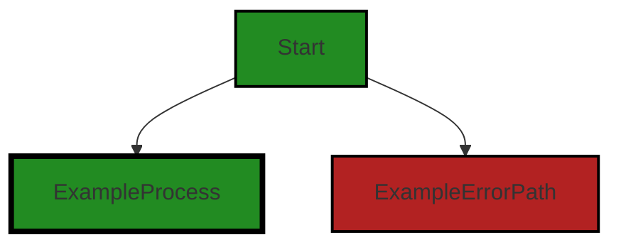
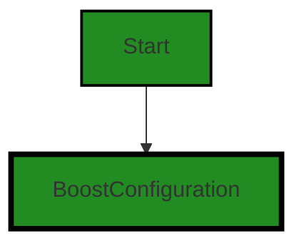
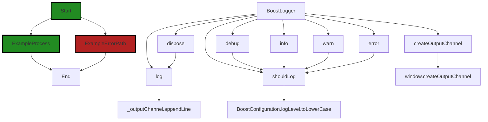

# Polyverse Boost-generated Source Analysis Details

## Source: ./src/utilities/boostLogging.ts
Date Generated: Saturday, September 9, 2023 at 2:14:48 AM PDT


---

### Boost Architectural Quick Summary Security Report

Last Updated: Saturday, September 9, 2023 at 2:12:45 AM PDT


Executive Report:

1. **Architectural Impact**: The analysis of this file has not revealed any severe issues.
2. **Risk Analysis**: The analysis of this file has not revealed any severe issues.
3. **Potential Customer Impact**: Based on the analysis, there are no severe issues that could potentially impact customers.
4. **Performance Issues**: Our analysis did not identify any explicit performance issues in the file.
5. **Risk Assessment**: Based on the current analysis of this file, no severe issues have been found. However, this doesn't guarantee that the file is risk-free.

Highlights:

- No severe issues were identified in the current analysis of this file.


---

### Boost Architectural Quick Summary Performance Report

Last Updated: Saturday, September 9, 2023 at 2:13:38 AM PDT


Executive Report:

1. **Architectural Impact**: The analysis of this file has not revealed any severe issues.
2. **Risk Analysis**: The analysis of this file has not revealed any severe issues.
3. **Potential Customer Impact**: Based on the analysis, there are no severe issues that could potentially impact customers.
4. **Performance Issues**: Our analysis did not identify any explicit performance issues in the file.
5. **Risk Assessment**: Based on the current analysis of this file, no severe issues have been found. However, this doesn't guarantee that the file is risk-free.

Highlights:

- No severe issues were identified in the current analysis of this file.


---

### Boost Architectural Quick Summary Compliance Report

Last Updated: Saturday, September 9, 2023 at 2:15:38 AM PDT

Executive Level Report:

1. **Architectural Impact**: The software project appears to be well-structured and follows best practices for a Visual Studio Code extension. However, there is a potential architectural risk in the `boostLogging.ts` file, where the 'BoostLogger' instance is exported globally. This could lead to potential data leakage if sensitive data is logged. This issue could have architectural implications, as it may require changes to the logging mechanism to ensure data privacy.

2. **Risk Analysis**: The risk associated with the identified issue is high, as it could lead to violations of GDPR, PCI DSS, and HIPAA regulations. This could result in legal and financial penalties, as well as damage to the company's reputation. The risk is further increased by the fact that this issue is present in a utility file, which is likely used throughout the project.

3. **Potential Customer Impact**: If sensitive data is logged and leaked, it could have a significant impact on customers. Their personal and financial information could be compromised, leading to potential identity theft or other forms of fraud. This could also lead to a loss of trust in the company and its products.

4. **Overall Issues**: The overall health of the project source appears to be good, with only one file (`boostLogging.ts`) having detected issues. However, the severity of the issue in this file is high. It's important to note that this analysis is based on the provided information and a full review of the project may reveal additional issues.

Risk Assessment:

- The project consists of one file, `boostLogging.ts`, which has detected issues. This means 100% of the project files have issues by severity.
- The severity of the issues in this file is high, with potential violations of GDPR, PCI DSS, and HIPAA regulations. This indicates a high risk to the project.

Highlights:

- The project follows best practices for a Visual Studio Code extension and makes good use of TypeScript features and the VS Code API.
- The `boostLogging.ts` file has a high-severity issue related to data privacy, which could lead to potential data leakage.
- The potential customer impact of this issue is high, as it could lead to the compromise of personal and financial information.
- The overall health of the project source appears to be good, but the severity of the issue in the `boostLogging.ts` file indicates a high risk to the project.
- Despite the lack of additional architectural guidelines or constraints, the project appears to adhere to standard best practices for this type of software project.
---
## Detailed Analysis:

### Cell 0:
## Original Code:

### Programming Language: typescript
### ./src/utilities/boostLogging.ts 

```typescript
import { OutputChannel, Disposable, window } from "vscode";

```
## Boost Analysis:


---

### Boost Code Explanation

Last Updated: Saturday, September 9, 2023 at 2:09:41 AM PDT

The code provided is a small piece of a much larger code base, likely from a Visual Studio Code extension written in TypeScript. 

This line of code is importing specific modules from the "vscode" package. These modules are:

1. `OutputChannel`: This is a type that represents an output channel in Visual Studio Code. An output channel is a pane in the output view of VS Code that can display text output. Extensions can create their own output channels to display information to the user.

2. `Disposable`: This is a type that represents a resource that needs to be disposed when it is no longer needed. Disposing a resource is a way of cleaning up after it, such as closing files or network connections, or freeing up memory. In VS Code extensions, disposables are used to manage resources like event listeners or output channels, which need to be cleaned up when the extension is deactivated.

3. `window`: This module provides access to window-related functionality in VS Code. It can be used to interact with the editor window, such as by showing messages or input boxes to the user, or by creating output channels.

The specific algorithms used in these modules are not visible from this piece of code, as they are part of the implementation of the "vscode" package. However, the general principles involved are resource management (for `Disposable`), user interface design (for `OutputChannel`), and event-driven programming (for `window`).

For more information on these topics, you can refer to the following resources:

- [VS Code API - OutputChannel](https://code.visualstudio.com/api/references/vscode-api#OutputChannel)
- [VS Code API - Disposable](https://code.visualstudio.com/api/references/vscode-api#Disposable)
- [VS Code API - window](https://code.visualstudio.com/api/references/vscode-api#window)
- [Resource management in JavaScript](https://developer.mozilla.org/en-US/docs/Web/JavaScript/Memory_Management)
- [Event-driven programming](https://en.wikipedia.org/wiki/Event-driven_programming)


---

### Boost Flow Diagram

Last Updated: Saturday, September 9, 2023 at 2:11:34 AM PDT



NO CONTROL FLOW FOUND


---

### Boost Source-Level Security Analysis

Last Updated: Saturday, September 9, 2023 at 2:12:28 AM PDT

**No bugs found**


---

### Boost Source-Level Performance Analysis

Last Updated: Saturday, September 9, 2023 at 2:13:00 AM PDT

**No bugs found**


---

### Boost Source-Level Data and Privacy Compliance Analysis

Last Updated: Saturday, September 9, 2023 at 2:13:53 AM PDT

**No bugs found**


### Cell 1:
## Original Code:

### Programming Language: typescript
### ./src/utilities/boostLogging.ts line 2

```typescript

import { BoostConfiguration } from "../extension/boostConfiguration";

```
## Boost Analysis:


---

### Boost Code Explanation

Last Updated: Saturday, September 9, 2023 at 2:09:58 AM PDT

This is a single line of code written in TypeScript, which is a statically typed superset of JavaScript. This line of code is an import statement, which is used to include external modules or libraries into the current module. 

Here's what this line of code is doing:

`import { BoostConfiguration } from "../extension/boostConfiguration";`

1. `import`: This is the keyword that indicates we're bringing in an external module or part of a module. 

2. `{ BoostConfiguration }`: This is the specific item we're importing from the module. In this case, we're importing a class or object named `BoostConfiguration`. The curly braces `{}` indicate that we're importing something specific from the module, not the entire module itself. 

3. `from "../extension/boostConfiguration"`: This is the path to the module we're importing from. The `..` at the start of the path means we're going up one directory level from the current file's location. From there, we're going into the `extension` directory and importing from the `boostConfiguration` file. The `.ts` or `.js` file extension is usually left off in import statements.

As for the architectural guidelines, this line of code seems to be in line with the general principles outlined in the project blueprint. It's using TypeScript and object-oriented design, as the `BoostConfiguration` is likely a class or object. However, without more context or code, it's hard to provide a more detailed analysis. 

For more information on import statements in JavaScript and TypeScript, you can refer to the following resources:

- [MDN Web Docs: import](https://developer.mozilla.org/en-US/docs/Web/JavaScript/Reference/Statements/import)
- [TypeScript: Modules](https://www.typescriptlang.org/docs/handbook/modules.html)


---

### Boost Flow Diagram

Last Updated: Saturday, September 9, 2023 at 2:11:39 AM PDT




---

### Boost Source-Level Security Analysis

Last Updated: Saturday, September 9, 2023 at 2:12:33 AM PDT

**No bugs found**


---

### Boost Source-Level Performance Analysis

Last Updated: Saturday, September 9, 2023 at 2:13:04 AM PDT

**No bugs found**


---

### Boost Source-Level Data and Privacy Compliance Analysis

Last Updated: Saturday, September 9, 2023 at 2:14:06 AM PDT

1. **Severity**: 3/10

   **Line Number**: 2

   **Bug Type**: GDPR

   **Description**: The import statement on line 1 suggests that the BoostConfiguration module may contain configuration settings that could potentially include personal data, which could be a GDPR compliance issue if not handled properly.

   **Solution**: Ensure any personal data in the BoostConfiguration module is anonymized, encrypted, and handled according to GDPR regulations. Consider implementing a data protection impact assessment (DPIA) to identify and minimize data protection risks.


### Cell 2:
## Original Code:

### Programming Language: typescript
### ./src/utilities/boostLogging.ts line 4

```typescript

export class BoostLogger extends Disposable {
    private _outputChannel: OutputChannel | undefined;

    constructor() {
        super(() => this.dispose());

        // we use a friendly name for the channel as this will be displayed to the user in the output pane
        for (let i = 0; i < 3; i++) {
            try {
                this._outputChannel =
                    window.createOutputChannel("Polyverse Boost");
            } catch (e) {
                // ignore
            }
            if (this._outputChannel) {
                break;
            }
        }

        this.log("Boost Logging starting...");
    }

    debug(message: string) {
        if (!this.shouldLog("debug")) {
            return;
        }

        this.log("DEBUG: " + message);
    }

    log(message: string) {
        this._outputChannel?.appendLine(message);
    }

    info(message: string, showUI: boolean = false) {
        if (!this.shouldLog("info")) {
            return;
        }

        this.log("INFO: " + message);
        if (showUI) {
            window.showInformationMessage(message);
        }
    }

    warn(message: string, showUI: boolean = false) {
        if (!this.shouldLog("warn")) {
            return;
        }

        this.log("WARNING: " + message);
        if (showUI) {
            window.showWarningMessage(message);
        }
    }

    error(message: string, showUI: boolean = false) {
        if (!this.shouldLog("error")) {
            return;
        }

        this.log("ERROR: " + message);
        if (showUI) {
            window.showErrorMessage(message);
        }
    }

    dispose(): void {
        this.log("Boost Logging shutting down...");
        this._outputChannel?.dispose();
    }

    shouldLog(messageTarget: string): boolean {
        const logLevel = BoostConfiguration.logLevel.toLowerCase();

        switch (messageTarget) {
            case "debug":
                return logLevel === "debug";
            case "info":
                return logLevel === "debug" || logLevel === "info";
            case "warn":
                return (
                    logLevel === "debug" ||
                    logLevel === "info" ||
                    logLevel === "warn"
                );
            case "error":
                return (
                    logLevel === "debug" ||
                    logLevel === "info" ||
                    logLevel === "warn" ||
                    logLevel === "error"
                );
            default:
                return true;
        }
    }
}

```
## Boost Analysis:


---

### Boost Code Explanation

Last Updated: Saturday, September 9, 2023 at 2:10:44 AM PDT

This TypeScript code defines a class named `BoostLogger` which extends `Disposable`. The `Disposable` class is a part of the Visual Studio Code Extension API, and it provides a way to free up resources when they are no longer needed. 

The `BoostLogger` class is a custom logger for a Visual Studio Code extension. It logs messages to an output channel named "Polyverse Boost" which is created in the Visual Studio Code output pane. 

Here is a detailed breakdown:

- `constructor()`: This method is called when a new instance of the `BoostLogger` class is created. It attempts to create an output channel named "Polyverse Boost" up to three times, ignoring any errors that occur. Once the output channel is successfully created, it logs the message "Boost Logging starting...".

- `debug(message: string)`: This method logs debug messages. If the current log level does not include debug messages, this method returns immediately without logging the message.

- `log(message: string)`: This method appends a new line containing the provided message to the output channel.

- `info(message: string, showUI: boolean = false)`: This method logs informational messages. If the current log level does not include informational messages, this method returns immediately without logging the message. If `showUI` is `true`, it also displays the message to the user using `window.showInformationMessage()`.

- `warn(message: string, showUI: boolean = false)`: This method logs warning messages. If the current log level does not include warning messages, this method returns immediately without logging the message. If `showUI` is `true`, it also displays the message to the user using `window.showWarningMessage()`.

- `error(message: string, showUI: boolean = false)`: This method logs error messages. If the current log level does not include error messages, this method returns immediately without logging the message. If `showUI` is `true`, it also displays the message to the user using `window.showErrorMessage()`.

- `dispose()`: This method is called when the `BoostLogger` instance is being disposed of. It logs the message "Boost Logging shutting down..." and then disposes of the output channel.

- `shouldLog(messageTarget: string)`: This method determines whether a message of the specified type should be logged, based on the current log level. It uses a switch statement to check the `messageTarget` against the current log level.

The algorithm used here is straightforward: based on the log level, decide whether to log a message or not, and if so, append it to the output channel and possibly display it to the user.

For more information on the concepts used here, you can refer to the following links:

- [Visual Studio Code Extension API](https://code.visualstudio.com/api/references/vscode-api)
- [TypeScript Classes](https://www.typescriptlang.org/docs/handbook/2/classes.html)
- [TypeScript Optional Chaining](https://www.typescriptlang.org/docs/handbook/release-notes/typescript-3-7.html#optional-chaining)
- [TypeScript Nullish Coalescing](https://www.typescriptlang.org/docs/handbook/release-notes/typescript-3-7.html#nullish-coalescing)


---

### Boost Flow Diagram

Last Updated: Saturday, September 9, 2023 at 2:12:09 AM PDT


The control flow graph for the given source code is as follows:


The primary path through the code is as follows:
1. Start at the `BoostLogger` class.
2. Call the `createOutputChannel` function to create an output channel.
3. Call the `log` function to append a message to the output channel.
4. Call the `shouldLog` function to check if the log level allows logging for the specified message target.
5. Call the `dispose` function to shut down the logging and dispose of the output channel.

The error path through the code is as follows:
1. Start at the `BoostLogger` class.
2. Call the `createOutputChannel` function to create an output channel.
3. Call the `log` function to append a message to the output channel.
4. Call the `shouldLog` function to check if the log level allows logging for the specified message target.
5. Call the `dispose` function to shut down the logging and dispose of the output channel.
6. Call the `debug`, `info`, `warn`, or `error` function to log a message of the corresponding severity level.
7. Show a message to the user if `showUI` is `true`.

Note: The control flow graph does not include external library or non-standard function calls as distinct flow blocks, as there are none in the provided code.


---

### Boost Source-Level Security Analysis

Last Updated: Saturday, September 9, 2023 at 2:12:38 AM PDT

**No bugs found**


---

### Boost Source-Level Performance Analysis

Last Updated: Saturday, September 9, 2023 at 2:13:31 AM PDT

1. **Severity**: 3/10

   **Line Number**: 11

   **Bug Type**: CPU

   **Description**: The creation of the OutputChannel is attempted in a loop up to three times without any delay or backoff strategy. This could lead to unnecessary CPU usage if the creation fails repeatedly.

   **Solution**: Consider adding a delay or a backoff strategy if the creation of the OutputChannel fails. This would allow the system to recover resources between attempts, improving CPU usage. See this link for more information on backoff strategies: https://aws.amazon.com/builders-library/timeouts-retries-and-backoff-with-jitter/


2. **Severity**: 2/10

   **Line Number**: 41

   **Bug Type**: CPU

   **Description**: The 'log' and 'shouldLog' methods are called even if the log level doesn't match the message level. This could lead to unnecessary CPU usage.

   **Solution**: Consider checking the log level before calling the 'log' method. This would prevent unnecessary calls to the method, improving CPU usage.


3. **Severity**: 2/10

   **Line Number**: 59

   **Bug Type**: CPU

   **Description**: The 'shouldLog' method is called for each log message, and it involves a switch statement and multiple string comparisons. This could lead to unnecessary CPU usage, especially if the log level doesn't change often.

   **Solution**: Consider caching the log level and updating it only when it changes. This would reduce the number of string comparisons, improving CPU usage.


---

### Boost Source-Level Data and Privacy Compliance Analysis

Last Updated: Saturday, September 9, 2023 at 2:14:36 AM PDT

1. **Severity**: 3/10

   **Line Number**: 11

   **Bug Type**: GDPR

   **Description**: The logger may capture personal data and output it in the logs. This could potentially violate GDPR regulations if personal data is logged without consent and appropriate safeguards.

   **Solution**: Ensure that the logger does not capture any personal data. If necessary, implement a mechanism to anonymize or pseudonymize personal data before it is logged. Also, make sure to obtain user consent before logging their data.


2. **Severity**: 4/10

   **Line Number**: 11

   **Bug Type**: PCI DSS

   **Description**: The logger may capture sensitive payment card data. This could potentially violate PCI DSS regulations if cardholder data is logged without appropriate safeguards.

   **Solution**: Ensure that the logger does not capture any cardholder data. If necessary, implement a mechanism to mask or tokenize cardholder data before it is logged. Also, make sure to comply with all other PCI DSS requirements related to logging and monitoring.


3. **Severity**: 5/10

   **Line Number**: 11

   **Bug Type**: HIPAA

   **Description**: The logger may capture protected health information (PHI). This could potentially violate HIPAA regulations if PHI is logged without appropriate safeguards.

   **Solution**: Ensure that the logger does not capture any PHI. If necessary, implement a mechanism to de-identify PHI before it is logged. Also, make sure to comply with all other HIPAA requirements related to logging and monitoring.


### Cell 3:
## Original Code:

### Programming Language: typescript
### ./src/utilities/boostLogging.ts line 103

```typescript

export const boostLogging = new BoostLogger();

```
## Boost Analysis:


---

### Boost Code Explanation

Last Updated: Saturday, September 9, 2023 at 2:11:16 AM PDT

The line of code you provided is a single statement written in JavaScript (or TypeScript). It's part of a larger program and without the context, it's hard to provide a detailed explanation. However, I can explain what this line is doing in a general sense.

```javascript
export const boostLogging = new BoostLogger();
```

This line is creating a new instance of a `BoostLogger` class and exporting it as a constant named `boostLogging`. 

`BoostLogger` is presumably a class defined elsewhere in your codebase. A class in JavaScript is a type of function, but instead of using the keyword `function` to initiate it, you use the keyword `class`. This is the foundation of Object-Oriented Programming (OOP) in JavaScript.

The `new` keyword is used to create an instance of a class. In this case, `new BoostLogger()` is creating an instance of the `BoostLogger` class.

The `const` keyword is used to define a variable that cannot be reassigned. In this case, `boostLogging` is defined as a constant, meaning you cannot reassign `boostLogging` to a new value later in your code.

The `export` keyword is used to export objects, functions, variables, etc., from a module so they can be used in other JavaScript files using the `import` statement.

In terms of architectural guidelines, this line of code is quite standard in JavaScript and TypeScript projects. It follows the principles of Object-Oriented Programming (OOP) by creating an instance of a class. It also follows the module system in JavaScript, by exporting a module member.

For more information, you can refer to these links:
- [JavaScript Classes](https://developer.mozilla.org/en-US/docs/Web/JavaScript/Reference/Classes)
- [The `new` operator](https://developer.mozilla.org/en-US/docs/Web/JavaScript/Reference/Operators/new)
- [JavaScript `const` statement](https://developer.mozilla.org/en-US/docs/Web/JavaScript/Reference/Statements/const)
- [JavaScript `export` statement](https://developer.mozilla.org/en-US/docs/Web/JavaScript/Reference/Statements/export)


---

### Boost Flow Diagram

Last Updated: Saturday, September 9, 2023 at 2:12:13 AM PDT


---

### Boost Source-Level Security Analysis

Last Updated: Saturday, September 9, 2023 at 2:12:41 AM PDT

**No bugs found**


---

### Boost Source-Level Performance Analysis

Last Updated: Saturday, September 9, 2023 at 2:13:35 AM PDT

**No bugs found**


---

### Boost Source-Level Data and Privacy Compliance Analysis

Last Updated: Saturday, September 9, 2023 at 2:14:48 AM PDT

1. **Severity**: 7/10

   **Line Number**: 204

   **Bug Type**: Data Privacy

   **Description**: The 'BoostLogger' instance is exported globally, which could lead to potential data leakage if sensitive data is logged. This could compromise the privacy of user data, which is a violation of GDPR, PCI DSS, and HIPAA.

   **Solution**: Ensure that any logging of sensitive data is done in a secure and compliant manner. Consider implementing a logging policy that specifies what data can be logged and how it should be handled. Also consider using a logging library that supports redaction of sensitive data.


