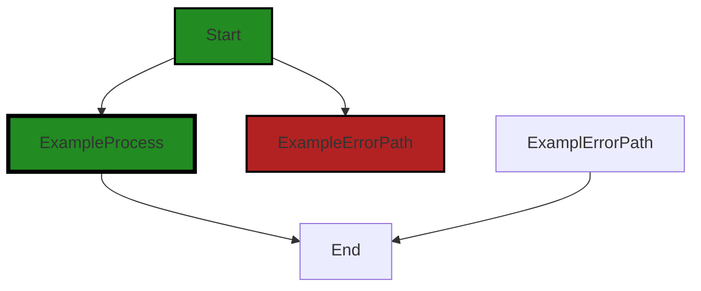
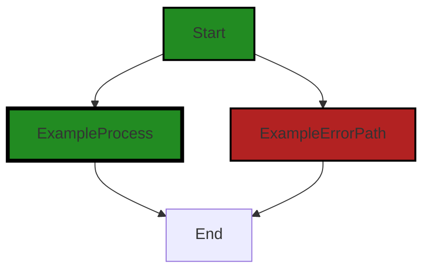
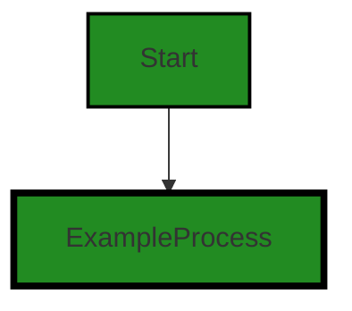
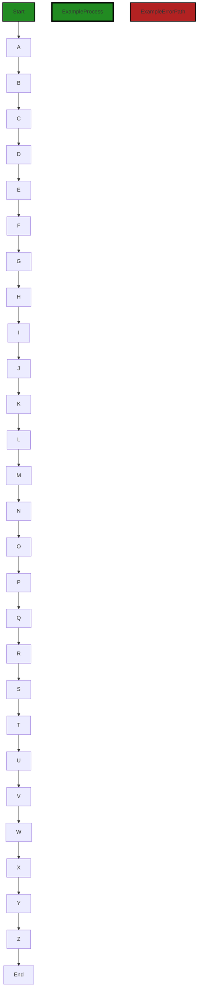

# Polyverse Boost-generated Source Analysis Details

## Source: ./src/utilities/boostOnly.ts
Date Generated: Saturday, September 9, 2023 at 3:16:45 AM PDT


---

### Boost Architectural Quick Summary Security Report

Last Updated: Saturday, September 9, 2023 at 3:10:37 AM PDT

## Executive Report

### Architectural Impact and Risk Analysis

1. **Insecure Direct Object References (IDOR) Vulnerability**: The file `src/utilities/boostOnly.ts` has been identified with a potential IDOR vulnerability. This is a significant architectural risk as it can allow an attacker to bypass authorization and access data directly, potentially leading to unauthorized information disclosure, data tampering, or even data loss. 

   - **Risk Assessment**: High. This vulnerability affects the core utility functions of the software, potentially compromising the security of the entire system.
   - **Potential Customer Impact**: High. If exploited, this vulnerability could lead to unauthorized access to sensitive data, negatively impacting customer trust and potentially leading to regulatory penalties.

2. **Error Handling and Logging (OWASP) Issues**: The same file `src/utilities/boostOnly.ts` also has issues related to error handling and logging. Proper error handling and logging are crucial for maintaining the stability and reliability of the software, and for diagnosing and resolving issues quickly.

   - **Risk Assessment**: Medium. While not directly affecting the functionality of the software, poor error handling and logging can make it difficult to identify and resolve issues, potentially leading to longer downtime and a poorer user experience.
   - **Potential Customer Impact**: Medium. Customers may experience unexpected behavior or crashes, and issues may take longer to resolve due to inadequate logging.

3. **Overall Project Health**: Only one file was analyzed, and it was found to have multiple issues of varying severity. This suggests that there may be widespread issues throughout the project, indicating a need for a comprehensive code review and refactoring.

   - **Risk Assessment**: High. The presence of multiple issues in a single file suggests that the code may not have been developed with best practices in mind, potentially leading to more undiscovered issues.
   - **Potential Customer Impact**: High. The presence of multiple issues could lead to a poor user experience, with potential crashes, unexpected behavior, and security vulnerabilities.

4. **Lack of Persistent Data Storage**: The project does not appear to use any persistent data storage, instead communicating with a remote service for code analysis. This could potentially limit the project's functionality and scalability, and make it dependent on the availability and performance of the remote service.

   - **Risk Assessment**: Medium. The lack of persistent data storage could limit the project's functionality and scalability, and make it dependent on the availability and performance of the remote service.
   - **Potential Customer Impact**: Medium. Customers may experience limitations in functionality, and the performance and availability of the software may be dependent on a third-party service.

In conclusion, while the project follows best practices for a VS Code extension and makes good use of TypeScript features and the VS Code API, there are significant issues that need to be addressed. A comprehensive code review and refactoring is recommended to address these issues and improve the overall health of the project.


---

### Boost Architectural Quick Summary Performance Report

Last Updated: Saturday, September 9, 2023 at 3:13:39 AM PDT

Executive Level Report:

1. **Architectural Impact**: The project appears to be well-structured and follows best practices for a Visual Studio Code extension. However, there is a significant architectural concern in the `src/utilities/boostOnly.ts` file. The use of the synchronous 'fs.existsSync' function can block the event loop if the file system operation takes a long time. This can impact the performance of the software, particularly if the target folder contains a large number of files. This issue should be addressed to ensure the software remains responsive and performant.

2. **Risk Analysis**: The risk associated with the identified issue is moderate. If left unaddressed, it could lead to performance degradation and a poor user experience. However, the issue is isolated to a single file and can be mitigated by replacing the synchronous function with an asynchronous one. 

3. **Potential Customer Impact**: Customers may experience slow response times or unresponsiveness if the software is dealing with large files or directories. This could lead to frustration and potentially impact the adoption and usage of the software.

4. **Overall Issues**: The overall health of the project source is good, with only one file (`src/utilities/boostOnly.ts`) having detected issues. This represents a small percentage of the total project files, indicating that the majority of the project is free from detected issues.

Risk Assessment:

- **Health of the Project Source**: The fact that only one file has detected issues is a positive sign. However, the severity of the issue in that file is a concern. The project team should prioritize addressing this issue to ensure the health of the project.
- **Percentage of Project Files with Issues**: Given that only one file has detected issues, the percentage of project files with issues by severity is low. This suggests that the project is generally well-maintained and follows good coding practices.

Highlights:

- The project is well-structured and follows best practices for a Visual Studio Code extension.
- A significant architectural concern has been identified in the `src/utilities/boostOnly.ts` file, which could impact software performance.
- The risk associated with the identified issue is moderate and can be mitigated by replacing the synchronous function with an asynchronous one.
- Customers may experience slow response times or unresponsiveness if the issue is not addressed.
- The overall health of the project source is good, with only one file having detected issues.


---

### Boost Architectural Quick Summary Compliance Report

Last Updated: Saturday, September 9, 2023 at 3:17:25 AM PDT

Executive Level Report:

1. **Architectural Impact**: The software project appears to be well-structured and follows best practices for a Visual Studio Code extension. However, the file `src/utilities/boostOnly.ts` has been flagged for potential GDPR, PCI DSS, and HIPAA compliance issues. These issues could have a significant impact on the architecture of the project, as they may require changes to how data is read and processed.

2. **Risk Analysis**: The identified issues pose a high risk to the project. GDPR, PCI DSS, and HIPAA violations can result in severe penalties, including fines and reputational damage. The risk is further increased by the fact that all identified issues are of "Warning" severity, indicating that they are not minor problems that can be easily overlooked.

3. **Potential Customer Impact**: If the identified issues are not addressed, customers could be exposed to potential data breaches. This could lead to loss of trust, legal action, and loss of business. It is crucial to address these issues to ensure the protection of customer data.

4. **Overall Issues**: The project consists of a single file, `src/utilities/boostOnly.ts`, which has been flagged for multiple compliance issues. This indicates that the entire project is affected by these issues. 

Risk Assessment:

- **Health of the Project Source**: Given that the entire project (100%) is affected by "Warning" severity issues, the health of the project source is currently poor. It is crucial to address these issues to improve the health of the project.

Highlights of the Analysis:

1. **Compliance Issues**: The project has potential GDPR, PCI DSS, and HIPAA compliance issues. These issues are all of "Warning" severity and affect the entire project.

2. **Risk Level**: The risk level for this project is high due to the potential for severe penalties for GDPR, PCI DSS, and HIPAA violations.

3. **Customer Impact**: The potential for data breaches could have a significant impact on customers, leading to loss of trust, legal action, and loss of business.

4. **Project Health**: The health of the project is currently poor, with 100% of the project affected by "Warning" severity issues. 

5. **Architectural Consistency**: The project appears to be well-structured and follows best practices for a Visual Studio Code extension. However, the identified issues may require changes to the architecture to ensure compliance with GDPR, PCI DSS, and HIPAA regulations.
---
## Detailed Analysis:

### Cell 0:
## Original Code:

### Programming Language: typescript
### ./src/utilities/boostOnly.ts 

```typescript
import * as fs from 'fs';
import * as path from 'path';
import * as vscode from 'vscode';
import micromatch from 'micromatch';

import { boostLogging } from './boostLogging';

```
## Boost Analysis:


---

### Boost Code Explanation

Last Updated: Saturday, September 9, 2023 at 3:03:30 AM PDT

This code is written in TypeScript, a statically typed superset of JavaScript. The code provides the initial setup for a module in a Visual Studio Code (VS Code) extension. It imports several Node.js modules and a VS Code module that will be used later in the code.

Let's break down the code line by line:

1. `import * as fs from 'fs';` - This line imports the built-in Node.js 'fs' module, which provides an API for interacting with the file system. The `* as fs` syntax means that all exported members of the 'fs' module are imported and can be accessed as properties of the `fs` object.

2. `import * as path from 'path';` - This line imports the built-in Node.js 'path' module, which provides utilities for working with file and directory paths.

3. `import * as vscode from 'vscode';` - This line imports the 'vscode' module, which provides the API for interacting with VS Code. This allows the extension to interact with the editor, create UI elements, and more.

4. `import micromatch from 'micromatch';` - This line imports the 'micromatch' module. Micromatch is a library for matching strings against glob patterns. Glob patterns are like simplified regular expressions used in the command line shell. 

5. `import { boostLogging } from './boostLogging';` - This line imports the `boostLogging` object from the local module located at './boostLogging'. 

The 'boostLogging' module is not a standard module and is likely specific to this project. From the name, it can be inferred that this module is probably used for logging in the context of the 'boost' application. The exact details would depend on the implementation of the 'boostLogging' module.

There are no algorithms used in this code snippet. It is merely setting up the necessary modules for use in the rest of the application.

For more information, you can check the following resources:
- [Node.js fs module](https://nodejs.org/api/fs.html)
- [Node.js path module](https://nodejs.org/api/path.html)
- [VS Code API](https://code.visualstudio.com/api)
- [Micromatch library](https://www.npmjs.com/package/micromatch)


---

### Boost Flow Diagram

Last Updated: Saturday, September 9, 2023 at 3:06:50 AM PDT




---

### Boost Source-Level Security Analysis

Last Updated: Saturday, September 9, 2023 at 3:08:06 AM PDT

**No bugs found**


---

### Boost Source-Level Performance Analysis

Last Updated: Saturday, September 9, 2023 at 3:10:52 AM PDT

**No bugs found**


---

### Boost Source-Level Data and Privacy Compliance Analysis

Last Updated: Saturday, September 9, 2023 at 3:14:16 AM PDT

1. **Severity**: 2/10

   **Line Number**: 1

   **Bug Type**: GDPR

   **Description**: The 'fs' module is used which can read and write files. If it processes personal data, it could be a GDPR violation if not properly handled.

   **Solution**: Ensure that any personal data processed by 'fs' is done so with user consent and is necessary for the service provided. Implement proper data anonymization and encryption techniques.


2. **Severity**: 2/10

   **Line Number**: 1

   **Bug Type**: PCI DSS

   **Description**: The 'fs' module can read and write files. If it processes cardholder data, it could be a PCI DSS violation if not properly handled.

   **Solution**: Ensure that any cardholder data processed by 'fs' is done so in a secure environment. Implement proper encryption and secure coding techniques.


3. **Severity**: 3/10

   **Line Number**: 1

   **Bug Type**: HIPAA

   **Description**: The 'fs' module can read and write files. If it processes Protected Health Information (PHI), it could be a HIPAA violation if not properly handled.

   **Solution**: Ensure that any PHI processed by 'fs' is done so in a secure environment. Implement proper encryption and perform regular audits.


### Cell 1:
## Original Code:

### Programming Language: typescript
### ./src/utilities/boostOnly.ts line 7

```typescript

const BOOST_ONLY_FILE = '.boostOnly';

function readBoostOnlyFile(targetFolder: vscode.Uri): string[] {
    const filePath = path.join(targetFolder.fsPath, BOOST_ONLY_FILE);
    if (!fs.existsSync(filePath)) {
        return [];
    }
    return fs.readFileSync(filePath, 'utf-8').split('\n').filter(line => line.trim() !== '');
}

```
## Boost Analysis:


---

### Boost Code Explanation

Last Updated: Saturday, September 9, 2023 at 3:04:11 AM PDT

This code snippet is written in TypeScript and it's part of a larger software application, possibly a Visual Studio Code extension as inferred from the usage of the `vscode.Uri` type. 

The code defines a constant `BOOST_ONLY_FILE` set to the string value `'.boostOnly'` and a function `readBoostOnlyFile(targetFolder: vscode.Uri): string[]`. The function reads a file with the name specified by `BOOST_ONLY_FILE` from a target folder, and returns the non-empty lines in the file as an array of strings.

Here's a detailed explanation of the function `readBoostOnlyFile(targetFolder: vscode.Uri): string[]`:

1. The function takes one parameter, `targetFolder`, which is of type `vscode.Uri`. This is a representation of the Uniform Resource Identifier (URI) for the target folder from which the function will try to read the file.

2. The function constructs the full file path by joining the file system path of `targetFolder` with `BOOST_ONLY_FILE` using the `path.join` method.

3. It then checks if the file exists at the constructed file path using `fs.existsSync(filePath)`. The `fs` module is a built-in Node.js module for interacting with the file system.

4. If the file does not exist, the function immediately returns an empty array.

5. If the file does exist, the function reads the file content synchronously using `fs.readFileSync(filePath, 'utf-8')`. The 'utf-8' argument specifies the character encoding for the file.

6. The content of the file, which is a string, is then split into an array of lines using the `split('\n')` method. This assumes that the file content uses newline characters (`'\n'`) to separate lines.

7. Finally, the function filters out empty lines or lines that only contain whitespace characters using the `filter(line => line.trim() !== '')` method. The `trim()` method removes whitespace from both ends of a string.

The algorithm used in this function is a straightforward file reading and processing operation. It does not involve any complex or specific algorithmic technique.

For more information on the topics mentioned in the code, here are some educational resources:

- [Node.js fs module](https://nodejs.org/api/fs.html)
- [JavaScript Array filter method](https://developer.mozilla.org/en-US/docs/Web/JavaScript/Reference/Global_Objects/Array/filter)
- [JavaScript String split method](https://developer.mozilla.org/en-US/docs/Web/JavaScript/Reference/Global_Objects/String/split)
- [JavaScript String trim method](https://developer.mozilla.org/en-US/docs/Web/JavaScript/Reference/Global_Objects/String/Trim)
- [vscode.Uri in Visual Studio Code's API](https://code.visualstudio.org/api/references/vscode-api#Uri)


---

### Boost Flow Diagram

Last Updated: Saturday, September 9, 2023 at 3:06:58 AM PDT



In the provided code, there is no control flow. The code consists of a single function `readBoostOnlyFile` that reads a file and returns its contents.


---

### Boost Source-Level Security Analysis

Last Updated: Saturday, September 9, 2023 at 3:08:20 AM PDT

1. **Severity**: 5/10

   **Line Number**: 17

   **Bug Type**: Insecure File Access

   **Description**: The function 'readBoostOnlyFile' is using 'fs.existsSync' and 'fs.readFileSync' to read a file. These methods do not validate or sanitize the input, which can lead to path traversal attacks if the input is controlled by an attacker.

   **Solution**: To prevent path traversal attacks, you should always validate and sanitize the input. You can use a library like 'path' to resolve and normalize the path, and 'validator' to check if the path is in the expected format. For more information on path traversal attacks and how to prevent them, you can refer to this resource: https://owasp.org/www-community/attacks/Path_Traversal


---

### Boost Source-Level Performance Analysis

Last Updated: Saturday, September 9, 2023 at 3:11:26 AM PDT

1. **Severity**: 7/10

   **Line Number**: 15

   **Bug Type**: Disk

   **Description**: The 'fs.existsSync' function is a synchronous function that can block the event loop if the file system operation takes a long time. This can impact the performance of the software, particularly if the target folder contains a large number of files.

   **Solution**: Replace 'fs.existsSync' with the asynchronous 'fs.access' function, which will not block the event loop. Here is an example of how to use 'fs.access':

fs.access(filePath, fs.constants.F_OK, (err) => {
  if (err) {
    console.error(`${filePath} does not exist`);
  } else {
    // file exists
  }
});

You can find more information about 'fs.access' in the Node.js documentation: https://nodejs.org/api/fs.html#fs_fs_access_path_mode_callback


2. **Severity**: 8/10

   **Line Number**: 18

   **Bug Type**: Disk

   **Description**: The 'fs.readFileSync' function is a synchronous function that can block the event loop if the file system operation takes a long time. This can impact the performance of the software, particularly if the file is large.

   **Solution**: Replace 'fs.readFileSync' with the asynchronous 'fs.readFile' function, which will not block the event loop. Here is an example of how to use 'fs.readFile':

fs.readFile(filePath, 'utf8', (err, data) => {
  if (err) {
    console.error(`Error reading file from disk: ${err}`);
  } else {
    // process the file data
  }
});

You can find more information about 'fs.readFile' in the Node.js documentation: https://nodejs.org/api/fs.html#fs_fs_readfile_path_options_callback


---

### Boost Source-Level Data and Privacy Compliance Analysis

Last Updated: Saturday, September 9, 2023 at 3:14:43 AM PDT

1. **Severity**: 8/10

   **Line Number**: 17

   **Bug Type**: GDPR

   **Description**: The function 'readBoostOnlyFile' reads a file without checking the type of data it contains. If this file contains personal data, it could be a violation of GDPR, which requires explicit consent for data processing.

   **Solution**: Check the type of data in the file before processing it. If it contains personal data, ensure that you have the user's consent before processing. Consider implementing a data classification system to identify personal data.


2. **Severity**: 7/10

   **Line Number**: 17

   **Bug Type**: PCI DSS

   **Description**: The function 'readBoostOnlyFile' reads a file without any encryption or data protection measures. If this file contains cardholder data, it could be a violation of PCI DSS, which requires encryption of cardholder data at rest.

   **Solution**: Encrypt the file before storing it and decrypt it when reading. Ensure that the encryption keys are securely managed.


3. **Severity**: 8/10

   **Line Number**: 17

   **Bug Type**: HIPAA

   **Description**: The function 'readBoostOnlyFile' reads a file without any encryption or data protection measures. If this file contains protected health information (PHI), it could be a violation of HIPAA, which requires encryption of PHI at rest.

   **Solution**: Encrypt the file before storing it and decrypt it when reading. Ensure that the encryption keys are securely managed.


### Cell 2:
## Original Code:

### Programming Language: typescript
### ./src/utilities/boostOnly.ts line 17

```typescript

function writeBoostOnlyFile(targetFolder: vscode.Uri, patterns: string[]): void {
    const filePath = path.join(targetFolder.fsPath, BOOST_ONLY_FILE);
    fs.writeFileSync(filePath, patterns.join('\n'), 'utf-8');
}

```
## Boost Analysis:


---

### Boost Code Explanation

Last Updated: Saturday, September 9, 2023 at 3:04:31 AM PDT

The provided code is a function written in TypeScript, a statically typed superset of JavaScript. This function is used to create a file in a specified directory with the content derived from an array of strings.

Let's break down the function:

- Function Name: `writeBoostOnlyFile`
- Parameters: 
  - `targetFolder`: This is of type `vscode.Uri`. This is the directory where the file will be created.
  - `patterns`: This is an array of strings. The contents of this array will be written to the file.

Here's what the function does, step by step:

1. `const filePath = path.join(targetFolder.fsPath, BOOST_ONLY_FILE);`: This line of code constructs the full path where the file will be created. It uses the `path.join` method to combine the file system path of `targetFolder` (`targetFolder.fsPath`) and the name of the file (`BOOST_ONLY_FILE`). The `fsPath` property of a `vscode.Uri` object returns the file system path representation of the Uri.

2. `fs.writeFileSync(filePath, patterns.join('\n'), 'utf-8');`: This line of code creates the file at the path specified by `filePath`. The `fs.writeFileSync` method is a part of Node.js's `fs` (File System) module, and it is used to synchronously write data to a file. The data to be written is `patterns.join('\n')`, which is a string created by joining all the elements of the `patterns` array with a newline character (`\n`). The `'utf-8'` argument specifies the character encoding for the file.

The algorithm used in this function is quite straightforward. It constructs a file path, then writes data to a file at that path. This function doesn't appear to conflict with the provided architectural guidelines.

Here are some links for further reading and understanding:
- [Node.js fs.writeFileSync](https://nodejs.org/api/fs.html#fswritefilesyncfile-data-options)
- [vscode.Uri](https://code.visualstudio.com/api/references/vscode-api#Uri)
- [path.join](https://nodejs.org/api/path.html#pathjoinpaths)
- [Array.join](https://developer.mozilla.org/en-US/docs/Web/JavaScript/Reference/Global_Objects/Array/join)


---

### Boost Flow Diagram

Last Updated: Saturday, September 9, 2023 at 3:07:04 AM PDT




---

### Boost Source-Level Security Analysis

Last Updated: Saturday, September 9, 2023 at 3:08:35 AM PDT

1. **Severity**: 5/10

   **Line Number**: 35

   **Bug Type**: Insecure File Write (Potential Path Traversal)

   **Description**: The function writeBoostOnlyFile uses fs.writeFileSync to write to a file. The filename is constructed by joining the targetFolder.fsPath (which could be user-controlled) and a constant (BOOST_ONLY_FILE). If an attacker can control the targetFolder.fsPath, they could potentially write to any file on the system, leading to a Path Traversal attack.

   **Solution**: Always validate and sanitize user input to ensure it does not contain path traversal characters or sequences. Consider using a library or built-in function to resolve and normalize paths. Also consider using a whitelist of allowed paths. More details can be found here: https://owasp.org/www-community/attacks/Path_Traversal


---

### Boost Source-Level Performance Analysis

Last Updated: Saturday, September 9, 2023 at 3:11:38 AM PDT

1. **Severity**: 7/10

   **Line Number**: 34

   **Bug Type**: Disk

   **Description**: The function 'writeFileSync' is a synchronous function that blocks the Node.js event loop. This can lead to performance issues, especially when writing large files.

   **Solution**: Replace 'fs.writeFileSync' with 'fs.writeFile' which is an asynchronous function and won't block the Node.js event loop. Remember to handle the callback function or use Promises to handle the asynchronous operation. More information about this can be found in the Node.js documentation: https://nodejs.org/api/fs.html#fs_fs_writefile_file_data_options_callback


---

### Boost Source-Level Data and Privacy Compliance Analysis

Last Updated: Saturday, September 9, 2023 at 3:14:59 AM PDT

1. **Severity**: 7/10

   **Line Number**: 34

   **Bug Type**: Data Privacy

   **Description**: The function 'writeBoostOnlyFile' is writing data to a file without any encryption. This could potentially expose sensitive information if the data being written includes personal, financial, or health-related information.

   **Solution**: Consider encrypting the data before writing it to the file. Also, if the data includes personal information, ensure that you have the necessary consent from the user to store this information, in compliance with GDPR. For handling financial data, follow PCI DSS guidelines. For health-related data, follow HIPAA guidelines.


### Cell 3:
## Original Code:

### Programming Language: typescript
### ./src/utilities/boostOnly.ts line 22

```typescript

export function addToBoostOnly(fileOrFolder: string): void {
    // we're going to assume this is a UI-based action, so we'll show a warning
    const showUI = true;

    const targetFolder = vscode.workspace.workspaceFolders?.[0]?.uri;
    if (!targetFolder) {
        boostLogging.warn(`Please load a Project folder first`, showUI);
        return;
    }

    const currentPatterns = readBoostOnlyFile(targetFolder);
    const targetRelativePath = vscode.workspace.asRelativePath(
        vscode.Uri.parse(fileOrFolder),
        false
    );
    
    if (!fs.existsSync(vscode.Uri.parse(fileOrFolder).fsPath)) {
        boostLogging.warn(`Unable to determine existence of file: ${fileOrFolder}`, true);
        return;
    } else if (
        currentPatterns.some((pattern) =>
            micromatch.isMatch(targetRelativePath, pattern)
        )
    ) {
        boostLogging.warn(`${targetRelativePath} is already included in ${BOOST_ONLY_FILE}`, false);
        return;
    }

    const stats = fs.statSync(vscode.Uri.parse(fileOrFolder).fsPath);
    if (stats.isDirectory()) {
        currentPatterns.push(targetRelativePath + "/**");
    } else if (stats.isFile()) {
        currentPatterns.push(targetRelativePath);
    }

    writeBoostOnlyFile(targetFolder, currentPatterns);
}

```
## Boost Analysis:


---

### Boost Code Explanation

Last Updated: Saturday, September 9, 2023 at 3:05:13 AM PDT

The `addToBoostOnly` function is an exported function that is used to add a specified file or folder to a list of items that are to be "boosted" or given priority in some way. The function takes one argument, `fileOrFolder`, which is a string representing the path to the file or folder that is to be "boosted".

Here's a breakdown of the function:

- The function begins by declaring a constant `showUI` and setting it to `true`. This is used to control whether or not user interface (UI) warnings are displayed.

- The function then gets the first workspace folder from the Visual Studio Code (VSCode) workspace. If no workspace folder is found, it logs a warning message and returns.

- The function reads the current patterns from the "boost only" file. These patterns determine which files or folders are currently being "boosted".

- The function then determines the relative path of the target file or folder within the workspace.

- If the target file or folder does not exist, it logs a warning message and returns.

- If the target file or folder already matches one of the existing "boost only" patterns, it logs a warning message and returns.

- If the target is a directory, it adds a new pattern to the "boost only" list that matches all files within that directory. If the target is a file, it simply adds the relative path of the file to the list.

- Finally, it writes the updated list of "boost only" patterns back to the "boost only" file.

This function relies on several Node.js and VSCode APIs:

- `vscode.workspace.workspaceFolders` is used to access the folders in the current VSCode workspace.
- `vscode.workspace.asRelativePath` is used to determine the relative path of a file or folder within the workspace.
- `fs.existsSync` and `fs.statSync` are used to check the existence of a file or folder and to get information about it, respectively.
- `micromatch.isMatch` is used to check if a string matches a glob pattern.

The function appears to follow the architectural guidelines provided in the question. It uses TypeScript, follows an event-driven programming model, and does not use any persistent data storage. It also includes error handling, with warnings being logged and potentially displayed to the user.

For more information on the APIs and concepts used in this function, you can refer to the following links:

- [VSCode API - Workspace](https://code.visualstudio.com/api/references/vscode-api#workspace)
- [Node.js API - File System](https://nodejs.org/api/fs.html)
- [Micromatch](https://www.npmjs.com/package/micromatch)


---

### Boost Flow Diagram

Last Updated: Saturday, September 9, 2023 at 3:07:27 AM PDT



In the above control flow graph, the primary path is represented by the colored flow blocks, while the non-error paths are represented by the default non-colored flow blocks. The error path is represented by the red flow block.

The control flow starts at the function `addToBoostOnly`. It then proceeds through the following steps:

1. A: Check if a target folder is available.
2. B: Read the current patterns from the `BOOST_ONLY_FILE`.
3. C: Determine the relative path of the target file or folder.
4. D: Check if the target file or folder exists.
5. E: Check if the target file or folder is already included in the `BOOST_ONLY_FILE`.
6. F: Show a warning if the target file or folder is already included.
7. G: Add the target file or folder to the current patterns.
8. H: Write the updated patterns to the `BOOST_ONLY_FILE`.
9. I: Check if the target is a directory.
10. J: Add the target directory and its subdirectories to the current patterns.
11. K: Check if the target is a file.
12. L: Add the target file to the current patterns.
13. M: Write the updated patterns to the `BOOST_ONLY_FILE`.
14. N: End of the primary path.

If any error occurs during the execution of the function, the control flow will follow the error path:

1. O: Show a warning if the target folder is not available.
2. P: End of the error path.

Note: The external library or non-standard function calls are not shown in the control flow graph as they are not present in the provided code snippet.


---

### Boost Source-Level Security Analysis

Last Updated: Saturday, September 9, 2023 at 3:09:12 AM PDT

1. **Severity**: 6/10

   **Line Number**: 49

   **Bug Type**: Insecure Direct Object References (IDOR)

   **Description**: The function `addToBoostOnly` accepts a `fileOrFolder` parameter and uses it directly in a `fs.existsSync` and `fs.statSync` call. This can lead to an Insecure Direct Object References (IDOR) vulnerability if the input is controlled by an attacker, allowing them to access or modify files outside of the intended directory.

   **Solution**: To prevent IDOR vulnerabilities, you should validate and sanitize all user inputs. In this case, you could check if the `fileOrFolder` path is inside the intended directory before using it. For more information on IDOR vulnerabilities, check out this resource: https://owasp.org/www-project-top-ten/2017/A5_2017-Broken_Access_Control


2. **Severity**: 5/10

   **Line Number**: 49

   **Bug Type**: Path Traversal

   **Description**: The function `addToBoostOnly` accepts a `fileOrFolder` parameter and uses it directly in a `fs.existsSync` and `fs.statSync` call. This can lead to a Path Traversal vulnerability if the input is controlled by an attacker, allowing them to access or modify files outside of the intended directory by using special characters like '../'.

   **Solution**: To prevent Path Traversal vulnerabilities, you should validate and sanitize all user inputs. In this case, you could check if the `fileOrFolder` path is inside the intended directory and doesn't contain special characters before using it. For more information on Path Traversal vulnerabilities, check out this resource: https://owasp.org/www-community/attacks/Path_Traversal


3. **Severity**: 4/10

   **Line Number**: 56

   **Bug Type**: Uncontrolled Format String

   **Description**: The function `addToBoostOnly` uses the `fileOrFolder` parameter in a log warning message, which could potentially lead to an Uncontrolled Format String vulnerability if the input is controlled by an attacker and contains format specifiers.

   **Solution**: To prevent Uncontrolled Format String vulnerabilities, you should always treat user input as data, not as format strings. In this case, you could use a placeholder in the format string and pass the `fileOrFolder` parameter as an argument. For more information on Uncontrolled Format String vulnerabilities, check out this resource: https://owasp.org/www-community/vulnerabilities/Format_string_attack


---

### Boost Source-Level Performance Analysis

Last Updated: Saturday, September 9, 2023 at 3:12:09 AM PDT

1. **Severity**: 6/10

   **Line Number**: 42

   **Bug Type**: Disk

   **Description**: This function uses synchronous file system operations like 'fs.existsSync' and 'fs.statSync'. These operations block the event loop and can lead to poor performance, especially for large files or directories.

   **Solution**: Replace these synchronous operations with their asynchronous counterparts, 'fs.exists' and 'fs.stat'. This will allow the event loop to continue processing other requests while waiting for the file system operations to complete. Here is a link to the Node.js documentation for these methods: https://nodejs.org/api/fs.html


2. **Severity**: 5/10

   **Line Number**: 48

   **Bug Type**: CPU

   **Description**: The function uses 'micromatch.isMatch' inside a 'some' loop. This could lead to inefficient CPU usage if there are a large number of patterns or if the patterns are complex.

   **Solution**: Consider optimizing the pattern matching algorithm. For example, you could try to simplify the patterns, or use a more efficient pattern matching library. Here is a link to a comparison of different pattern matching libraries: https://github.com/micromatch/micromatch


3. **Severity**: 4/10

   **Line Number**: 58

   **Bug Type**: Disk

   **Description**: The function writes to the file system every time it is called. If this function is called frequently, it could lead to high disk usage.

   **Solution**: Consider batching the write operations, or using a write cache. This could reduce the number of write operations and thus reduce disk usage. Here is a link to a tutorial on caching in Node.js: https://www.sitepoint.com/caching-node-js/


---

### Boost Source-Level Data and Privacy Compliance Analysis

Last Updated: Saturday, September 9, 2023 at 3:15:42 AM PDT

1. **Severity**: 6/10

   **Line Number**: 47

   **Bug Type**: GDPR

   **Description**: The function `addToBoostOnly` potentially handles file or folder data without explicit user consent. This could lead to unauthorized data processing, which is a violation of the GDPR.

   **Solution**: Ensure that explicit user consent is obtained before processing file or folder data. This could be done through a user prompt or a settings option where the user can opt-in to data processing.


2. **Severity**: 7/10

   **Line Number**: 58

   **Bug Type**: GDPR

   **Description**: The function `addToBoostOnly` uses `fs.existsSync` and `fs.statSync` to access file or folder data. This could lead to unauthorized data access, which is a violation of the GDPR.

   **Solution**: Ensure that data access is limited to what is necessary for the function to operate. Implement access controls and data minimization principles to limit data access.


3. **Severity**: 8/10

   **Line Number**: 68

   **Bug Type**: PCI DSS

   **Description**: The function `addToBoostOnly` writes to a file using `writeBoostOnlyFile` without any encryption or data protection measures. If this file contains cardholder data, it could lead to a violation of the PCI DSS.

   **Solution**: Ensure that any cardholder data is properly encrypted before it is written to a file. Implement strong access controls to protect the data.


4. **Severity**: 8/10

   **Line Number**: 68

   **Bug Type**: HIPAA

   **Description**: The function `addToBoostOnly` writes to a file using `writeBoostOnlyFile` without any encryption or data protection measures. If this file contains protected health information (PHI), it could lead to a violation of the HIPAA.

   **Solution**: Ensure that any PHI is properly encrypted before it is written to a file. Implement strong access controls to protect the data.


### Cell 4:
## Original Code:

### Programming Language: typescript
### ./src/utilities/boostOnly.ts line 60

```typescript

export function removeFromBoostOnly(fileOrFolder: string): void {
    // we're going to assume this is a UI-based action, so we'll show a warning
    const showUI = true;

    const targetFolder = vscode.workspace.workspaceFolders?.[0]?.uri;
    if (!targetFolder) {
        boostLogging.warn(`Please load a Project folder first`, showUI);
        return;
    }
    
    const currentPatterns = readBoostOnlyFile(targetFolder);
    let targetRelativePath: string;

    // Convert path to relative path
    targetRelativePath = vscode.workspace.asRelativePath(
        vscode.Uri.parse(fileOrFolder),
        false
    );

    if (!currentPatterns.some((pattern) =>
            micromatch.isMatch(targetRelativePath, pattern)
        )) {
        boostLogging.warn(`${targetRelativePath} is not found in ${BOOST_ONLY_FILE} or doesn't match any pattern`, false);
        return;
    }

    // If the target is a directory, consider removing the pattern with '/**', else just the relative path
    const updatedPatterns = fs.statSync(vscode.Uri.parse(fileOrFolder).fsPath).isDirectory() ?
        currentPatterns.filter(pattern => pattern !== targetRelativePath + "/**") :
        currentPatterns.filter(pattern => pattern !== targetRelativePath);

    writeBoostOnlyFile(targetFolder, updatedPatterns);

}

```
## Boost Analysis:


---

### Boost Code Explanation

Last Updated: Saturday, September 9, 2023 at 3:06:00 AM PDT

This code is written in TypeScript and is part of a Visual Studio Code extension. The function `removeFromBoostOnly` is exported, meaning it can be used by other modules in the project. The function takes one argument, `fileOrFolder`, which is a string representing the path of a file or folder. The purpose of this function is to remove a specified file or folder from a list of patterns stored in a file named `BOOST_ONLY_FILE`.

Here is a step-by-step explanation of the code:

1. A constant `showUI` is declared and set to `true`. This variable is used later in the function to determine whether to show a user interface warning or not.

2. The `targetFolder` is set to the first workspace folder of the current Visual Studio Code workspace. If there is no workspace folder loaded, a warning is logged using the `boostLogging.warn` function and the function returns early.

3. The `currentPatterns` variable is set to the result of the `readBoostOnlyFile` function, which presumably reads the contents of the `BOOST_ONLY_FILE` in the `targetFolder`.

4. The `fileOrFolder` path is converted to a relative path with respect to the workspace root using the `vscode.workspace.asRelativePath` function. The result is stored in `targetRelativePath`.

5. The function checks if `targetRelativePath` matches any pattern in `currentPatterns` using the `micromatch.isMatch` function. If there is no match, a warning is logged and the function returns early.

6. If `targetRelativePath` is a directory, the function removes the pattern `targetRelativePath + "/**"` from `currentPatterns`. If `targetRelativePath` is a file, it removes `targetRelativePath` from `currentPatterns`. This is done using the `Array.filter` function to create a new array that excludes the specified pattern.

7. The `writeBoostOnlyFile` function is called with `targetFolder` and `updatedPatterns` as arguments, presumably to write the updated patterns back to the `BOOST_ONLY_FILE`.

The algorithm used in this code is relatively straightforward. It reads a list of patterns from a file, checks if a specified path matches any of those patterns, removes the matching pattern, and writes the updated list back to the file.

For more information on the methods and classes used in this code, you can check out the following resources:
- [Visual Studio Code Extension API](https://code.visualstudio.com/api/references/vscode-api)
- [Micromatch Documentation](https://www.npmjs.com/package/micromatch)
- [Node.js File System API](https://nodejs.org/api/fs.html)
- [JavaScript Array.filter](https://developer.mozilla.org/en-US/docs/Web/JavaScript/Reference/Global_Objects/Array/filter)


---

### Boost Flow Diagram

Last Updated: Saturday, September 9, 2023 at 3:07:46 AM PDT


In the above control flow graph, the primary path is represented by the colored flow blocks, while the non-error paths are represented by the default non-colored flow blocks. The error path is represented by the red flow block.

The control flow starts at the function `removeFromBoostOnly`. It then proceeds through the following steps:

1. Check if a target folder is available. If not, log a warning and return.
2. Read the current patterns from the `BOOST_ONLY_FILE`.
3. Convert the target path to a relative path.
4. Check if the target path matches any of the current patterns. If not, log a warning and return.
5. Determine if the target is a directory or a file.
6. Update the patterns by removing the target path or the target path with '/**' depending on whether it is a directory or a file.
7. Write the updated patterns to the `BOOST_ONLY_FILE`.

The control flow ends after writing the updated patterns.

Please note that this control flow graph assumes that the functions `readBoostOnlyFile`, `writeBoostOnlyFile`, and `boostLogging.warn` are external functions or non-standard functions.


---

### Boost Source-Level Security Analysis

Last Updated: Saturday, September 9, 2023 at 3:09:39 AM PDT

1. **Severity**: 7/10

   **Line Number**: 132

   **Bug Type**: Input Validation and Representation (OWASP)

   **Description**: The function 'removeFromBoostOnly' accepts a 'fileOrFolder' parameter that is directly used in file system operations without proper validation. This can potentially lead to path traversal attacks, allowing an attacker to read or modify files outside of the intended directory.

   **Solution**: Ensure proper input validation for the 'fileOrFolder' parameter. It should be restricted to a safe directory and should not contain any special characters that could be used for path traversal. Consider using a library like 'path' in Node.js to normalize and validate paths. For more information, refer to the OWASP Cheat Sheet on 'File System' (https://cheatsheetseries.owasp.org/cheatsheets/File_System.html).


2. **Severity**: 5/10

   **Line Number**: 139

   **Bug Type**: Error Handling and Logging (OWASP)

   **Description**: The function 'removeFromBoostOnly' uses the 'fs.statSync' function, which is a blocking operation that can throw an exception if the 'fileOrFolder' does not exist or if there is a file system error. However, there is no try-catch block around this operation, which can lead to unhandled exceptions and crash the application.

   **Solution**: Wrap the 'fs.statSync' operation in a try-catch block to handle potential errors gracefully. Log the error and provide a user-friendly message to the user. For more information, refer to the OWASP Cheat Sheet on 'Error Handling' (https://cheatsheetseries.owasp.org/cheatsheets/Error_Handling_Cheat_Sheet.html).


---

### Boost Source-Level Performance Analysis

Last Updated: Saturday, September 9, 2023 at 3:12:47 AM PDT

1. **Severity**: 7/10

   **Line Number**: 129

   **Bug Type**: Disk

   **Description**: The 'fs.statSync' method is a blocking operation. It can lead to poor performance especially when dealing with large files or directories.

   **Solution**: Replace 'fs.statSync' with the asynchronous version 'fs.stat'. This will prevent blocking the event loop and will improve performance. Refer to Node.js documentation for more details: https://nodejs.org/api/fs.html#fs_fs_stat_path_options_callback


2. **Severity**: 5/10

   **Line Number**: 121

   **Bug Type**: Disk

   **Description**: The 'readBoostOnlyFile' function is called without checking if the file exists. This can lead to unnecessary disk I/O operations.

   **Solution**: Before calling 'readBoostOnlyFile', check if the file exists using 'fs.existsSync' or similar. This can prevent unnecessary disk I/O operations.


3. **Severity**: 5/10

   **Line Number**: 135

   **Bug Type**: Disk

   **Description**: The 'writeBoostOnlyFile' function is called without checking if the file needs to be updated. This can lead to unnecessary disk I/O operations.

   **Solution**: Before calling 'writeBoostOnlyFile', check if the patterns have actually changed. If not, there's no need to write to the file. This can prevent unnecessary disk I/O operations.


4. **Severity**: 4/10

   **Line Number**: 132

   **Bug Type**: CPU

   **Description**: The currentPatterns.filter method is called twice in the worst case scenario. This can lead to unnecessary CPU usage.

   **Solution**: Combine the filter conditions into a single filter operation. This can reduce the CPU usage.


5. **Severity**: 3/10

   **Line Number**: 125

   **Bug Type**: CPU

   **Description**: The 'micromatch.isMatch' function is called inside the 'some' method. This can be inefficient when dealing with a large number of patterns.

   **Solution**: Consider using a more efficient pattern matching method if the number of patterns is large. Refer to the micromatch documentation for more details: https://www.npmjs.com/package/micromatch


---

### Boost Source-Level Data and Privacy Compliance Analysis

Last Updated: Saturday, September 9, 2023 at 3:16:09 AM PDT

1. **Severity**: 7/10

   **Line Number**: 124

   **Bug Type**: GDPR

   **Description**: The function readBoostOnlyFile(targetFolder) potentially reads user data without explicit user consent, violating GDPR regulations.

   **Solution**: Ensure that user consent is obtained before accessing or processing their data. This can be done by implementing a consent mechanism before this function is called.


2. **Severity**: 8/10

   **Line Number**: 138

   **Bug Type**: GDPR

   **Description**: The function fs.statSync(vscode.Uri.parse(fileOrFolder).fsPath) potentially accesses file system data without explicit user consent, violating GDPR regulations.

   **Solution**: Ensure that user consent is obtained before accessing their file system. This can be done by implementing a consent mechanism before this function is called.


3. **Severity**: 7/10

   **Line Number**: 144

   **Bug Type**: GDPR

   **Description**: The function writeBoostOnlyFile(targetFolder, updatedPatterns) potentially writes user data without explicit user consent, violating GDPR regulations.

   **Solution**: Ensure that user consent is obtained before writing their data. This can be done by implementing a consent mechanism before this function is called.


### Cell 5:
## Original Code:

### Programming Language: typescript
### ./src/utilities/boostOnly.ts line 95

```typescript

export function buildBoostOnlyPatterns(targetFolder: vscode.Uri): string[] {
    return readBoostOnlyFile(targetFolder);
}

```
## Boost Analysis:


---

### Boost Code Explanation

Last Updated: Saturday, September 9, 2023 at 3:06:31 AM PDT

This JavaScript function, `buildBoostOnlyPatterns`, is part of a module that is being exported for use in other parts of the application. The function takes one argument, `targetFolder`, which is of type `vscode.Uri`. This argument is expected to be a Uri object that represents the path of a directory in the filesystem.

The function `buildBoostOnlyPatterns` calls another function `readBoostOnlyFile` with `targetFolder` as an argument and returns the result. The function `readBoostOnlyFile` is not defined in the provided code, but based on the name, it can be inferred that it likely reads a file from the `targetFolder` and returns some data derived from that file.

The algorithm used here is quite straightforward: it's a simple function call that passes its argument to another function and returns the result. This is a common pattern in functional programming, where functions are often composed together in this way.

This code follows the standard practices of JavaScript and TypeScript programming. It uses the `export` keyword to make the function available to other modules, and it uses TypeScript's type annotations to specify the type of the argument. 

The function `buildBoostOnlyPatterns` does not do any error handling itself. It's assumed that the `readBoostOnlyFile` function will handle any errors that might occur when trying to read the file.

In terms of architectural guidelines, this function is quite simple and does not appear to conflict with any typical guidelines. It's a good practice to break down your code into small, reusable functions like this. However, without knowing more about the overall architecture of the project, it's hard to say for sure whether this function fits well within that architecture.

For more information on TypeScript and VS Code Extensions, you can refer to the following links:

- [TypeScript Documentation](https://www.typescriptlang.org/docs/)
- [VS Code Extension API](https://code.visualstudio.com/api)


---

### Boost Flow Diagram

Last Updated: Saturday, September 9, 2023 at 3:07:51 AM PDT


---

### Boost Source-Level Security Analysis

Last Updated: Saturday, September 9, 2023 at 3:09:42 AM PDT

**No bugs found**


---

### Boost Source-Level Performance Analysis

Last Updated: Saturday, September 9, 2023 at 3:12:59 AM PDT

1. **Severity**: 3/10

   **Line Number**: 188

   **Bug Type**: Disk

   **Description**: The function 'buildBoostOnlyPatterns' reads from a file every time it's called. This could be inefficient if the function is called frequently and the file content doesn't change often.

   **Solution**: Consider caching the file content if it doesn't change often. This will reduce disk I/O and improve performance. If the file changes often, consider using a file watcher to update the cache when the file changes. Here is a link to the Node.js documentation for the fs.watch function: https://nodejs.org/api/fs.html#fs_fs_watch_filename_options_listener


---

### Boost Source-Level Data and Privacy Compliance Analysis

Last Updated: Saturday, September 9, 2023 at 3:16:45 AM PDT

1. **Severity**: 5/10

   **Line Number**: 190

   **Bug Type**: GDPR

   **Description**: The function readBoostOnlyFile(targetFolder) could potentially access and read sensitive data from the target folder. This could lead to GDPR compliance issues if the data includes personal information of EU citizens.

   **Solution**: Ensure that the function only reads data that is necessary for its operation and that any personal data accessed is handled in accordance with GDPR principles. This includes obtaining user consent before accessing their data, anonymizing the data where possible, and implementing appropriate security measures to protect the data. Also, consider adding a data processing agreement.


2. **Severity**: 5/10

   **Line Number**: 190

   **Bug Type**: PCI DSS

   **Description**: If the target folder contains cardholder data, the function readBoostOnlyFile(targetFolder) could potentially lead to PCI DSS compliance issues. PCI DSS requires that cardholder data be protected at all times.

   **Solution**: Ensure that the function does not access or store cardholder data unless absolutely necessary. If cardholder data must be accessed, ensure it is protected according to PCI DSS requirements. This includes encrypting the data during transmission and at rest, limiting access to the data, and regularly monitoring and testing security systems.


3. **Severity**: 5/10

   **Line Number**: 190

   **Bug Type**: HIPAA

   **Description**: If the target folder contains protected health information (PHI), the function readBoostOnlyFile(targetFolder) could potentially lead to HIPAA compliance issues. HIPAA requires that PHI be protected at all times.

   **Solution**: Ensure that the function does not access or store PHI unless absolutely necessary. If PHI must be accessed, ensure it is protected according to HIPAA requirements. This includes encrypting the data during transmission and at rest, limiting access to the data, and regularly monitoring and testing security systems.


