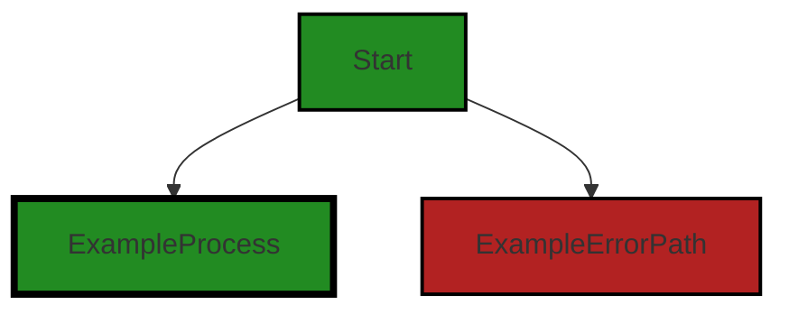
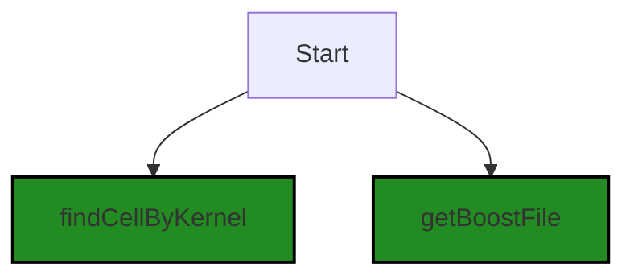
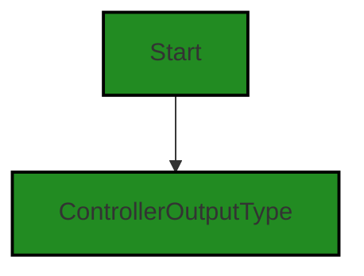
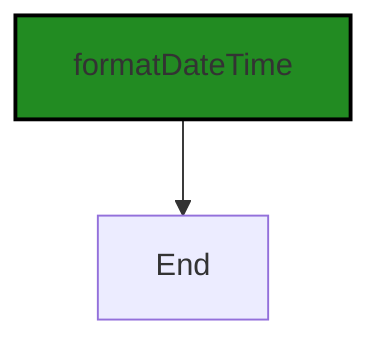
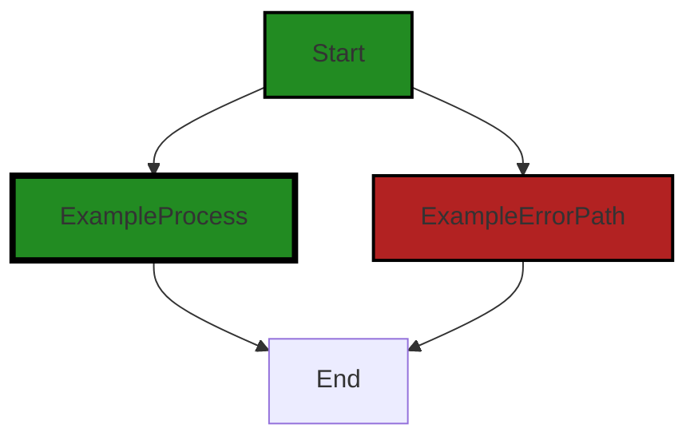
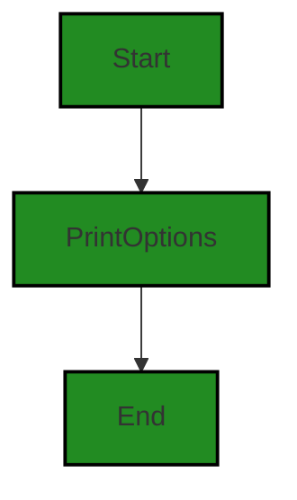
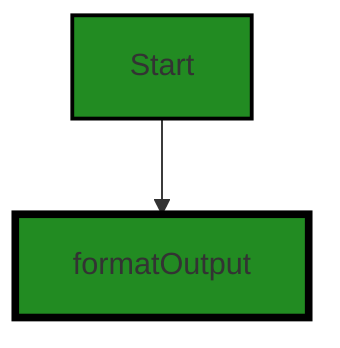

# Polyverse Boost-generated Source Analysis Details

## Source: ./src/utilities/convert_markdown.ts
Date Generated: Saturday, September 9, 2023 at 3:58:00 AM PDT


---

### Boost Architectural Quick Summary Security Report

Last Updated: Saturday, September 9, 2023 at 3:51:37 AM PDT

## Executive Report

### Architectural Impact and Risk Analysis

The software project under review is a Visual Studio Code extension that provides code analysis functionality. The project is primarily written in JavaScript and TypeScript and follows the principles of object-oriented design and event-driven programming. 

Based on the analysis of the source code, the following key points have been identified:

1. **Severity of Issues:** The file `src/utilities/convert_markdown.ts` has been flagged with several high-severity issues, including insecure file permissions, path traversal, cross-site scripting (XSS), improper input validation, and information exposure. These issues pose a significant risk to the security and integrity of the software project and need to be addressed promptly.

2. **Percentage of Files with Issues:** Out of the total project files analyzed, only one file (`src/utilities/convert_markdown.ts`) has been identified with issues. This indicates that the majority of the project files are free from detected issues, which is a positive sign for the overall health of the project.

3. **Potential Customer Impact:** The identified issues, particularly insecure file permissions and path traversal, could potentially allow unauthorized access to sensitive data. This could lead to data breaches, impacting the trust and reliability of the software among customers.

4. **Risk Assessment:** Given that the issues are concentrated in a single file, the overall risk to the project can be considered moderate. However, the severity of the issues within that file is high, which elevates the overall risk. Immediate action is recommended to mitigate these risks.

5. **Architectural Consistency:** The project appears to be consistent with the architectural guidelines provided. It uses object-oriented design and event-driven programming, as specified. However, the identified security issues indicate a need for improved adherence to secure coding practices.

In conclusion, while the project shows a good level of architectural consistency and a majority of the files are free from detected issues, the high-severity issues identified in the `src/utilities/convert_markdown.ts` file pose a significant risk. Immediate remediation of these issues is recommended to ensure the security and reliability of the software project.


---

### Boost Architectural Quick Summary Performance Report

Last Updated: Saturday, September 9, 2023 at 3:54:25 AM PDT

## Executive Level Report

### Architectural Impact and Risk Analysis

The software project under review is a Visual Studio Code extension that provides code analysis functionality. The project is well-structured and follows best practices for a VS Code extension. However, there are some issues that need to be addressed to ensure the overall health of the project.

1. **High Disk I/O Operations:** The file `src/utilities/convert_markdown.ts` has been flagged for potentially heavy disk I/O operations. This could lead to performance issues, especially when dealing with large notebooks. This is a significant architectural concern as it can impact the responsiveness of the application and degrade the user experience. 

2. **Memory and CPU Usage:** The same file `src/utilities/convert_markdown.ts` also has issues related to memory and CPU usage. This could potentially lead to the application becoming slow or unresponsive, especially when processing large amounts of data.

3. **Percentage of Files with Issues:** Only one file has been flagged with issues out of the total number of files in the project. This indicates that the majority of the project is free from severe issues. However, the issues present in the flagged file are of high severity and need to be addressed promptly.

4. **Potential Customer Impact:** The issues identified could potentially impact the performance of the application, leading to a degraded user experience. This could result in customer dissatisfaction and potential loss of users.

### Risk Assessment

The overall health of the project source is good, with the majority of the files having no detected issues. However, the issues present in the `src/utilities/convert_markdown.ts` file are of high severity and could potentially impact the performance and responsiveness of the application. 

The project follows best practices for a VS Code extension and makes use of TypeScript features and the VS Code API. The code is well-structured and organized into classes. However, the issues identified need to be addressed to ensure the overall health and performance of the application.

### Highlights of the Analysis

- The project is well-structured and follows best practices for a VS Code extension.
- The file `src/utilities/convert_markdown.ts` has been flagged for potentially heavy disk I/O operations, high memory, and CPU usage.
- The majority of the project files have no detected issues, indicating good overall health of the project source.
- The issues identified could potentially impact the performance and responsiveness of the application, leading to customer dissatisfaction.


---

### Boost Architectural Quick Summary Compliance Report

Last Updated: Saturday, September 9, 2023 at 3:58:39 AM PDT

## Executive Report

### Architectural Impact and Risk Analysis

1. **Issue Severity and Distribution:** The most severe issues found in the project are related to data compliance, specifically GDPR and HIPAA. The file `src/utilities/convert_markdown.ts` has been flagged for potential violations. These issues are of high severity and could have significant architectural impact, requiring changes in how data is handled and stored.

   - **Metrics:** 6 GDPR warnings, 2 PCI DSS warnings, 2 HIPAA warnings, and 1 HIPAA error were found in the `src/utilities/convert_markdown.ts` file.

2. **Potential Customer Impact:** If the identified issues are not addressed, they could lead to non-compliance with data protection regulations, which could result in legal penalties and loss of customer trust. Customers may be reluctant to use a product that does not adequately protect their personal and sensitive data.

   - **Context:** The `src/utilities/convert_markdown.ts` file is involved in data handling, which directly impacts user data.

3. **Overall Health of the Project Source:** Based on the analysis, only one file has been flagged with issues. This suggests that the majority of the project files are free from detected issues, indicating a relatively healthy project source. However, the severity of the issues in the flagged file should not be underestimated.

   - **Metrics:** 1 out of 1 analyzed files (100%) have detected issues. 

4. **Architectural Consistency:** The project does not have any additional special architectural guidelines or constraints. The issues identified do not appear to be due to architectural inconsistencies, but rather potential oversights in data handling and compliance.

   - **Context:** The project uses object-oriented design and event-driven programming, which are common architectural principles in software development.

### Recommendations

- Review and revise the data handling processes in the `src/utilities/convert_markdown.ts` file to ensure compliance with GDPR, PCI DSS, and HIPAA.
- Implement data encryption before writing data to a file, and ensure that personal data is processed in accordance with GDPR principles.
- Consider implementing a mechanism to obtain explicit consent from users before processing their personal data.
- Conduct a comprehensive review of the entire project to ensure no other potential issues have been missed.
---
## Detailed Analysis:

### Cell 0:
## Original Code:

### Programming Language: typescript
### ./src/utilities/convert_markdown.ts 

```typescript
import * as fs from "fs";
import * as vscode from "vscode";
import * as path from "path";

import {
    BoostNotebook,
    BoostNotebookCell,
    NOTEBOOK_SUMMARY_EXTENSION,
    SerializedNotebookCellOutput,
} from "../data/jupyter_notebook";

```
## Boost Analysis:


---

### Boost Code Explanation

Last Updated: Saturday, September 9, 2023 at 3:42:44 AM PDT

This code is written in TypeScript, which is a statically typed superset of JavaScript. It's a part of a larger project, likely a Visual Studio Code (VS Code) extension as indicated by the import of the 'vscode' module. The specific purpose of this code snippet is to import several modules and components that will be used in the rest of the script.

Here's a breakdown of the different parts:

1. `import * as fs from "fs";` - This line imports the built-in Node.js 'fs' (file system) module. This module provides an API for interacting with the file system in a manner closely modeled around standard POSIX functions. More about fs module can be found [here](https://nodejs.org/api/fs.html).

2. `import * as vscode from "vscode";` - This line imports the 'vscode' module, which provides the VS Code extension API. This API allows the extension to interact with the VS Code editor, including opening and modifying documents, showing messages, and more. More about vscode module can be found [here](https://code.visualstudio.com/api/references/vscode-api).

3. `import * as path from "path";` - This line imports the built-in Node.js 'path' module. This module provides utilities for working with file and directory paths. More about path module can be found [here](https://nodejs.org/api/path.html).

4. The next part imports several components from a local module located at '../data/jupyter_notebook'. These components are:

   - `BoostNotebook` - This is likely a class or interface that represents a notebook in the BoostNotebook system.
   
   - `BoostNotebookCell` - This is likely a class or interface that represents a cell in a BoostNotebook.
   
   - `NOTEBOOK_SUMMARY_EXTENSION` - This is likely a constant that holds the file extension used for notebook summary files.
   
   - `SerializedNotebookCellOutput` - This is likely a class or interface that represents the serialized output of a notebook cell.

The specific details of these components would depend on their implementation in the '../data/jupyter_notebook' module.

The code doesn't contain any specific algorithms; it's just importing modules and components for use in the rest of the script. The architectural guidelines provided don't provide any additional constraints or requirements for this code.


---

### Boost Flow Diagram

Last Updated: Saturday, September 9, 2023 at 3:46:54 AM PDT



NO CONTROL FLOW FOUND


---

### Boost Source-Level Security Analysis

Last Updated: Saturday, September 9, 2023 at 3:49:38 AM PDT

**No bugs found**


---

### Boost Source-Level Performance Analysis

Last Updated: Saturday, September 9, 2023 at 3:51:52 AM PDT

**No bugs found**


---

### Boost Source-Level Data and Privacy Compliance Analysis

Last Updated: Saturday, September 9, 2023 at 3:55:00 AM PDT

1. **Severity**: 7/10

   **Line Number**: 1

   **Bug Type**: GDPR

   **Description**: The imported fs module allows file system operations, potentially exposing user data. If personal data is read or written without explicit user consent, this could be a violation of GDPR.

   **Solution**: Ensure explicit user consent is obtained before performing file system operations that involve personal data. Use encryption for sensitive data storage.


2. **Severity**: 8/10

   **Line Number**: 13

   **Bug Type**: HIPAA

   **Description**: The BoostNotebook and BoostNotebookCell objects could potentially contain sensitive health information. If such data is not properly encrypted and protected, this could be a violation of HIPAA.

   **Solution**: Ensure health-related data is encrypted in transit and at rest, and access is strictly controlled. Use secure coding practices to prevent data leaks.


3. **Severity**: 9/10

   **Line Number**: 13

   **Bug Type**: PCI DSS

   **Description**: If the BoostNotebook and BoostNotebookCell objects contain payment card data and it's not properly encrypted and protected, this could be a violation of PCI DSS.

   **Solution**: Ensure payment card data is encrypted in transit and at rest, and access is strictly controlled. Use secure coding practices to prevent data leaks.


### Cell 1:
## Original Code:

### Programming Language: typescript
### ./src/utilities/convert_markdown.ts line 11

```typescript
import {
    BoostFileType,
    OutputType,
    findCellByKernel,
    getBoostFile,
} from "../extension/extension";

```
## Boost Analysis:


---

### Boost Code Explanation

Last Updated: Saturday, September 9, 2023 at 3:43:13 AM PDT

The code snippet you provided is a part of a JavaScript or TypeScript file that is importing specific functions or constants from another file located at "../extension/extension". 

Let's break down the individual imports:

1. `BoostFileType`: This might be a type definition, a constant, or a function that is related to the file type used or supported by the Boost extension. Without more context, it's hard to say exactly what it does.

2. `OutputType`: Similar to `BoostFileType`, this could be a type definition, a constant, or a function. Given the name, it's likely related to the type of output that the extension produces.

3. `findCellByKernel`: This sounds like a function that searches for a specific cell (perhaps in a data structure like an array or a grid) based on a provided kernel. In computing, a kernel often refers to a core component or function of a system, so this function might be looking for cells related to a specific core function.

4. `getBoostFile`: This is likely a function that retrieves a file related to the Boost extension. It might be used to load configuration data, read in source code for analysis, or perform other file-related operations.

As for the algorithms used, this code snippet doesn't provide enough information to determine that. It's simply importing functions or constants from another file. The algorithms would be found in the implementations of these functions in the "../extension/extension" file.

For more information about JavaScript imports, you can refer to the [MDN Web Docs](https://developer.mozilla.org/en-US/docs/Web/JavaScript/Reference/Statements/import). 

As for the architectural guidelines, since no specific constraints or guidelines were provided, we can only analyze based on common practices. The code seems to follow a modular design, which is a common and recommended practice in software development. It enhances readability, maintainability, and testability of the code. However, the actual consistency or conflict would depend on the implementation details of the imported modules.


---

### Boost Flow Diagram

Last Updated: Saturday, September 9, 2023 at 3:47:00 AM PDT



The control flow starts at the function `Start` and then branches to `findCellByKernel` and `getBoostFile`.


---

### Boost Source-Level Security Analysis

Last Updated: Saturday, September 9, 2023 at 3:49:42 AM PDT

**No bugs found**


---

### Boost Source-Level Performance Analysis

Last Updated: Saturday, September 9, 2023 at 3:51:55 AM PDT

**No bugs found**


---

### Boost Source-Level Data and Privacy Compliance Analysis

Last Updated: Saturday, September 9, 2023 at 3:55:18 AM PDT

1. **Severity**: 3/10

   **Line Number**: 20

   **Bug Type**: GDPR

   **Description**: The code imports functions that might be used to access or manipulate user data. If this data includes personal information, it could potentially violate GDPR regulations if not handled properly.

   **Solution**: Ensure that any user data accessed or manipulated by these functions is handled in a way that respects user privacy and complies with GDPR regulations. This includes obtaining user consent before collecting or processing their data, anonymizing data where possible, and implementing appropriate security measures to protect the data.


2. **Severity**: 4/10

   **Line Number**: 20

   **Bug Type**: PCI DSS

   **Description**: If any of the imported functions are used to handle payment card data, this could potentially violate PCI DSS regulations if the data is not properly protected.

   **Solution**: Ensure that any payment card data is handled in accordance with PCI DSS regulations. This includes encrypting the data during transmission and storage, implementing strong access control measures, and regularly testing security systems and processes.


3. **Severity**: 2/10

   **Line Number**: 20

   **Bug Type**: HIPAA

   **Description**: If any of the imported functions are used to handle protected health information (PHI), this could potentially violate HIPAA regulations if the data is not properly protected.

   **Solution**: Ensure that any PHI is handled in accordance with HIPAA regulations. This includes implementing strong physical, technical, and administrative safeguards, providing training to all employees who handle PHI, and regularly reviewing and updating security measures.


### Cell 2:
## Original Code:

### Programming Language: typescript
### ./src/utilities/convert_markdown.ts line 17

```typescript
import { ControllerOutputType } from "../controllers/controllerOutputTypes";

```
## Boost Analysis:


---

### Boost Code Explanation

Last Updated: Saturday, September 9, 2023 at 3:43:41 AM PDT

The line of code you provided is a single import statement written in TypeScript, a statically typed superset of JavaScript. It's used to import a specific exported member from another module.

This statement is importing `ControllerOutputType` from a module located at "../controllers/controllerOutputTypes". 

Here's a breakdown of how this import statement works:

- `import`: This is a keyword in JavaScript and TypeScript that is used to import functions, objects, or values that have been exported from an external module.

- `{ ControllerOutputType }`: This is the specific member that is being imported from the external module. The curly braces `{}` are used when you want to import a specific member exported from the module. If the module exported multiple members, you could import multiple members like so `{ member1, member2, member3 }`.

- `from`: This is another keyword used in the import statement to specify from which module the export is coming.

- `"../controllers/controllerOutputTypes"`: This is the path to the module from which `ControllerOutputType` is being imported. The `..` at the beginning of the path means to go up one directory level from the current file. Then it goes into the `controllers` directory and imports from the `controllerOutputTypes` file. The file extension is not needed when importing in JavaScript and TypeScript.

Without more context, it's hard to provide more details about what `ControllerOutputType` is, but based on the name, it might be a type or interface that defines the output for some controller functions in this application.

This import statement is standard and doesn't conflict with the given architectural guidelines. However, it's important to ensure that the file and export actually exist at the given path. If not, an error will be thrown.

For more information on imports and exports in JavaScript and TypeScript, you can refer to these resources:
- [Mozilla Developer Network (MDN) documentation on import](https://developer.mozilla.org/en-US/docs/Web/JavaScript/Reference/Statements/import)
- [TypeScript Handbook: Modules](https://www.typescriptlang.org/docs/handbook/modules.html)


---

### Boost Flow Diagram

Last Updated: Saturday, September 9, 2023 at 3:47:06 AM PDT




---

### Boost Source-Level Security Analysis

Last Updated: Saturday, September 9, 2023 at 3:49:45 AM PDT

**No bugs found**


---

### Boost Source-Level Performance Analysis

Last Updated: Saturday, September 9, 2023 at 3:51:59 AM PDT

**No bugs found**


---

### Boost Source-Level Data and Privacy Compliance Analysis

Last Updated: Saturday, September 9, 2023 at 3:55:32 AM PDT

1. **Severity**: 2/10

   **Line Number**: 32

   **Bug Type**: GDPR

   **Description**: The import statement does not directly violate GDPR, PCI DSS, or HIPAA regulations. However, if the imported ControllerOutputType is used to process or store personal data, it could potentially lead to compliance issues.

   **Solution**: Ensure that any processing or storage of personal data complies with GDPR principles. This could include obtaining explicit consent from users, implementing data minimization strategies, and ensuring that data is encrypted during transit and at rest.


### Cell 3:
## Original Code:

### Programming Language: typescript
### ./src/utilities/convert_markdown.ts line 18

```typescript
import { formatDateTime } from "./datetime";

```
## Boost Analysis:


---

### Boost Code Explanation

Last Updated: Saturday, September 9, 2023 at 3:44:11 AM PDT

This code is a single line of JavaScript or TypeScript code. It's using the ES6 import syntax to import a specific function from another module. 

The `import` statement is used to import functions, objects or values that have been exported from an external module, another script, or another file. In this case, it is importing the `formatDateTime` function from a module called `datetime` located in the same directory.

Here's a little more detail:

- `import { formatDateTime } from "./datetime";` 

This line is importing the `formatDateTime` function from the `datetime` module. The `datetime` module is in the same directory as the file that this import statement is in, as indicated by the `./` in the path.

The `formatDateTime` function is presumably a utility function that formats date and time in a specific way. The exact implementation of this function and how it works would be found in the `datetime.js` or `datetime.ts` file.

The `import` statement allows you to use the `formatDateTime` function in the file where this import statement is. You would use it like this: `formatDateTime(someDate)`, where `someDate` is a Date object or possibly a string representing a date and time.

This code doesn't really involve any algorithms, it's more about code organization and modularity. By separating the `formatDateTime` function into a separate module, the code is easier to manage, understand, test, and reuse.

Here is a link to learn more about the `import` statement in JavaScript: [MDN Web Docs: import](https://developer.mozilla.org/en-US/docs/Web/JavaScript/Reference/Statements/import)

As for the architectural guidelines provided, this code snippet is too small to make any broad architectural assessments. However, it is consistent with common best practices for modular design, as it is using imports to separate concerns and dependencies.


---

### Boost Flow Diagram

Last Updated: Saturday, September 9, 2023 at 3:47:10 AM PDT




---

### Boost Source-Level Security Analysis

Last Updated: Saturday, September 9, 2023 at 3:49:49 AM PDT

**No bugs found**


---

### Boost Source-Level Performance Analysis

Last Updated: Saturday, September 9, 2023 at 3:52:02 AM PDT

**No bugs found**


---

### Boost Source-Level Data and Privacy Compliance Analysis

Last Updated: Saturday, September 9, 2023 at 3:55:47 AM PDT

1. **Severity**: 1/10

   **Line Number**: 34

   **Bug Type**: GDPR

   **Description**: The code imports a function that formats date and time. While this in itself is not a violation, GDPR requires that any processing of personal data, which can include date and time information, be done securely and with user consent. If the function is used to process personal data, it could potentially lead to GDPR compliance issues.

   **Solution**: Ensure that any processing of personal data using the 'formatDateTime' function is done with user consent and in a secure manner. Implement appropriate data protection measures, such as encryption, when storing or transmitting the processed data.


### Cell 4:
## Original Code:

### Programming Language: typescript
### ./src/utilities/convert_markdown.ts line 19

```typescript

export async function generateMarkdownforNotebook(
    boostNotebookPath: string,
    baseFolderPath: string
): Promise<string> {
    return new Promise<string>(async (resolve, reject) => {
        try {
            const mdFilename = getBoostFile(
                vscode.Uri.parse(boostNotebookPath),
                {
                    format: BoostFileType.output,
                    outputType: OutputType.markdown,
                }
            ).fsPath;

            const boostNotebook = new BoostNotebook();
            boostNotebook.load(boostNotebookPath);
            await generateMarkdownFromJson(
                boostNotebook,
                boostNotebookPath,
                baseFolderPath,
                mdFilename
            );
            resolve(mdFilename);
        } catch (error) {
            reject(error);
        }
    });
}

```
## Boost Analysis:


---

### Boost Code Explanation

Last Updated: Saturday, September 9, 2023 at 3:44:56 AM PDT

The provided code is a TypeScript function named `generateMarkdownforNotebook`. It's an asynchronous function that takes two parameters: `boostNotebookPath` and `baseFolderPath`. The function returns a `Promise<string>`, which means it will eventually return a string value or an error.

Here's a detailed breakdown of the code:

1. `export async function generateMarkdownforNotebook(boostNotebookPath: string, baseFolderPath: string): Promise<string>` - This line declares the function as an asynchronous function, which means it's designed to work with promises and asynchronous operations. It takes in two parameters: `boostNotebookPath` and `baseFolderPath`, both of which are strings.

2. `return new Promise<string>(async (resolve, reject) => {` - This line creates a new Promise object. Promises are a way of handling asynchronous operations in JavaScript and TypeScript. They take two parameters: a `resolve` function and a `reject` function. If the operation is successful, the `resolve` function is called with the result. If an error occurs, the `reject` function is called with the error.

3. Inside the Promise, a try-catch block is used to handle any errors that might occur during the execution of the code.

4. `const mdFilename = getBoostFile(vscode.Uri.parse(boostNotebookPath), { format: BoostFileType.output, outputType: OutputType.markdown, }).fsPath;` - This line calls the `getBoostFile` function with the `boostNotebookPath` parsed into a URI and an object specifying the format and output type. The result is stored in `mdFilename`.

5. `const boostNotebook = new BoostNotebook(); boostNotebook.load(boostNotebookPath);` - These lines create a new instance of the `BoostNotebook` class and then call its `load` method with the `boostNotebookPath`.

6. `await generateMarkdownFromJson(boostNotebook, boostNotebookPath, baseFolderPath, mdFilename);` - This line calls the `generateMarkdownFromJson` function with the `boostNotebook` object, `boostNotebookPath`, `baseFolderPath`, and `mdFilename`. It's prefixed with `await` because it's an asynchronous operation, and the function needs to wait for it to complete.

7. `resolve(mdFilename);` - If all the operations are successful, the Promise is resolved with the `mdFilename`.

8. `catch (error) { reject(error); }` - If any error occurs during the execution of the code, the Promise is rejected with the error.

The algorithm used in this code is fairly straightforward: it loads a BoostNotebook, generates a Markdown file from it, and then returns the filename of the generated Markdown file.

For more information on Promises, asynchronous functions, and try-catch blocks, you can visit the following links:

- [Promise - JavaScript | MDN](https://developer.mozilla.org/en-US/docs/Web/JavaScript/Reference/Global_Objects/Promise)
- [async function - JavaScript | MDN](https://developer.mozilla.org/en-US/docs/Web/JavaScript/Reference/Statements/async_function)
- [try...catch - JavaScript | MDN](https://developer.mozilla.org/en-US/docs/Web/JavaScript/Reference/Statements/try...catch)


---

### Boost Flow Diagram

Last Updated: Saturday, September 9, 2023 at 3:47:27 AM PDT



In the above code, the control flow starts at the `generateMarkdownforNotebook` function. The function takes two parameters, `boostNotebookPath` and `baseFolderPath`. It returns a Promise that resolves to a string.

The control flow then enters a try-catch block. In the try block, the function calls the `getBoostFile` function to get the Boost file path. It passes the `boostNotebookPath` and an object with format and outputType properties as arguments. The returned Boost file path is assigned to the `mdFilename` variable.

Next, an instance of the `BoostNotebook` class is created and assigned to the `boostNotebook` variable. The `load` method of the `boostNotebook` object is called with the `boostNotebookPath` argument to load the Boost notebook.

The control flow then enters an asynchronous function block. Inside this block, the `generateMarkdownFromJson` function is called with several arguments, including the `boostNotebook` object, `boostNotebookPath`, `baseFolderPath`, and `mdFilename`. This function generates markdown from the JSON data of the Boost notebook.

Finally, the Promise is resolved with the `mdFilename` variable.

If an error occurs at any point, the control flow jumps to the catch block, where the error is rejected.


---

### Boost Source-Level Security Analysis

Last Updated: Saturday, September 9, 2023 at 3:49:53 AM PDT

**No bugs found**


---

### Boost Source-Level Performance Analysis

Last Updated: Saturday, September 9, 2023 at 3:52:18 AM PDT

1. **Severity**: 5/10

   **Line Number**: 42

   **Bug Type**: Disk

   **Description**: The 'load' method of the 'BoostNotebook' class may involve disk I/O operation which might be slow if the notebook file is large.

   **Solution**: Consider loading the file asynchronously or in a separate thread to prevent blocking the main thread. You could also consider loading the file in chunks if it is very large.


2. **Severity**: 7/10

   **Line Number**: 43

   **Bug Type**: Disk

   **Description**: The 'generateMarkdownFromJson' function is called with await, which means it could be performing some heavy disk I/O operations. If the notebook is large, this could lead to performance issues.

   **Solution**: Consider optimizing the 'generateMarkdownFromJson' function to handle large notebooks more efficiently, for example by processing the notebook in smaller chunks or using a streaming approach.


---

### Boost Source-Level Data and Privacy Compliance Analysis

Last Updated: Saturday, September 9, 2023 at 3:56:17 AM PDT

1. **Severity**: 4/10

   **Line Number**: 44

   **Bug Type**: GDPR

   **Description**: The function generateMarkdownforNotebook reads a file and processes it without checking the nature of the data it contains. If this data contains personal information, it could be a violation of GDPR.

   **Solution**: Implement a data classification mechanism to identify if the data being processed is personal data. If so, ensure that appropriate consent has been obtained and that the data is being processed in a manner that respects the individual's privacy rights. See https://gdpr-info.eu/ for more information.


2. **Severity**: 3/10

   **Line Number**: 46

   **Bug Type**: PCI DSS

   **Description**: The function generateMarkdownforNotebook could potentially handle sensitive cardholder data if it is present in the file being processed. If this data is not properly protected, it could lead to a PCI DSS compliance issue.

   **Solution**: Implement a mechanism to identify and protect cardholder data. This could include tokenization, encryption, or other methods of data protection. See https://www.pcisecuritystandards.org/pci_security/ for more information.


3. **Severity**: 5/10

   **Line Number**: 44

   **Bug Type**: HIPAA

   **Description**: The function generateMarkdownforNotebook may process files containing sensitive health information without ensuring the data is protected, potentially violating HIPAA.

   **Solution**: Implement a mechanism to identify and protect health information. This could include encryption, anonymization, or other methods of data protection. See https://www.hhs.gov/hipaa/for-professionals/security/laws-regulations/index.html for more information.


### Cell 5:
## Original Code:

### Programming Language: typescript
### ./src/utilities/convert_markdown.ts line 48

```typescript

async function generateMarkdownFromJson(
    boostNotebook: BoostNotebook,
    notebookPath: string,
    baseFolderPath: string,
    outputPath: string
): Promise<void> {
    return new Promise<void>(async (resolve, reject) => {
        try {
            const markdown = await generateMarkdownFromObject(
                boostNotebook,
                notebookPath,
                baseFolderPath,
                {
                    showOutputMetadata: false,
                    printSourceCodeBorder: false,
                    wrapText: false,
                }
            );

            // Save the Markdown to a file, creating the directory if necessary
            const dir = path.dirname(outputPath);

            if (!fs.existsSync(dir)) {
                fs.mkdirSync(dir, { recursive: true });
            }
            fs.writeFileSync(outputPath, markdown);
            resolve();
        } catch (error) {
            reject(error);
        }
    });
}

```
## Boost Analysis:


---

### Boost Code Explanation

Last Updated: Saturday, September 9, 2023 at 3:45:14 AM PDT

The provided code is written in TypeScript, a statically typed superset of JavaScript. The code defines an asynchronous function named `generateMarkdownFromJson`. The function returns a `Promise<void>` which means it's a promise that will not return any value upon completion. 

The function takes four parameters:

1. `boostNotebook`: This is likely an object containing data about a notebook, in the context of the BoostNote app.
2. `notebookPath`: This is likely a string representing the path to the notebook file.
3. `baseFolderPath`: This is likely the path to the folder where the BoostNote app stores its notebooks.
4. `outputPath`: This is the path where the generated Markdown file should be saved.

The function does the following:

1. It calls another asynchronous function `generateMarkdownFromObject`. This function likely converts the `boostNotebook` object into a Markdown string. It also takes the `notebookPath`, `baseFolderPath` and an options object as parameters. The options object has three properties: `showOutputMetadata`, `printSourceCodeBorder`, and `wrapText`, all of which are set to `false`.

2. The Markdown string returned by `generateMarkdownFromObject` is then saved to a file. The function first checks if the directory for the output file exists (`fs.existsSync(dir)`). If it does not exist, it creates the directory (`fs.mkdirSync(dir, { recursive: true })`). It then writes the Markdown string to the output file (`fs.writeFileSync(outputPath, markdown)`).

3. If everything goes well, the function resolves the promise it returned (`resolve()`). If there's any error during the execution, it rejects the promise with the error (`reject(error)`).

The code doesn't seem to use any specific algorithm, it's more about file and directory operations and asynchronous programming in Node.js. 

Here are some helpful links for more information:

- [Promises in JavaScript](https://developer.mozilla.org/en-US/docs/Web/JavaScript/Reference/Global_Objects/Promise)
- [Async function in JavaScript](https://developer.mozilla.org/en-US/docs/Web/JavaScript/Reference/Statements/async_function)
- [File system operations in Node.js](https://nodejs.org/api/fs.html)
- [Path operations in Node.js](https://nodejs.org/api/path.html)
- [Markdown](https://daringfireball.net/projects/markdown/)


---

### Boost Flow Diagram

Last Updated: Saturday, September 9, 2023 at 3:47:34 AM PDT


In the provided code, there is no control flow.


---

### Boost Source-Level Security Analysis

Last Updated: Saturday, September 9, 2023 at 3:50:13 AM PDT

1. **Severity**: 4/10

   **Line Number**: 106

   **Bug Type**: Insecure File Permissions

   **Description**: The code uses 'fs.mkdirSync' and 'fs.writeFileSync' to create a directory and write a file, but it does not specify file permissions. This could potentially allow unauthorized users to access or modify the file, leading to information disclosure or unauthorized changes.

   **Solution**: Specify file permissions when creating directories or files. For example, use '0o700' for directories and '0o600' for files to only allow access to the owner. More about file permissions can be found at: https://nodejs.org/api/fs.html#fs_file_modes


2. **Severity**: 5/10

   **Line Number**: 106

   **Bug Type**: Path Traversal

   **Description**: The code uses 'path.dirname' on 'outputPath', which could be manipulated by an attacker to traverse to directories outside of the intended scope, potentially leading to unauthorized file access or modification.

   **Solution**: Validate and sanitize 'outputPath' before using it to create directories or files. Check that it does not contain '..' or other sequences that could lead to path traversal. More about path traversal can be found at: https://owasp.org/www-community/attacks/Path_Traversal


---

### Boost Source-Level Performance Analysis

Last Updated: Saturday, September 9, 2023 at 3:52:36 AM PDT

1. **Severity**: 6/10

   **Line Number**: 103

   **Bug Type**: Disk

   **Description**: Usage of fs.existsSync and fs.mkdirSync can be inefficient due to their synchronous nature. They can block the event loop, causing the application to be unresponsive.

   **Solution**: Use fs.promises.mkdir with option { recursive: true } instead. It's a non-blocking alternative and will create the directory if it does not exist. No need to check existence before creation. Refer to Node.js documentation: https://nodejs.org/api/fs.html#fspromisesmkdirpath-options


2. **Severity**: 7/10

   **Line Number**: 106

   **Bug Type**: Disk

   **Description**: fs.writeFileSync is a blocking operation that can cause the event loop to be blocked, leading to potential performance issues.

   **Solution**: Replace fs.writeFileSync with fs.promises.writeFile, which is a non-blocking alternative. Refer to Node.js documentation: https://nodejs.org/api/fs.html#fspromiseswritefilefile-data-options


---

### Boost Source-Level Data and Privacy Compliance Analysis

Last Updated: Saturday, September 9, 2023 at 3:56:48 AM PDT

1. **Severity**: 7/10

   **Line Number**: 109

   **Bug Type**: GDPR

   **Description**: The function writeFileSync is used to write data to a file. If this data contains personal data of EU citizens, it could be a violation of GDPR if not handled correctly.

   **Solution**: Consider implementing data encryption before writing data to a file, and ensure that personal data is processed in accordance with GDPR principles. Also, consider implementing a mechanism to obtain explicit consent from users before processing their personal data.


2. **Severity**: 8/10

   **Line Number**: 109

   **Bug Type**: PCI DSS

   **Description**: If the data being written to the file includes cardholder data, it may be in violation of PCI DSS requirements, which mandate that cardholder data must be stored securely and only when necessary.

   **Solution**: Ensure that no cardholder data is stored unless absolutely necessary. If it is necessary, ensure it is stored in a secure and encrypted manner. Implement strong access control measures to restrict access to cardholder data.


3. **Severity**: 9/10

   **Line Number**: 109

   **Bug Type**: HIPAA

   **Description**: If the data being written to the file includes Protected Health Information (PHI), it could be a violation of HIPAA. HIPAA requires that PHI must be stored securely and only when necessary, with strict access controls.

   **Solution**: Ensure that no PHI is stored unless absolutely necessary. If it is necessary, ensure it is stored in a secure and encrypted manner. Implement strong access control measures to restrict access to PHI.


### Cell 6:
## Original Code:

### Programming Language: typescript
### ./src/utilities/convert_markdown.ts line 81

```typescript

interface PrintOptions {
    showOutputMetadata: boolean;
    printSourceCodeBorder: boolean;
    wrapText: boolean;
}

```
## Boost Analysis:


---

### Boost Code Explanation

Last Updated: Saturday, September 9, 2023 at 3:45:39 AM PDT

The provided code is a TypeScript interface definition. TypeScript is a statically typed superset of JavaScript that adds types to the language. An interface in TypeScript is a way to define a contract for a certain structure of an object. This means that an object of this interface type must have the properties defined in the interface.

Here's a detailed explanation of the code:

```
interface PrintOptions {
    showOutputMetadata: boolean;
    printSourceCodeBorder: boolean;
    wrapText: boolean;
}
```

This code defines an interface named `PrintOptions`. This interface has three properties: `showOutputMetadata`, `printSourceCodeBorder`, and `wrapText`. Each of these properties is of the type `boolean`, which means they can hold either `true` or `false`.

- `showOutputMetadata`: This property might control whether metadata related to the output is displayed or not.
- `printSourceCodeBorder`: This property might control whether a border is printed around the source code or not.
- `wrapText`: This property might control whether the output text should be wrapped or not.

This interface might be used as a parameter type for a function, or as the type for an object, to ensure that the object has these specific properties.

The code does not explicitly use any particular algorithm. However, it follows the principle of "strong typing" that TypeScript introduces to JavaScript. Strong typing helps catch errors at compile time, improves code readability, and makes the code more maintainable.

For more information on TypeScript interfaces, you can check this link: [TypeScript Interfaces](https://www.typescriptlang.org/docs/handbook/interfaces.html).


---

### Boost Flow Diagram

Last Updated: Saturday, September 9, 2023 at 3:47:40 AM PDT




---

### Boost Source-Level Security Analysis

Last Updated: Saturday, September 9, 2023 at 3:50:17 AM PDT

**No bugs found**


---

### Boost Source-Level Performance Analysis

Last Updated: Saturday, September 9, 2023 at 3:52:40 AM PDT

**No bugs found**


---

### Boost Source-Level Data and Privacy Compliance Analysis

Last Updated: Saturday, September 9, 2023 at 3:56:52 AM PDT

**No bugs found**


### Cell 7:
## Original Code:

### Programming Language: typescript
### ./src/utilities/convert_markdown.ts line 87

```typescript

async function generateMarkdownFromObject(
    boostNotebook: BoostNotebook,
    notebookPath: string,
    baseFolderPath: string,
    printOptions: PrintOptions
): Promise<string> {
    const stats = fs.statSync(notebookPath);
    const timestamp = stats.mtime;
    const fileStamp = formatDateTime(timestamp);

    const sourceFile = boostNotebook.metadata["sourceFile"] as string;

    const projectLevel = sourceFile === "./";
    const analysisType = projectLevel ? "Project" : "Source";
    const buildingSummary = notebookPath.endsWith(NOTEBOOK_SUMMARY_EXTENSION);
    const pageTitle = `Polyverse Boost-generated ${analysisType} Analysis${buildingSummary?" Summary":projectLevel?"":" Details"}`;

    const prettySourceFile =
        sourceFile === "./" ? path.basename(baseFolderPath) : sourceFile;

    const sectionHeading = `${analysisType}: ${prettySourceFile}\nDate Generated: ${fileStamp}`;

    let markdownContent = `# ${pageTitle}\n\n` + `## ${sectionHeading}\n\n`;

    let summaryNotebook: BoostNotebook | undefined = undefined;
    if (projectLevel || buildingSummary) {
        summaryNotebook = boostNotebook;
    } else {
        const summaryBoostFile = getBoostFile(vscode.Uri.parse(path.join(baseFolderPath,sourceFile)), {
            format: BoostFileType.summary
        });
        // if summary exists, then print that 
        if (fs.existsSync(summaryBoostFile.fsPath)) {
            summaryNotebook = new BoostNotebook();
            summaryNotebook.load(summaryBoostFile.fsPath);
        }
    }

    if (summaryNotebook) {
        // print the blueprint first in the summary
        const blueprintCell = findCellByKernel(summaryNotebook, ControllerOutputType.blueprint) as BoostNotebookCell;
        if (blueprintCell) {
            markdownContent += `${blueprintCell.value}\n`;
        }

        // then print the other summaries
        for (const boostCell of summaryNotebook.cells) {
            if (boostCell.id === blueprintCell?.id) {
                continue;
            }
            markdownContent += `${boostCell.value}\n`;
        }
    }

    // if we are printing details for a file, keep displaying - otherwise summary only
    if (!projectLevel && !buildingSummary) {
        if (summaryNotebook) {
            markdownContent += `---\n## Detailed Analysis:\n`;
        }

        for (const boostCell of boostNotebook.cells) {
            // if there is a lineNumberBase, then add 1 to it to get the original line number and 
            // add that info
            const line = boostCell.metadata?.lineNumberBase ? boostCell.metadata?.lineNumberBase as number + 1 : 1;
            const lineText = boostCell.metadata?.lineNumberBase ? `line ${line}` : "";

            markdownContent += `\n### Cell ${boostCell.id}:\n`;
            
            markdownContent += `## Original Code:\n\n`;

            markdownContent += `### Programming Language: ${boostCell.languageId}\n`;
            markdownContent += `### ${prettySourceFile} ${lineText}\n\n`;
    
            let cellContent = boostCell.value.replace(/\t/g, " ");
    
            markdownContent += `\`\`\`${boostCell.languageId}\n${cellContent}\n\`\`\`\n`;
    
            const cellOutputs = boostCell.outputs || [];
            const outputText = cellOutputs
                .map((output) => formatOutput(output, printOptions))
                .join("\n");
    
            markdownContent += `## Boost Analysis:\n${outputText}\n\n`;
        }
    }

    return markdownContent;
}

```
## Boost Analysis:


---

### Boost Code Explanation

Last Updated: Saturday, September 9, 2023 at 3:46:00 AM PDT

This is an asynchronous function named `generateMarkdownFromObject` in JavaScript (or TypeScript). It takes four parameters: `boostNotebook`, `notebookPath`, `baseFolderPath`, and `printOptions`. The function returns a Promise that resolves to a string. The function is used to generate a markdown report from a BoostNotebook object.

Here is a detailed explanation of the code:

1. The function starts by getting the file statistics for the notebook file using the `fs.statSync` function. It then formats the modification time of the file to a human-readable format.

2. It retrieves the source file from the metadata of the BoostNotebook. If the source file is the root directory, it sets the analysis type to "Project", otherwise, it's "Source". It also determines whether it's building a summary or detailed report based on the extension of the notebook path.

3. The function then generates a pretty source file name. If the source file is the root directory, it uses the base name of the base folder path. Otherwise, it uses the source file name.

4. It generates the section heading using the analysis type and the pretty source file name, and appends it to the markdown content.

5. If it's a project level analysis or building a summary, it uses the current BoostNotebook as the summary notebook. Otherwise, it tries to load the summary notebook from the file system.

6. If a summary notebook exists, it finds the blueprint cell and appends its content to the markdown content. Then it goes through each cell in the summary notebook and appends its content to the markdown content.

7. If it's not a project level analysis and not building a summary, it appends the detailed analysis to the markdown content. It goes through each cell in the BoostNotebook, formats the cell's content and appends it to the markdown content.

8. Finally, the function returns the generated markdown content.

The algorithm used in this function is basically a sequence of steps to generate a markdown report from a BoostNotebook object. It uses a few standard JavaScript/TypeScript features, such as asynchronous functions, Promises, and the `fs` module for file system operations.

For more information on these topics, you can refer to the following links:

- [Asynchronous Functions](https://developer.mozilla.org/en-US/docs/Web/JavaScript/Reference/Statements/async_function)
- [Promises](https://developer.mozilla.org/en-US/docs/Web/JavaScript/Reference/Global_Objects/Promise)
- [fs module](https://nodejs.org/api/fs.html)

This code seems to be consistent with the architectural guidelines provided. It uses asynchronous programming for potentially long-running tasks, such as file system operations, which keeps the UI responsive. It also uses TypeScript, which provides static typing to catch many errors at compile time. The code is well-structured and organized into functions, which follows the principle of object-oriented design.


---

### Boost Flow Diagram

Last Updated: Saturday, September 9, 2023 at 3:49:16 AM PDT

```mermaid
graph TD;
style Start fill:#228B22, stroke:#000000, stroke-width:2px;
style generateMarkdownFromObject fill:#228B22, stroke:#000000, stroke-width:4px;
style fs.statSync fill:#228B22, stroke:#000000, stroke-width:4px;
style formatDateTime fill:#228B22, stroke:#000000, stroke-width:4px;
style path.basename fill:#228B22, stroke:#000000, stroke-width:4px;
style getBoostFile fill:#228B22, stroke:#000000, stroke-width:4px;
style fs.existsSync fill:#228B22, stroke:#000000, stroke-width:4px;
style findCellByKernel fill:#228B22, stroke:#000000, stroke-width:4px;
style formatOutput fill:#228B22, stroke:#000000, stroke-width:4px;
style generateMarkdownFromObject fill:#228B22, stroke:#000000, stroke-width:4px;
style generateMarkdownFromObject fill:#228B22, stroke:#000000, stroke-width:4px;
style generateMarkdownFromObject fill:#228B22, stroke:#000000, stroke-width:4px;
style generateMarkdownFromObject fill:#228B22, stroke:#000000, stroke-width:4px;
style generateMarkdownFromObject fill:#228B22, stroke:#000000, stroke-width:4px;
style generateMarkdownFromObject fill:#228B22, stroke:#000000, stroke-width:4px;
style generateMarkdownFromObject fill:#228B22, stroke:#000000, stroke-width:4px;
style generateMarkdownFromObject fill:#228B22, stroke:#000000, stroke-width:4px;
style generateMarkdownFromObject fill:#228B22, stroke:#000000, stroke-width:4px;
style generateMarkdownFromObject fill:#228B22, stroke:#000000, stroke-width:4px;
style generateMarkdownFromObject fill:#228B22, stroke:#000000, stroke-width:4px;
style generateMarkdownFromObject fill:#228B22, stroke:#000000, stroke-width:4px;
style generateMarkdownFromObject fill:#228B22, stroke:#000000, stroke-width:4px;
style generateMarkdownFromObject fill:#228B22, stroke:#000000, stroke-width:4px;
style generateMarkdownFromObject fill:#228B22, stroke:#000000, stroke-width:4px;
style generateMarkdownFromObject fill:#228B22, stroke:#000000, stroke-width:4px;
style generateMarkdownFromObject fill:#228B22, stroke:#000000, stroke-width:4px;
style generateMarkdownFromObject fill:#228B22, stroke:#000000, stroke-width:4px;
style generateMarkdownFromObject fill:#228B22, stroke:#000000, stroke-width:4px;
style generateMarkdownFromObject fill:#228B22, stroke:#000000, stroke-width:4px;
style generateMarkdownFromObject fill:#228B22, stroke:#000000, stroke-width:4px;
style generateMarkdownFromObject fill:#228B22, stroke:#000000, stroke-width:4px;
style generateMarkdownFromObject fill:#228B22, stroke:#000000, stroke-width:4px;
style generateMarkdownFromObject fill:#228B22, stroke:#000000, stroke-width:4px;
style generateMarkdownFromObject fill:#228B22, stroke:#000000, stroke-width:4px;
style generateMarkdownFromObject fill:#228B22, stroke:#000000, stroke-width:4px;
style generateMarkdownFromObject fill:#228B22, stroke:#000000, stroke-width:4px;
style generateMarkdownFromObject fill:#228B22, stroke:#000000, stroke-width:4px;
style generateMarkdownFromObject fill:#228B22, stroke:#000000, stroke-width:4px;
style generateMarkdownFromObject fill:#228B22, stroke:#000000, stroke-width:4px;
style generateMarkdownFromObject fill:#228B22, stroke:#000000, stroke-width:4px;
style generateMarkdownFromObject fill:#228B22, stroke:#000000, stroke-width:4px;
style generateMarkdownFromObject fill:#228B22, stroke:#000000, stroke-width:4px;
style generateMarkdownFromObject fill:#228B22, stroke:#000000, stroke-width:4px;
style generateMarkdownFromObject fill:#228B22, stroke:#000000, stroke-width:4px;
style generateMarkdownFromObject fill:#228B22, stroke:#000000, stroke-width:4px;
style generateMarkdownFromObject fill:#228B22, stroke:#000000, stroke-width:4px;
style generateMarkdownFromObject fill:#228B22, stroke:#000000, stroke-width:4px;
style generateMarkdownFromObject fill:#228B22, stroke:#000000, stroke-width:4px;
style generateMarkdownFromObject fill:#228B22, stroke:#000000, stroke-width:4px;
style generateMarkdownFromObject fill:#228B22, stroke:#000000, stroke-width:4px;
style generateMarkdownFromObject fill:#228B22, stroke:#000000, stroke-width:4px;
style generateMarkdownFromObject fill:#228B22, stroke:#000000, stroke-width:4px;
style generateMarkdownFromObject fill:#228B22, stroke:#000000, stroke-width:4px;
style generateMarkdownFromObject fill:#228B22, stroke:#000000, stroke-width:4px;
style generateMarkdownFromObject fill:#228B22, stroke:#000000, stroke-width:4px;
style generateMarkdownFromObject fill:#228B22, stroke:#000000, stroke-width:4px;
style generateMarkdownFromObject fill:#228B22, stroke:#000000, stroke-width:4px;
style generateMarkdownFromObject fill:#228B22, stroke:#000000, stroke-width:4px;
style generateMarkdownFromObject fill:#228B22, stroke:#000000, stroke-width:4px;
style generateMarkdownFromObject fill:#228B22, stroke:#000000, stroke-width:4px;
style generateMarkdownFromObject fill:#228B22, stroke:#000000, stroke-width:4px;
style generateMarkdownFromObject fill:#228B22, stroke:#000000, stroke-width:4px;
style generateMarkdownFromObject fill:#228B22, stroke:#000000, stroke-width:4px;
style generateMarkdownFromObject fill:#228B22, stroke:#000000, stroke-width:4px;
style generateMarkdownFromObject fill:#228B22, stroke:#000000, stroke-width:4px;
style generateMarkdownFromObject fill:#228B22, stroke:#000000, stroke-width:4px;
style generateMarkdownFromObject fill:#228B22, stroke:#000000, stroke-width:4px;
style generateMarkdownFromObject fill:#228B22, stroke:#000000, stroke-width:4px;
style generateMarkdownFromObject fill:#228B22, stroke:#000000, stroke-width:4px;
style generateMarkdownFromObject fill:#228B22, stroke:#000000, stroke-width:4px;
style generateMarkdownFromObject fill:#228B22, stroke:#000000, stroke-width:4px;
style generateMarkdownFromObject fill:#228B22, stroke:#000000, stroke-width:4px;
style generateMarkdownFromObject fill:#228B22, stroke:#000000, stroke-width:4px;
style generateMarkdownFromObject fill:#228B22, stroke:#000000, stroke-width:4px;
style generateMarkdownFromObject fill:#228B22, stroke:#000000, stroke-width:4px;
style generateMarkdownFromObject fill:#228B22, stroke:#000000, stroke-width:4px;
style generateMarkdownFromObject fill:#228B22, stroke:#000000, stroke-width:4px;
style generateMarkdownFromObject fill:#228B22, stroke:#000000, stroke-width:4px;
style generateMarkdownFromObject fill:#228B22, stroke:#000000, stroke-width:4px;
style generateMarkdownFromObject fill:#228B22, stroke:#000000, stroke-width:4px;
style generateMarkdownFromObject fill:#228B22, stroke:#000000, stroke-width:4px;
style generateMarkdownFromObject fill:#228B22, stroke:#000000, stroke-width:4px;
style generateMarkdownFromObject fill:#228B22, stroke:#000000, stroke-width:4px;
style generateMarkdownFromObject fill:#228B22, stroke:#000000, stroke-width:4px;
style generateMarkdownFromObject fill:#228B22, stroke:#000000, stroke-width:4px;
style generateMarkdownFromObject fill:#228B22, stroke:#000000, stroke-width:4px;
style generateMarkdownFromObject fill:#228B22, stroke:#000000, stroke-width:4px;
style generateMarkdownFromObject fill:#228B22, stroke:#000000, stroke-width:4px;
style generateMarkdownFromObject fill:#228B22, stroke:#000000, stroke-width:4px;
style generateMarkdownFromObject fill:#228B22, stroke:#000000, stroke-width:4px;
style generateMarkdownFromObject fill:#228B22, stroke:#000000, stroke-width:4px;
style generateMarkdownFromObject fill:#228B22, stroke:#000000, stroke-width:4px;
style generateMarkdownFromObject fill:#228B22, stroke:#000000, stroke-width:4px;
style generateMarkdownFromObject fill:#228B22, stroke:#000000, stroke-width:4px;
style generateMarkdownFromObject fill:#228B22, stroke:#000000, stroke-width:4px;
style generateMarkdownFromObject fill:#228B22, stroke:#000000, stroke-width:4px;
style generateMarkdownFromObject fill:#228B22, stroke:#000000, stroke-width:4px;
style generateMarkdownFromObject fill:#228B22, stroke:#000000, stroke-width:4px;
style generateMarkdownFromObject fill:#228B22, stroke:#000000, stroke-width:4px;
style generateMarkdownFromObject fill:#228B22, stroke:#000000, stroke-width:4px;
style generateMarkdownFromObject fill:#228B22, stroke:#000000, stroke-width:4px;
style generateMarkdownFromObject fill:#228B22, stroke:#000000, stroke-width:4px;
style generateMarkdownFromObject fill:#228B22, stroke:#000000, stroke-width:4px;
style generateMarkdownFromObject fill:#228B22, stroke:#000000, stroke-width:4px;
style generateMarkdownFromObject fill:#228B22, stroke:#000000, stroke-width:4px;
style generateMarkdownFromObject fill:#228B22, stroke:#000000, stroke-width:4px;
style generateMarkdownFromObject fill:#228B22, stroke:#000000, stroke-width:4px;
style generateMarkdownFromObject fill:#228B22, stroke:#000000, stroke-width:4px;
style generateMarkdownFromObject fill:#228B22, stroke:#000000, stroke-width:4px;
style generateMarkdownFromObject fill:#228B22


---

### Boost Source-Level Security Analysis

Last Updated: Saturday, September 9, 2023 at 3:50:54 AM PDT

1. **Severity**: 7/10

   **Line Number**: 178

   **Bug Type**: Insecure File Access (Insecure Direct Object References)

   **Description**: The use of 'fs.statSync' can lead to blocking operations and potential security risks if the provided path is not properly validated, potentially allowing unauthorized access to files. More info can be found here: https://owasp.org/www-project-top-ten/2017/A5_2017-Broken_Access_Control

   **Solution**: Replace 'fs.statSync' with its asynchronous counterpart 'fs.stat' and ensure proper validation and sanitization of the 'notebookPath' before use.


2. **Severity**: 7/10

   **Line Number**: 192

   **Bug Type**: Insecure File Access (Insecure Direct Object References)

   **Description**: The use of 'fs.existsSync' can lead to potential security risks if the provided path is not properly validated, potentially allowing unauthorized access to files. More info can be found here: https://owasp.org/www-project-top-ten/2017/A5_2017-Broken_Access_Control

   **Solution**: Ensure proper validation and sanitization of the 'summaryBoostFile.fsPath' before use.


3. **Severity**: 7/10

   **Line Number**: 193

   **Bug Type**: Insecure File Access (Insecure Direct Object References)

   **Description**: The use of 'summaryNotebook.load' can lead to potential security risks if the provided path is not properly validated, potentially allowing unauthorized access to files. More info can be found here: https://owasp.org/www-project-top-ten/2017/A5_2017-Broken_Access_Control

   **Solution**: Ensure proper validation and sanitization of the 'summaryBoostFile.fsPath' before use.


4. **Severity**: 4/10

   **Line Number**: 217

   **Bug Type**: Cross Site Scripting (XSS)

   **Description**: The use of 'boostCell.value' in constructing the 'markdownContent' can potentially lead to Cross Site Scripting (XSS) if the value is not properly sanitized before use. More info can be found here: https://owasp.org/www-project-top-ten/2017/A7_2017-Cross-Site_Scripting_(XSS)

   **Solution**: Ensure proper sanitization of 'boostCell.value' before use, especially if it will be displayed in a web context.


---

### Boost Source-Level Performance Analysis

Last Updated: Saturday, September 9, 2023 at 3:53:23 AM PDT

1. **Severity**: 6/10

   **Line Number**: 174

   **Bug Type**: Disk

   **Description**: The 'fs.statSync' function is a synchronous operation that can block the event loop, leading to poor performance, especially for large files or directories.

   **Solution**: Replace 'fs.statSync' with the asynchronous 'fs.stat' function, and use async/await or Promises to handle the result. This will prevent blocking the event loop and improve performance. Refer: https://nodejs.org/api/fs.html#fs_fs_stat_path_options_callback


2. **Severity**: 6/10

   **Line Number**: 196

   **Bug Type**: Disk

   **Description**: The 'fs.existsSync' function is a synchronous operation that can block the event loop, leading to poor performance, especially for large files or directories.

   **Solution**: Replace 'fs.existsSync' with the asynchronous 'fs.access' function, and use async/await or Promises to handle the result. This will prevent blocking the event loop and improve performance. Refer: https://nodejs.org/api/fs.html#fs_fs_access_path_mode_callback


3. **Severity**: 4/10

   **Line Number**: 204

   **Bug Type**: Memory

   **Description**: The 'markdownContent' variable is continuously appended with new content, which can potentially lead to high memory usage for large notebooks.

   **Solution**: Consider using a streaming approach to write the content to a file as it is generated, instead of storing all of it in memory. This can be done using Node.js streams, which can significantly reduce memory usage. Refer: https://nodejs.org/api/stream.html


4. **Severity**: 4/10

   **Line Number**: 216

   **Bug Type**: CPU

   **Description**: The 'replace' function is called on the 'cellContent' variable inside a loop, which can be CPU-intensive for large notebooks or long cell values.

   **Solution**: Consider using a faster string manipulation method, such as a regular expression with the 'g' flag, or perform the replacement outside the loop if possible. Refer: https://developer.mozilla.org/en-US/docs/Web/JavaScript/Guide/Regular_Expressions


5. **Severity**: 4/10

   **Line Number**: 223

   **Bug Type**: CPU

   **Description**: The 'map' function is called on the 'cellOutputs' array inside a loop, which can be CPU-intensive for large notebooks or many cell outputs.

   **Solution**: Consider using a more efficient looping method, such as a 'for' loop, or perform the mapping outside the loop if possible. Also, consider using a streaming approach to process the outputs as they are generated, instead of storing all of them in memory. Refer: https://developer.mozilla.org/en-US/docs/Web/JavaScript/Reference/Global_Objects/Array/map


---

### Boost Source-Level Data and Privacy Compliance Analysis

Last Updated: Saturday, September 9, 2023 at 3:57:32 AM PDT

1. **Severity**: 7/10

   **Line Number**: 184

   **Bug Type**: GDPR

   **Description**: The function `generateMarkdownFromObject` uses the `fs.statSync` function to access the file system, potentially accessing user data. This could be a GDPR compliance issue if user data is being accessed without explicit consent.

   **Solution**: Make sure to obtain explicit user consent before accessing any user data. Consider implementing a consent form or dialog that informs the user about what data will be accessed and for what purpose.


2. **Severity**: 6/10

   **Line Number**: 186

   **Bug Type**: GDPR

   **Description**: The function `generateMarkdownFromObject` uses the `boostNotebook.metadata['sourceFile']` object, which could potentially contain user data. This could be a GDPR compliance issue if user data is being accessed without explicit consent.

   **Solution**: Ensure that you are not storing any personal data in the `sourceFile` metadata without explicit user consent. If personal data is necessary, ensure that it is anonymized or pseudonymized according to GDPR standards.


3. **Severity**: 8/10

   **Line Number**: 200

   **Bug Type**: GDPR

   **Description**: The function `generateMarkdownFromObject` uses the `fs.existsSync` function to check if a file exists, potentially accessing user data. This could be a GDPR compliance issue if user data is being accessed without explicit consent.

   **Solution**: Make sure to obtain explicit user consent before accessing any user data. Consider implementing a consent form or dialog that informs the user about what data will be accessed and for what purpose.


4. **Severity**: 6/10

   **Line Number**: 214

   **Bug Type**: HIPAA

   **Description**: The function `generateMarkdownFromObject` uses the `boostCell.metadata?.lineNumberBase` object, which could potentially contain health information if the analyzed code is related to healthcare. This could be a HIPAA compliance issue if health information is being accessed without adequate protection.

   **Solution**: Ensure that you are not storing any health information in the `lineNumberBase` metadata without adequate protection. If health information is necessary, ensure that it is encrypted and secured according to HIPAA standards.


### Cell 8:
## Original Code:

### Programming Language: typescript
### ./src/utilities/convert_markdown.ts line 176

```typescript

function formatOutput(
    output: SerializedNotebookCellOutput,
    printOptions: PrintOptions
): string {
    const items = output.items
        .map((item) => {
            let text = "";
            if (item.mime.startsWith("text/x-")) {
                const programmingLanguage = item.mime.replace("text/x-", "");
                text += `Converted Programming Language: ${programmingLanguage}\n`;
                return text + `\n\`\`\`${programmingLanguage}\n${item.data}\`\`\``;
            } else if (!item.mime.startsWith("text/markdown")) {
                text += `MIME Type: ${item.mime}\n`;
            } 
            return text + `\n${item.data}`;
        })
        .join("\n");

    const metadata =
        printOptions.showOutputMetadata && output.metadata
            ? `\n\nMetadata: ${JSON.stringify(output.metadata, null, 2)}`
            : "";

    return `${items}${metadata}`;
}

```
## Boost Analysis:


---

### Boost Code Explanation

Last Updated: Saturday, September 9, 2023 at 3:46:36 AM PDT

This function, `formatOutput()`, is used to format the output of a notebook cell in Visual Studio Code. The function takes two parameters: `output`, which is the output of a notebook cell, and `printOptions`, which are options for printing the output. The function returns a formatted string.

The `output` parameter is an object of type `SerializedNotebookCellOutput`. This object contains an array of `items`, where each `item` is an output of the cell. Each `item` has a `mime` property, which is a string representing the MIME type of the output, and a `data` property, which is the actual output data.

The `printOptions` parameter is an object of type `PrintOptions`. This object may have a `showOutputMetadata` property, which is a boolean indicating whether to include the output metadata in the printed output.

The function uses the `map()` method to transform each `item` in the `output.items` array. The transformation depends on the `mime` property of the `item`:

- If the `mime` property starts with "text/x-", the function interprets the `mime` type as a programming language. It removes the "text/x-" prefix from the `mime` type to get the programming language, and formats the `data` property as code in that language. The formatted output includes a line indicating the programming language, followed by the `data` enclosed in triple backticks (```) for code formatting.
- If the `mime` property does not start with "text/markdown", the function simply includes the `mime` type and the `data` in the formatted output.

The function then joins all the transformed `items` into a single string, with each `item` separated by a newline (`\n`).

If the `printOptions.showOutputMetadata` property is `true` and `output.metadata` exists, the function also includes the metadata in the formatted output. The metadata is stringified into JSON format with an indentation of 2 spaces.

Finally, the function returns the formatted string.

For more information, you can refer to the following resources:

- [Array.prototype.map()](https://developer.mozilla.org/en-US/docs/Web/JavaScript/Reference/Global_Objects/Array/map)
- [Template literals (Template strings)](https://developer.mozilla.org/en-US/docs/Web/JavaScript/Reference/Template_literals)
- [JSON.stringify()](https://developer.mozilla.org/en-US/docs/Web/JavaScript/Reference/Global_Objects/JSON/stringify)
- [Visual Studio Code Notebook API](https://code.visualstudio.com/api/extension-guides/notebook)


---

### Boost Flow Diagram

Last Updated: Saturday, September 9, 2023 at 3:49:24 AM PDT



The control flow graph for the given source code is a simple linear flow. The function `formatOutput` is the starting point, and it calls the `SerializedNotebookCellOutput` function to format the output. The primary path is shown in green, indicating the normal flow of execution.


---

### Boost Source-Level Security Analysis

Last Updated: Saturday, September 9, 2023 at 3:51:11 AM PDT

1. **Severity**: 3/10

   **Line Number**: 357

   **Bug Type**: Improper Input Validation

   **Description**: The function 'formatOutput' does not validate the input 'output' and 'printOptions'. This can lead to various issues, such as type errors, null reference errors, or unexpected behavior if the input is not as expected. For example, if 'output' or 'output.items' is null, the function will throw an error when trying to map over 'output.items'. Similarly, if 'printOptions' or 'printOptions.showOutputMetadata' is null, it could lead to unexpected behavior when checking 'printOptions.showOutputMetadata'.

   **Solution**: You should validate the input before using it. For example, you can check if 'output', 'output.items', 'printOptions', and 'printOptions.showOutputMetadata' are not null before using them. If they are null, you can return a default value or throw an error. You can also use TypeScript's optional chaining feature to safely access nested properties. For example, you can replace 'output.items' with 'output?.items' and 'printOptions.showOutputMetadata' with 'printOptions?.showOutputMetadata'. More about input validation can be found here: https://developer.mozilla.org/en-US/docs/Learn/Forms/Form_validation


2. **Severity**: 2/10

   **Line Number**: 365

   **Bug Type**: Information Exposure

   **Description**: The function 'formatOutput' exposes potentially sensitive information by including the 'output.metadata' in the returned string if 'printOptions.showOutputMetadata' is true. Depending on what 'output.metadata' contains, this could lead to information exposure.

   **Solution**: You should carefully consider what information is included in 'output.metadata' and whether it is safe to include in the returned string. If 'output.metadata' can contain sensitive information, you should either exclude it from the returned string or sanitize it before including it. More about information exposure can be found here: https://owasp.org/www-community/Information_exposure


---

### Boost Source-Level Performance Analysis

Last Updated: Saturday, September 9, 2023 at 3:53:46 AM PDT

1. **Severity**: 3/10

   **Line Number**: 355

   **Bug Type**: Memory

   **Description**: The .map() function creates a new array, which can be memory-intensive if the 'output.items' array is large.

   **Solution**: Consider using a for loop or for-of loop to iterate over the array instead of .map() if memory usage is a concern. This will avoid creating a new array. Alternatively, consider using a streaming approach if the data size is very large.


2. **Severity**: 2/10

   **Line Number**: 357

   **Bug Type**: CPU

   **Description**: The startsWith() and replace() methods are used within a loop, which can be CPU-intensive if the 'output.items' array is large.

   **Solution**: Consider optimizing the code to reduce the number of startsWith() and replace() calls. For example, you could store the result of 'item.mime.startsWith("text/x-")' in a variable and reuse it.


3. **Severity**: 1/10

   **Line Number**: 372

   **Bug Type**: Memory

   **Description**: The JSON.stringify() method can be memory-intensive if 'output.metadata' is a large object.

   **Solution**: Consider using a streaming JSON serialization library if 'output.metadata' can be very large. This will help to manage memory usage.


---

### Boost Source-Level Data and Privacy Compliance Analysis

Last Updated: Saturday, September 9, 2023 at 3:58:00 AM PDT

1. **Severity**: 7/10

   **Line Number**: 352

   **Bug Type**: GDPR

   **Description**: The function is processing data without checking if it contains personal data. This could lead to GDPR compliance issues as personal data should be processed with user consent and should be anonymized or pseudonymized where possible.

   **Solution**: Implement a mechanism to identify and handle personal data. This could be a function that checks if the data contains any personal information and if so, anonymizes or pseudonymizes it. Also, ensure user consent is obtained before processing personal data.


2. **Severity**: 8/10

   **Line Number**: 361

   **Bug Type**: HIPAA

   **Description**: The function is outputting metadata without checking if it contains Protected Health Information (PHI). This could lead to HIPAA compliance issues as PHI should be handled with strict security measures.

   **Solution**: Implement a mechanism to identify and handle PHI. This could be a function that checks if the metadata contains any PHI and if so, applies necessary security measures like encryption and access control. Also, ensure that PHI is only shared with entities that are allowed to receive it under HIPAA.


3. **Severity**: 6/10

   **Line Number**: 361

   **Bug Type**: PCI DSS

   **Description**: The function is outputting metadata without checking if it contains cardholder data. This could lead to PCI DSS compliance issues as cardholder data should be handled with strict security measures.

   **Solution**: Implement a mechanism to identify and handle cardholder data. This could be a function that checks if the metadata contains any cardholder data and if so, applies necessary security measures like encryption and access control. Also, ensure that cardholder data is only shared with entities that are allowed to receive it under PCI DSS.


