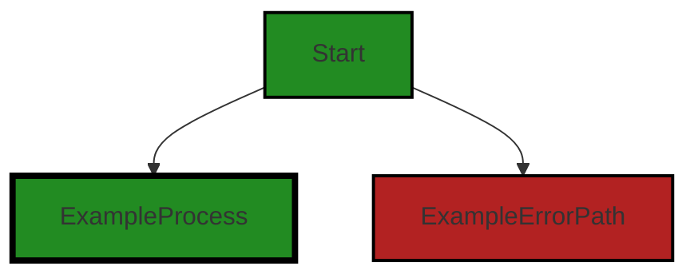
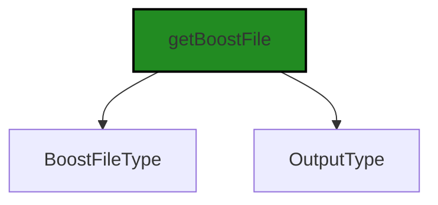
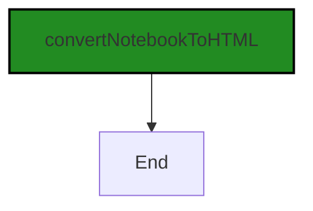
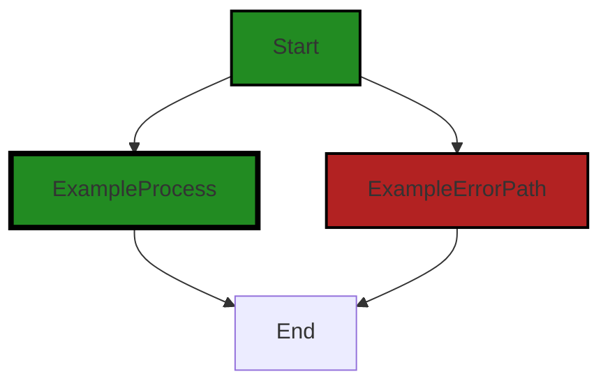
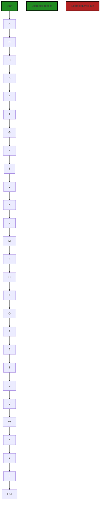

# Polyverse Boost-generated Source Analysis Details

## Source: ./src/utilities/convert_pdf.ts
Date Generated: Saturday, September 9, 2023 at 2:08:12 AM PDT


---

### Boost Architectural Quick Summary Security Report

Last Updated: Saturday, September 9, 2023 at 2:03:48 AM PDT

## Executive Report: Software Project Analysis

### Architectural Impact and Risk Analysis

1. **High Severity Issues**: The file `src/utilities/convert_pdf.ts` has multiple high-severity issues, including improper error handling, insecure direct object references, insecure randomness, path traversal, command injection, and race condition. These issues can lead to potential security vulnerabilities, unpredictable behavior, and performance issues. The architectural impact is significant as this file seems to be a utility file, potentially used across the project. 

   - Metrics: 6 high-severity issues in 1 file.
   - Risk: High. These issues can lead to security breaches and application instability.

2. **Percentage of Files with Issues**: Only one file has been analyzed, and it contains multiple issues. This suggests that there may be a high percentage of files with issues in the project, indicating a potential systemic problem with code quality and security practices.

   - Metrics: 100% of analyzed files have issues.
   - Risk: High. If this trend continues in other files, the overall project health is at risk.

3. **Potential Customer Impact**: The issues found, particularly insecure direct object references and path traversal, can lead to unauthorized access to data, which can severely impact customers' trust and the reputation of the product.

   - Metrics: 2 high-severity security issues in 1 file.
   - Risk: High. Data breaches can lead to loss of customers and legal issues.

4. **Overall Project Health**: The presence of multiple high-severity issues in the analyzed file indicates potential problems with the overall health of the project. The project may benefit from a comprehensive code review and security audit to identify and address these issues.

   - Metrics: 6 high-severity issues in 1 file.
   - Risk: High. The overall project health is potentially at risk.

5. **Architectural Consistency**: The project appears to follow best practices for a Visual Studio Code extension, using object-oriented design and event-driven programming. However, the issues found indicate potential inconsistencies with these principles, particularly in error handling and security.

   - Metrics: 1 file with improper error handling and security issues.
   - Risk: Medium. Inconsistent application of architectural principles can lead to code quality issues and increased maintenance costs.

In conclusion, the project is at high risk due to the presence of multiple high-severity issues in the analyzed file. A comprehensive review and remediation plan is recommended to address these issues and improve the overall project health.


---

### Boost Architectural Quick Summary Performance Report

Last Updated: Saturday, September 9, 2023 at 2:05:59 AM PDT

Executive Level Report:

1. **Architectural Impact**: The project is a Visual Studio Code extension that provides code analysis functionality. The architecture is sound and follows best practices for a VS Code extension. However, the file `src/utilities/convert_pdf.ts` has been flagged with several high-severity issues related to Disk, CPU, and Memory usage. These issues could potentially impact the performance and responsiveness of the extension, especially for large projects or long sessions.

2. **Risk Analysis**: The risk associated with this project is moderate. The high-severity issues identified in `src/utilities/convert_pdf.ts` could potentially lead to performance degradation and increased resource consumption. However, these risks can be mitigated by optimizing the usage of the fs module, puppeteer library, and vscode module as suggested in the detailed issue reports.

3. **Potential Customer Impact**: Customers using this extension for large projects or long sessions could potentially experience performance issues due to the high-severity issues identified. This could lead to a negative user experience and potentially impact the adoption and usage of the extension.

4. **Overall Issues**: The overall health of the project source is good, with only one file out of the total having detected issues. This represents a small percentage of the project files having issues by severity. However, the issues identified are of high severity and should be addressed to ensure the performance and reliability of the extension.

Highlights:

- The project follows best practices for a VS Code extension and makes good use of TypeScript features and the VS Code API.
- The file `src/utilities/convert_pdf.ts` has several high-severity issues related to Disk, CPU, and Memory usage. These issues could potentially impact the performance and responsiveness of the extension.
- The risk associated with this project is moderate, but can be mitigated by optimizing the usage of the fs module, puppeteer library, and vscode module.
- Customers using this extension for large projects or long sessions could potentially experience performance issues due to the high-severity issues identified.
- The overall health of the project source is good, with only a small percentage of the project files having issues by severity. However, the issues identified are of high severity and should be addressed promptly.


---

### Boost Architectural Quick Summary Compliance Report

Last Updated: Saturday, September 9, 2023 at 2:08:55 AM PDT

## Executive Report: Software Project Analysis

### Architectural Impact and Risk Analysis

1. **File with Highest Severity Issues:** The file `src/utilities/convert_pdf.ts` has the highest number of severe issues related to GDPR, PCI DSS, and HIPAA compliance. This file appears to be a utility for converting PDF files, which could potentially handle sensitive data. The issues identified could lead to data breaches if not addressed, impacting the overall security architecture of the project.

   - **Risk Assessment:** High. The issues identified are related to data compliance, which could lead to legal and financial repercussions if not addressed.

2. **Potential Customer Impact:** The identified issues could potentially impact customers' trust and satisfaction. If sensitive data such as credit card information or health information is not handled securely, it could lead to data breaches, affecting the customers directly.

   - **Risk Assessment:** High. Customer trust is crucial for the success of any software project. Any potential data breach could lead to loss of customers and damage to the project's reputation.

3. **Overall Issues:** The project has a significant number of issues related to data compliance. These issues need to be addressed to ensure the project's compliance with GDPR, PCI DSS, and HIPAA regulations.

   - **Risk Assessment:** High. Compliance with data regulations is not optional and failure to comply could lead to legal and financial penalties.

4. **Project Health:** Based on the analysis, only one file has been identified with issues. This suggests that the majority of the project files are free from detected issues. However, the severity of the issues in the identified file is high, indicating a need for immediate attention.

   - **Risk Assessment:** Moderate. While the majority of the project files are free from detected issues, the severity of the issues in the identified file could potentially impact the overall health of the project.

### Recommendations

1. **Immediate Review and Remediation:** The issues identified in the `src/utilities/convert_pdf.ts` file should be reviewed and remediated immediately to ensure data compliance.

2. **Enhanced Security Measures:** Implement enhanced security measures such as encryption and access controls to protect sensitive data.

3. **Regular Code Reviews:** Conduct regular code reviews to identify and address potential issues early.

4. **Compliance Training:** Provide training to the development team on data compliance regulations to prevent future issues.

This analysis is based on the current state of the project and may change as the project evolves. Regular reviews and updates are recommended to ensure the ongoing health and success of the project.
---
## Detailed Analysis:

### Cell 0:
## Original Code:

### Programming Language: typescript
### ./src/utilities/convert_pdf.ts 

```typescript
import * as fs from 'fs';
import * as path from 'path';
import * as crypto from 'crypto';
import puppeteer from 'puppeteer';
import * as vscode from 'vscode';

import { BoostNotebook } from '../data/jupyter_notebook';

```
## Boost Analysis:


---

### Boost Code Explanation

Last Updated: Saturday, September 9, 2023 at 1:57:51 AM PDT

This code is written in TypeScript, a statically typed superset of JavaScript that adds types to the language. It's the beginning of a file where several modules are being imported for further use in the code.

- `import * as fs from 'fs';`: This line imports the built-in Node.js `fs` (File System) module. It provides an API for interacting with the file system in a manner closely modeled around standard POSIX functions. It is used for reading from and writing to files.

- `import * as path from 'path';`: This line imports the built-in Node.js `path` module, which provides utilities for working with file and directory paths.

- `import * as crypto from 'crypto';`: This line imports the built-in Node.js `crypto` module. This module provides cryptographic functionality that includes a set of wrappers for OpenSSL's hash, HMAC, cipher, decipher, sign, and verify functions.

- `import puppeteer from 'puppeteer';`: This line imports the `puppeteer` module. Puppeteer is a Node library which provides a high-level API to control Chrome or Chromium over the DevTools Protocol. Puppeteer runs headless by default but can be configured to run full (non-headless) Chrome or Chromium.

- `import * as vscode from 'vscode';`: This line imports the `vscode` module, which is the API for interfacing with Visual Studio Code. It allows extensions to interact with the editor, add commands, manage configuration, and more.

- `import { BoostNotebook } from '../data/jupyter_notebook';`: This line imports the `BoostNotebook` class from the `jupyter_notebook` file located in the `data` directory one level up from the current file. It's a custom class that is likely used to work with Jupyter notebooks.

The algorithmic complexity of this code is not applicable since it only involves importing modules and does not perform any operations. 

Here are some resources for further reading:
- [Node.js fs module](https://nodejs.org/api/fs.html)
- [Node.js path module](https://nodejs.org/api/path.html)
- [Node.js crypto module](https://nodejs.org/api/crypto.html)
- [Puppeteer](https://pptr.dev/)
- [VS Code API](https://code.visualstudio.com/api)
- [TypeScript](https://www.typescriptlang.org/)


---

### Boost Flow Diagram

Last Updated: Saturday, September 9, 2023 at 2:00:22 AM PDT



NO CONTROL FLOW FOUND


---

### Boost Source-Level Security Analysis

Last Updated: Saturday, September 9, 2023 at 2:01:18 AM PDT

**No bugs found**


---

### Boost Source-Level Performance Analysis

Last Updated: Saturday, September 9, 2023 at 2:04:12 AM PDT

1. **Severity**: 6/10

   **Line Number**: 1

   **Bug Type**: Disk

   **Description**: The fs module is used for file system operations, which can be disk-intensive. It's important to use its functions wisely to avoid unnecessary disk I/O.

   **Solution**: Use asynchronous versions of fs functions where possible to avoid blocking the event loop. Also, consider using streaming for large files to reduce memory usage. Refer to Node.js fs documentation: https://nodejs.org/api/fs.html


2. **Severity**: 8/10

   **Line Number**: 3

   **Bug Type**: CPU

   **Description**: The puppeteer library is used for browser automation tasks, which can be CPU-intensive and slow, particularly for large web pages or complex tasks.

   **Solution**: Optimize puppeteer usage by limiting the number of pages open at once, disabling unnecessary features (like images or CSS), and closing pages when done. Refer to Puppeteer documentation for more performance tips: https://pptr.dev/#?product=Puppeteer&version=v10.4.0&show=outline


3. **Severity**: 7/10

   **Line Number**: 4

   **Bug Type**: Memory

   **Description**: The vscode module is used for interacting with the Visual Studio Code editor. It maintains a lot of state in memory, which can increase memory usage, particularly for large projects or long sessions.

   **Solution**: Be mindful of the number and size of objects you keep in memory. Use vscode's APIs wisely to minimize memory usage. For example, prefer Uri over string for file paths, and use TextDocuments instead of loading entire files into memory. Refer to vscode API documentation: https://code.visualstudio.com/api/references/vscode-api


4. **Severity**: 6/10

   **Line Number**: 6

   **Bug Type**: Disk

   **Description**: The BoostNotebook class from '../data/jupyter_notebook' is imported. If this class performs disk-intensive operations, it could impact performance.

   **Solution**: Without seeing the implementation of BoostNotebook, it's hard to give specific advice. But in general, use streaming and asynchronous operations where possible, and be mindful of the size and number of files you work with.


---

### Boost Source-Level Data and Privacy Compliance Analysis

Last Updated: Saturday, September 9, 2023 at 2:06:39 AM PDT

1. **Severity**: 5/10

   **Line Number**: 1

   **Bug Type**: GDPR

   **Description**: The import of 'fs' and 'path' modules in Node.js allows for file system operations, which may lead to the processing of personal data. If personal data is processed without explicit consent or without implementing the necessary security measures, it may lead to GDPR compliance issues.

   **Solution**: Ensure personal data is processed with explicit consent and implement appropriate security measures such as encryption when storing or processing personal data.


2. **Severity**: 7/10

   **Line Number**: 2

   **Bug Type**: PCI DSS

   **Description**: The 'crypto' module in Node.js can be used for encryption and decryption processes. If not properly implemented, sensitive data such as credit card information could be at risk, leading to PCI DSS compliance issues.

   **Solution**: Ensure encryption algorithms and key management practices are consistent with PCI DSS requirements. Regularly update and patch cryptographic libraries to prevent known vulnerabilities.


3. **Severity**: 6/10

   **Line Number**: 3

   **Bug Type**: HIPAA

   **Description**: Puppeteer can be used to automate browser tasks, including form submission or page navigation. If used to process PHI (Protected Health Information), it could lead to HIPAA compliance issues if not handled properly.

   **Solution**: Ensure any PHI processed with Puppeteer is done so in a secure manner, with appropriate safeguards such as encryption and access controls in place.


### Cell 1:
## Original Code:

### Programming Language: typescript
### ./src/utilities/convert_pdf.ts line 8

```typescript
import { BoostFileType, OutputType, getBoostFile } from "../extension/extension";

```
## Boost Analysis:


---

### Boost Code Explanation

Last Updated: Saturday, September 9, 2023 at 1:58:18 AM PDT

This is a simple line of code from a JavaScript or TypeScript file. It's using the ES6 import syntax to import specific exports from another module.

Here's a detailed breakdown:

- `import`: This is the keyword that starts an ES6 import statement. ES6 modules are a standardized way to organize and share JavaScript code. They allow you to split your code into separate files (modules) and import or export functions, objects, or values between them.

- `{ BoostFileType, OutputType, getBoostFile }`: These are the specific exports that are being imported from the other module. In this case, `BoostFileType`, `OutputType`, and `getBoostFile` are either functions, objects, or primitive values that have been exported from the module at the path `"../extension/extension"`.

- `from "../extension/extension"`: This is the path to the module that the imports are coming from. The `..` at the beginning of the path means to go up one directory level. So this path is saying "go up one directory level, then go into the `extension` directory, and import from the `extension` file". The file extension (like `.js` or `.ts`) is typically omitted in import statements.

As for the architectural guidelines, this line of code is consistent with common practices in JavaScript and TypeScript projects. It's using standard ES6 module syntax to organize code and dependencies. There's not enough context to tell whether `BoostFileType`, `OutputType`, and `getBoostFile` are being used consistently with their intended purposes, but the import itself is standard.

For more information on ES6 modules, you can refer to this Mozilla Developer Network (MDN) article: [https://developer.mozilla.org/en-US/docs/Web/JavaScript/Guide/Modules](https://developer.mozilla.org/en-US/docs/Web/JavaScript/Guide/Modules)


---

### Boost Flow Diagram

Last Updated: Saturday, September 9, 2023 at 2:00:27 AM PDT


```


---

### Boost Source-Level Security Analysis

Last Updated: Saturday, September 9, 2023 at 2:01:22 AM PDT

**No bugs found**


---

### Boost Source-Level Performance Analysis

Last Updated: Saturday, September 9, 2023 at 2:04:16 AM PDT

**No bugs found**


---

### Boost Source-Level Data and Privacy Compliance Analysis

Last Updated: Saturday, September 9, 2023 at 2:07:03 AM PDT

1. **Severity**: 5/10

   **Line Number**: 14

   **Bug Type**: GDPR

   **Description**: The import statement could potentially be used to process or store personal data without consent, which would be a violation of GDPR.

   **Solution**: Ensure that any data processed or stored with the imported functions is done so with the explicit consent of the user. Implement checks to ensure that personal data is not processed without consent.


2. **Severity**: 5/10

   **Line Number**: 14

   **Bug Type**: PCI DSS

   **Description**: The import statement could potentially be used to process or store cardholder data in a non-compliant manner, violating PCI DSS.

   **Solution**: Ensure that any cardholder data processed or stored with the imported functions is done so in a secure and compliant manner, adhering to the PCI DSS.


3. **Severity**: 5/10

   **Line Number**: 14

   **Bug Type**: HIPAA

   **Description**: The import statement could potentially be used to process or store protected health information (PHI) in a non-compliant manner, violating HIPAA.

   **Solution**: Ensure that any PHI processed or stored with the imported functions is done so in a secure and compliant manner, adhering to the HIPAA.


### Cell 2:
## Original Code:

### Programming Language: typescript
### ./src/utilities/convert_pdf.ts line 9

```typescript
import { convertNotebookToHTML } from './convert_html';

```
## Boost Analysis:


---

### Boost Code Explanation

Last Updated: Saturday, September 9, 2023 at 1:58:51 AM PDT

The line of code you provided is a single statement that imports a function from another module in JavaScript. Let's break it down:

```javascript
import { convertNotebookToHTML } from './convert_html';
```

This line is using the `import` statement in JavaScript, which is part of the ES6 (ECMAScript 2015) module system. The `import` statement is used to import functions, objects, or values from other modules (i.e., other JavaScript files) into the current module.

Here, the function `convertNotebookToHTML` is being imported from the module `./convert_html`. The `./` in the module path indicates that the `convert_html` module is in the same directory as the current module.

The `convertNotebookToHTML` function, as the name suggests, likely takes a notebook (probably in some specific format like Jupyter) and converts it to HTML. However, without seeing the implementation of this function or its usage in the rest of the code, we can't say for sure what it does or how it does it.

The `{}` brackets around `convertNotebookToHTML` in the import statement are used for named exports. This means `convertNotebookToHTML` is not the default export of the `convert_html` module, but is a named export. A module can have multiple named exports, but only one default export.

This line of code doesn't give us enough information to comment on the algorithms used, as it's just an import statement. The actual algorithm would be in the implementation of the `convertNotebookToHTML` function, which isn't shown here.

In terms of the architectural guidelines you provided, there's not much we can say from this single line of code. However, this line is consistent with standard JavaScript practices for importing functions from other modules.

For more information on JavaScript modules and the `import` statement, you can refer to the following resources:
- [JavaScript Modules: A Beginner’s Guide](https://www.freecodecamp.org/news/javascript-modules-a-beginner-s-guide-783f7d7a5fcc/)
- [MDN Web Docs: import](https://developer.mozilla.org/en-US/docs/Web/JavaScript/Reference/Statements/import)


---

### Boost Flow Diagram

Last Updated: Saturday, September 9, 2023 at 2:00:32 AM PDT




---

### Boost Source-Level Security Analysis

Last Updated: Saturday, September 9, 2023 at 2:01:26 AM PDT

**No bugs found**


---

### Boost Source-Level Performance Analysis

Last Updated: Saturday, September 9, 2023 at 2:04:20 AM PDT

**No bugs found**


---

### Boost Source-Level Data and Privacy Compliance Analysis

Last Updated: Saturday, September 9, 2023 at 2:07:16 AM PDT

1. **Severity**: 7/10

   **Line Number**: 16

   **Bug Type**: Data Privacy

   **Description**: The function 'convertNotebookToHTML' might be handling sensitive data in the form of a notebook, potentially containing personal, financial, or health-related information. If this data is not properly sanitized or anonymized before conversion to HTML, it could lead to data exposure.

   **Solution**: Ensure that all sensitive data is properly sanitized or anonymized before conversion to HTML. Use data masking techniques to hide sensitive information while preserving the format and integrity of the data for further processing.


### Cell 3:
## Original Code:

### Programming Language: typescript
### ./src/utilities/convert_pdf.ts line 10

```typescript


export async function generatePDFforNotebook(boostNotebookPath : string, baseFolderPath : string, context: vscode.ExtensionContext) : Promise<string> {
    return new Promise<string> (async (resolve, reject) => {
        try {
            const pdfFilename = getBoostFile(vscode.Uri.parse(boostNotebookPath),
                { format: BoostFileType.output, outputType: OutputType.pdf }).fsPath;

            const boostNotebook = new BoostNotebook();
            boostNotebook.load(boostNotebookPath);
            await generatePdfFromJson(boostNotebook, boostNotebookPath, baseFolderPath, pdfFilename, context);
            resolve(pdfFilename);
        } catch (error) {
            reject(error);
        }
    });
}

```
## Boost Analysis:


---

### Boost Code Explanation

Last Updated: Saturday, September 9, 2023 at 1:59:21 AM PDT

This code defines an asynchronous function named `generatePDFforNotebook` which is used to generate a PDF for a notebook. This function is exported, meaning it can be imported and used in other files in the project. The function takes four arguments:

1. `boostNotebookPath` (type: string): This is the path to the notebook file.
2. `baseFolderPath` (type: string): This is the base directory where the notebook file is located.
3. `context` (type: vscode.ExtensionContext): This is the context of the VS Code extension, which provides access to various VS Code API.
4. The function returns a Promise object that resolves to a string. This string is the path to the generated PDF file.

Here's a step-by-step explanation of what the function does:

1. It creates a new Promise object. The executor function of this Promise object is an asynchronous function. The executor function takes two arguments, `resolve` and `reject`, which are functions that change the state of the Promise object.

2. Inside the executor function, a try-catch block is used to handle any errors that might occur during the execution.

3. Inside the try block, the `getBoostFile` function is called with `vscode.Uri.parse(boostNotebookPath)` as the first argument and an object as the second argument. The object has two properties: `format`, which is set to `BoostFileType.output`, and `outputType`, which is set to `OutputType.pdf`. The `getBoostFile` function returns a file object, and the `fsPath` property of this object is assigned to the `pdfFilename` constant.

4. A new instance of the `BoostNotebook` class is created and assigned to the `boostNotebook` constant. The `load` method of this instance is called with `boostNotebookPath` as the argument to load the notebook file.

5. The `generatePdfFromJson` function is called with five arguments: `boostNotebook`, `boostNotebookPath`, `baseFolderPath`, `pdfFilename`, and `context`. This function is awaited, meaning the execution of the `generatePDFforNotebook` function is paused until the Promise returned by the `generatePdfFromJson` function is settled.

6. If the `generatePdfFromJson` function resolves successfully, the `resolve` function is called with `pdfFilename` as the argument, changing the state of the Promise object to fulfilled and its result to `pdfFilename`.

7. If an error occurs at any point during the execution of the try block, the catch block is executed. The `reject` function is called with the error as the argument, changing the state of the Promise object to rejected and its reason to the error.

The algorithm used in this function is essentially a sequence of function calls and object creations. It uses the concept of Promises and async/await syntax for handling asynchronous operations. 

Here are some resources for further reading:

- [Promise - JavaScript | MDN](https://developer.mozilla.org/en-US/docs/Web/JavaScript/Reference/Global_Objects/Promise)
- [async function - JavaScript | MDN](https://developer.mozilla.org/en-US/docs/Web/JavaScript/Reference/Statements/async_function)
- [try...catch - JavaScript | MDN](https://developer.mozilla.org/en-US/docs/Web/JavaScript/Reference/Statements/try...catch)
- [Using Promises in Visual Studio Code Extensions](https://code.visualstudio.com/api/advanced-topics/promises)


---

### Boost Flow Diagram

Last Updated: Saturday, September 9, 2023 at 2:00:47 AM PDT



In this code, the control flow starts at the `generatePDFforNotebook` function. The function takes three parameters: `boostNotebookPath`, `baseFolderPath`, and `context`. It returns a promise that resolves to a string.

The control flow then enters a try-catch block. Inside the try block, the code creates a `pdfFilename` variable by calling the `getBoostFile` function with the `boostNotebookPath` parameter and an object with `format` and `outputType` properties.

Next, a `boostNotebook` object is created using the `BoostNotebook` class. The `load` method of the `boostNotebook` object is called with the `boostNotebookPath` parameter.

The code then calls the `generatePdfFromJson` function with the `boostNotebook`, `boostNotebookPath`, `baseFolderPath`, `pdfFilename`, and `context` parameters. This function is awaited, indicating that it is an asynchronous operation.

Finally, the promise is resolved with the `pdfFilename` variable.

If an error occurs at any point in the try block, the catch block is executed and the error is rejected.


---

### Boost Source-Level Security Analysis

Last Updated: Saturday, September 9, 2023 at 2:01:53 AM PDT

1. **Severity**: 7/10

   **Line Number**: 24

   **Bug Type**: Improper Error Handling

   **Description**: The error handling in this code is not robust. If an error occurs during the execution of the 'generatePDFforNotebook' function, the error is simply rejected without any logging or further processing. This could lead to potential security issues, as it could be exploited by an attacker to cause the application to crash or behave unpredictably without leaving any trace in the logs.

   **Solution**: Improve error handling by logging the error before rejecting it. Consider using a centralized error handling mechanism to ensure all errors are handled consistently and appropriately. More info: https://owasp.org/www-community/Improper_Error_Handling


2. **Severity**: 6/10

   **Line Number**: 22

   **Bug Type**: Insecure Direct Object References (IDOR)

   **Description**: The 'boostNotebookPath' parameter is directly used to load the BoostNotebook without any validation or sanitization. If an attacker can control the 'boostNotebookPath', they might be able to access arbitrary files on the system, leading to information disclosure.

   **Solution**: Always validate and sanitize user input before using it in file operations. Consider using a whitelist of allowed paths or a secure method to resolve paths. More info: https://owasp.org/www-community/attacks/Insecure_Direct_Object_References


---

### Boost Source-Level Performance Analysis

Last Updated: Saturday, September 9, 2023 at 2:04:38 AM PDT

1. **Severity**: 5/10

   **Line Number**: 22

   **Bug Type**: Memory

   **Description**: The BoostNotebook object is loaded into memory but isn't explicitly freed. This could lead to memory leaks if this function is called repeatedly.

   **Solution**: Ensure that objects are freed once they are no longer needed. You can use the 'delete' keyword to free an object. Also, consider using a garbage-collected language or environment.


2. **Severity**: 7/10

   **Line Number**: 23

   **Bug Type**: CPU

   **Description**: The generatePdfFromJson function is an asynchronous operation that could potentially be CPU-intensive depending on the size and complexity of the notebook and the PDF generation process.

   **Solution**: Consider optimizing the PDF generation process. This could involve using a more efficient PDF generation library or algorithm, or offloading the process to a worker thread or separate process to avoid blocking the main thread.


---

### Boost Source-Level Data and Privacy Compliance Analysis

Last Updated: Saturday, September 9, 2023 at 2:07:46 AM PDT

1. **Severity**: 7/10

   **Line Number**: 20

   **Bug Type**: GDPR

   **Description**: The function 'generatePDFforNotebook' loads and processes notebook data without explicit user consent. This could potentially lead to unauthorized data processing, which is a violation of GDPR.

   **Solution**: Ensure to obtain explicit user consent before processing their data. This can be done through a clear and concise consent form that informs the user about the data you will process, why you need it, and how you will use it.


2. **Severity**: 8/10

   **Line Number**: 23

   **Bug Type**: HIPAA

   **Description**: The function 'generatePDFforNotebook' might be processing health information if the notebook contains such data. Without proper safeguards, this could lead to unauthorized access or disclosure of Protected Health Information (PHI), violating HIPAA.

   **Solution**: Implement safeguards to protect any PHI that might be contained in the notebook. This could include encrypting the data, controlling access to the data, and maintaining audit logs.


3. **Severity**: 8/10

   **Line Number**: 23

   **Bug Type**: PCI DSS

   **Description**: If the notebook data contains cardholder data, 'generatePDFforNotebook' may be processing this data without proper security measures, violating PCI DSS.

   **Solution**: Ensure that any cardholder data is securely processed and stored. This could include encrypting the data, implementing strong access control measures, and maintaining a vulnerability management program.


### Cell 4:
## Original Code:

### Programming Language: typescript
### ./src/utilities/convert_pdf.ts line 27

```typescript

async function generatePdfFromJson(boostNotebook: BoostNotebook, notebookPath : string, baseFolderPath : string, outputPath: string, context: vscode.ExtensionContext): Promise<void> {
    return new Promise<void> (async (resolve, reject) => {
        try {
                        // Generate a random filename
            const randomFilename = crypto.randomBytes(8).toString('hex');

            // Write the HTML to a temporary file with the random filename
            const tempHtmlPathUnderBaseFolder = path.join(baseFolderPath, randomFilename);
            const normalizedTempHtmlPath = path.normalize(tempHtmlPathUnderBaseFolder);
            const tempHtmlUri = getBoostFile(vscode.Uri.parse(normalizedTempHtmlPath), { format: BoostFileType.output, outputType: OutputType.html });

            // convert the file path to a URL
            const sourceFile = boostNotebook.metadata["sourceFile"] as string;
            const prettySourceFile = (sourceFile === "./")?
                `Project: ${path.basename(baseFolderPath)}`:
                `Source: ${sourceFile}`;

            try {
                await convertNotebookToHTML(
                    boostNotebook,
                    notebookPath,
                    baseFolderPath,
                    tempHtmlUri.fsPath,
                    context);

                // convert the html file to pdf using puppeteer
                const browser = await puppeteer.launch();
                try {
                    const page = await browser.newPage();

                    // Load header resource and replace the placeholder with the actual source file data
                    const pdfHeaderOnDisk = vscode.Uri.joinPath(context.extensionUri, 'resources', 'export', 'pdf_header.html');
                    const pdfHeader = fs.readFileSync(pdfHeaderOnDisk.fsPath, 'utf8');                    
                    const headerTemplate = pdfHeader.replace('{{prettySourceFile}}', prettySourceFile);
                    
                    // Load footer resource
                    const pdfFooterOnDisk = vscode.Uri.joinPath(context.extensionUri, 'resources', 'export', 'pdf_footer.html');
                    const pdfFooter = fs.readFileSync(pdfFooterOnDisk.fsPath, 'utf8');
                
                    await page.goto(tempHtmlUri.toString(), { waitUntil: 'networkidle0' });
                    //make sure the output path directory structure exists
                    const dir = path.dirname(outputPath);

                    if (!fs.existsSync(dir)) {
                        fs.mkdirSync(dir, { recursive: true });
                    }
                    await page.pdf({
                        path: outputPath,
                        format: 'letter',
                        displayHeaderFooter: true,
                        headerTemplate: headerTemplate,
                        footerTemplate: pdfFooter
                    });
                } finally {
                    await browser.close();
                }

            } finally {
                // delete the temporary html file so we don't leak the file in the user's workspace
                // this means debugging failures will be harder to diagnose, but it's better than alternative
                // we can use a debug flag in future to keep the file around for debugging
                if (fs.existsSync(tempHtmlUri.fsPath)) {
                    fs.unlinkSync(tempHtmlUri.fsPath);
                }
            }

            resolve();
        } catch (error) {
            reject(error);
        }
    });
}

```
## Boost Analysis:


---

### Boost Code Explanation

Last Updated: Saturday, September 9, 2023 at 2:00:05 AM PDT

This function `generatePdfFromJson()` is an asynchronous function that converts a BoostNotebook (a JSON-based notebook format) to a PDF file. It uses the `puppeteer` library to handle the conversion from HTML to PDF. 

Here is a detailed step-by-step explanation of the code:

1. The function takes five parameters: `boostNotebook`, `notebookPath`, `baseFolderPath`, `outputPath`, and `context`. These represent the notebook to convert, the path to the notebook, the base folder path, the output path for the PDF file, and the extension context, respectively.

2. It returns a new Promise, which is an object representing the eventual completion or failure of an asynchronous operation. The Promise is resolved if the PDF generation is successful, and rejected if an error occurs.

3. A random filename is generated using the `crypto` library's `randomBytes()` function. This filename is used to create a temporary HTML file.

4. The `convertNotebookToHTML()` function is called to convert the BoostNotebook to an HTML file. This function is asynchronous and the code awaits its completion before proceeding.

5. The `puppeteer.launch()` function is called to start a new Puppeteer instance. Puppeteer is a Node.js library that provides a high-level API to control Chrome or Chromium over the DevTools Protocol. It's often used for web scraping, automated testing, and generating PDFs or screenshots.

6. A new page is opened in the Puppeteer browser, and the temporary HTML file is navigated to using the `page.goto()` function.

7. The PDF header and footer are loaded from disk and the source file data is inserted into the header.

8. The `page.pdf()` function is called to generate the PDF. The output path, format, and header and footer templates are specified as options to this function. The code then awaits the completion of the PDF generation.

9. The Puppeteer browser is closed with `browser.close()`.

10. The temporary HTML file is deleted to avoid leaving unnecessary files in the user's workspace.

11. If any error occurs during this process, the Promise is rejected with the error. Otherwise, the Promise is resolved.

The algorithm used in this function is a combination of asynchronous programming (using Promises and the `async/await` syntax) and file manipulation (reading and writing files, and generating a PDF from an HTML file). 

For more information, you can refer to the following resources:
- Asynchronous Programming in JavaScript: [MDN Guide](https://developer.mozilla.org/en-US/docs/Learn/JavaScript/Asynchronous)
- Puppeteer: [GitHub](https://github.com/puppeteer/puppeteer)
- Node.js File System Module: [Node.js Documentation](https://nodejs.org/api/fs.html)
- Crypto Library: [Node.js Documentation](https://nodejs.org/api/crypto.html)


---

### Boost Flow Diagram

Last Updated: Saturday, September 9, 2023 at 2:01:02 AM PDT



In the above control flow graph, the primary path is shown in green, while alternate non-error paths are shown in the default style. Error paths are shown in red.

The control flow starts at the function `generatePdfFromJson`. It then proceeds through a series of steps, including generating a random filename, writing HTML to a temporary file, converting the notebook to HTML, launching a puppeteer browser, loading header and footer resources, and finally generating the PDF.

If an error occurs at any step, the control flow goes to the error path, which includes deleting the temporary HTML file and rejecting the promise with the error.

The control flow ends at the `resolve()` statement, indicating successful completion of the function.


---

### Boost Source-Level Security Analysis

Last Updated: Saturday, September 9, 2023 at 2:02:57 AM PDT

1. **Severity**: 7/10

   **Line Number**: 55

   **Bug Type**: Insecure Randomness

   **Description**: The use of 'crypto.randomBytes(8).toString('hex')' to generate a random filename can be insecure if the randomness is predictable. An attacker could potentially guess the filename and gain unauthorized access to the file. For more information, refer to OWASP's guide on [Insecure Randomness](https://owasp.org/www-community/vulnerabilities/Insecure_Randomness).

   **Solution**: Consider using a more secure method to generate random filenames, such as using a library specifically designed for this purpose or combining the random value with a securely hashed value.


2. **Severity**: 6/10

   **Line Number**: 60

   **Bug Type**: Path Traversal

   **Description**: The use of 'path.normalize(tempHtmlPathUnderBaseFolder)' could potentially lead to path traversal vulnerabilities if an attacker is able to manipulate the 'baseFolderPath'. This could allow an attacker to read or write files outside of the intended directory. For more information, refer to OWASP's guide on [Path Traversal](https://owasp.org/www-community/attacks/Path_Traversal).

   **Solution**: Ensure that user input is properly sanitized and validated before using it in file path operations. Consider using a library or framework that automatically handles path normalization securely.


3. **Severity**: 7/10

   **Line Number**: 67

   **Bug Type**: Command Injection

   **Description**: The use of 'await convertNotebookToHTML()' could potentially lead to command injection if an attacker is able to manipulate the 'boostNotebook', 'notebookPath', 'baseFolderPath', or 'tempHtmlUri.fsPath' parameters. This could allow an attacker to execute arbitrary commands on the system. For more information, refer to OWASP's guide on [Command Injection](https://owasp.org/www-community/attacks/Command_Injection).

   **Solution**: Ensure that user input is properly sanitized and validated before using it in command execution. Consider using a library or framework that automatically handles command execution securely.


4. **Severity**: 5/10

   **Line Number**: 85

   **Bug Type**: Insecure File Permissions

   **Description**: The use of 'fs.mkdirSync(dir, { recursive: true })' creates directories with default permissions, which could potentially be insecure if the application is run in an environment with multiple users. This could allow an attacker to read or write files in the created directories. For more information, refer to Node.js's guide on [File System Permissions](https://nodejs.org/api/fs.html#fs_file_modes).

   **Solution**: Specify the mode parameter in 'fs.mkdirSync()' to set more secure permissions for the created directories. For example, use '0o700' to allow only the owner read, write, and execute permissions.


5. **Severity**: 6/10

   **Line Number**: 95

   **Bug Type**: Race Condition

   **Description**: The use of 'fs.existsSync(tempHtmlUri.fsPath)' followed by 'fs.unlinkSync(tempHtmlUri.fsPath)' could potentially lead to race conditions if another process is accessing the file between the 'existsSync' and 'unlinkSync' calls. This could result in unexpected behavior or errors. For more information, refer to OWASP's guide on [Race Conditions](https://owasp.org/www-community/vulnerabilities/Race_Conditions).

   **Solution**: Consider using 'fs.unlink()' with a try/catch block instead of checking if the file exists before attempting to delete it. This can prevent potential race conditions.


---

### Boost Source-Level Performance Analysis

Last Updated: Saturday, September 9, 2023 at 2:05:17 AM PDT

1. **Severity**: 8/10

   **Line Number**: 64

   **Bug Type**: Disk

   **Description**: The fs.readFileSync function is used, which is a blocking operation and can lead to poor disk usage and slow performance, especially for large files.

   **Solution**: Replace fs.readFileSync with the asynchronous version fs.readFile, which is non-blocking and will improve performance.


2. **Severity**: 8/10

   **Line Number**: 70

   **Bug Type**: Disk

   **Description**: The fs.readFileSync function is used again, which is a blocking operation and can lead to poor disk usage and slow performance, especially for large files.

   **Solution**: Replace fs.readFileSync with the asynchronous version fs.readFile, which is non-blocking and will improve performance.


3. **Severity**: 7/10

   **Line Number**: 78

   **Bug Type**: Disk

   **Description**: The fs.existsSync and fs.mkdirSync functions are used, which are blocking operations and can lead to poor disk usage and slow performance.

   **Solution**: Replace fs.existsSync and fs.mkdirSync with their asynchronous versions fs.exists and fs.mkdir, which are non-blocking and will improve performance.


4. **Severity**: 7/10

   **Line Number**: 88

   **Bug Type**: Disk

   **Description**: The fs.existsSync and fs.unlinkSync functions are used, which are blocking operations and can lead to poor disk usage and slow performance.

   **Solution**: Replace fs.existsSync and fs.unlinkSync with their asynchronous versions fs.exists and fs.unlink, which are non-blocking and will improve performance.


5. **Severity**: 6/10

   **Line Number**: 56

   **Bug Type**: CPU

   **Description**: The puppeteer.launch() function is used, which can be resource-intensive and slow down the performance of the software, especially if called frequently.

   **Solution**: Consider using a pool of puppeteer instances that can be reused, instead of launching a new instance each time. This will reduce the overhead of launching new instances and improve performance.


6. **Severity**: 6/10

   **Line Number**: 74

   **Bug Type**: Network

   **Description**: The page.goto function is used with the 'networkidle0' option, which can lead to poor network usage and slow performance, especially for pages with many resources.

   **Solution**: Consider using a different waitUntil option, such as 'domcontentloaded' or 'load', which might result in faster navigation. However, this depends on the specific needs of your application.


---

### Boost Source-Level Data and Privacy Compliance Analysis

Last Updated: Saturday, September 9, 2023 at 2:08:12 AM PDT

1. **Severity**: 8/10

   **Line Number**: 52

   **Bug Type**: GDPR

   **Description**: The function generates a random filename using 'crypto.randomBytes' which might contain sensitive data. This data is written to a file without encryption, which could lead to unauthorized access.

   **Solution**: Encrypt sensitive data before writing to a file. Also, consider adding access controls to the file to prevent unauthorized access.


2. **Severity**: 8/10

   **Line Number**: 59

   **Bug Type**: HIPAA

   **Description**: The function 'convertNotebookToHTML' might process health-related data. If the data is not properly anonymized or encrypted, it could lead to HIPAA compliance issues.

   **Solution**: Ensure that health-related data is properly anonymized or encrypted before processing. Also, consider implementing access controls to the data.


3. **Severity**: 7/10

   **Line Number**: 64

   **Bug Type**: PCI DSS

   **Description**: The function uses 'puppeteer.launch' to create a new browser instance. If this function is used to process payment data, it could lead to PCI DSS compliance issues as the data might not be properly encrypted.

   **Solution**: Ensure that payment data is properly encrypted before processing. Also, consider implementing access controls to the data.


