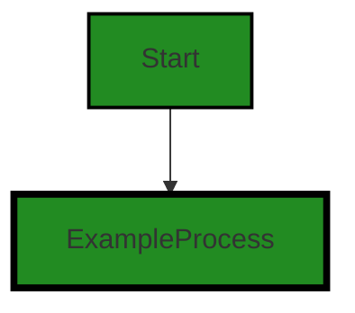

# Polyverse Boost-generated Source Analysis Details

## Source: ./src/utilities/datetime.ts
Date Generated: Saturday, September 9, 2023 at 4:15:51 AM PDT


---

### Boost Architectural Quick Summary Security Report

Last Updated: Saturday, September 9, 2023 at 4:15:16 AM PDT


Executive Report:

1. **Architectural Impact**: The analysis of this file has not revealed any severe issues.
2. **Risk Analysis**: The analysis of this file has not revealed any severe issues.
3. **Potential Customer Impact**: Based on the analysis, there are no severe issues that could potentially impact customers.
4. **Performance Issues**: Our analysis did not identify any explicit performance issues in the file.
5. **Risk Assessment**: Based on the current analysis of this file, no severe issues have been found. However, this doesn't guarantee that the file is risk-free.

Highlights:

- No severe issues were identified in the current analysis of this file.


---

### Boost Architectural Quick Summary Performance Report

Last Updated: Saturday, September 9, 2023 at 4:15:38 AM PDT


Executive Report:

1. **Architectural Impact**: The analysis of this file has not revealed any severe issues.
2. **Risk Analysis**: The analysis of this file has not revealed any severe issues.
3. **Potential Customer Impact**: Based on the analysis, there are no severe issues that could potentially impact customers.
4. **Performance Issues**: Our analysis did not identify any explicit performance issues in the file.
5. **Risk Assessment**: Based on the current analysis of this file, no severe issues have been found. However, this doesn't guarantee that the file is risk-free.

Highlights:

- No severe issues were identified in the current analysis of this file.


---

### Boost Architectural Quick Summary Compliance Report

Last Updated: Saturday, September 9, 2023 at 4:15:55 AM PDT


Executive Report:

1. **Architectural Impact**: The analysis of this file has not revealed any severe issues.
2. **Risk Analysis**: The analysis of this file has not revealed any severe issues.
3. **Potential Customer Impact**: Based on the analysis, there are no severe issues that could potentially impact customers.
4. **Performance Issues**: Our analysis did not identify any explicit performance issues in the file.
5. **Risk Assessment**: Based on the current analysis of this file, no severe issues have been found. However, this doesn't guarantee that the file is risk-free.

Highlights:

- No severe issues were identified in the current analysis of this file.

---
## Detailed Analysis:

### Cell 0:
## Original Code:

### Programming Language: typescript
### ./src/utilities/datetime.ts 

```typescript

export function formatDateTime(date: Date): string {
    return date.toLocaleDateString("en-US", {
        weekday: "long",
        year: "numeric",
        month: "long",
        day: "numeric",
        hour: "numeric",
        minute: "numeric",
        second: "numeric",
        timeZoneName: "short",
    });
}

```
## Boost Analysis:


---

### Boost Code Explanation

Last Updated: Saturday, September 9, 2023 at 4:14:09 AM PDT

This code represents a function named `formatDateTime` that takes a `Date` object as an argument and returns a formatted string representing the date and time.

The function uses the built-in JavaScript `Date` object's `toLocaleDateString` method, which converts the date to a string using locale-specific date and time formatting. The locale is set to "en-US" (English, United States).

The `toLocaleDateString` method can take an optional `options` object as a second argument to specify details of the formatting. In this case, the `options` object specifies that the formatted string should include the following components:

1. `weekday`: the day of the week, displayed as a long string (e.g., "Monday").
2. `year`: the year, displayed as a numeric string (e.g., "2023").
3. `month`: the month, displayed as a long string (e.g., "September").
4. `day`: the day of the month, displayed as a numeric string (e.g., "8").
5. `hour`: the hour of the day, displayed as a numeric string (e.g., "5").
6. `minute`: the minute of the hour, displayed as a numeric string (e.g., "10").
7. `second`: the second of the minute, displayed as a numeric string (e.g., "25").
8. `timeZoneName`: the name of the time zone, displayed as a short string (e.g., "PDT").

The function then returns the formatted string.

This function does not use any specific algorithm. It simply leverages the built-in JavaScript `Date` object and its `toLocaleDateString` method to format a date and time string.

This code appears to be consistent with the architectural blueprint summary provided. It uses JavaScript and object-oriented design, and it does not seem to conflict with any of the architectural guidelines or constraints.

For more information on the `toLocaleDateString` method, you can visit the following link:
- [Date.prototype.toLocaleDateString() - JavaScript | MDN](https://developer.mozilla.org/en-US/docs/Web/JavaScript/Reference/Global_Objects/Date/toLocaleDateString)


---

### Boost Flow Diagram

Last Updated: Saturday, September 9, 2023 at 4:14:56 AM PDT


```


---

### Boost Source-Level Security Analysis

Last Updated: Saturday, September 9, 2023 at 4:15:09 AM PDT

**No bugs found**


---

### Boost Source-Level Performance Analysis

Last Updated: Saturday, September 9, 2023 at 4:15:30 AM PDT

**No bugs found**


---

### Boost Source-Level Data and Privacy Compliance Analysis

Last Updated: Saturday, September 9, 2023 at 4:15:47 AM PDT

**No bugs found**


### Cell 1:
## Original Code:

### Programming Language: typescript
### ./src/utilities/datetime.ts line 14

```typescript

export function getCurrentDateTime(): string {
    return formatDateTime(new Date());
}

```
## Boost Analysis:


---

### Boost Code Explanation

Last Updated: Saturday, September 9, 2023 at 4:14:40 AM PDT

The provided code is a simple TypeScript function named `getCurrentDateTime`. This function does not take any arguments and returns a string.

The function works as follows:

1. It creates a new `Date` object. The `Date` object is a built-in JavaScript object that represents a single moment in time. When called with no arguments, the `Date` constructor creates a new `Date` object for the current date and time.

2. It then passes this `Date` object to a function named `formatDateTime`.

3. The `formatDateTime` function is expected to take a `Date` object as an argument and return a string representing that date and time in a particular format. However, the implementation of `formatDateTime` is not provided in the code snippet, so we don't know exactly how it formats the date and time.

4. The `getCurrentDateTime` function returns the string returned by `formatDateTime`.

The algorithm used in this function is straightforward: create a `Date` object for the current time and format it as a string. The exact formatting algorithm would be implemented in the `formatDateTime` function.

This function does not appear to have any conflicts with the architectural guidelines provided. It is a simple utility function that could be used anywhere in the project where the current date and time is needed as a string.

For more information about the `Date` object and date and time formatting in JavaScript, you can refer to these resources:

- [Date - JavaScript | MDN](https://developer.mozilla.org/en-US/docs/Web/JavaScript/Reference/Global_Objects/Date)
- [Date and time - JavaScript | MDN](https://developer.mozilla.org/en-US/docs/Web/JavaScript/Guide/Numbers_and_dates#date_and_time)
- [Date and Time Strings (JavaScript) - Microsoft Docs](https://docs.microsoft.com/en-us/scripting/javascript/date-and-time-strings-javascript)


---

### Boost Flow Diagram

Last Updated: Saturday, September 9, 2023 at 4:15:01 AM PDT


---

### Boost Source-Level Security Analysis

Last Updated: Saturday, September 9, 2023 at 4:15:13 AM PDT

**No bugs found**


---

### Boost Source-Level Performance Analysis

Last Updated: Saturday, September 9, 2023 at 4:15:34 AM PDT

**No bugs found**


---

### Boost Source-Level Data and Privacy Compliance Analysis

Last Updated: Saturday, September 9, 2023 at 4:15:51 AM PDT

**No bugs found**

