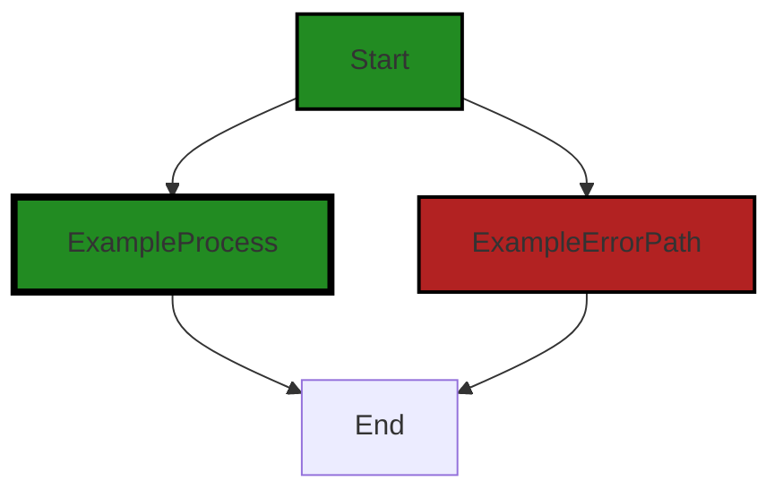

# Polyverse Boost-generated Source Analysis Details

## Source: ./src/utilities/error.ts
Date Generated: Saturday, September 9, 2023 at 1:44:22 AM PDT


---

### Boost Architectural Quick Summary Security Report

Last Updated: Saturday, September 9, 2023 at 1:43:08 AM PDT


Executive Report:

1. **Architectural Impact**: The analysis of this file has not revealed any severe issues.
2. **Risk Analysis**: The analysis of this file has not revealed any severe issues.
3. **Potential Customer Impact**: Based on the analysis, there are no severe issues that could potentially impact customers.
4. **Performance Issues**: Our analysis did not identify any explicit performance issues in the file.
5. **Risk Assessment**: Based on the current analysis of this file, no severe issues have been found. However, this doesn't guarantee that the file is risk-free.

Highlights:

- No severe issues were identified in the current analysis of this file.


---

### Boost Architectural Quick Summary Performance Report

Last Updated: Saturday, September 9, 2023 at 1:43:28 AM PDT


Executive Report:

1. **Architectural Impact**: The analysis of this file has not revealed any severe issues.
2. **Risk Analysis**: The analysis of this file has not revealed any severe issues.
3. **Potential Customer Impact**: Based on the analysis, there are no severe issues that could potentially impact customers.
4. **Performance Issues**: Our analysis did not identify any explicit performance issues in the file.
5. **Risk Assessment**: Based on the current analysis of this file, no severe issues have been found. However, this doesn't guarantee that the file is risk-free.

Highlights:

- No severe issues were identified in the current analysis of this file.


---

### Boost Architectural Quick Summary Compliance Report

Last Updated: Saturday, September 9, 2023 at 1:44:56 AM PDT

# Executive Report: Software Project Analysis

## Architectural Impact and Risk Analysis

1. **Issue Severity and Distribution**: The software project has a single file, `src/utilities/error.ts`, which has been flagged for potential GDPR, PCI DSS, and HIPAA compliance issues. This file represents 100% of the project's source code, indicating a significant risk if these issues are not addressed.

2. **Potential Customer Impact**: The identified issues relate to the logging of potentially sensitive data. If this data includes personal or cardholder information, it could lead to serious breaches of customer privacy and trust, as well as potential legal and financial penalties for non-compliance with GDPR, PCI DSS, and HIPAA regulations.

3. **Architectural Consistency**: The project appears to follow best practices for a Visual Studio Code extension, with a focus on object-oriented design and event-driven programming. However, the identified issues suggest a potential conflict with these principles, as the logging of sensitive data could be seen as a failure to properly encapsulate and protect user data.

4. **Risk Assessment**: Given that the identified issues are present in 100% of the project's source files, the overall health of the project source is at risk. The severity of the issues, classified as "Warning", suggests that they should be addressed as soon as possible to mitigate potential risks.

5. **Recommendations**: The project should implement a secure logging mechanism that can redact sensitive information, and ensure that no personal or cardholder data is included in log data. This would help to address the identified issues and bring the project into compliance with GDPR, PCI DSS, and HIPAA regulations.

## Overall Issues

The project's main issue is the potential logging of sensitive data, which could lead to breaches of GDPR, PCI DSS, and HIPAA regulations. This issue is present in the project's only source file, `src/utilities/error.ts`, and should be addressed as a priority to mitigate potential risks.
---
## Detailed Analysis:

### Cell 0:
## Original Code:

### Programming Language: typescript
### ./src/utilities/error.ts 

```typescript
import { BoostConfiguration } from "../extension/boostConfiguration";

```
## Boost Analysis:


---

### Boost Code Explanation

Last Updated: Saturday, September 9, 2023 at 1:41:11 AM PDT

The line of code you provided is a single import statement in JavaScript (or TypeScript). It's not enough to provide a detailed analysis or identify algorithms, as it's just a part of a larger codebase. However, I can explain what this line does.

```javascript
import { BoostConfiguration } from "../extension/boostConfiguration";
```

This line is importing the `BoostConfiguration` object from a module located at `../extension/boostConfiguration`. 

In JavaScript and TypeScript, `import` and `export` statements are used to share code between different files (modules). In this case, the `BoostConfiguration` object is likely a class, function, or variable that's being exported from the `boostConfiguration` module.

The `../` in the module path indicates that the `boostConfiguration` file is in a directory one level up from the current file. The `extension` part of the path indicates that inside that directory, there's another directory named `extension` where the `boostConfiguration` file is located.

The `BoostConfiguration` object imported here would be used in the code that follows this import statement. Without seeing that code, it's hard to say exactly how it's being used.

For more information on JavaScript modules and import/export syntax, you can refer to these resources:

- [JavaScript Modules: A Beginner’s Guide](https://www.freecodecamp.org/news/javascript-modules-a-beginner-s-guide-783f7d7a5fcc/)
- [MDN Web Docs: import statement](https://developer.mozilla.org/en-US/docs/Web/JavaScript/Reference/Statements/import)
- [TypeScript Module Documentation](https://www.typescriptlang.org/docs/handbook/modules.html)


---

### Boost Flow Diagram

Last Updated: Saturday, September 9, 2023 at 1:42:21 AM PDT

NO CONTROL FLOW FOUND


---

### Boost Source-Level Security Analysis

Last Updated: Saturday, September 9, 2023 at 1:42:56 AM PDT

**No bugs found**


---

### Boost Source-Level Performance Analysis

Last Updated: Saturday, September 9, 2023 at 1:43:17 AM PDT

**No bugs found**


---

### Boost Source-Level Data and Privacy Compliance Analysis

Last Updated: Saturday, September 9, 2023 at 1:43:42 AM PDT

1. **Severity**: 5/10

   **Line Number**: 1

   **Bug Type**: GDPR

   **Description**: The import statement is importing a configuration file which might contain sensitive data. If this data is not properly handled, it could lead to GDPR compliance issues.

   **Solution**: Ensure that sensitive data in the configuration file is encrypted and securely stored. Implement access controls to limit who can access this data. Also, consider anonymizing or pseudonymizing personal data where possible.


### Cell 1:
## Original Code:

### Programming Language: typescript
### ./src/utilities/error.ts line 2

```typescript

export function mapError(err: any) : Error {
    if (err.response) {
        switch (err.response.status) {
            case 400: // bad request - potential bad input from Boost extension or invalid source
            case 500: // internal server error, likely OpenAI timeout/issue
                return new Error(
                    "Unable to process this source code. This can be caused by a temporary issue with the " +
                    "Boost Cloud Service, or by an issue in the source input. Please try again, and if the " +
                    "problem persists, please contact Boost Support.");
            case 401: // authorization error - likely GitHub or Billing issue
                if (err.response.data && err.response.data.error) {
                    return new Error(err.response.data.error);
                } else {
                    return new Error(
                        "Unable to use your GitHub authorized account to access the Boost Cloud Service. " +
                        "Please check your GitHub account and Billing settings, and try again. Also note that your Polyverse " +
                        "license must use the same email address as your GitHub account.");
                }
            case 404: // not found - server API is missing
            case 405: // method not allowed - server API is missing
                return new Error(
                    "Boost code analysis service is currently unavailable. " +
                    "Please try your request again. If the problem persists please contact Boost Support.");
            case 501: // account usage limit exceeded - need credit card or access upgraded
                return new Error(
                    "Current account usage/billing limit reached. " +
                    "Please visit your Customer Account portal to update your account.");
            case 502: // bad gateway, possible timeout
                return new Error(
                    "Boost code analysis service is currently unavailable. " +
                    "Please try your request again.");
            default:
                throw err;
        }
    } else if (err.code) {
        switch (err.code) {
            case 'ECONNREFUSED': // connection refused
                return new Error(
                    "Unable to connect to the Boost Cloud Service. " +
                    "Please check your internet connection, and try again.");
            case 'ENOTFOUND': // service domain/endpoint not found
                return new Error(
                    "Boost Cloud Service could not be resolved. " +
                    "Please check your internet connection, and try again.");
            case 'ECONNRESET': // connection reset
                return new Error(
                    "Boost code analysis service is currently unavailable. " +
                    "Please try your request again.");
            case 'ETIMEOUT': // connection timeout
                return new Error(
                    "Boost code analysis service is currently unavailable due to network timeout. " +
                    "Please try your request again.");
            default:
                throw err;
        }
    } else {
        throw err;
    }
}

```
## Boost Analysis:


---

### Boost Code Explanation

Last Updated: Saturday, September 9, 2023 at 1:41:34 AM PDT

This JavaScript code defines a function `mapError` that takes an error object as an argument and returns a new error object with a more descriptive message. This function is likely used to handle errors that occur when making requests to a remote service, such as the Boost Cloud Service mentioned in the error messages. 

The function first checks if the error object has a `response` property, which would be present if the error was returned from an HTTP request. If `response` is present, the function checks the HTTP status code of the response and returns a new error with a message that describes the potential cause of the error. The switch statement is used to handle different status codes separately.

Here is a breakdown of the status codes and the corresponding error messages:

- 400: Bad request. This could be caused by invalid input from the Boost extension or invalid source code.
- 500: Internal server error. This could be caused by a temporary issue with the Boost Cloud Service or an issue in the source input.
- 401: Authorization error. This could be caused by an issue with the user's GitHub account or billing settings.
- 404 and 405: The Boost code analysis service is unavailable. This could be because the server API is missing.
- 501: The user's account usage limit has been exceeded.
- 502: The Boost code analysis service is unavailable, possibly due to a timeout.

If the error object does not have a `response` property, the function checks if it has a `code` property. If `code` is present, the function assumes that the error is a network error and returns a new error with a message that describes the potential cause of the error. The switch statement is used to handle different error codes separately.

Here is a breakdown of the error codes and the corresponding error messages:

- 'ECONNREFUSED': The connection to the Boost Cloud Service was refused.
- 'ENOTFOUND': The Boost Cloud Service could not be resolved.
- 'ECONNRESET': The connection to the Boost Cloud Service was reset.
- 'ETIMEOUT': The connection to the Boost Cloud Service timed out.

If the error object does not have a `response` or a `code` property, the function simply rethrows the original error.

This function is an example of a common error handling pattern in JavaScript. It provides a way to map low-level, technical errors to higher-level, user-friendly error messages.

For more information on HTTP status codes, you can refer to this link: [HTTP status codes](https://developer.mozilla.org/en-US/docs/Web/HTTP/Status)

For more information on network error codes in Node.js, you can refer to this link: [Node.js Error Codes](https://nodejs.org/api/errors.html#errors_common_system_errors)


---

### Boost Flow Diagram

Last Updated: Saturday, September 9, 2023 at 1:42:32 AM PDT



The control flow graph for the provided code is as follows:


This code does not have any control flow.


---

### Boost Source-Level Security Analysis

Last Updated: Saturday, September 9, 2023 at 1:43:00 AM PDT

**No bugs found**


---

### Boost Source-Level Performance Analysis

Last Updated: Saturday, September 9, 2023 at 1:43:21 AM PDT

**No bugs found**


---

### Boost Source-Level Data and Privacy Compliance Analysis

Last Updated: Saturday, September 9, 2023 at 1:44:08 AM PDT

1. **Severity**: 7/10

   **Line Number**: 4

   **Bug Type**: GDPR

   **Description**: The function mapError logs error messages that could potentially include sensitive user data. Under GDPR, personal data should be protected and not exposed in logs.

   **Solution**: Ensure that no personal data is included in log data. If necessary, sanitize or anonymize data before logging. Consider using a secure logging mechanism that can redact sensitive information.


2. **Severity**: 7/10

   **Line Number**: 4

   **Bug Type**: PCI DSS

   **Description**: The function mapError logs error messages that could potentially include sensitive cardholder data. Under PCI DSS, cardholder data should be protected and not exposed in logs.

   **Solution**: Ensure that no cardholder data is included in log data. If necessary, sanitize or anonymize data before logging. Consider using a secure logging mechanism that can redact sensitive information.


3. **Severity**: 7/10

   **Line Number**: 4

   **Bug Type**: HIPAA

   **Description**: The function mapError logs error messages that could potentially include protected health information (PHI). Under HIPAA, PHI should be protected and not exposed in logs.

   **Solution**: Ensure that no PHI is included in log data. If necessary, sanitize or anonymize data before logging. Consider using a secure logging mechanism that can redact sensitive information.


### Cell 2:
## Original Code:

### Programming Language: typescript
### ./src/utilities/error.ts line 62

```typescript

export function errorToString(err: any): string {
    if (err instanceof Error) {
        if (BoostConfiguration.cloudServiceStage === "local" || BoostConfiguration.logLevel === "debug") {
            return `${err.message}\n${err.stack}`;
        } else {
            return err.message;
        }
    } else {
        return String(err);
    }
}

```
## Boost Analysis:


---

### Boost Code Explanation

Last Updated: Saturday, September 9, 2023 at 1:42:06 AM PDT

This is a TypeScript function `errorToString` that is exported from the module it resides in. The function accepts one argument `err` of type `any`. The function's purpose is to convert an error object into a string that can be logged or displayed. 

The function checks if the `err` argument is an instance of the `Error` class. If it is, the function further checks if the `BoostConfiguration.cloudServiceStage` is set to "local" or if `BoostConfiguration.logLevel` is set to "debug". 

`BoostConfiguration` is a class or object (not defined in the provided code) that holds configuration settings for the application, specifically settings related to the cloud service stage and log level. `cloudServiceStage` and `logLevel` are properties of this configuration object. `cloudServiceStage` is likely to define the environment in which the application is running (e.g., local, development, production), and `logLevel` probably defines the level of detail of the logs (e.g., debug, info, error).

If either of these conditions is true, the function returns a string that includes both the error message and the error stack trace. The stack trace can provide detailed information about the sequence of function calls that led to the error, which can be very helpful for debugging. 

If neither of these conditions is true, the function simply returns the error message. This might be the case in a production environment, where detailed error information could potentially expose sensitive details or vulnerabilities.

If the `err` argument is not an instance of the `Error` class, the function converts it to a string using the `String` constructor and returns it. This is a catch-all case that handles any other types that might be passed as `err`.

This function doesn't appear to use any specific algorithm. It's more of a utility function using conditional logic to format error information based on application's configuration settings.

For more information about Error handling in JavaScript/TypeScript, you can read this [MDN Web Docs](https://developer.mozilla.org/en-US/docs/Web/JavaScript/Reference/Global_Objects/Error) page. 

This function appears to align with the architectural blueprint provided earlier. It uses TypeScript, handles errors, and uses the application's configuration settings to determine the level of detail to include in the error messages, which can be considered a good practice.


---

### Boost Flow Diagram

Last Updated: Saturday, September 9, 2023 at 1:42:41 AM PDT


In the provided code, there is no control flow. The function `errorToString` is a simple function that takes an input `err` and returns a string representation of the error. There are no conditional statements or loops in the code, so there is no control flow to diagram.


---

### Boost Source-Level Security Analysis

Last Updated: Saturday, September 9, 2023 at 1:43:04 AM PDT

**No bugs found**


---

### Boost Source-Level Performance Analysis

Last Updated: Saturday, September 9, 2023 at 1:43:24 AM PDT

**No bugs found**


---

### Boost Source-Level Data and Privacy Compliance Analysis

Last Updated: Saturday, September 9, 2023 at 1:44:22 AM PDT

1. **Severity**: 7/10

   **Line Number**: 124

   **Bug Type**: GDPR

   **Description**: The error stack trace may contain sensitive information which could be a violation of GDPR if the data is personal and not properly protected.

   **Solution**: Avoid logging sensitive data. If necessary, sanitize or anonymize sensitive data before logging. Implement a comprehensive logging policy.


2. **Severity**: 8/10

   **Line Number**: 124

   **Bug Type**: PCI DSS

   **Description**: If the application handles cardholder data, the stack trace could potentially contain this information. Logging such data is a violation of PCI DSS.

   **Solution**: Ensure that cardholder data is never written into logs. Implement a comprehensive logging policy.


3. **Severity**: 7/10

   **Line Number**: 124

   **Bug Type**: HIPAA

   **Description**: If the application handles Protected Health Information (PHI), the stack trace could potentially contain this information. Logging such data is a violation of HIPAA.

   **Solution**: Ensure that PHI is never written into logs. Implement a comprehensive logging policy.


