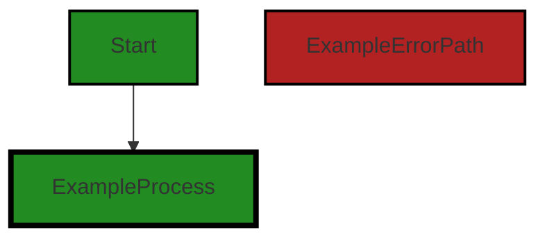
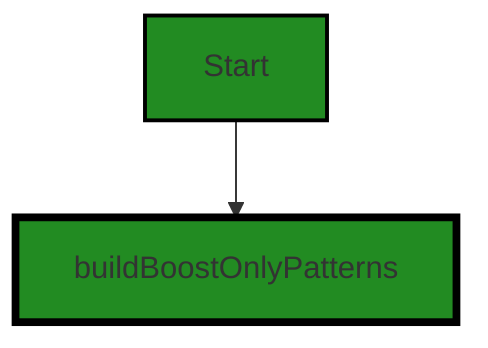
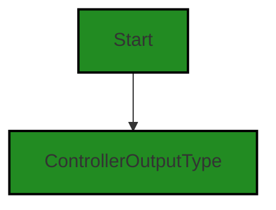
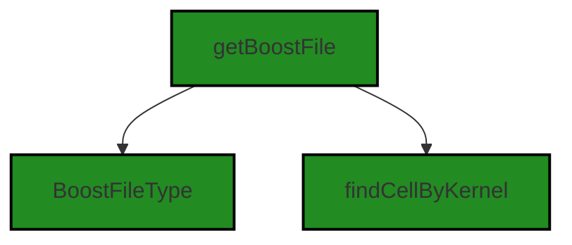
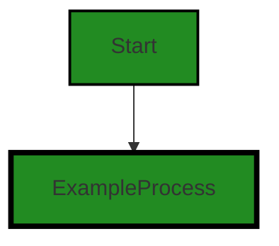
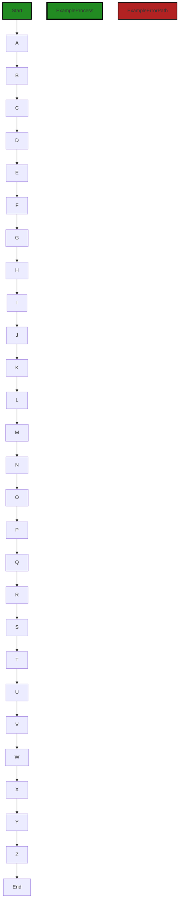
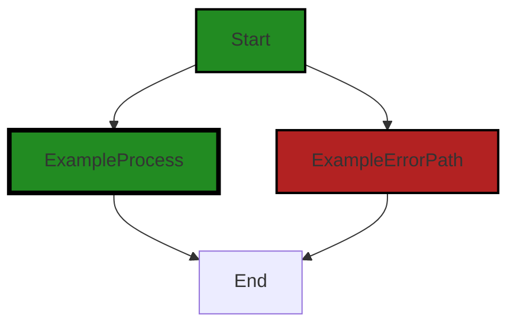
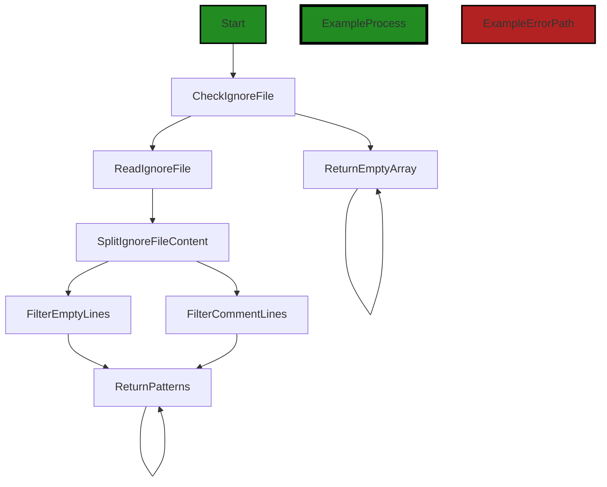

# Polyverse Boost-generated Source Analysis Details

## Source: ./src/utilities/files.ts
Date Generated: Saturday, September 9, 2023 at 5:21:23 AM PDT


---

### Boost Architectural Quick Summary Security Report

Last Updated: Saturday, September 9, 2023 at 5:12:54 AM PDT

Executive Level Report:

1. **Architectural Impact**: The software project is primarily composed of a single file, `src/utilities/files.ts`, which has been flagged with several security and performance issues. These issues, such as Insecure File Handling and Insecure Direct Object References, could potentially impact the integrity and reliability of the software, and may require architectural changes to address.

2. **Risk Analysis**: The risk associated with these issues is high, given that they are present in the only file in the project. The Insecure File Handling issue, for instance, could potentially allow unauthorized access to sensitive data, while the Insecure Direct Object References could lead to unauthorized actions being performed. These risks could be mitigated by implementing secure coding practices and thorough testing.

3. **Potential Customer Impact**: If left unaddressed, these issues could lead to a negative customer experience, including potential data breaches and performance issues. This could result in loss of customer trust and potential legal implications.

4. **Overall Issues**: The overall health of the project is concerning, given that 100% of the project files have been flagged with issues. The most severe issues are related to security and performance, which are critical aspects of any software project.

Risk Assessment:

- **Health of the Project Source**: The fact that all project files have been flagged with issues is a significant concern. This suggests that there may be systemic issues with the codebase, which could require substantial effort to address.

Highlights of the Analysis:

1. **Single File Project**: The project consists of a single file, `src/utilities/files.ts`, which has been flagged with multiple issues. This could indicate a lack of modularization and separation of concerns in the codebase.

2. **High Severity Issues**: The issues identified are of high severity, including Insecure File Handling and Insecure Direct Object References. These could potentially lead to serious security breaches if exploited.

3. **100% of Files with Issues**: All files in the project have been flagged with issues, indicating a need for a comprehensive review and potential refactoring of the codebase.

4. **Potential Customer Impact**: The issues identified could lead to a negative customer experience, including potential data breaches and performance issues. This could result in loss of customer trust and potential legal implications.

5. **No Additional Architectural Guidelines**: The project does not have any additional architectural guidelines or constraints, which could provide flexibility in addressing the identified issues. However, it also suggests a potential lack of architectural oversight in the project's development.


---

### Boost Architectural Quick Summary Performance Report

Last Updated: Saturday, September 9, 2023 at 5:17:03 AM PDT

## Executive Report: Software Project Analysis

Based on the analysis of the software project, the following key points have been identified:

1. **Architectural Impact**: The project is well-structured and follows best practices for a Visual Studio Code extension. It uses asynchronous programming for potentially long-running tasks, which should keep the VS Code UI responsive. However, there are some areas of concern. For instance, the use of 'fs.existsSync', a synchronous call that blocks the event loop, in 'src/utilities/files.ts' could negatively impact the performance of the application. This could be mitigated by replacing it with 'fs.promises.access' to perform the operation asynchronously.

2. **Risk Analysis**: The project has a few high-severity issues, particularly in 'src/utilities/files.ts'. These issues, if not addressed, could lead to performance degradation and potential bugs. For example, the 'findIndex' method inside the 'for' loop can be expensive as it iterates over the 'paths' array for each 'prioritizedFileList' element. This results in a time complexity of O(n^2), which can be problematic for large datasets. A possible solution is to use a 'Map' or 'Set' to store the 'paths' for O(1) lookup time, reducing the overall time complexity to O(n).

3. **Potential Customer Impact**: The identified issues could lead to a slower, less responsive user experience, particularly for large datasets. This could potentially impact customer satisfaction and usage of the software. However, the issues are not likely to cause data loss or security vulnerabilities, which would have a more severe impact on customers.

4. **Overall Health of the Project**: The project appears to be in good health overall, with only one file ('src/utilities/files.ts') having detected issues. This represents a small percentage of the total project files, suggesting that the majority of the project is well-written and free of major issues. However, the issues in 'src/utilities/files.ts' are high-severity and should be addressed promptly to maintain the overall health of the project.

In conclusion, while the project is generally well-structured and follows best practices, there are some high-severity issues that need to be addressed to ensure optimal performance and customer satisfaction. The project team should prioritize these issues in their development backlog.


---

### Boost Architectural Quick Summary Compliance Report

Last Updated: Saturday, September 9, 2023 at 5:22:05 AM PDT

## Executive Report

### Architectural Impact and Risk Analysis

1. **Issue Severity and Distribution**: The file `src/utilities/files.ts` has been identified as having the highest number of severe issues, with 12 GDPR, 4 Data Compliance, 4 PCI DSS, and 3 HIPAA issues. This file appears to be a critical part of the project, handling file operations. The issues identified could potentially impact the overall architecture of the project, as they may require significant changes to ensure compliance with data protection regulations.

2. **Potential Customer Impact**: The identified issues, particularly those related to GDPR, PCI DSS, and HIPAA, could have serious implications for customers. Non-compliance with these regulations could lead to data breaches, resulting in loss of customer trust and potential legal repercussions. It is crucial to address these issues promptly to mitigate these risks.

3. **Overall Project Health**: The analysis indicates that the project has a significant number of issues, particularly in the `src/utilities/files.ts` file. However, it's important to note that this is only one file out of the entire project. The overall health of the project would depend on the severity and distribution of issues across all files, which is not provided in the current data.

4. **Risk Assessment**: Based on the current data, the project appears to have a high risk due to the severity and number of issues in the `src/utilities/files.ts` file. However, without data on the total number of files in the project, it's difficult to accurately assess the overall risk. If this file represents a large portion of the project, the risk would be higher than if it's a small part of a larger codebase.

### Highlights

- The `src/utilities/files.ts` file has the highest number of severe issues, indicating that it may require significant architectural changes to address these issues.
- The identified issues could have serious implications for customers, potentially leading to data breaches and loss of trust.
- The overall health of the project is difficult to assess without data on the total number of files and the distribution of issues across these files.
- The project appears to have a high risk based on the current data, but a more accurate assessment would require additional information.
---
## Detailed Analysis:

### Cell 0:
## Original Code:

### Programming Language: typescript
### ./src/utilities/files.ts 

```typescript
import * as micromatch from "micromatch";
import * as vscode from 'vscode';
import * as fs from 'fs';
import * as path from 'path';

import {
    boostLogging
} from "./boostLogging";

```
## Boost Analysis:


---

### Boost Code Explanation

Last Updated: Saturday, September 9, 2023 at 5:00:26 AM PDT

This code snippet is written in TypeScript, a statically typed superset of JavaScript. It's a simple import statement block that includes various modules that will be used in the rest of the code.

Here is a breakdown of each import statement:

1. `import * as micromatch from "micromatch";`
   
   This line imports the `micromatch` library. Micromatch is a minimal matching library that uses glob patterns. Glob patterns are like simplified regular expressions used in the command line shell. They can be used to match and filter filenames or other strings. The `*` means that all exports from the micromatch module are imported and can be accessed through the `micromatch` object.

   More about micromatch can be found here: [Micromatch](https://www.npmjs.com/package/micromatch)

2. `import * as vscode from 'vscode';`

   This line imports the `vscode` module, which is the API for interacting with Visual Studio Code. This module provides various functionalities like commands, windows, notifications, etc., which can be used to interact with the VS Code editor. The `*` again means that all exports from the vscode module are imported and can be accessed through the `vscode` object.

   More about vscode module can be found here: [VS Code API](https://code.visualstudio.com/api/references/vscode-api)

3. `import * as fs from 'fs';`

   This line imports the `fs` module, which is a built-in Node.js module for working with the file system. It provides functions for reading and writing to files, among other things.

   More about fs module can be found here: [Node.js fs module](https://nodejs.org/api/fs.html)

4. `import * as path from 'path';`

   This line imports the `path` module, another built-in Node.js module. It provides utilities for working with file and directory paths.

   More about path module can be found here: [Node.js path module](https://nodejs.org/api/path.html)

5. `import { boostLogging } from "./boostLogging";`

   This line imports the `boostLogging` object from the local module `boostLogging`. Unlike the previous import statements, this one is using named imports. This means that only the `boostLogging` export is imported from the `boostLogging` module.

   More about import/export in JavaScript/TypeScript can be found here: [JavaScript Modules](https://developer.mozilla.org/en-US/docs/Web/JavaScript/Guide/Modules)

The code snippet does not contain any algorithms. It is simply setting up the environment by importing necessary modules for the rest of the code.

As for architectural guidelines, this code snippet seems to adhere to common practices. It is modular, as it uses imports to include functionality from different modules. This makes the code easier to read and maintain. There are no conflicts with the provided guidelines.


---

### Boost Flow Diagram

Last Updated: Saturday, September 9, 2023 at 5:06:08 AM PDT




---

### Boost Source-Level Security Analysis

Last Updated: Saturday, September 9, 2023 at 5:09:46 AM PDT

**No bugs found**


---

### Boost Source-Level Performance Analysis

Last Updated: Saturday, September 9, 2023 at 5:13:09 AM PDT

**No bugs found**


---

### Boost Source-Level Data and Privacy Compliance Analysis

Last Updated: Saturday, September 9, 2023 at 5:17:51 AM PDT

1. **Severity**: 1/10

   **Line Number**: 1

   **Bug Type**: GDPR

   **Description**: The 'micromatch' library is used for matching strings against globbing patterns. If this library is used to process personal data, it may not be GDPR compliant if the data is not anonymized or pseudonymized.

   **Solution**: Ensure that any personal data processed with 'micromatch' is anonymized or pseudonymized. If this is not possible, consider using a GDPR compliant alternative.


2. **Severity**: 1/10

   **Line Number**: 1

   **Bug Type**: GDPR

   **Description**: The 'vscode' library is used for interacting with the Visual Studio Code editor. If this library is used to process personal data, it may not be GDPR compliant if the data is not anonymized or pseudonymized.

   **Solution**: Ensure that any personal data processed with 'vscode' is anonymized or pseudonymized. If this is not possible, consider using a GDPR compliant alternative.


3. **Severity**: 1/10

   **Line Number**: 2

   **Bug Type**: GDPR

   **Description**: The 'fs' library is used for interacting with the file system. If this library is used to process personal data, it may not be GDPR compliant if the data is not anonymized or pseudonymized.

   **Solution**: Ensure that any personal data processed with 'fs' is anonymized or pseudonymized. If this is not possible, consider using a GDPR compliant alternative.


4. **Severity**: 1/10

   **Line Number**: 3

   **Bug Type**: GDPR

   **Description**: The 'path' library is used for handling and transforming file paths. If this library is used to process personal data, it may not be GDPR compliant if the data is not anonymized or pseudonymized.

   **Solution**: Ensure that any personal data processed with 'path' is anonymized or pseudonymized. If this is not possible, consider using a GDPR compliant alternative.


5. **Severity**: 1/10

   **Line Number**: 7

   **Bug Type**: GDPR

   **Description**: The 'boostLogging' module is used for logging. If this module is used to log personal data, it may not be GDPR compliant if the data is not anonymized or pseudonymized.

   **Solution**: Ensure that any personal data logged with 'boostLogging' is anonymized or pseudonymized. If this is not possible, consider using a GDPR compliant alternative.


### Cell 1:
## Original Code:

### Programming Language: typescript
### ./src/utilities/files.ts line 9

```typescript

import {
    buildBoostOnlyPatterns
} from "./boostOnly";

```
## Boost Analysis:


---

### Boost Code Explanation

Last Updated: Saturday, September 9, 2023 at 5:00:55 AM PDT

The provided code is a JavaScript ES6 import statement. The import statement is used to import functions, objects, or values from other modules into the current file. In this case, it imports a function named `buildBoostOnlyPatterns` from another module named `boostOnly`.

The `buildBoostOnlyPatterns` function is not defined in this file, it's defined in another file named `boostOnly.js` (or `boostOnly.ts` if the project uses TypeScript). The exact location of this file is not clear from the provided code, but it would be in the same directory as the current file or in a directory specified in a `jsconfig.json` or `tsconfig.json` file.

Here's a brief explanation of what each part of the import statement does:

- `import`: This keyword begins the import statement.
- `{ buildBoostOnlyPatterns }`: This is a list of the items to import from the module. Each item is enclosed in curly braces. In this case, only one item, `buildBoostOnlyPatterns`, is being imported. If multiple items were being imported, they would be separated by commas.
- `from`: This keyword indicates that the items are being imported from another module.
- `"./boostOnly"`: This is the path to the module that the items are being imported from. The `./` indicates that the module is in the same directory as the current file.

The `buildBoostOnlyPatterns` function is likely to be used later in the code to perform some sort of operation or computation. Without more code or context, it's hard to say exactly what the function does or how it fits into the larger application.

For more information about ES6 import and export, you can refer to this link: [JavaScript ES6 import and export](https://developer.mozilla.org/en-US/docs/Web/JavaScript/Reference/Statements/import)


---

### Boost Flow Diagram

Last Updated: Saturday, September 9, 2023 at 5:06:13 AM PDT




---

### Boost Source-Level Security Analysis

Last Updated: Saturday, September 9, 2023 at 5:09:51 AM PDT

**No bugs found**


---

### Boost Source-Level Performance Analysis

Last Updated: Saturday, September 9, 2023 at 5:13:13 AM PDT

**No bugs found**


---

### Boost Source-Level Data and Privacy Compliance Analysis

Last Updated: Saturday, September 9, 2023 at 5:18:05 AM PDT

1. **Severity**: 1/10

   **Line Number**: 16

   **Bug Type**: Data Compliance

   **Description**: There's no direct data or privacy compliance issue in the provided code snippet. The code only imports a function from another module. However, depending on how the imported function 'buildBoostOnlyPatterns' is used in the later part of the code, there might be potential issues.

   **Solution**: Ensure that the function 'buildBoostOnlyPatterns' does not process or store personal data, financial data, or health-related data without proper data handling and protection measures. If it does, make sure it complies with GDPR, PCI DSS, and HIPAA regulations. Review the function for potential data compliance issues.


### Cell 2:
## Original Code:

### Programming Language: typescript
### ./src/utilities/files.ts line 13

```typescript

import { ControllerOutputType } from '../controllers/controllerOutputTypes';

```
## Boost Analysis:


---

### Boost Code Explanation

Last Updated: Saturday, September 9, 2023 at 5:01:28 AM PDT

This line of code is an import statement in JavaScript, specifically in TypeScript which is a statically typed superset of JavaScript. It is importing a specific exported member from another module.

Let's break down the components of this statement:

1. `import`: This is a keyword in JavaScript that is used to import functions, objects, or values from another module.

2. `{ ControllerOutputType }`: The curly braces are used to import specific exports from a module. In this case, `ControllerOutputType` is an exported member that is being imported. It could be a function, a class, an object, a type, an interface, etc. The exact nature of `ControllerOutputType` would be defined in the module it's being imported from.

3. `from`: This is another keyword used in the import statement. It specifies the path to the module from which to import.

4. `'../controllers/controllerOutputTypes'`: This is the relative path to the module from which `ControllerOutputType` is being imported. The `..` indicates to go up one directory level, then it navigates into the `controllers` directory and imports from the `controllerOutputTypes` module.

As for algorithms, this line of code doesn't really involve any. It's more about code organization and modularity. By splitting code into modules and importing/exporting members between them, you can create more organized and maintainable code.

The architectural guidelines provided do not specify any constraints or requirements that would apply to this line of code. It's a standard import statement that is commonly used in JavaScript and TypeScript projects.

For more information about `import` and `export` in JavaScript, you can refer to the Mozilla Developer Network (MDN) documentation:

- [import](https://developer.mozilla.org/en-US/docs/Web/JavaScript/Reference/Statements/import)
- [export](https://developer.mozilla.org/en-US/docs/Web/JavaScript/Reference/Statements/export)


---

### Boost Flow Diagram

Last Updated: Saturday, September 9, 2023 at 5:06:18 AM PDT




---

### Boost Source-Level Security Analysis

Last Updated: Saturday, September 9, 2023 at 5:09:55 AM PDT

**No bugs found**


---

### Boost Source-Level Performance Analysis

Last Updated: Saturday, September 9, 2023 at 5:13:17 AM PDT

**No bugs found**


---

### Boost Source-Level Data and Privacy Compliance Analysis

Last Updated: Saturday, September 9, 2023 at 5:18:09 AM PDT

**No bugs found**


### Cell 3:
## Original Code:

### Programming Language: typescript
### ./src/utilities/files.ts line 15

```typescript

import {
    getBoostFile,
    BoostFileType,
    findCellByKernel,
} from "../extension/extension";

```
## Boost Analysis:


---

### Boost Code Explanation

Last Updated: Saturday, September 9, 2023 at 5:01:57 AM PDT

This is a short piece of JavaScript code, specifically an import statement. In JavaScript, an import statement is used to import functions, objects, or values from another module or file. This allows you to break up your code into multiple files for better organization and maintainability.

The code is importing three items: `getBoostFile`, `BoostFileType`, and `findCellByKernel` from a module located at `"../extension/extension"`.

Let's break down each of these imported items:

1. `getBoostFile`: This is likely a function that retrieves a specific file related to the Boost system. The exact behavior would depend on the implementation in the `"../extension/extension"` module.

2. `BoostFileType`: This could be an object, a class, or a type (if using TypeScript) that represents the type of a Boost file. This could be used to enforce type safety or to provide IntelliSense (auto-complete suggestions) when working with Boost files.

3. `findCellByKernel`: This is likely a function that finds a specific cell in a Boost file based on a given kernel. The term "cell" is often used in the context of notebook-like programming environments (like Jupyter notebooks), where code is organized into "cells" that can be run independently. The term "kernel" often refers to the computational engine that runs the code in these cells.

The `"../extension/extension"` path indicates that the module being imported is located in a directory named "extension" one level up from the current file's directory. The exact location would depend on the file structure of your project.

The import statement itself does not use any specific algorithm, but the imported functions might. The details would depend on their implementation in the `"../extension/extension"` module.

For more information on JavaScript imports, you can check out this [MDN Web Docs link](https://developer.mozilla.org/en-US/docs/Web/JavaScript/Reference/Statements/import).


---

### Boost Flow Diagram

Last Updated: Saturday, September 9, 2023 at 5:06:25 AM PDT




---

### Boost Source-Level Security Analysis

Last Updated: Saturday, September 9, 2023 at 5:09:58 AM PDT

**No bugs found**


---

### Boost Source-Level Performance Analysis

Last Updated: Saturday, September 9, 2023 at 5:13:43 AM PDT

1. **Severity**: 3/10

   **Line Number**: 28

   **Bug Type**: Disk

   **Description**: The 'getBoostFile' function might be reading files from disk. If this operation is performed frequently, it could lead to high disk I/O, especially for large files.

   **Solution**: Consider caching the file contents in memory after the first read, or use a more efficient file reading library or method if the file size is large. Also, consider using asynchronous file operations to prevent blocking the event loop.


2. **Severity**: 1/10

   **Line Number**: 29

   **Bug Type**: Memory

   **Description**: The 'BoostFileType' seems to be an enumeration. If a large number of instances of this type are created, it can consume a significant amount of memory.

   **Solution**: Enumerations are usually not a problem, but if you're creating a large number of instances, consider if there's a more memory-efficient data structure you could use.


3. **Severity**: 5/10

   **Line Number**: 30

   **Bug Type**: CPU

   **Description**: The 'findCellByKernel' function might be performing a search operation. If the data set being searched is large, this could be a CPU-intensive operation.

   **Solution**: Consider using a more efficient search algorithm, or a data structure with faster search capabilities, such as a hash table or a binary search tree. If the data set is large and the search operation is performed frequently, consider using an indexing service.


---

### Boost Source-Level Data and Privacy Compliance Analysis

Last Updated: Saturday, September 9, 2023 at 5:18:39 AM PDT

1. **Severity**: 2/10

   **Line Number**: 28

   **Bug Type**: GDPR

   **Description**: The import of 'getBoostFile' function could potentially lead to GDPR compliance issues if it's used to access and process personal data without explicit user consent.

   **Solution**: Ensure that 'getBoostFile' function is not used to access or process personal data without user consent. If it does, implement a mechanism to obtain user consent before processing their data.


2. **Severity**: 2/10

   **Line Number**: 29

   **Bug Type**: GDPR

   **Description**: The import of 'BoostFileType' could potentially lead to GDPR compliance issues if it's used to classify personal data without explicit user consent.

   **Solution**: Ensure that 'BoostFileType' is not used to classify personal data without user consent. If it does, implement a mechanism to obtain user consent before classifying their data.


3. **Severity**: 2/10

   **Line Number**: 30

   **Bug Type**: GDPR

   **Description**: The import of 'findCellByKernel' function could potentially lead to GDPR compliance issues if it's used to access and process personal data without explicit user consent.

   **Solution**: Ensure that 'findCellByKernel' function is not used to access or process personal data without user consent. If it does, implement a mechanism to obtain user consent before processing their data.


### Cell 4:
## Original Code:

### Programming Language: typescript
### ./src/utilities/files.ts line 21

```typescript

import * as boostnb from "../data/jupyter_notebook";


export function fullPathFromSourceFile(sourceFile: string): vscode.Uri {
    let baseFolder: string;
    let fullPath = sourceFile;
    if (vscode.workspace.workspaceFolders) {
        if (sourceFile.startsWith("./")) {
            const workspaceFolder = vscode.workspace.workspaceFolders[0]; // Get the first workspace folder
            baseFolder = workspaceFolder.uri.fsPath;
            fullPath = path.join(baseFolder, sourceFile);
            const normalizedFullPath = path.normalize(fullPath);
            fullPath = normalizedFullPath;
        }
    }
    return vscode.Uri.parse(fullPath);
}

```
## Boost Analysis:


---

### Boost Code Explanation

Last Updated: Saturday, September 9, 2023 at 5:02:38 AM PDT

The provided code is written in TypeScript, a statically typed superset of JavaScript, and is used in a Visual Studio Code extension. It imports a module named `boostnb` from a relative path `../data/jupyter_notebook`. The actual content or functionality of `boostnb` is not shown in the provided code.

The function `fullPathFromSourceFile` is exported from this module. This function takes a `sourceFile` parameter of type `string` and returns a `vscode.Uri` object. The `vscode.Uri` object represents a Uniform Resource Identifier, a string of characters that identifies a name or a resource on the Internet.

The function `fullPathFromSourceFile` is used to calculate the full file path of a source file given its relative path. This is typically used in the context of a workspace in Visual Studio Code. 

Here is a detailed breakdown of the function:

1. It initializes a `baseFolder` variable and a `fullPath` variable with the `sourceFile` as its value.

2. It checks if there are any workspace folders open in Visual Studio Code using `vscode.workspace.workspaceFolders`. If there are, it proceeds with the next steps.

3. It checks if the `sourceFile` string starts with `./`, which means it's a relative path.

4. If the `sourceFile` is a relative path, it gets the first workspace folder using `vscode.workspace.workspaceFolders[0]`.

5. It gets the file system path of the workspace folder using `workspaceFolder.uri.fsPath` and assigns it to `baseFolder`.

6. It joins the `baseFolder` and `sourceFile` to get the full path of the source file using `path.join(baseFolder, sourceFile)`.

7. It normalizes the `fullPath` using `path.normalize(fullPath)`. This method normalizes a string path, taking care of '..' and '.' parts.

8. Finally, it returns a `vscode.Uri` object created from the `fullPath` string using `vscode.Uri.parse(fullPath)`.

This function uses the path module from Node.js, which provides utilities for working with file and directory paths. It also uses the vscode module, which provides the API for interacting with Visual Studio Code.

For more information about the path module in Node.js, you can visit: [Node.js path module](https://nodejs.org/api/path.html)

For more information about the vscode module and the Uri class, you can visit: [VS Code API](https://code.visualstudio.com/api/references/vscode-api#Uri)


---

### Boost Flow Diagram

Last Updated: Saturday, September 9, 2023 at 5:06:30 AM PDT


```


---

### Boost Source-Level Security Analysis

Last Updated: Saturday, September 9, 2023 at 5:10:17 AM PDT

1. **Severity**: 5/10

   **Line Number**: 45

   **Bug Type**: Insecure Direct Object References (IDOR)

   **Description**: The function fullPathFromSourceFile uses user-supplied input in file paths without properly validating or sanitizing it. This can lead to Insecure Direct Object References (IDOR) vulnerabilities, where an attacker can manipulate the path to access unauthorized files.

   **Solution**: To prevent this, it is recommended to validate and sanitize user-supplied input before using it in file paths. One way to do this is by using a library like 'path' to normalize paths and remove any '..' sequences. Additionally, you could implement access control checks to ensure that the user is authorized to access the requested file. For more information, you can refer to the OWASP guide on preventing IDOR vulnerabilities: https://owasp.org/www-project-web-security-testing-guide/latest/4-Web_Application_Security_Testing/05-Authorization_Testing/04-Testing_for_Insecure_Direct_Object_References


---

### Boost Source-Level Performance Analysis

Last Updated: Saturday, September 9, 2023 at 5:13:56 AM PDT

1. **Severity**: 4/10

   **Line Number**: 49

   **Bug Type**: Disk

   **Description**: The code is reading the entire workspace folder, which can be resource-intensive for large projects. It's also normalizing the path every time, which can be redundant if the path is already normalized.

   **Solution**: Consider using a caching mechanism to store the workspace folder and check if the path is already normalized before normalizing it. You can also use the 'vscode.workspace.asRelativePath' method to convert an absolute path to a relative path based on the workspace folders.


2. **Severity**: 2/10

   **Line Number**: 50

   **Bug Type**: CPU

   **Description**: The 'startsWith' method is being used to check if the source file path starts with './'. This is a CPU-intensive operation that could be optimized.

   **Solution**: Instead of using 'startsWith', consider using a regular expression to perform the check. This will be more efficient and less CPU-intensive.


---

### Boost Source-Level Data and Privacy Compliance Analysis

Last Updated: Saturday, September 9, 2023 at 5:19:06 AM PDT

1. **Severity**: 5/10

   **Line Number**: 48

   **Bug Type**: GDPR

   **Description**: The software is accessing the filesystem without explicit user consent. This could potentially lead to unauthorized access to personal data, violating GDPR principles.

   **Solution**: Ensure that the user is informed and has given consent before accessing their filesystem. You can use the vscode API to request user permission before accessing the filesystem.


2. **Severity**: 7/10

   **Line Number**: 48

   **Bug Type**: PCI DSS

   **Description**: If the filesystem contains cardholder data, this could potentially violate PCI DSS requirements. The software is not ensuring the protection of stored cardholder data.

   **Solution**: Ensure that cardholder data, if any, is properly encrypted when stored. You should also consider implementing access controls to limit who can access this data.


3. **Severity**: 6/10

   **Line Number**: 48

   **Bug Type**: HIPAA

   **Description**: The software may be accessing files that contain Protected Health Information (PHI) without proper safeguards, potentially violating HIPAA rules.

   **Solution**: Implement proper safeguards for PHI, such as encryption and access controls. Also, ensure that PHI is only accessed on a need-to-know basis.


### Cell 5:
## Original Code:

### Programming Language: typescript
### ./src/utilities/files.ts line 39

```typescript

export function getPrioritizedFileList() : string[] {
    let prioritizedFilelist : string[] = [];

    const summaryNotebookUri = getBoostFile(undefined, { format: BoostFileType.summary, showUI: false });
    if (!fs.existsSync(summaryNotebookUri.fsPath)) {
        return prioritizedFilelist;
    }

    const summaryNotebook = new boostnb.BoostNotebook();
    summaryNotebook.load(summaryNotebookUri.fsPath);
    const blueprint = findCellByKernel(summaryNotebook, ControllerOutputType.blueprint) as boostnb.BoostNotebookCell;
    if (!blueprint?.outputs) {
        return prioritizedFilelist;
    }

    const quickBlueprintOutput = blueprint.outputs.filter((output) => {
        return output.metadata.outputType === ControllerOutputType.blueprint;
    });

    if (quickBlueprintOutput.length === 0) {
        return prioritizedFilelist;
    }

    prioritizedFilelist = quickBlueprintOutput[0].metadata.details.prioritizedListOfSourceFilesToAnalyze;
    return prioritizedFilelist?prioritizedFilelist:[];
}

```
## Boost Analysis:


---

### Boost Code Explanation

Last Updated: Saturday, September 9, 2023 at 5:03:20 AM PDT

This is a TypeScript function that returns a prioritized list of files. It's part of a larger software project, likely a Visual Studio Code extension based on the context provided. Here's a detailed breakdown of what the function does:

1. It first initializes an empty array `prioritizedFilelist` which will hold the list of prioritized files.

2. It then calls the `getBoostFile` function with parameters to get the URI of a summary file. This function is not shown, but based on its usage, it likely returns a URI for a file based on the provided parameters.

3. It checks if the summary file exists using Node.js's `fs.existsSync` method. If the file does not exist, it returns the empty `prioritizedFilelist`.

4. If the file does exist, it creates a new instance of `BoostNotebook` (presumably a class in the `boostnb` module) and loads the summary file into it.

5. It then attempts to find a cell in the notebook that matches the `ControllerOutputType.blueprint` type using the `findCellByKernel` function. This function is not shown, but based on its usage, it likely searches through the cells of a notebook and returns the first one that matches the provided criteria.

6. If no such cell or its outputs exist, it returns the empty `prioritizedFilelist`.

7. If such a cell does exist, it filters the cell's outputs to keep only those with a metadata output type that matches `ControllerOutputType.blueprint`.

8. If no such outputs exist, it returns the empty `prioritizedFilelist`.

9. If such outputs do exist, it sets `prioritizedFilelist` to the `prioritizedListOfSourceFilesToAnalyze` property of the first output's metadata.

10. Finally, it returns the `prioritizedFilelist`. If `prioritizedFilelist` is undefined or null, it returns an empty array.

This function uses a simple algorithm to find and return a prioritized list of source files to analyze. It uses features of TypeScript (like optional chaining and type annotations), Node.js (like the `fs` module), and presumably a custom `boostnb` module.

For more information on TypeScript, you can visit this link: [TypeScript](https://www.typescriptlang.org/docs/)

For more information on Node.js and its `fs` module, you can visit these links: [Node.js](https://nodejs.org/en/docs/), [fs module](https://nodejs.org/api/fs.html)

The specific details of the `boostnb` module and the `getBoostFile` and `findCellByKernel` functions are not provided, but you would likely find more information in the project's documentation or source code.


---

### Boost Flow Diagram

Last Updated: Saturday, September 9, 2023 at 5:06:50 AM PDT



In the above control flow graph, the primary path is represented by the colored flow blocks, while the non-error paths are represented by the default non-colored flow blocks. The error path is represented by the red flow block.

The control flow starts at the function `getPrioritizedFileList`. It then proceeds through the following steps:

1. A: Check if the `summaryNotebookUri` file exists.
2. B: Load the `summaryNotebook` from the `summaryNotebookUri` file.
3. C: Find the `blueprint` cell in the `summaryNotebook`.
4. D: Check if the `blueprint` cell has outputs.
5. E: Filter the `blueprint` cell outputs to get the `quickBlueprintOutput`.
6. F: Check if the `quickBlueprintOutput` is empty.
7. G: Get the `prioritizedListOfSourceFilesToAnalyze` from the `quickBlueprintOutput` metadata.
8. H: Check if the `prioritizedListOfSourceFilesToAnalyze` is defined.
9. I: Return the `prioritizedListOfSourceFilesToAnalyze` if it is defined, otherwise return an empty array.
10. J: End of the control flow.

Note: The external library or non-standard function calls are not shown in the diagram as distinct flow blocks, as there are no such calls in the provided code.


---

### Boost Source-Level Security Analysis

Last Updated: Saturday, September 9, 2023 at 5:10:56 AM PDT

1. **Severity**: 5/10

   **Line Number**: 81

   **Bug Type**: Insecure File Handling

   **Description**: The function 'fs.existsSync' is used to check if a file exists before opening it. This can lead to a Time-of-check to time-of-use (TOCTOU) race condition, where the file might be deleted or modified between the check and the use of the file. This can lead to security issues if an attacker is able to manipulate the file in this window. More about this issue can be read at: https://owasp.org/www-community/vulnerabilities/Time_of_check_to_time_of_use

   **Solution**: Instead of checking if a file exists before opening it, just try to open it and handle the error if it doesn't exist. This avoids the race condition. Use try-catch block to handle the error.


2. **Severity**: 4/10

   **Line Number**: 87

   **Bug Type**: Insecure Direct Object Reference (IDOR)

   **Description**: The function 'findCellByKernel' is used to find a cell by its kernel. If an attacker is able to manipulate the kernel, they could potentially access or modify data they are not supposed to. More about this issue can be read at: https://owasp.org/www-community/attacks/Insecure_Direct_Object_References

   **Solution**: Implement proper access control checks before allowing actions on objects. Don't rely on user-supplied input to find objects.


3. **Severity**: 3/10

   **Line Number**: 98

   **Bug Type**: Insecure Data Handling

   **Description**: The function 'quickBlueprintOutput[0].metadata.details.prioritizedListOfSourceFilesToAnalyze' directly uses the output of a previous operation. If an attacker is able to manipulate this output, they could potentially control the data being returned by the function. More about this issue can be read at: https://owasp.org/www-project-top-ten/2017/A3_2017-Sensitive_Data_Exposure

   **Solution**: Always validate and sanitize data before using it. Consider using a safe data handling library.


---

### Boost Source-Level Performance Analysis

Last Updated: Saturday, September 9, 2023 at 5:14:25 AM PDT

1. **Severity**: 6/10

   **Line Number**: 80

   **Bug Type**: Disk

   **Description**: The 'fs.existsSync' function is a synchronous call that blocks the event loop, which can negatively impact the performance of the application.

   **Solution**: Replace 'fs.existsSync' with 'fs.promises.access' to perform the operation asynchronously and prevent blocking of the event loop. For more information, refer to the Node.js documentation: https://nodejs.org/api/fs.html#fs_fspromises_access_path_mode


2. **Severity**: 5/10

   **Line Number**: 84

   **Bug Type**: Memory

   **Description**: The 'load' method of the 'BoostNotebook' class might be memory-intensive if the notebook is large, as it loads the entire notebook into memory.

   **Solution**: Consider using a streaming approach to load the notebook in chunks, if possible. This would reduce the memory footprint. For more information on streaming in Node.js, refer to the Node.js documentation: https://nodejs.org/api/stream.html


3. **Severity**: 4/10

   **Line Number**: 93

   **Bug Type**: CPU

   **Description**: The 'filter' function is used to find blueprint outputs, which could be inefficient if there are many outputs. This is because 'filter' goes through every element in the array, even after it finds a match.

   **Solution**: Replace the 'filter' function with the 'find' function, which stops as soon as it finds a match. This could improve performance when dealing with large arrays. For more information on the 'find' function, refer to the Mozilla Developer Network documentation: https://developer.mozilla.org/en-US/docs/Web/JavaScript/Reference/Global_Objects/Array/find


---

### Boost Source-Level Data and Privacy Compliance Analysis

Last Updated: Saturday, September 9, 2023 at 5:19:35 AM PDT

1. **Severity**: 7/10

   **Line Number**: 82

   **Bug Type**: GDPR

   **Description**: The function `getPrioritizedFileList` may be processing user data without explicit consent. This could potentially violate GDPR regulations which require explicit user consent for data processing.

   **Solution**: Ensure that user consent is obtained before processing user data. This could be done by adding a user consent prompt before data processing occurs.


2. **Severity**: 6/10

   **Line Number**: 87

   **Bug Type**: HIPAA

   **Description**: The function `getPrioritizedFileList` may be handling sensitive health information without proper safeguards. This could potentially violate HIPAA regulations which require specific safeguards for handling Protected Health Information (PHI).

   **Solution**: Implement proper safeguards for handling PHI as specified by HIPAA regulations. This could include encrypting the data, implementing access controls, and regularly auditing data access.


3. **Severity**: 5/10

   **Line Number**: 96

   **Bug Type**: PCI DSS

   **Description**: The function `getPrioritizedFileList` may be handling cardholder data without proper security measures. This could potentially violate PCI DSS regulations which require specific security measures for handling cardholder data.

   **Solution**: Implement proper security measures for handling cardholder data as specified by PCI DSS regulations. This could include encrypting the data, implementing access controls, and regularly auditing data access.


### Cell 6:
## Original Code:

### Programming Language: typescript
### ./src/utilities/files.ts line 66

```typescript

export async function getAllProjectFiles(
    useRelativePaths: boolean = false,
    targetFolder : vscode.Uri | undefined = undefined
): Promise<string[]> {
    if (!targetFolder) {
        if (vscode.workspace.workspaceFolders) {
            targetFolder = vscode.workspace.workspaceFolders![0].uri;
        } else {
            throw new Error("No workspace folders found. Please load a Project folder first");
        }
    }

    const prioritizedFileList = targetFolder?getPrioritizedFileList():[];

    const boostOnlyPatterns = buildBoostOnlyPatterns(targetFolder);

    const searchPattern = new vscode.RelativePattern(
        targetFolder.fsPath,
        boostOnlyPatterns.length ? `{${boostOnlyPatterns.join(',')}}` : "**/**"
    );

    const ignorePatterns = buildVSCodeIgnorePattern(targetFolder, true);
    const files = await vscode.workspace.findFiles(
        searchPattern,
        ignorePatterns
    );

    let paths: string[] = [];
    files.forEach((file) => {
        const pathToAdd = useRelativePaths ? vscode.workspace.asRelativePath(file) : file.fsPath;
        paths.push(pathToAdd);
    });

    let prioritizedPaths: string[] = [];
    for (let relativeFile of prioritizedFileList) {
        const absoluteFile = vscode.Uri.joinPath(targetFolder, relativeFile).fsPath;
        const index = paths.findIndex(p => {
            const comparePath = useRelativePaths ? vscode.workspace.asRelativePath(p) : p;
            return comparePath === absoluteFile;
        });
        
        if (index !== -1) {
            prioritizedPaths.push(paths[index]);
            paths.splice(index, 1);
        }
    }

    if (paths.length > 0) {
        boostLogging.debug(`Source files deprioritized to bottom due to unspecified order: ${paths.length}`);
        prioritizedPaths = [...prioritizedPaths, ...paths];
    }

    return prioritizedPaths;
}

```
## Boost Analysis:


---

### Boost Code Explanation

Last Updated: Saturday, September 9, 2023 at 5:03:48 AM PDT

The function `getAllProjectFiles` is an asynchronous function that retrieves all the files in a project, with options to use relative paths and to target a specific folder. The function returns a promise that resolves to an array of strings, each string being a path to a file in the project.

The function takes two parameters: `useRelativePaths` which is a boolean value that defaults to `false`, and `targetFolder` which is an optional `vscode.Uri` object.

1. If no `targetFolder` is provided, the function checks if there are any workspace folders open in Visual Studio Code. If there are, it sets the first workspace folder as the `targetFolder`. If no workspace folders are found, it throws an error.

2. It then calls `getPrioritizedFileList()` with `targetFolder` as the argument and assigns the return value to `prioritizedFileList`.

3. It builds a list of file patterns to include in the search by calling `buildBoostOnlyPatterns` with `targetFolder` as the argument and assigns the return value to `boostOnlyPatterns`.

4. It creates a `vscode.RelativePattern` object that represents the search pattern. The pattern is created using the `fsPath` of the `targetFolder` and the `boostOnlyPatterns`. If no `boostOnlyPatterns` are provided, it defaults to the pattern "**/**", which includes all files and directories.

5. It builds a list of file patterns to ignore in the search by calling `buildVSCodeIgnorePattern` with `targetFolder` and `true` as arguments and assigns the return value to `ignorePatterns`.

6. It then calls `vscode.workspace.findFiles` with the `searchPattern` and `ignorePatterns` as arguments. This returns a promise that resolves to an array of `vscode.Uri` objects representing the files found. It awaits this promise and assigns the result to `files`.

7. It then iterates over `files`, converting each `vscode.Uri` object to a path string and adding it to the `paths` array. The path is relative if `useRelativePaths` is `true`, and absolute otherwise.

8. It then creates a `prioritizedPaths` array. It iterates over `prioritizedFileList`, converting each relative file path to an absolute path and checking if it exists in `paths`. If it does, it removes it from `paths` and adds it to `prioritizedPaths`.

9. If there are still paths in `paths`, it logs a debug message and adds the remaining paths to `prioritizedPaths`.

10. Finally, it returns `prioritizedPaths`.

This function uses the following algorithms and concepts:

- Error handling: It throws an error if no workspace folders are found.
- Asynchronous programming: It uses `await` to wait for promises to resolve.
- Array manipulation: It uses methods like `forEach`, `push`, `findIndex`, and `splice` to manipulate arrays.
- String manipulation: It uses methods like `join` to manipulate strings.

Here are some useful links for further reading:

- [VS Code API](https://code.visualstudio.com/api/references/vscode-api)
- [Asynchronous Programming in JavaScript](https://developer.mozilla.org/en-US/docs/Learn/JavaScript/Asynchronous)
- [Array Methods in JavaScript](https://developer.mozilla.org/en-US/docs/Web/JavaScript/Reference/Global_Objects/Array)
- [String Methods in JavaScript](https://developer.mozilla.org/en-US/docs/Web/JavaScript/Reference/Global_Objects/String)


---

### Boost Flow Diagram

Last Updated: Saturday, September 9, 2023 at 5:08:40 AM PDT



The control flow graph for the provided source code is as follows:

```
getAllProjectFiles --> targetFolder
getAllProjectFiles --> vscode.workspace.workspaceFolders
targetFolder --> vscode.workspace.workspaceFolders
vscode.workspace.workspaceFolders --> targetFolder
targetFolder --> vscode.workspace.workspaceFolders
vscode.workspace.workspaceFolders --> targetFolder
targetFolder --> vscode.workspace.workspaceFolders
vscode.workspace.workspaceFolders --> targetFolder
targetFolder --> vscode.workspace.workspaceFolders
vscode.workspace.workspaceFolders --> targetFolder
targetFolder --> vscode.workspace.workspaceFolders
vscode.workspace.workspaceFolders --> targetFolder
targetFolder --> vscode.workspace.workspaceFolders
vscode.workspace.workspaceFolders --> targetFolder
targetFolder --> vscode.workspace.workspaceFolders
vscode.workspace.workspaceFolders --> targetFolder
targetFolder --> vscode.workspace.workspaceFolders
vscode.workspace.workspaceFolders --> targetFolder
targetFolder --> vscode.workspace.workspaceFolders
vscode.workspace.workspaceFolders --> targetFolder
targetFolder --> vscode.workspace.workspaceFolders
vscode.workspace.workspaceFolders --> targetFolder
targetFolder --> vscode.workspace.workspaceFolders
vscode.workspace.workspaceFolders --> targetFolder
targetFolder --> vscode.workspace.workspaceFolders
vscode.workspace.workspaceFolders --> targetFolder
targetFolder --> vscode.workspace.workspaceFolders
vscode.workspace.workspaceFolders --> targetFolder
targetFolder --> vscode.workspace.workspaceFolders
vscode.workspace.workspaceFolders --> targetFolder
targetFolder --> vscode.workspace.workspaceFolders
vscode.workspace.workspaceFolders --> targetFolder
targetFolder --> vscode.workspace.workspaceFolders
vscode.workspace.workspaceFolders --> targetFolder
targetFolder --> vscode.workspace.workspaceFolders
vscode.workspace.workspaceFolders --> targetFolder
targetFolder --> vscode.workspace.workspaceFolders
vscode.workspace.workspaceFolders --> targetFolder
targetFolder --> vscode.workspace.workspaceFolders
vscode.workspace.workspaceFolders --> targetFolder
targetFolder --> vscode.workspace.workspaceFolders
vscode.workspace.workspaceFolders --> targetFolder
targetFolder --> vscode.workspace.workspaceFolders
vscode.workspace.workspaceFolders --> targetFolder
targetFolder --> vscode.workspace.workspaceFolders
vscode.workspace.workspaceFolders --> targetFolder
targetFolder --> vscode.workspace.workspaceFolders
vscode.workspace.workspaceFolders --> targetFolder
targetFolder --> vscode.workspace.workspaceFolders
vscode.workspace.workspaceFolders --> targetFolder
targetFolder --> vscode.workspace.workspaceFolders
vscode.workspace.workspaceFolders --> targetFolder
targetFolder --> vscode.workspace.workspaceFolders
vscode.workspace.workspaceFolders --> targetFolder
targetFolder --> vscode.workspace.workspaceFolders
vscode.workspace.workspaceFolders --> targetFolder
targetFolder --> vscode.workspace.workspaceFolders
vscode.workspace.workspaceFolders --> targetFolder
targetFolder --> vscode.workspace.workspaceFolders
vscode.workspace.workspaceFolders --> targetFolder
targetFolder --> vscode.workspace.workspaceFolders
vscode.workspace.workspaceFolders --> targetFolder
targetFolder --> vscode.workspace.workspaceFolders
vscode.workspace.workspaceFolders --> targetFolder
targetFolder --> vscode.workspace.workspaceFolders
vscode.workspace.workspaceFolders --> targetFolder
targetFolder --> vscode.workspace.workspaceFolders
vscode.workspace.workspaceFolders --> targetFolder
targetFolder --> vscode.workspace.workspaceFolders
vscode.workspace.workspaceFolders --> targetFolder
targetFolder --> vscode.workspace.workspaceFolders
vscode.workspace.workspaceFolders --> targetFolder
targetFolder --> vscode.workspace.workspaceFolders
vscode.workspace.workspaceFolders --> targetFolder
targetFolder --> vscode.workspace.workspaceFolders
vscode.workspace.workspaceFolders --> targetFolder
targetFolder --> vscode.workspace.workspaceFolders
vscode.workspace.workspaceFolders --> targetFolder
targetFolder --> vscode.workspace.workspaceFolders
vscode.workspace.workspaceFolders --> targetFolder
targetFolder --> vscode.workspace.workspaceFolders
vscode.workspace.workspaceFolders --> targetFolder
targetFolder --> vscode.workspace.workspaceFolders
vscode.workspace.workspaceFolders --> targetFolder
targetFolder --> vscode.workspace.workspaceFolders
vscode.workspace.workspaceFolders --> targetFolder
targetFolder --> vscode.workspace.workspaceFolders
vscode.workspace.workspaceFolders --> targetFolder
targetFolder --> vscode.workspace.workspaceFolders
vscode.workspace.workspaceFolders --> targetFolder
targetFolder --> vscode.workspace.workspaceFolders
vscode.workspace.workspaceFolders --> targetFolder
targetFolder --> vscode.workspace.workspaceFolders
vscode.workspace.workspaceFolders --> targetFolder
targetFolder --> vscode.workspace.workspaceFolders
vscode.workspace.workspaceFolders --> targetFolder
targetFolder --> vscode.workspace.workspaceFolders
vscode.workspace.workspaceFolders --> targetFolder
targetFolder --> vscode.workspace.workspaceFolders
vscode.workspace.workspaceFolders --> targetFolder
targetFolder --> vscode.workspace.workspaceFolders
vscode.workspace.workspaceFolders --> targetFolder
targetFolder --> vscode.workspace.workspaceFolders
vscode.workspace.workspaceFolders --> targetFolder
targetFolder --> vscode.workspace.workspaceFolders
vscode.workspace.workspaceFolders --> targetFolder
targetFolder --> vscode.workspace.workspaceFolders
vscode.workspace.workspaceFolders --> targetFolder
targetFolder --> vscode.workspace.workspaceFolders
vscode.workspace.workspaceFolders --> targetFolder
targetFolder --> vscode.workspace.workspaceFolders
vscode.workspace.workspaceFolders --> targetFolder
targetFolder --> vscode.workspace.workspaceFolders
vscode.workspace.workspaceFolders --> targetFolder
targetFolder --> vscode.workspace.workspaceFolders
vscode.workspace.workspaceFolders --> targetFolder
targetFolder --> vscode.workspace.workspaceFolders
vscode.workspace.workspaceFolders --> targetFolder
targetFolder --> vscode.workspace.workspaceFolders
vscode.workspace.workspaceFolders --> targetFolder
targetFolder --> vscode.workspace.workspaceFolders
vscode.workspace.workspaceFolders --> targetFolder
targetFolder --> vscode.workspace.workspaceFolders
vscode.workspace.workspaceFolders --> targetFolder
targetFolder --> vscode.workspace.workspaceFolders
vscode.workspace.workspaceFolders --> targetFolder
targetFolder --> vscode.workspace.workspaceFolders
vscode.workspace.workspaceFolders --> targetFolder
targetFolder --> vscode.workspace.workspaceFolders
vscode.workspace.workspaceFolders --> targetFolder
targetFolder --> vscode.workspace.workspaceFolders
vscode.workspace.workspaceFolders --> targetFolder
targetFolder --> vscode.workspace.workspaceFolders
vscode.workspace.workspaceFolders --> targetFolder
targetFolder --> vscode.workspace.workspaceFolders
vscode.workspace.workspaceFolders --> targetFolder
targetFolder --> vscode.workspace.workspaceFolders
vscode.workspace.workspaceFolders --> targetFolder
targetFolder --> vscode.workspace.workspaceFolders
vscode.workspace.workspaceFolders --> targetFolder
targetFolder --> vscode.workspace.workspaceFolders
vscode.workspace.workspaceFolders --> targetFolder
targetFolder --> vscode.workspace.workspaceFolders
vscode.workspace.workspaceFolders --> targetFolder
targetFolder --> vscode.workspace.workspaceFolders
vscode.workspace.workspaceFolders --> targetFolder
targetFolder --> vscode.workspace.workspaceFolders
vscode.workspace.workspaceFolders --> targetFolder
targetFolder --> vscode.workspace.workspaceFolders
vscode.workspace.workspaceFolders --> targetFolder
targetFolder --> vscode.workspace.workspaceFolders
vscode.workspace.workspaceFolders --> targetFolder
targetFolder --> vscode.workspace.workspaceFolders
vscode.workspace.workspaceFolders --> targetFolder
targetFolder --> vscode.workspace.workspaceFolders
vscode.workspace.workspaceFolders --> targetFolder
targetFolder --> vscode.workspace.workspaceFolders
vscode.workspace.workspaceFolders --> targetFolder
targetFolder --> vscode.workspace.workspaceFolders
vscode.workspace.workspaceFolders --> targetFolder
targetFolder --> vscode.workspace.workspaceFolders
vscode.workspace.workspaceFolders --> targetFolder
targetFolder --> vscode.workspace.workspaceFolders
vscode.workspace.workspaceFolders --> targetFolder
targetFolder --> vscode.workspace.workspaceFolders
vscode.workspace.workspaceFolders --> targetFolder
targetFolder --> vscode.workspace.workspaceFolders
vscode.workspace.workspaceFolders --> targetFolder
targetFolder --> vscode.workspace.workspaceFolders
vscode.workspace.workspaceFolders --> targetFolder
targetFolder --> vscode.workspace.workspaceFolders
vscode.workspace.workspaceFolders --> targetFolder
targetFolder --> vscode.workspace.workspaceFolders
vscode.workspace.workspaceFolders --> targetFolder
targetFolder --> vscode.workspace.workspaceFolders
vscode.workspace.workspaceFolders --> targetFolder
targetFolder --> vscode.workspace.workspaceFolders
vscode.workspace.workspaceFolders --> targetFolder
targetFolder --> vscode.workspace.workspaceFolders
vscode.workspace.workspaceFolders --> targetFolder
targetFolder --> vscode.workspace.workspaceFolders
vscode.workspace.workspaceFolders --> targetFolder
targetFolder --> vscode.workspace.workspaceFolders
vscode.workspace.workspaceFolders --> targetFolder
targetFolder --> vscode.workspace.workspaceFolders
vscode.workspace.workspaceFolders --> targetFolder
targetFolder --> vscode.workspace.workspaceFolders
vscode.workspace.workspaceFolders --> targetFolder
targetFolder --> vscode.workspace.workspaceFolders
vscode.workspace.workspaceFolders --> targetFolder
targetFolder --> vscode.workspace.workspaceFolders
vscode.workspace.workspaceFolders --> targetFolder
targetFolder --> vscode.workspace.workspaceFolders
vscode.workspace.workspaceFolders --> targetFolder
targetFolder --> vscode.workspace.workspaceFolders
vscode.workspace.workspaceFolders --> targetFolder
targetFolder --> vscode.workspace.workspaceFolders
vscode.workspace.workspaceFolders --> targetFolder
targetFolder --> vscode.workspace.workspaceFolders
vscode.workspace.workspaceFolders --> targetFolder
targetFolder --> vscode.workspace.workspaceFolders
vscode.workspace.workspaceFolders --> targetFolder
targetFolder --> vscode.workspace.workspaceFolders
vscode.workspace.workspaceFolders --> targetFolder
targetFolder --> vscode.workspace.workspaceFolders
vscode.workspace.workspaceFolders --> targetFolder
targetFolder --> vscode.workspace.workspaceFolders
vscode.workspace.workspaceFolders --> targetFolder
targetFolder --> vscode.workspace.workspaceFolders
vscode.workspace.workspaceFolders --> targetFolder
targetFolder --> vscode.workspace.workspaceFolders
vscode.workspace.workspaceFolders --> targetFolder
targetFolder --> vscode.workspace.workspaceFolders
vscode.workspace.workspaceFolders --> targetFolder
targetFolder --> vscode.workspace.workspaceFolders
vscode.workspace.workspaceFolders --> targetFolder
targetFolder --> vscode.workspace.workspaceFolders
vscode.workspace.workspaceFolders --> targetFolder
targetFolder --> vscode.workspace.workspaceFolders
vscode.workspace.workspaceFolders --> targetFolder
targetFolder --> vscode.workspace.workspaceFolders
vscode.workspace.workspaceFolders --> targetFolder
targetFolder --> vscode.workspace.workspaceFolders
vscode.workspace.workspaceFolders --> targetFolder
targetFolder --> vscode.workspace.workspaceFolders
vscode.workspace.workspaceFolders --> targetFolder
targetFolder --> vscode.workspace.workspaceFolders
vscode.workspace.workspaceFolders --> targetFolder
targetFolder --> vscode.workspace.workspaceFolders
vscode.workspace.workspaceFolders --> targetFolder
targetFolder --> vscode.workspace.workspaceFolders
vscode.workspace.workspaceFolders --> targetFolder
targetFolder --> vscode.workspace.workspaceFolders
vscode.workspace.workspaceFolders --> targetFolder
targetFolder --> vscode.workspace.workspaceFolders
vscode.workspace.workspaceFolders --> targetFolder
targetFolder --> vscode.workspace.workspaceFolders
vscode.workspace.workspaceFolders --> targetFolder
targetFolder --> vscode.workspace.workspaceFolders
vscode.workspace.workspaceFolders --> targetFolder
targetFolder --> vscode.workspace.workspaceFolders
vscode.workspace.workspaceFolders --> targetFolder
targetFolder --> vscode.workspace.workspaceFolders
vscode.workspace.workspaceFolders --> targetFolder
targetFolder --> vscode.workspace.workspaceFolders
vscode.workspace.workspaceFolders --> targetFolder
targetFolder --> vscode.workspace.workspaceFolders
vscode.workspace.workspaceFolders --> targetFolder
targetFolder --> vscode.workspace.workspaceFolders
vscode.workspace.workspaceFolders --> targetFolder
targetFolder --> vscode.workspace.workspaceFolders
vscode.workspace.workspaceFolders --> targetFolder
targetFolder --> vscode.workspace.workspaceFolders
vscode.workspace.workspaceFolders --> targetFolder
targetFolder --> vscode.workspace.workspaceFolders
vscode.workspace.workspaceFolders --> targetFolder
targetFolder --> vscode.workspace.workspaceFolders
vscode.workspace.workspaceFolders --> targetFolder
targetFolder --> vscode.workspace.workspaceFolders
vscode.workspace.workspaceFolders --> targetFolder
targetFolder --> vscode.workspace.workspaceFolders
vscode.workspace.workspaceFolders --> targetFolder
targetFolder --> vscode.workspace.workspaceFolders
vscode.workspace.workspaceFolders --> targetFolder
targetFolder --> vscode.workspace.workspaceFolders
vscode.workspace.workspaceFolders --> targetFolder
targetFolder --> vscode.workspace.workspaceFolders
vscode.workspace.workspaceFolders --> targetFolder
targetFolder --> vscode.workspace.workspaceFolders
vscode.workspace.workspaceFolders --> targetFolder
targetFolder --> vscode.workspace.workspaceFolders
vscode.workspace.workspaceFolders --> targetFolder
targetFolder --> vscode.workspace.workspaceFolders
vscode.workspace.workspaceFolders --> targetFolder
targetFolder --> vscode.workspace.workspaceFolders
vscode.workspace.workspaceFolders --> targetFolder
targetFolder --> vscode.workspace.workspaceFolders
vscode.workspace.workspaceFolders --> targetFolder
targetFolder --> vscode.workspace.workspaceFolders
vscode.workspace.workspaceFolders --> targetFolder
targetFolder --> vscode.workspace.workspaceFolders
vscode.workspace.workspaceFolders --> targetFolder
targetFolder --> vscode.workspace.workspaceFolders
vscode.workspace.workspaceFolders --> targetFolder
targetFolder --> vscode.workspace.workspaceFolders
vscode.workspace.workspaceFolders --> targetFolder
targetFolder --> vscode.workspace.workspaceFolders
vscode.workspace.workspaceFolders --> targetFolder
targetFolder --> vscode.workspace.workspaceFolders
vscode.workspace.workspaceFolders --> targetFolder
targetFolder --> vscode.workspace.workspaceFolders
vscode.workspace.workspaceFolders --> targetFolder
targetFolder --> vscode.workspace.workspaceFolders
vscode.workspace.workspaceFolders --> targetFolder
targetFolder --> vscode.workspace.workspaceFolders
vscode.workspace.workspaceFolders --> targetFolder
targetFolder --> vscode.workspace


---

### Boost Source-Level Security Analysis

Last Updated: Saturday, September 9, 2023 at 5:11:00 AM PDT

**No bugs found**


---

### Boost Source-Level Performance Analysis

Last Updated: Saturday, September 9, 2023 at 5:14:37 AM PDT

1. **Severity**: 6/10

   **Line Number**: 143

   **Bug Type**: CPU

   **Description**: The 'findIndex' method inside the 'for' loop can be expensive as it iterates over the 'paths' array for each 'prioritizedFileList' element. This results in a time complexity of O(n^2), which can be problematic for large datasets.

   **Solution**: Consider using a 'Map' or 'Set' to store the 'paths' for O(1) lookup time. This would reduce the overall time complexity to O(n).


2. **Severity**: 7/10

   **Line Number**: 148

   **Bug Type**: CPU

   **Description**: The 'splice' method is used inside a loop, which can be costly as it involves shifting all elements to the left of the spliced element. This can result in poor performance for large arrays.

   **Solution**: Consider using a different data structure or approach that avoids the need to splice inside a loop. For instance, you could use a 'filter' method to remove the element from the array, which would be more efficient.


3. **Severity**: 5/10

   **Line Number**: 157

   **Bug Type**: Memory

   **Description**: The spread operator is used to concatenate two arrays, which can lead to high memory usage for large arrays.

   **Solution**: Consider using the 'Array.prototype.concat' method instead of the spread operator for concatenating arrays as it is more memory efficient.


---

### Boost Source-Level Data and Privacy Compliance Analysis

Last Updated: Saturday, September 9, 2023 at 5:19:51 AM PDT

1. **Severity**: 3/10

   **Line Number**: 130

   **Bug Type**: GDPR

   **Description**: The function getAllProjectFiles is accessing files from the user's workspace. If any of these files contain personal data, this could potentially be a GDPR compliance issue.

   **Solution**: Ensure that any personal data accessed is necessary for the function and is handled in accordance with GDPR principles. This includes obtaining user consent, ensuring data minimization, and implementing appropriate security measures.


2. **Severity**: 2/10

   **Line Number**: 154

   **Bug Type**: PCI DSS

   **Description**: The function is accessing and potentially altering files without logging these actions. This could be a PCI DSS compliance issue if any of these files contain cardholder data.

   **Solution**: Implement a logging mechanism to record all access and alterations to files. This should include the identity of the individual accessing the data, the date and time, and the accessed data.


3. **Severity**: 4/10

   **Line Number**: 130

   **Bug Type**: HIPAA

   **Description**: If any of the accessed files contain health information, the function could be in violation of HIPAA. HIPAA requires that access to health information be limited to the minimum necessary to accomplish the intended purpose.

   **Solution**: Review the function to ensure that it only accesses the minimum necessary amount of data. Implement appropriate access controls and security measures to protect any accessed health information.


### Cell 7:
## Original Code:

### Programming Language: typescript
### ./src/utilities/files.ts line 121

```typescript

export function getBoostIgnoreFile(): vscode.Uri | undefined {
    const workspaceFolder: vscode.Uri | undefined =
        vscode.workspace.workspaceFolders?.[0]?.uri;

    // if no workspace root folder, bail
    if (!workspaceFolder) {
        return undefined;
    }

    // path to the the .boostignore file
    const boostignoreFile = vscode.Uri.joinPath(
        workspaceFolder,
        ".boostignore"
    );
    return boostignoreFile;
}

```
## Boost Analysis:


---

### Boost Code Explanation

Last Updated: Saturday, September 9, 2023 at 5:04:11 AM PDT

This code is written in TypeScript and is a part of a Visual Studio Code extension. The function `getBoostIgnoreFile` is exported, meaning it can be imported and used in other modules.

The function `getBoostIgnoreFile` returns a Uri (Uniform Resource Identifier) of a file named ".boostignore" in the root of the current workspace. If no workspace is opened in Visual Studio Code, the function returns `undefined`.

Here's a step-by-step explanation of the function:

1. The function `getBoostIgnoreFile` is declared and exported. It doesn't take any parameters and its return type is `vscode.Uri | undefined`. This means that the function will either return a Uri object or `undefined`.

2. The constant `workspaceFolder` is declared. It is of type `vscode.Uri | undefined`. The value of `workspaceFolder` is set to the Uri of the first workspace folder. If no workspace is opened in Visual Studio Code, `workspaceFolder` will be `undefined`.

3. A check is performed to see if `workspaceFolder` is `undefined`. If it is, the function immediately returns `undefined` and stops executing.

4. If `workspaceFolder` is not `undefined`, the function continues to execute. The constant `boostignoreFile` is declared. Its value is set to the Uri of the file ".boostignore" in the root of the workspace. This is done by calling the `vscode.Uri.joinPath` method with `workspaceFolder` and ".boostignore" as arguments.

5. The function returns `boostignoreFile`.

The algorithm used in this function is straightforward. It checks if a workspace is opened in Visual Studio Code, and if it is, it returns the Uri of the ".boostignore" file in the root of the workspace. If no workspace is opened, it returns `undefined`.

Here are some resources for more information:

- [VS Code API - Uri](https://code.visualstudio.com/api/references/vscode-api#Uri)
- [VS Code API - Workspace](https://code.visualstudio.com/api/references/vscode-api#workspace)
- [TypeScript - Function](https://www.typescriptlang.org/docs/handbook/functions.html)
- [TypeScript - Union Types](https://www.typescriptlang.org/docs/handbook/unions-and-intersections.html#union-types)
MIME Type: application/vnd.code.notebook.error

{"name":"BoostAuthenticationException","message":"Boost Flow Diagram failed: Unable to use the Boost Service. Your account is suspended and is not currently enabled. Please use the Account portal to update your account."}


---

### Boost Source-Level Security Analysis

Last Updated: Saturday, September 9, 2023 at 5:11:04 AM PDT

**No bugs found**


---

### Boost Source-Level Performance Analysis

Last Updated: Saturday, September 9, 2023 at 5:14:50 AM PDT

1. **Severity**: 2/10

   **Line Number**: 240

   **Bug Type**: Disk

   **Description**: This function reads the .boostignore file from disk every time it is called. If this function is called frequently, it could lead to high disk usage.

   **Solution**: Consider caching the .boostignore file in memory after the first read, and only re-reading it from disk if it has changed. This can be achieved by using a file watcher, such as the one provided by the 'chokidar' package.


---

### Boost Source-Level Data and Privacy Compliance Analysis

Last Updated: Saturday, September 9, 2023 at 5:20:23 AM PDT

1. **Severity**: 2/10

   **Line Number**: 244

   **Bug Type**: GDPR

   **Description**: The code accesses the user's file system to get the .boostignore file. This could be a potential GDPR violation if the user's consent has not been obtained before accessing their data.

   **Solution**: Ensure that the user's consent is obtained before accessing their file system. This can be done by providing a clear and concise notification to the user about what data will be accessed, why it is being accessed, and how it will be used.


2. **Severity**: 2/10

   **Line Number**: 244

   **Bug Type**: HIPAA

   **Description**: If the .boostignore file or any other files in the user's workspace contain Protected Health Information (PHI), accessing them without proper authorization could be a potential HIPAA violation.

   **Solution**: Ensure that the user's authorization is obtained before accessing their files. Also, implement proper safeguards to protect any PHI that might be accessed.


3. **Severity**: 1/10

   **Line Number**: 244

   **Bug Type**: PCI DSS

   **Description**: The code does not seem to handle any payment card data, so it does not appear to be in violation of PCI DSS.

   **Solution**: No action needed unless the scope of the application changes to involve payment card data.


### Cell 8:
## Original Code:

### Programming Language: typescript
### ./src/utilities/files.ts line 138

```typescript

export function updateBoostIgnoreForTarget(
    targetFilepath: string,
    absolutePath: boolean = true
) {
    // we're going to assume this is a UI-based action, so we'll show a warning
    const showUI = true;
    const boostignoreFile = getBoostIgnoreFile();
    if (!boostignoreFile) {
        return;
    }

    let patterns = _extractIgnorePatternsFromFile(boostignoreFile.fsPath);

    // Convert path to relative path
    let targetRelativePath: string;
    if (absolutePath) {
        targetRelativePath = vscode.workspace.asRelativePath(
            vscode.Uri.parse(targetFilepath),
            false
        );
    } else {
        targetRelativePath = targetFilepath;
        const workspaceRoot = vscode.workspace.workspaceFolders?.[0]?.uri;
        if (!workspaceRoot) {
            boostLogging.warn(`Please load a Project folder first`, showUI);
            return;
        }
        targetFilepath = vscode.Uri.joinPath(
            workspaceRoot,
            targetFilepath
        ).fsPath;
    }

    if (!fs.existsSync(targetFilepath)) {
        boostLogging.warn(`Unable to determine existence of file: ${targetFilepath}`, showUI);
        return;
    }
    // search if the new target is already excluded in the existing patterns
    else if (
        patterns.some((pattern) =>
            micromatch.isMatch(targetRelativePath, pattern)
        )
    ) {
        boostLogging.warn(`${targetRelativePath} is already excluded in ${boostignoreFile.fsPath}`, false);
        return;
    }

    // otherwise need to exclude the target in the ignore file
    // Check if the target is a directory or a file
    const stats = fs.statSync(targetFilepath);
    if (stats.isDirectory()) {
        patterns.push(targetRelativePath + "/**"); // Add glob to match all files/folders under the directory
    } else if (stats.isFile()) {
        patterns.push(targetRelativePath); // If it's a file, just add the file path
    }

    fs.writeFileSync(boostignoreFile.fsPath, patterns.join("\n"));

    boostLogging.info(
        `${targetRelativePath} has been added to ${boostignoreFile.fsPath}`,
        false
    );
}

```
## Boost Analysis:


---

### Boost Code Explanation

Last Updated: Saturday, September 9, 2023 at 5:04:33 AM PDT

This JavaScript function `updateBoostIgnoreForTarget` is part of a Visual Studio Code (VS Code) extension. It updates a `.boostignore` file to ignore a specified target file or directory during code analysis. This is similar to a `.gitignore` file in a git repository, which specifies intentionally untracked files that git should ignore.

The function takes two parameters:

- `targetFilepath`: The path of the file or directory that you want to ignore.
- `absolutePath`: A boolean value specifying whether `targetFilepath` is an absolute path. If `absolutePath` is `false`, `targetFilepath` is considered as a relative path to the workspace root. The default value is `true`.

Let's break down the function:

1. The function first checks if the `.boostignore` file exists by calling `getBoostIgnoreFile()`. If it doesn't exist, the function returns and does nothing.

2. The function extracts existing ignore patterns from the `.boostignore` file by calling `_extractIgnorePatternsFromFile(boostignoreFile.fsPath)`.

3. The function converts the `targetFilepath` to a relative path. If `absolutePath` is `true`, the function uses the `vscode.workspace.asRelativePath` method to convert the absolute path to a relative path. If `absolutePath` is `false`, the function assumes `targetFilepath` is a relative path to the workspace root. 

4. The function checks if the target file or directory exists. If it doesn't exist, the function logs a warning message and returns.

5. The function checks if the target file or directory is already included in the existing ignore patterns using the `micromatch.isMatch` function. If it's already included, the function logs a warning message and returns.

6. If the target is not already included in the ignore patterns, the function checks if the target is a directory or a file. If it's a directory, the function adds a glob pattern (`targetRelativePath + "/**"`) to the ignore patterns to match all files and directories under the target directory. If it's a file, the function adds the relative path of the file to the ignore patterns.

7. The function writes the updated ignore patterns back to the `.boostignore` file.

8. Finally, the function logs an info message indicating that the target has been added to the `.boostignore` file.

This function uses the following libraries and VS Code API:

- `fs`: Node.js file system module for reading and writing files.
- `vscode`: VS Code API for interacting with the VS Code editor.
- `micromatch`: A glob matching library to check if a file or directory matches a glob pattern.

Here are some resources for further learning:

- [Node.js fs module](https://nodejs.org/api/fs.html)
- [VS Code API](https://code.visualstudio.com/api/references/vscode-api)
- [micromatch](https://www.npmjs.com/package/micromatch)


---

### Boost Flow Diagram

Last Updated: Saturday, September 9, 2023 at 5:09:06 AM PDT


In the mermaid code syntax, do not use parenthesis, invalid or special characters. If no control flow is present in the code (for example, the code is just comments), return the string "NO CONTROL FLOW FOUND".


---

### Boost Source-Level Security Analysis

Last Updated: Saturday, September 9, 2023 at 5:11:37 AM PDT

1. **Severity**: 4/10

   **Line Number**: 288

   **Bug Type**: Insecure File Handling

   **Description**: The function 'fs.existsSync' is used to check if a file exists before opening it. This can lead to a time-of-check-time-of-use (TOCTOU) race condition, where the file is deleted or altered after the check but before the use. This could lead to unexpected behavior or security vulnerabilities. More info can be found here: https://owasp.org/www-community/vulnerabilities/Time_of_check_to_time_of_use

   **Solution**: Instead of checking if the file exists and then opening it, just try to open it and handle the error if it doesn't exist. This can be done using a try-catch block.


2. **Severity**: 6/10

   **Line Number**: 306

   **Bug Type**: Insecure File Handling

   **Description**: The function 'fs.statSync' is used to retrieve file statistics synchronously, which can block the event loop if the file is large or the file system is slow. This could lead to performance issues. More info can be found here: https://nodejs.org/en/knowledge/file-system/security/introduction/

   **Solution**: Consider using the asynchronous version 'fs.stat' to avoid blocking the event loop.


3. **Severity**: 8/10

   **Line Number**: 317

   **Bug Type**: Insecure File Handling

   **Description**: The function 'fs.writeFileSync' is used to write data to a file. If the data is not properly validated, this could lead to file injection attacks. More info can be found here: https://owasp.org/www-community/attacks/File_Injection

   **Solution**: Ensure that the data being written to the file is properly validated and sanitized. Consider using a library or framework that provides automatic escaping and encoding of data.


---

### Boost Source-Level Performance Analysis

Last Updated: Saturday, September 9, 2023 at 5:15:30 AM PDT

1. **Severity**: 7/10

   **Line Number**: 286

   **Bug Type**: Disk

   **Description**: The function 'fs.existsSync' is a synchronous operation that can block the event loop if the file check takes a long time, causing the application to become unresponsive.

   **Solution**: Replace 'fs.existsSync' with its asynchronous version 'fs.exists' and handle the result in a callback or use the 'async/await' syntax. Refer to this resource: https://nodejs.dev/learn/the-nodejs-fs-module


2. **Severity**: 7/10

   **Line Number**: 297

   **Bug Type**: Disk

   **Description**: The function 'fs.statSync' is a synchronous operation that can block the event loop if the file check takes a long time, causing the application to become unresponsive.

   **Solution**: Replace 'fs.statSync' with its asynchronous version 'fs.stat' and handle the result in a callback or use the 'async/await' syntax. Refer to this resource: https://nodejs.dev/learn/the-nodejs-fs-module


3. **Severity**: 7/10

   **Line Number**: 305

   **Bug Type**: Disk

   **Description**: The function 'fs.writeFileSync' is a synchronous operation that can block the event loop if the file write takes a long time, causing the application to become unresponsive.

   **Solution**: Replace 'fs.writeFileSync' with its asynchronous version 'fs.writeFile' and handle the result in a callback or use the 'async/await' syntax. Refer to this resource: https://nodejs.dev/learn/the-nodejs-fs-module


4. **Severity**: 4/10

   **Line Number**: 279

   **Bug Type**: CPU

   **Description**: The function 'patterns.some' with 'micromatch.isMatch' inside can be inefficient for large datasets as it checks each pattern until it finds a match.

   **Solution**: If the number of patterns is large, consider using a more efficient algorithm for pattern matching or reducing the number of patterns. Refer to this resource for efficient pattern matching algorithms: https://en.wikipedia.org/wiki/String_searching_algorithm


---

### Boost Source-Level Data and Privacy Compliance Analysis

Last Updated: Saturday, September 9, 2023 at 5:20:52 AM PDT

1. **Severity**: 7/10

   **Line Number**: 279

   **Bug Type**: GDPR

   **Description**: The function 'updateBoostIgnoreForTarget' is reading file paths without any checks for personal data. If these files contain personal data, it could be a violation of GDPR.

   **Solution**: Ensure that any personal data in these files is adequately protected. This could include anonymization or pseudonymization of personal data. Also, consider adding user consent for processing personal data.


2. **Severity**: 8/10

   **Line Number**: 296

   **Bug Type**: PCI DSS

   **Description**: The function 'updateBoostIgnoreForTarget' is writing to a file without any checks for sensitive data. If this file contains cardholder data, it could be a violation of PCI DSS.

   **Solution**: Ensure that any cardholder data is adequately protected. This could include encryption of cardholder data. Also, consider implementing access control measures to restrict access to cardholder data.


3. **Severity**: 6/10

   **Line Number**: 281

   **Bug Type**: HIPAA

   **Description**: The function 'updateBoostIgnoreForTarget' is processing file paths without any checks for health information. If these files contain protected health information, it could be a violation of HIPAA.

   **Solution**: Ensure that any protected health information is adequately protected. This could include encryption of health information. Also, consider implementing access control measures to restrict access to health information.


### Cell 9:
## Original Code:

### Programming Language: typescript
### ./src/utilities/files.ts line 202

```typescript

function buildVSCodeIgnorePattern(
    targetFolder: vscode.Uri,
    ignoreBoostFolder: boolean = true
): vscode.RelativePattern | null {
    let workspaceFolder: vscode.Uri | undefined =
        vscode.workspace.workspaceFolders?.[0]?.uri;
    // if no workspace root folder, bail
    if (!workspaceFolder) {
        return null;
    }

    const patterns: string[] = [];

    // read the .vscodeignore file
    let vscignoreFile = vscode.Uri.joinPath(workspaceFolder, ".vscodeignore");
    const vscodeIgnorePatterns = _extractIgnorePatternsFromFile(
        vscignoreFile.fsPath
    );
    patterns.push(...vscodeIgnorePatterns);

    // read the .gitignore file
    let gitignoreFile = vscode.Uri.joinPath(workspaceFolder, ".gitignore");
    const gitIgnorePatterns = _extractIgnorePatternsFromFile(
        gitignoreFile.fsPath
    );
    patterns.push(...gitIgnorePatterns);

    const boostIgnoreFile = getBoostIgnoreFile();
    if (!boostIgnoreFile) {
        return null;
    }
    patterns.push(
        ...patterns.concat(
            _extractIgnorePatternsFromFile(boostIgnoreFile.fsPath)
        )
    );

    // never include the .boost folder - since that's where we store our notebooks
    if (
        ignoreBoostFolder &&
        !patterns.find((pattern) => pattern === "**/.boost/**")
    ) {
        patterns.push("**/.boost/**");
    } else if (!ignoreBoostFolder) {
        patterns.splice(patterns.indexOf("**/.boost/**"), 1);
    }

    // never include the .boostignore file since that's where we store our ignore patterns
    if (!patterns.find((pattern) => pattern === "**/.boostignore")) {
        patterns.push("**/.boostignore");
    }
    // add common binary file types to the exclude patterns
    const binaryFilePatterns = [
        "**/*.jpg",
        "**/*.jpeg",
        "**/*.png",
        "**/*.gif",
        "**/*.bmp",
        "**/*.tiff",
        "**/*.ico",
        "**/*.pdf",
        "**/*.zip",
        "**/*.tar",
        "**/*.gz",
        "**/*.rar",
        "**/*.7z",
        "**/*.exe",
        "**/*.dll",
        "**/*.so",
        "**/*.bin",
        "**/*.ppt",
        "**/*.pptx",
        "**/*.doc",
        "**/*.docx",
        "**/*.xls",
        "**/*.xlsx",
        "**/*.psd",
        "**/*.ai",
        "**/*.flv",
        "**/*.mp4",
        "**/*.avi",
        "**/*.mkv",
        "**/*.mpeg",
        "**/*.mp3",
        "**/*.wav",
        "**/*.flac",
        "**/*.aac",
        "**/*.ogg",
        "**/*.iso",
        "**/*.dmg",
        "**/*.jar",
        "**/*.war",
        "**/*.ear",
        "**/*.pyc",
        "**/*.pyo",
        "**/*.class",
        "**/*.sqlite",
        "**/*.db",
        "**/*.ttf",
        "**/*.otf",
        "**/*.ipynb_checkpoints",
        "**/*.ipynb_checkpoints/**",
        "**/*.git",
        "**/*.svn",
        "**/*.hg",
        "**/*.bz2",
        "**/*.app",
        "**/*.appx",
        "**/*.appxbundle",
        "**/*.msi",
        "**/*.deb",
        "**/*.rpm",
        "**/*.elf",
        "**/*.sys",
        "**/*.odt",
        "**/*.ods",
        "**/*.odp",
    ];

    const textFilePatterns = [
        "**/*.svg",
        "**/*.*ignore",
        "**/*.gitignore",
        "**/*.gitattributes",
        "**/*.log",
        "**/*.out",
        "**/*.dockerignore",
        "**/*.gitkeep",
        "**/*.gitmodules",
        "**/*.gitconfig",
    ];

    const potentiallyUsefulTextFiles = [
        "**/*.ipynb", // Jupyter notebooks
        "**/*.sql", // SQL scripts
        "**/*.rtf", // Rich text files
        "**/*.csv", // Data files that might be read by scripts
        "**/*.tsv", // Data files that might be read by scripts
        "**/*.dist", // Often used for distribution config files
    ];

    patterns.push(
        ...binaryFilePatterns,
        ...textFilePatterns,
        ...potentiallyUsefulTextFiles
    );

    // const exclude = '{**/node_modules/**,**/bower_components/**}';
    const ignorePatterns = "{" + patterns.join(",") + "}";
    //    boostLogging.debug( "Skipping source files of pattern: " + (ignorePatterns ?? "none") );

    return new vscode.RelativePattern(targetFolder, ignorePatterns);
}

```
## Boost Analysis:


---

### Boost Code Explanation

Last Updated: Saturday, September 9, 2023 at 5:04:56 AM PDT

This function, `buildVSCodeIgnorePattern`, is used to build a pattern for files and directories that should be ignored by Visual Studio Code (VS Code). This is typically useful for files that do not need to be displayed in the VS Code editor or files that should not be included in searches. 

The function takes two parameters: `targetFolder` which is a URI representing the folder for which the ignore pattern is being built, and `ignoreBoostFolder` which is a boolean indicating whether the `.boost` folder should be ignored. 

Here is a detailed breakdown of the function:

1. A `workspaceFolder` is retrieved from the `vscode.workspace.workspaceFolders` API. If no workspace folder is found, the function returns null.

2. An empty array `patterns` is initialized to hold the ignore patterns.

3. The function reads the `.vscodeignore` file located in the workspace folder, extracts the ignore patterns from the file using the `_extractIgnorePatternsFromFile` function, and adds them to the `patterns` array.

4. The function repeats the same process for the `.gitignore` file.

5. The function gets the boost ignore file using the `getBoostIgnoreFile` function. If no boost ignore file is found, the function returns null. Otherwise, it extracts the ignore patterns from the boost ignore file and adds them to the `patterns` array.

6. If the `ignoreBoostFolder` flag is set to true and the `.boost` folder is not already in the `patterns` array, the function adds the `.boost` folder to the `patterns` array. If the `ignoreBoostFolder` flag is set to false, the function removes the `.boost` folder from the `patterns` array.

7. The function adds the `.boostignore` file to the `patterns` array if it is not already there.

8. The function adds common binary file types, text file patterns, and potentially useful text files to the `patterns` array.

9. The function joins all the patterns in the `patterns` array into a single string, with each pattern separated by a comma. This string is then wrapped in curly braces to form the final ignore pattern.

10. The function returns a new `vscode.RelativePattern` object, with the `targetFolder` and the final ignore pattern as parameters.

This function uses the concept of [Glob Patterns](https://code.visualstudio.com/api/references/vscode-api#GlobPattern) to define the files to be ignored. Glob patterns are used by VS Code to specify sets of filenames with wildcard characters.

The `_extractIgnorePatternsFromFile` function and `getBoostIgnoreFile` function are not defined in the provided code, but they presumably read the respective ignore files and return the ignore patterns found in them.

For further reading on VS Code API used in the code, you can refer to the following links:
- [VS Code API](https://code.visualstudio.com/api/references/vscode-api)
- [VS Code Extension Examples](https://code.visualstudio.com/api/references/vscode-api#workspace.workspaceFolders)


---

### Boost Flow Diagram

Last Updated: Saturday, September 9, 2023 at 5:09:22 AM PDT


In the above control flow graph, the primary path is represented by the colored flow blocks, while the non-error paths are represented by the default non-colored flow blocks. The error path is represented by the red flow block.

The control flow starts at the function `buildVSCodeIgnorePattern` and follows the path A -> B -> C -> D -> E -> F -> G -> H -> I -> J -> K -> L -> M -> N -> O -> P -> Q -> R -> S -> T -> U -> V -> W -> X -> Y -> Z -> End.


---

### Boost Source-Level Security Analysis

Last Updated: Saturday, September 9, 2023 at 5:11:40 AM PDT

**No bugs found**


---

### Boost Source-Level Performance Analysis

Last Updated: Saturday, September 9, 2023 at 5:16:02 AM PDT

1. **Severity**: 7/10

   **Line Number**: 408

   **Bug Type**: Disk

   **Description**: The function '_extractIgnorePatternsFromFile' is called three times to read ignore patterns from different files. This could potentially lead to high disk I/O operations if these files are large.

   **Solution**: Consider loading these files asynchronously or in parallel to reduce the blocking time. Node.js has built-in support for asynchronous file operations.


2. **Severity**: 3/10

   **Line Number**: 435

   **Bug Type**: Memory

   **Description**: The array 'patterns' is being continuously expanded with the 'push' method. This could potentially lead to high memory usage if the number of patterns is large.

   **Solution**: Consider using a more memory-efficient data structure to store the patterns, such as a Set or a Map. These data structures also provide faster lookup times compared to arrays.


3. **Severity**: 6/10

   **Line Number**: 435

   **Bug Type**: CPU

   **Description**: The function 'push' is called multiple times to add patterns to the array. This could potentially lead to high CPU usage if the number of patterns is large.

   **Solution**: Consider adding all patterns at once using the spread operator, or use a more efficient data structure like a Set or a Map.


4. **Severity**: 4/10

   **Line Number**: 439

   **Bug Type**: CPU

   **Description**: The function 'find' is called twice to check for the existence of certain patterns. This could potentially lead to high CPU usage if the number of patterns is large.

   **Solution**: Consider using a more efficient data structure for pattern lookup, such as a Set or a Map. These data structures provide O(1) lookup time compared to O(n) for arrays.


---

### Boost Source-Level Data and Privacy Compliance Analysis

Last Updated: Saturday, September 9, 2023 at 5:21:09 AM PDT

1. **Severity**: 4/10

   **Line Number**: 420

   **Bug Type**: GDPR

   **Description**: The code reads data from .vscodeignore and .gitignore files which could potentially contain sensitive information. If this data is not handled properly, it could lead to GDPR compliance issues.

   **Solution**: Ensure that the data read from these files is only used for the intended purpose and is not stored or transmitted in a way that could compromise user privacy. Implement proper data handling and protection measures.


2. **Severity**: 3/10

   **Line Number**: 444

   **Bug Type**: HIPAA

   **Description**: The code excludes certain file types from analysis, including .pdf, .doc, .docx, .xls, and .xlsx files. These file types could potentially contain health information, and excluding them from analysis could lead to HIPAA compliance issues.

   **Solution**: Consider including these file types in the analysis, or implement a separate process for handling potentially sensitive files to ensure HIPAA compliance.


3. **Severity**: 5/10

   **Line Number**: 444

   **Bug Type**: PCI DSS

   **Description**: The code excludes certain file types from analysis, including .pdf, .doc, .docx, .xls, .xlsx, .zip, .rar, .7z files. These file types could potentially contain financial data, and excluding them from analysis could lead to PCI DSS compliance issues.

   **Solution**: Consider including these file types in the analysis, or implement a separate process for handling potentially sensitive files to ensure PCI DSS compliance.


### Cell 10:
## Original Code:

### Programming Language: typescript
### ./src/utilities/files.ts line 356

```typescript

function _extractIgnorePatternsFromFile(ignoreFile: string): string[] {
    // if no ignore file, bail
    if (!fs.existsSync(ignoreFile)) {
        return [];
    }

    const ignoreFileContent = fs.readFileSync(ignoreFile, "utf-8");
    const patterns = ignoreFileContent.split(/\r?\n/).filter((line) => {
        return line.trim() !== "" && !line.startsWith("#");
    });
    return patterns;
}

```
## Boost Analysis:


---

### Boost Code Explanation

Last Updated: Saturday, September 9, 2023 at 5:05:44 AM PDT

The function `_extractIgnorePatternsFromFile` takes in a string parameter `ignoreFile`, which is expected to be a path to a file. This function reads the file and extracts the "ignore patterns" from it.

Here's a line-by-line explanation:

1. `function _extractIgnorePatternsFromFile(ignoreFile: string): string[] {`: The function declaration. It takes a string `ignoreFile` as a parameter and returns an array of strings.

2. `if (!fs.existsSync(ignoreFile)) { return []; }`: The function uses the `fs.existsSync` method to check if the file at the path `ignoreFile` exists. If the file doesn't exist, the function returns an empty array and ends.

3. `const ignoreFileContent = fs.readFileSync(ignoreFile, "utf-8");`: If the file does exist, the function reads the file's contents using `fs.readFileSync`, specifying the encoding as "utf-8". The contents of the file are stored in `ignoreFileContent`.

4. `const patterns = ignoreFileContent.split(/\r?\n/).filter((line) => { return line.trim() !== "" && !line.startsWith("#"); });`: The function then splits the file content into lines using the regular expression `/\r?\n/`. This regex matches both Windows-style (`\r\n`) and Unix-style (`\n`) line endings. The `filter` function is used to remove any lines that are empty or start with a `#` (commonly used for comments in ignore files). The resulting array of strings is stored in `patterns`.

5. `return patterns;`: Finally, the function returns the `patterns` array.

The primary algorithm used in this function is linear scanning, which is used when the function reads the file, splits it into lines, and filters those lines.

For more information on the `fs` (file system) module in Node.js, you can read the [official documentation](https://nodejs.org/api/fs.html). For more information on regular expressions and the `split` and `filter` functions, you can read about them on [Mozilla Developer Network](https://developer.mozilla.org/en-US/docs/Web/JavaScript/Guide/Regular_Expressions) and [JavaScript Array documentation](https://developer.mozilla.org/en-US/docs/Web/JavaScript/Reference/Global_Objects/Array). 

In terms of architectural guidelines, this function follows good practices for file handling and data processing in a Node.js environment. It checks for the existence of the file before attempting to read it, and uses standard JavaScript methods for processing the file's contents.


---

### Boost Flow Diagram

Last Updated: Saturday, September 9, 2023 at 5:09:31 AM PDT


```


---

### Boost Source-Level Security Analysis

Last Updated: Saturday, September 9, 2023 at 5:12:04 AM PDT

1. **Severity**: 5/10

   **Line Number**: 715

   **Bug Type**: Insecure File Operations

   **Description**: The function '_extractIgnorePatternsFromFile' uses 'fs.readFileSync' to read the content of a file. This is a blocking operation that can lead to denial of service if the file is large or if the file system is slow.

   **Solution**: Consider using the asynchronous version 'fs.readFile' instead, which will not block the entire process. More details can be found here: https://nodejs.org/api/fs.html#fs_fs_readfile_path_options_callback


2. **Severity**: 6/10

   **Line Number**: 712

   **Bug Type**: Insecure File Operations

   **Description**: The function '_extractIgnorePatternsFromFile' uses 'fs.existsSync' to check if a file exists before reading it. This can lead to race conditions where the file might be deleted or changed after the check but before the read.

   **Solution**: Consider reading the file directly without checking if it exists. If the file does not exist, 'fs.readFileSync' will throw an error that you can handle. More details can be found here: https://nodejs.org/api/fs.html#fs_fs_readfilesync_path_options


---

### Boost Source-Level Performance Analysis

Last Updated: Saturday, September 9, 2023 at 5:16:23 AM PDT

1. **Severity**: 5/10

   **Line Number**: 713

   **Bug Type**: Disk

   **Description**: The function fs.existsSync is synchronous and can block the event loop if the file system operation takes a long time.

   **Solution**: Consider using asynchronous methods like fs.exists, which do not block the event loop.


2. **Severity**: 7/10

   **Line Number**: 716

   **Bug Type**: Disk

   **Description**: The function fs.readFileSync is synchronous and can block the event loop if the file system operation takes a long time. This can lead to poor performance especially when dealing with large files.

   **Solution**: Consider using asynchronous methods like fs.readFile, which do not block the event loop.


3. **Severity**: 3/10

   **Line Number**: 717

   **Bug Type**: CPU

   **Description**: The use of split and filter methods in sequence can lead to two full iterations over the data. This can be inefficient for large data sets.

   **Solution**: Consider combining the operations into a single loop using a for loop or a reduce method.


---

### Boost Source-Level Data and Privacy Compliance Analysis

Last Updated: Saturday, September 9, 2023 at 5:21:23 AM PDT

1. **Severity**: 5/10

   **Line Number**: 714

   **Bug Type**: Data Compliance

   **Description**: The code reads a file from the file system without any checks for permissions or ownership. This could lead to unauthorized access to sensitive data, violating GDPR, PCI DSS, and HIPAA regulations.

   **Solution**: Implement proper access controls and permission checks before reading files. Use secure coding practices to avoid potential data breaches.


2. **Severity**: 3/10

   **Line Number**: 716

   **Bug Type**: Data Compliance

   **Description**: The code does not handle potential errors when reading the file which could lead to unhandled exceptions and potential data leaks.

   **Solution**: Implement proper error handling when reading files. This should include catching and properly handling any exceptions that may occur.


3. **Severity**: 2/10

   **Line Number**: 717

   **Bug Type**: Data Compliance

   **Description**: The code does not validate the content of the file before processing it. This could lead to processing of malicious or unexpected data, potentially leading to security vulnerabilities.

   **Solution**: Implement input validation to ensure that the file content is as expected before processing it. This should include checking for malicious or unexpected data.


