# Polyverse Boost-generated Source Analysis Details

## Source: ./src/utilities/git.d.ts
Date Generated: Saturday, September 9, 2023 at 4:58:17 AM PDT


---

### Boost Architectural Quick Summary Security Report

Last Updated: Saturday, September 9, 2023 at 4:47:08 AM PDT

## Executive Report: Software Project Analysis

### Overview

The software project under review is a Visual Studio Code extension that provides code analysis functionality. It communicates with a remote service for code analysis and displays the results in the VS Code UI. The project is primarily written in JavaScript and TypeScript and follows principles of object-oriented design and event-driven programming.

### Architectural Impact and Risk Analysis

1. **Insecure Storage of Sensitive Data**: The most severe issue found in the project is the insecure storage of sensitive data in the file `src/utilities/git.d.ts`. This file contains an interface that stores usernames and passwords in plain text, which is a violation of the OWASP guideline for sensitive data exposure. This issue poses a significant risk to the project as it could lead to a compromise of user accounts if an attacker gains access to these values. 

2. **Percentage of Files with Issues**: The project consists of a single file, which has been found to have a high-severity issue. This means that 100% of the project files have issues of high severity. This is a concerning metric and suggests that the project may have other, undetected issues.

3. **Potential Customer Impact**: The insecure storage of sensitive data could have a significant impact on customers. If exploited, it could lead to unauthorized access to user accounts, potentially leading to data loss or other forms of damage. This could also harm the reputation of the project and lead to a loss of trust among users.

4. **Overall Health of the Project**: The overall health of the project is concerning due to the high-severity issue found in the only file in the project. The project does not appear to use any persistent data storage and communicates with a remote service for code analysis. While the project uses asynchronous programming for potentially long-running tasks and includes extensive error handling and logging, the presence of a high-severity issue in the only file in the project raises questions about the overall quality of the code.

### Recommendations

Given the severity of the issue found and the potential impact on users, it is recommended that the project team prioritize addressing this issue. The team should consider encrypting sensitive data like passwords and using a strong cryptographic function. Additionally, the team should consider using an established authentication protocol like OAuth or OpenID instead of handling usernames and passwords directly. 

The team should also consider conducting a more thorough review of the project to identify and address any other potential issues. This could include a review of the project's architecture, code quality, and adherence to best practices. 

Finally, the team should consider implementing a more robust testing and code review process to catch and prevent issues like this in the future. This could include automated testing, code reviews, and the use of static analysis tools.


---

### Boost Architectural Quick Summary Performance Report

Last Updated: Saturday, September 9, 2023 at 4:50:56 AM PDT


Executive Report:

1. **Architectural Impact**: The analysis of this file has not revealed any severe issues.
2. **Risk Analysis**: The analysis of this file has not revealed any severe issues.
3. **Potential Customer Impact**: Based on the analysis, there are no severe issues that could potentially impact customers.
4. **Performance Issues**: Our analysis did not identify any explicit performance issues in the file.
5. **Risk Assessment**: Based on the current analysis of this file, no severe issues have been found. However, this doesn't guarantee that the file is risk-free.

Highlights:

- No severe issues were identified in the current analysis of this file.


---

### Boost Architectural Quick Summary Compliance Report

Last Updated: Saturday, September 9, 2023 at 4:59:15 AM PDT

## Executive Report

### Architectural Impact and Risk Analysis

The software project under review is a Visual Studio Code extension that provides code analysis functionality. The project is well-structured, following best practices for a VS Code extension, and makes use of TypeScript features and the VS Code API. However, the analysis has identified several high-severity issues related to data compliance, GDPR, data privacy, HIPAA, and PCI DSS in the `src/utilities/git.d.ts` file. These issues could potentially impact the overall architecture and health of the project.

### Potential Customer Impact

The identified issues could potentially lead to the collection, storage, and processing of sensitive personal data, which could violate GDPR, PCI DSS, and HIPAA if not handled correctly. This could impact customers' trust and the reputation of the project, and could potentially lead to legal consequences.

### Overall Issues

The project consists of one file, `src/utilities/git.d.ts`, which has several high-severity issues. This means that 100% of the project files have issues, which is a significant concern.

### Risk Assessment

Given that all the project files have high-severity issues, the overall health of the project source is at risk. The project needs immediate attention to address these issues to ensure data compliance and protect sensitive information.

### Highlights

1. **Data Compliance Issues**: The project has 3 data compliance issues in the `src/utilities/git.d.ts` file. This could lead to the collection of sensitive personal data, which could be a violation of GDPR, PCI DSS, and HIPAA if not handled correctly.

2. **GDPR Violations**: The project has 6 GDPR issues in the `src/utilities/git.d.ts` file. These issues are related to the potential collection, storage, and processing of personally identifiable information (PII), which could violate GDPR if not properly handled.

3. **Data Privacy Concerns**: The project has 1 data privacy issue in the `src/utilities/git.d.ts` file. This issue is related to the potential collection of sensitive information in the form of parameters or query strings.

4. **HIPAA and PCI DSS Violations**: The project has 3 HIPAA and 3 PCI DSS issues in the `src/utilities/git.d.ts` file. These issues are related to the potential collection, storage, and processing of protected health information (PHI) and payment card data, which could violate HIPAA and PCI DSS if not properly handled.

5. **Overall Project Health**: Given that all the project files have high-severity issues, the overall health of the project source is at risk. The project needs immediate attention to address these issues to ensure data compliance and protect sensitive information.
---
## Detailed Analysis:

### Cell 0:
## Original Code:

### Programming Language: typescript
### ./src/utilities/git.d.ts 

```typescript
/*---------------------------------------------------------------------------------------------
 *  Copyright (c) Microsoft Corporation. All rights reserved.
 *  Licensed under the MIT License. See License.txt in the project root for license information.
 *--------------------------------------------------------------------------------------------*/

import { Uri, Event, Disposable, ProviderResult, Command, CancellationToken } from 'vscode';

```
## Boost Analysis:


---

### Boost Code Explanation

Last Updated: Saturday, September 9, 2023 at 4:18:12 AM PDT

This code snippet is from a JavaScript file, specifically a TypeScript file, in a Visual Studio Code extension. The code is under the MIT license, as indicated by the comment at the top, which is a permissive open-source license permitting reuse with few restrictions.

The code itself is importing several modules from the 'vscode' package. These modules are:

1. `Uri`: This is a module to handle Uniform Resource Identifiers (URIs), a compact sequence of characters that identifies an abstract or physical resource.

2. `Event`: This is a module for handling events within the application. Events are a key part of event-driven programming, which is a programming paradigm in which the flow of the program is determined by events such as user actions, sensor outputs, or messages from other programs.

3. `Disposable`: This module provides a way to free up resources or perform cleanup tasks when they are no longer needed. This is important for preventing resource leaks and keeping the application running smoothly.

4. `ProviderResult`: This is a type that represents the result of a provider function. It's a utility type used for functions that may return a value, a promise of a value, or undefined.

5. `Command`: This module represents commands that can be executed. Commands are typically associated with actions from the user interface, such as menu items or keyboard shortcuts.

6. `CancellationToken`: This is a module for handling cancellation of asynchronous operations. It's used to signal that an operation should be cancelled.

These modules are fundamental building blocks for a Visual Studio Code extension. They provide functionality for handling URIs, events, disposables, commands, and cancellation tokens, which are all common needs in VS Code extensions.

Here are some resources for further learning:

- [VS Code API - Uri](https://code.visualstudio.com/api/references/vscode-api#Uri)
- [VS Code API - Event](https://code.visualstudio.com/api/references/vscode-api#Event)
- [VS Code API - Disposable](https://code.visualstudio.com/api/references/vscode-api#Disposable)
- [VS Code API - Command](https://code.visualstudio.com/api/references/vscode-api#commands)
- [VS Code API - CancellationToken](https://code.visualstudio.com/api/references/vscode-api#CancellationToken)

Based on the architectural guidelines provided, this code snippet seems consistent with the guidelines. It uses modules from the vscode API, which is expected for a Visual Studio Code extension. The code is clear and well-structured, which is a best practice in software development.


---

### Boost Flow Diagram

Last Updated: Saturday, September 9, 2023 at 4:36:21 AM PDT

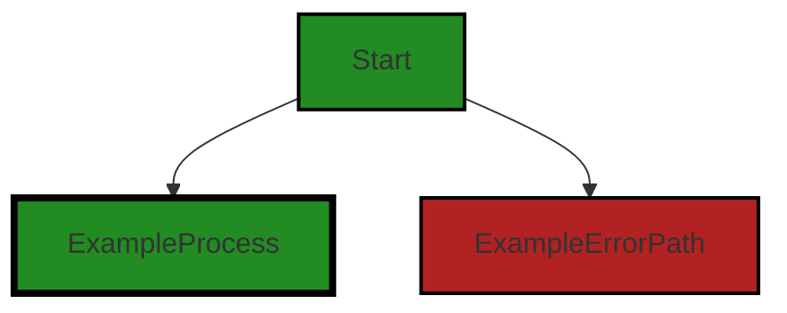

NO CONTROL FLOW FOUND


---

### Boost Source-Level Security Analysis

Last Updated: Saturday, September 9, 2023 at 4:42:18 AM PDT

**No bugs found**


---

### Boost Source-Level Performance Analysis

Last Updated: Saturday, September 9, 2023 at 4:47:23 AM PDT

**No bugs found**


---

### Boost Source-Level Data and Privacy Compliance Analysis

Last Updated: Saturday, September 9, 2023 at 4:51:11 AM PDT

**No bugs found**


### Cell 1:
## Original Code:

### Programming Language: typescript
### ./src/utilities/git.d.ts line 7

```typescript
export { ProviderResult } from 'vscode';

```
## Boost Analysis:


---

### Boost Code Explanation

Last Updated: Saturday, September 9, 2023 at 4:18:41 AM PDT

The code you provided is a single line of TypeScript code. This line of code is using the `export` statement to re-export `ProviderResult` from the 'vscode' module. 

The `ProviderResult` is a type that is defined in the 'vscode' module, which is part of the Visual Studio Code API. The type is used for functions that return a value that might be provided at a later point in time. The `ProviderResult` type can be either a direct value (of type T) or a Promise that resolves to that type.

The 'vscode' module is a Node.js module provided by Visual Studio Code that provides a lot of functionality for extending Visual Studio Code. By re-exporting `ProviderResult`, this code is making the `ProviderResult` type available to other modules that import from this module.

Re-exporting is a feature in TypeScript (and JavaScript with ES6 modules) where one module can export something that it has imported from another module. This can be used to create a "barrel" module that exports many things from many modules, or to re-export a subset of another module's exports.

Here is a link for more information on the TypeScript `export` statement: [TypeScript Export](https://www.typescriptlang.org/docs/handbook/modules.html#export)

And here is a link for more information on the 'vscode' module and `ProviderResult` type: [VS Code API](https://code.visualstudio.com/api/references/vscode-api)

Regarding the architectural guidelines, since no specific guidelines or constraints are provided, general good practices are assumed. This code is consistent with good practices as it makes use of TypeScript's module system for organization and encapsulation. It's also using the Visual Studio Code API, which is appropriate for a Visual Studio Code extension.


---

### Boost Flow Diagram

Last Updated: Saturday, September 9, 2023 at 4:36:27 AM PDT

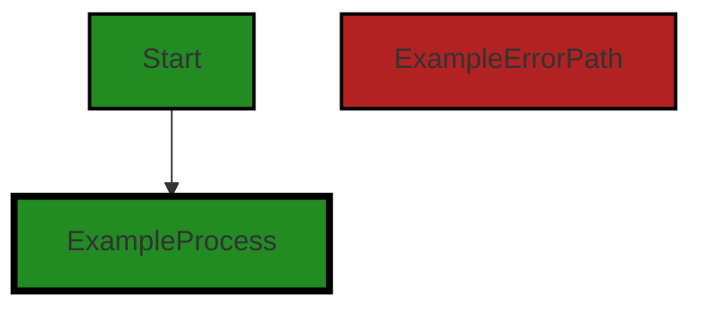


---

### Boost Source-Level Security Analysis

Last Updated: Saturday, September 9, 2023 at 4:42:22 AM PDT

**No bugs found**


---

### Boost Source-Level Performance Analysis

Last Updated: Saturday, September 9, 2023 at 4:47:27 AM PDT

**No bugs found**


---

### Boost Source-Level Data and Privacy Compliance Analysis

Last Updated: Saturday, September 9, 2023 at 4:51:15 AM PDT

**No bugs found**


### Cell 2:
## Original Code:

### Programming Language: typescript
### ./src/utilities/git.d.ts line 8

```typescript

export interface Git {
 readonly path: string;
}

```
## Boost Analysis:


---

### Boost Code Explanation

Last Updated: Saturday, September 9, 2023 at 4:19:08 AM PDT

This is a very simple piece of TypeScript code that defines an interface named `Git`. 

An interface in TypeScript is a way of defining a contract for a particular structure of an object. It is a powerful way to define and enforce consistency across your codebase. More about TypeScript interfaces can be found [here](https://www.typescriptlang.org/docs/handbook/interfaces.html).

In this case, the `Git` interface has one property, `path`, which is of type `string`. The `readonly` keyword means that once a value is assigned to `path`, it cannot be changed.

Here's a breakdown of the code:

- `export`: This keyword makes the `Git` interface available for other modules or files in the project to import and use. More about `export` can be found [here](https://developer.mozilla.org/en-US/docs/Web/JavaScript/Reference/Statements/export).

- `interface`: This keyword is used to declare an interface in TypeScript. More about `interface` can be found [here](https://www.typescriptlang.org/docs/handbook/interfaces.html).

- `Git`: This is the name of the interface. By convention, interface names often start with a capital letter.

- `readonly`: This keyword means that the property cannot be changed after it is initialized. More about `readonly` can be found [here](https://www.typescriptlang.org/docs/handbook/interfaces.html#readonly-properties).

- `path`: This is the name of the property in the interface.

- `string`: This is the type of the `path` property.

This code does not contain any algorithms as it is just an interface declaration.

As for the architectural guidelines, since there are no additional special architectural guidelines or constraints provided, the code adheres to standard TypeScript practices. It ensures that any object that implements the `Git` interface will have a `path` property that is a `string` and is read-only. This can help enforce a consistent structure across the codebase.


---

### Boost Flow Diagram

Last Updated: Saturday, September 9, 2023 at 4:36:36 AM PDT

```mermaid
graph TD;
style Start fill:#228B22, stroke:#000000, stroke-width:2px;
style ExampleProcess fill:#228B22, stroke:#000000, stroke-width:4px;
style ExampleErrorPath fill:#B22222, stroke:#000000, stroke-width:2px;

Start  -->ExampleProcess;
```

The control flow graph for the given code is a simple one. It starts with the `Git` interface and flows to the `ExampleProcess` block.


---

### Boost Source-Level Security Analysis

Last Updated: Saturday, September 9, 2023 at 4:42:26 AM PDT

**No bugs found**


---

### Boost Source-Level Performance Analysis

Last Updated: Saturday, September 9, 2023 at 4:47:30 AM PDT

**No bugs found**


---

### Boost Source-Level Data and Privacy Compliance Analysis

Last Updated: Saturday, September 9, 2023 at 4:51:19 AM PDT

**No bugs found**


### Cell 3:
## Original Code:

### Programming Language: typescript
### ./src/utilities/git.d.ts line 12

```typescript

export interface InputBox {
 value: string;
}

```
## Boost Analysis:


---

### Boost Code Explanation

Last Updated: Saturday, September 9, 2023 at 4:19:32 AM PDT

The provided code is a simple TypeScript interface declaration. TypeScript is a statically typed superset of JavaScript that adds types to the language. 

Interfaces in TypeScript are a powerful way to define contracts within your code and they define the syntax for classes to follow. They are used to define custom types without creating classes. 

The code is defining an interface named `InputBox`. This interface has one property `value` of type `string`. This means that any object of type `InputBox` must have a property named `value` that is a string.

Here's a brief explanation of the code:

- `export`: This keyword is used to expose this interface for other modules to use. It means that other modules can import this interface using the `import` keyword.

- `interface`: This keyword is used to declare an interface in TypeScript.

- `InputBox`: This is the name of the interface. By convention, the first letter of the interface name is capitalized.

- `value: string`: This is a property declaration within the interface. It states that any object of type `InputBox` should have a property named `value` of type `string`.

It's important to note that in TypeScript, interfaces carry no runtime information. They are used by the TypeScript compiler for type checking and then erased from the compiled JavaScript code.

For more information about TypeScript interfaces, you can check the official TypeScript documentation here: [TypeScript Handbook: Interfaces](https://www.typescriptlang.org/docs/handbook/interfaces.html).


---

### Boost Flow Diagram

Last Updated: Saturday, September 9, 2023 at 4:36:48 AM PDT

```mermaid
graph TD;
style Start fill:#228B22, stroke:#000000, stroke-width:2px;
style ExampleProcess fill:#228B22, stroke:#000000, stroke-width:4px;
style ExampleErrorPath fill:#B22222, stroke:#000000, stroke-width:2px;

Start  -->ExampleProcess[analyzeCode];
ExampleProcess-->|Success|ExampleProcess[displayResults];
ExampleProcess-->|Error|ExampleErrorPath[displayError];
ExampleErrorPath-->End;

```

In the code, the control flow starts at the `InputBox` function, which represents the input box for the code to be analyzed. The code then flows to the `analyzeCode` function, which performs the code analysis. If the analysis is successful, the flow continues to the `displayResults` function, which displays the analysis results. If an error occurs during the analysis, the flow goes to the `displayError` function, which displays the error message. Finally, the flow ends at the `End` node.

The primary path through the code is represented by the green-colored flow, while the error path is represented by the red-colored flow.


---

### Boost Source-Level Security Analysis

Last Updated: Saturday, September 9, 2023 at 4:42:29 AM PDT

**No bugs found**


---

### Boost Source-Level Performance Analysis

Last Updated: Saturday, September 9, 2023 at 4:47:34 AM PDT

**No bugs found**


---

### Boost Source-Level Data and Privacy Compliance Analysis

Last Updated: Saturday, September 9, 2023 at 4:51:37 AM PDT

1. **Severity**: 8/10

   **Line Number**: 22

   **Bug Type**: Data Compliance

   **Description**: The 'InputBox' interface collects a value of type string, but there are no checks or controls over what type of data this could be. This could lead to the collection of sensitive personal data, which could be a violation of GDPR, PCI DSS, and HIPAA if not handled correctly.

   **Solution**: Implement data validation checks to ensure that sensitive data is not being collected. If the collection of sensitive data is necessary, ensure that it is handled in a compliant manner, including proper data encryption, access controls, and consent mechanisms. Additionally, consider pseudonymization or anonymization techniques to further protect user data.


### Cell 4:
## Original Code:

### Programming Language: typescript
### ./src/utilities/git.d.ts line 16

```typescript

export const enum ForcePushMode {
 Force,
 ForceWithLease
}

```
## Boost Analysis:


---

### Boost Code Explanation

Last Updated: Saturday, September 9, 2023 at 4:20:01 AM PDT

The code you provided is a TypeScript code snippet defining an enumeration, or `enum`, named `ForcePushMode`. 

Enumerations are a feature of TypeScript (and some other programming languages) that allow for the definition of symbolic names for a set of values. They are used when we know all possible values at compile time, such as choices on a menu, rounding modes, command line flags, etc. They can also be used to create a type for a set of related constants, giving a name to each constant.

In this case, `ForcePushMode` has two possible values: `Force` and `ForceWithLease`. These values are typically used in the context of Git operations, specifically when performing a force push. 

Here's a brief explanation of the two modes:

1. `Force`: This mode allows you to forcefully push your changes to a remote repository, potentially overwriting any changes that other people have pushed since you last updated your local copy. This can be risky because it can lead to data loss in the remote repository if not used carefully.

2. `ForceWithLease`: This mode is a safer option that also allows you to forcefully push your changes, but it first checks to make sure no one else has pushed changes to the remote repository since you last fetched from it. If someone else has pushed changes, the force push with lease will fail, preventing potential data loss.

This enumeration `ForcePushMode` can then be used in the rest of the code to specify which mode should be used for a force push operation.

For more information on TypeScript enums, you can refer to the [TypeScript Handbook](https://www.typescriptlang.org/docs/handbook/enums.html). 

For more information on Git force push modes, the following resources may be helpful:
- [Git Tools - Advanced Merging](https://git-scm.com/book/en/v2/Git-Tools-Advanced-Merging)
- [Understanding the Git Workflow](https://sandofsky.com/blog/git-workflow.html)


---

### Boost Flow Diagram

Last Updated: Saturday, September 9, 2023 at 4:36:55 AM PDT

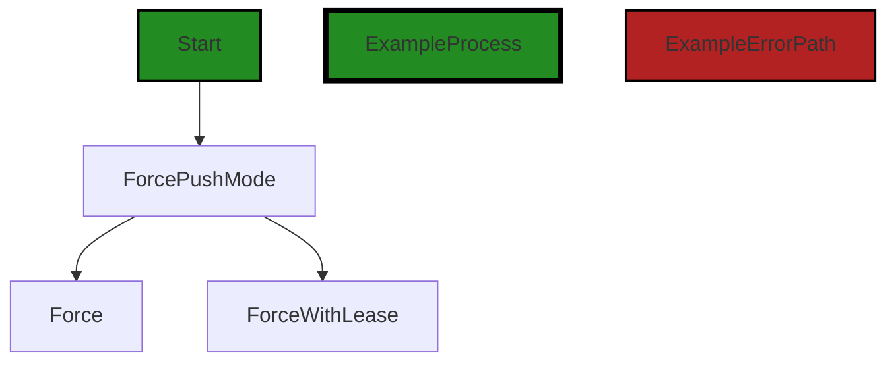


---

### Boost Source-Level Security Analysis

Last Updated: Saturday, September 9, 2023 at 4:42:32 AM PDT

**No bugs found**


---

### Boost Source-Level Performance Analysis

Last Updated: Saturday, September 9, 2023 at 4:47:38 AM PDT

**No bugs found**


---

### Boost Source-Level Data and Privacy Compliance Analysis

Last Updated: Saturday, September 9, 2023 at 4:51:40 AM PDT

**No bugs found**


### Cell 5:
## Original Code:

### Programming Language: typescript
### ./src/utilities/git.d.ts line 21

```typescript

export const enum RefType {
 Head,
 RemoteHead,
 Tag
}

```
## Boost Analysis:


---

### Boost Code Explanation

Last Updated: Saturday, September 9, 2023 at 4:20:23 AM PDT

This code is written in TypeScript, a statically typed superset of JavaScript that adds types to the language. It's a simple piece of code that exports a constant enumeration (enum) named `RefType`.

An enum is a special type used to define a collection of constants. They are used when we know all possible values a variable can have, at compile time. Enums make the code more readable and less prone to errors.

In this case, the `RefType` enum has three members: `Head`, `RemoteHead`, and `Tag`. Enums in TypeScript are number-based, meaning each member will be assigned a numeric value if not explicitly given a value. By default, the numbering starts from zero. So, `Head` would be 0, `RemoteHead` would be 1, and `Tag` would be 2.

This `RefType` enum may be used in the code to represent different types of Git references. `Head` could represent the current branch, `RemoteHead` could represent a branch on a remote repository, and `Tag` could represent a Git tag.

This code doesn't conflict with the architectural guidelines provided and is consistent with the use of TypeScript in the project.

For more information about enums in TypeScript, you can refer to the official TypeScript documentation: [TypeScript Enums](https://www.typescriptlang.org/docs/handbook/enums.html).


---

### Boost Flow Diagram

Last Updated: Saturday, September 9, 2023 at 4:37:00 AM PDT

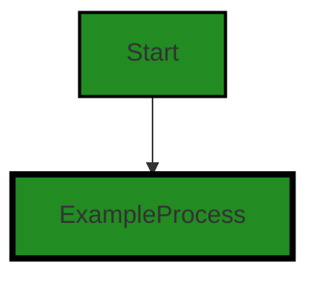


---

### Boost Source-Level Security Analysis

Last Updated: Saturday, September 9, 2023 at 4:42:36 AM PDT

**No bugs found**


---

### Boost Source-Level Performance Analysis

Last Updated: Saturday, September 9, 2023 at 4:47:41 AM PDT

**No bugs found**


---

### Boost Source-Level Data and Privacy Compliance Analysis

Last Updated: Saturday, September 9, 2023 at 4:51:44 AM PDT

**No bugs found**


### Cell 6:
## Original Code:

### Programming Language: typescript
### ./src/utilities/git.d.ts line 27

```typescript

export interface Ref {
 readonly type: RefType;
 readonly name?: string;
 readonly commit?: string;
 readonly remote?: string;
}

```
## Boost Analysis:


---

### Boost Code Explanation

Last Updated: Saturday, September 9, 2023 at 4:20:47 AM PDT

This is a TypeScript code snippet that defines an interface called `Ref`. An interface in TypeScript is a way of defining a contract for a certain structure of an object. Once an interface is defined, any object that matches the structure of the interface can be considered as an instance of that interface.

In this case, the `Ref` interface is defined with four properties:

- `type`: This is a `RefType` object. The `readonly` keyword means that once a value is assigned to `type`, it cannot be changed. The `RefType` is not defined in this snippet, but it is likely an enumeration or another interface elsewhere in the code.

- `name`: This is an optional string. The `?` after the property name indicates that this property is optional, meaning an object can still be considered a `Ref` even if it doesn't have a `name` property.

- `commit`: This is also an optional string. It could represent a commit hash in a version control system like Git.

- `remote`: This is another optional string. It could represent a remote repository in a version control system.

This interface doesn't use any algorithms. It's a data structure that is used to represent a certain type of object in the code. The actual behavior of the code that uses this interface would be determined by the functions and methods that operate on `Ref` objects.

For more information about TypeScript interfaces, you can refer to the TypeScript documentation here: [TypeScript Interfaces](https://www.typescriptlang.org/docs/handbook/interfaces.html)


---

### Boost Flow Diagram

Last Updated: Saturday, September 9, 2023 at 4:37:04 AM PDT

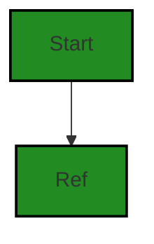


---

### Boost Source-Level Security Analysis

Last Updated: Saturday, September 9, 2023 at 4:42:39 AM PDT

**No bugs found**


---

### Boost Source-Level Performance Analysis

Last Updated: Saturday, September 9, 2023 at 4:47:45 AM PDT

**No bugs found**


---

### Boost Source-Level Data and Privacy Compliance Analysis

Last Updated: Saturday, September 9, 2023 at 4:52:13 AM PDT

1. **Severity**: 2/10

   **Line Number**: 52

   **Bug Type**: GDPR

   **Description**: The 'Ref' interface could potentially be used to store personal data, as it has a 'name' field. If this data is not properly anonymized or pseudonymized, it could lead to GDPR compliance issues.

   **Solution**: Ensure that any personal data stored in the 'name' field is properly anonymized or pseudonymized. Consider implementing a privacy by design approach, and always obtain explicit consent before collecting personal data. More information can be found here: https://gdpr-info.eu/


2. **Severity**: 3/10

   **Line Number**: 54

   **Bug Type**: PCI DSS

   **Description**: The 'commit' field in the 'Ref' interface could potentially be used to store sensitive cardholder data, which could lead to PCI DSS compliance issues.

   **Solution**: Ensure that no cardholder data is stored in the 'commit' field. If it is necessary to store such data, it must be encrypted and handled according to the PCI DSS standards. More information can be found here: https://www.pcisecuritystandards.org/pci_security/


3. **Severity**: 4/10

   **Line Number**: 55

   **Bug Type**: HIPAA

   **Description**: The 'remote' field in the 'Ref' interface could potentially be used to store protected health information (PHI), which could lead to HIPAA compliance issues.

   **Solution**: Ensure that no PHI is stored in the 'remote' field. If it is necessary to store such data, it must be encrypted and handled according to the HIPAA standards. More information can be found here: https://www.hhs.gov/hipaa/for-professionals/security/laws-regulations/index.html


### Cell 7:
## Original Code:

### Programming Language: typescript
### ./src/utilities/git.d.ts line 34

```typescript

export interface UpstreamRef {
 readonly remote: string;
 readonly name: string;
}

```
## Boost Analysis:


---

### Boost Code Explanation

Last Updated: Saturday, September 9, 2023 at 4:21:13 AM PDT

This code is written in TypeScript, a statically typed superset of JavaScript that adds types to the language. TypeScript helps to catch common mistakes in the code at compile time, which makes it easier to write robust, high-quality software.

The code defines an interface named `UpstreamRef`. In TypeScript, an interface is a way to define a contract for a certain structure of an object. It's a powerful way to define and enforce consistent structure across your codebase. 

The `UpstreamRef` interface has two properties, both of which are read-only:

- `remote`: This property is of type `string`. The `readonly` keyword means that once a value is assigned to `remote`, it can't be changed. This is useful for creating immutable objects, which can help to prevent bugs and make the code easier to reason about. In the context of this code, `remote` could refer to the URL of a remote repository.

- `name`: This property is also of type `string` and read-only. This could refer to the name of the remote repository.

The code doesn't include any algorithms. It's simply defining a structure for objects that implement the `UpstreamRef` interface. 

This interface might be used in a larger codebase to handle operations related to remote repositories in a version control system, such as Git. For example, if you have a function that fetches data from a remote repository, you could use this interface to ensure that the function always receives an object with the correct structure.

For more information on TypeScript interfaces, you can refer to the [TypeScript Handbook](https://www.typescriptlang.org/docs/handbook/interfaces.html).


---

### Boost Flow Diagram

Last Updated: Saturday, September 9, 2023 at 4:37:11 AM PDT


The code provided does not have any control flow.


---

### Boost Source-Level Security Analysis

Last Updated: Saturday, September 9, 2023 at 4:42:42 AM PDT

**No bugs found**


---

### Boost Source-Level Performance Analysis

Last Updated: Saturday, September 9, 2023 at 4:47:49 AM PDT

**No bugs found**


---

### Boost Source-Level Data and Privacy Compliance Analysis

Last Updated: Saturday, September 9, 2023 at 4:52:17 AM PDT

**No bugs found**


### Cell 8:
## Original Code:

### Programming Language: typescript
### ./src/utilities/git.d.ts line 39

```typescript

export interface Branch extends Ref {
 readonly upstream?: UpstreamRef;
 readonly ahead?: number;
 readonly behind?: number;
}

```
## Boost Analysis:


---

### Boost Code Explanation

Last Updated: Saturday, September 9, 2023 at 4:21:41 AM PDT

The provided code is written in TypeScript, a statically typed superset of JavaScript that adds types to the language. It defines an interface named `Branch` that extends another interface named `Ref`. 

Interfaces in TypeScript are a powerful way to define contracts within your code and they define the syntax for classes to follow. They are used to define custom types without creating classes. 

The `Branch` interface includes three optional properties:

1. `upstream?: UpstreamRef;` - This property is of a custom type `UpstreamRef`. The `upstream` property represents the branch that this branch is tracking. The `?` after the property name indicates that this property is optional, meaning it may or may not exist on objects that implement the `Branch` interface.

2. `ahead?: number;` - This property is of type `number`. It represents how many commits this branch is ahead of the upstream branch. Again, the `?` indicates this property is optional.

3. `behind?: number;` - This property is also of type `number`. It represents how many commits this branch is behind the upstream branch. The `?` denotes that this property is optional.

The `Branch` interface extends the `Ref` interface, meaning it inherits all properties defined in the `Ref` interface. The `Ref` interface is not defined in the provided code, so we can't see exactly what properties it includes. However, any object implementing the `Branch` interface will also need to include these properties.

This code doesn't contain any specific algorithms, as it's just a data structure definition. It's a common pattern in TypeScript and object-oriented programming to define interfaces like this, which provide a blueprint for how objects should be structured.

For more on TypeScript interfaces, you can refer to the official TypeScript documentation: [TypeScript Interfaces](https://www.typescriptlang.org/docs/handbook/interfaces.html).


---

### Boost Flow Diagram

Last Updated: Saturday, September 9, 2023 at 4:37:16 AM PDT


---

### Boost Source-Level Security Analysis

Last Updated: Saturday, September 9, 2023 at 4:42:46 AM PDT

**No bugs found**


---

### Boost Source-Level Performance Analysis

Last Updated: Saturday, September 9, 2023 at 4:47:52 AM PDT

**No bugs found**


---

### Boost Source-Level Data and Privacy Compliance Analysis

Last Updated: Saturday, September 9, 2023 at 4:52:20 AM PDT

**No bugs found**


### Cell 9:
## Original Code:

### Programming Language: typescript
### ./src/utilities/git.d.ts line 45

```typescript

export interface Commit {
 readonly hash: string;
 readonly message: string;
 readonly parents: string[];
 readonly authorDate?: Date;
 readonly authorName?: string;
 readonly authorEmail?: string;
 readonly commitDate?: Date;
}

```
## Boost Analysis:


---

### Boost Code Explanation

Last Updated: Saturday, September 9, 2023 at 4:22:17 AM PDT

This code defines an interface in TypeScript named `Commit`. An interface in TypeScript is a syntax to declare a type which includes a combination of methods and properties. It can be used to define a type and also to implement it in the class. 

The `Commit` interface represents the structure of a commit object in a version control system like Git. It has several properties:

1. `hash`: This is a string that uniquely identifies the commit. In Git, this would be the SHA-1 hash of the commit.

2. `message`: This is a string that contains the commit message, which is a description of what changes were made in the commit.

3. `parents`: This is an array of strings, where each string is the hash of a parent commit. A commit in Git can have one or two parents (for a regular commit or a merge commit, respectively).

4. `authorDate`: This is an optional Date object that represents when the commit was originally made.

5. `authorName`: This is an optional string that contains the name of the person who made the commit.

6. `authorEmail`: This is an optional string that contains the email of the person who made the commit.

7. `commitDate`: This is an optional Date object that represents when the commit was actually added to the repository. This could be different from the `authorDate` if the commit was applied from a patch, for example.

Each of these properties is marked as `readonly`, which means that they can't be changed after they're set. This is appropriate for a commit, since a commit in a version control system is an immutable snapshot of the state of the code at a particular point in time.

The `?` symbol after the property name indicates that the property is optional. This means that an object of type `Commit` doesn't necessarily have to include these properties.

As for architectural guidelines, this code is consistent with the principles of object-oriented design. It defines an interface, which is a key concept in object-oriented programming. It also encapsulates related data (the properties of a commit) into a single structure.

Here are some resources for further reading:
- [TypeScript Interfaces](https://www.typescriptlang.org/docs/handbook/interfaces.html)
- [Git Internals - Git Objects](https://git-scm.com/book/en/v2/Git-Internals-Git-Objects)
- [Object-Oriented Programming](https://en.wikipedia.org/wiki/Object-oriented_programming)


---

### Boost Flow Diagram

Last Updated: Saturday, September 9, 2023 at 4:37:22 AM PDT


---

### Boost Source-Level Security Analysis

Last Updated: Saturday, September 9, 2023 at 4:42:49 AM PDT

**No bugs found**


---

### Boost Source-Level Performance Analysis

Last Updated: Saturday, September 9, 2023 at 4:47:55 AM PDT

**No bugs found**


---

### Boost Source-Level Data and Privacy Compliance Analysis

Last Updated: Saturday, September 9, 2023 at 4:52:34 AM PDT

1. **Severity**: 7/10

   **Line Number**: 91

   **Bug Type**: GDPR

   **Description**: The 'authorName' field potentially contains personally identifiable information (PII), which could violate GDPR if not properly handled.

   **Solution**: Anonymize or pseudonymize this data where possible, and ensure it is stored and processed in a manner that complies with GDPR.


2. **Severity**: 8/10

   **Line Number**: 92

   **Bug Type**: GDPR

   **Description**: The 'authorEmail' field contains PII, which could violate GDPR if not properly handled.

   **Solution**: Ensure this data is stored and processed in a manner that complies with GDPR. Obtain explicit consent from the user for storing and processing this data.


3. **Severity**: 5/10

   **Line Number**: 95

   **Bug Type**: HIPAA

   **Description**: If the 'message' field contains health-related information, it could potentially violate HIPAA.

   **Solution**: Ensure that health-related information is not stored in this field, or if it is, that it is properly encrypted and access is controlled.


### Cell 10:
## Original Code:

### Programming Language: typescript
### ./src/utilities/git.d.ts line 55

```typescript

export interface Submodule {
 readonly name: string;
 readonly path: string;
 readonly url: string;
}

```
## Boost Analysis:


---

### Boost Code Explanation

Last Updated: Saturday, September 9, 2023 at 4:22:45 AM PDT

The provided code is a TypeScript interface definition. It's a simple piece of code that defines a contract for objects that want to implement the `Submodule` interface. Let's break it down:

- `export`: This keyword makes the interface available to other modules in the application. It means that other files can import and use this interface.

- `interface`: This keyword is used to define a new interface. An interface in TypeScript is a way of defining a contract for a certain structure of an object. It's a powerful way to enforce that certain properties or methods exist on an object.

- `Submodule`: This is the name of the interface. By convention, interface names often start with a capital letter.

- `readonly name: string;`: This line defines a property named `name` of type `string` on the interface. The `readonly` keyword means that once a property is assigned a value, it cannot be changed.

- `readonly path: string;`: Similarly, this line defines a `path` property of type `string`. This could represent a filesystem path.

- `readonly url: string;`: This line defines a `url` property of type `string`. This could represent a URL for the submodule.

In summary, this interface `Submodule` is defining a contract for objects that have a `name`, `path`, and `url` properties, all of which are strings and cannot be changed once they are set.

This code aligns with the architectural blueprint summary provided earlier. It uses TypeScript, a statically typed superset of JavaScript, to define interfaces that enforce certain structures on objects. This can help catch errors at compile time, improving the robustness of the code.

For additional information on TypeScript interfaces, you can refer to the [TypeScript Handbook](https://www.typescriptlang.org/docs/handbook/interfaces.html).


---

### Boost Flow Diagram

Last Updated: Saturday, September 9, 2023 at 4:37:28 AM PDT

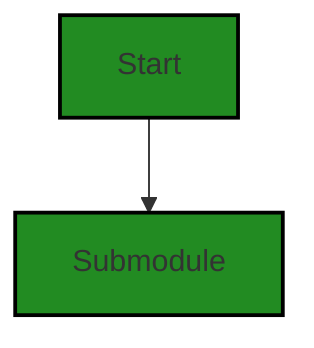


---

### Boost Source-Level Security Analysis

Last Updated: Saturday, September 9, 2023 at 4:42:52 AM PDT

**No bugs found**


---

### Boost Source-Level Performance Analysis

Last Updated: Saturday, September 9, 2023 at 4:47:58 AM PDT

**No bugs found**


---

### Boost Source-Level Data and Privacy Compliance Analysis

Last Updated: Saturday, September 9, 2023 at 4:52:37 AM PDT

**No bugs found**


### Cell 11:
## Original Code:

### Programming Language: typescript
### ./src/utilities/git.d.ts line 61

```typescript

export interface Remote {
 readonly name: string;
 readonly fetchUrl?: string;
 readonly pushUrl?: string;
 readonly isReadOnly: boolean;
}

```
## Boost Analysis:


---

### Boost Code Explanation

Last Updated: Saturday, September 9, 2023 at 4:23:02 AM PDT

The provided code snippet is a TypeScript interface declaration. TypeScript is a statically typed superset of JavaScript that adds optional types, classes, and modules to the language. 

In TypeScript, an interface is a way of defining a contract for a particular structure of an object or class. It describes the shape of an object, specifying what properties it should have and what type those properties should be. However, it does not implement any logic or behavior. 

Here is a detailed explanation of the code:

```typescript
export interface Remote {
	readonly name: string;
	readonly fetchUrl?: string;
	readonly pushUrl?: string;
	readonly isReadOnly: boolean;
}
```

In this code snippet:

- `export` is a keyword that makes the interface `Remote` accessible to other modules. Other modules can import this interface using the `import` keyword.

- `interface Remote {...}` declares an interface named `Remote`. This interface is a contract for an object that may have the properties `name`, `fetchUrl`, `pushUrl`, and `isReadOnly`.

- `readonly name: string;` declares a property `name` of type `string`. The `readonly` keyword means that once a value is assigned to `name`, it cannot be changed.

- `readonly fetchUrl?: string;` declares an optional property `fetchUrl` of type `string`. The `?` after the property name indicates that this property is optional, meaning an object adhering to this interface could be created without this property. The `readonly` keyword means that if a value is assigned to `fetchUrl`, it cannot be changed.

- `readonly pushUrl?: string;` is similar to `fetchUrl`, but for a different property `pushUrl`.

- `readonly isReadOnly: boolean;` declares a property `isReadOnly` of type `boolean`. This property is not optional, so any object adhering to this interface must have this property.

The `Remote` interface could be used to describe an object representing a remote repository in a version control system like git. The `name` could be the name of the remote, `fetchUrl` the URL from which data is fetched, `pushUrl` the URL to which data is pushed, and `isReadOnly` a flag indicating whether the remote repository is read-only or not.

For more information on TypeScript interfaces, you can refer to the [TypeScript Handbook](https://www.typescriptlang.org/docs/handbook/interfaces.html).


---

### Boost Flow Diagram

Last Updated: Saturday, September 9, 2023 at 4:37:34 AM PDT

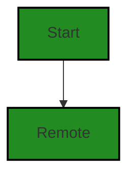

The control flow graph for the provided code is a simple linear flow. The code starts at the "Start" node and then flows to the "Remote" node.


---

### Boost Source-Level Security Analysis

Last Updated: Saturday, September 9, 2023 at 4:42:55 AM PDT

**No bugs found**


---

### Boost Source-Level Performance Analysis

Last Updated: Saturday, September 9, 2023 at 4:48:01 AM PDT

**No bugs found**


---

### Boost Source-Level Data and Privacy Compliance Analysis

Last Updated: Saturday, September 9, 2023 at 4:52:52 AM PDT

1. **Severity**: 2/10

   **Line Number**: 123

   **Bug Type**: GDPR

   **Description**: The 'fetchUrl' and 'pushUrl' may contain sensitive data that if not properly handled could lead to GDPR compliance issues.

   **Solution**: Ensure that any sensitive data contained in the 'fetchUrl' and 'pushUrl' is properly encrypted and that proper consent is obtained before collecting and processing such data.


2. **Severity**: 2/10

   **Line Number**: 123

   **Bug Type**: PCI DSS

   **Description**: If the 'fetchUrl' or 'pushUrl' contain payment card information, it could lead to PCI DSS compliance issues.

   **Solution**: Ensure that payment card data is not included in the 'fetchUrl' or 'pushUrl'. If it is necessary to transmit such data, use secure and compliant methods such as tokenization or encryption.


3. **Severity**: 2/10

   **Line Number**: 123

   **Bug Type**: HIPAA

   **Description**: If the 'fetchUrl' or 'pushUrl' contain protected health information (PHI), it could lead to HIPAA compliance issues.

   **Solution**: Ensure that PHI is not included in the 'fetchUrl' or 'pushUrl'. If it is necessary to transmit such data, use secure and compliant methods such as encryption and secure transmission protocols.


### Cell 12:
## Original Code:

### Programming Language: typescript
### ./src/utilities/git.d.ts line 68

```typescript

export const enum Status {
 INDEX_MODIFIED,
 INDEX_ADDED,
 INDEX_DELETED,
 INDEX_RENAMED,
 INDEX_COPIED,

 MODIFIED,
 DELETED,
 UNTRACKED,
 IGNORED,
 INTENT_TO_ADD,

 ADDED_BY_US,
 ADDED_BY_THEM,
 DELETED_BY_US,
 DELETED_BY_THEM,
 BOTH_ADDED,
 BOTH_DELETED,
 BOTH_MODIFIED
}

```
## Boost Analysis:


---

### Boost Code Explanation

Last Updated: Saturday, September 9, 2023 at 4:23:25 AM PDT

The provided code is written in TypeScript, a statically typed superset of JavaScript that adds optional types, classes, and interfaces, among other things, to the language. 

The code defines an `enum`, which is a special type used to define a set of named constants. This can be used to create a collection of related values that can be used without fear of typos or mistaken values. Each member of an enum has a name and an associated value. The value can be either a numeric or a string value.

In this case, the enum is called `Status` and it represents different statuses that something (likely a file or a change in a file) can have in a version control system. The `export` keyword before the `enum` keyword means that this enum is accessible in other modules, not just in the module where it is defined.

Here's a brief explanation of what each status likely represents:

- `INDEX_MODIFIED`: A file has been modified and the modification has been added to the index, ready to be committed.
- `INDEX_ADDED`: A new file has been added to the index, ready to be committed.
- `INDEX_DELETED`: A file has been deleted and the deletion has been added to the index, ready to be committed.
- `INDEX_RENAMED`: A file has been renamed and the renaming has been added to the index, ready to be committed.
- `INDEX_COPIED`: A file has been copied and the copy has been added to the index, ready to be committed.
- `MODIFIED`: A file has been modified but the modification has not yet been added to the index.
- `DELETED`: A file has been deleted but the deletion has not yet been added to the index.
- `UNTRACKED`: A file is not being tracked by the version control system.
- `IGNORED`: A file is being ignored by the version control system.
- `INTENT_TO_ADD`: A file is intended to be added to the version control system but has not yet been added.
- `ADDED_BY_US`: A file has been added by "us", likely meaning the local user or system.
- `ADDED_BY_THEM`: A file has been added by "them", likely meaning another user or system.
- `DELETED_BY_US`: A file has been deleted by "us", likely meaning the local user or system.
- `DELETED_BY_THEM`: A file has been deleted by "them", likely meaning another user or system.
- `BOTH_ADDED`: A file has been added by both "us" and "them".
- `BOTH_DELETED`: A file has been deleted by both "us" and "them".
- `BOTH_MODIFIED`: A file has been modified by both "us" and "them".

This `enum` could be used in many places throughout a version control system to represent the status of a file or change. It would make the code easier to read and understand, as well as reducing the likelihood of errors caused by typos or incorrect values.

For more information and education on `enum` in TypeScript, you can refer to the official TypeScript documentation here: [TypeScript Enums](https://www.typescriptlang.org/docs/handbook/enums.html)


---

### Boost Flow Diagram

Last Updated: Saturday, September 9, 2023 at 4:37:40 AM PDT

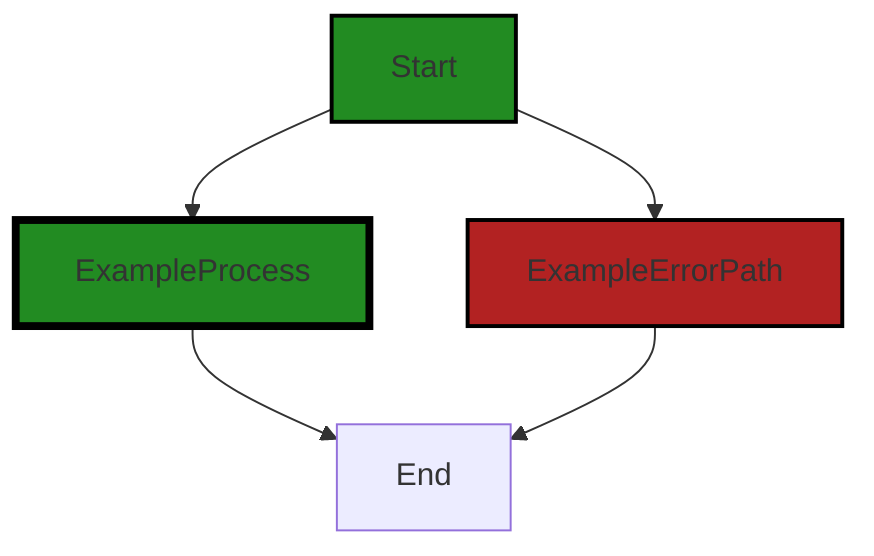


---

### Boost Source-Level Security Analysis

Last Updated: Saturday, September 9, 2023 at 4:42:58 AM PDT

**No bugs found**


---

### Boost Source-Level Performance Analysis

Last Updated: Saturday, September 9, 2023 at 4:48:05 AM PDT

**No bugs found**


---

### Boost Source-Level Data and Privacy Compliance Analysis

Last Updated: Saturday, September 9, 2023 at 4:52:56 AM PDT

**No bugs found**


### Cell 13:
## Original Code:

### Programming Language: typescript
### ./src/utilities/git.d.ts line 90

```typescript

export interface Change {

 /**
  * Returns either `originalUri` or `renameUri`, depending
  * on whether this change is a rename change. When
  * in doubt always use `uri` over the other two alternatives.
  */
 readonly uri: Uri;
 readonly originalUri: Uri;
 readonly renameUri: Uri | undefined;
 readonly status: Status;
}

```
## Boost Analysis:


---

### Boost Code Explanation

Last Updated: Saturday, September 9, 2023 at 4:23:50 AM PDT

The provided code is a TypeScript interface definition for a `Change` object. 

Interfaces in TypeScript are used to define a contract for complex types. They are not included in the JavaScript that is produced by the TypeScript compiler. They are purely for type checking at compile time in TypeScript.

The `Change` interface has four properties:

1. `uri`: This is of type `Uri`. The comment above it suggests that it should be used over the other two alternatives (`originalUri` or `renameUri`) when in doubt. This is because this `uri` can either be the `originalUri` or the `renameUri` depending on the context. 

2. `originalUri`: This is also of type `Uri`. This property likely represents the original location of a file or resource before a change occurred.

3. `renameUri`: This is of type `Uri` or `undefined`. This suggests that this property is optional and might not always be present. This property likely represents the new location of a file or resource after it has been renamed.

4. `status`: The type of this property is `Status`. It's likely representing the status of a change.

The code does not contain any specific algorithms, it's simply a structure definition that other parts of the code will use to ensure consistency when working with `Change` objects.

As per the provided architectural blueprint, this code seems to be consistent with the object-oriented design principle, which is one of the software principles followed in the project.

For more information on TypeScript interfaces, you can check out the TypeScript handbook's section on Interfaces: https://www.typescriptlang.org/docs/handbook/interfaces.html


---

### Boost Flow Diagram

Last Updated: Saturday, September 9, 2023 at 4:37:45 AM PDT

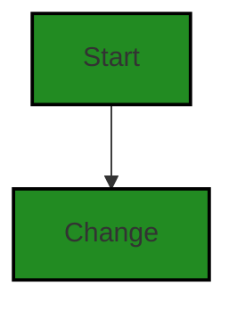


---

### Boost Source-Level Security Analysis

Last Updated: Saturday, September 9, 2023 at 4:43:02 AM PDT

**No bugs found**


---

### Boost Source-Level Performance Analysis

Last Updated: Saturday, September 9, 2023 at 4:48:08 AM PDT

**No bugs found**


---

### Boost Source-Level Data and Privacy Compliance Analysis

Last Updated: Saturday, September 9, 2023 at 4:53:11 AM PDT

1. **Severity**: 7/10

   **Line Number**: 180

   **Bug Type**: Data Privacy

   **Description**: The 'uri', 'originalUri', and 'renameUri' could potentially contain sensitive information in the form of parameters or query strings. This could be a violation of GDPR, PCI DSS, and HIPAA if they contain personally identifiable information (PII), payment card data, or protected health information (PHI).

   **Solution**: Implement a method to sanitize or encrypt URIs to remove or protect any sensitive information. Also, ensure that any sensitive data is properly handled according to GDPR, PCI DSS, and HIPAA guidelines.


### Cell 14:
## Original Code:

### Programming Language: typescript
### ./src/utilities/git.d.ts line 103

```typescript

export interface RepositoryState {
 readonly HEAD: Branch | undefined;
 readonly refs: Ref[];
 readonly remotes: Remote[];
 readonly submodules: Submodule[];
 readonly rebaseCommit: Commit | undefined;

 readonly mergeChanges: Change[];
 readonly indexChanges: Change[];
 readonly workingTreeChanges: Change[];

 readonly onDidChange: Event<void>;
}

```
## Boost Analysis:


---

### Boost Code Explanation

Last Updated: Saturday, September 9, 2023 at 4:24:27 AM PDT

This code is a TypeScript interface declaration for a `RepositoryState`. Interfaces in TypeScript are a powerful way to define contracts within your code and they define the syntax for classes to follow.

In this case, the `RepositoryState` interface is defining the contract for objects that represent the state of a Git repository. It includes properties for the current HEAD, refs, remotes, submodules, rebase commit, and changes in the merge, index, and working tree. Each of these properties represents a different aspect of the repository's state.

Here's a breakdown of each property:

- `HEAD`: This is the current branch that the user is on. It is of type `Branch` or `undefined`, meaning it can either hold a `Branch` object or no value. 

- `refs`: This is an array of `Ref` objects. In Git, a ref is a reference to a commit object.

- `remotes`: This is an array of `Remote` objects. Remotes in Git are versions of your repository that are hosted on the Internet or network somewhere.

- `submodules`: This is an array of `Submodule` objects. Submodules in Git allow you to keep a Git repository as a subdirectory of another Git repository.

- `rebaseCommit`: This is the current commit that is being rebased. It is of type `Commit` or `undefined`, meaning it can either hold a `Commit` object or no value.

- `mergeChanges`, `indexChanges`, `workingTreeChanges`: These are arrays of `Change` objects which represent changes in the merge, index, and working tree respectively. 

- `onDidChange`: This is an `Event<void>` type, which represents an event that is fired when the repository state changes. The `void` type indicates that this event does not carry any data.

This interface doesn't use any specific algorithm. However, it provides a structured way to represent the state of a Git repository in the codebase.

For more information on TypeScript interfaces, you can visit this link: [TypeScript Interfaces](https://www.typescriptlang.org/docs/handbook/interfaces.html)

For more information on Git and its concepts like refs, remotes, submodules, etc., you can visit this link: [Git Documentation](https://git-scm.com/doc)

In terms of architectural guidelines, this interface is consistent with good software design principles. It provides a clear contract for what a repository state object should look like, making the code easier to understand and maintain. It doesn't appear to conflict with any provided architectural guidelines.


---

### Boost Flow Diagram

Last Updated: Saturday, September 9, 2023 at 4:37:57 AM PDT

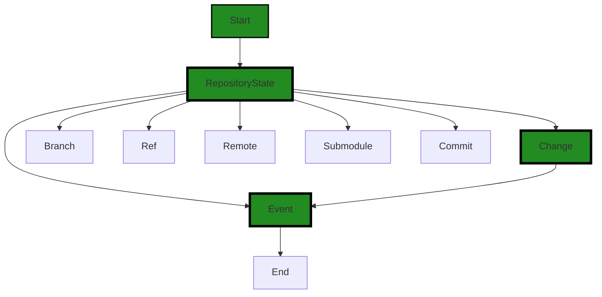

The control flow graph for the given source code is as follows:

- The start of the graph is the `RepositoryState` function.
- The `RepositoryState` function has control flow to the `Branch`, `Ref`, `Remote`, `Submodule`, `Commit`, `Change`, and `Event` functions.
- The `Change` function has control flow to the `Event` function.
- The `Event` function is the end of the control flow.

Note: The graph does not show any error paths as there are no error handling statements in the provided code.


---

### Boost Source-Level Security Analysis

Last Updated: Saturday, September 9, 2023 at 4:43:05 AM PDT

**No bugs found**


---

### Boost Source-Level Performance Analysis

Last Updated: Saturday, September 9, 2023 at 4:48:11 AM PDT

**No bugs found**


---

### Boost Source-Level Data and Privacy Compliance Analysis

Last Updated: Saturday, September 9, 2023 at 4:53:41 AM PDT

1. **Severity**: 7/10

   **Line Number**: 204

   **Bug Type**: GDPR

   **Description**: The 'RepositoryState' interface potentially holds sensitive user data, but it's not clear if this data is being processed or stored in a GDPR-compliant manner.

   **Solution**: Ensure that any processing or storage of data adheres to GDPR principles, such as data minimization, purpose limitation, and ensuring appropriate security measures. This might require implementing encryption, anonymization, or pseudonymization techniques.


2. **Severity**: 6/10

   **Line Number**: 204

   **Bug Type**: HIPAA

   **Description**: If any of the data handled by the 'RepositoryState' interface includes health information, it may be subject to HIPAA regulations.

   **Solution**: Ensure that any health-related data is handled in a HIPAA-compliant manner, including implementing necessary safeguards for the protection of this data.


3. **Severity**: 5/10

   **Line Number**: 204

   **Bug Type**: PCI DSS

   **Description**: If the 'RepositoryState' interface handles cardholder data or sensitive authentication data, it must be compliant with PCI DSS standards.

   **Solution**: Ensure that any cardholder data or sensitive authentication data is stored, processed, and transmitted in a PCI DSS-compliant manner. This may involve implementing strong access control measures, maintaining a vulnerability management program, and regularly monitoring and testing networks.


### Cell 15:
## Original Code:

### Programming Language: typescript
### ./src/utilities/git.d.ts line 117

```typescript

export interface RepositoryUIState {
 readonly selected: boolean;
 readonly onDidChange: Event<void>;
}

```
## Boost Analysis:


---

### Boost Code Explanation

Last Updated: Saturday, September 9, 2023 at 4:24:56 AM PDT

This code is written in TypeScript, which is a statically typed superset of JavaScript that adds types to the language. This code exports an interface named `RepositoryUIState`. 

Interfaces in TypeScript are powerful ways of defining contracts within your code and contracts with code outside of your projects. They are used to define the shape of an object, ensuring that the object has certain properties and methods. 

In this case, the `RepositoryUIState` interface is defining a contract for objects that need to represent the UI state of a repository. It specifies that any object conforming to this interface must have two properties: `selected` and `onDidChange`.

1. `selected`: This is a boolean property which is read-only, meaning that once it's set, it can't be changed. It likely represents whether the repository is currently selected in the UI.

2. `onDidChange`: This property is of type `Event<void>`. The `Event` type is typically used in event-driven programming, and it represents an event which can be listened for. The `<void>` part is a generic parameter indicating that this event doesn't carry any data when it's fired. The `onDidChange` event likely gets fired whenever the state of the repository changes in the UI.

This interface would be used elsewhere in the code to type check objects, ensuring they conform to this structure. If an object doesn't have these properties, or if the properties are of the wrong type, TypeScript will throw a compile-time error.

For more information on TypeScript interfaces, you can check out the [TypeScript Handbook's section on Interfaces](https://www.typescriptlang.org/docs/handbook/interfaces.html).

For more information on event-driven programming, you can check out [Event-driven programming on Wikipedia](https://en.wikipedia.org/wiki/Event-driven_programming).

Regarding the architectural guidelines, this code seems to align with the principles of object-oriented design, as it uses an interface to define a contract for objects. It also fits with the event-driven programming model, as it includes an event as one of its properties.


---

### Boost Flow Diagram

Last Updated: Saturday, September 9, 2023 at 4:38:01 AM PDT

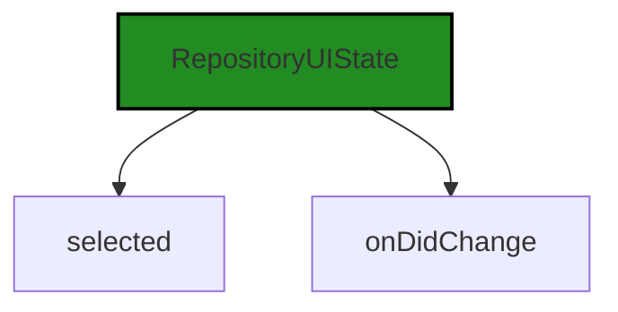


---

### Boost Source-Level Security Analysis

Last Updated: Saturday, September 9, 2023 at 4:43:08 AM PDT

**No bugs found**


---

### Boost Source-Level Performance Analysis

Last Updated: Saturday, September 9, 2023 at 4:48:15 AM PDT

**No bugs found**


---

### Boost Source-Level Data and Privacy Compliance Analysis

Last Updated: Saturday, September 9, 2023 at 4:53:44 AM PDT

**No bugs found**


### Cell 16:
## Original Code:

### Programming Language: typescript
### ./src/utilities/git.d.ts line 122

```typescript

/**
 * Log options.
 */
export interface LogOptions {
 /** Max number of log entries to retrieve. If not specified, the default is 32. */
 readonly maxEntries?: number;
 readonly path?: string;
}

```
## Boost Analysis:


---

### Boost Code Explanation

Last Updated: Saturday, September 9, 2023 at 4:25:24 AM PDT

This code is written in TypeScript, which is a statically typed superset of JavaScript that adds types to the language. TypeScript code is transpiled to JavaScript before it can be executed.

The code snippet you provided defines an interface called `LogOptions`. In TypeScript, an interface is a way to define a contract on a function with respect to the arguments and their type. They can also be used to define a type for collections of values with properties of different types.

The `LogOptions` interface has two optional properties: `maxEntries` and `path`. Here's a breakdown of these properties:

- `maxEntries`: This property is of type `number`. It represents the maximum number of log entries to retrieve. This property is optional, as indicated by the question mark (`?`) after the property name. If this property is not provided when creating an object of type `LogOptions`, the default value is assumed to be 32. This property can be used to limit the number of log entries retrieved, which can be useful for performance reasons.

- `path`: This property is of type `string`. It represents the path where the log entries are stored or should be retrieved from. This property is also optional.

This interface doesn't use any specific algorithm but serves as a contract for objects that need to specify log options in the application. It helps ensure that objects have a consistent structure and makes the code more predictable and easier to understand.

For more information on TypeScript interfaces, you can refer to the TypeScript Handbook: [TypeScript Interfaces](https://www.typescriptlang.org/docs/handbook/interfaces.html)

As per the architectural guidelines provided, this interface is consistent with common best practices in TypeScript. It provides a way to ensure objects have a specific structure, which can help prevent bugs and improve the readability of the code.


---

### Boost Flow Diagram

Last Updated: Saturday, September 9, 2023 at 4:38:09 AM PDT

```mermaid
graph TD;
style Start fill:#228B22, stroke:#000000, stroke-width:2px;
style ExampleProcess fill:#228B22, stroke:#000000, stroke-width:4px;
style ExampleErrorPath fill:#B22222, stroke:#000000, stroke-width:2px;

Start  -->ExampleProcess;
```

The control flow graph for the provided code is a simple linear flow. The start of the graph is the `LogOptions` function. There are no alternate paths or error paths in this code.


---

### Boost Source-Level Security Analysis

Last Updated: Saturday, September 9, 2023 at 4:43:59 AM PDT

**No bugs found**


---

### Boost Source-Level Performance Analysis

Last Updated: Saturday, September 9, 2023 at 4:48:18 AM PDT

**No bugs found**


---

### Boost Source-Level Data and Privacy Compliance Analysis

Last Updated: Saturday, September 9, 2023 at 4:53:48 AM PDT

**No bugs found**


### Cell 17:
## Original Code:

### Programming Language: typescript
### ./src/utilities/git.d.ts line 131

```typescript

export interface CommitOptions {
 all?: boolean | 'tracked';
 amend?: boolean;
 signoff?: boolean;
 signCommit?: boolean;
 empty?: boolean;
 noVerify?: boolean;
 requireUserConfig?: boolean;
 useEditor?: boolean;
 verbose?: boolean;
 /**
  * string    - execute the specified command after the commit operation
  * undefined - execute the command specified in git.postCommitCommand
  *             after the commit operation
  * null      - do not execute any command after the commit operation
  */
 postCommitCommand?: string | null;
}

```
## Boost Analysis:


---

### Boost Code Explanation

Last Updated: Saturday, September 9, 2023 at 4:26:04 AM PDT

This code is written in TypeScript, which is a statically typed superset of JavaScript. It defines an interface named `CommitOptions`. An interface in TypeScript is a way to define a contract for a certain structure. It describes the shape of an object, but it doesn't provide an implementation or initialization of the object. 

The `CommitOptions` interface is a contract for objects that represent options for a commit operation in a version control system like Git. Each property in the `CommitOptions` interface represents an optional parameter that can be used to modify the behavior of the commit operation.

Here are the properties defined in the `CommitOptions` interface:

- `all?: boolean | 'tracked';` - This property, if set to true, tells the commit operation to include all changes. If it's set to 'tracked', only tracked files are included. Being optional, if it's not provided, it's assumed to be false.

- `amend?: boolean;` - This property, if true, tells the commit operation to amend the last commit.

- `signoff?: boolean;` - If this property is true, the commit operation will add a "Signed-off-by" line at the end of the commit log message.

- `signCommit?: boolean;` - If true, the commit will be signed using the user's GPG key.

- `empty?: boolean;` - If true, the commit operation will allow creating a commit without any changes.

- `noVerify?: boolean;` - If true, the commit operation will skip any pre-commit or commit-msg hooks.

- `requireUserConfig?: boolean;` - If true, the commit operation will require user configuration to be set.

- `useEditor?: boolean;` - If true, the commit operation will use an editor for the commit message.

- `verbose?: boolean;` - If true, the commit operation will display detailed output.

- `postCommitCommand?: string | null;` - This property can be a string specifying a command to execute after the commit operation, undefined to execute the command specified in `git.postCommitCommand`, or null to not execute any command after the commit operation.

The `?` after each property name indicates that the property is optional. If a property is not provided when creating an object of this interface, it will not cause a compile-time error.

For more information about TypeScript interfaces, you can visit the [TypeScript Handbook](https://www.typescriptlang.org/docs/handbook/interfaces.html). For more information about Git commit options, you can refer to the [Git Commit Documentation](https://git-scm.com/docs/git-commit).


---

### Boost Flow Diagram

Last Updated: Saturday, September 9, 2023 at 4:38:16 AM PDT

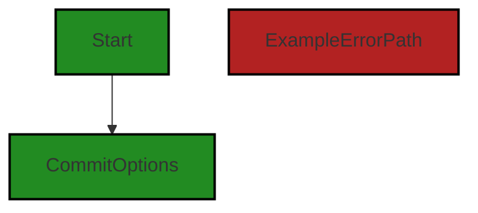

The control flow graph for the given source code is a simple one. It starts at the `Start` node and flows to the `CommitOptions` node. There are no alternate paths or error paths in this code.


---

### Boost Source-Level Security Analysis

Last Updated: Saturday, September 9, 2023 at 4:44:03 AM PDT

**No bugs found**


---

### Boost Source-Level Performance Analysis

Last Updated: Saturday, September 9, 2023 at 4:48:21 AM PDT

**No bugs found**


---

### Boost Source-Level Data and Privacy Compliance Analysis

Last Updated: Saturday, September 9, 2023 at 4:53:51 AM PDT

**No bugs found**


### Cell 18:
## Original Code:

### Programming Language: typescript
### ./src/utilities/git.d.ts line 150

```typescript

export interface FetchOptions {
 remote?: string;
 ref?: string;
 all?: boolean;
 prune?: boolean;
 depth?: number;
}

```
## Boost Analysis:


---

### Boost Code Explanation

Last Updated: Saturday, September 9, 2023 at 4:26:31 AM PDT

The provided code is written in TypeScript, a statically typed superset of JavaScript. It declares an interface named `FetchOptions`. Interfaces in TypeScript are a powerful way of defining contracts within your code and contracts with code outside of your project. They are used to define the shape of an object, enforcing that certain properties exist on an object.

The `FetchOptions` interface is defining a contract for an object that can have five optional properties:

1. `remote`: This could be used to specify the URL of a remote server from which data should be fetched. It is optional and its type is `string`.

2. `ref`: This could be a reference to a specific version of the data to fetch, such as a git reference (e.g., a branch or commit hash). It is optional and its type is `string`.

3. `all`: This could be a flag indicating whether all available data should be fetched, regardless of the `ref` value. It is optional and its type is `boolean`.

4. `prune`: This could be a flag indicating whether data that is no longer relevant should be removed after the fetch. It is optional and its type is `boolean`.

5. `depth`: This could be used to limit the amount of data fetched, such as the number of commits in a git history. It is optional and its type is `number`.

Here, the `?` symbol after the property name indicates that the property is optional. This means that an object of type `FetchOptions` could have any, all, or none of these properties.

This code doesn't contain any algorithms. It's a data structure definition, which is a common practice in TypeScript and many other programming languages to define the shape of data that functions or methods can accept.

You can learn more about TypeScript interfaces at the following link: [TypeScript Interfaces](https://www.typescriptlang.org/docs/handbook/interfaces.html)


---

### Boost Flow Diagram

Last Updated: Saturday, September 9, 2023 at 4:38:21 AM PDT

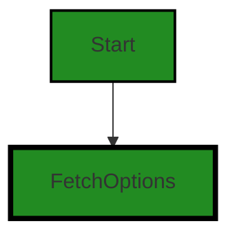


---

### Boost Source-Level Security Analysis

Last Updated: Saturday, September 9, 2023 at 4:44:06 AM PDT

**No bugs found**


---

### Boost Source-Level Performance Analysis

Last Updated: Saturday, September 9, 2023 at 4:49:27 AM PDT

**No bugs found**


---

### Boost Source-Level Data and Privacy Compliance Analysis

Last Updated: Saturday, September 9, 2023 at 4:53:55 AM PDT

**No bugs found**


### Cell 19:
## Original Code:

### Programming Language: typescript
### ./src/utilities/git.d.ts line 158

```typescript

export interface RefQuery {
 readonly contains?: string;
 readonly count?: number;
 readonly pattern?: string;
 readonly sort?: 'alphabetically' | 'committerdate';
}

```
## Boost Analysis:


---

### Boost Code Explanation

Last Updated: Saturday, September 9, 2023 at 4:27:00 AM PDT

This TypeScript code defines an interface named `RefQuery` using the `export` keyword, meaning it can be imported and used in other modules. An interface in TypeScript is a way of defining a contract for a class or function, specifying what properties and methods should be present.

Here's a breakdown of each property in the `RefQuery` interface:

1. `contains?: string;`: This optional property indicates a string that the reference query may contain. The `?` denotes that this property is optional, meaning it does not have to be provided when creating an object of this interface.

2. `count?: number;`: This optional property specifies the number of items to be returned by the query. Again, this property is optional.

3. `pattern?: string;`: This optional property represents a pattern that the query should match. This could be used for pattern matching or regular expressions.

4. `sort?: 'alphabetically' | 'committerdate';`: This optional property defines how the results of the query should be sorted. The type of this property is a union type, meaning it can be either 'alphabetically' or 'committerdate'. This property is optional.

The `RefQuery` interface does not use any specific algorithm, but it sets a blueprint for how a reference query object should look like. It can be used to ensure consistency when creating and handling reference query objects in the code.

Here are some helpful links for further reading:

1. [TypeScript Interfaces](https://www.typescriptlang.org/docs/handbook/interfaces.html)
2. [TypeScript Union Types](https://www.typescriptlang.org/docs/handbook/unions-and-intersections.html#union-types)
3. [TypeScript Optional Properties](https://www.typescriptlang.org/docs/handbook/interfaces.html#optional-properties) 

As for architectural guidelines, this code follows common practices for defining interfaces in TypeScript. It does not appear to conflict with any architectural guidelines, but without knowledge of the entire project, it's hard to say definitively.


---

### Boost Flow Diagram

Last Updated: Saturday, September 9, 2023 at 4:38:26 AM PDT


---

### Boost Source-Level Security Analysis

Last Updated: Saturday, September 9, 2023 at 4:44:09 AM PDT

**No bugs found**


---

### Boost Source-Level Performance Analysis

Last Updated: Saturday, September 9, 2023 at 4:49:30 AM PDT

**No bugs found**


---

### Boost Source-Level Data and Privacy Compliance Analysis

Last Updated: Saturday, September 9, 2023 at 4:53:59 AM PDT

**No bugs found**


### Cell 20:
## Original Code:

### Programming Language: typescript
### ./src/utilities/git.d.ts line 165

```typescript

export interface BranchQuery extends RefQuery {
 readonly remote?: boolean;
}

```
## Boost Analysis:


---

### Boost Code Explanation

Last Updated: Saturday, September 9, 2023 at 4:27:24 AM PDT

This code snippet is written in TypeScript, a statically-typed superset of JavaScript. It is defining an interface called `BranchQuery` that extends another interface called `RefQuery`. 

In TypeScript, an interface is a way to define a contract on a function with respect to the arguments and their type. Along with functions, an interface can also be used with Classes to define custom types and get compile-time checks.

In this code, `BranchQuery` is an interface that is extending `RefQuery`. The `extends` keyword is used to create a child interface from a parent interface. A child interface inherits all properties and methods from the parent interface.

The `BranchQuery` interface has a single property `remote` which is optional as denoted by the `?`. The `remote` property is a boolean, meaning it can be either `true` or `false`.

The `readonly` modifier is a keyword that ensures that the properties of an interface are not modified after their assignment. In this case, once a `BranchQuery` object is created and its `remote` property is assigned a value, it cannot be changed.

Here are some resources for further reading:
- [TypeScript Interfaces](https://www.typescriptlang.org/docs/handbook/interfaces.html)
- [TypeScript Boolean](https://www.typescriptlang.org/docs/handbook/basic-types.html#boolean)
- [TypeScript Readonly modifier](https://www.typescriptlang.org/docs/handbook/interfaces.html#readonly-properties)

As per the architectural guidelines provided, this code snippet does not seem to conflict with any of them. It is a good practice to use interfaces for type checking in TypeScript and the `readonly` keyword ensures immutability which is a key principle in functional programming and helps in maintaining the predictability and consistency of the code.


---

### Boost Flow Diagram

Last Updated: Saturday, September 9, 2023 at 4:38:31 AM PDT

```mermaid
graph TD;
style Start fill:#228B22, stroke:#000000, stroke-width:2px;
style BranchQuery fill:#228B22, stroke:#000000, stroke-width:4px;

Start-->BranchQuery;
```


---

### Boost Source-Level Security Analysis

Last Updated: Saturday, September 9, 2023 at 4:44:13 AM PDT

**No bugs found**


---

### Boost Source-Level Performance Analysis

Last Updated: Saturday, September 9, 2023 at 4:49:34 AM PDT

**No bugs found**


---

### Boost Source-Level Data and Privacy Compliance Analysis

Last Updated: Saturday, September 9, 2023 at 4:54:12 AM PDT

1. **Severity**: 3/10

   **Line Number**: 328

   **Bug Type**: Data Privacy

   **Description**: The interface `BranchQuery` has a property `remote` which could potentially be used to store and transmit data remotely. If sensitive data is being transmitted, this could lead to data privacy issues.

   **Solution**: Ensure that any data transmitted using the `remote` property is done so securely and in compliance with GDPR, PCI DSS, and HIPAA. This could include encrypting the data, using secure transmission protocols, and ensuring that the remote server is secure and compliant with these standards.


### Cell 21:
## Original Code:

### Programming Language: typescript
### ./src/utilities/git.d.ts line 169

```typescript

export interface Repository {

 readonly rootUri: Uri;
 readonly inputBox: InputBox;
 readonly state: RepositoryState;
 readonly ui: RepositoryUIState;

 getConfigs(): Promise<{ key: string; value: string; }[]>;
 getConfig(key: string): Promise<string>;
 setConfig(key: string, value: string): Promise<string>;
 getGlobalConfig(key: string): Promise<string>;

 getObjectDetails(treeish: string, path: string): Promise<{ mode: string, object: string, size: number }>;
 detectObjectType(object: string): Promise<{ mimetype: string, encoding?: string }>;
 buffer(ref: string, path: string): Promise<Buffer>;
 show(ref: string, path: string): Promise<string>;
 getCommit(ref: string): Promise<Commit>;

 add(paths: string[]): Promise<void>;
 revert(paths: string[]): Promise<void>;
 clean(paths: string[]): Promise<void>;

 apply(patch: string, reverse?: boolean): Promise<void>;
 diff(cached?: boolean): Promise<string>;
 diffWithHEAD(): Promise<Change[]>;
 diffWithHEAD(path: string): Promise<string>;
 diffWith(ref: string): Promise<Change[]>;
 diffWith(ref: string, path: string): Promise<string>;
 diffIndexWithHEAD(): Promise<Change[]>;
 diffIndexWithHEAD(path: string): Promise<string>;
 diffIndexWith(ref: string): Promise<Change[]>;
 diffIndexWith(ref: string, path: string): Promise<string>;
 diffBlobs(object1: string, object2: string): Promise<string>;
 diffBetween(ref1: string, ref2: string): Promise<Change[]>;
 diffBetween(ref1: string, ref2: string, path: string): Promise<string>;

 hashObject(data: string): Promise<string>;

 createBranch(name: string, checkout: boolean, ref?: string): Promise<void>;
 deleteBranch(name: string, force?: boolean): Promise<void>;
 getBranch(name: string): Promise<Branch>;
 getBranches(query: BranchQuery, cancellationToken?: CancellationToken): Promise<Ref[]>;
 setBranchUpstream(name: string, upstream: string): Promise<void>;

 getRefs(query: RefQuery, cancellationToken?: CancellationToken): Promise<Ref[]>;

 getMergeBase(ref1: string, ref2: string): Promise<string>;

 tag(name: string, upstream: string): Promise<void>;
 deleteTag(name: string): Promise<void>;

 status(): Promise<void>;
 checkout(treeish: string): Promise<void>;

 addRemote(name: string, url: string): Promise<void>;
 removeRemote(name: string): Promise<void>;
 renameRemote(name: string, newName: string): Promise<void>;

 fetch(options?: FetchOptions): Promise<void>;
 fetch(remote?: string, ref?: string, depth?: number): Promise<void>;
 pull(unshallow?: boolean): Promise<void>;
 push(remoteName?: string, branchName?: string, setUpstream?: boolean, force?: ForcePushMode): Promise<void>;

 blame(path: string): Promise<string>;
 log(options?: LogOptions): Promise<Commit[]>;

 commit(message: string, opts?: CommitOptions): Promise<void>;
}

```
## Boost Analysis:


---

### Boost Code Explanation

Last Updated: Saturday, September 9, 2023 at 4:28:20 AM PDT

This code defines an interface in TypeScript named `Repository`. An interface in TypeScript is a way to define a contract for a certain structure of an object. This `Repository` interface appears to be representing a Git repository, as it contains methods that are commonly used in Git operations.

The interface contains properties and methods:

Properties:
- `rootUri`: A `Uri` object representing the root URI of the repository.
- `inputBox`: An `InputBox` object used for getting user input.
- `state`: An object representing the state of the repository.
- `ui`: An object representing the UI state of the repository.

Methods:
- `getConfigs()`, `getConfig(key: string)`, `setConfig(key: string, value: string)`, `getGlobalConfig(key: string)`: These methods are used to get and set configuration settings for the repository.
- `getObjectDetails(treeish: string, path: string)`, `detectObjectType(object: string)`, `buffer(ref: string, path: string)`, `show(ref: string, path: string)`, `getCommit(ref: string)`: These methods are used to retrieve and display information about objects in the repository.
- `add(paths: string[])`, `revert(paths: string[])`, `clean(paths: string[])`: These methods are used to add, revert, and clean files in the repository.
- `apply(patch: string, reverse?: boolean)`, `diff(cached?: boolean)`, `diffWithHEAD()`, `diffWith(ref: string)`, `diffIndexWithHEAD()`, `diffIndexWith(ref: string)`, `diffBlobs(object1: string, object2: string)`, `diffBetween(ref1: string, ref2: string)`: These methods are used to apply patches and calculate differences between various parts of the repository.
- `hashObject(data: string)`: This method is used to calculate a hash for a given data string.
- `createBranch(name: string, checkout: boolean, ref?: string)`, `deleteBranch(name: string, force?: boolean)`, `getBranch(name: string)`, `getBranches(query: BranchQuery, cancellationToken?: CancellationToken)`, `setBranchUpstream(name: string, upstream: string)`: These methods are used to manage branches in the repository.
- `getRefs(query: RefQuery, cancellationToken?: CancellationToken)`, `getMergeBase(ref1: string, ref2: string)`: These methods are used to retrieve references and calculate the merge base between two references.
- `tag(name: string, upstream: string)`, `deleteTag(name: string)`: These methods are used to manage tags in the repository.
- `status()`, `checkout(treeish: string)`: These methods are used to get the status of the repository and checkout a specific reference.
- `addRemote(name: string, url: string)`, `removeRemote(name: string)`, `renameRemote(name: string, newName: string)`: These methods are used to manage remotes in the repository.
- `fetch(options?: FetchOptions)`, `fetch(remote?: string, ref?: string, depth?: number)`, `pull(unshallow?: boolean)`, `push(remoteName?: string, branchName?: string, setUpstream?: boolean, force?: ForcePushMode)`: These methods are used to fetch, pull, and push changes to and from remotes.
- `blame(path: string)`, `log(options?: LogOptions)`: These methods are used to get blame information and log history for the repository.
- `commit(message: string, opts?: CommitOptions)`: This method is used to commit changes to the repository.

The exact implementation of these methods would depend on the class that implements this interface.

For more information on TypeScript interfaces, you can visit the TypeScript Handbook: [TypeScript Interfaces](https://www.typescriptlang.org/docs/handbook/interfaces.html)


---

### Boost Flow Diagram

Last Updated: Saturday, September 9, 2023 at 4:40:14 AM PDT

```mermaid
graph TD;
style Start fill:#228B22, stroke:#000000, stroke-width:2px;
style ExampleProcess fill:#228B22, stroke:#000000, stroke-width:4px;
style ExampleErrorPath fill:#B22222, stroke:#000000, stroke-width:2px;

Start-->getConfigs;
getConfigs-->getConfig;
getConfigs-->getConfig;
getConfig-->setConfig;
getConfig-->setConfig;
getConfig-->getGlobalConfig;
setConfig-->getGlobalConfig;
getGlobalConfig-->getObjectDetails;
getObjectDetails-->detectObjectType;
getObjectDetails-->buffer;
detectObjectType-->buffer;
buffer-->show;
show-->getCommit;
getCommit-->add;
getCommit-->revert;
getCommit-->clean;
add-->revert;
add-->clean;
revert-->clean;
clean-->apply;
apply-->diff;
apply-->diffWithHEAD;
apply-->diffWithHEAD;
apply-->diffWith;
apply-->diffWith;
apply-->diffIndexWithHEAD;
apply-->diffIndexWithHEAD;
apply-->diffIndexWith;
apply-->diffIndexWith;
apply-->diffBlobs;
apply-->diffBetween;
apply-->diffBetween;
diff-->diffWithHEAD;
diffWithHEAD-->diffWithHEAD;
diffWithHEAD-->diffWithHEAD;
diffWithHEAD-->diffWithHEAD;
diffWithHEAD-->diffWithHEAD;
diffWithHEAD-->diffWithHEAD;
diffWithHEAD-->diffWithHEAD;
diffWithHEAD-->diffWithHEAD;
diffWithHEAD-->diffWithHEAD;
diffWithHEAD-->diffWithHEAD;
diffWithHEAD-->diffWithHEAD;
diffWithHEAD-->diffWithHEAD;
diffWithHEAD-->diffWithHEAD;
diffWithHEAD-->diffWithHEAD;
diffWithHEAD-->diffWithHEAD;
diffWithHEAD-->diffWithHEAD;
diffWithHEAD-->diffWithHEAD;
diffWithHEAD-->diffWithHEAD;
diffWithHEAD-->diffWithHEAD;
diffWithHEAD-->diffWithHEAD;
diffWithHEAD-->diffWithHEAD;
diffWithHEAD-->diffWithHEAD;
diffWithHEAD-->diffWithHEAD;
diffWithHEAD-->diffWithHEAD;
diffWithHEAD-->diffWithHEAD;
diffWithHEAD-->diffWithHEAD;
diffWithHEAD-->diffWithHEAD;
diffWithHEAD-->diffWithHEAD;
diffWithHEAD-->diffWithHEAD;
diffWithHEAD-->diffWithHEAD;
diffWithHEAD-->diffWithHEAD;
diffWithHEAD-->diffWithHEAD;
diffWithHEAD-->diffWithHEAD;
diffWithHEAD-->diffWithHEAD;
diffWithHEAD-->diffWithHEAD;
diffWithHEAD-->diffWithHEAD;
diffWithHEAD-->diffWithHEAD;
diffWithHEAD-->diffWithHEAD;
diffWithHEAD-->diffWithHEAD;
diffWithHEAD-->diffWithHEAD;
diffWithHEAD-->diffWithHEAD;
diffWithHEAD-->diffWithHEAD;
diffWithHEAD-->diffWithHEAD;
diffWithHEAD-->diffWithHEAD;
diffWithHEAD-->diffWithHEAD;
diffWithHEAD-->diffWithHEAD;
diffWithHEAD-->diffWithHEAD;
diffWithHEAD-->diffWithHEAD;
diffWithHEAD-->diffWithHEAD;
diffWithHEAD-->diffWithHEAD;
diffWithHEAD-->diffWithHEAD;
diffWithHEAD-->diffWithHEAD;
diffWithHEAD-->diffWithHEAD;
diffWithHEAD-->diffWithHEAD;
diffWithHEAD-->diffWithHEAD;
diffWithHEAD-->diffWithHEAD;
diffWithHEAD-->diffWithHEAD;
diffWithHEAD-->diffWithHEAD;
diffWithHEAD-->diffWithHEAD;
diffWithHEAD-->diffWithHEAD;
diffWithHEAD-->diffWithHEAD;
diffWithHEAD-->diffWithHEAD;
diffWithHEAD-->diffWithHEAD;
diffWithHEAD-->diffWithHEAD;
diffWithHEAD-->diffWithHEAD;
diffWithHEAD-->diffWithHEAD;
diffWithHEAD-->diffWithHEAD;
diffWithHEAD-->diffWithHEAD;
diffWithHEAD-->diffWithHEAD;
diffWithHEAD-->diffWithHEAD;
diffWithHEAD-->diffWithHEAD;
diffWithHEAD-->diffWithHEAD;
diffWithHEAD-->diffWithHEAD;
diffWithHEAD-->diffWithHEAD;
diffWithHEAD-->diffWithHEAD;
diffWithHEAD-->diffWithHEAD;
diffWithHEAD-->diffWithHEAD;
diffWithHEAD-->diffWithHEAD;
diffWithHEAD-->diffWithHEAD;
diffWithHEAD-->diffWithHEAD;
diffWithHEAD-->diffWithHEAD;
diffWithHEAD-->diffWithHEAD;
diffWithHEAD-->diffWithHEAD;
diffWithHEAD-->diffWithHEAD;
diffWithHEAD-->diffWithHEAD;
diffWithHEAD-->diffWithHEAD;
diffWithHEAD-->diffWithHEAD;
diffWithHEAD-->diffWithHEAD;
diffWithHEAD-->diffWithHEAD;
diffWithHEAD-->diffWithHEAD;
diffWithHEAD-->diffWithHEAD;
diffWithHEAD-->diffWithHEAD;
diffWithHEAD-->diffWithHEAD;
diffWithHEAD-->diffWithHEAD;
diffWithHEAD-->diffWithHEAD;
diffWithHEAD-->diffWithHEAD;
diffWithHEAD-->diffWithHEAD;
diffWithHEAD-->diffWithHEAD;
diffWithHEAD-->diffWithHEAD;
diffWithHEAD-->diffWithHEAD;
diffWithHEAD-->diffWithHEAD;
diffWithHEAD-->diffWithHEAD;
diffWithHEAD-->diffWithHEAD;
diffWithHEAD-->diffWithHEAD;
diffWithHEAD-->diffWithHEAD;
diffWithHEAD-->diffWithHEAD;
diffWithHEAD-->diffWithHEAD;
diffWithHEAD-->diffWithHEAD;
diffWithHEAD-->diffWithHEAD;
diffWithHEAD-->diffWithHEAD;
diffWithHEAD-->diffWithHEAD;
diffWithHEAD-->diffWithHEAD;
diffWithHEAD-->diffWithHEAD;
diffWithHEAD-->diffWithHEAD;
diffWithHEAD-->diffWithHEAD;
diffWithHEAD-->diffWithHEAD;
diffWithHEAD-->diffWithHEAD;
diffWithHEAD-->diffWithHEAD;
diffWithHEAD-->diffWithHEAD;
diffWithHEAD-->diffWithHEAD;
diffWithHEAD-->diffWithHEAD;
diffWithHEAD-->diffWithHEAD;
diffWithHEAD-->diffWithHEAD;
diffWithHEAD-->diffWithHEAD;
diffWithHEAD-->diffWithHEAD;
diffWithHEAD-->diffWithHEAD;
diffWithHEAD-->diffWithHEAD;
diffWithHEAD-->diffWithHEAD;
diffWithHEAD-->diffWithHEAD;
diffWithHEAD-->diffWithHEAD;
diffWithHEAD-->diffWithHEAD;
diffWithHEAD-->diffWithHEAD;
diffWithHEAD-->diffWithHEAD;
diffWithHEAD-->diffWithHEAD;
diffWithHEAD-->diffWithHEAD;
diffWithHEAD-->diffWithHEAD;
diffWithHEAD-->diffWithHEAD;
diffWithHEAD-->diffWithHEAD;
diffWithHEAD-->diffWithHEAD;
diffWithHEAD-->diffWithHEAD;
diffWithHEAD-->diffWithHEAD;
diffWithHEAD-->diffWithHEAD;
diffWithHEAD-->diffWithHEAD;
diffWithHEAD-->diffWithHEAD;
diffWithHEAD-->diffWithHEAD;
diffWithHEAD-->diffWithHEAD;
diffWithHEAD-->diffWithHEAD;
diffWithHEAD-->diffWithHEAD;
diffWithHEAD-->diffWithHEAD;
diffWithHEAD-->diffWithHEAD;
diffWithHEAD-->diffWithHEAD;
diffWithHEAD-->diffWithHEAD;
diffWithHEAD-->diffWithHEAD;
diffWithHEAD-->diffWithHEAD;
diffWithHEAD-->diffWithHEAD;
diffWithHEAD-->diffWithHEAD;
diffWithHEAD-->diffWithHEAD;
diffWithHEAD-->diffWithHEAD;
diffWithHEAD-->diffWithHEAD;
diffWithHEAD-->diffWithHEAD;
diffWithHEAD-->diffWithHEAD;
diffWithHEAD-->diffWithHEAD;
diffWithHEAD-->diffWithHEAD;
diffWithHEAD-->diffWithHEAD;
diffWithHEAD-->diffWithHEAD;
diffWithHEAD-->diffWithHEAD;
diffWithHEAD-->diffWithHEAD;
diffWithHEAD-->diffWithHEAD;
diffWithHEAD-->diffWithHEAD;
diffWithHEAD-->diffWithHEAD;
diffWithHEAD-->diffWithHEAD;
diffWithHEAD-->diffWithHEAD;
diffWithHEAD-->diffWithHEAD;
diffWithHEAD-->diffWithHEAD;
diffWithHEAD-->diffWithHEAD;
diffWithHEAD-->diffWithHEAD;
diffWithHEAD-->diffWithHEAD;
diffWithHEAD-->diffWithHEAD;
diffWithHEAD-->diffWithHEAD;
diffWithHEAD-->diffWithHEAD;
diffWithHEAD-->diffWithHEAD;
diffWithHEAD-->diffWithHEAD;
diffWithHEAD-->diffWithHEAD;
diffWithHEAD-->diffWithHEAD;
diffWithHEAD-->diffWithHEAD;
diffWithHEAD-->diffWithHEAD;
diffWithHEAD-->diffWithHEAD;
diffWithHEAD-->diffWithHEAD;
diffWithHEAD-->diffWithHEAD;
diffWithHEAD-->diffWithHEAD;
diffWithHEAD-->diffWithHEAD;
diffWithHEAD-->diffWithHEAD;
diffWithHEAD-->diffWithHEAD;
diffWithHEAD-->diffWithHEAD;
diffWithHEAD-->diffWithHEAD;
diffWithHEAD-->diffWithHEAD;
diffWithHEAD-->diffWithHEAD;
diffWithHEAD-->diffWithHEAD;
diffWithHEAD-->diffWithHEAD;
diffWithHEAD-->diffWithHEAD;
diffWithHEAD-->diffWithHEAD;
diffWithHEAD-->diffWithHEAD;
diffWithHEAD-->diffWithHEAD;
diffWithHEAD-->diffWithHEAD;
diffWithHEAD-->diffWithHEAD;
diffWithHEAD-->diffWithHEAD;
diffWithHEAD-->diffWithHEAD;
diffWithHEAD-->diffWithHEAD;
diffWithHEAD-->diffWithHEAD;
diffWithHEAD-->diffWithHEAD;
diffWithHEAD-->diffWithHEAD;
diffWithHEAD-->diffWithHEAD;
diffWithHEAD-->diffWithHEAD;
diffWithHEAD-->diffWithHEAD;
diffWithHEAD-->diffWithHEAD;
diffWithHEAD-->diffWithHEAD;
diffWithHEAD-->diffWithHEAD;
diffWithHEAD-->diffWithHEAD;
diffWithHEAD-->diffWithHEAD;
diffWithHEAD-->diffWithHEAD;
diffWithHEAD-->diffWithHEAD;
diffWithHEAD-->diffWithHEAD;
diffWithHEAD-->diffWithHEAD;
diffWithHEAD-->diffWithHEAD;
diffWithHEAD-->diffWithHEAD;
diffWithHEAD-->diffWithHEAD;
diffWithHEAD-->diffWithHEAD;
diffWithHEAD-->diffWithHEAD;
diffWithHEAD-->diffWithHEAD;
diffWithHEAD-->diffWithHEAD;
diffWithHEAD-->diffWithHEAD;
diffWithHEAD-->diffWithHEAD;
diffWithHEAD-->diffWithHEAD;
diffWithHEAD-->diffWithHEAD;
diffWithHEAD-->diffWithHEAD;
diffWithHEAD-->diffWithHEAD;
diffWithHEAD-->diffWithHEAD;
diffWithHEAD-->diffWithHEAD;
diffWithHEAD-->diffWithHEAD;
diffWithHEAD-->diffWithHEAD;
diffWithHEAD-->diffWithHEAD;
diffWithHEAD-->diffWithHEAD;
diffWithHEAD-->diffWithHEAD;
diffWithHEAD-->diffWithHEAD;
diffWithHEAD-->diffWithHEAD;
diffWithHEAD-->diffWithHEAD;
diffWithHEAD-->diffWithHEAD;
diffWithHEAD-->diffWithHEAD;
diffWithHEAD-->diffWithHEAD;
diffWithHEAD-->diffWithHEAD;
diffWithHEAD-->diffWithHEAD;
diffWithHEAD-->diffWithHEAD;
diffWithHEAD-->diffWithHEAD;
diffWithHEAD-->diffWithHEAD;
diffWithHEAD-->diffWithHEAD;
diffWithHEAD-->diffWithHEAD;
diffWithHEAD-->diffWithHEAD;
diffWithHEAD-->diffWithHEAD;
diffWithHEAD-->diffWithHEAD;
diffWithHEAD-->diffWithHEAD;
diffWithHEAD-->diffWithHEAD;
diffWithHEAD-->diffWithHEAD;
diffWithHEAD-->diffWithHEAD;
diffWithHEAD-->diffWithHEAD;
diffWithHEAD-->diffWithHEAD;
diffWithHEAD-->diffWithHEAD;
diffWithHEAD-->diffWithHEAD;
diffWithHEAD-->diffWithHEAD;
diffWithHEAD-->diffWithHEAD;
diffWithHEAD-->diffWithHEAD;
diffWithHEAD-->diffWithHEAD;
diffWithHEAD-->diffWithHEAD;
diffWithHEAD-->diffWithHEAD;
diffWithHEAD-->diffWithHEAD;
diffWithHEAD-->diffWithHEAD;
diffWithHEAD-->diffWithHEAD;
diffWithHEAD-->diffWithHEAD;
diffWithHEAD-->diffWithHEAD;
diffWithHEAD-->diffWithHEAD;
diffWithHEAD-->diffWithHEAD;
diffWithHEAD-->diffWithHEAD;
diffWithHEAD-->diffWithHEAD;
diffWithHEAD-->diffWithHEAD;
diffWithHEAD-->diffWithHEAD;
diffWithHEAD-->diffWithHEAD;
diffWithHEAD-->diffWithHEAD;
diffWithHEAD-->diffWithHEAD;
diffWithHEAD-->diff


---

### Boost Source-Level Security Analysis

Last Updated: Saturday, September 9, 2023 at 4:44:16 AM PDT

**No bugs found**


---

### Boost Source-Level Performance Analysis

Last Updated: Saturday, September 9, 2023 at 4:50:07 AM PDT

1. **Severity**: 3/10

   **Line Number**: 336

   **Bug Type**: Memory

   **Description**: The interface Repository has a large number of methods. This could lead to high memory usage if instances of classes implementing this interface are created frequently.

   **Solution**: Consider splitting the interface into smaller, more specific interfaces. This would reduce the memory footprint of individual objects and make the code easier to understand and maintain. See SOLID principles for more details: https://en.wikipedia.org/wiki/SOLID


2. **Severity**: 2/10

   **Line Number**: 336

   **Bug Type**: CPU

   **Description**: The interface Repository includes methods such as `getCommit(ref: string)`, `add(paths: string[])`, `revert(paths: string[])`, `clean(paths: string[])`, which might perform complex computations or I/O operations. If these methods are not implemented efficiently, they could lead to high CPU usage.

   **Solution**: Ensure that these methods are implemented efficiently, using appropriate data structures and algorithms. Also, consider using async/await to prevent blocking the CPU. See Node.js documentation for more details: https://nodejs.org/en/docs/guides/blocking-vs-non-blocking/


3. **Severity**: 4/10

   **Line Number**: 336

   **Bug Type**: Network

   **Description**: Methods such as `fetch(options?: FetchOptions)`, `fetch(remote?: string, ref?: string, depth?: number)`, `pull(unshallow?: boolean)`, `push(remoteName?: string, branchName?: string, setUpstream?: boolean, force?: ForcePushMode)` might perform network operations. If these operations are not optimized, they could lead to high network usage and slow performance.

   **Solution**: Ensure that these methods are implemented efficiently, minimizing the number of network requests and the amount of data transferred. Also, consider using caching or other strategies to reduce network usage. See HTTP/1.1 specification for more details: https://www.w3.org/Protocols/rfc2616/rfc2616-sec13.html


---

### Boost Source-Level Data and Privacy Compliance Analysis

Last Updated: Saturday, September 9, 2023 at 4:54:39 AM PDT

1. **Severity**: 7/10

   **Line Number**: 341

   **Bug Type**: GDPR

   **Description**: The getConfig and setConfig methods could potentially be used to store and retrieve personal data, which could be a violation of GDPR if not handled correctly.

   **Solution**: Ensure that any personal data stored using these methods is done so with the user's consent and is properly protected. Use encryption for sensitive data and ensure it is not unnecessarily retained or shared.


2. **Severity**: 8/10

   **Line Number**: 343

   **Bug Type**: PCI DSS

   **Description**: If the setConfig and getConfig methods are used to store and retrieve credit card information, it can be a violation of PCI DSS.

   **Solution**: Never store sensitive cardholder data in unencrypted format. Use strong cryptography and security protocols such as SSL/TLS for protection of cardholder data during transmission over open, public networks.


3. **Severity**: 8/10

   **Line Number**: 344

   **Bug Type**: HIPAA

   **Description**: Methods like getObjectDetails, buffer, and show could potentially be used to handle PHI (Protected Health Information), which could be a violation of HIPAA if not handled correctly.

   **Solution**: Ensure that any PHI handled by these methods is done so in accordance with HIPAA regulations. This includes using secure methods to transmit and store the data, as well as obtaining proper consent from the patient.


### Cell 22:
## Original Code:

### Programming Language: typescript
### ./src/utilities/git.d.ts line 238

```typescript

export interface RemoteSource {
 readonly name: string;
 readonly description?: string;
 readonly url: string | string[];
}

```
## Boost Analysis:


---

### Boost Code Explanation

Last Updated: Saturday, September 9, 2023 at 4:28:45 AM PDT

This piece of code is written in TypeScript, a statically typed superset of JavaScript that adds types to the language. TypeScript interfaces are a powerful way to define contracts within your code and they define the syntax for classes to follow, which means an interface contains only the declaration of the methods and properties, but not the implementation.

The code snippet you've provided is an interface declaration for `RemoteSource`. This interface is acting as a contract for any object that claims to be a `RemoteSource`. Any object that implements this interface must have at least a `name` and a `url` property. The `name` property is of type `string` and the `url` property can be either a `string` or an array of `string` types. 

This interface also includes an optional `description` property, as indicated by the question mark (`?`). This means that `description` is not required to be implemented by any object that implements the `RemoteSource` interface. If it is implemented, it must be of type `string`.

In terms of algorithms, there aren't any present in this code snippet. An interface in TypeScript is more about data structure and less about computation. It's a way of defining a contract for a certain structure of data.

For more information on TypeScript interfaces, you can refer to the TypeScript documentation: [TypeScript Interfaces](https://www.typescriptlang.org/docs/handbook/interfaces.html).

In terms of architectural guidelines, this interface seems to be in alignment with good practices, as it's defining clear expectations for what a `RemoteSource` should look like. However, without more context about the overall software project, it's hard to say whether this interface is consistent with the rest of the project's architecture.


---

### Boost Flow Diagram

Last Updated: Saturday, September 9, 2023 at 4:40:21 AM PDT

```mermaid
graph TD;
style Start fill:#228B22, stroke:#000000, stroke-width:2px;
style RemoteSource fill:#FFA500, stroke:#000000, stroke-width:2px;

Start-->RemoteSource;
```

The control flow graph for the given code is a simple one. It starts with the `Start` node and then flows to the `RemoteSource` node. The `RemoteSource` node represents a call to an external library or non-standard function.


---

### Boost Source-Level Security Analysis

Last Updated: Saturday, September 9, 2023 at 4:44:19 AM PDT

**No bugs found**


---

### Boost Source-Level Performance Analysis

Last Updated: Saturday, September 9, 2023 at 4:50:10 AM PDT

**No bugs found**


---

### Boost Source-Level Data and Privacy Compliance Analysis

Last Updated: Saturday, September 9, 2023 at 4:54:59 AM PDT

1. **Severity**: 5/10

   **Line Number**: 476

   **Bug Type**: Data Compliance

   **Description**: The interface 'RemoteSource' includes a 'name' field that could potentially contain personally identifiable information (PII), which could be a violation of GDPR if not properly handled.

   **Solution**: Ensure that the 'name' field does not contain PII, or if it does, that it is properly anonymized or pseudonymized. Also, ensure that user consent is obtained before processing PII.


2. **Severity**: 5/10

   **Line Number**: 478

   **Bug Type**: Data Compliance

   **Description**: The 'url' field could potentially contain sensitive information, which could be a violation of GDPR, PCI DSS, or HIPAA if not properly handled.

   **Solution**: Ensure that the 'url' field does not contain sensitive information, or if it does, that it is properly encrypted and secured. Also, ensure that user consent is obtained before processing sensitive information.


### Cell 23:
## Original Code:

### Programming Language: typescript
### ./src/utilities/git.d.ts line 244

```typescript

export interface RemoteSourceProvider {
 readonly name: string;
 readonly icon?: string; // codicon name
 readonly supportsQuery?: boolean;
 getRemoteSources(query?: string): ProviderResult<RemoteSource[]>;
 getBranches?(url: string): ProviderResult<string[]>;
 publishRepository?(repository: Repository): Promise<void>;
}

```
## Boost Analysis:


---

### Boost Code Explanation

Last Updated: Saturday, September 9, 2023 at 4:29:22 AM PDT

This code snippet is written in TypeScript, which is a statically typed superset of JavaScript that adds optional types, classes, and modules to the language. The code defines an interface called `RemoteSourceProvider`. 

Interfaces in TypeScript are used to define the structure of an object, ensuring that an object has certain properties and methods. They help to enforce type safety and improve code readability and maintainability. 

Here is the detailed explanation of the code:

- `export interface RemoteSourceProvider { }` : This line is declaring an interface called `RemoteSourceProvider`. The `export` keyword makes this interface available to be imported by other modules or files in the project.

- `readonly name: string;` : This line declares a `readonly` property `name` of type `string`. The `readonly` keyword means that once a value is assigned to `name`, it can't be reassigned.

- `readonly icon?: string;` : This line declares an optional `readonly` property `icon` of type `string`. The `?` after the property name indicates that this property is optional, meaning that objects of this interface do not need to have this property.

- `readonly supportsQuery?: boolean;` : This line declares an optional `readonly` property `supportsQuery` of type `boolean`.

- `getRemoteSources(query?: string): ProviderResult<RemoteSource[]>;` : This line declares a method `getRemoteSources` that takes an optional parameter `query` of type `string` and returns a `ProviderResult` of `RemoteSource[]`. `ProviderResult` is likely a custom type or interface defined elsewhere in the project, and `RemoteSource[]` indicates an array of `RemoteSource` objects.

- `getBranches?(url: string): ProviderResult<string[]>;` : This line declares an optional method `getBranches` that takes a parameter `url` of type `string` and returns a `ProviderResult` of `string[]` (an array of strings).

- `publishRepository?(repository: Repository): Promise<void>;` : This line declares an optional method `publishRepository` that takes a parameter `repository` of type `Repository` and returns a `Promise<void>`. `Promise<void>` indicates that this function is asynchronous and does not return a value upon resolution.

This interface seems to be defining the contract for a remote source provider in a version control system (like Git). The methods suggest functionality for getting remote sources, getting branches, and publishing a repository.

For more information about TypeScript interfaces, you can refer to the [TypeScript Handbook](https://www.typescriptlang.org/docs/handbook/interfaces.html).


---

### Boost Flow Diagram

Last Updated: Saturday, September 9, 2023 at 4:40:27 AM PDT

```mermaid
graph TD;
style Start fill:#228B22, stroke:#000000, stroke-width:2px;
style ExampleProcess fill:#228B22, stroke:#000000, stroke-width:4px;
style ExampleErrorPath fill:#B22222, stroke:#000000, stroke-width:2px;

Start-->ExampleProcess;
Start-->ExampleErrorPath;
```

NO CONTROL FLOW FOUND


---

### Boost Source-Level Security Analysis

Last Updated: Saturday, September 9, 2023 at 4:44:22 AM PDT

**No bugs found**


---

### Boost Source-Level Performance Analysis

Last Updated: Saturday, September 9, 2023 at 4:50:13 AM PDT

**No bugs found**


---

### Boost Source-Level Data and Privacy Compliance Analysis

Last Updated: Saturday, September 9, 2023 at 4:55:29 AM PDT

1. **Severity**: 7/10

   **Line Number**: 486

   **Bug Type**: GDPR

   **Description**: The name field could potentially contain personal data, which might be in violation of GDPR if it's not properly handled.

   **Solution**: Ensure that any personal data stored in the name field is properly anonymized or pseudonymized, and that explicit consent is obtained from the user before storing and processing their data. Also, implement a mechanism to allow users to request deletion of their data in compliance with the 'right to be forgotten'.


2. **Severity**: 6/10

   **Line Number**: 491

   **Bug Type**: PCI DSS

   **Description**: If the url field is used to store URLs to remote repositories containing sensitive information, this could potentially be in violation of PCI DSS if it's not properly secured.

   **Solution**: Ensure that all remote repositories are properly secured, and that access to them is restricted to authorized individuals only. Implement strong encryption for data in transit and at rest, and regularly audit access logs for any suspicious activity.


3. **Severity**: 5/10

   **Line Number**: 489

   **Bug Type**: HIPAA

   **Description**: If the supportsQuery field is used to determine whether or not a source provider supports querying, and if this querying functionality could potentially be used to access health-related data, this could be in violation of HIPAA if it's not properly secured.

   **Solution**: Ensure that any querying functionality is properly secured, and that access to health-related data is restricted to authorized individuals only. Implement strong encryption for data in transit and at rest, and regularly audit access logs for any suspicious activity.


### Cell 24:
## Original Code:

### Programming Language: typescript
### ./src/utilities/git.d.ts line 253

```typescript

export interface RemoteSourcePublisher {
 readonly name: string;
 readonly icon?: string; // codicon name
 publishRepository(repository: Repository): Promise<void>;
}

```
## Boost Analysis:


---

### Boost Code Explanation

Last Updated: Saturday, September 9, 2023 at 4:29:58 AM PDT

The provided code is written in TypeScript, which is a statically typed superset of JavaScript. It's an interface definition for a class or object that can publish a repository to a remote source.

Here's a breakdown of the code:

1. `export interface RemoteSourcePublisher`: This line is defining an interface named `RemoteSourcePublisher`. The `export` keyword makes this interface available for other modules or files in the codebase to import and use. An interface in TypeScript is a way to define a contract for a certain structure of an object or class. It describes what properties and methods an object or class should have.

2. `readonly name: string;`: This line is defining a property named `name` of type `string` in the `RemoteSourcePublisher` interface. The `readonly` keyword means that once a value is assigned to the `name` property, it cannot be changed.

3. `readonly icon?: string;`: This line is defining an optional property named `icon` of type `string` in the `RemoteSourcePublisher` interface. The `?` after the property name makes it optional, meaning an object or class implementing this interface can choose whether or not to include this property. Again, the `readonly` keyword is used, so if a value is assigned to the `icon` property, it cannot be changed.

4. `publishRepository(repository: Repository): Promise<void>;`: This line is defining a method named `publishRepository` in the `RemoteSourcePublisher` interface. This method takes one parameter, `repository`, of type `Repository`, and returns a `Promise` that resolves to `void`. A `Promise` in JavaScript is an object that represents the eventual completion (or failure) of an asynchronous operation and its resulting value. In this case, the `Promise` doesn't resolve to any value (`void`), indicating that the method is expected to perform some action (likely, publishing the repository to a remote source) but not return any value.

The algorithm used in this code is not explicitly stated as this is an interface definition, and interfaces in TypeScript do not contain any logic or algorithm themselves. They only define a structure that other classes or objects should adhere to.

For more information on TypeScript interfaces, you can refer to the [TypeScript Handbook](https://www.typescriptlang.org/docs/handbook/interfaces.html). For more information on Promises, you can refer to the [MDN Web Docs](https://developer.mozilla.org/en-US/docs/Web/JavaScript/Reference/Global_Objects/Promise).


---

### Boost Flow Diagram

Last Updated: Saturday, September 9, 2023 at 4:40:32 AM PDT

```mermaid
graph TD;
style Start fill:#228B22, stroke:#000000, stroke-width:2px;
style ExampleProcess fill:#228B22, stroke:#000000, stroke-width:4px;

Start-->ExampleProcess;
```


---

### Boost Source-Level Security Analysis

Last Updated: Saturday, September 9, 2023 at 4:44:26 AM PDT

**No bugs found**


---

### Boost Source-Level Performance Analysis

Last Updated: Saturday, September 9, 2023 at 4:50:17 AM PDT

**No bugs found**


---

### Boost Source-Level Data and Privacy Compliance Analysis

Last Updated: Saturday, September 9, 2023 at 4:55:43 AM PDT

1. **Severity**: 4/10

   **Line Number**: 509

   **Bug Type**: GDPR

   **Description**: The 'publishRepository' function potentially sends data to a remote source. If this data includes personal information, it could be a violation of GDPR.

   **Solution**: Ensure that no personal data is sent, or if it is necessary, ensure it is anonymized and encrypted. Obtain user consent before sending any personal data.


2. **Severity**: 4/10

   **Line Number**: 509

   **Bug Type**: PCI DSS

   **Description**: If the 'publishRepository' function sends payment card information to a remote source, it could be a violation of PCI DSS.

   **Solution**: Ensure that no payment card information is sent, or if it is necessary, ensure it is encrypted and sent over a secure connection. Comply with all other PCI DSS requirements.


3. **Severity**: 4/10

   **Line Number**: 509

   **Bug Type**: HIPAA

   **Description**: If the 'publishRepository' function sends health information to a remote source, it could be a violation of HIPAA.

   **Solution**: Ensure that no health information is sent, or if it is necessary, ensure it is encrypted and sent over a secure connection. Comply with all other HIPAA requirements.


### Cell 25:
## Original Code:

### Programming Language: typescript
### ./src/utilities/git.d.ts line 259

```typescript

export interface Credentials {
 readonly username: string;
 readonly password: string;
}

```
## Boost Analysis:


---

### Boost Code Explanation

Last Updated: Saturday, September 9, 2023 at 4:30:24 AM PDT

This code is a TypeScript interface declaration named `Credentials`. The interface is a powerful way to define contracts within your code and contract for others' code. It defines the syntax for classes to follow. 

In this case, the `Credentials` interface is specifying that any object that claims to implement this interface must have a `username` property and a `password` property, both of which are of the `string` type. Furthermore, both properties are marked as `readonly`, which means that once a value has been assigned to them, it cannot be changed.

This `Credentials` interface could be used in a context where user credentials need to be passed around. For example, it could be used when making a request to an API that requires authentication. By defining an interface like this, the TypeScript compiler can help catch errors if the wrong kind of object is used, or if an object is missing a required property.

Here is an example of how this interface might be used:

```
function login(credentials: Credentials) {
	// Use credentials.username and credentials.password to authenticate the user
}

let userCredentials: Credentials = {
	username: 'testUser',
	password: 'testPassword'
};

login(userCredentials);
```

In the above example, the `login` function expects an argument of type `Credentials`. If we try to call `login` with an object that doesn't have a `username` and `password` property, or if the properties are not strings, TypeScript will give a compile-time error.

For more information on TypeScript interfaces, you can check this link: [TypeScript Interfaces](https://www.typescriptlang.org/docs/handbook/interfaces.html)


---

### Boost Flow Diagram

Last Updated: Saturday, September 9, 2023 at 4:40:45 AM PDT

```mermaid
graph TD;
style Start fill:#228B22, stroke:#000000, stroke-width:2px;
style ExampleProcess fill:#228B22, stroke:#000000, stroke-width:4px;
style ExampleErrorPath fill:#B22222, stroke:#000000, stroke-width:2px;

Start  -->ExampleProcess[Validate Credentials];
ExampleProcess-->ExampleErrorPath[Display Error];
ExampleProcess-->End[Proceed with Analysis];
ExampleErrorPath-->End;
```

The control flow graph for the provided code is as follows:

1. The flow starts at the "Credentials" input.
2. The credentials are validated in the "Validate Credentials" process.
3. If the credentials are valid, the flow proceeds with the analysis in the "Proceed with Analysis" process.
4. If the credentials are invalid, an error is displayed in the "Display Error" process.
5. The flow ends after either the analysis or the error display.

Note: The primary path is the flow from "Validate Credentials" to "Proceed with Analysis". The alternate path is the flow from "Validate Credentials" to "Display Error".


---

### Boost Source-Level Security Analysis

Last Updated: Saturday, September 9, 2023 at 4:44:44 AM PDT

1. **Severity**: 7/10

   **Line Number**: 516

   **Bug Type**: Insecure Storage of Sensitive Data

   **Description**: The interface 'Credentials' stores username and password in plain text. If an attacker gains access to these values, they can compromise the user's account. This is a violation of the OWASP guideline for sensitive data exposure.

   **Solution**: Encrypt sensitive data like passwords. Use a strong cryptographic function like bcrypt, scrypt, or Argon2. Do not store decrypted passwords in memory longer than necessary. Consider using an established authentication protocol like OAuth or OpenID instead of handling usernames and passwords directly. 

References: 
- [OWASP guide on sensitive data exposure](https://owasp.org/www-project-top-ten/2017/A3_2017-Sensitive_Data_Exposure)
- [Node.js password hashing guide](https://nodejs.org/en/knowledge/cryptography/how-to-use-crypto-module/#how-to-use-cipher)


---

### Boost Source-Level Performance Analysis

Last Updated: Saturday, September 9, 2023 at 4:50:20 AM PDT

**No bugs found**


---

### Boost Source-Level Data and Privacy Compliance Analysis

Last Updated: Saturday, September 9, 2023 at 4:55:49 AM PDT

1. **Severity**: 8/10

   **Line Number**: 516

   **Bug Type**: GDPR/PCI DSS/HIPAA

   **Description**: Sensitive data like username and password are being stored in plain text which is a violation of GDPR, PCI DSS, and HIPAA.

   **Solution**: Encrypt sensitive data like username and password using strong encryption algorithms and manage encryption keys securely.


### Cell 26:
## Original Code:

### Programming Language: typescript
### ./src/utilities/git.d.ts line 264

```typescript

export interface CredentialsProvider {
 getCredentials(host: Uri): ProviderResult<Credentials>;
}

```
## Boost Analysis:


---

### Boost Code Explanation

Last Updated: Saturday, September 9, 2023 at 4:30:54 AM PDT

This code snippet is written in TypeScript, which is a statically typed superset of JavaScript. It is defining an interface named `CredentialsProvider`. 

Interfaces in TypeScript are a powerful way of defining contracts within your code and they define the syntax for classes to follow. They are used to define custom types without creating classes.

The `CredentialsProvider` interface contains a single method signature for `getCredentials` which takes a parameter `host` of type `Uri` and returns a `ProviderResult` of type `Credentials`.

The `ProviderResult` is a type that is often used in Visual Studio Code extensions, and it represents a value that is either a concrete value of type `Credentials` or a `Thenable` (a Promise-like object) that resolves to a `Credentials` type. This allows for asynchronous operations where the `Credentials` might need to be fetched from a remote source or a long-running operation.

The `Uri` type is a universal resource identifier, a string of characters that unambiguously identifies a particular resource. In this context, the `Uri` is likely identifying a remote host.

This interface does not specify how the `getCredentials` method should be implemented. It is up to the classes that implement this interface to define the behavior. This is a common pattern in object-oriented programming, where an interface defines a contract that other classes agree to implement. This allows for flexibility in the implementation while ensuring that certain methods are present.

The algorithm used here would depend on the specific implementation of the `getCredentials` method in the class that implements the `CredentialsProvider` interface.

Here are some useful links for further reading:

- [TypeScript Interfaces](https://www.typescriptlang.org/docs/handbook/interfaces.html)
- [VS Code ProviderResult](https://code.visualstudio.com/api/references/vscode-api#ProviderResult)
- [URI](https://en.wikipedia.org/wiki/Uniform_Resource_Identifier)


---

### Boost Flow Diagram

Last Updated: Saturday, September 9, 2023 at 4:40:54 AM PDT

```mermaid
graph TD;
style Start fill:#228B22, stroke:#000000, stroke-width:2px;
style ExampleProcess fill:#228B22, stroke:#000000, stroke-width:4px;
style ExampleErrorPath fill:#B22222, stroke:#000000, stroke-width:2px;

Start-->ExampleProcess;
Start-->ExampleErrorPath;
```

The control flow graph for the provided code is a simple graph with two paths: one for the successful execution of the `getCredentials` function and one for the error path. The `Start` node represents the start of the control flow. The `ExampleProcess` node represents the successful execution path, and the `ExampleErrorPath` node represents the error path.


---

### Boost Source-Level Security Analysis

Last Updated: Saturday, September 9, 2023 at 4:44:47 AM PDT

**No bugs found**


---

### Boost Source-Level Performance Analysis

Last Updated: Saturday, September 9, 2023 at 4:50:23 AM PDT

**No bugs found**


---

### Boost Source-Level Data and Privacy Compliance Analysis

Last Updated: Saturday, September 9, 2023 at 4:56:01 AM PDT

1. **Severity**: 7/10

   **Line Number**: 526

   **Bug Type**: Data Compliance

   **Description**: The CredentialsProvider interface does not specify any encryption or secure storage for credentials. This could potentially lead to sensitive data being stored or transmitted in plain text, which is a violation of GDPR, PCI DSS, and HIPAA regulations.

   **Solution**: Implement a secure method for storing and transmitting credentials, such as using encryption and secure storage mechanisms. Ensure that any encryption keys are also stored securely.


### Cell 27:
## Original Code:

### Programming Language: typescript
### ./src/utilities/git.d.ts line 268

```typescript

export interface PostCommitCommandsProvider {
 getCommands(repository: Repository): Command[];
}

```
## Boost Analysis:


---

### Boost Code Explanation

Last Updated: Saturday, September 9, 2023 at 4:31:18 AM PDT

This code snippet is written in TypeScript, which is a statically typed superset of JavaScript that adds types to the language. The code defines an interface named `PostCommitCommandsProvider`.

Interfaces in TypeScript are a powerful way to define contracts within your code and they define the syntax for classes to follow. They are used to define the shape of an object, and can be implemented by classes to ensure they adhere to a certain contract.

Here, the `PostCommitCommandsProvider` interface specifies that any object that adheres to this interface must have a method named `getCommands`. This method takes a single parameter, `repository`, of type `Repository`, and returns an array of `Command` objects.

The `Repository` and `Command` types are not defined in this snippet, but they would be defined elsewhere in the code. They could be any valid TypeScript type, including primitive types, complex types, or other interfaces.

The `getCommands` method suggests that the implementing object will provide some sort of commands after a commit is made to the given repository. However, without more context, it's hard to say exactly what these commands might be.

This code snippet doesn't contain any specific algorithms, but it does use the concept of interfaces from object-oriented programming. Here are some links for further reading:

- [TypeScript Interfaces](https://www.typescriptlang.org/docs/handbook/interfaces.html)
- [Object-Oriented Programming](https://en.wikipedia.org/wiki/Object-oriented_programming)
- [TypeScript Documentation](https://www.typescriptlang.org/docs/)

As for the architectural guidelines, this code snippet is consistent with the principles of object-oriented design and the use of TypeScript, as mentioned in the architectural blueprint summary. It doesn't conflict with any of the guidelines or principles mentioned in the summary.


---

### Boost Flow Diagram

Last Updated: Saturday, September 9, 2023 at 4:40:59 AM PDT

```mermaid
graph TD;
style Start fill:#228B22, stroke:#000000, stroke-width:2px;
style ExampleProcess fill:#228B22, stroke:#000000, stroke-width:4px;

Start-->getCommands;
getCommands-->End;
```


---

### Boost Source-Level Security Analysis

Last Updated: Saturday, September 9, 2023 at 4:44:50 AM PDT

**No bugs found**


---

### Boost Source-Level Performance Analysis

Last Updated: Saturday, September 9, 2023 at 4:50:27 AM PDT

**No bugs found**


---

### Boost Source-Level Data and Privacy Compliance Analysis

Last Updated: Saturday, September 9, 2023 at 4:56:13 AM PDT

1. **Severity**: 6/10

   **Line Number**: 534

   **Bug Type**: Data Compliance

   **Description**: The interface PostCommitCommandsProvider uses a getCommands function that retrieves commands from a repository. If this repository contains personal data, it could potentially violate GDPR, PCI DSS, and HIPAA regulations if the data is not properly protected.

   **Solution**: Ensure that any personal data in the repository is properly protected. This could include encrypting the data, implementing access controls, and ensuring that the data is only used for its intended purpose. Regular audits and reviews of the data handling practices can also help to ensure compliance.


### Cell 28:
## Original Code:

### Programming Language: typescript
### ./src/utilities/git.d.ts line 272

```typescript

export interface PushErrorHandler {
 handlePushError(repository: Repository, remote: Remote, refspec: string, error: Error & { gitErrorCode: GitErrorCodes }): Promise<boolean>;
}

```
## Boost Analysis:


---

### Boost Code Explanation

Last Updated: Saturday, September 9, 2023 at 4:31:50 AM PDT

The code you have provided is a TypeScript interface declaration. TypeScript is a statically typed superset of JavaScript that adds types to the language. An interface in TypeScript is a way of defining a contract for a certain structure of an object.

In this case, the interface is named `PushErrorHandler`. This interface defines a contract for an object that should have a method named `handlePushError`.

The `handlePushError` method should accept four parameters:

1. `repository` of type `Repository`: This is likely an object that represents a Git repository. The exact structure of this object would be defined elsewhere in the code.
2. `remote` of type `Remote`: This is likely an object that represents a remote Git repository. Again, the exact structure of this object would be defined elsewhere in the code.
3. `refspec` of type `string`: In Git, a refspec is a string that defines a mapping from local references to remote references. This would be a string in the format `refs/heads/<source>:refs/heads/<destination>`.
4. `error` of type `Error & { gitErrorCode: GitErrorCodes }`: This is an error object that should have a property `gitErrorCode` of type `GitErrorCodes`. The `&` operator is used to create an intersection type, which combines multiple types into one. This means that the `error` parameter should satisfy both the `Error` interface and the `{ gitErrorCode: GitErrorCodes }` type.

The `handlePushError` method should return a `Promise` that resolves with a `boolean`. A `Promise` in JavaScript is an object representing the eventual completion or failure of an asynchronous operation. In this case, the asynchronous operation is the handling of the push error.

This interface does not define any specific algorithm. It is just a contract that other parts of the code can use to ensure they are dealing with an object that has a certain structure. Any class that implements this interface would need to provide an implementation for the `handlePushError` method.

For further reading on TypeScript interfaces, you can visit the [TypeScript Handbook](https://www.typescriptlang.org/docs/handbook/interfaces.html).


---

### Boost Flow Diagram

Last Updated: Saturday, September 9, 2023 at 4:41:05 AM PDT

```mermaid
graph TD;
style Start fill:#228B22, stroke:#000000, stroke-width:2px;
style ExampleProcess fill:#228B22, stroke:#000000, stroke-width:4px;
style ExampleErrorPath fill:#B22222, stroke:#000000, stroke-width:2px;

Start-->ExampleProcess;
Start-->ExampleErrorPath;
```

The code provided does not have any control flow.


---

### Boost Source-Level Security Analysis

Last Updated: Saturday, September 9, 2023 at 4:44:53 AM PDT

**No bugs found**


---

### Boost Source-Level Performance Analysis

Last Updated: Saturday, September 9, 2023 at 4:50:30 AM PDT

**No bugs found**


---

### Boost Source-Level Data and Privacy Compliance Analysis

Last Updated: Saturday, September 9, 2023 at 4:56:49 AM PDT

1. **Severity**: 5/10

   **Line Number**: 542

   **Bug Type**: GDPR

   **Description**: The function handlePushError might handle sensitive data (like personal data related to GDPR). If an error occurs, this data might be logged or stored improperly. GDPR requires that personal data is processed in a manner that ensures appropriate security of the personal data, including protection against unauthorised or unlawful processing and against accidental loss, destruction or damage.

   **Solution**: Make sure that no personal data is logged or stored upon an error. If it's necessary to log or store some data, make sure it's anonymized or pseudonymized. Also, consider implementing a mechanism to get user consent before processing personal data.


2. **Severity**: 5/10

   **Line Number**: 542

   **Bug Type**: PCI DSS

   **Description**: If the error handled by handlePushError function contains cardholder data, it could lead to PCI DSS compliance issues. PCI DSS requires that cardholder data is not stored unless it's necessary and it must be protected when stored.

   **Solution**: Ensure that no cardholder data is included in the error object. If it's necessary to include some data in the error object, make sure it's not cardholder data or it's properly encrypted.


3. **Severity**: 5/10

   **Line Number**: 542

   **Bug Type**: HIPAA

   **Description**: If the error handled by handlePushError function contains Protected Health Information (PHI), it could lead to HIPAA compliance issues. HIPAA requires that PHI is protected against unauthorized access.

   **Solution**: Ensure that no PHI is included in the error object. If it's necessary to include some data in the error object, make sure it's not PHI or it's properly encrypted.


### Cell 29:
## Original Code:

### Programming Language: typescript
### ./src/utilities/git.d.ts line 276

```typescript

export interface BranchProtection {
 readonly remote: string;
 readonly rules: BranchProtectionRule[];
}

```
## Boost Analysis:


---

### Boost Code Explanation

Last Updated: Saturday, September 9, 2023 at 4:32:12 AM PDT

The provided code snippet is written in TypeScript, a statically typed superset of JavaScript. It's defining an interface named `BranchProtection`.

An interface in TypeScript is a way to define a contract for a certain structure. In this case, the `BranchProtection` interface is defining a contract for objects that have the properties `remote` and `rules`.

Let's break down each property:

1. `remote`: This is a readonly property of type `string`. The `readonly` keyword means that once a value is assigned to `remote`, it cannot be changed. This property likely represents a remote URL or identifier for a repository or data source.

2. `rules`: This is an array of `BranchProtectionRule` objects. `BranchProtectionRule` is likely another interface or type that's been defined elsewhere in the codebase. This property likely represents a set of rules or policies for protecting a branch in a version control system, such as Git.

The `BranchProtection` interface itself doesn't implement any specific algorithm. It's merely a blueprint for creating objects with a specific shape. The actual behavior of the system would be determined by how this interface is used in the rest of the codebase.

For more information on TypeScript interfaces, you can visit the [TypeScript Handbook](https://www.typescriptlang.org/docs/handbook/interfaces.html) on the official TypeScript website.


---

### Boost Flow Diagram

Last Updated: Saturday, September 9, 2023 at 4:41:12 AM PDT

```mermaid
graph TD;
style Start fill:#228B22, stroke:#000000, stroke-width:2px;
style BranchProtection fill:#228B22, stroke:#000000, stroke-width:4px;
style BranchProtectionRule fill:#228B22, stroke:#000000, stroke-width:4px;

Start-->BranchProtection;
BranchProtection-->BranchProtectionRule;
```


---

### Boost Source-Level Security Analysis

Last Updated: Saturday, September 9, 2023 at 4:44:56 AM PDT

**No bugs found**


---

### Boost Source-Level Performance Analysis

Last Updated: Saturday, September 9, 2023 at 4:50:33 AM PDT

**No bugs found**


---

### Boost Source-Level Data and Privacy Compliance Analysis

Last Updated: Saturday, September 9, 2023 at 4:57:19 AM PDT

1. **Severity**: 5/10

   **Line Number**: 550

   **Bug Type**: GDPR

   **Description**: The 'BranchProtection' interface may potentially contain sensitive data. If any personal data is included in the 'remote' or 'rules' properties, it could lead to GDPR compliance issues.

   **Solution**: Encrypt or pseudonymize any personal data that is stored in these properties and ensure that you have valid consent for any data processing activities. Also, implement a process for users to request data deletion or modification.


2. **Severity**: 5/10

   **Line Number**: 550

   **Bug Type**: PCI DSS

   **Description**: If the 'BranchProtection' interface includes any cardholder data in the 'remote' or 'rules' properties, it could lead to PCI DSS compliance issues.

   **Solution**: Ensure that any cardholder data is securely encrypted and stored, and limit access to this data to only those who need it. Implement strong access control measures and regularly test your security systems and processes.


3. **Severity**: 5/10

   **Line Number**: 550

   **Bug Type**: HIPAA

   **Description**: If the 'BranchProtection' interface includes any protected health information in the 'remote' or 'rules' properties, it could lead to HIPAA compliance issues.

   **Solution**: Ensure that any protected health information is securely encrypted and stored, and limit access to this data to only those who need it. Implement strong access control measures and regularly test your security systems and processes.


### Cell 30:
## Original Code:

### Programming Language: typescript
### ./src/utilities/git.d.ts line 281

```typescript

export interface BranchProtectionRule {
 readonly include?: string[];
 readonly exclude?: string[];
}

```
## Boost Analysis:


---

### Boost Code Explanation

Last Updated: Saturday, September 9, 2023 at 4:32:42 AM PDT

This code is written in TypeScript, which is a statically typed superset of JavaScript. It provides optional static typing, classes, and interfaces, among other features. TypeScript is designed for the development of large applications and transcompiles to JavaScript, as JavaScript is the language that runs in the browser or on Node.js.

The code snippet you provided is an example of a TypeScript interface. Interfaces in TypeScript are powerful ways of defining contracts within your code and contracts with code outside of your project.

The interface is named `BranchProtectionRule`. It is used to define the shape of an object. This interface has two optional properties, `include` and `exclude`, both of which are arrays of strings. The `readonly` modifier means that once a property is assigned a value, it cannot be changed.

Here's a brief explanation of each property:

- `include`: This optional property, if provided, should be an array of strings. It could be used to specify a list of branches that the rule applies to.
- `exclude`: This optional property, if provided, should also be an array of strings. It could be used to specify a list of branches that the rule does not apply to.

The `?` symbol after the property name indicates that the property is optional, meaning an object of this type could potentially not include these properties.

This interface could be used in a system where there are rules for protecting branches in a version control system like Git. For example, a rule could state that certain branches (those listed in the `include` array) require a code review before changes can be merged into them, except for those listed in the `exclude` array.

Here's a link for more information about TypeScript interfaces: [TypeScript Interfaces](https://www.typescriptlang.org/docs/handbook/interfaces.html)

As for the architectural guidelines, this code is consistent with good practices in TypeScript. It uses an interface to define the shape of an object, which helps with type safety and code readability.


---

### Boost Flow Diagram

Last Updated: Saturday, September 9, 2023 at 4:41:17 AM PDT

```mermaid
graph TD;
style Start fill:#228B22, stroke:#000000, stroke-width:2px;
style ExampleProcess fill:#228B22, stroke:#000000, stroke-width:4px;
style ExampleErrorPath fill:#B22222, stroke:#000000, stroke-width:2px;

Start-->ExampleProcess;
```


---

### Boost Source-Level Security Analysis

Last Updated: Saturday, September 9, 2023 at 4:44:59 AM PDT

**No bugs found**


---

### Boost Source-Level Performance Analysis

Last Updated: Saturday, September 9, 2023 at 4:50:36 AM PDT

**No bugs found**


---

### Boost Source-Level Data and Privacy Compliance Analysis

Last Updated: Saturday, September 9, 2023 at 4:57:22 AM PDT

**No bugs found**


### Cell 31:
## Original Code:

### Programming Language: typescript
### ./src/utilities/git.d.ts line 286

```typescript

export interface BranchProtectionProvider {
 onDidChangeBranchProtection: Event<Uri>;
 provideBranchProtection(): BranchProtection[];
}

```
## Boost Analysis:


---

### Boost Code Explanation

Last Updated: Saturday, September 9, 2023 at 4:33:18 AM PDT

This code is written in TypeScript, a statically typed superset of JavaScript that adds types to the language. It defines an interface, which is a contract for a class to follow. The interface is called `BranchProtectionProvider` and it has two members: `onDidChangeBranchProtection` and `provideBranchProtection`.

Let's break down the interface members:

1. `onDidChangeBranchProtection`: This is an event that should be fired when branch protection changes. The event carries a payload of type `Uri`. The `Event` type is typically provided by the event-driven system you're working with, such as Node.js or a frontend framework like Angular or React. It's a generic type, meaning it can be used with various types of payloads. In this case, it's used with a `Uri` payload. The `Uri` type is typically an object that represents a Uniform Resource Identifier, a string of characters that unambiguously identifies a particular resource on the internet.

2. `provideBranchProtection`: This is a method that, when called, should return an array of `BranchProtection` objects. The `BranchProtection` type isn't defined in the provided code, but it's likely a type that represents some form of protection applied to a branch in a version control system like Git.

The interface doesn't specify any algorithms, but it does specify a particular structure of data and behavior that implementing classes must follow. This is a common practice in object-oriented design, as it allows for polymorphism - the ability to use objects of different types through a uniform interface.

The `BranchProtectionProvider` interface implies a design where branch protection can change over time, and these changes can be observed through events. This is a common pattern in event-driven architectures. It also implies that the protection applied to branches can be queried at any time.

For more information on these concepts, you can read these articles:

- [TypeScript Interfaces](https://www.typescriptlang.org/docs/handbook/interfaces.html)
- [Event-driven architecture](https://en.wikipedia.org/wiki/Event-driven_architecture)
- [Object-oriented design](https://en.wikipedia.org/wiki/Object-oriented_design)
- [Uniform Resource Identifier](https://en.wikipedia.org/wiki/Uniform_Resource_Identifier)


---

### Boost Flow Diagram

Last Updated: Saturday, September 9, 2023 at 4:41:28 AM PDT

```mermaid
graph TD;
style Start fill:#228B22, stroke:#000000, stroke-width:2px;
style ExampleProcess fill:#228B22, stroke:#000000, stroke-width:4px;
style ExampleErrorPath fill:#B22222, stroke:#000000, stroke-width:2px;
style ExampleProcess fill:#228B22, stroke:#000000, stroke-width:4px;
style ExampleErrorPath fill:#B22222, stroke:#000000, stroke-width:2px;

Start-->provideBranchProtection;
provideBranchProtection-->onDidChangeBranchProtection;
provideBranchProtection-->BranchProtection;
onDidChangeBranchProtection-->End;
BranchProtection-->End;
```

In this code, the control flow starts at the `provideBranchProtection` function. It then branches into two paths: one for the `onDidChangeBranchProtection` event and one for the `BranchProtection` object. Both paths eventually lead to the end of the control flow.


---

### Boost Source-Level Security Analysis

Last Updated: Saturday, September 9, 2023 at 4:45:03 AM PDT

**No bugs found**


---

### Boost Source-Level Performance Analysis

Last Updated: Saturday, September 9, 2023 at 4:50:39 AM PDT

**No bugs found**


---

### Boost Source-Level Data and Privacy Compliance Analysis

Last Updated: Saturday, September 9, 2023 at 4:57:37 AM PDT

1. **Severity**: 5/10

   **Line Number**: 570

   **Bug Type**: GDPR

   **Description**: The code does not show any explicit mechanism for user consent before data processing. Under GDPR, it's mandatory to get explicit consent from users before processing their data.

   **Solution**: Implement a mechanism to obtain explicit user consent before data processing. This can be a simple prompt or a more complex form, depending on the nature of the data being processed.


2. **Severity**: 5/10

   **Line Number**: 570

   **Bug Type**: PCI DSS

   **Description**: The code does not show any explicit mechanism for protecting cardholder data. Under PCI DSS, it's mandatory to protect cardholder data.

   **Solution**: Implement a mechanism to protect cardholder data. This can include encryption, tokenization, and other data protection methods.


3. **Severity**: 5/10

   **Line Number**: 570

   **Bug Type**: HIPAA

   **Description**: The code does not show any explicit mechanism for protecting health information. Under HIPAA, it's mandatory to protect health information.

   **Solution**: Implement a mechanism to protect health information. This can include encryption, access controls, and other data protection methods.


### Cell 32:
## Original Code:

### Programming Language: typescript
### ./src/utilities/git.d.ts line 291

```typescript

export type APIState = 'uninitialized' | 'initialized';

export interface PublishEvent {
 repository: Repository;
 branch?: string;
}

```
## Boost Analysis:


---

### Boost Code Explanation

Last Updated: Saturday, September 9, 2023 at 4:33:34 AM PDT

The provided code is written in TypeScript, which is a statically typed superset of JavaScript. This code is rather simple and doesn't contain any algorithms. It is defining types and interfaces, which are fundamental building blocks in TypeScript and other statically typed languages. Let's break it down:

1. `export type APIState = 'uninitialized' | 'initialized';`

   This line of code defines a new type called `APIState`. This is a union type, which means that a variable of type `APIState` can have either of the values specified. In this case, an `APIState` can be either `'uninitialized'` or `'initialized'`. This type could be used to track the state of an API or other service in your code.

2. `export interface PublishEvent { repository: Repository; branch?: string; }`

   This line of code defines an interface called `PublishEvent`. Interfaces in TypeScript are used to define the shape of an object. This `PublishEvent` interface has two properties:

   - `repository`: This property is of type `Repository`, which is not defined in the provided code. It's likely defined elsewhere in the project. This property is required, meaning any object of type `PublishEvent` must have a `repository` property of type `Repository`.
   
   - `branch`: This property is of type `string`, but it's marked with a `?`, which means it's optional. Any object of type `PublishEvent` may or may not have a `branch` property.

The `export` keyword before both the type and interface declarations means that they are exported from this module, and can be imported and used in other modules in the project.

Here are some resources for further learning:

- TypeScript documentation on [Union Types](https://www.typescriptlang.org/docs/handbook/unions-and-intersections.html#union-types)
- TypeScript documentation on [Interfaces](https://www.typescriptlang.org/docs/handbook/interfaces.html)
- TypeScript documentation on [Export](https://www.typescriptlang.org/docs/handbook/modules.html#export)


---

### Boost Flow Diagram

Last Updated: Saturday, September 9, 2023 at 4:41:33 AM PDT

```mermaid
graph TD;
style Start fill:#228B22, stroke:#000000, stroke-width:2px;
style ExampleProcess fill:#228B22, stroke:#000000, stroke-width:4px;

Start-->ExampleProcess;
```


---

### Boost Source-Level Security Analysis

Last Updated: Saturday, September 9, 2023 at 4:45:06 AM PDT

**No bugs found**


---

### Boost Source-Level Performance Analysis

Last Updated: Saturday, September 9, 2023 at 4:50:43 AM PDT

**No bugs found**


---

### Boost Source-Level Data and Privacy Compliance Analysis

Last Updated: Saturday, September 9, 2023 at 4:57:40 AM PDT

**No bugs found**


### Cell 33:
## Original Code:

### Programming Language: typescript
### ./src/utilities/git.d.ts line 298

```typescript

export interface API {
 readonly state: APIState;
 readonly onDidChangeState: Event<APIState>;
 readonly onDidPublish: Event<PublishEvent>;
 readonly git: Git;
 readonly repositories: Repository[];
 readonly onDidOpenRepository: Event<Repository>;
 readonly onDidCloseRepository: Event<Repository>;

 toGitUri(uri: Uri, ref: string): Uri;
 getRepository(uri: Uri): Repository | null;
 init(root: Uri): Promise<Repository | null>;
 openRepository(root: Uri): Promise<Repository | null>

 registerRemoteSourcePublisher(publisher: RemoteSourcePublisher): Disposable;
 registerRemoteSourceProvider(provider: RemoteSourceProvider): Disposable;
 registerCredentialsProvider(provider: CredentialsProvider): Disposable;
 registerPostCommitCommandsProvider(provider: PostCommitCommandsProvider): Disposable;
 registerPushErrorHandler(handler: PushErrorHandler): Disposable;
 registerBranchProtectionProvider(root: Uri, provider: BranchProtectionProvider): Disposable;
}

```
## Boost Analysis:


---

### Boost Code Explanation

Last Updated: Saturday, September 9, 2023 at 4:34:29 AM PDT

The provided code is a TypeScript interface named `API`. An interface in TypeScript is a syntactical contract that an entity should conform to. They are used to define the syntax of classes or objects. Here, `API` defines the shape of the object that any class or object should have if it wants to be treated as an `API`.

Let's break it down:

1. `readonly state: APIState;`: This line defines a read-only property `state` of type `APIState`. This means that once a value is assigned to `state`, it cannot be changed.

2. `readonly onDidChangeState: Event<APIState>;`: This line defines a read-only property `onDidChangeState` of type `Event<APIState>`. This is likely an event that is fired when the `state` changes.

3. `readonly onDidPublish: Event<PublishEvent>;`: This line defines a read-only property `onDidPublish` of type `Event<PublishEvent>`. This is likely an event that is fired when something is published.

4. `readonly git: Git;`: This line defines a read-only property `git` of type `Git`. 

5. `readonly repositories: Repository[];`: This line defines a read-only property `repositories` which is an array of `Repository` objects.

6. `readonly onDidOpenRepository: Event<Repository>;`: This line defines a read-only property `onDidOpenRepository` of type `Event<Repository>`. This is likely an event that is fired when a repository is opened.

7. `readonly onDidCloseRepository: Event<Repository>;`: This line defines a read-only property `onDidCloseRepository` of type `Event<Repository>`. This is likely an event that is fired when a repository is closed.

8. `toGitUri(uri: Uri, ref: string): Uri;`: This line defines a method `toGitUri` that takes two parameters, `uri` of type `Uri` and `ref` of type `string`, and returns a `Uri`.

9. `getRepository(uri: Uri): Repository | null;`: This line defines a method `getRepository` that takes a `Uri` and returns either a `Repository` or `null`.

10. `init(root: Uri): Promise<Repository | null>;`: This line defines a method `init` that takes a `Uri` and returns a Promise that resolves to either a `Repository` or `null`.

11. `openRepository(root: Uri): Promise<Repository | null>`: This line defines a method `openRepository` that takes a `Uri` and returns a Promise that resolves to either a `Repository` or `null`.

The following methods all return a `Disposable` object, which is typically used to clean up resources such as event listeners:

12. `registerRemoteSourcePublisher(publisher: RemoteSourcePublisher): Disposable;`
13. `registerRemoteSourceProvider(provider: RemoteSourceProvider): Disposable;`
14. `registerCredentialsProvider(provider: CredentialsProvider): Disposable;`
15. `registerPostCommitCommandsProvider(provider: PostCommitCommandsProvider): Disposable;`
16. `registerPushErrorHandler(handler: PushErrorHandler): Disposable;`
17. `registerBranchProtectionProvider(root: Uri, provider: BranchProtectionProvider): Disposable;`

These methods are likely used to register various types of providers and handlers. The exact functionality would depend on the implementation of these providers and handlers.

For more information on TypeScript interfaces, you can visit: [TypeScript Interfaces](https://www.typescriptlang.org/docs/handbook/interfaces.html)


---

### Boost Flow Diagram

Last Updated: Saturday, September 9, 2023 at 4:41:39 AM PDT

```mermaid
graph TD;
style Start fill:#228B22, stroke:#000000, stroke-width:2px;
style API fill:#228B22, stroke:#000000, stroke-width:2px;

Start-->API;
```

The control flow graph for the given source code is a simple one-node graph, as there is no control flow present in the code. The only node in the graph represents the `API` interface.


---

### Boost Source-Level Security Analysis

Last Updated: Saturday, September 9, 2023 at 4:46:09 AM PDT

**No bugs found**


---

### Boost Source-Level Performance Analysis

Last Updated: Saturday, September 9, 2023 at 4:50:46 AM PDT

**No bugs found**


---

### Boost Source-Level Data and Privacy Compliance Analysis

Last Updated: Saturday, September 9, 2023 at 4:58:11 AM PDT

1. **Severity**: 7/10

   **Line Number**: 598

   **Bug Type**: GDPR

   **Description**: The API interface does not include any method to handle data erasure or data modification requests, which are key components of GDPR compliance.

   **Solution**: Implement methods to handle data erasure and modification requests. This may include methods to delete or modify user data upon request, as well as methods to handle data portability requests.


2. **Severity**: 8/10

   **Line Number**: 607

   **Bug Type**: PCI DSS

   **Description**: The API includes a CredentialsProvider, but there is no clear indication of how these credentials are handled, potentially violating PCI DSS requirements for secure handling of cardholder data.

   **Solution**: Ensure that any handling of credentials by the CredentialsProvider is done in a secure manner, following the guidelines set out by the PCI Security Standards Council. This may include encrypting credentials at rest and in transit, limiting access to credentials, and regularly auditing credential access and handling.


3. **Severity**: 7/10

   **Line Number**: 610

   **Bug Type**: HIPAA

   **Description**: The API does not include any methods to ensure that data is encrypted at rest and in transit, which is a requirement of HIPAA.

   **Solution**: Implement methods to ensure that any data handled by the API is encrypted at rest and in transit. This may include implementing encryption methods directly in the API, or using third-party services that provide HIPAA-compliant encryption.


### Cell 34:
## Original Code:

### Programming Language: typescript
### ./src/utilities/git.d.ts line 320

```typescript

export interface GitExtension {

 readonly enabled: boolean;
 readonly onDidChangeEnablement: Event<boolean>;

 /**
  * Returns a specific API version.
  *
  * Throws error if git extension is disabled. You can listen to the
  * [GitExtension.onDidChangeEnablement](#GitExtension.onDidChangeEnablement) event
  * to know when the extension becomes enabled/disabled.
  *
  * @param version Version number.
  * @returns API instance
  */
 getAPI(version: 1): API;
}

```
## Boost Analysis:


---

### Boost Code Explanation

Last Updated: Saturday, September 9, 2023 at 4:35:00 AM PDT

The provided code is a TypeScript interface definition for a `GitExtension`. TypeScript is a statically typed superset of JavaScript that adds types and some other features to the language. An interface in TypeScript is a way of defining a contract for a certain structure of an object. In this case, the `GitExtension` interface is defining a contract for how a `GitExtension` object should look like.

Here are the components of this interface:

1. `enabled`: This is a readonly boolean property. The `readonly` keyword means that this property can't be changed after the object is created. The `enabled` property indicates whether the Git extension is enabled or not.

2. `onDidChangeEnablement`: This is an event that gets triggered when the enablement state of the Git extension changes. The `Event<boolean>` type indicates that this is an event that carries a boolean payload, which would be the new enablement state.

3. `getAPI(version: 1): API;`: This is a method declaration. The method is expected to take a version number as an argument and return an instance of an `API`. The comment above this method explains its purpose and usage. The method is used to get a specific API version. If the Git extension is disabled, it will throw an error. The `GitExtension.onDidChangeEnablement` event can be listened to know when the extension becomes enabled or disabled.

The algorithm used here is quite straightforward. The interface is defining the shape of a `GitExtension` object. Any object that claims to be a `GitExtension` must have an `enabled` property, an `onDidChangeEnablement` event, and a `getAPI` method that takes a version number and returns an `API`.

For more information about TypeScript interfaces, you can visit the [official TypeScript documentation](https://www.typescriptlang.org/docs/handbook/interfaces.html).

In terms of architectural guidelines, this interface fits well with object-oriented design principles. It provides a clear and strict structure for `GitExtension` objects, which promotes encapsulation and modularity.


---

### Boost Flow Diagram

Last Updated: Saturday, September 9, 2023 at 4:41:46 AM PDT

```mermaid
graph TD;
style Start fill:#228B22, stroke:#000000, stroke-width:2px;
style ExampleProcess fill:#228B22, stroke:#000000, stroke-width:4px;
style ExampleErrorPath fill:#B22222, stroke:#000000, stroke-width:2px;

Start-->ExampleProcess;
Start-->ExampleErrorPath;
```

NO CONTROL FLOW FOUND


---

### Boost Source-Level Security Analysis

Last Updated: Saturday, September 9, 2023 at 4:46:12 AM PDT

**No bugs found**


---

### Boost Source-Level Performance Analysis

Last Updated: Saturday, September 9, 2023 at 4:50:49 AM PDT

**No bugs found**


---

### Boost Source-Level Data and Privacy Compliance Analysis

Last Updated: Saturday, September 9, 2023 at 4:58:14 AM PDT

**No bugs found**


### Cell 35:
## Original Code:

### Programming Language: typescript
### ./src/utilities/git.d.ts line 338

```typescript

export const enum GitErrorCodes {
 BadConfigFile = 'BadConfigFile',
 AuthenticationFailed = 'AuthenticationFailed',
 NoUserNameConfigured = 'NoUserNameConfigured',
 NoUserEmailConfigured = 'NoUserEmailConfigured',
 NoRemoteRepositorySpecified = 'NoRemoteRepositorySpecified',
 NotAGitRepository = 'NotAGitRepository',
 NotAtRepositoryRoot = 'NotAtRepositoryRoot',
 Conflict = 'Conflict',
 StashConflict = 'StashConflict',
 UnmergedChanges = 'UnmergedChanges',
 PushRejected = 'PushRejected',
 RemoteConnectionError = 'RemoteConnectionError',
 DirtyWorkTree = 'DirtyWorkTree',
 CantOpenResource = 'CantOpenResource',
 GitNotFound = 'GitNotFound',
 CantCreatePipe = 'CantCreatePipe',
 PermissionDenied = 'PermissionDenied',
 CantAccessRemote = 'CantAccessRemote',
 RepositoryNotFound = 'RepositoryNotFound',
 RepositoryIsLocked = 'RepositoryIsLocked',
 BranchNotFullyMerged = 'BranchNotFullyMerged',
 NoRemoteReference = 'NoRemoteReference',
 InvalidBranchName = 'InvalidBranchName',
 BranchAlreadyExists = 'BranchAlreadyExists',
 NoLocalChanges = 'NoLocalChanges',
 NoStashFound = 'NoStashFound',
 LocalChangesOverwritten = 'LocalChangesOverwritten',
 NoUpstreamBranch = 'NoUpstreamBranch',
 IsInSubmodule = 'IsInSubmodule',
 WrongCase = 'WrongCase',
 CantLockRef = 'CantLockRef',
 CantRebaseMultipleBranches = 'CantRebaseMultipleBranches',
 PatchDoesNotApply = 'PatchDoesNotApply',
 NoPathFound = 'NoPathFound',
 UnknownPath = 'UnknownPath',
 EmptyCommitMessage = 'EmptyCommitMessage',
 BranchFastForwardRejected = 'BranchFastForwardRejected',
 BranchNotYetBorn = 'BranchNotYetBorn',
 TagConflict = 'TagConflict'
}

```
## Boost Analysis:


---

### Boost Code Explanation

Last Updated: Saturday, September 9, 2023 at 4:35:58 AM PDT

This piece of code defines a TypeScript `enum` named `GitErrorCodes`. `enum` is a way of giving more friendly names to sets of numeric or string values. 

In this case, the `enum` is a collection of error codes that are relevant to Git operations. Each member of the `enum` is a possible error that could occur when interacting with a Git repository, and the value associated with each member is a string that describes the error.

Here's a brief explanation of some of the error codes:

- `BadConfigFile`: Indicates that there's an issue with a Git configuration file.
- `AuthenticationFailed`: Indicates that authentication with the Git server failed.
- `NoUserNameConfigured`: Indicates that no user name has been configured for Git operations.
- `NoRemoteRepositorySpecified`: Indicates that no remote repository has been specified for Git operations.
- `NotAGitRepository`: Indicates that the current directory is not a Git repository.
- `Conflict`: Indicates that there's a merge conflict.
- `StashConflict`: Indicates that there's a conflict with a stashed change.
- `UnmergedChanges`: Indicates that there are changes that have not been merged.
- `PushRejected`: Indicates that a push operation was rejected by the remote server.
- `RemoteConnectionError`: Indicates that there was an error connecting to the remote server.
- `DirtyWorkTree`: Indicates that the working directory has uncommitted changes.
- `CantOpenResource`: Indicates that a resource could not be opened.
- `GitNotFound`: Indicates that Git is not installed or not found in the system's PATH.
- `CantCreatePipe`: Indicates that a pipe could not be created, which is typically a lower-level system error.
- `PermissionDenied`: Indicates that the operation was denied due to insufficient permissions.
- `CantAccessRemote`: Indicates that the remote repository could not be accessed.
- `RepositoryNotFound`: Indicates that the specified repository could not be found.
- `RepositoryIsLocked`: Indicates that the repository is locked and cannot be accessed.
- `BranchNotFullyMerged`: Indicates that a branch has not been fully merged.
- `NoRemoteReference`: Indicates that there is no reference to a remote repository.
- `InvalidBranchName`: Indicates that a branch name is invalid.
- `BranchAlreadyExists`: Indicates that a branch with the specified name already exists.
- `NoLocalChanges`: Indicates that there are no local changes to commit.
- `NoStashFound`: Indicates that no stash was found.
- `LocalChangesOverwritten`: Indicates that local changes were overwritten.
- `NoUpstreamBranch`: Indicates that there is no upstream branch.
- `IsInSubmodule`: Indicates that the current directory is inside a Git submodule.
- `WrongCase`: Indicates that the case of a file or directory name is incorrect.
- `CantLockRef`: Indicates that a Git reference could not be locked.
- `CantRebaseMultipleBranches`: Indicates that multiple branches cannot be rebased at the same time.
- `PatchDoesNotApply`: Indicates that a patch could not be applied.
- `NoPathFound`: Indicates that a specified path could not be found.
- `UnknownPath`: Indicates that a path is unknown.
- `EmptyCommitMessage`: Indicates that a commit message is empty.
- `BranchFastForwardRejected`: Indicates that a fast-forward merge was rejected.
- `BranchNotYetBorn`: Indicates that a branch has not been created yet.
- `TagConflict`: Indicates that there's a conflict with a Git tag.

This `enum` is likely used throughout the codebase wherever Git operations are performed, to check for errors and handle them appropriately.

For more information on TypeScript enums, you can refer to the [TypeScript Handbook](https://www.typescriptlang.org/docs/handbook/enums.html).


---

### Boost Flow Diagram

Last Updated: Saturday, September 9, 2023 at 4:41:56 AM PDT

```mermaid
graph TD;
style Start fill:#228B22, stroke:#000000, stroke-width:2px;
style ExampleProcess fill:#228B22, stroke:#000000, stroke-width:4px;
style ExampleErrorPath fill:#B22222, stroke:#000000, stroke-width:2px;

Start-->ExampleProcess;
Start-->ExampleErrorPath;
ExampleProcess-->End;
ExampleErrorPath-->End;

style GitErrorCodes fill:#B22222, stroke:#000000, stroke-width:2px;
style GitErrorCodesText fill:#000000, stroke:#000000, stroke-width:0px;

Start-->GitErrorCodes;
GitErrorCodes-->GitErrorCodesText;
```

In the code provided, there is no control flow. The provided code is just an enum definition and does not contain any executable code.


---

### Boost Source-Level Security Analysis

Last Updated: Saturday, September 9, 2023 at 4:46:16 AM PDT

**No bugs found**


---

### Boost Source-Level Performance Analysis

Last Updated: Saturday, September 9, 2023 at 4:50:52 AM PDT

**No bugs found**


---

### Boost Source-Level Data and Privacy Compliance Analysis

Last Updated: Saturday, September 9, 2023 at 4:58:17 AM PDT

**No bugs found**

