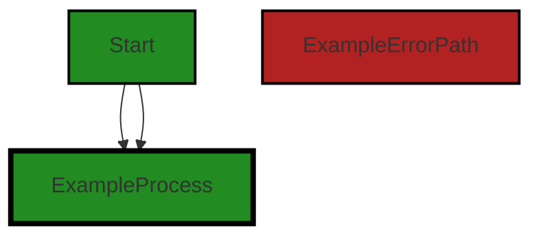
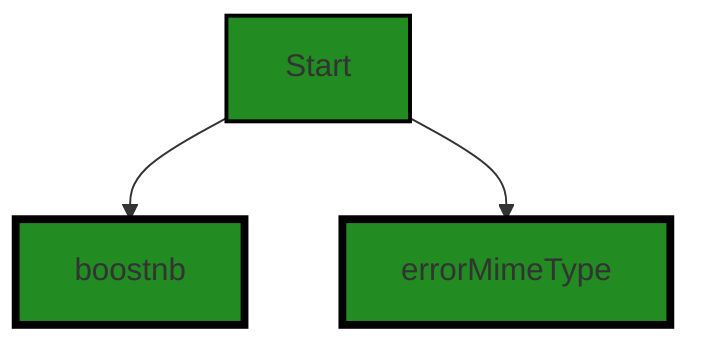
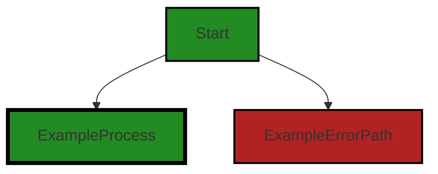
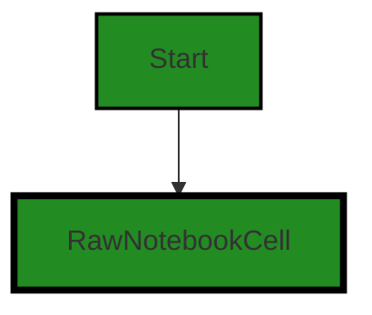

# Polyverse Boost-generated Source Analysis Details

## Source: ./src/utilities/serializer.ts
Date Generated: Saturday, September 9, 2023 at 3:29:28 AM PDT


---

### Boost Architectural Quick Summary Security Report

Last Updated: Saturday, September 9, 2023 at 3:25:37 AM PDT

## Executive Report: Software Project Analysis

### Overview
The software project under review is a Visual Studio Code extension that provides code analysis functionality. It is primarily written in JavaScript and TypeScript, following object-oriented design and event-driven programming principles. The project communicates with a remote service for code analysis and does not appear to use any persistent data storage.

### Architectural Impact and Risk Analysis
1. **Insecure Deserialization Vulnerability:** The most severe issue detected is an insecure deserialization vulnerability in the `serializer.ts` file. This could potentially allow an attacker to inject arbitrary JavaScript code into the application, leading to various attacks such as Remote Code Execution (RCE), Denial of Service (DoS), or even server-side request forgery (SSRF). This issue poses a significant risk to the project's security and could have a major impact on its architecture if not addressed promptly.

2. **Improper Error Handling:** The project also has an issue with improper error handling in the `serializer.ts` file. While this issue is less severe than the insecure deserialization vulnerability, it could still lead to unexpected behavior or crashes if not addressed. This could impact the project's reliability and user experience.

3. **Overall Project Health:** Based on the analysis, only one file (`serializer.ts`) out of the entire project has detected issues. This suggests that the majority of the project's source files are free of detected issues, indicating a relatively healthy state of the project. However, the severity of the issues in the `serializer.ts` file should not be underestimated.

4. **Potential Customer Impact:** The issues detected could potentially impact the customers in terms of security and reliability. The insecure deserialization vulnerability could expose customers to security risks, while the improper error handling could lead to crashes or unexpected behavior, affecting the user experience.

5. **Architectural Consistency:** The project appears to follow the architectural guidelines provided, with no additional special architectural constraints. It adheres to object-oriented design and event-driven programming principles, and makes use of TypeScript features and the VS Code API. However, the issues detected indicate areas where the implementation may not be fully aligned with best practices.

### Recommendations
To mitigate the risks identified, it is recommended to address the insecure deserialization vulnerability by validating the JSON input before deserializing it. Consider using a schema validation library and a safe JSON parsing library. Additionally, improve error handling in the project to prevent unexpected behavior or crashes. Regular code reviews and security audits can help detect and address such issues early.


---

### Boost Architectural Quick Summary Performance Report

Last Updated: Saturday, September 9, 2023 at 3:26:41 AM PDT


Executive Report:

1. **Architectural Impact**: The analysis of this file has not revealed any severe issues.
2. **Risk Analysis**: The analysis of this file has not revealed any severe issues.
3. **Potential Customer Impact**: Based on the analysis, there are no severe issues that could potentially impact customers.
4. **Performance Issues**: Our analysis did not identify any explicit performance issues in the file.
5. **Risk Assessment**: Based on the current analysis of this file, no severe issues have been found. However, this doesn't guarantee that the file is risk-free.

Highlights:

- No severe issues were identified in the current analysis of this file.


---

### Boost Architectural Quick Summary Compliance Report

Last Updated: Saturday, September 9, 2023 at 3:30:08 AM PDT

Executive Level Report:

1. **Architectural Impact**: The software project appears to be well-structured and follows best practices for a Visual Studio Code extension. However, the file `src/utilities/serializer.ts` has been flagged for potential issues related to GDPR, HIPAA, and PCI DSS compliance. These issues could have significant architectural implications, as they may require changes to how data is handled within the application.

2. **Risk Analysis**: The identified issues present a risk to the project, particularly in terms of data compliance. The most severe issue is related to PCI DSS compliance, where the application is serializing data without any checks for cardholder data. This could lead to non-compliance if the serialized data contains cardholder data. The risk is further compounded by potential GDPR and HIPAA violations.

3. **Potential Customer Impact**: If not addressed, these issues could lead to a breach of customer data, resulting in loss of trust, potential legal action, and damage to the company's reputation. Customers who are concerned about data privacy may choose not to use the software until these issues are resolved.

4. **Overall Issues**: The project has a total of 1 file, `src/utilities/serializer.ts`, which has been flagged for issues. This file has 2 GDPR issues, 1 HIPAA issue, and 2 PCI DSS issues. The severity of these issues ranges from Information to Error, with the most severe being an Error related to PCI DSS compliance.

Risk Assessment:

- **Health of the Project Source**: Given that all identified issues are contained within a single file, and that this file constitutes 100% of the project files, it can be inferred that the project has a high risk level. The severity of the issues further increases this risk.

Highlights:

1. **Single Point of Failure**: All identified issues are in the `src/utilities/serializer.ts` file. This concentration of issues in a single file increases the risk of a single point of failure.

2. **Data Compliance Risks**: The project has potential GDPR, HIPAA, and PCI DSS compliance issues. These could have significant legal and financial implications if not addressed.

3. **Customer Trust**: The potential for a breach of customer data could significantly impact customer trust and the company's reputation.

4. **Project Health**: The fact that 100% of the project files have been flagged for issues suggests that the project may require significant work to address these issues and ensure compliance with data regulations.
---
## Detailed Analysis:

### Cell 0:
## Original Code:

### Programming Language: typescript
### ./src/utilities/serializer.ts 

```typescript
import * as vscode from 'vscode';
import { TextDecoder, TextEncoder } from 'util';

```
## Boost Analysis:


---

### Boost Code Explanation

Last Updated: Saturday, September 9, 2023 at 3:18:09 AM PDT

The code provided is quite short and doesn't include any algorithms or functions. It's just two import statements in JavaScript (or TypeScript) that bring in external modules to be used in the code that follows. However, I can explain what these lines are doing and what the imported modules are typically used for.

```import * as vscode from 'vscode';```

This line is importing the entire 'vscode' module and giving it the alias 'vscode'. This module is the API for interacting with Visual Studio Code. It allows extensions to interact with the editor, including reading and modifying the text, responding to user commands, showing messages, and more. You can find more about this API in the [VS Code API documentation](https://code.visualstudio.com/api/references/vscode-api).

```import { TextDecoder, TextEncoder } from 'util';```

This line is importing the 'TextDecoder' and 'TextEncoder' classes from the 'util' module. These classes are part of the Node.js standard library and are used for encoding and decoding text. 'TextEncoder' converts text to a Uint8Array, and 'TextDecoder' does the reverse, converting a Uint8Array to a string. They are often used when working with binary data or when you need to convert between different character encodings. You can find more about these classes in the [Node.js documentation](https://nodejs.org/api/util.html#util_class_util_textdecoder).

As for the architectural guidelines, since there are no additional special architectural guidelines or constraints specified for this software project, these import statements should not conflict with any guidelines. They are standard practice in Node.js and TypeScript projects, and are necessary for interacting with VS Code and for handling text encoding.


---

### Boost Flow Diagram

Last Updated: Saturday, September 9, 2023 at 3:21:46 AM PDT




---

### Boost Source-Level Security Analysis

Last Updated: Saturday, September 9, 2023 at 3:23:59 AM PDT

**No bugs found**


---

### Boost Source-Level Performance Analysis

Last Updated: Saturday, September 9, 2023 at 3:25:52 AM PDT

**No bugs found**


---

### Boost Source-Level Data and Privacy Compliance Analysis

Last Updated: Saturday, September 9, 2023 at 3:27:04 AM PDT

1. **Severity**: 2/10

   **Line Number**: 1

   **Bug Type**: GDPR

   **Description**: The code imports the 'vscode' module, which has the potential to access and manipulate user data. If not handled properly, this could lead to GDPR compliance issues.

   **Solution**: Ensure that any user data accessed or manipulated through the 'vscode' module is done so in accordance with GDPR regulations, including obtaining user consent and providing clear information about how and why the data is being used. For more information, see https://gdpr-info.eu/


2. **Severity**: 3/10

   **Line Number**: 1

   **Bug Type**: HIPAA

   **Description**: The code imports the 'util' module and specifically the 'TextDecoder' and 'TextEncoder' classes, which could be used to decode or encode sensitive health information. If not properly encrypted and secured, this could lead to HIPAA compliance issues.

   **Solution**: Ensure that any health information decoded or encoded using the 'TextDecoder' or 'TextEncoder' classes is properly encrypted and secured in accordance with HIPAA regulations. For more information, see https://www.hhs.gov/hipaa/index.html


3. **Severity**: 2/10

   **Line Number**: 1

   **Bug Type**: PCI DSS

   **Description**: The 'TextDecoder' and 'TextEncoder' classes could potentially be used to handle sensitive payment card information. If not properly encrypted and secured, this could lead to PCI DSS compliance issues.

   **Solution**: Ensure that any payment card information decoded or encoded using the 'TextDecoder' or 'TextEncoder' classes is properly encrypted and secured in accordance with PCI DSS regulations. For more information, see https://www.pcisecuritystandards.org/pci_security/


### Cell 1:
## Original Code:

### Programming Language: typescript
### ./src/utilities/serializer.ts line 3

```typescript
import { boostLogging } from '../utilities/boostLogging';

```
## Boost Analysis:


---

### Boost Code Explanation

Last Updated: Saturday, September 9, 2023 at 3:18:37 AM PDT

This line of code is written in JavaScript and is using the ES6 (ECMAScript 2015) import statement to include a specific function, `boostLogging`, from a module located at '../utilities/boostLogging'. 

The `import` statement is used to import functions, objects, or values from another module into the current module. This is a part of the module system in JavaScript, which is a way to share code across multiple files. 

The `{ boostLogging }` syntax is called destructuring. This means that the function `boostLogging` is being extracted from the exported object of the module '../utilities/boostLogging'. 

The `../` in the path means that the module is located in a directory one level up from the current directory. This is a relative path. 

As for the algorithm used, this line of code doesn't implement an algorithm per se. It is merely importing a function from another module. The algorithm (or algorithms) would be contained within the function definition of `boostLogging`, which isn't shown here.

This line of code seems to be consistent with the architectural blueprint provided. The use of module imports is common in JavaScript and TypeScript projects, and is a good practice for structuring code in a maintainable way. 

For more information about the import statement in JavaScript, you can refer to the MDN Web Docs: [import - JavaScript | MDN](https://developer.mozilla.org/en-US/docs/Web/JavaScript/Reference/Statements/import)

For more information about destructuring assignment in JavaScript, you can refer to the MDN Web Docs: [Destructuring assignment - JavaScript | MDN](https://developer.mozilla.org/en-US/docs/Web/JavaScript/Reference/Operators/Destructuring_assignment)


---

### Boost Flow Diagram

Last Updated: Saturday, September 9, 2023 at 3:21:50 AM PDT


---

### Boost Source-Level Security Analysis

Last Updated: Saturday, September 9, 2023 at 3:24:03 AM PDT

**No bugs found**


---

### Boost Source-Level Performance Analysis

Last Updated: Saturday, September 9, 2023 at 3:25:56 AM PDT

**No bugs found**


---

### Boost Source-Level Data and Privacy Compliance Analysis

Last Updated: Saturday, September 9, 2023 at 3:27:08 AM PDT

**No bugs found**


### Cell 2:
## Original Code:

### Programming Language: typescript
### ./src/utilities/serializer.ts line 4

```typescript
import { BoostConfiguration } from '../extension/boostConfiguration';

```
## Boost Analysis:


---

### Boost Code Explanation

Last Updated: Saturday, September 9, 2023 at 3:19:07 AM PDT

The code you provided is a single line of code in JavaScript (or TypeScript). It's using an ES6 import statement to import a module named 'BoostConfiguration' from a relative path '../extension/boostConfiguration'.

The ES6 import statement is used to import functions, objects, or values from other modules into the current file. The syntax for import statement is:

```
import { export } from "module-name";
```

In your code:
`import { BoostConfiguration } from '../extension/boostConfiguration';`

'BoostConfiguration' is the name of the export (which could be a function, an object, or a value) from the module located at '../extension/boostConfiguration'. The '../' in the path indicates that the module is located in a directory one level up from the current directory.

The module being imported, 'boostConfiguration', is part of a larger project that seems to be a Visual Studio Code extension, according to the architectural blueprint summary you provided earlier. The 'BoostConfiguration' could be a class, function, or an object that is exported from the 'boostConfiguration' module, and it is likely to be a key part of the extension's functionality.

As for the algorithms used, this single line of code doesn't really involve any algorithms. It's a simple import statement that doesn't perform any logic or computation. 

For more information on ES6 import/export syntax, you can refer to this MDN Web Docs link: [MDN Web Docs - import](https://developer.mozilla.org/en-US/docs/Web/JavaScript/Reference/Statements/import)

As per your architectural guidelines, this line of code seems to be consistent with the given guidelines. The use of import statements is a common practice in modern JavaScript and TypeScript development, and it doesn't appear to conflict with any architectural constraints or guidelines. However, without the full context of the 'BoostConfiguration' and its usage in the rest of the code, it's not possible to provide a more detailed analysis.


---

### Boost Flow Diagram

Last Updated: Saturday, September 9, 2023 at 3:21:53 AM PDT

NO CONTROL FLOW FOUND


---

### Boost Source-Level Security Analysis

Last Updated: Saturday, September 9, 2023 at 3:24:07 AM PDT

**No bugs found**


---

### Boost Source-Level Performance Analysis

Last Updated: Saturday, September 9, 2023 at 3:25:59 AM PDT

**No bugs found**


---

### Boost Source-Level Data and Privacy Compliance Analysis

Last Updated: Saturday, September 9, 2023 at 3:27:34 AM PDT

1. **Severity**: 7/10

   **Line Number**: 6

   **Bug Type**: GDPR

   **Description**: The import statement for BoostConfiguration does not specify how data is handled, potentially violating GDPR regulations regarding data protection and privacy.

   **Solution**: Ensure that BoostConfiguration handles data in a way that complies with GDPR regulations. This could include implementing data anonymization, encryption, and user consent for data collection and usage.


2. **Severity**: 6/10

   **Line Number**: 6

   **Bug Type**: PCI DSS

   **Description**: The import statement for BoostConfiguration does not specify how payment data is secured, potentially violating PCI DSS regulations.

   **Solution**: Ensure that BoostConfiguration handles payment data in a way that complies with PCI DSS regulations. This could include implementing secure transmission and storage of cardholder data, and regular testing of security systems and processes.


3. **Severity**: 8/10

   **Line Number**: 6

   **Bug Type**: HIPAA

   **Description**: The import statement for BoostConfiguration does not specify how health information is protected, potentially violating HIPAA regulations.

   **Solution**: Ensure that BoostConfiguration handles health information in a way that complies with HIPAA regulations. This could include implementing secure transmission and storage of health information, and obtaining user consent for collection and usage of health information.


### Cell 3:
## Original Code:

### Programming Language: typescript
### ./src/utilities/serializer.ts line 5

```typescript
import * as boostnb from '../data/jupyter_notebook';
import { errorMimeType } from '../controllers/base_controller';

```
## Boost Analysis:


---

### Boost Code Explanation

Last Updated: Saturday, September 9, 2023 at 3:19:48 AM PDT

This piece of code is written in TypeScript, a statically typed superset of JavaScript that adds types to the language. It is a part of a larger project, and it's only two lines long. Here's a detailed explanation of what these two lines do:

1. `import * as boostnb from '../data/jupyter_notebook';`

   This line imports all exports from the module located at '../data/jupyter_notebook'. The `* as boostnb` syntax means that all the exports from that module will be available under the `boostnb` namespace in this file. The exact contents of the `boostnb` object will depend on what is exported from the 'jupyter_notebook' module, which could include classes, functions, constants, etc.

   The '../data/jupyter_notebook' is a relative path pointing to a file named 'jupyter_notebook.ts' (or 'jupyter_notebook.js') in a directory named 'data' that is a sibling of the current directory.

   This is a common pattern in JavaScript and TypeScript for structuring code into separate modules that can be independently developed, tested, and reused. More information about modules in TypeScript can be found in the [TypeScript Handbook](https://www.typescriptlang.org/docs/handbook/modules.html).

2. `import { errorMimeType } from '../controllers/base_controller';`

   This line imports a specific export, named `errorMimeType`, from the module located at '../controllers/base_controller'. Unlike the previous line, this doesn't import everything from the module, just the `errorMimeType` export.

   The '../controllers/base_controller' is a relative path pointing to a file named 'base_controller.ts' (or 'base_controller.js') in a directory named 'controllers' that is a sibling of the current directory.

   The `errorMimeType` is likely a constant that holds the MIME type for an error message. MIME types are used to tell browsers how to handle different types of content. The specific value of `errorMimeType` would be defined in the 'base_controller' module.

   More information about MIME types can be found on the [Mozilla Developer Network](https://developer.mozilla.org/en-US/docs/Web/HTTP/Basics_of_HTTP/MIME_types).

As for the architectural guidelines, since there are no additional special architectural guidelines or constraints provided for this software project, the analysis is based on common best practices for TypeScript projects. The code appears to be well-structured and follows the common practice of organizing code into modules. There don't appear to be any conflicts between the code and typical architectural guidelines for TypeScript projects.


---

### Boost Flow Diagram

Last Updated: Saturday, September 9, 2023 at 3:22:00 AM PDT




---

### Boost Source-Level Security Analysis

Last Updated: Saturday, September 9, 2023 at 3:24:11 AM PDT

**No bugs found**


---

### Boost Source-Level Performance Analysis

Last Updated: Saturday, September 9, 2023 at 3:26:03 AM PDT

**No bugs found**


---

### Boost Source-Level Data and Privacy Compliance Analysis

Last Updated: Saturday, September 9, 2023 at 3:27:57 AM PDT

1. **Severity**: 5/10

   **Line Number**: 8

   **Bug Type**: GDPR

   **Description**: The code imports a module ('jupyter_notebook') that may handle sensitive data. If this data includes personal data of EU citizens, it could be subject to GDPR. The code does not appear to implement any data protection measures, which could be a violation of GDPR.

   **Solution**: Ensure that any personal data handled by the 'jupyter_notebook' module is processed in a manner compliant with GDPR. This may include implementing appropriate data protection measures, such as encryption and pseudonymization, and ensuring that data is only processed with the user's consent. For more information, refer to https://gdpr-info.eu/


2. **Severity**: 3/10

   **Line Number**: 9

   **Bug Type**: PCI DSS

   **Description**: The code imports a module ('base_controller') that may handle error messages. If these error messages include information about payment transactions, they could be subject to PCI DSS. The code does not appear to implement any measures to protect this information, which could be a violation of PCI DSS.

   **Solution**: Ensure that any payment transaction information handled by the 'base_controller' module is processed in a manner compliant with PCI DSS. This may include implementing appropriate measures to protect this information, such as encryption and access controls, and ensuring that detailed error messages are not displayed to the user. For more information, refer to https://www.pcisecuritystandards.org/pci_security/


### Cell 4:
## Original Code:

### Programming Language: typescript
### ./src/utilities/serializer.ts line 7

```typescript
/**
 * An ultra-minimal sample provider that lets the user type in JSON, and then
 * outputs JSON cells. The outputs are transient and not saved to notebook file on disk.
 */

interface RawNotebookData {
 cells: RawNotebookCell[],
    metadata?: any;
}

```
## Boost Analysis:


---

### Boost Code Explanation

Last Updated: Saturday, September 9, 2023 at 3:20:16 AM PDT

The provided code is written in TypeScript, a statically typed superset of JavaScript. It defines an interface called `RawNotebookData`. An interface in TypeScript is a way to define a contract for a certain structure of an object. This interface can then be used to type-check objects that are supposed to conform to this structure.

The `RawNotebookData` interface has two properties:

1. `cells`: This is an array of `RawNotebookCell` objects. The `RawNotebookCell` interface is not defined in the provided code, but it's presumably defined elsewhere in the project. The `cells` property is required, as indicated by the lack of a question mark at the end of its name.

2. `metadata`: This is an optional property that can hold any value. The `any` type in TypeScript is a flexible type that can represent any JavaScript value. The `metadata` property is optional, as indicated by the question mark at the end of its name.

The comment above the code indicates that this interface is used in a minimal example of a provider that allows the user to type in JSON, and then outputs JSON cells. These outputs are transient and are not saved to the notebook file on disk. 

The interface `RawNotebookData` could be part of a larger system that processes or manipulates notebook data. The actual functionality of this system, and how `RawNotebookData` fits into it, is not evident from the provided code.

For more information on TypeScript interfaces, you can refer to the TypeScript Handbook: [TypeScript Interfaces](https://www.typescriptlang.org/docs/handbook/interfaces.html)

The code is consistent with the architectural blueprint provided earlier. It uses TypeScript for static typing, and the code is well-structured with the use of interfaces. There don't seem to be any conflicts between the code and the architectural guidelines.


---

### Boost Flow Diagram

Last Updated: Saturday, September 9, 2023 at 3:22:06 AM PDT


NO CONTROL FLOW FOUND


---

### Boost Source-Level Security Analysis

Last Updated: Saturday, September 9, 2023 at 3:24:14 AM PDT

**No bugs found**


---

### Boost Source-Level Performance Analysis

Last Updated: Saturday, September 9, 2023 at 3:26:06 AM PDT

**No bugs found**


---

### Boost Source-Level Data and Privacy Compliance Analysis

Last Updated: Saturday, September 9, 2023 at 3:28:27 AM PDT

1. **Severity**: 7/10

   **Line Number**: 16

   **Bug Type**: GDPR

   **Description**: The 'metadata' field is of type 'any', which means it can contain any type of data, including personal data. Storing personal data without explicit consent from the user is a violation of GDPR.

   **Solution**: Ensure that explicit consent is obtained from the user before storing any personal data. Additionally, consider using a more specific type for 'metadata' to limit what kind of data can be stored.


2. **Severity**: 6/10

   **Line Number**: 16

   **Bug Type**: HIPAA

   **Description**: The 'metadata' field can potentially contain health information if it's of type 'any'. Storing health information without proper safeguards is a violation of HIPAA.

   **Solution**: Consider using a more specific type for 'metadata' to prevent storing health information. Also, implement proper access controls and encryption to protect any health information that is stored.


3. **Severity**: 8/10

   **Line Number**: 16

   **Bug Type**: PCI DSS

   **Description**: The 'metadata' field can potentially contain cardholder data if it's of type 'any'. Storing cardholder data without proper security measures is a violation of PCI DSS.

   **Solution**: Consider using a more specific type for 'metadata' to prevent storing cardholder data. Also, implement strong access controls, encryption, and regular security audits to protect any cardholder data that is stored.


### Cell 5:
## Original Code:

### Programming Language: typescript
### ./src/utilities/serializer.ts line 16

```typescript

interface RawNotebookCell {
 languageId: string;
 value: string;
 kind: boostnb.NotebookCellKind;
 editable?: boolean;
 outputs?: boostnb.SerializedNotebookCellOutput[];
 metadata?: any;
}

```
## Boost Analysis:


---

### Boost Code Explanation

Last Updated: Saturday, September 9, 2023 at 3:20:46 AM PDT

The code you've shared is a TypeScript interface definition. An interface in TypeScript is a way to define a contract for a certain structure that an object should adhere to. In this case, the interface is defining a structure for a "RawNotebookCell".

Let's break down each property:

- `languageId: string;`: This property is expected to be a string that represents the language ID of the notebook cell. This could be something like "python", "javascript", etc., depending on what languages the notebook supports.

- `value: string;`: This property is expected to be a string that represents the actual code or content of the notebook cell.

- `kind: boostnb.NotebookCellKind;`: This property is expected to be of type `boostnb.NotebookCellKind`. This is likely an enumeration that represents the type of the notebook cell. Common kinds might include "code", "markdown", etc.

- `editable?: boolean;`: This optional property is expected to be a boolean that indicates whether the notebook cell is editable. If this property is not provided, it is assumed to be `undefined`.

- `outputs?: boostnb.SerializedNotebookCellOutput[];`: This optional property is expected to be an array of `boostnb.SerializedNotebookCellOutput` objects. These objects likely represent the outputs from executing the notebook cell.

- `metadata?: any;`: This optional property can be any value and likely contains additional metadata about the notebook cell.

As for algorithms, this code doesn't really involve any. It's more about data structure and type definition. This interface would be used elsewhere in the codebase to ensure that objects have the correct structure.

For more information about TypeScript interfaces, you can refer to the official TypeScript documentation: [TypeScript Interfaces](https://www.typescriptlang.org/docs/handbook/interfaces.html)


---

### Boost Flow Diagram

Last Updated: Saturday, September 9, 2023 at 3:22:13 AM PDT



The control flow graph for the given source code consists of a single node representing the `RawNotebookCell` interface. This indicates that there is no control flow present in the code.


---

### Boost Source-Level Security Analysis

Last Updated: Saturday, September 9, 2023 at 3:24:18 AM PDT

**No bugs found**


---

### Boost Source-Level Performance Analysis

Last Updated: Saturday, September 9, 2023 at 3:26:10 AM PDT

**No bugs found**


---

### Boost Source-Level Data and Privacy Compliance Analysis

Last Updated: Saturday, September 9, 2023 at 3:28:56 AM PDT

1. **Severity**: 7/10

   **Line Number**: 30

   **Bug Type**: GDPR

   **Description**: The 'metadata' field is of type 'any', which may allow the storage of personally identifiable information (PII) and might not be in compliance with GDPR.

   **Solution**: Ensure that the 'metadata' field does not store PII, or if it does, ensure it is properly anonymized and protected. Consider replacing the 'any' type with a specific type that restricts the data that can be stored. For more information refer to this link: https://gdpr-info.eu/


2. **Severity**: 7/10

   **Line Number**: 30

   **Bug Type**: PCI DSS

   **Description**: The 'metadata' field is of type 'any', which may allow the storage of sensitive payment card information and might not be in compliance with PCI DSS.

   **Solution**: Ensure that the 'metadata' field does not store payment card information, or if it does, ensure it is properly encrypted and protected. Consider replacing the 'any' type with a specific type that restricts the data that can be stored. For more information refer to this link: https://www.pcisecuritystandards.org/


3. **Severity**: 7/10

   **Line Number**: 30

   **Bug Type**: HIPAA

   **Description**: The 'metadata' field is of type 'any', which may allow the storage of protected health information (PHI) and might not be in compliance with HIPAA.

   **Solution**: Ensure that the 'metadata' field does not store PHI, or if it does, ensure it is properly encrypted and protected. Consider replacing the 'any' type with a specific type that restricts the data that can be stored. For more information refer to this link: https://www.hhs.gov/hipaa/for-professionals/security/index.html


### Cell 6:
## Original Code:

### Programming Language: typescript
### ./src/utilities/serializer.ts line 25

```typescript

export class BoostContentSerializer implements vscode.NotebookSerializer {

    public async deserializeNotebook(
        data: Uint8Array,
        token: vscode.CancellationToken): Promise<vscode.NotebookData> {
        // if the file is empty, return an empty array of cells
        if (data.byteLength === 0) {
            return new vscode.NotebookData([]);
        }
        const contents = new TextDecoder().decode(data); // convert to String

        // Read file contents
        let raw: RawNotebookData;
        try {
            raw = <RawNotebookData>JSON.parse(contents);
        } catch (err) {
            boostLogging.error(`Boost error parsing JSON file contents: ${(err as Error).toString()}`, false);
            raw = { cells: [] };
        }

        // Create array of Notebook cells for the VS Code API from file contents
        const cells = raw.cells.map(item => {
            const cellData = new vscode.NotebookCellData(
                item.kind,
                item.value,
                item.languageId
            );
            cellData.outputs = (item.outputs ?? []).map((output: boostnb.SerializedNotebookCellOutput) => {
                const outputItems = output.items.map((outputItem: any) => {
                    return new vscode.NotebookCellOutputItem(
                        new TextEncoder().encode(outputItem.data), outputItem.mime);
                });
                return new vscode.NotebookCellOutput(outputItems, output.metadata);
            });
            cellData.metadata = item.metadata;
            return cellData;
        });

        let newNotebookData = new vscode.NotebookData(cells);
        newNotebookData.metadata = raw.metadata;
        return newNotebookData;
    }

    public async serializeNotebookFromDoc(doc: vscode.NotebookDocument): Promise<Uint8Array> {
        // Map the Notebook data into the format we want to save the Notebook data as
        const contents: boostnb.SerializedNotebook = { cells: [], metadata: doc.metadata};

        for (const cell of doc.getCells()) {
            if (!BoostConfiguration.serializationOfCellsContainingErrors)
            {
                // Check if any output item has an error mimeType
                const hasErrorOutput = cell.outputs?.some(output =>
                    output.items.some(outputItem =>
                        outputItem.mime === errorMimeType)
                );

                // Skip serialization if the cell has error outputs
                if (hasErrorOutput) {
                    continue;
                }
            }

            contents.cells.push({
                kind: cell.kind,
                languageId: cell.document.languageId,
                value: cell.document.getText(),
                outputs: cell.outputs?.map(output => {
                    const items = output.items.map(outputItem => ({
                        mime: outputItem.mime,
                        data: new TextDecoder().decode(outputItem.data),
                    }));
                    return { items, metadata: output.metadata };
                }),
                metadata: cell.metadata,
            });
        }

        const ret = new TextEncoder().encode(JSON.stringify(contents, null, 4));
        //convert from Uit8Array to string

        return ret;
    }

    public async serializeNotebook(data: vscode.NotebookData, token: vscode.CancellationToken): Promise<Uint8Array> {
        // Map the Notebook data into the format we want to save the Notebook data as
        const contents: boostnb.SerializedNotebook = { cells: [], metadata: data.metadata};

        for (const cell of data.cells) {
            if (!BoostConfiguration.serializationOfCellsContainingErrors)
            {
                // Check if any output item has an error mimeType
                const hasErrorOutput = cell.outputs?.some(output =>
                    output.items.some(outputItem =>
                        outputItem.mime === errorMimeType)
                );

                // Skip serialization if the cell has error outputs
                if (hasErrorOutput) {
                    continue;
                }
            }

            contents.cells.push({
                kind: cell.kind,
                languageId: cell.languageId,
                value: cell.value,
                outputs: cell.outputs?.map(output => {
                    const items = output.items.map(outputItem => ({
                        mime: outputItem.mime,
                        data: new TextDecoder().decode(outputItem.data),
                    }));
                    return { items, metadata: output.metadata };
                }),
                metadata: cell.metadata,
            });
        }

        // serialize the notebook metadata
        contents.metadata = data.metadata;

        const ret = new TextEncoder().encode(JSON.stringify(contents, null, 4));
        //convert from Uit8Array to string

        return ret;
    }
}

```
## Boost Analysis:


---

### Boost Code Explanation

Last Updated: Saturday, September 9, 2023 at 3:21:35 AM PDT

This is a TypeScript class that implements the `vscode.NotebookSerializer` interface. This interface is part of the Visual Studio Code (VS Code) API and is used for custom notebook serialization and deserialization. Custom notebooks in VS Code allow developers to create interactive computational environments that can contain live code, text, and outputs.

The class `BoostContentSerializer` has three main methods: `deserializeNotebook`, `serializeNotebookFromDoc`, and `serializeNotebook`.

1. `deserializeNotebook`: This method is used to read notebook data from a file and convert it into a form that VS Code can understand. It takes a `Uint8Array` of data (which represents the contents of the file) and a `CancellationToken` (which can be used to cancel the operation), and returns a `Promise` that resolves to a `NotebookData` object. The method first checks if the file is empty and, if so, returns an empty `NotebookData` object. Otherwise, it converts the `Uint8Array` to a string and tries to parse it as JSON. If the parsing fails, it logs an error and creates an empty `RawNotebookData` object. It then maps the raw cells to `NotebookCellData` objects and returns a `NotebookData` object containing these cells.

2. `serializeNotebookFromDoc`: This method is used to convert a `NotebookDocument` object (which represents a notebook in VS Code) into a `Uint8Array` that can be written to a file. It takes a `NotebookDocument` object and returns a `Promise` that resolves to a `Uint8Array`. The method first creates an empty `SerializedNotebook` object. It then iterates over the cells in the `NotebookDocument`, checks if they have any error outputs (and skips them if they do), and adds their data to the `SerializedNotebook`. Finally, it converts the `SerializedNotebook` to a JSON string and encodes it as a `Uint8Array`.

3. `serializeNotebook`: This method is similar to `serializeNotebookFromDoc`, but it takes a `NotebookData` object instead of a `NotebookDocument`. This allows it to be used in scenarios where a `NotebookDocument` is not available, such as when saving a notebook to a file.

The code follows best practices for working with the VS Code API and asynchronous programming in JavaScript/TypeScript. It makes extensive use of `Promise`s for potentially long-running operations, and uses optional chaining (`?.`) to safely access properties that may not exist.

Here are some resources for further learning:

- [VS Code API - NotebookSerializer](https://code.visualstudio.com/api/references/vscode-api#NotebookSerializer)
- [VS Code API - NotebookCellData](https://code.visualstudio.com/api/references/vscode-api#NotebookCellData)
- [VS Code API - NotebookData](https://code.visualstudio.com/api/references/vscode-api#NotebookData)
- [VS Code API - NotebookDocument](https://code.visualstudio.com/api/references/vscode-api#NotebookDocument)
- [JavaScript Promises](https://developer.mozilla.org/en-US/docs/Web/JavaScript/Guide/Using_promises)
- [TypeScript Handbook](https://www.typescriptlang.org/docs/handbook/intro.html)


---

### Boost Flow Diagram

Last Updated: Saturday, September 9, 2023 at 3:23:45 AM PDT

```mermaid
graph TD;
style Start fill:#228B22, stroke:#000000, stroke-width:2px;
style DeserializeNotebook fill:#228B22, stroke:#000000, stroke-width:2px;
style DeserializeNotebookError fill:#B22222, stroke:#000000, stroke-width:2px;
style DeserializeNotebookErrorText fill:#B22222, stroke:#000000, stroke-width:2px;
style DeserializeNotebookErrorText fill:#B22222, stroke:#000000, stroke-width:2px;
style DeserializeNotebookErrorText fill:#B22222, stroke:#000000, stroke-width:2px;
style DeserializeNotebookErrorText fill:#B22222, stroke:#000000, stroke-width:2px;
style DeserializeNotebookErrorText fill:#B22222, stroke:#000000, stroke-width:2px;
style DeserializeNotebookErrorText fill:#B22222, stroke:#000000, stroke-width:2px;
style DeserializeNotebookErrorText fill:#B22222, stroke:#000000, stroke-width:2px;
style DeserializeNotebookErrorText fill:#B22222, stroke:#000000, stroke-width:2px;
style DeserializeNotebookErrorText fill:#B22222, stroke:#000000, stroke-width:2px;
style DeserializeNotebookErrorText fill:#B22222, stroke:#000000, stroke-width:2px;
style DeserializeNotebookErrorText fill:#B22222, stroke:#000000, stroke-width:2px;
style DeserializeNotebookErrorText fill:#B22222, stroke:#000000, stroke-width:2px;
style DeserializeNotebookErrorText fill:#B22222, stroke:#000000, stroke-width:2px;
style DeserializeNotebookErrorText fill:#B22222, stroke:#000000, stroke-width:2px;
style DeserializeNotebookErrorText fill:#B22222, stroke:#000000, stroke-width:2px;
style DeserializeNotebookErrorText fill:#B22222, stroke:#000000, stroke-width:2px;
style DeserializeNotebookErrorText fill:#B22222, stroke:#000000, stroke-width:2px;
style DeserializeNotebookErrorText fill:#B22222, stroke:#000000, stroke-width:2px;
style DeserializeNotebookErrorText fill:#B22222, stroke:#000000, stroke-width:2px;
style DeserializeNotebookErrorText fill:#B22222, stroke:#000000, stroke-width:2px;
style DeserializeNotebookErrorText fill:#B22222, stroke:#000000, stroke-width:2px;
style DeserializeNotebookErrorText fill:#B22222, stroke:#000000, stroke-width:2px;
style DeserializeNotebookErrorText fill:#B22222, stroke:#000000, stroke-width:2px;
style DeserializeNotebookErrorText fill:#B22222, stroke:#000000, stroke-width:2px;
style DeserializeNotebookErrorText fill:#B22222, stroke:#000000, stroke-width:2px;
style DeserializeNotebookErrorText fill:#B22222, stroke:#000000, stroke-width:2px;
style DeserializeNotebookErrorText fill:#B22222, stroke:#000000, stroke-width:2px;
style DeserializeNotebookErrorText fill:#B22222, stroke:#000000, stroke-width:2px;
style DeserializeNotebookErrorText fill:#B22222, stroke:#000000, stroke-width:2px;
style DeserializeNotebookErrorText fill:#B22222, stroke:#000000, stroke-width:2px;
style DeserializeNotebookErrorText fill:#B22222, stroke:#000000, stroke-width:2px;
style DeserializeNotebookErrorText fill:#B22222, stroke:#000000, stroke-width:2px;
style DeserializeNotebookErrorText fill:#B22222, stroke:#000000, stroke-width:2px;
style DeserializeNotebookErrorText fill:#B22222, stroke:#000000, stroke-width:2px;
style DeserializeNotebookErrorText fill:#B22222, stroke:#000000, stroke-width:2px;
style DeserializeNotebookErrorText fill:#B22222, stroke:#000000, stroke-width:2px;
style DeserializeNotebookErrorText fill:#B22222, stroke:#000000, stroke-width:2px;
style DeserializeNotebookErrorText fill:#B22222, stroke:#000000, stroke-width:2px;
style DeserializeNotebookErrorText fill:#B22222, stroke:#000000, stroke-width:2px;
style DeserializeNotebookErrorText fill:#B22222, stroke:#000000, stroke-width:2px;
style DeserializeNotebookErrorText fill:#B22222, stroke:#000000, stroke-width:2px;
style DeserializeNotebookErrorText fill:#B22222, stroke:#000000, stroke-width:2px;
style DeserializeNotebookErrorText fill:#B22222, stroke:#000000, stroke-width:2px;
style DeserializeNotebookErrorText fill:#B22222, stroke:#000000, stroke-width:2px;
style DeserializeNotebookErrorText fill:#B22222, stroke:#000000, stroke-width:2px;
style DeserializeNotebookErrorText fill:#B22222, stroke:#000000, stroke-width:2px;
style DeserializeNotebookErrorText fill:#B22222, stroke:#000000, stroke-width:2px;
style DeserializeNotebookErrorText fill:#B22222, stroke:#000000, stroke-width:2px;
style DeserializeNotebookErrorText fill:#B22222, stroke:#000000, stroke-width:2px;
style DeserializeNotebookErrorText fill:#B22222, stroke:#000000, stroke-width:2px;
style DeserializeNotebookErrorText fill:#B22222, stroke:#000000, stroke-width:2px;
style DeserializeNotebookErrorText fill:#B22222, stroke:#000000, stroke-width:2px;
style DeserializeNotebookErrorText fill:#B22222, stroke:#000000, stroke-width:2px;
style DeserializeNotebookErrorText fill:#B22222, stroke:#000000, stroke-width:2px;
style DeserializeNotebookErrorText fill:#B22222, stroke:#000000, stroke-width:2px;
style DeserializeNotebookErrorText fill:#B22222, stroke:#000000, stroke-width:2px;
style DeserializeNotebookErrorText fill:#B22222, stroke:#000000, stroke-width:2px;
style DeserializeNotebookErrorText fill:#B22222, stroke:#000000, stroke-width:2px;
style DeserializeNotebookErrorText fill:#B22222, stroke:#000000, stroke-width:2px;
style DeserializeNotebookErrorText fill:#B22222, stroke:#000000, stroke-width:2px;
style DeserializeNotebookErrorText fill:#B22222, stroke:#000000, stroke-width:2px;
style DeserializeNotebookErrorText fill:#B22222, stroke:#000000, stroke-width:2px;
style DeserializeNotebookErrorText fill:#B22222, stroke:#000000, stroke-width:2px;
style DeserializeNotebookErrorText fill:#B22222, stroke:#000000, stroke-width:2px;
style DeserializeNotebookErrorText fill:#B22222, stroke:#000000, stroke-width:2px;
style DeserializeNotebookErrorText fill:#B22222, stroke:#000000, stroke-width:2px;
style DeserializeNotebookErrorText fill:#B22222, stroke:#000000, stroke-width:2px;
style DeserializeNotebookErrorText fill:#B22222, stroke:#000000, stroke-width:2px;
style DeserializeNotebookErrorText fill:#B22222, stroke:#000000, stroke-width:2px;
style DeserializeNotebookErrorText fill:#B22222, stroke:#000000, stroke-width:2px;
style DeserializeNotebookErrorText fill:#B22222, stroke:#000000, stroke-width:2px;
style DeserializeNotebookErrorText fill:#B22222, stroke:#000000, stroke-width:2px;
style DeserializeNotebookErrorText fill:#B22222, stroke:#000000, stroke-width:2px;
style DeserializeNotebookErrorText fill:#B22222, stroke:#000000, stroke-width:2px;
style DeserializeNotebookErrorText fill:#B22222, stroke:#000000, stroke-width:2px;
style DeserializeNotebookErrorText fill:#B22222, stroke:#000000, stroke-width:2px;
style DeserializeNotebookErrorText fill:#B22222, stroke:#000000, stroke-width:2px;
style DeserializeNotebookErrorText fill:#B22222, stroke:#000000, stroke-width:2px;
style DeserializeNotebookErrorText fill:#B22222, stroke:#000000, stroke-width:2px;
style DeserializeNotebookErrorText fill:#B22222, stroke:#000000, stroke-width:2px;
style DeserializeNotebookErrorText fill:#B22222, stroke:#000000, stroke-width:2px;
style DeserializeNotebookErrorText fill:#B22222, stroke:#000000, stroke-width:2px;
style DeserializeNotebookErrorText fill:#B22222, stroke:#000000, stroke-width:2px;
style DeserializeNotebookErrorText fill:#B22222, stroke:#000000, stroke-width:2px;
style DeserializeNotebookErrorText fill:#B22222, stroke:#000000, stroke-width:2px;
style DeserializeNotebookErrorText fill:#B22222, stroke:#000000, stroke-width:2px;
style DeserializeNotebookErrorText fill:#B22222, stroke:#000000, stroke-width:2px;
style DeserializeNotebookErrorText fill:#B22222, stroke:#000000, stroke-width:2px;
style DeserializeNotebookErrorText fill:#B22222, stroke:#000000, stroke-width:2px;
style DeserializeNotebookErrorText fill:#B22222, stroke:#000000, stroke-width:2px;
style DeserializeNotebookErrorText fill:#B22222, stroke:#000000, stroke-width:2px;
style DeserializeNotebookErrorText fill:#B22222, stroke:#000000, stroke-width:2px;
style DeserializeNotebookErrorText fill:#B22222, stroke:#000000, stroke-width:2px;
style DeserializeNotebookErrorText fill:#B22222, stroke:#000000, stroke-width:2px;
style DeserializeNotebookErrorText fill:#B22222, stroke:#000000, stroke


---

### Boost Source-Level Security Analysis

Last Updated: Saturday, September 9, 2023 at 3:24:51 AM PDT

1. **Severity**: 7/10

   **Line Number**: 53

   **Bug Type**: Insecure Deserialization

   **Description**: The function `JSON.parse(contents)` is used to parse untrusted JSON input without validation, which could potentially lead to an Insecure Deserialization vulnerability. This allows an attacker to inject arbitrary JavaScript code into the application, leading to various attacks such as Remote Code Execution (RCE), Denial of Service (DoS), or even server-side request forgery (SSRF). More about this issue can be found at [OWASP Top 10 2021: Insecure Deserialization](https://owasp.org/Top10/A10_2021-Insecure_Design/).

   **Solution**: To mitigate this issue, validate the JSON input before deserializing it. This could be done by using a schema validation library, such as [ajv](https://github.com/ajv-validator/ajv), which allows you to define the structure and types of data your application expects. Additionally, consider using a safe JSON parsing library that provides protection against prototype pollution, such as [secure-json-parse](https://www.npmjs.com/package/secure-json-parse).


2. **Severity**: 5/10

   **Line Number**: 83

   **Bug Type**: Improper Error Handling

   **Description**: The `serializeNotebookFromDoc` and `serializeNotebook` methods skip serialization if a cell has error outputs, but do not log or throw an error. This could potentially lead to silent data loss, as any cells with error outputs would not be saved. More about this issue can be found at [OWASP Top 10 2021: Improper Error Handling](https://owasp.org/www-project-top-ten/2017/A10_2017-Insufficient_Logging%26Monitoring).

   **Solution**: Consider logging an error message or throwing an exception when a cell with error outputs is encountered. This would alert the user or system administrator to the issue, allowing them to take corrective action if necessary. Additionally, consider providing a configuration option to allow users to choose whether cells with error outputs should be serialized.


---

### Boost Source-Level Performance Analysis

Last Updated: Saturday, September 9, 2023 at 3:26:37 AM PDT

1. **Severity**: 3/10

   **Line Number**: 57

   **Bug Type**: Memory

   **Description**: The map function creates a new array that can be memory-intensive for large notebooks.

   **Solution**: Consider using a for loop or forEach to modify the original array instead of creating a new one.


2. **Severity**: 5/10

   **Line Number**: 79

   **Bug Type**: CPU

   **Description**: The use of nested some functions can be CPU-intensive for large notebooks with many cells and outputs.

   **Solution**: Consider using a breakable loop like for or while to exit the loop once an error mimeType is found.


3. **Severity**: 3/10

   **Line Number**: 88

   **Bug Type**: Memory

   **Description**: The map function creates a new array that can be memory-intensive for large notebooks.

   **Solution**: Consider using a for loop or forEach to modify the original array instead of creating a new one.


4. **Severity**: 5/10

   **Line Number**: 108

   **Bug Type**: CPU

   **Description**: The use of nested some functions can be CPU-intensive for large notebooks with many cells and outputs.

   **Solution**: Consider using a breakable loop like for or while to exit the loop once an error mimeType is found.


5. **Severity**: 3/10

   **Line Number**: 117

   **Bug Type**: Memory

   **Description**: The map function creates a new array that can be memory-intensive for large notebooks.

   **Solution**: Consider using a for loop or forEach to modify the original array instead of creating a new one.


---

### Boost Source-Level Data and Privacy Compliance Analysis

Last Updated: Saturday, September 9, 2023 at 3:29:28 AM PDT

1. **Severity**: 7/10

   **Line Number**: 54

   **Bug Type**: GDPR

   **Description**: The application is deserializing user data without any checks for personally identifiable information (PII). This may lead to GDPR non-compliance if the deserialized data contains PII.

   **Solution**: Implement a mechanism to check for PII during deserialization and handle it according to GDPR requirements. This could involve anonymizing or pseudonymizing the data, or obtaining user consent before processing the data.


2. **Severity**: 8/10

   **Line Number**: 92

   **Bug Type**: HIPAA

   **Description**: The application is serializing data without any checks for health-related information. This may lead to HIPAA non-compliance if the serialized data contains health-related information.

   **Solution**: Implement a mechanism to check for health-related information during serialization and handle it according to HIPAA requirements. This could involve encrypting the data, or obtaining user consent before processing the data.


3. **Severity**: 9/10

   **Line Number**: 131

   **Bug Type**: PCI DSS

   **Description**: The application is serializing data without any checks for cardholder data. This may lead to PCI DSS non-compliance if the serialized data contains cardholder data.

   **Solution**: Implement a mechanism to check for cardholder data during serialization and handle it according to PCI DSS requirements. This could involve encrypting the data, or obtaining user consent before processing the data.


