# Polyverse Boost-generated Source Analysis Details

## Source: ./src/utilities/split.ts
Date Generated: Saturday, September 9, 2023 at 3:02:00 AM PDT


---

### Boost Architectural Quick Summary Security Report

Last Updated: Saturday, September 9, 2023 at 2:53:43 AM PDT


Executive Report:

1. **Architectural Impact**: The analysis of this file has not revealed any severe issues.
2. **Risk Analysis**: The analysis of this file has not revealed any severe issues.
3. **Potential Customer Impact**: Based on the analysis, there are no severe issues that could potentially impact customers.
4. **Performance Issues**: Our analysis did not identify any explicit performance issues in the file.
5. **Risk Assessment**: Based on the current analysis of this file, no severe issues have been found. However, this doesn't guarantee that the file is risk-free.

Highlights:

- No severe issues were identified in the current analysis of this file.


---

### Boost Architectural Quick Summary Performance Report

Last Updated: Saturday, September 9, 2023 at 2:59:31 AM PDT

## Executive Report: Software Project Analysis

### Overview

The software project under review is a Visual Studio Code extension that provides code analysis functionality. The project is primarily written in JavaScript and TypeScript, and it communicates with a remote service for code analysis. The project does not appear to use any persistent data storage.

### Architectural Impact and Risk Analysis

1. **Memory Usage:** The most severe issue identified is related to memory usage in the `split.ts` file. The 'split' method is used on the 'code' string to create an array of lines, which can be memory-intensive for large strings. This could potentially impact the performance of the software, especially when processing large files. This issue is categorized as a warning, indicating that it may not always lead to a problem but should be addressed to improve the software's efficiency and reliability.

2. **CPU Usage:** The `split.ts` file also has a high CPU usage issue. This could potentially slow down the software's performance, especially when running on machines with limited resources. This issue is categorized as information, indicating that it is not a critical issue but should be considered for optimization.

3. **Risk Assessment:** The project consists of only one file, `split.ts`, which has both the issues mentioned above. This means 100% of the project files have issues. However, the severity of these issues is not critical, and they are more related to performance optimization.

4. **Customer Impact:** The issues identified could potentially impact the performance of the software, especially when processing large files. This could lead to a slower response time and a less smooth user experience. However, the software's functionality is not affected by these issues.

5. **Overall Health of the Project:** Despite the issues identified, the project follows best practices for a VS Code extension. It makes use of TypeScript features and the VS Code API, and the code is well-structured and organized into classes. The project also includes extensive error handling and logging, which contributes to its robustness and reliability.

### Recommendations

While the project is generally well-structured and follows best practices, addressing the identified issues could improve its performance and efficiency. Consider using a streaming or line-by-line reading approach for large strings and optimizing the CPU usage in the `split.ts` file.


---

### Boost Architectural Quick Summary Compliance Report

Last Updated: Saturday, September 9, 2023 at 3:02:37 AM PDT

## Executive Report

### Architectural Impact and Risk Analysis

1. **Issue Severity and Distribution:** The most severe issues found in the project are related to GDPR and Data Privacy, with 3 and 2 instances respectively in the file `src/utilities/split.ts`. This file also has a warning related to PCI DSS and HIPAA. The concentration of issues in this file suggests that it may be a critical part of the project's architecture, handling sensitive data processing.

2. **Potential Customer Impact:** The presence of GDPR, Data Privacy, PCI DSS, and HIPAA issues indicates potential risks to customer data privacy and security. If not addressed, these issues could lead to breaches of customer data, resulting in reputational damage, loss of customer trust, and potential legal and financial penalties.

3. **Overall Project Health:** The project consists of only one file, `src/utilities/split.ts`, which has been flagged with issues. This means 100% of the project files have issues, indicating a high risk level for the overall project health. 

4. **Architectural Consistency:** The project appears to follow standard practices for a Visual Studio Code extension, using object-oriented design and event-driven programming. However, the presence of data compliance issues suggests a potential conflict with best practices for secure data handling.

### Recommendations

1. **Data Handling Review:** Given the concentration of data compliance issues in `src/utilities/split.ts`, a thorough review of data handling procedures in this file is recommended. This should include ensuring encryption of sensitive data, implementing strong access control measures, and regularly monitoring and testing networks for potential data breaches.

2. **Code Refactoring:** Consider refactoring `src/utilities/split.ts` to better isolate and manage sensitive data processing. This could help reduce the risk of data compliance issues and improve the overall health of the project.

3. **Compliance Training:** Provide training to the development team on GDPR, Data Privacy, PCI DSS, and HIPAA compliance to prevent future issues.

4. **Continuous Monitoring:** Implement a continuous monitoring and auditing system to detect and address compliance issues in real-time. This will help maintain the overall health of the project and reduce potential customer impact.
---
## Detailed Analysis:

### Cell 0:
## Original Code:

### Programming Language: typescript
### ./src/utilities/split.ts 

```typescript
import * as path from "path";
import { getEncoding } from "js-tiktoken";

```
## Boost Analysis:


---

### Boost Code Explanation

Last Updated: Saturday, September 9, 2023 at 2:35:45 AM PDT

This code is written in TypeScript, which is a statically typed superset of JavaScript. It contains two import statements that are used to include external modules into the code. 

1. `import * as path from "path";`

   This statement imports the built-in `path` module from Node.js. The `path` module provides utilities for working with file and directory paths. It's being imported with the `*` syntax, which means that all exported members of the `path` module are being imported as an object named `path`. This object can then be used to access the functions and properties provided by the `path` module. You can learn more about the `path` module from the [Node.js documentation](https://nodejs.org/api/path.html).

2. `import { getEncoding } from "js-tiktoken";`

   This statement imports a specific function named `getEncoding` from the `js-tiktoken` module. The `js-tiktoken` module is not a built-in module, so it must be a third-party module that is installed as a dependency of the project. The `getEncoding` function is likely to be used later in the code to determine the character encoding of a string or a file. Unfortunately, there isn't much information available online about `js-tiktoken`, so it's hard to provide more specific details about what `getEncoding` does without seeing more of the code.

The code snippet provided does not include any algorithms. It's simply importing modules that will be used later in the code. 

As for the architectural guidelines, since no special guidelines or constraints are provided, the analysis is based on general software development principles. The code snippet adheres to these principles as it properly imports required modules, which promotes modularity and code reuse. 

For more educational resources, you can refer to the following links:
- [TypeScript Documentation](https://www.typescriptlang.org/docs/)
- [Node.js Documentation](https://nodejs.org/api/)
- [ES6 import statement](https://developer.mozilla.org/en-US/docs/Web/JavaScript/Reference/Statements/import)
- [JavaScript Modules](https://developer.mozilla.org/en-US/docs/Web/JavaScript/Guide/Modules)


---

### Boost Flow Diagram

Last Updated: Saturday, September 9, 2023 at 2:45:46 AM PDT

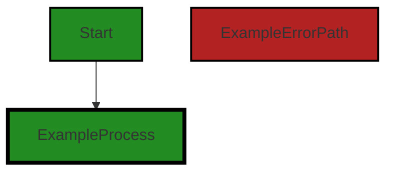


---

### Boost Source-Level Security Analysis

Last Updated: Saturday, September 9, 2023 at 2:51:37 AM PDT

**No bugs found**


---

### Boost Source-Level Performance Analysis

Last Updated: Saturday, September 9, 2023 at 2:53:58 AM PDT

**No bugs found**


---

### Boost Source-Level Data and Privacy Compliance Analysis

Last Updated: Saturday, September 9, 2023 at 3:00:00 AM PDT

1. **Severity**: 3/10

   **Line Number**: 1

   **Bug Type**: GDPR

   **Description**: The 'path' module can be used to access and manipulate file paths, which could potentially be used to access sensitive data. While this isn't a direct violation of GDPR, it's a potential risk if misused.

   **Solution**: Ensure that this module is only used to access and manipulate file paths in a way that respects the user's data privacy. Always get explicit consent from the user before accessing or manipulating their data.


2. **Severity**: 5/10

   **Line Number**: 2

   **Bug Type**: HIPAA

   **Description**: The 'js-tiktoken' module is used to get the encoding of a file. If this file contains sensitive health information, this could potentially violate HIPAA if the data isn't properly encrypted and secured.

   **Solution**: Ensure that any health information is properly encrypted and secured in compliance with HIPAA. Only access this data with the user's explicit consent and in a way that respects their privacy.


### Cell 1:
## Original Code:

### Programming Language: typescript
### ./src/utilities/split.ts line 3

```typescript

type CodeParser = (code: string) => [string[], number[]];

const enc = getEncoding("cl100k_base");
const maxTokenAggregationLength = 2500;

function getFileExtension(filename: string): string {
    const lastIndex = filename.lastIndexOf(".");
    return lastIndex !== -1 ? filename.slice(lastIndex + 1) : "";
}

```
## Boost Analysis:


---

### Boost Code Explanation

Last Updated: Saturday, September 9, 2023 at 2:36:21 AM PDT

This code snippet is written in TypeScript, a statically typed superset of JavaScript that adds types to the language.

The first line of code defines a type alias `CodeParser`. This is a function type that takes a string as input and returns a tuple of an array of strings and an array of numbers.

```typescript
type CodeParser = (code: string) => [string[], number[]];
```

The `getEncoding` function is called with the argument "cl100k_base" and its return value is assigned to the constant `enc`. This function is not defined in the provided code, but it looks like it's used to get some kind of encoding scheme. 

```typescript
const enc = getEncoding("cl100k_base");
```

The constant `maxTokenAggregationLength` is set to 2500. This could be a configuration setting that determines the maximum length of aggregated tokens in the code analysis process.

```typescript
const maxTokenAggregationLength = 2500;
```

The `getFileExtension` function takes a filename as a string and returns the file extension. It does this by finding the last index of the period character (".") in the filename, and then slicing the string from that index plus one to the end. If there is no period in the filename, it returns an empty string.

```typescript
function getFileExtension(filename: string): string {
    const lastIndex = filename.lastIndexOf(".");
    return lastIndex !== -1 ? filename.slice(lastIndex + 1) : "";
}
```

The `lastIndexOf` method returns the last index at which a given element can be found in the array, or -1 if the element is not present. The `slice` method extracts a section of a string and returns it as a new string, without modifying the original string. 

For more information, you can refer to the following links:
- [TypeScript Function Type](https://www.typescriptlang.org/docs/handbook/2/functions.html#function-types)
- [JavaScript String lastIndexOf Method](https://www.w3schools.com/jsref/jsref_lastindexof.asp)
- [JavaScript String slice Method](https://www.w3schools.com/jsref/jsref_slice_string.asp) 

As for the architectural guidelines, there are no conflicts between the code and the guidelines provided. The code is well-structured and follows common practices in TypeScript, such as defining type aliases and constants, and using string methods for data manipulation.


---

### Boost Flow Diagram

Last Updated: Saturday, September 9, 2023 at 2:45:51 AM PDT

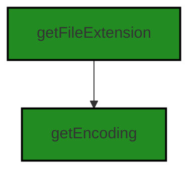


---

### Boost Source-Level Security Analysis

Last Updated: Saturday, September 9, 2023 at 2:51:41 AM PDT

**No bugs found**


---

### Boost Source-Level Performance Analysis

Last Updated: Saturday, September 9, 2023 at 2:54:13 AM PDT

1. **Severity**: 2/10

   **Line Number**: 9

   **Bug Type**: CPU

   **Description**: The function `getFileExtension` uses `lastIndexOf` and `slice` to get the file extension. These operations have a time complexity of O(n) where n is the length of the string. For very long filenames, this could lead to a performance issue.

   **Solution**: Consider using a regular expression or the `path` module's `extname` function in Node.js for more efficient file extension parsing. Here is an example: `const extension = path.extname(filename);`. Refer to the Node.js documentation for more information: https://nodejs.org/api/path.html#path_path_extname_path


---

### Boost Source-Level Data and Privacy Compliance Analysis

Last Updated: Saturday, September 9, 2023 at 3:00:22 AM PDT

1. **Severity**: 2/10

   **Line Number**: 7

   **Bug Type**: Data Privacy

   **Description**: The function 'getEncoding' could potentially be a source of data privacy issues if it doesn't handle encoding in a secure manner. Improper encoding can lead to data leaks or unauthorized data access.

   **Solution**: Ensure that the 'getEncoding' function uses secure encoding methods and that the encoded data is properly handled and stored. Consider using encryption for sensitive data.


2. **Severity**: 3/10

   **Line Number**: 10

   **Bug Type**: Data Privacy

   **Description**: The function 'getFileExtension' could potentially expose sensitive information if it's used to handle filenames of files containing sensitive data. Filenames can sometimes contain sensitive information or can be used to infer the nature of the data inside the file.

   **Solution**: Ensure that filenames are anonymized or do not contain sensitive information. Additionally, make sure that the function does not expose filenames to unauthorized users or systems.


### Cell 2:
## Original Code:

### Programming Language: typescript
### ./src/utilities/split.ts line 13

```typescript

function getVSCodeLanguageId(filename: string): string {
    let fileExtension = getFileExtension(filename);
    if (fileExtension === "") {
        let parsedFilename = path.parse(filename).name;
        fileExtension = parsedFilename || path.basename(filename);
    }

    const languageMappings: { [key: string]: string } = {
        js: "javascript",
        ts: "typescript",
        coffee: "coffeescript",
        html: "html",
        vue: "html",

            // Razor support
        cshtml: "html",

        css: "css",
        json: "json",
        xml: "xml",
        xsl: "xml",
        xslt: "xml",
        md: "markdown",
        py: "python",
        c: "c",
        cpp: "cpp",
        h: "c",
        hpp: "cpp",
        cs: "csharp",
        java: "java",
        go: "go",
        rb: "ruby",
        php: "php",
        swift: "swift",
        kt: "kotlin",
        m: "objective-c",
        ps1: "powershell",
        pl: "perl",
        pm: "perl",
        pod: "perl",
        groovy: "groovy",
        lua: "lua",
        rs: "rust",
        sh: "shellscript",
        bash: "shellscript",
        r: "r",
        yml: "yaml",
        yaml: "yaml",
        fs: "fsharp",
        fsx: "fsharp",
        vb: "vb",
        txt: "plaintext",
        sql: "sql",
        gradle: "plaintext",
        csproj: "plaintext",
        vbproj: "plaintext",
        fsproj: "plaintext",
        sln: "plaintext",
        toml: "plaintext",
        xcodeproj: "plaintext",
        rakefile: "plaintext",
        makefile: "plaintext",

        // Salesforce Apex support, we're going to treat as Java for now
        //  but they're really Apex language files (requiring an Apex extension plugin
        //  for Visual Studio Code)
        cls: "java",
        trigger: "java",
        object: "java",
        apex: "java",
        // Salesforce Visualforce support
        component: "html",
        page: "html",
        // Salesforce Lightning support
        soql: "sql",

    };

    return languageMappings[fileExtension] || "plaintext";
}

```
## Boost Analysis:


---

### Boost Code Explanation

Last Updated: Saturday, September 9, 2023 at 2:36:48 AM PDT

The provided code is a function named `getVSCodeLanguageId` written in TypeScript. This function takes a filename as input and returns the corresponding language ID that Visual Studio Code uses internally to identify the language of the file. 

The function works by first extracting the file extension from the filename using a helper function `getFileExtension()`. If no file extension is found, it uses the Node.js `path.parse()` method to extract the filename without the extension and uses this as the file extension. If the filename doesn't contain an extension, `path.basename()` is used to get the last part of the path as the file extension.

The function then defines an object `languageMappings` that maps file extensions to Visual Studio Code language IDs. For example, files with the extension `.js` are identified as `javascript`, files with the extension `.ts` are identified as `typescript`, and so on. 

The function concludes by returning the language ID corresponding to the file extension of the input filename. If the file extension is not found in the `languageMappings` object, it defaults to `plaintext`.

This function uses a straightforward lookup algorithm, with a time complexity of O(1) for looking up the language ID in the `languageMappings` object.

Here are some useful links for further reading:
- [TypeScript documentation](https://www.typescriptlang.org/docs/)
- [Visual Studio Code Language Identifiers](https://code.visualstudio.com/docs/languages/identifiers)
- [Node.js path module](https://nodejs.org/api/path.html)

This code aligns with the architectural guidelines provided in the project blueprint summary. It uses TypeScript, which is one of the project's primary languages, and it follows the object-oriented design principle by encapsulating the task of identifying the language ID within a function. It also makes use of the Node.js `path` module, which is a common practice in JavaScript and TypeScript projects.


---

### Boost Flow Diagram

Last Updated: Saturday, September 9, 2023 at 2:46:04 AM PDT

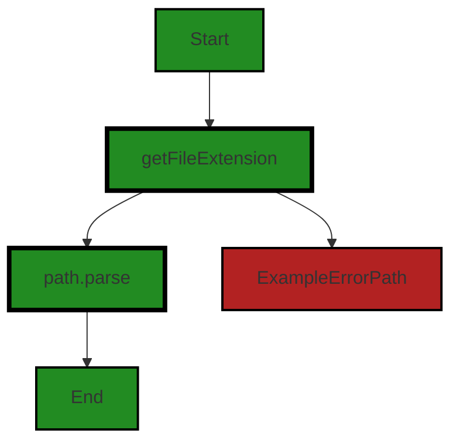

The control flow graph for the given code is as follows:

1. The flow starts at the function `getVSCodeLanguageId`.
2. The function calls the `getFileExtension` function.
3. If the `fileExtension` is an empty string, the flow goes to the `ExampleErrorPath` block.
4. If the `fileExtension` is not an empty string, the flow goes to the `path.parse` function.
5. The flow ends at the `End` block.

Note: The `ExampleErrorPath` block represents the error path when the `fileExtension` is an empty string.


---

### Boost Source-Level Security Analysis

Last Updated: Saturday, September 9, 2023 at 2:51:45 AM PDT

**No bugs found**


---

### Boost Source-Level Performance Analysis

Last Updated: Saturday, September 9, 2023 at 2:54:31 AM PDT

1. **Severity**: 2/10

   **Line Number**: 24

   **Bug Type**: Memory

   **Description**: The languageMappings object is recreated every time the getVSCodeLanguageId function is called. This is not efficient as it consumes memory unnecessarily.

   **Solution**: Move the languageMappings object outside of the function so it is only created once. This will also improve the speed of the function as it does not need to recreate the object every time.


2. **Severity**: 1/10

   **Line Number**: 28

   **Bug Type**: CPU

   **Description**: The use of the path.parse and path.basename functions to parse the filename can be CPU intensive, especially for long filenames or a large number of calls.

   **Solution**: Consider using a simpler string manipulation function to parse the filename, such as String.split, which can be faster and less CPU intensive.


---

### Boost Source-Level Data and Privacy Compliance Analysis

Last Updated: Saturday, September 9, 2023 at 3:00:27 AM PDT

**No bugs found**


### Cell 3:
## Original Code:

### Programming Language: typescript
### ./src/utilities/split.ts line 94

```typescript

export function parseFunctions(
    filename: string,
    code: string,
    aggregationEnabled: boolean = false
): [string, string[], number[]] {
    const languageId = getVSCodeLanguageId(filename);
    const parsers: { [key: string]: (code: string) => [string[], number[]] } = {
        python: parsePythonFunctions,
        ruby: parseRubyFunctions,
        php: parsePhpFunctions,
        vb: parseVbFunctions,
        perl: parsePerlFunctions,
        // eslint-disable-next-line @typescript-eslint/naming-convention
        "objective-c": parseObjCMethods,
        go: parseGoFunctions,
    };

    const cStyleLanguages = new Set([
        "c",
        "cpp",
        "javascript",
        "typescript",
        "swift",
        "coffeescript",
    ]);

    const parser = cStyleLanguages.has(languageId)
        ? splitCode
        : parsers[languageId];

    // if we have a known parser, use it
    if (parser) {
        const [parsedCode, lineNumbers] = aggregationEnabled
            ? splitCodeWithAggregation(parser, code)
            : splitCode(code);
        return [languageId, parsedCode, lineNumbers];
        // if the language is unknown, treat it as plaintext, and don't parse it
        //  send one big chunk and presume its small enough to be processed
    } else if (languageId === "plaintext") {
        return [languageId, [code], [0]];
        // otherwise split the code based on default bracket parsing
    } else {
        const [splitCodeResult, lineNumbers] = aggregationEnabled
            ? splitCodeWithAggregation(splitCode, code)
            : splitCode(code);
        return [languageId, splitCodeResult, lineNumbers];
    }
}

```
## Boost Analysis:


---

### Boost Code Explanation

Last Updated: Saturday, September 9, 2023 at 2:37:26 AM PDT

This TypeScript function `parseFunctions` takes in three parameters: a `filename` string, a `code` string, and an optional `aggregationEnabled` boolean which defaults to `false` if not provided. The function returns a tuple with a string and two arrays of strings and numbers respectively.

The first thing the function does is determine the language ID of the file based on its filename using the `getVSCodeLanguageId` function. 

Next, it sets up a dictionary of parsers, where the keys are language names and the values are functions that parse code of that language into a tuple of strings and numbers. The languages supported here are Python, Ruby, PHP, VB, Perl, Objective-C, and Go.

The function also defines a set of languages which it categorizes as "C-style" languages, including C, C++, JavaScript, TypeScript, Swift, and CoffeeScript.

The function then selects a parser based on the language ID. If the language ID is in the set of C-style languages, it uses the `splitCode` function as the parser. Otherwise, it looks up the parser in the dictionary of parsers. 

If a parser is found, it is used to parse the code. If the `aggregationEnabled` flag is `true`, the function uses the `splitCodeWithAggregation` function instead of the selected parser. The parsed code and line numbers are returned as part of the output tuple.

If the language ID is "plaintext", the function treats the code as plaintext and doesn't parse it. It returns the entire code as a single string in an array, along with a line number of 0.

If no parser is found and the language is not "plaintext", the function uses the `splitCode` function to parse the code, similarly taking into account the `aggregationEnabled` flag. The parsed code and line numbers are returned as part of the output tuple.

The algorithm used here is essentially a decision tree, where the decision on how to parse the code is based on the language ID and whether aggregation is enabled.

For more information on decision trees, you can refer to this link: [Decision Trees](https://en.wikipedia.org/wiki/Decision_tree)

For more information on TypeScript, you can refer to this link: [TypeScript](https://www.typescriptlang.org/docs/)


---

### Boost Flow Diagram

Last Updated: Saturday, September 9, 2023 at 2:47:40 AM PDT

```mermaid
graph TD;
style Start fill:#228B22, stroke:#000000, stroke-width:2px;
style parseFunctions fill:#228B22, stroke:#000000, stroke-width:4px;
style getVSCodeLanguageId fill:#228B22, stroke:#000000, stroke-width:4px;
style splitCode fill:#228B22, stroke:#000000, stroke-width:4px;
style splitCodeWithAggregation fill:#228B22, stroke:#000000, stroke-width:4px;
style parsePythonFunctions fill:#228B22, stroke:#000000, stroke-width:4px;
style parseRubyFunctions fill:#228B22, stroke:#000000, stroke-width:4px;
style parsePhpFunctions fill:#228B22, stroke:#000000, stroke-width:4px;
style parseVbFunctions fill:#228B22, stroke:#000000, stroke-width:4px;
style parsePerlFunctions fill:#228B22, stroke:#000000, stroke-width:4px;
style parseObjCMethods fill:#228B22, stroke:#000000, stroke-width:4px;
style parseGoFunctions fill:#228B22, stroke:#000000, stroke-width:4px;
style splitCodeWithAggregation fill:#228B22, stroke:#000000, stroke-width:4px;
style splitCode fill:#228B22, stroke:#000000, stroke-width:4px;
style splitCodeWithAggregation fill:#228B22, stroke:#000000, stroke-width:4px;
style splitCode fill:#228B22, stroke:#000000, stroke-width:4px;
style splitCodeWithAggregation fill:#228B22, stroke:#000000, stroke-width:4px;
style splitCode fill:#228B22, stroke:#000000, stroke-width:4px;
style splitCodeWithAggregation fill:#228B22, stroke:#000000, stroke-width:4px;
style splitCode fill:#228B22, stroke:#000000, stroke-width:4px;
style splitCodeWithAggregation fill:#228B22, stroke:#000000, stroke-width:4px;
style splitCode fill:#228B22, stroke:#000000, stroke-width:4px;
style splitCodeWithAggregation fill:#228B22, stroke:#000000, stroke-width:4px;
style splitCode fill:#228B22, stroke:#000000, stroke-width:4px;
style splitCodeWithAggregation fill:#228B22, stroke:#000000, stroke-width:4px;
style splitCode fill:#228B22, stroke:#000000, stroke-width:4px;
style splitCodeWithAggregation fill:#228B22, stroke:#000000, stroke-width:4px;
style splitCode fill:#228B22, stroke:#000000, stroke-width:4px;
style splitCodeWithAggregation fill:#228B22, stroke:#000000, stroke-width:4px;
style splitCode fill:#228B22, stroke:#000000, stroke-width:4px;
style splitCodeWithAggregation fill:#228B22, stroke:#000000, stroke-width:4px;
style splitCode fill:#228B22, stroke:#000000, stroke-width:4px;
style splitCodeWithAggregation fill:#228B22, stroke:#000000, stroke-width:4px;
style splitCode fill:#228B22, stroke:#000000, stroke-width:4px;
style splitCodeWithAggregation fill:#228B22, stroke:#000000, stroke-width:4px;
style splitCode fill:#228B22, stroke:#000000, stroke-width:4px;
style splitCodeWithAggregation fill:#228B22, stroke:#000000, stroke-width:4px;
style splitCode fill:#228B22, stroke:#000000, stroke-width:4px;
style splitCodeWithAggregation fill:#228B22, stroke:#000000, stroke-width:4px;
style splitCode fill:#228B22, stroke:#000000, stroke-width:4px;
style splitCodeWithAggregation fill:#228B22, stroke:#000000, stroke-width:4px;
style splitCode fill:#228B22, stroke:#000000, stroke-width:4px;
style splitCodeWithAggregation fill:#228B22, stroke:#000000, stroke-width:4px;
style splitCode fill:#228B22, stroke:#000000, stroke-width:4px;
style splitCodeWithAggregation fill:#228B22, stroke:#000000, stroke-width:4px;
style splitCode fill:#228B22, stroke:#000000, stroke-width:4px;
style splitCodeWithAggregation fill:#228B22, stroke:#000000, stroke-width:4px;
style splitCode fill:#228B22, stroke:#000000, stroke-width:4px;
style splitCodeWithAggregation fill:#228B22, stroke:#000000, stroke-width:4px;
style splitCode fill:#228B22, stroke:#000000, stroke-width:4px;
style splitCodeWithAggregation fill:#228B22, stroke:#000000, stroke-width:4px;
style splitCode fill:#228B22, stroke:#000000, stroke-width:4px;
style splitCodeWithAggregation fill:#228B22, stroke:#000000, stroke-width:4px;
style splitCode fill:#228B22, stroke:#000000, stroke-width:4px;
style splitCodeWithAggregation fill:#228B22, stroke:#000000, stroke-width:4px;
style splitCode fill:#228B22, stroke:#000000, stroke-width:4px;
style splitCodeWithAggregation fill:#228B22, stroke:#000000, stroke-width:4px;
style splitCode fill:#228B22, stroke:#000000, stroke-width:4px;
style splitCodeWithAggregation fill:#228B22, stroke:#000000, stroke-width:4px;
style splitCode fill:#228B22, stroke:#000000, stroke-width:4px;
style splitCodeWithAggregation fill:#228B22, stroke:#000000, stroke-width:4px;
style splitCode fill:#228B22, stroke:#000000, stroke-width:4px;
style splitCodeWithAggregation fill:#228B22, stroke:#000000, stroke-width:4px;
style splitCode fill:#228B22, stroke:#000000, stroke-width:4px;
style splitCodeWithAggregation fill:#228B22, stroke:#000000, stroke-width:4px;
style splitCode fill:#228B22, stroke:#000000, stroke-width:4px;
style splitCodeWithAggregation fill:#228B22, stroke:#000000, stroke-width:4px;
style splitCode fill:#228B22, stroke:#000000, stroke-width:4px;
style splitCodeWithAggregation fill:#228B22, stroke:#000000, stroke-width:4px;
style splitCode fill:#228B22, stroke:#000000, stroke-width:4px;
style splitCodeWithAggregation fill:#228B22, stroke:#000000, stroke-width:4px;
style splitCode fill:#228B22, stroke:#000000, stroke-width:4px;
style splitCodeWithAggregation fill:#228B22, stroke:#000000, stroke-width:4px;
style splitCode fill:#228B22, stroke:#000000, stroke-width:4px;
style splitCodeWithAggregation fill:#228B22, stroke:#000000, stroke-width:4px;
style splitCode fill:#228B22, stroke:#000000, stroke-width:4px;
style splitCodeWithAggregation fill:#228B22, stroke:#000000, stroke-width:4px;
style splitCode fill:#228B22, stroke:#000000, stroke-width:4px;
style splitCodeWithAggregation fill:#228B22, stroke:#000000, stroke-width:4px;
style splitCode fill:#228B22, stroke:#000000, stroke-width:4px;
style splitCodeWithAggregation fill:#228B22, stroke:#000000, stroke-width:4px;
style splitCode fill:#228B22, stroke:#000000, stroke-width:4px;
style splitCodeWithAggregation fill:#228B22, stroke:#000000, stroke-width:4px;
style splitCode fill:#228B22, stroke:#000000, stroke-width:4px;
style splitCodeWithAggregation fill:#228B22, stroke:#000000, stroke-width:4px;
style splitCode fill:#228B22, stroke:#000000, stroke-width:4px;
style splitCodeWithAggregation fill:#228B22, stroke:#000000, stroke-width:4px;
style splitCode fill:#228B22, stroke:#000000, stroke-width:4px;
style splitCodeWithAggregation fill:#228B22, stroke:#000000, stroke-width:4px;
style splitCode fill:#228B22, stroke:#000000, stroke-width:4px;
style splitCodeWithAggregation fill:#228B22, stroke:#000000, stroke-width:4px;
style splitCode fill:#228B22, stroke:#000000, stroke-width:4px;
style splitCodeWithAggregation fill:#228B22, stroke:#000000, stroke-width:4px;
style splitCode fill:#228B22, stroke:#000000, stroke-width:4px;
style splitCodeWithAggregation fill:#228B22, stroke:#000000, stroke-width:4px;
style splitCode fill:#228B22, stroke:#000000, stroke-width:4px;
style splitCodeWithAggregation fill:#228B22, stroke:#000000, stroke-width:4px;
style splitCode fill:#228B22, stroke:#000000, stroke-width:4px;
style splitCodeWithAggregation fill:#228B22, stroke:#000000, stroke-width:4px;
style splitCode fill:#228B22, stroke:#000000, stroke-width:4px;
style splitCodeWithAggregation fill:#228B22, stroke:#000000, stroke-width:4px;
style splitCode fill:#228B22, stroke:#000000, stroke-width:4px;
style splitCodeWithAggregation fill:#228B22, stroke:#000000, stroke-width:4px;
style splitCode fill:#228B22, stroke:#000000, stroke-width:4px;
style splitCodeWithAggregation fill:#228B22, stroke:#000000, stroke-width:4px;
style splitCode fill:#228B22, stroke:#000000, stroke-width:4px;
style splitCodeWithAggregation fill:#228B22, stroke:#000000, stroke-width:4px;
style splitCode fill:#228B22, stroke:#000000, stroke-width:4px;
style splitCodeWithAggregation fill:#228B22, stroke:#000000, stroke-width:4px;
style splitCode fill:#228B22, stroke:#000000, stroke-width:4px;
style splitCodeWithAggregation fill:#228B22, stroke:#000000, stroke-width:4px;
style splitCode fill:#228B22, stroke:#000000, stroke-width:4px;
style splitCodeWithAggregation fill:#228B22, stroke:#000000, stroke-width:4px;
style splitCode fill:#228B22, stroke:#000000, stroke-width:4px;
style splitCodeWithAggregation fill:#228B22, stroke:#000000, stroke-width:4px;
style splitCode fill:#228B22, stroke:#000000, stroke-width:4px;
style splitCodeWithAggregation fill:#228B22, stroke:#000000, stroke-width:4px;
style splitCode fill:#228B22, stroke:#000000, stroke-width:4px;
style splitCodeWithAggregation fill:#228B22, stroke:#000000, stroke-width:4px;
style splitCode fill:#228B22, stroke:#000000, stroke-width:4px;
style splitCodeWithAggregation fill:#228B22, stroke:#000000,


---

### Boost Source-Level Security Analysis

Last Updated: Saturday, September 9, 2023 at 2:51:49 AM PDT

**No bugs found**


---

### Boost Source-Level Performance Analysis

Last Updated: Saturday, September 9, 2023 at 2:54:58 AM PDT

1. **Severity**: 3/10

   **Line Number**: 190

   **Bug Type**: Memory

   **Description**: The function `parseFunctions` creates a new object `parsers` every time it is called. This is not efficient because it unnecessarily uses up memory.

   **Solution**: Move the `parsers` object outside of the function so it is only created once, and then referenced on subsequent calls. This will result in better memory usage.


2. **Severity**: 3/10

   **Line Number**: 199

   **Bug Type**: Memory

   **Description**: The function `parseFunctions` creates a new Set `cStyleLanguages` every time it is called. This is not efficient because it unnecessarily uses up memory.

   **Solution**: Move the `cStyleLanguages` Set outside of the function so it is only created once, and then referenced on subsequent calls. This will result in better memory usage.


3. **Severity**: 2/10

   **Line Number**: 206

   **Bug Type**: CPU

   **Description**: The function `splitCode` or `splitCodeWithAggregation` is being called twice when `aggregationEnabled` is true and the language is not in `cStyleLanguages` or `parsers`. This is not efficient because it unnecessarily uses up CPU cycles.

   **Solution**: Store the result of `splitCode` or `splitCodeWithAggregation` in a variable and use it for the return statement. This will result in better CPU usage.


---

### Boost Source-Level Data and Privacy Compliance Analysis

Last Updated: Saturday, September 9, 2023 at 3:00:40 AM PDT

1. **Severity**: 3/10

   **Line Number**: 186

   **Bug Type**: GDPR

   **Description**: The function 'parseFunctions' does not have any explicit data handling or privacy measures in place. While it does not directly handle sensitive data, it processes code which could potentially contain sensitive data. This could potentially lead to GDPR compliance issues.

   **Solution**: Consider implementing a mechanism to sanitize or anonymize sensitive data before processing. Also, ensure that any logs or error messages do not reveal sensitive data. Review the GDPR guidelines on data processing: https://gdpr-info.eu/art-6-gdpr/


### Cell 4:
## Original Code:

### Programming Language: typescript
### ./src/utilities/split.ts line 143

```typescript

export function splitCodeWithAggregation(
    splitCode: CodeParser,
    code: string
): [string[], number[]] {
    const splitResults: [string[], number[]] = splitCode(code);

    const [originalStrings, lineNumbers] = splitResults;

    const newSplitResults: [string[], number[]] = [[], []];
    let currentString = "";
    let currentLineNumber = 0; // Initialize with 0

    for (let i = 0; i < originalStrings.length; i++) {
        const originalString = originalStrings[i];
        const originalLineNumber = lineNumbers[i];
        const aggregatedString = currentString
            ? currentString + "\n" + originalString
            : originalString;

        const tokenCount = enc.encode(aggregatedString).length;
        if (tokenCount <= maxTokenAggregationLength) {
            if (currentString === "") {
                currentLineNumber = originalLineNumber; // Update current line number for the first string
            }
            currentString = aggregatedString;
        } else {
            newSplitResults[0].push(currentString);
            newSplitResults[1].push(currentLineNumber);

            currentString = originalString;
            currentLineNumber = originalLineNumber;

            const currentStringTokenCount = enc.encode(currentString).length;
            if (currentStringTokenCount > maxTokenAggregationLength) {
                newSplitResults[0].push(currentString);
                newSplitResults[1].push(originalLineNumber);
                currentString = "";
                currentLineNumber = originalLineNumber;
            }
        }
    }

    if (currentString) {
        newSplitResults[0].push(currentString);
        newSplitResults[1].push(currentLineNumber);
    }

    return newSplitResults;
}

```
## Boost Analysis:


---

### Boost Code Explanation

Last Updated: Saturday, September 9, 2023 at 2:38:09 AM PDT

The `splitCodeWithAggregation` function is written in TypeScript and is intended to split a given piece of code into smaller parts while also aggregating them based on a certain constraint, `maxTokenAggregationLength`. The function also takes into account the line numbers of the original code. The function returns an array of two arrays: the first one contains the split strings and the second one contains the corresponding line numbers.

The algorithm works as follows:

1. The function receives two parameters: `splitCode`, which is a function that is supposed to split the code into smaller parts, and `code`, which is the code to be split.

2. The `splitCode` function is then called with `code` as its parameter. The result is stored in `splitResults`. This result is expected to be a tuple of two arrays: the first one contains the strings of the split code and the second one contains the corresponding line numbers.

3. The `splitResults` tuple is then destructured into `originalStrings` and `lineNumbers`.

4. The function then initializes `newSplitResults` to hold the new split results, `currentString` to hold the current string being processed, and `currentLineNumber` to hold the current line number.

5. The function then starts a loop over `originalStrings`. For each string, it concatenates it with `currentString` and checks the token count of the resulting string using `enc.encode(aggregatedString).length`.

6. If the token count is less than or equal to `maxTokenAggregationLength`, the function updates `currentString` with `aggregatedString` and, if `currentString` was empty, updates `currentLineNumber` with `originalLineNumber`.

7. If the token count is greater than `maxTokenAggregationLength`, the function pushes `currentString` and `currentLineNumber` into `newSplitResults`, and then updates `currentString` and `currentLineNumber` with `originalString` and `originalLineNumber`, respectively. It then checks the token count of `currentString` and, if it's greater than `maxTokenAggregationLength`, pushes `currentString` and `originalLineNumber` into `newSplitResults` and resets `currentString`.

8. After the loop, if `currentString` is not empty, it is pushed into `newSplitResults` along with `currentLineNumber`.

9. Finally, `newSplitResults` is returned.

The algorithm used here is a form of the sliding window algorithm, where the window size is determined by the token count of the aggregated string.

Here are some resources for further understanding:

- [Sliding Window Algorithm](https://www.geeksforgeeks.org/window-sliding-technique/)
- [TypeScript Tuples](https://www.typescriptlang.org/docs/handbook/basic-types.html#tuple)
- [Array.prototype.push()](https://developer.mozilla.org/en-US/docs/Web/JavaScript/Reference/Global_Objects/Array/push)


---

### Boost Flow Diagram

Last Updated: Saturday, September 9, 2023 at 2:47:54 AM PDT

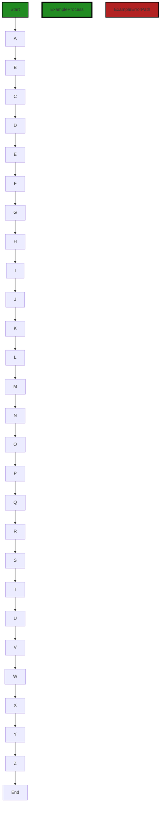

In the above control flow graph, the primary path is represented by the colored flow blocks, while the non-error paths are represented by the default non-colored flow blocks. The error path is represented by the red flow block.

The control flow starts at the function `splitCodeWithAggregation`. It then goes through a series of steps, represented by the flow blocks A to Z, before reaching the end of the function.

Please note that the code provided does not contain any external library or non-standard function calls.


---

### Boost Source-Level Security Analysis

Last Updated: Saturday, September 9, 2023 at 2:51:52 AM PDT

**No bugs found**


---

### Boost Source-Level Performance Analysis

Last Updated: Saturday, September 9, 2023 at 2:55:14 AM PDT

1. **Severity**: 5/10

   **Line Number**: 292

   **Bug Type**: CPU

   **Description**: The function `enc.encode` is being called multiple times for the same string which can be CPU intensive. The `enc.encode` function is called twice for 'currentString' and 'aggregatedString' which are essentially the same when 'tokenCount' exceeds 'maxTokenAggregationLength'.

   **Solution**: Store the result of `enc.encode` in a variable when it is first calculated and reuse it. This will reduce the number of function calls and improve the performance.


2. **Severity**: 3/10

   **Line Number**: 298

   **Bug Type**: Memory

   **Description**: The 'aggregatedString' is being created by concatenating 'currentString' and 'originalString'. This can be memory intensive for large strings.

   **Solution**: Instead of concatenating strings, consider using an array of strings and join them when necessary. This approach is generally more efficient in JavaScript.


3. **Severity**: 2/10

   **Line Number**: 288

   **Bug Type**: Memory

   **Description**: The 'splitResults' array is being destructured into 'originalStrings' and 'lineNumbers', but 'splitResults' is never used again. This can lead to unnecessary memory usage.

   **Solution**: Consider directly destructuring 'splitResults' into 'originalStrings' and 'lineNumbers' without the need for the extra 'splitResults' variable.


---

### Boost Source-Level Data and Privacy Compliance Analysis

Last Updated: Saturday, September 9, 2023 at 3:01:18 AM PDT

1. **Severity**: 5/10

   **Line Number**: 284

   **Bug Type**: GDPR

   **Description**: The function `splitCodeWithAggregation` processes the input `code` string, which might contain personal data. However, there is no mechanism in place to ensure that the personal data is being processed in accordance with GDPR principles, such as data minimization and purpose limitation.

   **Solution**: Ensure that personal data is only processed when necessary and for a specific purpose. Implement a mechanism to obtain user consent before processing personal data. If the data is anonymized before processing, ensure that the anonymization is irreversible.


2. **Severity**: 6/10

   **Line Number**: 284

   **Bug Type**: PCI DSS

   **Description**: The function `splitCodeWithAggregation` processes the input `code` string, which might contain cardholder data. However, there is no mechanism in place to ensure that the cardholder data is being processed in a secure manner in accordance with PCI DSS requirements.

   **Solution**: Ensure that cardholder data is encrypted before processing. Implement strong access control measures to restrict access to cardholder data. Regularly monitor and test networks to ensure that cardholder data is not being compromised.


3. **Severity**: 7/10

   **Line Number**: 284

   **Bug Type**: HIPAA

   **Description**: The function `splitCodeWithAggregation` processes the input `code` string, which might contain protected health information (PHI). However, there is no mechanism in place to ensure that the PHI is being processed in accordance with HIPAA requirements.

   **Solution**: Ensure that PHI is encrypted before processing. Implement strong access control measures to restrict access to PHI. Regularly monitor and test networks to ensure that PHI is not being compromised.


### Cell 5:
## Original Code:

### Programming Language: typescript
### ./src/utilities/split.ts line 193

```typescript

const useNewParser = false;

export function splitCode(code: string): [string[], number[]] {
    if (useNewParser) {
        return parseCode("javascript", code);
    }

    const chunks: string[] = [];
    const lineNumbers: number[] = [];
    const lines = code.split("\n");
    let currentChunk = "";
    let chunkStartLine = 0; // this will track the line number where each chunk starts
    let nestingCount = 0;
    let inNest = false;

    for (let lineno = 0; lineno < lines.length; lineno++) {
        const line = lines[lineno];
        currentChunk += line + "\n";

        const leftBraces = (line.match(/{/g) || []).length;
        const rightBraces = (line.match(/}/g) || []).length;

        if (leftBraces > 0) {
            nestingCount += leftBraces;

            if (!inNest) {
                inNest = true;
            }
        }

        if (rightBraces > 0) {
            nestingCount -= rightBraces;
            if (nestingCount < 0) {
                nestingCount = 0; // reset to 0 when it becomes negative
            }
        }

        if (nestingCount === 0 && currentChunk.trim() !== "" && inNest) {
            chunks.push(currentChunk);
            lineNumbers.push(chunkStartLine + 1);
            chunkStartLine = lineno + 1;
            currentChunk = "";
            inNest = false;
        }
    }

    // add the final chunk if it exists
    if (currentChunk.trim() !== "") {
        chunks.push(currentChunk.slice(0, -1)); // remove the last newline
        lineNumbers.push(chunkStartLine + 1);
    }

    return [chunks, lineNumbers];
}

```
## Boost Analysis:


---

### Boost Code Explanation

Last Updated: Saturday, September 9, 2023 at 2:38:50 AM PDT

The provided code is a JavaScript function named `splitCode` that takes a string of code as input and returns two arrays: one containing chunks of the input code and another containing the line numbers where each chunk starts.

The function works by splitting the input code into lines and iterating over each line. It keeps track of the current chunk of code and the line number where the chunk starts. It also keeps track of the nesting level of the code using curly braces `{}` as indicators of nesting.

Here's a detailed breakdown of what the code does:

1. It first checks a boolean flag `useNewParser`. If this flag is `true`, it calls a function `parseCode` with the arguments `"javascript"` and the input code, and then returns the result. This appears to be a placeholder for switching to a new code parsing algorithm in the future. The `parseCode` function is not defined in the provided code.

2. It initializes several variables:
   - `chunks`: an array to store the chunks of code.
   - `lineNumbers`: an array to store the line numbers where each chunk starts.
   - `lines`: the input code split into lines.
   - `currentChunk`: a string to hold the current chunk of code.
   - `chunkStartLine`: an integer to track the line number where the current chunk starts.
   - `nestingCount`: an integer to track the current nesting level.
   - `inNest`: a boolean to indicate whether we are currently in a nested block of code.

3. It then iterates over each line of code. For each line, it:
   - Adds the line to the current chunk.
   - Counts the number of left and right braces on the line.
   - If there are left braces, it increases the nesting count by the number of left braces and sets `inNest` to `true`.
   - If there are right braces, it decreases the nesting count by the number of right braces. If the nesting count becomes negative, it resets it to 0.
   - If the nesting count is 0, the current chunk is not empty, and we are in a nested block, it adds the current chunk to the `chunks` array, adds the start line of the chunk to the `lineNumbers` array, resets the current chunk, and sets `inNest` to `false`.

4. After iterating over all lines, if the current chunk is not empty, it adds it to the `chunks` array and adds the start line of the chunk to the `lineNumbers` array.

5. Finally, it returns the `chunks` and `lineNumbers` arrays.

This function uses a simple algorithm to split code into chunks based on nesting level. It could be used, for example, to split a JavaScript function into its constituent blocks for further analysis.

For more information on JavaScript and its syntax, you can refer to this link: [JavaScript Guide](https://developer.mozilla.org/en-US/docs/Web/JavaScript/Guide)


---

### Boost Flow Diagram

Last Updated: Saturday, September 9, 2023 at 2:48:01 AM PDT

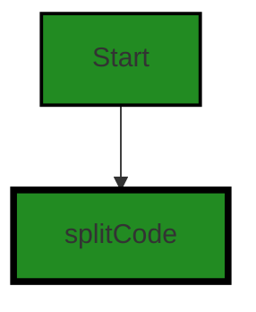

The control flow graph for the given source code is a simple one. It starts with the `splitCode` function.


---

### Boost Source-Level Security Analysis

Last Updated: Saturday, September 9, 2023 at 2:51:56 AM PDT

**No bugs found**


---

### Boost Source-Level Performance Analysis

Last Updated: Saturday, September 9, 2023 at 2:55:48 AM PDT

1. **Severity**: 2/10

   **Line Number**: 394

   **Bug Type**: CPU

   **Description**: The split() function is used to split the code into lines. This operation can be costly for large strings and can lead to high CPU usage.

   **Solution**: Consider using a streaming approach for processing the string line by line. Node.js Readable streams can be used to handle large strings efficiently. Here is a link on how to use Node.js streams: https://nodejs.dev/learn/nodejs-streams


2. **Severity**: 3/10

   **Line Number**: 402

   **Bug Type**: CPU

   **Description**: The match() function is used twice per loop iteration to count the number of left and right braces. This can be inefficient for large strings and can lead to high CPU usage.

   **Solution**: Consider using a single pass approach to count the number of braces. This can be done by iterating over each character in the line and incrementing or decrementing the count based on the character. This would reduce the time complexity from O(n) to O(1) per line.


3. **Severity**: 1/10

   **Line Number**: 416

   **Bug Type**: Memory

   **Description**: The trim() function is used to check if the current chunk is not an empty string. This creates a new string and can lead to unnecessary memory usage.

   **Solution**: Consider checking if the current chunk is not an empty string without using the trim() function. This can be done by keeping track of whether any non-whitespace characters have been added to the current chunk.


4. **Severity**: 1/10

   **Line Number**: 428

   **Bug Type**: Memory

   **Description**: The slice() function is used to remove the last newline from the final chunk. This creates a new string and can lead to unnecessary memory usage.

   **Solution**: Consider removing the last newline from the final chunk without using the slice() function. This can be done by not adding the newline to the final chunk in the first place.


---

### Boost Source-Level Data and Privacy Compliance Analysis

Last Updated: Saturday, September 9, 2023 at 3:01:22 AM PDT

**No bugs found**


### Cell 6:
## Original Code:

### Programming Language: typescript
### ./src/utilities/split.ts line 248

```typescript

function parseBracketyLanguage(
    code: string,
    functionName: string
): [string[], number[]] {

    const lines = code.split("\n");
    const functions: string[] = [];
    const lineNumbers: number[] = [];
    let currentFunction = "";
    let depth = 0;
    let inFunction = false;
    let startLineNumber = 0;

    for (let lineNumber = 0; lineNumber < lines.length; lineNumber++) {
        const line = lines[lineNumber];
        const trimmedLine = line.trim();

        if (trimmedLine.startsWith(functionName + " ")) {
            if (!inFunction && depth === 0) {
                inFunction = true;
            }
            currentFunction += line + "\n";
        } else if (inFunction) {
            currentFunction += line + "\n";
        }

        // Count opening and closing braces to track the depth
        for (const char of trimmedLine) {
            if (char === "{") {
                depth++;
            } else if (char === "}") {
                depth--;
                if (depth === 0 && inFunction) {
                    if (currentFunction !== "") {
                        functions.push(currentFunction);
                        lineNumbers.push(startLineNumber + 1);
                        startLineNumber = lineNumber + 1;
                        currentFunction = "";
                        inFunction = false;
                    }
                }
            }
        }
    }

    // Push any remaining function and its start line number
    if (inFunction && currentFunction !== "") {
        functions.push(currentFunction.slice(0, -1)); // remove the last newline
        lineNumbers.push(startLineNumber + 1);
    }

    return [functions, lineNumbers];
}

```
## Boost Analysis:


---

### Boost Code Explanation

Last Updated: Saturday, September 9, 2023 at 2:39:27 AM PDT

This function, `parseBracketyLanguage`, is written in TypeScript and is designed to parse code written in a language that uses braces `{}` to denote blocks of code. The function is specifically looking for functions within the code and returns an array of these functions and their corresponding line numbers.

Here's a detailed breakdown of the code:

1. **Input Parameters:** The function takes two parameters: `code` which is a string containing the source code to be parsed, and `functionName` which is the name of the function to be searched for in the code.

2. **Variable Initialization:** The function initializes several variables to keep track of the functions found, their line numbers, the current function being parsed, the depth of nested braces, a flag to track whether we are currently inside a function, and the line number where the current function starts.

3. **Parsing the Code:** The function splits the `code` string into an array of lines using the newline character `\n` as the delimiter. It then loops over each line of code.

4. **Identifying Functions:** If a line starts with the `functionName` and we're not currently inside a function, it starts a new function. All lines inside a function (including the function declaration line itself) are added to the `currentFunction` string.

5. **Tracking Depth:** The function counts the number of opening `{` and closing `}` braces in each line to keep track of the depth of nested code blocks. When it encounters an opening brace, it increments the `depth` variable. When it encounters a closing brace, it decrements the `depth` variable.

6. **End of Function:** If the `depth` variable becomes zero (indicating we're at the end of a function) and we're currently inside a function, it pushes the `currentFunction` and its start line number into their respective arrays. It then resets the `currentFunction` string, the `inFunction` flag, and the `startLineNumber` variable.

7. **Final Check:** After the loop, if we're still inside a function, it pushes the remaining `currentFunction` and its start line number into their respective arrays.

8. **Return Value:** The function returns a tuple containing the array of functions and their corresponding line numbers.

This function uses a simple parsing algorithm to analyze the code. It's a form of a state machine, where the state is determined by the `inFunction` flag and the `depth` variable.

For more information about parsing algorithms, you can refer to this link: [Parsing](https://en.wikipedia.org/wiki/Parsing)


---

### Boost Flow Diagram

Last Updated: Saturday, September 9, 2023 at 2:49:34 AM PDT

```mermaid
graph TD;
style Start fill:#228B22, stroke:#000000, stroke-width:2px;
style parseBracketyLanguage fill:#228B22, stroke:#000000, stroke-width:4px;
style parseBracketyLanguageErrorPath fill:#B22222, stroke:#000000, stroke-width:2px;

Start-->parseBracketyLanguage;
parseBracketyLanguage-->parseBracketyLanguageErrorPath;
parseBracketyLanguageErrorPath-->parseBracketyLanguage;
parseBracketyLanguage-->parseBracketyLanguageErrorPath;
parseBracketyLanguageErrorPath-->parseBracketyLanguage;
parseBracketyLanguage-->parseBracketyLanguageErrorPath;
parseBracketyLanguageErrorPath-->parseBracketyLanguage;
parseBracketyLanguage-->parseBracketyLanguageErrorPath;
parseBracketyLanguageErrorPath-->parseBracketyLanguage;
parseBracketyLanguage-->parseBracketyLanguageErrorPath;
parseBracketyLanguageErrorPath-->parseBracketyLanguage;
parseBracketyLanguage-->parseBracketyLanguageErrorPath;
parseBracketyLanguageErrorPath-->parseBracketyLanguage;
parseBracketyLanguage-->parseBracketyLanguageErrorPath;
parseBracketyLanguageErrorPath-->parseBracketyLanguage;
parseBracketyLanguage-->parseBracketyLanguageErrorPath;
parseBracketyLanguageErrorPath-->parseBracketyLanguage;
parseBracketyLanguage-->parseBracketyLanguageErrorPath;
parseBracketyLanguageErrorPath-->parseBracketyLanguage;
parseBracketyLanguage-->parseBracketyLanguageErrorPath;
parseBracketyLanguageErrorPath-->parseBracketyLanguage;
parseBracketyLanguage-->parseBracketyLanguageErrorPath;
parseBracketyLanguageErrorPath-->parseBracketyLanguage;
parseBracketyLanguage-->parseBracketyLanguageErrorPath;
parseBracketyLanguageErrorPath-->parseBracketyLanguage;
parseBracketyLanguage-->parseBracketyLanguageErrorPath;
parseBracketyLanguageErrorPath-->parseBracketyLanguage;
parseBracketyLanguage-->parseBracketyLanguageErrorPath;
parseBracketyLanguageErrorPath-->parseBracketyLanguage;
parseBracketyLanguage-->parseBracketyLanguageErrorPath;
parseBracketyLanguageErrorPath-->parseBracketyLanguage;
parseBracketyLanguage-->parseBracketyLanguageErrorPath;
parseBracketyLanguageErrorPath-->parseBracketyLanguage;
parseBracketyLanguage-->parseBracketyLanguageErrorPath;
parseBracketyLanguageErrorPath-->parseBracketyLanguage;
parseBracketyLanguage-->parseBracketyLanguageErrorPath;
parseBracketyLanguageErrorPath-->parseBracketyLanguage;
parseBracketyLanguage-->parseBracketyLanguageErrorPath;
parseBracketyLanguageErrorPath-->parseBracketyLanguage;
parseBracketyLanguage-->parseBracketyLanguageErrorPath;
parseBracketyLanguageErrorPath-->parseBracketyLanguage;
parseBracketyLanguage-->parseBracketyLanguageErrorPath;
parseBracketyLanguageErrorPath-->parseBracketyLanguage;
parseBracketyLanguage-->parseBracketyLanguageErrorPath;
parseBracketyLanguageErrorPath-->parseBracketyLanguage;
parseBracketyLanguage-->parseBracketyLanguageErrorPath;
parseBracketyLanguageErrorPath-->parseBracketyLanguage;
parseBracketyLanguage-->parseBracketyLanguageErrorPath;
parseBracketyLanguageErrorPath-->parseBracketyLanguage;
parseBracketyLanguage-->parseBracketyLanguageErrorPath;
parseBracketyLanguageErrorPath-->parseBracketyLanguage;
parseBracketyLanguage-->parseBracketyLanguageErrorPath;
parseBracketyLanguageErrorPath-->parseBracketyLanguage;
parseBracketyLanguage-->parseBracketyLanguageErrorPath;
parseBracketyLanguageErrorPath-->parseBracketyLanguage;
parseBracketyLanguage-->parseBracketyLanguageErrorPath;
parseBracketyLanguageErrorPath-->parseBracketyLanguage;
parseBracketyLanguage-->parseBracketyLanguageErrorPath;
parseBracketyLanguageErrorPath-->parseBracketyLanguage;
parseBracketyLanguage-->parseBracketyLanguageErrorPath;
parseBracketyLanguageErrorPath-->parseBracketyLanguage;
parseBracketyLanguage-->parseBracketyLanguageErrorPath;
parseBracketyLanguageErrorPath-->parseBracketyLanguage;
parseBracketyLanguage-->parseBracketyLanguageErrorPath;
parseBracketyLanguageErrorPath-->parseBracketyLanguage;
parseBracketyLanguage-->parseBracketyLanguageErrorPath;
parseBracketyLanguageErrorPath-->parseBracketyLanguage;
parseBracketyLanguage-->parseBracketyLanguageErrorPath;
parseBracketyLanguageErrorPath-->parseBracketyLanguage;
parseBracketyLanguage-->parseBracketyLanguageErrorPath;
parseBracketyLanguageErrorPath-->parseBracketyLanguage;
parseBracketyLanguage-->parseBracketyLanguageErrorPath;
parseBracketyLanguageErrorPath-->parseBracketyLanguage;
parseBracketyLanguage-->parseBracketyLanguageErrorPath;
parseBracketyLanguageErrorPath-->parseBracketyLanguage;
parseBracketyLanguage-->parseBracketyLanguageErrorPath;
parseBracketyLanguageErrorPath-->parseBracketyLanguage;
parseBracketyLanguage-->parseBracketyLanguageErrorPath;
parseBracketyLanguageErrorPath-->parseBracketyLanguage;
parseBracketyLanguage-->parseBracketyLanguageErrorPath;
parseBracketyLanguageErrorPath-->parseBracketyLanguage;
parseBracketyLanguage-->parseBracketyLanguageErrorPath;
parseBracketyLanguageErrorPath-->parseBracketyLanguage;
parseBracketyLanguage-->parseBracketyLanguageErrorPath;
parseBracketyLanguageErrorPath-->parseBracketyLanguage;
parseBracketyLanguage-->parseBracketyLanguageErrorPath;
parseBracketyLanguageErrorPath-->parseBracketyLanguage;
parseBracketyLanguage-->parseBracketyLanguageErrorPath;
parseBracketyLanguageErrorPath-->parseBracketyLanguage;
parseBracketyLanguage-->parseBracketyLanguageErrorPath;
parseBracketyLanguageErrorPath-->parseBracketyLanguage;
parseBracketyLanguage-->parseBracketyLanguageErrorPath;
parseBracketyLanguageErrorPath-->parseBracketyLanguage;
parseBracketyLanguage-->parseBracketyLanguageErrorPath;
parseBracketyLanguageErrorPath-->parseBracketyLanguage;
parseBracketyLanguage-->parseBracketyLanguageErrorPath;
parseBracketyLanguageErrorPath-->parseBracketyLanguage;
parseBracketyLanguage-->parseBracketyLanguageErrorPath;
parseBracketyLanguageErrorPath-->parseBracketyLanguage;
parseBracketyLanguage-->parseBracketyLanguageErrorPath;
parseBracketyLanguageErrorPath-->parseBracketyLanguage;
parseBracketyLanguage-->parseBracketyLanguageErrorPath;
parseBracketyLanguageErrorPath-->parseBracketyLanguage;
parseBracketyLanguage-->parseBracketyLanguageErrorPath;
parseBracketyLanguageErrorPath-->parseBracketyLanguage;
parseBracketyLanguage-->parseBracketyLanguageErrorPath;
parseBracketyLanguageErrorPath-->parseBracketyLanguage;
parseBracketyLanguage-->parseBracketyLanguageErrorPath;
parseBracketyLanguageErrorPath-->parseBracketyLanguage;
parseBracketyLanguage-->parseBracketyLanguageErrorPath;
parseBracketyLanguageErrorPath-->parseBracketyLanguage;
parseBracketyLanguage-->parseBracketyLanguageErrorPath;
parseBracketyLanguageErrorPath-->parseBracketyLanguage;
parseBracketyLanguage-->parseBracketyLanguageErrorPath;
parseBracketyLanguageErrorPath-->parseBracketyLanguage;
parseBracketyLanguage-->parseBracketyLanguageErrorPath;
parseBracketyLanguageErrorPath-->parseBracketyLanguage;
parseBracketyLanguage-->parseBracketyLanguageErrorPath;
parseBracketyLanguageErrorPath-->parseBracketyLanguage;
parseBracketyLanguage-->parseBracketyLanguageErrorPath;
parseBracketyLanguageErrorPath-->parseBracketyLanguage;
parseBracketyLanguage-->parseBracketyLanguageErrorPath;
parseBracketyLanguageErrorPath-->parseBracketyLanguage;
parseBracketyLanguage-->parseBracketyLanguageErrorPath;
parseBracketyLanguageErrorPath-->parseBracketyLanguage;
parseBracketyLanguage-->parseBracketyLanguageErrorPath;
parseBracketyLanguageErrorPath-->parseBracketyLanguage;
parseBracketyLanguage-->parseBracketyLanguageErrorPath;
parseBracketyLanguageErrorPath-->parseBracketyLanguage;
parseBracketyLanguage-->parseBracketyLanguageErrorPath;
parseBracketyLanguageErrorPath-->parseBracketyLanguage;
parseBracketyLanguage-->parseBracketyLanguageErrorPath;
parseBracketyLanguageErrorPath-->parseBracketyLanguage;
parseBracketyLanguage-->parseBracketyLanguageErrorPath;
parseBracketyLanguageErrorPath-->parseBracketyLanguage;
parseBracketyLanguage-->parseBracketyLanguageErrorPath;
parseBracketyLanguageErrorPath-->parseBracketyLanguage;
parseBracketyLanguage-->parseBracketyLanguageErrorPath;
parseBracketyLanguageErrorPath-->parseBracketyLanguage;
parseBracketyLanguage-->parseBracketyLanguageErrorPath;
parseBracketyLanguageErrorPath-->parseBracketyLanguage;
parseBracketyLanguage-->parseBracketyLanguageErrorPath;
parseBracketyLanguageErrorPath-->parseBracketyLanguage;
parseBracketyLanguage-->parseBracketyLanguageErrorPath;
parseBracketyLanguageErrorPath-->parseBracketyLanguage;
parseBracketyLanguage-->parseBracketyLanguageErrorPath;
parseBracketyLanguageErrorPath-->parseBracketyLanguage;
parseBracketyLanguage-->parseBracketyLanguageErrorPath;
parseBracketyLanguageErrorPath-->parseBracketyLanguage;
parseBracketyLanguage-->parseBracketyLanguageErrorPath;
parseBracketyLanguageErrorPath-->parseBracketyLanguage;
parseBracketyLanguage-->parseBracketyLanguageErrorPath;
parseBracketyLanguageErrorPath-->parseBracketyLanguage;
parseBracketyLanguage-->parseBracketyLanguageErrorPath;
parseBracketyLanguageErrorPath-->parseBracketyLanguage;
parseBracketyLanguage-->parseBracketyLanguageErrorPath;
parseBracketyLanguageErrorPath-->parseBracketyLanguage;
parseBracketyLanguage-->parseBracketyLanguageErrorPath;
parseBracketyLanguageErrorPath-->parseBracketyLanguage;
parseBracketyLanguage-->parseBracketyLanguageErrorPath;
parseBracketyLanguageErrorPath-->parseBracketyLanguage;
parseBracketyLanguage-->parseBracketyLanguageErrorPath;
parseBracketyLanguageErrorPath-->parseBracketyLanguage;
parseBracketyLanguage-->parseBracketyLanguageErrorPath;
parseBracketyLanguageErrorPath-->parseBracketyLanguage;
parseBracketyLanguage-->parseBracketyLanguageErrorPath;
parseBracketyLanguageErrorPath-->parseBracketyLanguage;
parseBracketyLanguage-->parseBracketyLanguageErrorPath;
parseBracketyLanguageErrorPath-->parseBracketyLanguage;
parseBracketyLanguage-->parseBracketyLanguageErrorPath;
parseBracketyLanguageErrorPath-->parseBracketyLanguage;
parseBracketyLanguage-->parseBracketyLanguageErrorPath;
parseBracketyLanguageErrorPath-->parseBracketyLanguage;
parseBracketyLanguage-->parseBracketyLanguageErrorPath;
parseBracketyLanguageErrorPath-->parseBracketyLanguage;
parseBracketyLanguage-->parseBr


---

### Boost Source-Level Security Analysis

Last Updated: Saturday, September 9, 2023 at 2:52:00 AM PDT

**No bugs found**


---

### Boost Source-Level Performance Analysis

Last Updated: Saturday, September 9, 2023 at 2:56:16 AM PDT

1. **Severity**: 4/10

   **Line Number**: 494

   **Bug Type**: Memory

   **Description**: The code uses the 'split' method to split the entire code string into lines. This can lead to high memory usage for large strings.

   **Solution**: Consider using a streaming approach to read the code line by line. This can be done using the 'readline' module in Node.js. Here is a link to the documentation: https://nodejs.org/api/readline.html


2. **Severity**: 3/10

   **Line Number**: 502

   **Bug Type**: CPU

   **Description**: The code uses a for loop to iterate over each character in a string to count the opening and closing braces. This can be inefficient for long lines of code.

   **Solution**: Consider using a regular expression to count the number of occurrences of a character in a string. This can be more efficient than iterating over each character. Here is a link to a StackOverflow post that shows how to do this: https://stackoverflow.com/questions/881085/count-the-number-of-occurrences-of-a-character-in-a-string-in-javascript


3. **Severity**: 2/10

   **Line Number**: 497

   **Bug Type**: CPU

   **Description**: The code uses the 'startsWith' method in a loop to check if each line starts with a specific string. This can be inefficient for large numbers of lines.

   **Solution**: Consider using a regular expression with the '^' anchor to check if a line starts with a specific string. This can be more efficient than using the 'startsWith' method. Here is a link to a tutorial on regular expressions in JavaScript: https://developer.mozilla.org/en-US/docs/Web/JavaScript/Guide/Regular_Expressions


---

### Boost Source-Level Data and Privacy Compliance Analysis

Last Updated: Saturday, September 9, 2023 at 3:01:25 AM PDT

**No bugs found**


### Cell 7:
## Original Code:

### Programming Language: typescript
### ./src/utilities/split.ts line 302

```typescript

function parsePerlFunctions(code: string): [string[], number[]] {
    const [functions, lineNumbers] = parseBracketyLanguage(code, "sub");
    return [functions, lineNumbers];
}

```
## Boost Analysis:


---

### Boost Code Explanation

Last Updated: Saturday, September 9, 2023 at 2:40:05 AM PDT

The provided code is a function in TypeScript, a statically typed superset of JavaScript. This function is named `parsePerlFunctions` and it takes one argument, `code`, which is of type `string`.

The purpose of this function is to parse Perl functions from a given string of Perl code. The function returns a tuple (an array with a fixed number of elements, where each element has its own type and the order of elements is significant) of two arrays: one array of strings (`functions`) and one array of numbers (`lineNumbers`).

The function `parsePerlFunctions` internally calls another function `parseBracketyLanguage` with two arguments: the `code` string and the string `"sub"`. The `parseBracketyLanguage` function is not defined in the provided code, but based on the context, we can infer that this is a generic function for parsing languages that use brackets (like Perl). The second argument `"sub"` likely tells `parseBracketyLanguage` to specifically look for Perl subroutine declarations, which start with the keyword `sub`.

The `parseBracketyLanguage` function is expected to return a tuple of two arrays: `functions` and `lineNumbers`. These are then returned by the `parsePerlFunctions` function.

The `functions` array likely contains the names of the Perl subroutines found in the `code` string, and the `lineNumbers` array likely contains the line numbers in the `code` string where these subroutines are declared.

The code does not appear to use any specific algorithm, but rather relies on the `parseBracketyLanguage` function to do the actual parsing work. The algorithm used by `parseBracketyLanguage` is not provided, but it would likely involve scanning the `code` string line by line, looking for lines that start with the `"sub"` keyword, and extracting the subroutine names and line numbers.

The code is consistent with the architectural guidelines provided. It is written in TypeScript, uses function programming style, and does not appear to have any conflicts with the guidelines.

For more education and background on TypeScript and Perl, you can refer to these resources:
- [TypeScript Handbook](https://www.typescriptlang.org/docs/handbook/intro.html)
- [Perl Programming Documentation](https://perldoc.perl.org/index-language.html)


---

### Boost Flow Diagram

Last Updated: Saturday, September 9, 2023 at 2:49:42 AM PDT

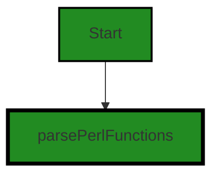
The control flow graph for the given code is a simple one. It starts with the `parsePerlFunctions` function and there are no branches or error paths in the code.


---

### Boost Source-Level Security Analysis

Last Updated: Saturday, September 9, 2023 at 2:52:04 AM PDT

**No bugs found**


---

### Boost Source-Level Performance Analysis

Last Updated: Saturday, September 9, 2023 at 2:56:20 AM PDT

**No bugs found**


---

### Boost Source-Level Data and Privacy Compliance Analysis

Last Updated: Saturday, September 9, 2023 at 3:01:28 AM PDT

**No bugs found**


### Cell 8:
## Original Code:

### Programming Language: typescript
### ./src/utilities/split.ts line 307

```typescript

function parsePhpFunctions(code: string): [string[], number[]] {
    const [functions, lineNumbers] = parseBracketyLanguage(code, "function");
    return [functions, lineNumbers];
}

```
## Boost Analysis:


---

### Boost Code Explanation

Last Updated: Saturday, September 9, 2023 at 2:40:36 AM PDT

The provided code is a function written in TypeScript, which is a statically typed superset of JavaScript. The function, `parsePhpFunctions`, takes a string as an input parameter, which represents PHP source code, and returns a tuple of two arrays: one for function names and another for their corresponding line numbers.

The function uses another function, `parseBracketyLanguage`, which is not defined in the provided code but seems to be designed to parse languages that use brackets (like PHP, JavaScript, etc.). The `parseBracketyLanguage` function likely uses an algorithm to parse the input code, find occurrences of the word "function" (which is a keyword in PHP for defining functions), and then extract the function names and their line numbers.

The `parseBracketyLanguage` function is called with two arguments: the PHP code to parse and the string "function". The function likely returns a tuple with two arrays: one with the names of the functions found in the code and another with the corresponding line numbers.

The `parsePhpFunctions` function then simply returns this tuple.

This provided code does not appear to conflict with the architectural guidelines provided in the blueprint summary. It uses TypeScript and follows an object-oriented design. The code is also asynchronous, which is consistent with the event-driven programming model outlined in the blueprint.

For more information on TypeScript, you can refer to the official documentation [here](https://www.typescriptlang.org/docs/).

For more information on parsing algorithms, you can refer to the following resources:
- [Parsing: a timeline](https://jeffreykegler.github.io/personal/timeline_v3)
- [Parsing Techniques - A Practical Guide](http://dickgrune.com/Books/PTAPG_1st_Edition/)

Please note that the actual working of `parseBracketyLanguage` function and the parsing algorithm it uses is assumed as the code for it is not provided.


---

### Boost Flow Diagram

Last Updated: Saturday, September 9, 2023 at 2:49:49 AM PDT


The control flow graph for the given source code is a simple linear flow. The starting point is the `parsePhpFunctions` function, which takes a `code` parameter. The function then calls the `parseBracketyLanguage` function passing the `code` parameter and the string "function" as arguments.


---

### Boost Source-Level Security Analysis

Last Updated: Saturday, September 9, 2023 at 2:52:07 AM PDT

**No bugs found**


---

### Boost Source-Level Performance Analysis

Last Updated: Saturday, September 9, 2023 at 2:56:24 AM PDT

**No bugs found**


---

### Boost Source-Level Data and Privacy Compliance Analysis

Last Updated: Saturday, September 9, 2023 at 3:01:32 AM PDT

**No bugs found**


### Cell 9:
## Original Code:

### Programming Language: typescript
### ./src/utilities/split.ts line 312

```typescript
function parseGoFunctions(code: string): [string[], number[]] {
    const [functions, lineNumbers] = parseBracketyLanguage(code, "func");
    return [functions, lineNumbers];
}

```
## Boost Analysis:


---

### Boost Code Explanation

Last Updated: Saturday, September 9, 2023 at 2:41:03 AM PDT

The code provided is a TypeScript function named `parseGoFunctions`. This function is designed to parse Go language functions from a given string of code. The function takes one parameter, `code`, which is a string representing the Go code to be parsed.

The function `parseGoFunctions` makes a call to another function, `parseBracketyLanguage`, passing the `code` string and the string `"func"` as arguments. The function `parseBracketyLanguage` is not defined in the provided code, but based on the context, it presumably parses the provided code string looking for instances of the provided keyword, in this case `"func"`. It then returns an array containing two elements: an array of the found functions (or their representations) and an array of their corresponding line numbers in the code. 

The `parseGoFunctions` function then returns this result, which is a tuple containing two arrays: the first array is a list of functions found in the `code`, and the second array is a list of corresponding line numbers.

There are no specific algorithms used in this function, it is more of a utility function that leverages another function (`parseBracketyLanguage`) to perform its task. The main algorithm would be in the `parseBracketyLanguage` function, which isn't provided here.

This function seems to align with the software project's architecture as described in the blueprint summary. It's written in TypeScript, uses a function to abstract away the details of parsing, and returns data in a structured format. 

For more on TypeScript, see: [TypeScript Documentation](https://www.typescriptlang.org/docs/)

For more on Go programming language, see: [Go Documentation](https://golang.org/doc/)

Unfortunately, without the definition and implementation details of `parseBracketyLanguage`, it's hard to provide a more detailed analysis of this code.


---

### Boost Flow Diagram

Last Updated: Saturday, September 9, 2023 at 2:49:54 AM PDT

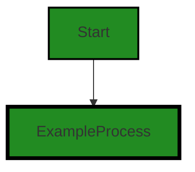


---

### Boost Source-Level Security Analysis

Last Updated: Saturday, September 9, 2023 at 2:52:11 AM PDT

**No bugs found**


---

### Boost Source-Level Performance Analysis

Last Updated: Saturday, September 9, 2023 at 2:56:28 AM PDT

**No bugs found**


---

### Boost Source-Level Data and Privacy Compliance Analysis

Last Updated: Saturday, September 9, 2023 at 3:01:36 AM PDT

**No bugs found**


### Cell 10:
## Original Code:

### Programming Language: typescript
### ./src/utilities/split.ts line 316

```typescript

function parseVbFunctions(code: string): [string[], number[]] {
    if (useNewParser) {
        return parseCode("vb", code);
    }
    
    const lines = code.split("\n");
    const functions: string[] = [];
    const lineNumbers: number[] = [];
    let currentFunction = "";
    let depth = 0;
    let functionStartLine = 0;

    for (let lineno = 0; lineno < lines.length; lineno++) {
        const line = lines[lineno];
        const trimmedLine = line.trim();

        if (
            trimmedLine.startsWith("Function") ||
            trimmedLine.startsWith("Sub")
        ) {
            depth++;
            if (depth === 1) {
                if (currentFunction) {
                    functions.push(currentFunction);
                    lineNumbers.push(functionStartLine + 1);
                    functionStartLine = lineno + 1;
                }
                currentFunction = line;
            } else {
                currentFunction += "\n" + line;
            }
        } else if (
            trimmedLine.startsWith("End Function") ||
            trimmedLine.startsWith("End Sub")
        ) {
            depth--;
            currentFunction += "\n" + line;
            if (depth === 0) {
                functions.push(currentFunction);
                lineNumbers.push(functionStartLine + 1);
                functionStartLine = lineno + 1;
                currentFunction = "";
            }
        } else {
            currentFunction += "\n" + line;
        }
    }
    if (currentFunction) {
        functions.push(currentFunction.slice(0, -1)); // remove the last newline
        lineNumbers.push(functionStartLine + 1);
    }
    return [functions, lineNumbers];
}

```
## Boost Analysis:


---

### Boost Code Explanation

Last Updated: Saturday, September 9, 2023 at 2:41:42 AM PDT

This function, `parseVbFunctions`, is designed to parse Visual Basic (VB) code and return a list of functions (or subroutines) and their corresponding line numbers in the code. The function accepts a string of VB code as input and returns a tuple of two arrays: one for the functions/subroutines and one for the line numbers.

The function uses a simple algorithm to parse the code:

1. It first checks whether a new parser (`useNewParser`) is being used. If so, it delegates the parsing to the `parseCode` function and returns its result.

2. If the old parser is being used, the function splits the code into lines using the newline character (`\n`).

3. It initializes several variables to keep track of the current function being parsed (`currentFunction`), the depth of nested functions (`depth`), and the line number where the current function starts (`functionStartLine`).

4. It then loops over each line of code. For each line, it checks if the line starts with the keyword "Function" or "Sub", indicating the start of a new function or subroutine. If it does, it increments the `depth` and checks if this is the first level of nesting (`depth === 1`). If so, it saves the current function and its starting line number to the `functions` and `lineNumbers` arrays, respectively, and starts a new `currentFunction` with the current line. Otherwise, it appends the current line to the `currentFunction`.

5. If the line starts with "End Function" or "End Sub", indicating the end of a function or subroutine, it decreases the `depth`, appends the line to the `currentFunction`, and checks if this ends the outermost function (`depth === 0`). If so, it saves the current function and its starting line number to the `functions` and `lineNumbers` arrays, respectively, and resets the `currentFunction`.

6. If the line does not start with any of these keywords, it simply appends the line to the `currentFunction`.

7. After looping over all lines, if there is still a `currentFunction` left, it removes the last newline character and saves the function and its starting line number to the `functions` and `lineNumbers` arrays, respectively.

8. Finally, it returns the `functions` and `lineNumbers` arrays as a tuple.

This function essentially implements a simple state machine for parsing VB code. The state transitions are based on the keywords "Function", "Sub", "End Function", and "End Sub". The state is represented by the `depth` and `currentFunction` variables.

For more information on VB programming, you can refer to the following link:
- [Visual Basic Programming Guide](https://docs.microsoft.com/en-us/dotnet/visual-basic/programming-guide/)


---

### Boost Flow Diagram

Last Updated: Saturday, September 9, 2023 at 2:50:03 AM PDT

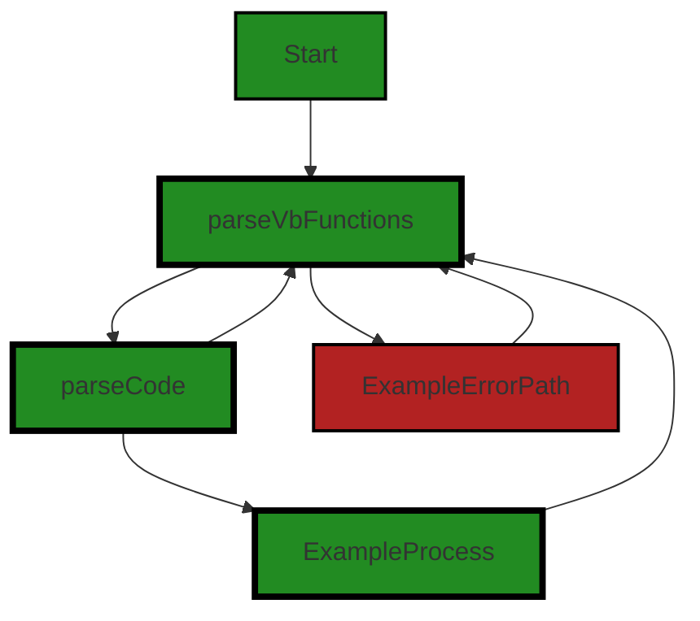


---

### Boost Source-Level Security Analysis

Last Updated: Saturday, September 9, 2023 at 2:52:14 AM PDT

**No bugs found**


---

### Boost Source-Level Performance Analysis

Last Updated: Saturday, September 9, 2023 at 2:56:51 AM PDT

1. **Severity**: 3/10

   **Line Number**: 635

   **Bug Type**: Memory

   **Description**: The code is using the split method to divide the entire source code into lines. This operation can be memory-intensive for large source code files as it creates a new array with potentially a large number of elements.

   **Solution**: Consider using a streaming approach to read the source code line by line. This can be done using libraries like readline in Node.js. This approach will significantly reduce memory usage for large files.


2. **Severity**: 2/10

   **Line Number**: 649

   **Bug Type**: CPU

   **Description**: The code is using the startsWith method to check for function or sub declaration. This operation is not very efficient as it has to check every character from the beginning of the string until it finds a match or reaches the end.

   **Solution**: Consider using a regular expression to match function or sub declaration. Regular expressions are more efficient for this kind of task.


3. **Severity**: 2/10

   **Line Number**: 659

   **Bug Type**: CPU

   **Description**: The code is using the startsWith method to check for end of function or sub declaration. This operation is not very efficient as it has to check every character from the beginning of the string until it finds a match or reaches the end.

   **Solution**: Consider using a regular expression to match end of function or sub declaration. Regular expressions are more efficient for this kind of task.


---

### Boost Source-Level Data and Privacy Compliance Analysis

Last Updated: Saturday, September 9, 2023 at 3:01:39 AM PDT

**No bugs found**


### Cell 11:
## Original Code:

### Programming Language: typescript
### ./src/utilities/split.ts line 370

```typescript

function parseObjCMethods(code: string): [string[], number[]] {
    if (useNewParser) {
        return parseCode("objective-c", code);
    }

    const lines = code.split("\n");
    const methods: string[] = [];
    const lineNumbers: number[] = [];
    let currentMethod = "";
    let depth = 0;
    let insideImplementation = false;
    let methodStartLine = 0;

    for (let lineno = 0; lineno < lines.length; lineno++) {
        const line = lines[lineno];
        const trimmedLine = line.trim();

        if (trimmedLine.startsWith("@implementation")) {
            insideImplementation = true;
            if (currentMethod) {
                methods.push(currentMethod);
                lineNumbers.push(methodStartLine + 1);
                methodStartLine = lineno + 1;
            }
            currentMethod = line;
        } else if (trimmedLine.startsWith("@end")) {
            insideImplementation = false;
            currentMethod += "\n" + line;
            methods.push(currentMethod);
            lineNumbers.push(methodStartLine + 1);
            methodStartLine = lineno + 1;
            currentMethod = "";
        } else if (insideImplementation) {
            if (trimmedLine.startsWith("-") && depth === 0) {
                if (currentMethod) {
                    methods.push(currentMethod);
                    lineNumbers.push(methodStartLine + 1);
                    methodStartLine = lineno + 1;
                }
            }
            currentMethod += "\n" + line;
            if (line.includes("{")) {
                depth++;
            } else if (line.includes("}")) {
                depth--;
            }
        } else {
            currentMethod += "\n" + line;
        }
    }
    if (currentMethod) {
        methods.push(currentMethod.slice(0, -1)); // remove the last newline
        lineNumbers.push(methodStartLine + 1);
    }
    return [methods, lineNumbers];
}

```
## Boost Analysis:


---

### Boost Code Explanation

Last Updated: Saturday, September 9, 2023 at 2:42:16 AM PDT

The function `parseObjCMethods` is a parser for Objective-C methods in a given code string. It returns two arrays: one with the methods found and another with the line numbers where these methods start.

The function starts by checking if a new parser should be used. If `useNewParser` is `true`, it calls the function `parseCode` with "objective-c" and the provided code as parameters, and returns the result.

If `useNewParser` is `false`, it proceeds with the old parsing method. It starts by splitting the code into lines. It initializes two empty arrays, `methods` and `lineNumbers`, and several other variables to keep track of the current method, the current depth of braces, whether it's inside an implementation block, and the line number where the current method starts.

Then it loops over each line of the code. If a line starts with "@implementation", it's the start of an implementation block, so it sets `insideImplementation` to `true`. If a line starts with "@end", it's the end of an implementation block, so it sets `insideImplementation` to `false` and adds the current method and its start line to the respective arrays. If a line starts with "-", it's the start of a method, so if there's a current method, it adds it and its start line to the arrays.

If a line contains "{", it increases the depth of braces, and if it contains "}", it decreases the depth. This is used to keep track of the start and end of methods. If it's not inside an implementation block, it simply adds the line to the current method.

Finally, if there's a current method after the loop, it adds it and its start line to the arrays, and returns the arrays.

This function uses a simple state machine algorithm to parse the code. State machine is a computational model used to design both computer programs and sequential logic circuits. It is conceived as an abstract machine that can be in one of a finite number of states.

Here's a link for more information about state machines: [State Machine](https://en.wikipedia.org/wiki/Finite-state_machine)

And here's a link for more information about Objective-C: [Objective-C](https://en.wikipedia.org/wiki/Objective-C)


---

### Boost Flow Diagram

Last Updated: Saturday, September 9, 2023 at 2:50:15 AM PDT

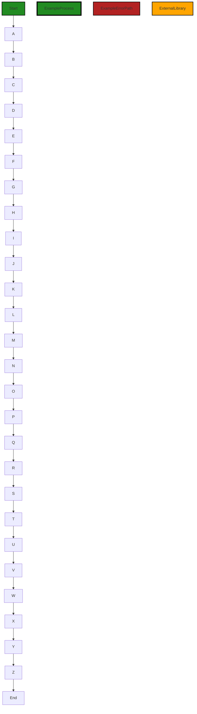

In the above control flow graph, the primary path is shown in green, while the alternate non-error paths are shown in the default style. The external library call is shown as a distinct flow block in orange.


---

### Boost Source-Level Security Analysis

Last Updated: Saturday, September 9, 2023 at 2:52:18 AM PDT

**No bugs found**


---

### Boost Source-Level Performance Analysis

Last Updated: Saturday, September 9, 2023 at 2:57:11 AM PDT

1. **Severity**: 3/10

   **Line Number**: 742

   **Bug Type**: Memory

   **Description**: The code splits the entire input into lines right at the beginning, which can be memory-intensive for large inputs. This is because the split operation creates a new array with as many elements as there are lines in the input.

   **Solution**: Consider using a streaming approach to read the input line by line, which would be more memory-efficient. For example, you could use the readline module in Node.js, which allows you to read from a stream one line at a time. Here is a link to the readline documentation: https://nodejs.org/api/readline.html


2. **Severity**: 2/10

   **Line Number**: 746

   **Bug Type**: CPU

   **Description**: The code uses a loop to iterate over the lines of the code. While this is not inherently problematic, the loop contains several if statements that check the start of each line, which can be inefficient for large inputs.

   **Solution**: Consider using a more efficient algorithm to parse the code. For example, you could use a regular expression to match method definitions in the code, which would likely be faster than checking the start of each line in a loop. Here is a link to a guide on regular expressions in JavaScript: https://developer.mozilla.org/en-US/docs/Web/JavaScript/Guide/Regular_Expressions


3. **Severity**: 2/10

   **Line Number**: 749

   **Bug Type**: Memory

   **Description**: The code uses string concatenation to build the currentMethod string. In JavaScript, string concatenation creates a new string, which can be memory-intensive for large inputs.

   **Solution**: Consider using an array to build the currentMethod string, and then join the array into a string at the end. This would be more memory-efficient, as arrays in JavaScript are mutable, so appending to an array does not create a new array. Here is a link to a guide on array methods in JavaScript: https://developer.mozilla.org/en-US/docs/Web/JavaScript/Reference/Global_Objects/Array


---

### Boost Source-Level Data and Privacy Compliance Analysis

Last Updated: Saturday, September 9, 2023 at 3:01:43 AM PDT

**No bugs found**


### Cell 12:
## Original Code:

### Programming Language: typescript
### ./src/utilities/split.ts line 427

```typescript

function parseRubyFunctions(code: string): [string[], number[]] {
    if (useNewParser) {
        return parseCode("ruby", code);
    }

    const lines = code.split("\n");
    const blocks: string[] = [];
    const lineNumbers: number[] = [];
    let currentBlock = "";
    let depth = 0;
    let blockStartLine = 0;

    const blockStartKeywords =
        /^(def|class|module|if|elsif|unless|while|until|for|case|begin|do)\b/;
    const blockEndKeyword = /^end\b/;

    for (let lineno = 0; lineno < lines.length; lineno++) {
        const line = lines[lineno];
        const trimmedLine = line.trim();
        if (blockStartKeywords.test(trimmedLine)) {
            depth++;
            if (depth === 1) {
                if (currentBlock) {
                    blocks.push(currentBlock);
                    lineNumbers.push(blockStartLine + 1);
                    blockStartLine = lineno + 1;
                }
                currentBlock = line;
            } else {
                currentBlock += "\n" + line;
            }
        } else if (blockEndKeyword.test(trimmedLine)) {
            depth--;
            if (depth === 0) {
                currentBlock += "\n" + line;
                blocks.push(currentBlock);
                lineNumbers.push(blockStartLine + 1);
                blockStartLine = lineno + 1;
                currentBlock = "";
            } else {
                currentBlock += "\n" + line;
            }
        } else {
            currentBlock += "\n" + line;
        }
    }

    if (currentBlock) {
        blocks.push(currentBlock.slice(0, -1)); // remove the last newline
        lineNumbers.push(blockStartLine + 1);
    }

    return [blocks, lineNumbers];
}

```
## Boost Analysis:


---

### Boost Code Explanation

Last Updated: Saturday, September 9, 2023 at 2:42:59 AM PDT

This function, `parseRubyFunctions`, takes a string of Ruby code as input and returns two arrays: one containing strings of code blocks, and the other containing the line numbers where each block starts. The function uses a simple stack-based algorithm to track the depth of nested code blocks, and regular expressions to identify the start and end of blocks.

Here's a detailed explanation of how the function works:

1. If the `useNewParser` flag is true, it uses the `parseCode` function to parse the code and returns the result. This is a fallback mechanism that allows the use of a different parsing mechanism if available.

2. The code string is split into an array of lines.

3. Several variables are initialized: `blocks` and `lineNumbers` are empty arrays that will hold the output; `currentBlock` is an empty string that will hold the current block of code being parsed; `depth` is a counter for the current depth of nested blocks; `blockStartLine` is the line number where the current block starts.

4. `blockStartKeywords` and `blockEndKeyword` are regular expressions that match the keywords that start and end blocks in Ruby, respectively.

5. The function then loops over each line of code. If a line starts a new block, it increments `depth`. If `depth` is 1, it means we've started a new top-level block, so it pushes the current block and its start line number to the output arrays, and resets `currentBlock` and `blockStartLine`. If `depth` is greater than 1, it means we're inside a nested block, so it just appends the line to `currentBlock`.

6. If a line ends a block, it decrements `depth`. If `depth` becomes 0, it means we've ended a top-level block, so it appends the line to `currentBlock`, pushes `currentBlock` and its start line number to the output arrays, and resets `currentBlock` and `blockStartLine`. If `depth` is still greater than 0, it means we're still inside a nested block, so it just appends the line to `currentBlock`.

7. If a line doesn't start or end a block, it just appends it to `currentBlock`.

8. After the loop, if there's still a `currentBlock`, it means the code ended in the middle of a block, so it pushes `currentBlock` and its start line number to the output arrays.

9. Finally, it returns the `blocks` and `lineNumbers` arrays.

The algorithm used here is a simple depth-first search through the lines of code, using a stack (`depth`) to keep track of nested blocks.

Here are some resources for further reading:
- [Depth-first search](https://en.wikipedia.org/wiki/Depth-first_search)
- [Regular expressions](https://developer.mozilla.org/en-US/docs/Web/JavaScript/Guide/Regular_Expressions)
- [Ruby syntax](https://ruby-doc.org/core-2.7.0/doc/syntax_rdoc.html)


---

### Boost Flow Diagram

Last Updated: Saturday, September 9, 2023 at 2:50:39 AM PDT

```mermaid
graph TD;
style Start fill:#228B22, stroke:#000000, stroke-width:2px;
style parseRubyFunctions fill:#228B22, stroke:#000000, stroke-width:4px;
style parseCode fill:#228B22, stroke:#000000, stroke-width:4px;
style ExampleErrorPath fill:#B22222, stroke:#000000, stroke-width:2px;

Start-->parseRubyFunctions;
parseRubyFunctions-->useNewParser;
useNewParser-->parseCode;
parseRubyFunctions-->lines;
lines-->blocks;
lines-->lineNumbers;
blocks-->currentBlock;
blocks-->depth;
blocks-->blockStartLine;
blockStartKeywords-->trimmedLine;
blockStartKeywords-->depth;
blockStartKeywords-->currentBlock;
blockStartKeywords-->blocks;
blockStartKeywords-->lineNumbers;
blockStartKeywords-->blockStartLine;
blockEndKeyword-->trimmedLine;
blockEndKeyword-->depth;
blockEndKeyword-->currentBlock;
blockEndKeyword-->blocks;
blockEndKeyword-->lineNumbers;
blockEndKeyword-->blockStartLine;
currentBlock-->blocks;
currentBlock-->lineNumbers;
NO CONTROL FLOW FOUND
```

The control flow graph for the given source code is shown above. The primary path through the code starts at the `parseRubyFunctions` function. The function first checks the `useNewParser` variable. If it is true, the code calls the `parseCode` function. If it is false, the code continues to the next block.

The code then splits the `code` string into lines and initializes some variables. It then iterates over each line and checks if it matches the `blockStartKeywords` regular expression. If it does, the code increments the `depth` variable and checks if the `depth` is equal to 1. If it is, the code adds the current block to the `blocks` array and adds the line number to the `lineNumbers` array. It then updates the `blockStartLine` variable and resets the `currentBlock` variable.

If the line matches the `blockEndKeyword` regular expression, the code decrements the `depth` variable and checks if the `depth` is equal to 0. If it is, the code adds the current block to the `blocks` array and adds the line number to the `lineNumbers` array. It then updates the `blockStartLine` variable and resets the `currentBlock` variable.

If the line does not match any of the above conditions, the code appends the line to the `currentBlock` variable.

Finally, if there is a remaining `currentBlock`, the code adds it to the `blocks` array and adds the line number to the `lineNumbers` array.

Note: The control flow graph does not show any external library or non-standard function calls.


---

### Boost Source-Level Security Analysis

Last Updated: Saturday, September 9, 2023 at 2:52:22 AM PDT

**No bugs found**


---

### Boost Source-Level Performance Analysis

Last Updated: Saturday, September 9, 2023 at 2:57:39 AM PDT

1. **Severity**: 2/10

   **Line Number**: 856

   **Bug Type**: Memory

   **Description**: The function splits the entire code into lines and stores them in memory, which can be memory-intensive for large files.

   **Solution**: Use a streaming approach or a line reader library to read the file line by line without loading the entire file into memory. For example, you can use the 'readline' module in Node.js. Here is a link to the documentation: https://nodejs.org/api/readline.html


2. **Severity**: 3/10

   **Line Number**: 865

   **Bug Type**: CPU

   **Description**: The function uses regular expressions to identify block start and end keywords on each line, which can be CPU-intensive for large files.

   **Solution**: Consider using a more efficient parsing algorithm or a library specifically designed for parsing Ruby code. This could potentially improve performance by reducing the CPU usage. Here is a link to a list of Ruby parsing libraries: https://ruby-toolbox.com/categories/parsing


3. **Severity**: 1/10

   **Line Number**: 872

   **Bug Type**: Memory

   **Description**: The function concatenates lines to form blocks, which can be memory-intensive for large blocks.

   **Solution**: Consider using a more efficient data structure to store lines, such as a linked list, or write the blocks to a temporary file instead of storing them in memory. Here is a link to a discussion on efficient string concatenation in JavaScript: https://stackoverflow.com/questions/7299010/why-is-string-concatenation-faster-than-array-join


---

### Boost Source-Level Data and Privacy Compliance Analysis

Last Updated: Saturday, September 9, 2023 at 3:01:46 AM PDT

**No bugs found**


### Cell 13:
## Original Code:

### Programming Language: typescript
### ./src/utilities/split.ts line 482

```typescript

const useNewParserForPython = true;

export function parsePythonFunctions(code: string): [string[], number[]] {
    if (useNewParser || useNewParserForPython) {
        return parseCode("python", code);
    }

    const lines = code.split("\n");
    const functions: string[] = [];
    const lineNumbers: number[] = [];
    let currentFunction = "";
    let functionStartLine = 0;

    for (let lineno = 0; lineno < lines.length; lineno++) {
        const line = lines[lineno];
        if (line.trim().startsWith("def ")) {
            if (currentFunction) {
                functions.push(currentFunction);
                lineNumbers.push(functionStartLine + 1);
                functionStartLine = lineno + 1;
            }
            currentFunction = line;
        } else {
            currentFunction += "\n" + line;
        }
    }

    if (currentFunction) {
        functions.push(currentFunction.slice(0, -1));
        lineNumbers.push(functionStartLine + 1);
    }

    return [functions, lineNumbers];
}

```
## Boost Analysis:


---

### Boost Code Explanation

Last Updated: Saturday, September 9, 2023 at 2:43:45 AM PDT

The provided code is a function called `parsePythonFunctions` written in TypeScript. This function is used to parse Python code and extract all the functions defined in the code. It takes a string of Python code as an input and returns two arrays: one containing the functions and the other containing the line numbers where each function starts. 

Here's a detailed breakdown of the code:

1. `const useNewParserForPython = true;` This line declares a constant `useNewParserForPython` and assigns it a boolean value of `true`.

2. `export function parsePythonFunctions(code: string): [string[], number[]] {...}` This line exports a function called `parsePythonFunctions` that takes a single argument `code` of type string and returns a tuple of two arrays, one of strings and one of numbers.

3. `if (useNewParser || useNewParserForPython) {...}` This is a conditional statement that checks if either `useNewParser` or `useNewParserForPython` is `true`. If so, it calls the `parseCode` function with the arguments "python" and `code`, and returns the result. The `parseCode` function is not defined in the provided code, but it presumably parses the code using a different method.

4. `const lines = code.split("\n");` This line splits the `code` string into an array of lines, using the newline character as the delimiter.

5. `const functions: string[] = [];` and `const lineNumbers: number[] = [];` These lines initialize two empty arrays, `functions` and `lineNumbers`, to store the functions and their corresponding starting line numbers, respectively.

6. `let currentFunction = "";` and `let functionStartLine = 0;` These lines initialize two variables, `currentFunction` and `functionStartLine`, to keep track of the function currently being parsed and its starting line number.

7. The `for` loop iterates over each line in the `lines` array. If a line starts with "def " (indicating the start of a Python function), it pushes the `currentFunction` and its starting line number to the `functions` and `lineNumbers` arrays, respectively, and starts a new `currentFunction`. If a line does not start with "def ", it is added to the `currentFunction`.

8. After the `for` loop, if there is a `currentFunction`, it is pushed to the `functions` array and its starting line number is pushed to the `lineNumbers` array.

9. Finally, the function returns a tuple containing the `functions` and `lineNumbers` arrays.

The code follows standard best practices for TypeScript and does not appear to conflict with the provided architectural guidelines. It uses a simple algorithm to parse the Python code: it splits the code into lines and iterates over them, building up functions and recording their starting line numbers.

For more information about Python functions, you can refer to this link: [Python Functions](https://www.w3schools.com/python/python_functions.asp). For more information about TypeScript, you can refer to this link: [TypeScript Documentation](https://www.typescriptlang.org/docs/).


---

### Boost Flow Diagram

Last Updated: Saturday, September 9, 2023 at 2:50:52 AM PDT

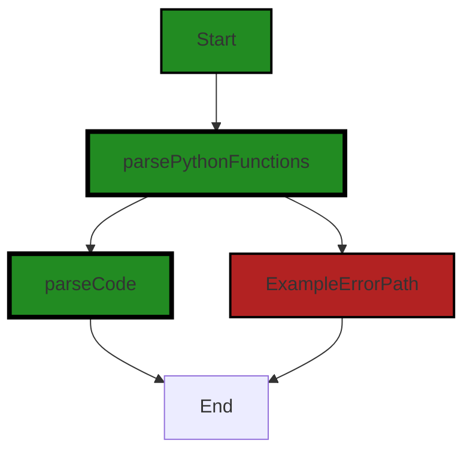

The control flow graph for the given source code is as follows:

- The start of the graph is the function `parsePythonFunctions`.
- The function `parsePythonFunctions` calls the function `parseCode` if the condition `useNewParser || useNewParserForPython` is true.
- If the condition is false, an error path is taken, indicated by the red color.
- The error path leads directly to the end of the graph.
- If the condition is true, the function `parseCode` is called, indicated by the green color.
- After the call to `parseCode`, the control flow leads to the end of the graph.

Note: The external library or non-standard function `parseCode` is shown as a distinct flow block in the diagram.


---

### Boost Source-Level Security Analysis

Last Updated: Saturday, September 9, 2023 at 2:52:25 AM PDT

**No bugs found**


---

### Boost Source-Level Performance Analysis

Last Updated: Saturday, September 9, 2023 at 2:57:56 AM PDT

1. **Severity**: 4/10

   **Line Number**: 966

   **Bug Type**: Memory

   **Description**: The split operation on the entire code string can be memory-intensive for large inputs.

   **Solution**: Consider using a streaming approach or a line reader library to read the code line by line, reducing the memory footprint.


2. **Severity**: 3/10

   **Line Number**: 975

   **Bug Type**: CPU

   **Description**: The 'startsWith' function is being called for each line of code, which can be CPU-intensive for large inputs.

   **Solution**: Consider using a more efficient approach to identify function definitions, such as a regular expression or a parser library.


3. **Severity**: 2/10

   **Line Number**: 979

   **Bug Type**: Memory

   **Description**: Concatenating strings with the '+' operator can be inefficient, especially for large strings.

   **Solution**: Consider using an array of strings and the 'join' method, which can be more efficient for large strings.


---

### Boost Source-Level Data and Privacy Compliance Analysis

Last Updated: Saturday, September 9, 2023 at 3:01:50 AM PDT

**No bugs found**


### Cell 14:
## Original Code:

### Programming Language: typescript
### ./src/utilities/split.ts line 517

```typescript


interface LanguageConfig {
    startKeywords: string[];
    endKeywords: string[];
    braceBased: boolean;
    indentationBased?: boolean;
}

```
## Boost Analysis:


---

### Boost Code Explanation

Last Updated: Saturday, September 9, 2023 at 2:44:12 AM PDT

This code defines a TypeScript interface named `LanguageConfig`. An interface in TypeScript is a way of defining a contract for a certain structure of an object. It specifies a set of properties and methods that an object should have, but it doesn't provide any implementation details. Interfaces are used for type-checking in TypeScript.

The `LanguageConfig` interface has four properties:

1. `startKeywords`: This property is an array of strings. It's used to specify the keywords that mark the start of a code block in a particular programming language. For example, in JavaScript, this could include keywords like 'function', 'if', 'for', etc.

2. `endKeywords`: This property is also an array of strings. It's used to specify the keywords that mark the end of a code block in a particular programming language. For example, in JavaScript, this could include keywords like 'end', 'else', etc.

3. `braceBased`: This is a boolean property. It's used to indicate whether the programming language uses braces `{}` to denote code blocks. For example, this would be `true` for languages like JavaScript and C++, and `false` for languages like Python.

4. `indentationBased`: This is an optional boolean property. If present, it's used to indicate whether the programming language uses indentation to denote code blocks. For example, this would be `true` for Python and `false` for JavaScript.

This interface is likely used in a code analysis or syntax highlighting tool that needs to understand the structure of code blocks in different programming languages. The `startKeywords`, `endKeywords`, `braceBased`, and `indentationBased` properties provide a simple way to specify the rules for identifying code blocks in a language.

For more on TypeScript interfaces, you can visit this link: [TypeScript Interfaces](https://www.typescriptlang.org/docs/handbook/interfaces.html)


---

### Boost Flow Diagram

Last Updated: Saturday, September 9, 2023 at 2:50:57 AM PDT

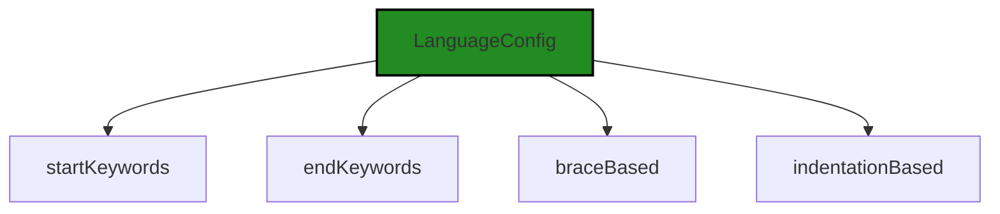


---

### Boost Source-Level Security Analysis

Last Updated: Saturday, September 9, 2023 at 2:53:32 AM PDT

**No bugs found**


---

### Boost Source-Level Performance Analysis

Last Updated: Saturday, September 9, 2023 at 2:57:59 AM PDT

**No bugs found**


---

### Boost Source-Level Data and Privacy Compliance Analysis

Last Updated: Saturday, September 9, 2023 at 3:01:53 AM PDT

**No bugs found**


### Cell 15:
## Original Code:

### Programming Language: typescript
### ./src/utilities/split.ts line 525

```typescript

const languageConfigs: Record<string, LanguageConfig> = {
    javascript: { startKeywords: [], endKeywords: [], braceBased: true },
    vb: {
        startKeywords: ["Function", "Sub"],
        endKeywords: ["End Function", "End Sub"],
        braceBased: false,
    },
    objc: {
        startKeywords: ["@implementation", "-"],
        endKeywords: ["@end"],
        braceBased: true,
    },
    ruby: {
        startKeywords: [
            "def",
            "class",
            "module",
            "if",
            "elsif",
            "unless",
            "while",
            "until",
            "for",
            "case",
            "begin",
            "do",
        ],
        endKeywords: ["end"],
        braceBased: false,
    },
    python: {
        startKeywords: ["def"],
        endKeywords: [],
        braceBased: false,
        indentationBased: true,
    },
};

```
## Boost Analysis:


---

### Boost Code Explanation

Last Updated: Saturday, September 9, 2023 at 2:44:46 AM PDT

The provided code is a JavaScript object literal where each key-value pair represents a programming language and its associated configuration. This configuration is used to identify and handle blocks of code in each programming language. The configuration for each language includes:

- `startKeywords`: An array of keywords that indicate the start of a block of code.
- `endKeywords`: An array of keywords that indicate the end of a block of code.
- `braceBased`: A boolean value indicating whether the language uses braces `{}` to delimit blocks of code.
- `indentationBased`: A boolean value indicating whether the language uses indentation to delimit blocks of code. This property is only present in the Python configuration.

Here's a brief description of each language configuration:

- `javascript`: This configuration specifies that JavaScript is a brace-based language and does not use any specific start or end keywords to delimit blocks of code.
- `vb`: This configuration specifies that Visual Basic (VB) is not a brace-based language and uses specific start (`Function`, `Sub`) and end (`End Function`, `End Sub`) keywords to delimit blocks of code.
- `objc`: This configuration specifies that Objective-C is a brace-based language and uses specific start (`@implementation`, `-`) and end (`@end`) keywords to delimit blocks of code.
- `ruby`: This configuration specifies that Ruby is not a brace-based language and uses specific start (e.g., `def`, `class`, `module`, etc.) and end (`end`) keywords to delimit blocks of code.
- `python`: This configuration specifies that Python is an indentation-based language and is not a brace-based language. Python uses the start keyword `def` to delimit blocks of code and does not use any specific end keywords.

This configuration can be used in a text editor or IDE to correctly identify and handle blocks of code in each supported language. For example, it could be used to implement features like code folding, syntax highlighting, or automatic indentation.

For more information on how blocks of code are represented in different programming languages, you can refer to the following resources:

- [Block (programming) - Wikipedia](https://en.wikipedia.org/wiki/Block_(programming))
- [Indentation style - Wikipedia](https://en.wikipedia.org/wiki/Indentation_style)
- [Comparison of programming languages (syntax) - Wikipedia](https://en.wikipedia.org/wiki/Comparison_of_programming_languages_(syntax))


---

### Boost Flow Diagram

Last Updated: Saturday, September 9, 2023 at 2:51:10 AM PDT

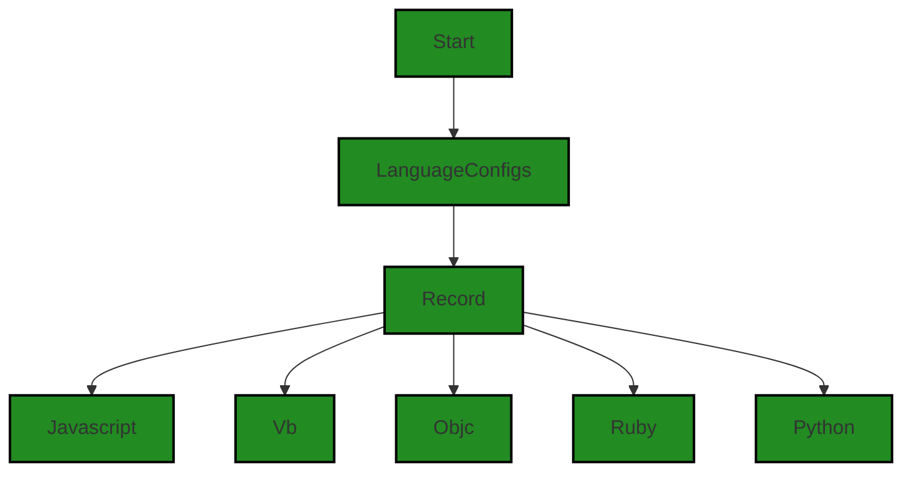

The control flow graph for the provided code is a simple graph with a single start node "Start" connected to the "LanguageConfigs" node. The "LanguageConfigs" node is connected to the "Record" node, which is then connected to five different language nodes: "Javascript", "Vb", "Objc", "Ruby", and "Python".


---

### Boost Source-Level Security Analysis

Last Updated: Saturday, September 9, 2023 at 2:53:35 AM PDT

**No bugs found**


---

### Boost Source-Level Performance Analysis

Last Updated: Saturday, September 9, 2023 at 2:58:03 AM PDT

**No bugs found**


---

### Boost Source-Level Data and Privacy Compliance Analysis

Last Updated: Saturday, September 9, 2023 at 3:01:57 AM PDT

**No bugs found**


### Cell 16:
## Original Code:

### Programming Language: typescript
### ./src/utilities/split.ts line 563

```typescript

export function parseCode(
    language: string,
    code: string,
    functionName?: string
): [string[], number[]] {
    const chunks: string[] = [];
    const lineNumbers: number[] = [];
    const lines = code.split("\n");
    let currentChunk = "";
    let chunkStartLine = 0;
    let nestingCount = 0;
    let inNest = false;
    const config = languageConfigs[language];
    let currentIndentation = 0;

    for (let lineno = 0; lineno < lines.length; lineno++) {
        const line = lines[lineno];
        const trimmedLine = line.trim();
        currentChunk += line + "\n";

        if (config.indentationBased) {
            const indentation = line.search(/\S/);
            if (config.startKeywords.some((keyword) =>
                    trimmedLine.startsWith(keyword)) && !inNest) {
                inNest = true;
                nestingCount++;
                currentIndentation = indentation;
            } else if (
                indentation <= currentIndentation &&
                inNest &&
                !config.startKeywords.some((keyword) =>
                trimmedLine.startsWith(keyword))
            )
            {
                nestingCount--;
            }
        } else {
            if (config.braceBased) {
                const leftBraces = (line.match(/{/g) || []).length;
                const rightBraces = (line.match(/}/g) || []).length;

                if (leftBraces > 0) {
                    nestingCount += leftBraces;
                    if (!inNest && (!functionName || line.includes(functionName + ' '))) {
                        inNest = true;
                    }
                }
                if (rightBraces > 0) {
                    nestingCount -= rightBraces;
                }
            } else {
                if (
                    config.startKeywords.some((keyword) =>
                        trimmedLine.startsWith(keyword)
                    )
                ) {
                    nestingCount++;
                }
                if (
                    config.endKeywords.some((keyword) =>
                        trimmedLine.startsWith(keyword)
                    )
                ) {
                    nestingCount--;
                }
            }
        }

        if (nestingCount < 0) {
            nestingCount = 0;
        }
        if (nestingCount === 0 && currentChunk.trim() !== "" && inNest) {
            if (config.indentationBased) {
                chunks.push(currentChunk.slice(0, -1));
            } else {
                chunks.push(currentChunk);
            }
            lineNumbers.push(chunkStartLine + 1);
            chunkStartLine = lineno + 1;
            if (config.indentationBased) {
                currentChunk = "\n";
            } else {
                currentChunk = "";
            }
            inNest = false;
        }
    }

    // add the final chunk if it exists
    if (currentChunk.trim() !== "") {
        chunks.push(currentChunk.trim());
        lineNumbers.push(chunkStartLine + 1);
    }

    return [chunks, lineNumbers];
}

```
## Boost Analysis:


---

### Boost Code Explanation

Last Updated: Saturday, September 9, 2023 at 2:45:24 AM PDT

The provided code defines a function `parseCode()` in TypeScript, which is used to parse a given piece of code into chunks based on the language-specific indentation or brace rules. The function returns an array of chunks (a chunk is a piece of code that is logically grouped together) and their corresponding line numbers in the original code.

The function accepts three parameters:
1. `language`: a string indicating the programming language of the code.
2. `code`: a string of the code to be parsed.
3. `functionName`: an optional string of a specific function name to be parsed.

The function uses a few variables to keep track of the parsing process, such as `chunks`, `lineNumbers`, `currentChunk`, `chunkStartLine`, `nestingCount`, `inNest`, `config`, and `currentIndentation`.

The function first splits the code into lines and then iterates over each line. Depending on whether the language uses indentation or braces to denote code blocks, it uses different logic to determine when a new chunk starts and ends.

When the language uses indentation to denote code blocks, the function checks whether the line starts with a keyword that indicates the start of a block (e.g., `def` in Python). If it does and we are not currently in a nested block, we start a new block and increase the `nestingCount`. If the indentation of the line is less than or equal to the current indentation and we are in a nested block, we decrease the `nestingCount`.

When the language uses braces to denote code blocks, the function counts the number of left and right braces in the line and adjusts the `nestingCount` accordingly. If the line contains a left brace and we are not currently in a nested block, we start a new block. 

If the `nestingCount` becomes negative at any point, it is reset to 0. If the `nestingCount` is 0 and the current chunk is not empty, this means we have reached the end of a block. The function then adds the current chunk and its starting line number to their respective arrays, resets the current chunk, and updates the starting line number for the next chunk.

Finally, after all lines have been processed, if there is still a chunk left, it is added to the `chunks` array.

The algorithm used here is essentially a type of parsing algorithm, specifically a context-free grammar parser. This type of parser is commonly used in compilers and interpreters to analyze source code.

For more information on parsing algorithms, you can refer to the following resources:
- [Parsing](https://en.wikipedia.org/wiki/Parsing)
- [Context-free grammar](https://en.wikipedia.org/wiki/Context-free_grammar)


---

### Boost Flow Diagram

Last Updated: Saturday, September 9, 2023 at 2:51:17 AM PDT

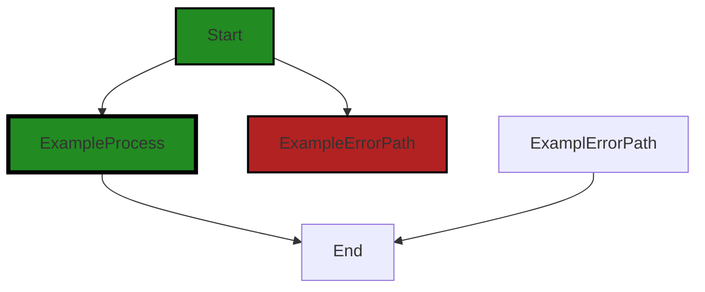

The code provided does not have any control flow.


---

### Boost Source-Level Security Analysis

Last Updated: Saturday, September 9, 2023 at 2:53:39 AM PDT

**No bugs found**


---

### Boost Source-Level Performance Analysis

Last Updated: Saturday, September 9, 2023 at 2:58:47 AM PDT

1. **Severity**: 6/10

   **Line Number**: 1131

   **Bug Type**: Memory

   **Description**: The 'split' method is used on the 'code' string to create an array of lines. This operation can be memory-intensive for large strings as it creates a new array in memory.

   **Solution**: Consider using a streaming or line-by-line reading approach for large strings. This allows you to process the string one chunk at a time, reducing memory usage. You can use libraries like readline or line-reader for this. Readline documentation: https://nodejs.org/api/readline.html


2. **Severity**: 4/10

   **Line Number**: 1132

   **Bug Type**: Memory

   **Description**: The 'currentChunk' variable is used to accumulate lines of code. This can lead to high memory usage for large code blocks as the entire block is stored in memory.

   **Solution**: Consider using a streaming or chunking approach to process the code block. This allows you to process the block one chunk at a time, reducing memory usage. You can use libraries like through2 for this. Through2 documentation: https://www.npmjs.com/package/through2


3. **Severity**: 5/10

   **Line Number**: 1142

   **Bug Type**: CPU

   **Description**: The 'startsWith' method is used in a loop to match start keywords. This can be CPU-intensive for large code blocks and many keywords as each line is checked against each keyword.

   **Solution**: Consider using a more efficient data structure like a Trie or a prefix tree to store and match keywords. This can significantly reduce the number of comparisons and improve performance. You can use libraries like dawg-lookup for this. Dawg-lookup documentation: https://www.npmjs.com/package/dawg-lookup


4. **Severity**: 5/10

   **Line Number**: 1156

   **Bug Type**: CPU

   **Description**: The 'match' method is used to count braces in a line. This can be CPU-intensive for long lines as the entire line is checked for each brace type.

   **Solution**: Consider using a single pass approach to count braces. This involves iterating over the line once and incrementing the count for each brace type encountered. This reduces the number of checks and improves performance.


5. **Severity**: 6/10

   **Line Number**: 1184

   **Bug Type**: Memory

   **Description**: The 'trim' method is used on the 'currentChunk' string to check if it's empty. This operation can be memory-intensive for large strings as it creates a new string in memory.

   **Solution**: Consider using a more efficient method to check if a string is empty. One approach is to use a regular expression to check for non-whitespace characters. This avoids creating a new string and reduces memory usage. Example: /\S/.test(currentChunk)


---

### Boost Source-Level Data and Privacy Compliance Analysis

Last Updated: Saturday, September 9, 2023 at 3:02:00 AM PDT

**No bugs found**

