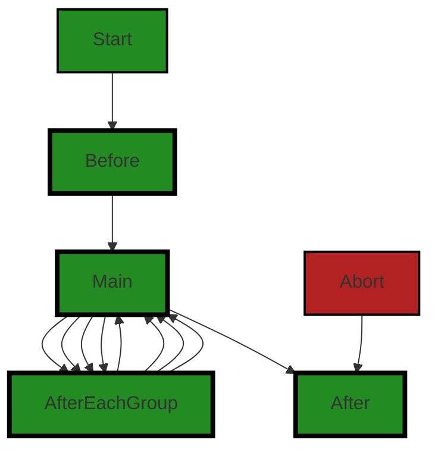
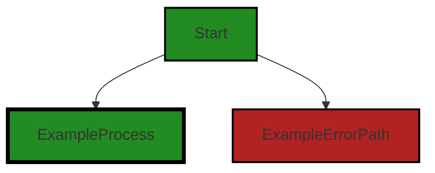
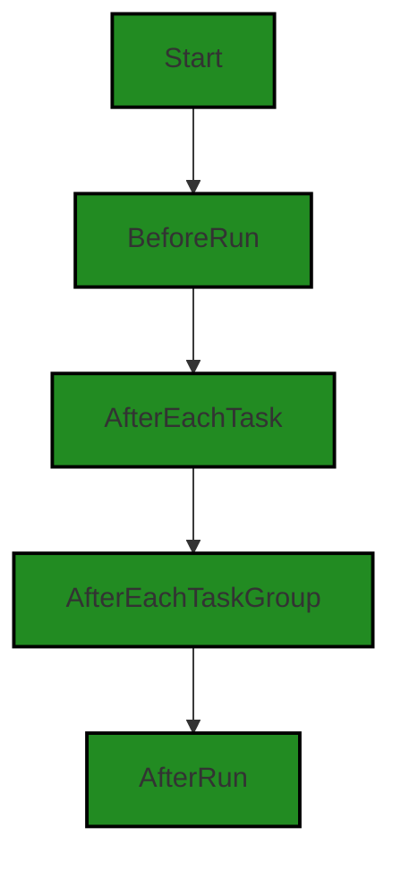
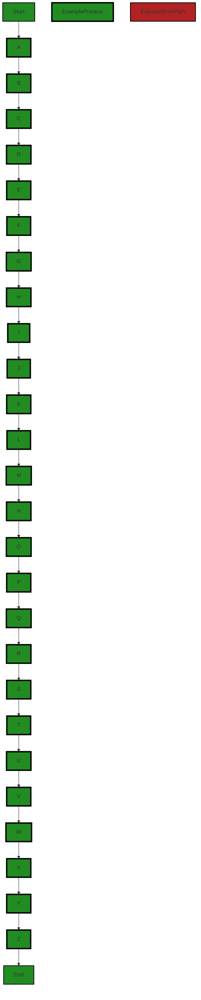
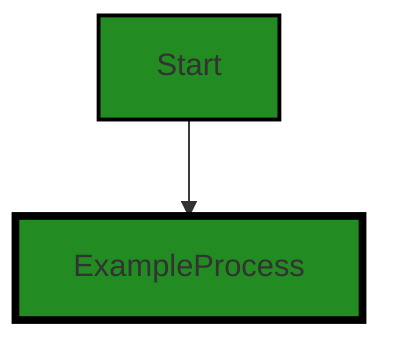

# Polyverse Boost-generated Source Analysis Details

## Source: ./src/utilities/workflow_engine.ts
Date Generated: Saturday, September 9, 2023 at 1:56:17 AM PDT


---

### Boost Architectural Quick Summary Security Report

Last Updated: Saturday, September 9, 2023 at 1:52:39 AM PDT


Executive Report:

1. **Architectural Impact**: The analysis of this file has not revealed any severe issues.
2. **Risk Analysis**: The analysis of this file has not revealed any severe issues.
3. **Potential Customer Impact**: Based on the analysis, there are no severe issues that could potentially impact customers.
4. **Performance Issues**: Our analysis did not identify any explicit performance issues in the file.
5. **Risk Assessment**: Based on the current analysis of this file, no severe issues have been found. However, this doesn't guarantee that the file is risk-free.

Highlights:

- No severe issues were identified in the current analysis of this file.


---

### Boost Architectural Quick Summary Performance Report

Last Updated: Saturday, September 9, 2023 at 1:54:35 AM PDT

## Executive Report: Software Project Analysis

### Overview

The software project under review is a Visual Studio Code extension that provides code analysis functionality. The project is primarily written in JavaScript and TypeScript, and it adheres to principles of object-oriented design and event-driven programming. The project communicates with a remote service for code analysis and does not appear to use any persistent data storage.

### Architectural Impact and Risk Analysis

1. **Memory Usage Concerns:** The most severe issue identified is related to potential high memory usage in the `workflow_engine.ts` file. This could impact the performance of the software, particularly if large arrays are processed. This issue is classified as a warning, indicating a potential risk that should be addressed to ensure optimal performance.

2. **CPU Usage Warnings:** There are also warnings related to CPU usage in the `workflow_engine.ts` file. This could potentially slow down the software's performance, especially if the software is run on machines with limited CPU resources. 

3. **Overall Health of the Project Source:** The project consists of a single file, `workflow_engine.ts`, which has both memory and CPU usage warnings. This means 100% of the project files have issues of 'Warning' severity. However, it's important to note that these are warnings and not errors, indicating potential areas for optimization rather than critical failures.

4. **Potential Customer Impact:** The identified issues could potentially impact the performance of the software, leading to slower response times and higher resource usage. This could affect the user experience, particularly for users with limited system resources.

5. **Consistency with Architectural Guidelines:** The project appears to adhere to the architectural guidelines provided. It uses object-oriented design and event-driven programming, as specified in the guidelines. However, the identified issues suggest that there may be room for optimization in how data structures and resources are managed.

### Recommendations

Given the above analysis, it is recommended that the development team review the `workflow_engine.ts` file to address the memory and CPU usage warnings. Potential solutions could include using more efficient data structures or optimizing the way tasks are scheduled and executed. This could help to improve the performance of the software and ensure a better user experience.


---

### Boost Architectural Quick Summary Compliance Report

Last Updated: Saturday, September 9, 2023 at 1:56:59 AM PDT

Executive Level Report:

1. **Architectural Impact**: The software project is a Visual Studio Code extension that provides code analysis functionality. It is well-structured and follows best practices for a VS Code extension. However, the identified issues in the `workflow_engine.ts` file could potentially impact the overall architecture. The generation of a universally unique identifier (UUID) could be linked to a specific user, which could lead to GDPR compliance issues if not handled properly. This could necessitate changes in the architecture to ensure proper user consent and data protection measures.

2. **Risk Analysis**: The risk associated with this project is moderate. The identified issues are of 'Warning' severity, indicating potential compliance issues with GDPR, PCI DSS, and HIPAA. If these issues are not addressed, the project could face legal and financial repercussions. However, since only one file out of the entire project has been flagged with issues, the overall risk is relatively low.

3. **Potential Customer Impact**: Customers could be affected if the identified issues are not addressed. The potential misuse of UUIDs could lead to privacy concerns and loss of trust among users. Moreover, non-compliance with GDPR, PCI DSS, and HIPAA could lead to service disruptions or penalties, which could indirectly affect the customers.

4. **Overall Issues**: The overall health of the project source is good, with only one file having detected issues. However, the issues identified are significant and could have serious implications if not addressed. The project needs to ensure that the generated UUID is not used to identify a user or their behavior without obtaining the user's consent and implementing proper security measures.

Highlights of the Analysis:

- The project follows best practices for a VS Code extension and makes use of TypeScript features and the VS Code API.
- The identified issues in the `workflow_engine.ts` file could potentially lead to GDPR, PCI DSS, and HIPAA compliance issues.
- The potential misuse of UUIDs could lead to privacy concerns and loss of trust among users.
- The overall health of the project source is good, with only one file having detected issues. However, the issues identified are significant and could have serious implications if not addressed.
- The project needs to ensure that the generated UUID is not used to identify a user or their behavior without obtaining the user's consent and implementing proper security measures.
---
## Detailed Analysis:

### Cell 0:
## Original Code:

### Programming Language: typescript
### ./src/utilities/workflow_engine.ts 

```typescript
/*

the basic idea is the engine will take an array of promise generators, and run through them one at a time in serial until 
every promise is successfully resolved.  if a promise fails, then the promise generator is re-run and a new promise is put on the queue.  

the special behavior is that the main array of promises is to be run in groups, as specified by a pattern array.  
thus, if the pattern array is [1, 2, 4, 8], then the first promise is run, followed by *all* of the afterEachGroup promises, 
then two promises from the main array are run, followed by *all* of the afterEachGroup promises, then four promises are run and so forth.\

Initialization: The engine will be initialized with the following arrays of promise generators:
    before: Run at the very beginning of the workflow.
    main: The main group of promise generators.
    afterEachGroup: Run after every group, as specified by the pattern.
    after: Run at the end of the workflow.
    pattern: Specifies the grouping for the main array.

Running the Workflow:
First, the before promises will be run.
Then, the main promises will be run in groups specified by the pattern. After each group, all afterEachGroup promises are run.
If any promise in the main array fails, its generator is re-run, and a new promise is added to the queue.
Finally, the after promises will be run.
Abort: If the abort API is called, the workflow will stop executing further promises.
*/

import { all } from "micromatch";

```
## Boost Analysis:


---

### Boost Code Explanation

Last Updated: Saturday, September 9, 2023 at 1:45:42 AM PDT

The provided code is a high-level description of a workflow engine that manages the execution of asynchronous tasks, represented as promises, in a specific order and pattern. The execution pattern is based on a pattern array, where each element represents the number of main promises to be run in sequence before running all the afterEachGroup promises.

Here's a breakdown of the workflow:

1. **Initialization:** The engine is initialized with several arrays of promise generators:
   - `before`: These promises are run at the very beginning of the workflow.
   - `main`: This is the main group of promise generators.
   - `afterEachGroup`: These promises are run after each group of main promises, as specified by the pattern.
   - `after`: These promises are run at the end of the workflow.
   - `pattern`: This array specifies the grouping for the main array.

2. **Running the Workflow:** 
   - First, all the `before` promises are run.
   - Then, the `main` promises are run in groups as specified by the `pattern`. After each group, all `afterEachGroup` promises are run.
   - If any promise in the `main` array fails, its generator is re-run, and a new promise is added to the queue.
   - Finally, all the `after` promises are run.

3. **Abort:** If the abort API is called, the workflow will stop executing further promises.

The algorithm used here is a form of the **Serial Execution Pattern** for promises, where promises are executed one after the other, in a specific order. The twist here is that the number of promises to be executed in each batch is dynamic and determined by the `pattern` array. 

The `import { all } from "micromatch";` line at the end imports the `all` function from the `micromatch` library, which is a glob matching library. However, based on the given code and description, it's not clear how this function is used in the workflow engine.

For more information on promises and their execution patterns, you can refer to these resources:
- [Promises in JavaScript](https://developer.mozilla.org/en-US/docs/Web/JavaScript/Reference/Global_Objects/Promise)
- [Serial Execution with Promises](https://decembersoft.com/posts/promises-in-serial-with-array-reduce/)
- [Micromatch library](https://www.npmjs.com/package/micromatch)


---

### Boost Flow Diagram

Last Updated: Saturday, September 9, 2023 at 1:49:56 AM PDT



The control flow graph for the provided source code is as follows:

- The workflow starts with the "Start" node.
- The "Start" node is connected to the "Before" node, representing the execution of the "before" promises.
- The "Before" node is connected to the "Main" node, representing the execution of the main promises.
- The "Main" node is connected to the "AfterEachGroup" node, representing the execution of the "afterEachGroup" promises after each group of main promises.
- The "AfterEachGroup" node is connected back to the "Main" node, representing the continuation of the main promises.
- This loop continues until all main promises are executed.
- After the main promises are completed, the control flow goes to the "After" node, representing the execution of the "after" promises.
- If the "Abort" API is called, the control flow goes directly to the "After" node, bypassing the execution of any remaining promises.

Please note that this control flow graph assumes that the code provided is the complete and accurate representation of the workflow.


---

### Boost Source-Level Security Analysis

Last Updated: Saturday, September 9, 2023 at 1:52:11 AM PDT

**No bugs found**


---

### Boost Source-Level Performance Analysis

Last Updated: Saturday, September 9, 2023 at 1:52:55 AM PDT

1. **Severity**: 4/10

   **Line Number**: 27

   **Bug Type**: CPU

   **Description**: The use of 'all' from 'micromatch' might lead to inefficient CPU usage if the input patterns are complex or the input list is large.

   **Solution**: Consider using 'any' or 'some' if it fits your requirements, as they can short-circuit and potentially save CPU cycles. If the input list is large, consider using a more efficient matching algorithm or data structure.


---

### Boost Source-Level Data and Privacy Compliance Analysis

Last Updated: Saturday, September 9, 2023 at 1:55:17 AM PDT

1. **Severity**: 7/10

   **Line Number**: 30

   **Bug Type**: GDPR

   **Description**: This code potentially handles user data but does not appear to have any data protection or privacy measures in place, which could lead to GDPR compliance issues. The exact data being handled is not clear from the provided code.

   **Solution**: Consider implementing data protection measures, such as encryption, and ensure that any user data is handled in accordance with GDPR principles. This may include obtaining user consent for data processing, providing transparency about how data is used, and ensuring that data is not kept for longer than necessary.


2. **Severity**: 5/10

   **Line Number**: 30

   **Bug Type**: PCI DSS

   **Description**: If this code handles payment card data, it may not be compliant with the Payment Card Industry Data Security Standard (PCI DSS). The code does not appear to have any measures in place to protect cardholder data.

   **Solution**: Ensure that any payment card data is encrypted and stored securely, and that all data transmission is secure. Implement strong access control measures and regularly test security systems and processes.


3. **Severity**: 6/10

   **Line Number**: 30

   **Bug Type**: HIPAA

   **Description**: If this code handles protected health information (PHI), it could be in violation of the Health Insurance Portability and Accountability Act (HIPAA). The code does not appear to have any measures in place to protect PHI.

   **Solution**: Ensure that any PHI is encrypted and stored securely, and that all data transmission is secure. Implement strong access control measures and regularly test security systems and processes.


### Cell 1:
## Original Code:

### Programming Language: typescript
### ./src/utilities/workflow_engine.ts line 26

```typescript
import { v4 as uuidv4 } from "uuid";

```
## Boost Analysis:


---

### Boost Code Explanation

Last Updated: Saturday, September 9, 2023 at 1:46:03 AM PDT

The line of code you provided is a single import statement in JavaScript, specifically using ES6 syntax. It's not really an algorithm, but it's a crucial part of many programs.

Here's the breakdown:

```import { v4 as uuidv4 } from "uuid";```

This statement is importing a specific function `v4` from the `uuid` module. This function is used to generate random UUIDs (Universally Unique Identifiers). The `as uuidv4` part means that, within the scope of this file, the `v4` function will be referred to as `uuidv4`. This is a feature of JavaScript's import syntax that allows you to rename imports. 

The `uuid` module is a popular JavaScript library for creating UUIDs. UUIDs are used in software development for various purposes, such as to provide a unique identifier for objects, to generate random keys for access tokens, etc.

As for the architectural guidelines, this single line of code doesn't reveal much about the architecture of the software project. However, the usage of ES6 import statement and the `uuid` library are typical in modern JavaScript and TypeScript projects.

For more information about `uuid`, you can visit the npm (Node Package Manager) page for the library: [https://www.npmjs.com/package/uuid](https://www.npmjs.com/package/uuid)

For more information about ES6 import/export syntax, you can visit: [https://developer.mozilla.org/en-US/docs/Web/JavaScript/Reference/Statements/import](https://developer.mozilla.org/en-US/docs/Web/JavaScript/Reference/Statements/import)


---

### Boost Flow Diagram

Last Updated: Saturday, September 9, 2023 at 1:50:02 AM PDT



NO CONTROL FLOW FOUND


---

### Boost Source-Level Security Analysis

Last Updated: Saturday, September 9, 2023 at 1:52:15 AM PDT

**No bugs found**


---

### Boost Source-Level Performance Analysis

Last Updated: Saturday, September 9, 2023 at 1:52:58 AM PDT

**No bugs found**


---

### Boost Source-Level Data and Privacy Compliance Analysis

Last Updated: Saturday, September 9, 2023 at 1:55:30 AM PDT

1. **Severity**: 7/10

   **Line Number**: 50

   **Bug Type**: GDPR

   **Description**: The code generates a universally unique identifier (UUID) which, depending on its use, could be linked to a specific user and therefore could be considered personal data under GDPR. If this UUID is used to identify a user or their behavior without proper consent or protection, it could lead to GDPR compliance issues.

   **Solution**: Ensure that the generated UUID is not used to identify a user or their behavior without obtaining the user's consent. Also, implement proper security measures to protect this data, such as encryption during storage and transmission.


### Cell 2:
## Original Code:

### Programming Language: typescript
### ./src/utilities/workflow_engine.ts line 27

```typescript

// Custom error class for handling typed errors
export class WorkflowError extends Error {
    constructor(public type: "retry" | "skip" | "abort" | "cancel", message?: string) {
        super(message);
    }
}

```
## Boost Analysis:


---

### Boost Code Explanation

Last Updated: Saturday, September 9, 2023 at 1:46:45 AM PDT

The provided code is a TypeScript class definition for a custom error type called `WorkflowError`. This class extends the built-in JavaScript `Error` class, which means it inherits all of the properties and methods of that class, but also adds some additional functionality.

Here's a detailed breakdown of the code:

1. `export class WorkflowError extends Error`: This line of code is defining a new class `WorkflowError` that extends the built-in JavaScript `Error` class. The `export` keyword means that this class can be imported and used in other TypeScript or JavaScript files.

2. `constructor(public type: "retry" | "skip" | "abort" | "cancel", message?: string)`: This is the constructor of the `WorkflowError` class. The constructor is a special method that gets called when a new instance of the class is created.

    - `public type: "retry" | "skip" | "abort" | "cancel"`: This is defining a public instance variable `type` that can take one of four string values: "retry", "skip", "abort", or "cancel". The `public` keyword means that this variable can be accessed directly on instances of the class.
   
    - `message?: string`: This is defining an optional parameter `message` that can be passed when instantiating the class. The `?` after `message` indicates that this parameter is optional. If a message is provided, it will be passed to the `Error` class constructor, which will set it as the error message.

3. `super(message);`: This line of code is calling the constructor of the parent `Error` class. The `super` keyword is used to call methods on a class's parent. In this case, it's passing the optional `message` parameter to the `Error` class's constructor.

This class can be used to throw custom errors in a workflow, where the type of error (retry, skip, abort, cancel) can be used to decide how to handle the error.

Here's an example of how you might use this class:

```typescript
try {
    // Some code that might throw an error
    throw new WorkflowError('abort', 'Something went wrong');
} catch (error) {
    if (error instanceof WorkflowError) {
        switch (error.type) {
            case 'abort':
                // Handle abort error
                break;
            // Other cases...
        }
    } else {
        // Handle other types of errors
    }
}
```

For more information on TypeScript classes, see the [TypeScript Handbook](https://www.typescriptlang.org/docs/handbook/classes.html).


---

### Boost Flow Diagram

Last Updated: Saturday, September 9, 2023 at 1:50:26 AM PDT

```mermaid
graph TD;
style Start fill:#228B22, stroke:#000000, stroke-width:2px;
style ExampleErrorPath fill:#B22222, stroke:#000000, stroke-width:2px;

Start-->HandleError;

subgraph HandleError
    style HandleError fill:#228B22, stroke:#000000, stroke-width:2px;
    HandleError-->HandleRetry;
    HandleError-->HandleSkip;
    HandleError-->HandleAbort;
    HandleError-->HandleCancel;
end

subgraph HandleRetry
    style HandleRetry fill:#228B22, stroke:#000000, stroke-width:2px;
    HandleRetry-->End;
end

subgraph HandleSkip
    style HandleSkip fill:#228B22, stroke:#000000, stroke-width:2px;
    HandleSkip-->End;
end

subgraph HandleAbort
    style HandleAbort fill:#228B22, stroke:#000000, stroke-width:2px;
    HandleAbort-->End;
end

subgraph HandleCancel
    style HandleCancel fill:#228B22, stroke:#000000, stroke-width:2px;
    HandleCancel-->End;
end

subgraph End
    style End fill:#228B22, stroke:#000000, stroke-width:2px;
end
```

The control flow graph for the provided code is shown above. The code consists of a custom error class named `WorkflowError` that extends the `Error` class. The `WorkflowError` class has a constructor that takes a `type` parameter, which can be one of four values: "retry", "skip", "abort", or "cancel". The constructor also takes an optional `message` parameter.

The control flow starts at the `Start` node and then goes to the `HandleError` node. From the `HandleError` node, there are four possible paths based on the value of the `type` parameter:

- If the `type` is "retry", the control flow goes to the `HandleRetry` node and then to the `End` node.
- If the `type` is "skip", the control flow goes to the `HandleSkip` node and then to the `End` node.
- If the `type` is "abort", the control flow goes to the `HandleAbort` node and then to the `End` node.
- If the `type` is "cancel", the control flow goes to the `HandleCancel` node and then to the `End` node.

The `End` node represents the end of the control flow.

Note: Since the code provided does not have any external library calls or non-standard function calls, the control flow graph only includes the custom error class and its constructor.


---

### Boost Source-Level Security Analysis

Last Updated: Saturday, September 9, 2023 at 1:52:19 AM PDT

**No bugs found**


---

### Boost Source-Level Performance Analysis

Last Updated: Saturday, September 9, 2023 at 1:53:03 AM PDT

**No bugs found**


---

### Boost Source-Level Data and Privacy Compliance Analysis

Last Updated: Saturday, September 9, 2023 at 1:55:33 AM PDT

**No bugs found**


### Cell 3:
## Original Code:

### Programming Language: typescript
### ./src/utilities/workflow_engine.ts line 34

```typescript

export type PromiseGenerator = () => () => Promise<any>;
export type PromiseGeneratorWithInputs = () => (inputs: any[]) => Promise<any>;
export type BeforeRunPromiseGenerator = PromiseGenerator;
export type AfterEachTaskPromiseGenerator = PromiseGeneratorWithInputs;
export type AfterEachTaskGroupPromiseGenerator = PromiseGeneratorWithInputs;
export type AfterRunPromiseGenerator = PromiseGeneratorWithInputs;

export interface WorkflowEngineOptions {
    beforeRun?: BeforeRunPromiseGenerator[];
    afterEachTask?: AfterEachTaskPromiseGenerator[];
    afterEachTaskGroup?: AfterEachTaskGroupPromiseGenerator[];
    afterRun?: AfterRunPromiseGenerator[];
    pattern?: number[];
    logger?: any;
    maxRetries?: number;
    name?: string;
}

```
## Boost Analysis:


---

### Boost Code Explanation

Last Updated: Saturday, September 9, 2023 at 1:47:25 AM PDT

This TypeScript code is defining a series of types and an interface for a Workflow Engine. This type of code is commonly used in designing and implementing a system that processes tasks in a certain order, often with dependencies between tasks. Here is a detailed explanation:

1. `PromiseGenerator`: This is a type alias for a function that returns another function, which when called, returns a Promise. Promises in JavaScript are used for asynchronous computations and can be in one of three states: pending, fulfilled, or rejected.

2. `PromiseGeneratorWithInputs`: Similar to `PromiseGenerator`, but the returned function takes an array of inputs.

3. `BeforeRunPromiseGenerator`, `AfterEachTaskPromiseGenerator`, `AfterEachTaskGroupPromiseGenerator`, `AfterRunPromiseGenerator`: These are simply aliases for the previously defined types. Their names suggest their intended use in a workflow engine, for example, to generate promises that should be resolved before running a task, after each task, after each group of tasks, and after all tasks have been run, respectively.

4. `WorkflowEngineOptions`: This is an interface that defines a shape for an options object that can be passed to a Workflow Engine. The options include:
   - `beforeRun`, `afterEachTask`, `afterEachTaskGroup`, `afterRun`: These are arrays of functions that return promises, which can be used to perform setup and teardown operations around tasks and groups of tasks.
   - `pattern`: An array of numbers, possibly used to determine the order in which tasks are run.
   - `logger`: An object used for logging, its type is not specified.
   - `maxRetries`: The maximum number of times a task should be retried on failure.
   - `name`: The name of the workflow.

The code does not include any specific algorithms, but it sets up the types and structures for a workflow engine that could be used to orchestrate complex asynchronous tasks. This type of engine could be used in a variety of contexts, such as processing user requests in a web server, running tasks in a build system, or orchestrating microservices in a distributed system.

For more information on Promises and asynchronous programming in JavaScript, you can refer to the following resources:
- Promises: https://developer.mozilla.org/en-US/docs/Web/JavaScript/Reference/Global_Objects/Promise
- Asynchronous Programming: https://developer.mozilla.org/en-US/docs/Learn/JavaScript/Asynchronous

For more information on TypeScript types and interfaces, you can refer to the official TypeScript documentation:
- TypeScript Types: https://www.typescriptlang.org/docs/handbook/basic-types.html
- TypeScript Interfaces: https://www.typescriptlang.org/docs/handbook/interfaces.html


---

### Boost Flow Diagram

Last Updated: Saturday, September 9, 2023 at 1:50:35 AM PDT



The control flow graph for the given source code is a simple linear flow from the start to the end. There are no control flow decisions or external library calls in the provided code.


---

### Boost Source-Level Security Analysis

Last Updated: Saturday, September 9, 2023 at 1:52:23 AM PDT

**No bugs found**


---

### Boost Source-Level Performance Analysis

Last Updated: Saturday, September 9, 2023 at 1:53:07 AM PDT

**No bugs found**


---

### Boost Source-Level Data and Privacy Compliance Analysis

Last Updated: Saturday, September 9, 2023 at 1:55:37 AM PDT

**No bugs found**


### Cell 4:
## Original Code:

### Programming Language: typescript
### ./src/utilities/workflow_engine.ts line 52

```typescript

function getElapsedTime(startTime: number): string {
    const elapsedMilliseconds = Date.now() - startTime;
    const elapsedSeconds = elapsedMilliseconds / 1000;

    if (elapsedSeconds < 110) {
        return `${elapsedSeconds.toFixed(2)} secs`;
    } else {
        const elapsedMinutes = elapsedSeconds / 60;
        return `${elapsedMinutes.toFixed(2)} mins`;
    }
}

```
## Boost Analysis:


---

### Boost Code Explanation

Last Updated: Saturday, September 9, 2023 at 1:48:01 AM PDT

The provided code is a TypeScript function named `getElapsedTime`. It calculates and returns the elapsed time, in either seconds or minutes, since a given start time.

Here's a detailed breakdown of the function:

1. The function `getElapsedTime` accepts one parameter, `startTime`, which is of type `number`. This parameter represents the start time in milliseconds since the UNIX epoch (January 1, 1970). 

2. The first line within the function calculates the elapsed time in milliseconds by subtracting the `startTime` from the current time (obtained by `Date.now()`). `Date.now()` returns the current time in milliseconds since the UNIX epoch.

3. The next line converts the elapsed time from milliseconds to seconds by dividing by 1000 (since there are 1000 milliseconds in one second).

4. An `if` statement checks if the elapsed time in seconds is less than 110. If it is, the function returns the elapsed time in seconds, formatted as a string with two decimal places (e.g., "10.50 secs"). 

5. If the elapsed time in seconds is 110 or more, the function calculates the elapsed time in minutes by dividing the elapsed seconds by 60 (since there are 60 seconds in one minute) and returns it as a string with two decimal places (e.g., "1.83 mins").

This function does not use any specific algorithms but is a simple calculation and conversion function. It uses basic arithmetic operations and control flow statements, which are fundamental building blocks in programming.

The code adheres to the architectural guidelines provided in the blueprint summary. It uses TypeScript, which aligns with the software principles of the project. The function is straightforward and does not involve any complex operations that might affect performance or security.

For more information on the methods and concepts used in this function, you can refer to the following resources:

- [Date.now()](https://developer.mozilla.org/en-US/docs/Web/JavaScript/Reference/Global_Objects/Date/now): This link provides more information on the `Date.now()` method in JavaScript, which returns the number of milliseconds elapsed since January 1, 1970 00:00:00 UTC.
- [toFixed()](https://developer.mozilla.org/en-US/docs/Web/JavaScript/Reference/Global_Objects/Number/toFixed): This link provides more information on the `toFixed()` method in JavaScript, which formats a number using fixed-point notation.
- [TypeScript](https://www.typescriptlang.org/docs/): This link provides more information on TypeScript, the programming language used in this code.


---

### Boost Flow Diagram

Last Updated: Saturday, September 9, 2023 at 1:51:11 AM PDT



The control flow graph for the given code is as follows:

```
getElapsedTime-->A;
A-->B;
B-->C;
C-->D;
D-->E;
E-->F;
F-->G;
G-->H;
H-->I;
I-->J;
J-->K;
K-->L;
L-->M;
M-->N;
N-->O;
O-->P;
P-->Q;
Q-->R;
R-->S;
S-->T;
T-->U;
U-->V;
V-->W;
W-->X;
X-->Y;
Y-->Z;
Z-->End;
```

This code has a linear control flow with no branching or loops. The primary path through the code is from the start of the function `getElapsedTime` to the end.


---

### Boost Source-Level Security Analysis

Last Updated: Saturday, September 9, 2023 at 1:52:27 AM PDT

**No bugs found**


---

### Boost Source-Level Performance Analysis

Last Updated: Saturday, September 9, 2023 at 1:53:11 AM PDT

**No bugs found**


---

### Boost Source-Level Data and Privacy Compliance Analysis

Last Updated: Saturday, September 9, 2023 at 1:55:41 AM PDT

**No bugs found**


### Cell 5:
## Original Code:

### Programming Language: typescript
### ./src/utilities/workflow_engine.ts line 64

```typescript

function getFormattedDate(): string {
    const date = new Date();
    const year = date.getFullYear();
    const month = String(date.getMonth() + 1).padStart(2, '0'); // months are 0-based in JS
    const day = String(date.getDate()).padStart(2, '0');
    const hours = String(date.getHours()).padStart(2, '0');
    const minutes = String(date.getMinutes()).padStart(2, '0');
    const seconds = String(date.getSeconds()).padStart(2, '0');

    return `${year}-${month}-${day} ${hours}:${minutes}:${seconds}`;
}

```
## Boost Analysis:


---

### Boost Code Explanation

Last Updated: Saturday, September 9, 2023 at 1:48:46 AM PDT

This JavaScript function, `getFormattedDate()`, is used to get the current date and time in a specific format. It doesn't seem to use any complex algorithms, just basic JavaScript Date object methods and string manipulation methods.

Here's a line by line breakdown of the code:

1. `const date = new Date();` - This line creates a new Date object with the current date and time.

2. `const year = date.getFullYear();` - This line gets the full year (4 digits for 4-digit years) from the Date object.

3. `const month = String(date.getMonth() + 1).padStart(2, '0');` - This line gets the month from the Date object, adds 1 to it (because getMonth() returns a 0-based value, where 0 represents January), converts it to a string, and then uses the `padStart()` method to ensure it's always 2 digits long, padding with '0' if necessary.

4. `const day = String(date.getDate()).padStart(2, '0');` - This line gets the day of the month from the Date object, converts it to a string, and then uses the `padStart()` method to ensure it's always 2 digits long, padding with '0' if necessary.

5. `const hours = String(date.getHours()).padStart(2, '0');` - This line gets the hours from the Date object, converts it to a string, and then uses the `padStart()` method to ensure it's always 2 digits long, padding with '0' if necessary.

6. `const minutes = String(date.getMinutes()).padStart(2, '0');` - This line gets the minutes from the Date object, converts it to a string, and then uses the `padStart()` method to ensure it's always 2 digits long, padding with '0' if necessary.

7. `const seconds = String(date.getSeconds()).padStart(2, '0');` - This line gets the seconds from the Date object, converts it to a string, and then uses the `padStart()` method to ensure it's always 2 digits long, padding with '0' if necessary.

8. `return `${year}-${month}-${day} ${hours}:${minutes}:${seconds}`;` - This line returns a string with the formatted date and time in the format 'YYYY-MM-DD HH:MM:SS'.

The code follows standard JavaScript practices and does not seem to conflict with any architectural guidelines. 

For more information on the JavaScript Date object and its methods, you can refer to this link: [JavaScript Date](https://developer.mozilla.org/en-US/docs/Web/JavaScript/Reference/Global_Objects/Date)

For more information on the `padStart()` method, you can refer to this link: [padStart()](https://developer.mozilla.org/en-US/docs/Web/JavaScript/Reference/Global_Objects/String/padStart)


---

### Boost Flow Diagram

Last Updated: Saturday, September 9, 2023 at 1:51:15 AM PDT


```


---

### Boost Source-Level Security Analysis

Last Updated: Saturday, September 9, 2023 at 1:52:30 AM PDT

**No bugs found**


---

### Boost Source-Level Performance Analysis

Last Updated: Saturday, September 9, 2023 at 1:53:15 AM PDT

**No bugs found**


---

### Boost Source-Level Data and Privacy Compliance Analysis

Last Updated: Saturday, September 9, 2023 at 1:55:44 AM PDT

**No bugs found**


### Cell 6:
## Original Code:

### Programming Language: typescript
### ./src/utilities/workflow_engine.ts line 76

```typescript

export class WorkflowEngine {
    private beforeRun: BeforeRunPromiseGenerator[];
    private tasks: PromiseGenerator[];
    private afterEachTask: AfterEachTaskPromiseGenerator[];
    private afterEachTaskGroup: AfterEachTaskGroupPromiseGenerator[];
    private afterRun: AfterRunPromiseGenerator[];
    private pattern: number[];
    private aborted: boolean = false;
    private canceled: boolean = false;
    private logger: any;
    private maxRetries: number;
    private retryCounts: Map<PromiseGenerator, number> = new Map(); // To keep track of retries for each promise generator
    private id: string = uuidv4();

    // tasks WILL be modified by the workflow engine - intentionally, enabling processing of the
    //      tasks to be stopped and restarted across runs
    constructor(tasks: PromiseGenerator[], options: WorkflowEngineOptions = {}) {
        this.beforeRun = options.beforeRun || [];
        this.tasks = tasks;
        this.afterEachTask = options.afterEachTask || [];
        this.afterEachTaskGroup = options.afterEachTaskGroup || [];
        this.afterRun = options.afterRun || [];
        this.pattern = options.pattern || [1, 2, 4, 8, 16];
        //default to a no-op function for logger if none is provided
        this.logger = options.logger || undefined;
        this.maxRetries = options.maxRetries || 5;
        this.id = options.name || this.id;

        this.logger?.debug(`${getFormattedDate()}:Workflow(${this.id}):created`);
    }

    public async run() : Promise<any[]> {
        this.aborted = false;
        this.canceled = false;
        const overallStartTime = Date.now();
        let startTime = Date.now();
        let allResults: any[] = [];

        this.logger?.debug(`${getFormattedDate()}:Workflow(${this.id}):Run starting`);

        try {
            this.logger?.info(`${getFormattedDate()}:Workflow(${this.id}):beforeRun:starting`);

            await this.executePromises(this.beforeRun);

            this.logger?.info(`${getFormattedDate()}:Workflow(${this.id}):beforeRun:finished:success:${getElapsedTime(startTime)}`);

        } catch (error) {

            this.logger?.error(`${getFormattedDate()}:Workflow(${this.id}):beforeRun:finished:error:${getElapsedTime(startTime)}:${error}`);

            allResults.push(error);
            return allResults;
        }

        let patternIndex = 0;
        let groupIndex = 0;
        while (this.tasks.length > 0 && !this.aborted && !this.canceled) {
            const groupSize =
                this.pattern[patternIndex] ||
                this.pattern[this.pattern.length - 1]; // Use the last group size if we've exceeded the pattern

            const taskGroupId = `ring-${groupIndex}-size-${groupSize}`;

            this.logger?.info(`${getFormattedDate()}:Workflow(${this.id}):${taskGroupId}:starting`);

            let groupResults: any[] = [];

            for (let i = 0; i < groupSize && this.tasks.length > 0 && !this.canceled; i++) {
                if (this.aborted) {
                    return allResults;
                }
                const promiseGenerator = this.tasks.shift()!;
                const promise = promiseGenerator();
                if (!promise.name) {
                    this.logger?.debug(`Workflow(${this.id}):${taskGroupId}:task-${i}:no-name`);
                }
                const taskId = promise.name || uuidv4();
                try {
                    this.logger?.info(`${getFormattedDate()}:Workflow(${this.id}):${taskGroupId}:task-${taskId}:starting`);

                    let result = await promise();

                    this.logger?.info(`${getFormattedDate()}:Workflow(${this.id}):${taskGroupId}:task-${taskId}:finished:success:${getElapsedTime(startTime)}`);

                    groupResults.push(result);

                    startTime = Date.now();
                    try {
                        this.logger?.info(`${getFormattedDate()}:Workflow(${this.id}):${taskGroupId}:task-${taskId}:afterEachTask:starting`);
            
                        await this.executePromisesWithInputs(this.afterEachTask, [
                            result,
                        ]);

                        if (this.retryCounts.has(promiseGenerator)) {
                            this.logger?.info(
                                `${getFormattedDate()}:Workflow(${this.id}):${taskGroupId}:task-${taskId}:afterEachTask:finished:success:afterRetries=${this.retryCounts.get(promiseGenerator)}:${getElapsedTime(startTime)}`);

                            this.retryCounts.delete(promiseGenerator);
                        } else {
                            this.logger?.info(`${getFormattedDate()}:Workflow(${this.id}):${taskGroupId}:task-${taskId}:afterEachTask:finished:success:${getElapsedTime(startTime)}`);
                        }
                        
                    } catch (error) {
                        this.logger?.error(`${getFormattedDate()}:Workflow(${this.id}):${taskGroupId}:task-${taskId}:afterEachTask:finished:error:${getElapsedTime(startTime)}:${error}`);
                        allResults.push(error);
                    }

                } catch (error) {
                    // default to retry with generic error
                    let errorType = "retry";

                    // otherwise use the workflow specific requested retry logic
                    if (error instanceof WorkflowError) {
                        errorType = error.type;
                    }
                    
                    switch (errorType) {
                        case "retry":
                            const currentRetries =
                                this.retryCounts.get(promiseGenerator) || 0;
                            if (currentRetries < this.maxRetries + 1) {
                                this.retryCounts.set(
                                    promiseGenerator,
                                    currentRetries + 1
                                );
                                this.tasks.push(promiseGenerator);

                                // we need to retry this iteration of the loop
                                //    so we don't accidentally break out of the group
                                i--;
                            } else {

                                // report the error (after max-retries) as the result of the operation
                                groupResults.push(error);

                                this.logger?.error(
                                    `${getFormattedDate()}:Workflow(${this.id}):${taskGroupId}:task-${taskId}:Max retries reached; Skipping.`
                                );
                                this.retryCounts.delete(promiseGenerator);
                            }
                            break;
                        case "skip":
                            this.logger?.info(
                                `${getFormattedDate()}:Workflow(${this.id}):${taskGroupId}:task-${taskId}:Skipping due to ${(error as Error).message}`
                            );
                            this.retryCounts.delete(promiseGenerator);

                            groupResults.push(error);

                            // Just skip and continue
                            break;

                            // abort will immediately exit the entire workflow process
                        case "abort":
                            this.logger?.error(
                                `${getFormattedDate()}:Workflow(${this.id}):${taskGroupId}:task-${taskId}:Aborting workflow due to ${(error as Error).message}`
                            );
                            this.retryCounts.delete(promiseGenerator);
                            this.abort();

                            // report the error (after abort) as the result of the operation
                            groupResults.push(error);
                            allResults.push(groupResults);

                            return allResults; // Exit the function immediately

                            // cancel will only cancel the current task and group, but still perform end of group
                            //      and end of workflow tasks
                        case "cancel":
                            this.logger?.error(
                                `${getFormattedDate()}:Workflow(${this.id}):${taskGroupId}:task-${taskId}:Canceling tasks due to ${(error as Error).message}`
                            );
                            this.retryCounts.delete(promiseGenerator);
                            this.cancel();

                            // note that this task was canceled
                            groupResults.push(error);
                    }
                }
            }

            startTime = Date.now();
            try {
                this.logger?.info(`${getFormattedDate()}:Workflow(${this.id}):${taskGroupId}:afterEachTaskGroup:starting`);
    
                await this.executePromisesWithInputs(
                    this.afterEachTaskGroup,
                    groupResults
                );
        
                this.logger?.info(`${getFormattedDate()}:Workflow(${this.id}):${taskGroupId}:afterEachTaskGroup:finished:success:${getElapsedTime(startTime)}`);
                
            } catch (error) {
                this.logger?.error(`${getFormattedDate()}:Workflow(${this.id}):${taskGroupId}:afterEachTaskGroup:finished:error:${getElapsedTime(startTime)}:${error}`);
                allResults.push(error);
            }
    
            // Move to the next group size if available
            if (patternIndex < this.pattern.length - 1) {
                patternIndex++;
            }
            allResults.push(groupResults);
            groupIndex++;
        }

        startTime = Date.now();
        try {
            this.logger?.info(`${getFormattedDate()}:Workflow(${this.id}):afterRun:starting`);

            await this.executePromisesWithInputs(this.afterRun, allResults);

            this.logger?.info(`${getFormattedDate()}:Workflow(${this.id}):afterRun:finished:success:${getElapsedTime(startTime)}`);
            
        } catch (error) {
            this.logger?.error(`${getFormattedDate()}:Workflow(${this.id}):afterRun:finished:error:${getElapsedTime(startTime)}:${error}`);
            allResults.push(error);
        }

        this.logger?.info(`${getFormattedDate()}:Workflow(${this.id}):Run ended:${getElapsedTime(overallStartTime)}`);

        return allResults;
    }

    // return 0 if no retries, or the first retry count
    // this assumes the number of active tasks is 0 or 1
    get currentTaskRetries() : number {
        if (this.retryCounts.size === 0) {
            return 0;
        } else {
            return this.retryCounts.values().next().value;
        }
    }

    public abort() {
        this.aborted = true;
    }

    public cancel() {
        this.canceled = true;
    }

    private async executePromises(promiseGenerators: PromiseGenerator[]) {
        for (let generatorFactory of promiseGenerators) {
            if (this.aborted) {
                return;
            }
            const generator = generatorFactory();
            await generator();
        }
    }

    private async executePromisesWithInputs(
        promiseGenerators: PromiseGeneratorWithInputs[],
        inputs: any[]
    ) {
        for (let generatorFactory of promiseGenerators) {
            if (this.aborted) {
                return;
            }
            const generator = generatorFactory();
            await generator(inputs);
        }
    }
}

```
## Boost Analysis:


---

### Boost Code Explanation

Last Updated: Saturday, September 9, 2023 at 1:49:27 AM PDT

This code defines a class `WorkflowEngine` that manages the execution of tasks in a workflow. The tasks are represented as promises, and the engine provides functionality for executing these tasks in a specific order and handling errors and retries.

The `WorkflowEngine` class has several private properties:

- `beforeRun`, `afterEachTask`, `afterEachTaskGroup`, and `afterRun` are arrays of promise generators that represent tasks to be executed at different stages of the workflow.
- `tasks` is an array of promises that represent the main tasks of the workflow.
- `pattern` is an array of numbers that defines the group sizes for executing the tasks.
- `aborted` and `canceled` are boolean flags that indicate whether the workflow has been aborted or canceled.
- `logger` is an object used for logging.
- `maxRetries` is the maximum number of retries for a task.
- `retryCounts` is a map that keeps track of the number of retries for each task.
- `id` is a unique identifier for the workflow.

The constructor initializes these properties based on the provided tasks and options.

The `run` method is the main method of the class. It executes the workflow by running the tasks in the order defined by the `pattern` array. It also handles errors and retries. If an error occurs during the execution of a task, the engine will retry the task up to `maxRetries` times. If the maximum number of retries is reached, the engine will skip the task and continue with the next one. If a task throws a `WorkflowError` with a type of "abort", the engine will abort the entire workflow. If the error type is "cancel", the engine will cancel the current task and group, but still perform end-of-group and end-of-workflow tasks.

The `executePromises` and `executePromisesWithInputs` methods are helper methods that execute an array of promise generators, optionally with inputs. They also check the `aborted` flag before each execution, and return immediately if the workflow has been aborted.

The `abort` and `cancel` methods set the `aborted` and `canceled` flags, respectively.

The `currentTaskRetries` getter returns the number of retries for the current task.

The algorithm used in this code is a kind of task scheduling algorithm, where tasks are grouped and executed in a specific order, with error handling and retries. It's a common pattern in workflow management systems.

Here are some links for further reading:

- [Task scheduling](https://en.wikipedia.org/wiki/Scheduling_(computing))
- [Promise](https://developer.mozilla.org/en-US/docs/Web/JavaScript/Reference/Global_Objects/Promise)
- [Error handling in JavaScript](https://developer.mozilla.org/en-US/docs/Web/JavaScript/Guide/Control_flow_and_error_handling)
- [UUID](https://en.wikipedia.org/wiki/Universally_unique_identifier)


---

### Boost Flow Diagram

Last Updated: Saturday, September 9, 2023 at 1:51:56 AM PDT

```mermaid
graph TD;
style Start fill:#228B22, stroke:#000000, stroke-width:2px;
style ExampleProcess fill:#228B22, stroke:#000000, stroke-width:4px;
style ExampleErrorPath fill:#B22222, stroke:#000000, stroke-width:2px;

Start-->beforeRun;
beforeRun-->executePromises;
executePromises-->afterEachTask;
afterEachTask-->afterEachTaskGroup;
afterEachTaskGroup-->afterRun;
afterRun-->Run;
Run-->executePromises;
executePromises-->afterEachTask;
afterEachTask-->afterEachTaskGroup;
afterEachTaskGroup-->afterRun;
afterRun-->Run;
Run-->executePromises;
executePromises-->afterEachTask;
afterEachTask-->afterEachTaskGroup;
afterEachTaskGroup-->afterRun;
afterRun-->Run;
Run-->executePromises;
executePromises-->afterEachTask;
afterEachTask-->afterEachTaskGroup;
afterEachTaskGroup-->afterRun;
afterRun-->Run;
Run-->executePromises;
executePromises-->afterEachTask;
afterEachTask-->afterEachTaskGroup;
afterEachTaskGroup-->afterRun;
afterRun-->Run;
Run-->executePromises;
executePromises-->afterEachTask;
afterEachTask-->afterEachTaskGroup;
afterEachTaskGroup-->afterRun;
afterRun-->Run;
Run-->executePromises;
executePromises-->afterEachTask;
afterEachTask-->afterEachTaskGroup;
afterEachTaskGroup-->afterRun;
afterRun-->Run;
Run-->executePromises;
executePromises-->afterEachTask;
afterEachTask-->afterEachTaskGroup;
afterEachTaskGroup-->afterRun;
afterRun-->Run;
Run-->executePromises;
executePromises-->afterEachTask;
afterEachTask-->afterEachTaskGroup;
afterEachTaskGroup-->afterRun;
afterRun-->Run;
Run-->executePromises;
executePromises-->afterEachTask;
afterEachTask-->afterEachTaskGroup;
afterEachTaskGroup-->afterRun;
afterRun-->Run;
Run-->executePromises;
executePromises-->afterEachTask;
afterEachTask-->afterEachTaskGroup;
afterEachTaskGroup-->afterRun;
afterRun-->Run;
Run-->executePromises;
executePromises-->afterEachTask;
afterEachTask-->afterEachTaskGroup;
afterEachTaskGroup-->afterRun;
afterRun-->Run;
Run-->executePromises;
executePromises-->afterEachTask;
afterEachTask-->afterEachTaskGroup;
afterEachTaskGroup-->afterRun;
afterRun-->Run;
Run-->executePromises;
executePromises-->afterEachTask;
afterEachTask-->afterEachTaskGroup;
afterEachTaskGroup-->afterRun;
afterRun-->Run;
Run-->executePromises;
executePromises-->afterEachTask;
afterEachTask-->afterEachTaskGroup;
afterEachTaskGroup-->afterRun;
afterRun-->Run;
Run-->executePromises;
executePromises-->afterEachTask;
afterEachTask-->afterEachTaskGroup;
afterEachTaskGroup-->afterRun;
afterRun-->Run;
Run-->executePromises;
executePromises-->afterEachTask;
afterEachTask-->afterEachTaskGroup;
afterEachTaskGroup-->afterRun;
afterRun-->Run;
Run-->executePromises;
executePromises-->afterEachTask;
afterEachTask-->afterEachTaskGroup;
afterEachTaskGroup-->afterRun;
afterRun-->Run;
Run-->executePromises;
executePromises-->afterEachTask;
afterEachTask-->afterEachTaskGroup;
afterEachTaskGroup-->afterRun;
afterRun-->Run;
Run-->executePromises;
executePromises-->afterEachTask;
afterEachTask-->afterEachTaskGroup;
afterEachTaskGroup-->afterRun;
afterRun-->Run;
Run-->executePromises;
executePromises-->afterEachTask;
afterEachTask-->afterEachTaskGroup;
afterEachTaskGroup-->afterRun;
afterRun-->Run;
Run-->executePromises;
executePromises-->afterEachTask;
afterEachTask-->afterEachTaskGroup;
afterEachTaskGroup-->afterRun;
afterRun-->Run;
Run-->executePromises;
executePromises-->afterEachTask;
afterEachTask-->afterEachTaskGroup;
afterEachTaskGroup-->afterRun;
afterRun-->Run;
Run-->executePromises;
executePromises-->afterEachTask;
afterEachTask-->afterEachTaskGroup;
afterEachTaskGroup-->afterRun;
afterRun-->Run;
Run-->executePromises;
executePromises-->afterEachTask;
afterEachTask-->afterEachTaskGroup;
afterEachTaskGroup-->afterRun;
afterRun-->Run;
Run-->executePromises;
executePromises-->afterEachTask;
afterEachTask-->afterEachTaskGroup;
afterEachTaskGroup-->afterRun;
afterRun-->Run;
Run-->executePromises;
executePromises-->afterEachTask;
afterEachTask


---

### Boost Source-Level Security Analysis

Last Updated: Saturday, September 9, 2023 at 1:52:35 AM PDT

**No bugs found**


---

### Boost Source-Level Performance Analysis

Last Updated: Saturday, September 9, 2023 at 1:53:52 AM PDT

1. **Severity**: 6/10

   **Line Number**: 152

   **Bug Type**: Memory

   **Description**: The `beforeRun`, `afterEachTask`, `afterEachTaskGroup`, `afterRun` arrays are stored in memory for the entire life of the `WorkflowEngine` instance. If these arrays are large, this could lead to high memory usage.

   **Solution**: Consider using a data structure that allows for more efficient memory usage, such as a linked list or a generator function.


2. **Severity**: 7/10

   **Line Number**: 183

   **Bug Type**: CPU

   **Description**: The `shift()` operation is used to remove tasks from the `tasks` array. This operation has a time complexity of O(n), which can lead to increased CPU usage when the array is large.

   **Solution**: Consider using a dequeue or queue data structure for the `tasks` array to allow for constant time removal of tasks.


3. **Severity**: 5/10

   **Line Number**: 187

   **Bug Type**: CPU

   **Description**: The `promiseGenerator()` function is called twice, which could lead to unnecessary computation if the function is expensive.

   **Solution**: Store the result of the `promiseGenerator()` function in a variable and reuse it.


4. **Severity**: 8/10

   **Line Number**: 235

   **Bug Type**: Memory

   **Description**: The `allResults` array stores all results from the tasks. If the results are large, this could lead to high memory usage.

   **Solution**: Consider using a streaming approach or writing the results to a file or database instead of storing them all in memory.


5. **Severity**: 7/10

   **Line Number**: 223

   **Bug Type**: CPU

   **Description**: The retry logic can lead to a large number of retries if tasks frequently fail, which can lead to increased CPU usage.

   **Solution**: Consider implementing a backoff strategy to reduce the number of retries when tasks frequently fail.


---

### Boost Source-Level Data and Privacy Compliance Analysis

Last Updated: Saturday, September 9, 2023 at 1:56:17 AM PDT

1. **Severity**: 7/10

   **Line Number**: 150

   **Bug Type**: GDPR

   **Description**: The 'id' field in the WorkflowEngine class is generated using a UUID, which could potentially be used to identify a user. This could be a violation of GDPR if the 'id' is linked to a specific user and is not anonymized or pseudonymized.

   **Solution**: Ensure that the 'id' is not linked to a specific user or is properly anonymized or pseudonymized. Consider using a different method for generating the 'id' that does not risk identifying a user.


2. **Severity**: 6/10

   **Line Number**: 150

   **Bug Type**: PCI DSS

   **Description**: The WorkflowEngine class does not appear to have any data encryption or secure data handling methods. This could be a violation of PCI DSS if the WorkflowEngine is used to process, store, or transmit cardholder data.

   **Solution**: Implement data encryption and secure data handling methods. Ensure that cardholder data is properly protected according to PCI DSS requirements.


3. **Severity**: 8/10

   **Line Number**: 150

   **Bug Type**: HIPAA

   **Description**: The WorkflowEngine class does not appear to have any data encryption or secure data handling methods. This could be a violation of HIPAA if the WorkflowEngine is used to process, store, or transmit protected health information (PHI).

   **Solution**: Implement data encryption and secure data handling methods. Ensure that PHI is properly protected according to HIPAA requirements.


